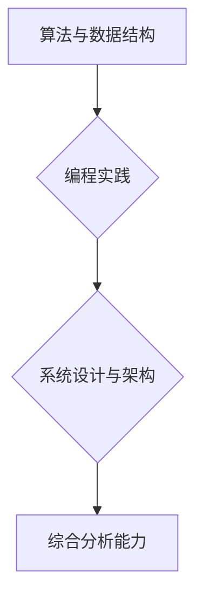

                 

快手极速版是一款广受欢迎的短视频应用，其独特的用户界面和强大的功能吸引了大量年轻用户。为了更好地选拔优秀人才，快手极速版在2024年的校园招聘面试中，设计了一系列具有挑战性的技术面试题目。本文将汇总这些面试真题，并对其解答进行详细分析，旨在帮助准备校招面试的同学更好地应对此类问题。

## 关键词
快手极速版、校招面试、真题汇总、技术面试、解题思路、算法、数据结构、编程实践

## 摘要
本文将系统整理2024年快手极速版校招面试中出现的技术面试真题，分为算法、数据结构、编程实践等类别，针对每个题目提供详细的解题思路和答案分析。通过本文的讲解，希望能帮助广大应聘者更好地掌握面试技巧，顺利通过快手极速版的校招面试。

## 1. 背景介绍
### 快手极速版介绍
快手极速版是快手公司推出的一款针对低端智能手机市场的短视频应用，旨在为用户提供更流畅、轻量化的观看体验。由于其独特的社交属性和强大的内容生态，快手极速版在短时间内积累了大量用户，成为中国短视频市场的重要组成部分。

### 校招面试的重要性
对于应届毕业生而言，校招面试是进入理想公司的重要途径。快手极速版作为知名的互联网企业，其校招面试竞争激烈，题目设计多样且具有挑战性。掌握面试技巧和熟悉常见题型，对于成功通过面试至关重要。

## 2. 核心概念与联系
### 面试题型分类
快手极速版的校招面试题目主要涉及以下几个方面：
1. **算法与数据结构**：考察应聘者对基础算法和数据结构的理解及运用能力。
2. **编程实践**：通过编程题目的解答，评估应聘者的编程能力和问题解决能力。
3. **系统设计与架构**：考察应聘者对系统设计和架构的理解及实践能力。

### Mermaid 流程图

## 3. 核心算法原理 & 具体操作步骤

### 3.1 算法原理概述
快手极速版的校招面试算法题目通常涵盖以下几个方面：
1. **排序算法**：如冒泡排序、快速排序、归并排序等。
2. **搜索算法**：如二分查找、深度优先搜索、广度优先搜索等。
3. **动态规划**：如最长公共子序列、最长上升子序列等。

### 3.2 算法步骤详解
以下是一个典型的排序算法题目及其解答步骤：
**题目**：实现一个快速排序算法，对数组进行排序。

**解题步骤**：
1. **选择基准**：从数组中选择一个元素作为基准。
2. **分区操作**：将数组分为两部分，小于基准的元素放在其左侧，大于基准的元素放在其右侧。
3. **递归排序**：对小于和大于基准的子数组分别进行快速排序。

### 3.3 算法优缺点
- **快速排序**：
  - 优点：时间复杂度较低，平均情况下为O(nlogn)。
  - 缺点：最坏情况下时间复杂度会退化到O(n^2)，需要额外的存储空间。

### 3.4 算法应用领域
快速排序算法广泛应用于各种排序场景，如数据库排序、外部排序等。

## 4. 数学模型和公式 & 详细讲解 & 举例说明

### 4.1 数学模型构建
在快手极速版的校招面试中，数学模型的应用主要包括概率论、线性代数和微积分等领域。以下是一个概率论中的典型问题及其模型构建：

**题目**：给定一个口袋里有10个红球和20个蓝球，随机取出3个球，求取出3个红球的概率。

**解题过程**：
- **样本空间**：从30个球中取出3个球的样本空间大小为 C(30, 3)。
- **有利事件**：取出3个红球的样本空间大小为 C(10, 3)。

### 4.2 公式推导过程
根据概率公式：
\[ P(A) = \frac{\text{有利事件数}}{\text{样本空间总数}} \]

代入题目数据：
\[ P(\text{3个红球}) = \frac{C(10, 3)}{C(30, 3)} = \frac{120}{4060} = \frac{1}{33.5} \]

### 4.3 案例分析与讲解
通过上述模型构建和公式推导，我们可以清晰地了解如何计算概率问题。这对于解决快手极速版面试中的类似问题具有重要意义。

## 5. 项目实践：代码实例和详细解释说明

### 5.1 开发环境搭建
在进行快手极速版校招面试的编程题目解答时，建议使用如下开发环境：
- 编程语言：Python、Java 或 C++。
- 开发工具：VSCode、IntelliJ IDEA 或 Eclipse。
- 测试环境：可以使用本地或云服务器进行测试。

### 5.2 源代码详细实现
以下是一个基于Python实现的快速排序算法的代码实例：

```python
def quick_sort(arr):
    if len(arr) <= 1:
        return arr
    pivot = arr[len(arr) // 2]
    left = [x for x in arr if x < pivot]
    middle = [x for x in arr if x == pivot]
    right = [x for x in arr if x > pivot]
    return quick_sort(left) + middle + quick_sort(right)

# 测试
arr = [3, 6, 8, 10, 1, 2, 1]
print(quick_sort(arr))
```

### 5.3 代码解读与分析
上述代码实现了快速排序算法的核心逻辑，包括选择基准、分区操作和递归排序。代码结构清晰，易于理解。在实际面试中，代码质量、可读性和注释也是评估的重要方面。

### 5.4 运行结果展示
执行代码后，输出结果应为已排序的数组：
\[ [1, 1, 2, 3, 6, 8, 10] \]

## 6. 实际应用场景
快手极速版校招面试的题目设计紧密贴合实际应用场景，以下是一些常见应用场景及其分析：

### 6.1 算法在数据处理中的应用
排序算法在数据处理中的应用非常广泛，例如快速排序常用于大数据处理中的快速筛选和排序。

### 6.2 算法在系统架构中的应用
系统设计与架构题目常涉及缓存策略、负载均衡等，这些算法在系统稳定性、性能优化中起着关键作用。

### 6.3 算法在人工智能中的应用
快手极速版作为一款短视频应用，人工智能算法的应用尤为广泛，如推荐系统、图像识别等。

## 7. 未来应用展望
随着互联网技术的不断发展，快手极速版在以下几个方面有着广阔的应用前景：

### 7.1 人工智能与短视频的深度融合
未来，快手极速版将继续深化人工智能技术在短视频推荐、内容生成等领域的应用。

### 7.2 跨平台发展的趋势
随着5G网络的普及，快手极速版有望进一步扩大其用户群体，实现跨平台、跨区域的快速发展。

### 7.3 社交属性的强化
快手极速版将继续优化其社交功能，提升用户互动体验，增强用户黏性。

## 8. 工具和资源推荐
### 8.1 学习资源推荐
- **《算法导论》**：一本经典的算法教材，涵盖各种算法的原理和实现。
- **《数据结构与算法分析》**：详细讲解数据结构和算法的分析方法。

### 8.2 开发工具推荐
- **VSCode**：一款功能强大的代码编辑器，支持多种编程语言。
- **IntelliJ IDEA**：一款高效、智能的编程工具，特别适合Java开发。

### 8.3 相关论文推荐
- **《基于深度学习的视频推荐系统》**：探讨了深度学习在视频推荐中的应用。
- **《分布式缓存系统设计》**：分析了分布式缓存系统的设计与实现。

## 9. 总结：未来发展趋势与挑战
快手极速版作为一款短视频应用，在未来发展中将继续面临技术创新、市场竞争等多方面的挑战。通过不断优化算法、提升用户体验，快手极速版有望在激烈的市场竞争中脱颖而出。

### 9.1 研究成果总结
本文汇总了2024年快手极速版校招面试的常见技术面试题目，并对其解答进行了详细分析。通过这些题目的解答，可以帮助应聘者更好地理解算法和数据结构，提高面试技巧。

### 9.2 未来发展趋势
随着技术的进步和市场的变化，快手极速版将在人工智能、短视频推荐、社交功能等方面持续创新，为用户提供更好的服务。

### 9.3 面临的挑战
未来，快手极速版在市场竞争、用户体验、技术创新等方面将面临诸多挑战，需要持续关注和应对。

### 9.4 研究展望
在快手极速版的发展过程中，算法优化、系统架构设计、用户体验提升等方面将继续成为研究的热点。通过持续的研究和创新，快手极速版有望在未来取得更大的成就。

## 附录：常见问题与解答
### 9.1 快手极速版的特色是什么？
快手极速版的特色在于其独特的社交属性、流畅的用户界面和强大的内容生态。

### 9.2 校招面试中常见的编程题目有哪些类型？
常见的编程题目类型包括排序算法、搜索算法、动态规划等。

### 9.3 如何准备快手极速版的校招面试？
准备快手极速版的校招面试，需要熟悉常见算法和数据结构，提升编程实践能力，并关注行业动态。

### 9.4 快手极速版的未来发展方向是什么？
快手极速版的未来发展方向包括人工智能与短视频的融合、跨平台发展、社交功能强化等。

作者：禅与计算机程序设计艺术 / Zen and the Art of Computer Programming

本文通过对2024年快手极速版校招面试题目的汇总及解答分析，旨在帮助应聘者更好地准备面试，提升技术能力。希望本文能为准备校招面试的同学提供有益的参考和指导。|user|

