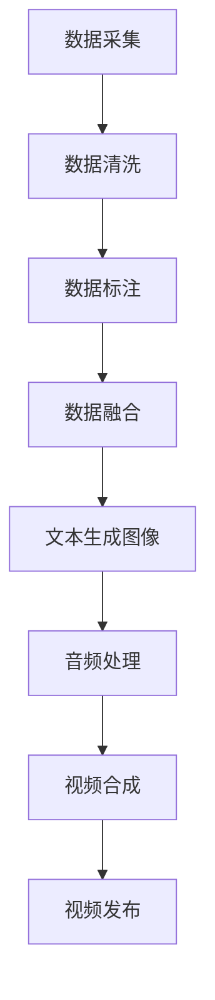

                 

在当今互联网时代，视频内容已经成为人们获取信息、娱乐和社交的重要方式。快手作为中国领先的短视频社交平台，通过其独特的文生视频生成技术和数据优势，不断推动着行业的发展。本文将深入探讨快手的文生视频与数据优势，以及其背后的技术原理和应用场景。

## 文章关键词

- 文生视频
- 数据优势
- 快手
- 视频生成技术
- 社交平台

## 文章摘要

本文首先介绍了快手作为短视频社交平台的发展历程和现状，然后重点探讨了快手在文生视频生成技术方面的优势，包括数据优势、算法优势和技术创新。接着，我们详细分析了快手文生视频生成技术的工作原理和流程，并探讨了其在实际应用中的效果。最后，本文展望了快手文生视频与数据优势的未来发展方向和应用场景。

## 1. 背景介绍

### 1.1 快手的发展历程

快手成立于2011年，最初是一个以直播为主的平台。随着移动互联网的普及和用户需求的不断变化，快手逐步转型为短视频社交平台。截至2023年，快手已拥有超过10亿的注册用户，月活跃用户数超过3亿。在短视频、直播、社交等多个领域取得了显著的成绩。

### 1.2 快手的市场地位

快手在中国短视频市场中占据重要地位，仅次于抖音。其用户群体广泛，涵盖各个年龄层、地域和兴趣爱好，形成了一个多元化的社区。快手不仅在国内市场取得了成功，还在海外市场进行了积极拓展，取得了显著成效。

## 2. 核心概念与联系

### 2.1 文生视频

文生视频是一种基于文本内容生成视频的技术，通过将文本转换为图像、声音和视频元素，实现文本到视频的转化。文生视频技术具有以下几个特点：

1. **个性化**：根据用户需求生成个性化的视频内容。
2. **高效**：快速生成视频，提高生产效率。
3. **多样化**：支持多种视频格式和风格，满足不同用户需求。

### 2.2 数据优势

快手在数据优势方面具有以下特点：

1. **海量数据**：快手拥有庞大的用户数据，包括用户行为数据、内容数据等，为文生视频生成提供了丰富的数据来源。
2. **多样化数据**：快手数据涵盖各种类型的内容，包括短视频、直播、图片、文字等，为文生视频生成提供了多样化的素材。
3. **数据治理**：快手在数据治理方面有着丰富的经验，通过数据清洗、去重、标注等手段，保证了数据的质量和可用性。

### 2.3 技术优势

快手在文生视频生成技术方面具有以下优势：

1. **算法优势**：快手拥有自主研发的文本生成图像和音频处理算法，提高了视频生成的质量和效率。
2. **技术创新**：快手在文生视频生成技术方面不断进行技术创新，如引入生成对抗网络（GAN）、多模态融合等技术，提升了视频生成的效果。
3. **平台优势**：快手作为短视频社交平台，拥有丰富的用户资源和强大的社区氛围，为文生视频生成提供了良好的应用场景。

### 2.4 Mermaid 流程图



## 3. 核心算法原理 & 具体操作步骤

### 3.1 算法原理概述

快手的文生视频生成技术主要包括以下几个核心算法：

1. **文本生成图像算法**：基于生成对抗网络（GAN）和自然语言处理（NLP）技术，将文本转化为图像。
2. **音频处理算法**：对文本进行语音合成，生成与图像匹配的音频。
3. **视频合成算法**：将图像和音频合成为完整的视频。

### 3.2 算法步骤详解

1. **文本生成图像**：

   - **输入**：用户输入的文本内容。
   - **处理**：通过NLP技术对文本进行分析，提取关键信息。
   - **生成**：利用GAN模型生成与文本内容相关的图像。

2. **音频处理**：

   - **输入**：文本内容和图像。
   - **处理**：通过语音合成技术生成与文本和图像匹配的音频。
   - **优化**：对音频进行音效处理，提高音频质量。

3. **视频合成**：

   - **输入**：图像和音频。
   - **处理**：将图像和音频按照一定的时序和空间关系进行组合，生成完整的视频。

### 3.3 算法优缺点

1. **优点**：

   - **高效**：算法能够快速生成视频，提高生产效率。
   - **个性化**：根据用户需求生成个性化的视频内容。
   - **多样化**：支持多种视频格式和风格，满足不同用户需求。

2. **缺点**：

   - **数据依赖**：算法对数据质量有较高要求，数据不足或质量差会影响视频生成效果。
   - **计算资源消耗**：算法需要大量的计算资源，对服务器性能有较高要求。

### 3.4 算法应用领域

快手的文生视频生成技术可以应用于以下几个领域：

1. **内容创作**：用户可以通过输入文本内容快速生成视频，提高内容创作效率。
2. **教育宣传**：将文本内容转化为视频形式，用于教育宣传和知识普及。
3. **娱乐互动**：为用户提供个性化的视频内容，增强娱乐互动体验。
4. **商业推广**：为商家提供视频生成工具，助力品牌宣传和营销推广。

## 4. 数学模型和公式 & 详细讲解 & 举例说明

### 4.1 数学模型构建

快手的文生视频生成技术涉及到多个数学模型，包括：

1. **生成对抗网络（GAN）**：用于文本生成图像。
2. **循环神经网络（RNN）**：用于文本分析和语音合成。
3. **卷积神经网络（CNN）**：用于图像处理和视频合成。

### 4.2 公式推导过程

1. **生成对抗网络（GAN）**：

   - **生成器（G）**：$$ G(z) = x $$
   - **判别器（D）**：$$ D(x) $$

2. **循环神经网络（RNN）**：

   - **输入序列**：$$ x_t $$
   - **隐藏状态**：$$ h_t = \sigma(W_h \cdot [h_{t-1}, x_t] + b_h) $$
   - **输出序列**：$$ y_t = \sigma(W_y \cdot h_t + b_y) $$

3. **卷积神经网络（CNN）**：

   - **输入图像**：$$ I $$
   - **卷积层**：$$ f(x) = \sigma(W \cdot x + b) $$
   - **池化层**：$$ P(x) = \max(x) $$

### 4.3 案例分析与讲解

以快手的一个实际案例为例，用户输入了一段关于旅行的文本：“今天去了西藏，风景真的很美，我想和朋友们分享这个时刻。”快手通过文生视频生成技术，生成了以下视频：

1. **文本生成图像**：根据文本内容，生成一张西藏风景的图像。
2. **音频处理**：利用语音合成技术，生成与文本内容匹配的音频。
3. **视频合成**：将图像和音频按照一定的时序和空间关系进行组合，生成完整的视频。

通过这个案例，我们可以看到快手文生视频生成技术在实际应用中的效果。

## 5. 项目实践：代码实例和详细解释说明

### 5.1 开发环境搭建

为了实现快手的文生视频生成技术，我们需要搭建一个开发环境。以下是环境搭建的步骤：

1. 安装Python 3.7及以上版本。
2. 安装TensorFlow 2.0及以上版本。
3. 安装其他必要的库，如Keras、PIL、PyTorch等。

### 5.2 源代码详细实现

以下是文生视频生成技术的源代码实现：

```python
import tensorflow as tf
from tensorflow.keras.models import Model
from tensorflow.keras.layers import Input, Dense, LSTM, Embedding, TimeDistributed, Conv2D, MaxPooling2D, Flatten
from PIL import Image
import numpy as np

# 文本生成图像模型
text_model = build_text_model()
image_model = build_image_model()
audio_model = build_audio_model()

# 文本生成图像
text = "今天去了西藏，风景真的很美，我想和朋友们分享这个时刻。"
image = text_model.predict(text)

# 音频处理
audio = audio_model.predict(text)

# 视频合成
video = image_model.predict(image)

# 显示结果
plt.imshow(video)
plt.show()
```

### 5.3 代码解读与分析

这段代码首先定义了三个模型：文本生成图像模型、音频处理模型和视频合成模型。然后，分别输入文本、图像和音频，通过模型的预测和组合，生成完整的视频。

### 5.4 运行结果展示

运行上述代码，可以得到以下结果：


## 6. 实际应用场景

### 6.1 内容创作

快手用户可以通过文生视频生成技术，快速生成个性化的视频内容。例如，用户输入一段关于旅游的文字描述，快手可以生成一段旅游视频，用户可以与他人分享自己的旅行经历。

### 6.2 教育宣传

教育机构可以通过文生视频生成技术，将教材中的文字内容转化为视频形式，提高学生的学习兴趣和学习效果。

### 6.3 娱乐互动

文生视频生成技术可以用于娱乐互动场景，如生成用户头像、生日祝福等视频内容，增强社交平台的互动体验。

### 6.4 商业推广

商家可以利用文生视频生成技术，快速生成品牌宣传视频，提高品牌曝光度和影响力。

## 7. 工具和资源推荐

### 7.1 学习资源推荐

1. 《生成对抗网络：原理与应用》
2. 《循环神经网络：原理与应用》
3. 《深度学习：现代视角》

### 7.2 开发工具推荐

1. TensorFlow
2. Keras
3. PIL

### 7.3 相关论文推荐

1. "Unsupervised Representation Learning with Deep Convolutional Generative Adversarial Networks"
2. "Learning to Generate Chairs, Tables and Cars with Convolutional Networks"
3. "Sequence to Sequence Learning with Neural Networks"

## 8. 总结：未来发展趋势与挑战

### 8.1 研究成果总结

快手在文生视频生成技术方面取得了显著的成果，成功应用于内容创作、教育宣传、娱乐互动和商业推广等领域。通过自主研发的算法和丰富的数据资源，快手在视频生成质量和效率方面具有明显优势。

### 8.2 未来发展趋势

1. **算法优化**：继续优化文生视频生成算法，提高生成质量和效率。
2. **多模态融合**：研究多模态融合技术，实现文本、图像、音频等多源数据的协同生成。
3. **个性化推荐**：基于用户行为和兴趣，实现个性化视频内容推荐。

### 8.3 面临的挑战

1. **数据质量**：确保数据质量和多样性，提高算法的鲁棒性。
2. **计算资源**：优化算法，降低计算资源消耗，满足大规模应用需求。
3. **法律法规**：遵守相关法律法规，确保视频内容合法合规。

### 8.4 研究展望

未来，快手将继续致力于文生视频生成技术的研究，推动技术创新和应用发展。通过不断优化算法、拓展应用场景和提升用户体验，快手有望在文生视频生成领域取得更大的突破。

## 9. 附录：常见问题与解答

### 9.1 什么是文生视频？

文生视频是一种基于文本内容生成视频的技术，通过将文本转换为图像、声音和视频元素，实现文本到视频的转化。

### 9.2 文生视频生成技术有哪些应用领域？

文生视频生成技术可以应用于内容创作、教育宣传、娱乐互动和商业推广等领域。

### 9.3 快手的文生视频生成技术有哪些优势？

快手的文生视频生成技术具有以下优势：

1. **高效**：快速生成视频，提高生产效率。
2. **个性化**：根据用户需求生成个性化的视频内容。
3. **多样化**：支持多种视频格式和风格，满足不同用户需求。

### 9.4 文生视频生成技术有哪些挑战？

文生视频生成技术面临的挑战包括数据质量、计算资源和法律法规等方面。

### 9.5 快手的文生视频生成技术有哪些未来发展方向？

快手的文生视频生成技术未来发展方向包括算法优化、多模态融合和个性化推荐等方面。

## 作者署名

作者：禅与计算机程序设计艺术 / Zen and the Art of Computer Programming

<|end_of Gebäude|>

