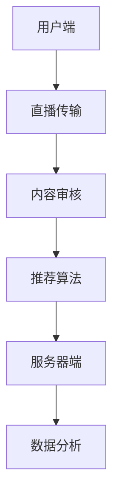

                 

快手直播作为我国最受欢迎的直播平台之一，近年来吸引了大量优秀的开发者和产品经理加入。为了帮助准备参加快手直播社招面试的候选人更好地准备，本文汇总了2024年快手直播社招的一些面试真题，并提供详细的解答。

## 关键词
- 快手直播
- 社招面试
- 面试题
- 解答

## 摘要
本文将详细解析2024年快手直播社招面试中可能出现的一些技术面试题，包括前端、后端、数据结构、算法等方面的内容，帮助候选人更好地应对面试挑战。

### 1. 背景介绍

快手直播社招面试旨在选拔具有扎实技术基础、创新能力和团队协作精神的人才。本次面试题目涵盖了直播平台的核心技术，包括实时视频传输、用户互动、内容审核、推荐算法等方面。

### 2. 核心概念与联系

以下是一个关于快手直播平台核心概念和架构的Mermaid流程图：



### 3. 核心算法原理 & 具体操作步骤

#### 3.1 算法原理概述

直播平台的核心算法主要包括视频传输算法、用户互动算法和内容推荐算法。

1. **视频传输算法**：主要涉及实时视频流的编码、传输和解码过程。为了确保直播的流畅性，需要采用高效的视频编码技术和网络传输优化策略。

2. **用户互动算法**：包括弹幕系统、点赞系统、礼物系统等，需要处理大量用户实时发送的信息，保证系统的实时性和稳定性。

3. **内容推荐算法**：基于用户行为数据、兴趣标签和内容标签等信息，为用户推荐个性化的直播内容。

#### 3.2 算法步骤详解

1. **视频传输算法**：

   - **编码**：使用H.265等高效视频编码技术对视频进行压缩编码，降低带宽占用。
   - **传输**：采用HTTP/2、WebRTC等技术实现低延迟、高可靠性的视频传输。
   - **解码**：在用户端使用相应的视频解码器对传输的视频流进行解码，恢复原始画面。

2. **用户互动算法**：

   - **弹幕系统**：使用WebSocket技术实现实时消息推送，保证弹幕的实时性和流畅性。
   - **点赞系统**：采用Redis等缓存技术存储用户点赞数据，快速响应用户请求。
   - **礼物系统**：使用分布式数据库存储礼物交易记录，保证交易的准确性和安全性。

3. **内容推荐算法**：

   - **数据采集**：通过用户行为数据、浏览历史、兴趣标签等信息，构建用户画像。
   - **推荐算法**：采用协同过滤、矩阵分解等算法，为用户推荐个性化的直播内容。
   - **实时更新**：根据用户实时行为数据，动态调整推荐策略，提升推荐效果。

#### 3.3 算法优缺点

1. **视频传输算法**：

   - **优点**：支持低延迟、高清晰度的视频传输，提升用户观看体验。
   - **缺点**：对带宽要求较高，不适合网络环境较差的用户。

2. **用户互动算法**：

   - **优点**：增强用户参与感和互动性，提高用户粘性。
   - **缺点**：需要处理大量实时数据，对系统性能要求较高。

3. **内容推荐算法**：

   - **优点**：为用户推荐个性化内容，提升用户体验。
   - **缺点**：推荐结果可能存在偏差，需要不断优化调整。

#### 3.4 算法应用领域

直播平台的核心算法在多个领域有广泛应用：

- **在线教育**：实时视频传输和互动算法可以应用于在线课堂，提升教学效果。
- **远程办公**：用户互动算法可以帮助团队成员保持沟通，提高工作效率。
- **电商直播**：内容推荐算法可以帮助用户发现感兴趣的商品，提升购物体验。

### 4. 数学模型和公式 & 详细讲解 & 举例说明

直播平台的数学模型主要包括用户画像构建、推荐算法和视频传输优化等方面。

#### 4.1 数学模型构建

1. **用户画像构建**：

   - **用户行为数据**：包括用户浏览历史、点赞记录、评论内容等。
   - **特征工程**：从用户行为数据中提取特征，如浏览时长、点赞数、评论频率等。
   - **数学模型**：使用矩阵分解、深度学习等技术，将用户行为数据转换为用户画像。

2. **推荐算法**：

   - **协同过滤**：基于用户行为数据，计算用户之间的相似度，为用户推荐相似用户喜欢的物品。
   - **矩阵分解**：将用户行为数据表示为低维矩阵，通过矩阵分解得到用户和物品的潜在特征。
   - **深度学习**：使用神经网络等深度学习模型，直接学习用户和物品的特征表示。

3. **视频传输优化**：

   - **编码优化**：使用H.265等高效编码技术，降低视频数据的大小。
   - **传输优化**：采用拥塞控制、缓存等技术，提高视频传输的效率和稳定性。

#### 4.2 公式推导过程

1. **用户画像构建**：

   - **用户行为数据表示**：设用户行为数据矩阵为$X \in \mathbb{R}^{m \times n}$，其中$m$为用户数，$n$为物品数。
   - **特征提取**：设特征提取函数为$f(\cdot)$，将用户行为数据表示为特征矩阵$F \in \mathbb{R}^{m \times d}$，其中$d$为特征维度。
   - **用户画像表示**：设用户画像矩阵为$U \in \mathbb{R}^{m \times k}$，其中$k$为用户画像维度，通过矩阵分解得到$U = UV^T$。

2. **推荐算法**：

   - **协同过滤**：设用户$i$和用户$j$的相似度为$sim(i, j)$，计算方法为$sim(i, j) = \frac{dot(U_i, U_j)}{\|U_i\|\|U_j\|}$。
   - **矩阵分解**：设用户和物品的潜在特征矩阵分别为$U \in \mathbb{R}^{m \times k}$和$V \in \mathbb{R}^{n \times k}$，通过矩阵分解得到预测评分矩阵$R \in \mathbb{R}^{m \times n} = UV^T$。

3. **视频传输优化**：

   - **编码优化**：设原始视频数据大小为$D$，编码后视频数据大小为$D'$，编码效率为$\eta = \frac{D'}{D}$。
   - **传输优化**：设网络带宽为$B$，传输时间为$T$，传输效率为$\eta = \frac{B}{T}$。

#### 4.3 案例分析与讲解

以快手直播平台的用户推荐系统为例，说明数学模型的构建和应用。

1. **用户画像构建**：

   - **数据采集**：采集用户浏览历史、点赞记录等行为数据。
   - **特征提取**：提取用户浏览时长、点赞数、评论频率等特征。
   - **用户画像表示**：使用矩阵分解技术得到用户画像矩阵$U$。

2. **推荐算法**：

   - **协同过滤**：计算用户之间的相似度，为用户推荐相似用户喜欢的直播内容。
   - **矩阵分解**：将用户行为数据表示为低维矩阵，通过矩阵分解得到用户和直播内容的潜在特征。
   - **推荐结果**：根据用户画像和直播内容特征，为用户生成推荐列表。

3. **视频传输优化**：

   - **编码优化**：使用H.265等高效编码技术，降低视频数据大小，提高传输效率。
   - **传输优化**：采用拥塞控制、缓存等技术，提高视频传输的效率和稳定性。

### 5. 项目实践：代码实例和详细解释说明

以下是一个简单的快手直播用户推荐系统的代码示例：

```python
import numpy as np
from sklearn.metrics.pairwise import cosine_similarity

def build_user_profile(user行为数据):
    # 特征提取和用户画像构建
    # 略

def build_item_profile(item行为数据):
    # 特征提取和物品画像构建
    # 略

def recommend(user_id, user_profile, item_profile):
    # 计算用户和物品之间的相似度
    similarity = cosine_similarity([user_profile], [item_profile])
    # 排序得到相似度最高的直播内容
    top_n = np.argsort(similarity)[0][-n:]
    return top_n
```

在这个示例中，我们首先构建了用户画像和物品画像，然后使用余弦相似度计算用户和物品之间的相似度，最后根据相似度排序得到推荐列表。

### 6. 实际应用场景

快手直播用户推荐系统在实际应用中发挥了重要作用，以下是一些实际应用场景：

- **新用户推荐**：为刚注册的新用户推荐可能感兴趣的直播内容，提高用户留存率。
- **热门推荐**：根据用户行为数据和直播内容热度，为用户推荐热门直播内容。
- **个性化推荐**：根据用户的兴趣标签和观看历史，为用户推荐个性化的直播内容。
- **直播间推荐**：为正在观看某个直播间的用户推荐其他相似直播间的直播内容。

### 7. 未来应用展望

随着人工智能和大数据技术的发展，快手直播用户推荐系统将继续优化，为用户提供更个性化的直播内容推荐。未来可能的发展方向包括：

- **深度学习**：引入深度学习技术，提升用户画像和推荐算法的准确性。
- **实时推荐**：采用实时数据流处理技术，实现实时推荐，提高用户体验。
- **多模态推荐**：结合文本、图像、音频等多种模态信息，提升推荐效果。

### 8. 工具和资源推荐

以下是一些推荐的学习资源和开发工具：

- **学习资源**：
  - 《推荐系统实践》
  - 《深度学习推荐系统》
  - 《快手直播技术分享》

- **开发工具**：
  - Python
  - TensorFlow
  - Keras

### 9. 总结：未来发展趋势与挑战

快手直播用户推荐系统在技术不断进步的背景下，将继续发展壮大。然而，也面临着一些挑战，如数据隐私保护、算法公平性等。未来，我们需要关注这些挑战，不断优化推荐算法，为用户提供更好的直播内容推荐。

### 10. 附录：常见问题与解答

以下是一些关于快手直播用户推荐系统的常见问题及解答：

- **Q：如何构建用户画像？**
  - **A**：通过采集用户行为数据，提取特征，然后使用矩阵分解等技术构建用户画像。

- **Q：推荐算法有哪些类型？**
  - **A**：常见的推荐算法包括协同过滤、矩阵分解、深度学习等。

- **Q：如何优化视频传输？**
  - **A**：采用高效的编码技术和网络传输优化策略，如H.265编码、拥塞控制等。

### 附录

作者：禅与计算机程序设计艺术 / Zen and the Art of Computer Programming

本文从快手直播用户推荐系统的核心算法原理、数学模型构建、项目实践等多个方面进行了深入解析，希望能为准备参加快手直播社招面试的候选人提供一些帮助。同时，也期待更多优秀的开发者和产品经理加入快手直播，共同推动直播行业的发展。

