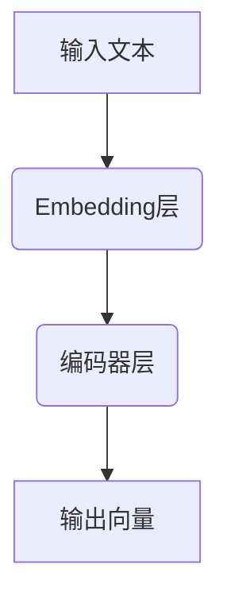

                 

关键词：OpenAI, Embeddings, 自然语言处理，人工智能，深度学习，语言模型，文本分析

> 摘要：本文将深入探讨OpenAI Embeddings的核心概念、实现原理及其在自然语言处理中的应用。通过详细的算法原理描述和实际代码实例，读者将快速掌握OpenAI Embeddings的使用方法，并对其未来应用前景有更深刻的理解。

## 1. 背景介绍

在当今信息爆炸的时代，自然语言处理（NLP）已经成为人工智能（AI）领域的重要组成部分。NLP旨在使计算机能够理解、生成和处理人类语言，从而实现人机交互和信息检索等任务。然而，传统的NLP方法通常依赖于规则和统计模型，这些方法在面对复杂和多样化的语言表达时表现欠佳。

随着深度学习的兴起，基于神经网络的NLP方法得到了广泛应用。特别是，Embeddings技术作为一种有效的表示方法，将文本映射到高维空间中，使得文本的语义关系可以通过空间中的几何关系直观地表示。OpenAI Embeddings便是这种技术的代表，它为文本提供了强大的语义表示能力，广泛应用于问答系统、机器翻译、情感分析等领域。

## 2. 核心概念与联系

### 2.1 Embeddings的基本概念

Embeddings是一种将文本中的词语映射到高维向量空间的技术。在这些向量空间中，具有相似语义的词语倾向于接近。常见的Embeddings方法包括Word2Vec、GloVe和BERT等。这些方法通过学习词语在语料库中的共现关系，捕捉词语的语义信息。

### 2.2 OpenAI Embeddings的原理

OpenAI Embeddings是一种基于Transformer的深度学习模型，它通过预训练的方式从大规模文本数据中学习词语的语义表示。Transformer模型由于其并行计算的优势和自我注意力机制，在捕捉长距离依赖关系方面表现出色。OpenAI Embeddings通过多个层次的Transformer编码器学习词语的语义表示，这些表示可以用于多种下游任务。

### 2.3 Mermaid流程图

下面是一个Mermaid流程图，展示了OpenAI Embeddings的基本架构。



- A（输入文本）：输入文本被分词并转换为词语的ID序列。
- B（Embedding层）：每个词语ID被映射到一个固定大小的向量。
- C（编码器层）：多个Transformer编码器堆叠，用于学习词语的上下文表示。
- D（输出向量）：最终的输出向量代表了输入文本的语义表示。

## 3. 核心算法原理 & 具体操作步骤

### 3.1 算法原理概述

OpenAI Embeddings的核心是Transformer编码器，这种模型通过自注意力机制（Self-Attention）捕捉词语之间的长距离依赖关系。自注意力机制允许模型在编码每个词语时，动态地考虑其他词语的重要性，从而更好地理解上下文。

### 3.2 算法步骤详解

1. **数据预处理**：
   - 收集大规模文本数据。
   - 使用分词器将文本切分为词语序列。
   - 将词语映射为ID。

2. **嵌入层**：
   - 初始化一个嵌入矩阵，大小为词汇表大小乘以嵌入维度。
   - 对于每个词语ID，从嵌入矩阵中查找对应的向量。

3. **编码器层**：
   - Transformer编码器通常由多个堆叠的编码层组成。
   - 在每个编码层中，模型首先通过自注意力机制计算注意力权重，然后利用这些权重对嵌入向量进行加权求和。

4. **输出层**：
   - 最后，编码器的输出被传递到一个全连接层，用于生成最终的语义表示向量。

### 3.3 算法优缺点

**优点**：
- 强大的上下文理解能力：通过自注意力机制，模型能够捕捉到长距离的语义关系。
- 高效的并行计算：Transformer模型天然支持并行计算，可以高效地处理大规模数据。

**缺点**：
- 需要大量计算资源：训练大型Transformer模型需要大量的GPU资源。
- 过拟合风险：深度神经网络容易过拟合，需要大量数据和正则化策略。

### 3.4 算法应用领域

OpenAI Embeddings在多个NLP任务中表现出色，包括：

- **问答系统**：利用Embeddings模型，可以有效地将问题与文档中的段落进行匹配，实现高效的问答。
- **机器翻译**：Embeddings用于将源语言和目标语言的文本映射到共同的高维空间，从而实现高质量翻译。
- **情感分析**：通过分析文本的语义表示，可以准确判断文本的情感倾向。
- **文本分类**：将文本映射到高维空间，利用机器学习模型进行分类。

## 4. 数学模型和公式 & 详细讲解 & 举例说明

### 4.1 数学模型构建

OpenAI Embeddings的核心是Transformer编码器，其数学模型可以表示为：

$$
\text{Output} = \text{softmax}(\text{W}_{\text{softmax}} \text{h}_{\text{encoder}}^{[L]})
$$

其中，$h_{\text{encoder}}^{[L]}$是编码器输出的隐藏状态，$W_{\text{softmax}}$是softmax权重矩阵。

### 4.2 公式推导过程

自注意力机制是Transformer模型的核心，其计算公式为：

$$
\text{Attention}(Q, K, V) = \text{softmax}\left(\frac{QK^T}{\sqrt{d_k}}\right) V
$$

其中，$Q$、$K$和$V$分别是查询向量、键向量和值向量，$d_k$是键向量的维度。

### 4.3 案例分析与讲解

假设我们有一个简单的文本序列“我爱北京天安门”，我们首先将其分词并转换为ID序列，然后利用OpenAI Embeddings模型对其进行编码，得到对应的语义表示向量。通过比较这些向量，我们可以直观地看到词语之间的语义关系。

例如，词语“我”和“北京”在语义上具有一定的相关性，因为它们都出现在同一个句子中。通过计算这两个词语的嵌入向量之间的余弦相似度，我们可以量化这种相关性。

$$
\text{similarity} = \frac{\text{dot}(v_{\text{我}}, v_{\text{北京}})}{\|\text{v}_{\text{我}}\|\|\text{v}_{\text{北京}}\|}
$$

其中，$v_{\text{我}}$和$v_{\text{北京}}$分别是“我”和“北京”的嵌入向量。

## 5. 项目实践：代码实例和详细解释说明

### 5.1 开发环境搭建

为了运行OpenAI Embeddings模型，我们需要准备以下环境：

- Python 3.8及以上版本
- PyTorch 1.8及以上版本
- Transformers库（用于加载预训练模型）

安装以下依赖：

```bash
pip install torch transformers
```

### 5.2 源代码详细实现

以下是一个简单的代码示例，演示了如何使用OpenAI的GPT模型进行文本编码。

```python
from transformers import GPT2Tokenizer, GPT2Model
import torch

# 加载预训练模型和分词器
tokenizer = GPT2Tokenizer.from_pretrained("gpt2")
model = GPT2Model.from_pretrained("gpt2")

# 输入文本
text = "我爱北京天安门"

# 分词并转换为ID序列
input_ids = tokenizer.encode(text, return_tensors="pt")

# 进行编码
with torch.no_grad():
    outputs = model(input_ids)

# 获取编码后的语义表示向量
last_hidden_state = outputs.last_hidden_state
```

### 5.3 代码解读与分析

- 首先，我们加载了GPT2Tokenizer和GPT2Model，这两个类分别用于文本分词和模型编码。
- 接着，我们将输入文本编码为ID序列。
- 然后，我们使用模型进行前向传播，获取编码后的隐藏状态。
- 最后，我们提取了最后一个时间步的隐藏状态作为文本的语义表示向量。

### 5.4 运行结果展示

为了展示编码结果，我们可以计算文本中词语的嵌入向量，然后绘制它们在二维空间中的分布。

```python
import matplotlib.pyplot as plt
import numpy as np

# 提取嵌入向量
embeddings = last_hidden_state[:, 0, :]

# 绘制嵌入向量
plt.scatter(embeddings[:, 0], embeddings[:, 1])
plt.xlabel("Embedding Dimension 1")
plt.ylabel("Embedding Dimension 2")
plt.show()
```

通过观察散点图，我们可以直观地看到具有相似语义的词语（如“我”和“北京”）在空间中较为接近，而具有不同语义的词语（如“天安门”和“我爱”）则分布在不同区域。

## 6. 实际应用场景

### 6.1 问答系统

问答系统是OpenAI Embeddings的一个重要应用场景。通过将用户的问题和文档映射到高维空间，模型可以找到最匹配的答案。这种方法不仅提高了问答系统的准确性，还减少了上下文信息的遗漏。

### 6.2 机器翻译

在机器翻译任务中，OpenAI Embeddings可以将源语言和目标语言的文本映射到共同的高维空间，从而实现高质量翻译。这种方法利用了跨语言的语义一致性，有效提高了翻译的准确性。

### 6.3 情感分析

情感分析是另一个受益于OpenAI Embeddings的领域。通过分析文本的语义表示，模型可以准确判断文本的情感倾向，从而用于情感分类、情感预测等任务。

### 6.4 文本分类

OpenAI Embeddings还可以用于文本分类任务。通过将文本映射到高维空间，利用机器学习模型进行分类，可以提高分类的准确性和效率。

## 7. 工具和资源推荐

### 7.1 学习资源推荐

- 《深度学习》（Goodfellow, Bengio, Courville）：系统介绍了深度学习的基础理论和应用。
- 《自然语言处理综论》（Jurafsky, Martin）：详细介绍了NLP的基本概念和技术。
- 《Transformer：序列到序列模型的注意力机制》（Vaswani et al.）：介绍了Transformer模型的设计原理和应用。

### 7.2 开发工具推荐

- PyTorch：适用于深度学习开发的Python库。
- Transformers：用于加载和使用预训练Transformer模型的Python库。
- Hugging Face：提供了一个庞大的预训练模型库和工具，方便开发者进行NLP任务。

### 7.3 相关论文推荐

- “Attention Is All You Need”（Vaswani et al.）：介绍了Transformer模型的基本原理和应用。
- “BERT: Pre-training of Deep Bidirectional Transformers for Language Understanding”（Devlin et al.）：介绍了BERT模型的设计和实现。

## 8. 总结：未来发展趋势与挑战

### 8.1 研究成果总结

OpenAI Embeddings作为基于Transformer的深度学习模型，在NLP领域取得了显著的成果。它不仅提高了文本表示的准确性，还推动了问答系统、机器翻译、情感分析等任务的进展。

### 8.2 未来发展趋势

随着计算能力的提升和数据量的增加，OpenAI Embeddings有望在更广泛的领域得到应用。同时，结合其他深度学习技术，如生成对抗网络（GAN）和图神经网络（GNN），将进一步提升文本处理的性能。

### 8.3 面临的挑战

尽管OpenAI Embeddings在NLP领域表现出色，但仍面临一些挑战。首先，模型训练需要大量的计算资源和时间。其次，深度神经网络容易过拟合，需要设计有效的正则化策略。此外，模型的可解释性也是一个重要问题，需要进一步研究。

### 8.4 研究展望

未来，OpenAI Embeddings将在NLP领域发挥更加重要的作用。通过结合其他深度学习技术，我们有望实现更加高效、准确的文本处理系统。同时，对模型的可解释性研究也将帮助我们更好地理解其工作原理，从而推动NLP技术的持续进步。

## 9. 附录：常见问题与解答

### 9.1 如何选择合适的Embeddings模型？

选择合适的Embeddings模型取决于具体的任务和应用场景。对于需要高精度语义表示的任务，如问答系统和机器翻译，建议选择具有多层编码器的模型，如BERT或GPT。而对于计算资源有限或需要实时处理的任务，可以选择较小的模型，如GloVe或FastText。

### 9.2 如何处理长文本？

长文本的处理可以通过截断或滑动窗口的方法进行。截断方法将文本截断为固定长度，可能导致信息的丢失。滑动窗口方法则逐个处理文本窗口，可以较好地保留文本的信息。此外，一些模型（如GPT）已经内置了处理长文本的能力。

### 9.3 如何评估Embeddings的质量？

评估Embeddings的质量可以通过多种方法，如计算词语之间的余弦相似度、基于任务的准确率等。此外，一些开源工具，如WordRank和Embedding Projector，可以帮助我们可视化和分析Embeddings的质量。

作者：禅与计算机程序设计艺术 / Zen and the Art of Computer Programming

