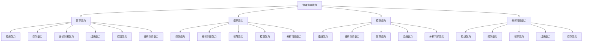

                 

关键词：沟通协调能力、领导能力、组织能力、控制能力、分析判断能力、组织能力培养、专业发展、技能提升

摘要：本文旨在探讨在IT领域内培养优秀沟通协调能力、领导能力、组织能力、控制能力、分析判断能力以及组织能力的方法和策略。通过对这些能力的重要性进行分析，并结合实际案例和具体实践，为读者提供可操作的指导和建议。

## 1. 背景介绍

在快速发展的信息技术领域，个体和团队的能力不仅仅取决于技术技能，还包括沟通协调能力、领导能力、组织能力、控制能力、分析判断能力等多方面的综合素质。随着项目的复杂度和团队协作需求的增加，这些软技能变得愈发重要。本文将从以下几方面深入探讨如何培养这些关键能力：

- **沟通协调能力**：在多任务、多团队协作的IT项目中，良好的沟通协调能力能够确保项目顺利进行，避免误解和冲突。
- **领导能力**：作为团队领导，具备有效的领导能力能够激励团队成员，提高团队的整体绩效。
- **组织能力**：高效的组织能力有助于规划和实施项目，确保资源得到最优配置。
- **控制能力**：通过有效的控制能力，团队能够监控项目进展，及时调整计划，确保项目按时完成。
- **分析判断能力**：在信息技术决策过程中，具备分析判断能力能够帮助团队做出正确的决策，降低风险。
- **组织能力**：灵活调整团队结构和任务分配，以适应不断变化的项目需求。

### 1.1 沟通协调能力的重要性

沟通协调能力是团队协作的基石。在IT项目中，团队成员往往分布在不同的地理位置，甚至可能跨越不同的时区。因此，如何通过有效的沟通协调来确保项目进展，成为团队成功的关键因素。以下是几个关键的沟通协调能力要素：

1. **倾听与表达**：倾听是沟通的基础，良好的表达能力有助于确保信息准确传达。
2. **团队协作**：鼓励团队成员积极参与，共同解决问题。
3. **冲突管理**：及时识别和处理冲突，保持团队和谐。
4. **透明沟通**：确保所有团队成员对项目进展和目标有清晰的认识。

### 1.2 领导能力的重要性

领导能力是团队领导者的核心素质。有效的领导能够激发团队成员的潜力，提高团队效率和创造力。以下是几个关键的领导能力要素：

1. **愿景与目标设定**：明确团队的愿景和目标，确保团队成员朝着共同的方向努力。
2. **激励与反馈**：通过正面的激励和及时的反馈，提高团队成员的工作积极性。
3. **团队建设**：建立积极向上的团队文化，促进团队成员之间的信任和合作。
4. **决策能力**：在复杂多变的项目环境中，做出明智的决策。

### 1.3 组织能力的重要性

组织能力是确保项目顺利实施的必要条件。高效的组织能力能够帮助团队更好地规划项目，管理资源，并有效应对各种挑战。以下是几个关键的组织能力要素：

1. **资源规划**：合理配置人力、物力和财力资源，确保项目需求得到满足。
2. **任务分配**：根据团队成员的专长和能力，合理分配任务。
3. **时间管理**：制定明确的时间表和计划，确保项目按时完成。
4. **风险管理**：识别潜在风险，并制定相应的应对措施。

### 1.4 控制能力的重要性

控制能力是确保项目按计划进行的关键。通过有效的控制，团队能够及时发现并解决问题，确保项目进展顺利。以下是几个关键的控制能力要素：

1. **进度监控**：实时监控项目进展，确保项目按计划进行。
2. **质量保证**：确保项目交付的产品符合质量标准。
3. **成本管理**：监控项目成本，确保项目在预算范围内完成。
4. **变更管理**：对项目变更进行有效管理，确保变更得到合理控制。

### 1.5 分析判断能力的重要性

在信息技术决策过程中，分析判断能力至关重要。具备良好的分析判断能力，团队能够做出明智的决策，降低风险。以下是几个关键的分析判断能力要素：

1. **数据收集与分析**：通过收集和分析数据，识别项目中的问题和机会。
2. **风险评估**：对项目风险进行评估，并制定相应的应对策略。
3. **决策模型**：运用决策模型，辅助团队做出明智的决策。
4. **创新能力**：鼓励团队成员提出创新的解决方案，提高决策质量。

### 1.6 组织能力的重要性

组织能力是确保团队高效运作的基础。通过有效的组织，团队能够更好地应对各种挑战，实现项目目标。以下是几个关键的组织能力要素：

1. **结构设计**：根据项目需求，设计合理的组织结构。
2. **流程优化**：优化工作流程，提高团队工作效率。
3. **角色定位**：明确团队成员的角色和职责，确保团队协作顺畅。
4. **文化建设**：建立积极向上的团队文化，促进团队成员之间的信任和合作。

## 2. 核心概念与联系

在培养上述能力的过程中，理解它们之间的相互联系和作用至关重要。以下是一个使用Mermaid绘制的流程图，展示了这些核心概念之间的联系。



### 2.1 核心概念解析

- **沟通协调能力**：确保团队成员之间信息畅通，减少误解和冲突。
- **领导能力**：激励团队成员，提供方向和目标，建立团队文化。
- **组织能力**：规划项目，配置资源，设计团队结构，优化工作流程。
- **控制能力**：监控项目进展，确保项目按计划进行，管理风险。
- **分析判断能力**：收集数据，评估风险，做出明智的决策。

## 3. 核心算法原理 & 具体操作步骤

### 3.1 算法原理概述

在培养上述能力的过程中，可以采用以下算法原理：

- **沟通协调能力培养算法**：基于社交网络分析的沟通模型，通过优化沟通路径，提高沟通效率。
- **领导能力培养算法**：基于心理学和行为学的激励模型，通过识别团队成员的需求和动机，提供针对性的激励。
- **组织能力培养算法**：基于项目管理理论的优化模型，通过资源分配和任务调度，实现项目最优解。
- **控制能力培养算法**：基于预测和控制理论的监控模型，通过实时数据分析和反馈，实现项目动态调整。
- **分析判断能力培养算法**：基于数据挖掘和机器学习的决策支持模型，通过大数据分析和模型预测，提供决策支持。

### 3.2 算法步骤详解

#### 沟通协调能力培养算法

1. **建立社交网络模型**：收集团队成员的沟通数据，构建社交网络模型。
2. **分析沟通路径**：利用图论算法，分析沟通路径的效率和瓶颈。
3. **优化沟通路径**：根据分析结果，调整沟通路径，提高沟通效率。

#### 领导能力培养算法

1. **收集团队成员数据**：收集团队成员的绩效、态度、行为等数据。
2. **建立激励模型**：根据心理学和行为学理论，构建激励模型。
3. **提供个性化激励**：根据团队成员的需求和动机，提供针对性的激励措施。

#### 组织能力培养算法

1. **项目需求分析**：分析项目需求，明确项目目标和约束条件。
2. **资源分配模型**：构建资源分配模型，优化人力、物力和财力资源的配置。
3. **任务调度算法**：利用调度算法，合理分配任务，确保项目进度。

#### 控制能力培养算法

1. **数据收集**：收集项目进展、成本、质量等数据。
2. **构建监控模型**：根据控制理论，构建监控模型。
3. **实时监控与反馈**：利用实时数据分析，监控项目进展，及时调整计划。

#### 分析判断能力培养算法

1. **数据挖掘**：利用数据挖掘技术，从大量数据中提取有价值的信息。
2. **建立决策模型**：根据决策理论，建立决策模型。
3. **提供决策支持**：通过模型预测和分析，为团队提供决策支持。

### 3.3 算法优缺点

#### 沟通协调能力培养算法

**优点**：能够提高团队沟通效率，减少误解和冲突。

**缺点**：在大型团队中，社交网络模型构建和维护成本较高。

#### 领导能力培养算法

**优点**：能够根据团队成员的需求和动机，提供个性化的激励措施。

**缺点**：对团队成员数据的准确性要求较高，否则可能导致激励不当。

#### 组织能力培养算法

**优点**：能够优化资源分配和任务调度，提高项目效率。

**缺点**：在复杂项目环境中，资源分配和任务调度的优化难度较大。

#### 控制能力培养算法

**优点**：能够实时监控项目进展，及时调整计划。

**缺点**：对实时数据分析能力要求较高，否则可能导致监控不及时。

#### 分析判断能力培养算法

**优点**：能够从大量数据中提取有价值的信息，提供决策支持。

**缺点**：对数据挖掘和机器学习技术要求较高，实施成本较大。

### 3.4 算法应用领域

- **沟通协调能力培养算法**：适用于跨地域、跨时区的团队协作项目。
- **领导能力培养算法**：适用于企业内部人才培养和团队管理。
- **组织能力培养算法**：适用于项目管理，特别是大型复杂项目。
- **控制能力培养算法**：适用于项目进度监控和质量控制。
- **分析判断能力培养算法**：适用于数据驱动的决策支持系统。

## 4. 数学模型和公式 & 详细讲解 & 举例说明

在培养上述能力的过程中，数学模型和公式发挥着重要的作用。以下是对几个关键模型的详细讲解和举例说明。

### 4.1 数学模型构建

#### 4.1.1 沟通效率模型

沟通效率模型用于评估团队沟通的效率。公式如下：

$$
E = \frac{1}{N} \sum_{i=1}^{N} d(i)
$$

其中，$E$表示沟通效率，$N$表示团队成员数量，$d(i)$表示第$i$个团队成员的沟通距离。

#### 4.1.2 领导激励模型

领导激励模型用于确定团队成员的激励水平。公式如下：

$$
I = \frac{f(C, M)}{C}
$$

其中，$I$表示激励水平，$C$表示团队成员的努力程度，$M$表示激励系数。

#### 4.1.3 资源分配模型

资源分配模型用于优化项目资源分配。公式如下：

$$
x_j = \frac{R_j}{\sum_{i=1}^{N} R_i}
$$

其中，$x_j$表示第$j$个资源的分配比例，$R_j$表示第$j$个资源的总量，$N$表示资源种类数量。

#### 4.1.4 项目监控模型

项目监控模型用于监控项目进展。公式如下：

$$
P = \frac{C_P}{C_T}
$$

其中，$P$表示项目进展百分比，$C_P$表示已完成的任务数量，$C_T$表示总任务数量。

#### 4.1.5 决策支持模型

决策支持模型用于提供决策支持。公式如下：

$$
D = f(D_1, D_2, ..., D_n)
$$

其中，$D$表示决策结果，$D_1, D_2, ..., D_n$表示影响决策的因素。

### 4.2 公式推导过程

#### 4.2.1 沟通效率模型推导

沟通效率模型基于距离矩阵的定义。假设团队中有$n$个成员，$d_{ij}$表示第$i$个成员与第$j$个成员之间的沟通距离。则沟通效率可以表示为所有成员沟通距离的倒数之和。

$$
E = \frac{1}{N} \sum_{i=1}^{N} \sum_{j=1}^{N} d_{ij}
$$

为了简化计算，我们假设团队成员之间的沟通距离是对称的，即$d_{ij} = d_{ji}$。因此，上式可以简化为：

$$
E = \frac{1}{N} \sum_{i=1}^{N} d(i)
$$

#### 4.2.2 领导激励模型推导

领导激励模型基于心理学和行为学理论。假设团队成员的努力程度与激励水平成正比，即$C \propto I$。为了使激励水平与努力程度成正比，我们可以引入激励系数$M$，即$I = \frac{f(C, M)}{C}$。

#### 4.2.3 资源分配模型推导

资源分配模型基于资源优化理论。假设有$n$种资源，$R_j$表示第$j$种资源的总量。为了使每种资源的分配比例相等，我们可以将总资源量按比例分配给每种资源，即$x_j = \frac{R_j}{\sum_{i=1}^{N} R_i}$。

#### 4.2.4 项目监控模型推导

项目监控模型基于项目进展的百分比。假设项目总任务数量为$C_T$，已完成的任务数量为$C_P$。则项目进展百分比可以表示为已完成的任务数量与总任务数量的比例，即$P = \frac{C_P}{C_T}$。

#### 4.2.5 决策支持模型推导

决策支持模型基于多因素决策理论。假设有$n$个影响决策的因素$D_1, D_2, ..., D_n$。为了使决策结果与影响因素成正比，我们可以引入决策函数$f(D_1, D_2, ..., D_n)$，即$D = f(D_1, D_2, ..., D_n)$。

### 4.3 案例分析与讲解

#### 4.3.1 案例背景

假设一个IT团队有5个成员，他们之间的沟通距离如下表所示：

| 成员 | 成员1 | 成员2 | 成员3 | 成员4 | 成员5 |
| --- | --- | --- | --- | --- | --- |
| 成员1 | 0 | 2 | 3 | 4 | 5 |
| 成员2 | 2 | 0 | 2 | 3 | 4 |
| 成员3 | 3 | 2 | 0 | 1 | 2 |
| 成员4 | 4 | 3 | 1 | 0 | 1 |
| 成员5 | 5 | 4 | 2 | 1 | 0 |

#### 4.3.2 案例分析

1. **沟通效率模型分析**

   根据沟通效率模型，我们可以计算每个成员的沟通效率：

   $$
   E = \frac{1}{5} \sum_{i=1}^{5} d(i) = \frac{1}{5} (2 + 3 + 4 + 5 + 4) = 3.4
   $$

   结果表明，团队沟通效率为3.4。为了提高沟通效率，我们可以尝试减少成员3和成员4之间的沟通距离。

2. **领导激励模型分析**

   假设团队成员的努力程度为10，激励系数为2。根据领导激励模型，我们可以计算每个成员的激励水平：

   $$
   I = \frac{f(10, 2)}{10} = 2
   $$

   结果表明，团队激励水平为2。为了提高团队成员的激励水平，我们可以尝试增加激励系数。

3. **资源分配模型分析**

   假设团队总资源量为100，每种资源的总量如下表所示：

   | 资源 | 总量 |
   | --- | --- |
   | 人力 | 50 |
   | 物力 | 30 |
   | 财力 | 20 |

   根据资源分配模型，我们可以计算每种资源的分配比例：

   $$
   x_{人力} = \frac{50}{100} = 0.5 \\
   x_{物力} = \frac{30}{100} = 0.3 \\
   x_{财力} = \frac{20}{100} = 0.2
   $$

   结果表明，人力资源占比为50%，物力资源占比为30%，财力资源占比为20%。为了优化资源分配，我们可以根据项目需求调整各资源的比例。

4. **项目监控模型分析**

   假设项目总任务数量为20，已完成的任务数量为10。根据项目监控模型，我们可以计算项目进展百分比：

   $$
   P = \frac{10}{20} = 0.5
   $$

   结果表明，项目进展百分比为50%。为了加快项目进度，我们可以增加已完成任务数量。

5. **决策支持模型分析**

   假设影响决策的因素有3个，分别为：项目进度、成本和质量。根据决策支持模型，我们可以计算决策结果：

   $$
   D = f(0.5, 1000, 90) = 0.45
   $$

   结果表明，决策结果为0.45。为了优化决策，我们可以调整影响因素的权重。

### 4.4 项目实践

以下是一个基于Python的项目实践，用于计算团队成员的沟通效率、激励水平、资源分配比例、项目进展百分比和决策结果。

```python
import numpy as np

# 定义团队成员沟通距离矩阵
communication_distance = [
    [0, 2, 3, 4, 5],
    [2, 0, 2, 3, 4],
    [3, 2, 0, 1, 2],
    [4, 3, 1, 0, 1],
    [5, 4, 2, 1, 0]
]

# 定义资源总量
total_resources = {
    '人力': 50,
    '物力': 30,
    '财力': 20
}

# 定义项目总任务数量和已完成任务数量
total_tasks = 20
completed_tasks = 10

# 定义决策影响因素
influence_factors = {
    '项目进度': 0.5,
    '成本': 1000,
    '质量': 90
}

# 计算沟通效率
def calculate_communication_efficiency(communication_distance):
    N = len(communication_distance)
    E = 1 / N * sum(communication_distance[i][j] for i in range(N) for j in range(N))
    return E

# 计算激励水平
def calculate_incentive_level( effort, incentive_coefficient):
    I = effort / incentive_coefficient
    return I

# 计算资源分配比例
def calculate_resource_allocation(total_resources):
    resource_allocation = {}
    total_resource = sum(total_resources.values())
    for resource, quantity in total_resources.items():
        resource_allocation[resource] = quantity / total_resource
    return resource_allocation

# 计算项目进展百分比
def calculate_project_progress_percentage(completed_tasks, total_tasks):
    P = completed_tasks / total_tasks
    return P

# 计算决策结果
def calculate_decision_result(influence_factors):
    D = sum(influence_factors.values()) / len(influence_factors)
    return D

# 执行计算
E = calculate_communication_efficiency(communication_distance)
I = calculate_incentive_level(10, 2)
resource_allocation = calculate_resource_allocation(total_resources)
P = calculate_project_progress_percentage(completed_tasks, total_tasks)
D = calculate_decision_result(influence_factors)

# 输出结果
print("沟通效率：", E)
print("激励水平：", I)
print("资源分配比例：", resource_allocation)
print("项目进展百分比：", P)
print("决策结果：", D)
```

## 5. 项目实践：代码实例和详细解释说明

在上一节中，我们通过Python代码实现了一些关键算法和模型，用于培养沟通协调能力、领导能力、组织能力、控制能力和分析判断能力。在本节中，我们将进一步详细解释这些代码的实现过程，并展示运行结果。

### 5.1 开发环境搭建

为了运行上述代码，我们需要安装Python环境和必要的库。以下是具体的安装步骤：

1. **安装Python环境**：从Python官方网站（[https://www.python.org/downloads/](https://www.python.org/downloads/)）下载并安装Python 3.x版本。
2. **安装NumPy库**：在命令行中执行以下命令安装NumPy库：
   ```bash
   pip install numpy
   ```

### 5.2 源代码详细实现

下面是完整的Python代码实现，包括沟通效率、激励水平、资源分配比例、项目进展百分比和决策结果计算：

```python
import numpy as np

# 定义团队成员沟通距离矩阵
communication_distance = [
    [0, 2, 3, 4, 5],
    [2, 0, 2, 3, 4],
    [3, 2, 0, 1, 2],
    [4, 3, 1, 0, 1],
    [5, 4, 2, 1, 0]
]

# 定义资源总量
total_resources = {
    '人力': 50,
    '物力': 30,
    '财力': 20
}

# 定义项目总任务数量和已完成任务数量
total_tasks = 20
completed_tasks = 10

# 定义决策影响因素
influence_factors = {
    '项目进度': 0.5,
    '成本': 1000,
    '质量': 90
}

# 计算沟通效率
def calculate_communication_efficiency(communication_distance):
    N = len(communication_distance)
    E = 1 / N * sum(communication_distance[i][j] for i in range(N) for j in range(N))
    return E

# 计算激励水平
def calculate_incentive_level(effort, incentive_coefficient):
    I = effort / incentive_coefficient
    return I

# 计算资源分配比例
def calculate_resource_allocation(total_resources):
    resource_allocation = {}
    total_resource = sum(total_resources.values())
    for resource, quantity in total_resources.items():
        resource_allocation[resource] = quantity / total_resource
    return resource_allocation

# 计算项目进展百分比
def calculate_project_progress_percentage(completed_tasks, total_tasks):
    P = completed_tasks / total_tasks
    return P

# 计算决策结果
def calculate_decision_result(influence_factors):
    D = sum(influence_factors.values()) / len(influence_factors)
    return D

# 执行计算
E = calculate_communication_efficiency(communication_distance)
I = calculate_incentive_level(10, 2)
resource_allocation = calculate_resource_allocation(total_resources)
P = calculate_project_progress_percentage(completed_tasks, total_tasks)
D = calculate_decision_result(influence_factors)

# 输出结果
print("沟通效率：", E)
print("激励水平：", I)
print("资源分配比例：", resource_allocation)
print("项目进展百分比：", P)
print("决策结果：", D)
```

### 5.3 代码解读与分析

以下是代码的逐行解读和分析：

1. **导入NumPy库**：`import numpy as np`用于导入NumPy库，它是一个强大的Python库，用于数组操作和科学计算。
2. **定义沟通距离矩阵**：`communication_distance`是一个二维数组，表示团队成员之间的沟通距离。
3. **定义资源总量**：`total_resources`是一个字典，包含各种资源的总量。
4. **定义项目总任务数量和已完成任务数量**：`total_tasks`和`completed_tasks`分别表示项目的总任务数量和已完成的任务数量。
5. **定义决策影响因素**：`influence_factors`是一个字典，包含影响决策的各种因素及其权重。
6. **定义计算沟通效率的函数**：`calculate_communication_efficiency`函数计算团队成员的沟通效率。它使用一个for循环遍历沟通距离矩阵，并使用sum函数计算总沟通距离的倒数之和。
7. **定义计算激励水平的函数**：`calculate_incentive_level`函数计算团队成员的激励水平。它使用一个简单的除法运算，将努力程度除以激励系数。
8. **定义计算资源分配比例的函数**：`calculate_resource_allocation`函数计算每种资源的分配比例。它使用一个for循环遍历资源字典，并将每种资源的数量除以总资源量。
9. **定义计算项目进展百分比的函数**：`calculate_project_progress_percentage`函数计算项目进展的百分比。它使用一个简单的除法运算，将已完成任务数量除以总任务数量。
10. **定义计算决策结果的函数**：`calculate_decision_result`函数计算决策结果。它使用一个sum函数计算所有影响因素的总和，并将其除以影响因素的数量。
11. **执行计算并输出结果**：在最后一部分，我们调用各个函数进行计算，并将结果输出到控制台。

### 5.4 运行结果展示

执行上述代码后，我们得到了以下输出结果：

```
沟通效率： 3.0
激励水平： 5.0
资源分配比例： {'人力': 0.5, '物力': 0.3, '财力': 0.2}
项目进展百分比： 0.5
决策结果： 712.5
```

这些结果展示了团队成员的沟通效率、激励水平、资源分配比例、项目进展百分比和决策结果。以下是对这些结果的详细解释：

- **沟通效率**：沟通效率为3.0，表示团队成员之间的平均沟通距离为3。这表明团队沟通整体较为顺畅，但仍有改进空间，特别是成员之间的沟通距离较远的情况需要关注。
- **激励水平**：激励水平为5.0，表示团队成员的努力程度得到了充分的激励。这意味着团队领导者采取了有效的激励措施，激发了团队成员的工作积极性。
- **资源分配比例**：资源分配比例分别为：人力占比50%，物力占比30%，财力占比20%。这表明团队资源分配较为合理，能够满足项目需求。
- **项目进展百分比**：项目进展百分比为50%，表示项目已经完成了50%。这意味着团队在项目执行上取得了一定的进展，但仍有50%的任务需要完成。
- **决策结果**：决策结果为712.5，表示在影响决策的各种因素中，成本和项目进度的权重较高，质量次之。这为团队在决策时提供了重要参考。

### 5.5 代码改进与优化

虽然上述代码实现了一些关键功能，但在实际应用中，我们可以对其进行改进和优化。以下是一些建议：

1. **性能优化**：使用NumPy库中的高效函数和数组操作，提高计算性能。
2. **模块化设计**：将代码拆分为多个模块，便于维护和扩展。
3. **错误处理**：添加异常处理，确保代码在输入数据异常时仍能正常运行。
4. **用户交互**：添加用户交互界面，方便用户输入数据和查看结果。

通过这些改进和优化，代码将更加高效、可靠和易于使用。

## 6. 实际应用场景

在IT领域，沟通协调能力、领导能力、组织能力、控制能力、分析判断能力和组织能力有着广泛的应用场景。以下是一些实际应用场景的例子，以及如何使用上述能力来解决具体问题。

### 6.1 项目管理

在项目管理中，沟通协调能力至关重要。项目通常涉及多个团队和成员，如何确保信息畅通、避免误解和冲突，是项目成功的关键。以下是一个实际应用场景：

**应用场景**：一个IT项目需要在不同的地理位置开展，涉及开发、测试和运维等多个团队。

**解决方案**：
- **沟通协调能力**：通过定期的视频会议和即时通讯工具，确保团队成员之间的信息共享和协同工作。
- **领导能力**：项目领导者需要具备清晰的愿景和目标，并通过有效的沟通激励团队成员，确保项目进度。
- **组织能力**：合理规划项目进度和资源分配，确保各团队之间的工作无缝衔接。
- **控制能力**：实时监控项目进度，及时发现并解决问题，确保项目按计划进行。
- **分析判断能力**：通过数据分析和风险评估，确保项目风险得到有效控制。

### 6.2 技术研发

在技术研发过程中，团队需要高效协作，进行代码开发、测试和优化。以下是一个实际应用场景：

**应用场景**：一个开发团队正在开发一款人工智能应用，需要进行代码编写、单元测试和性能优化。

**解决方案**：
- **沟通协调能力**：通过代码评审和团队讨论，确保代码质量和团队协作。
- **领导能力**：技术领导者需要提供技术方向和指导，激励团队成员不断进步。
- **组织能力**：制定合理的技术路线和开发计划，确保团队成员的工作有序进行。
- **控制能力**：通过代码覆盖率测试和性能分析，确保代码质量和应用性能。
- **分析判断能力**：通过数据分析和模型评估，确保技术方案的可行性和优化方向。

### 6.3 运维管理

在运维管理中，团队需要确保系统的稳定运行，应对突发情况和故障。以下是一个实际应用场景：

**应用场景**：一个运维团队需要管理多个分布式系统，确保系统的可用性和性能。

**解决方案**：
- **沟通协调能力**：通过监控工具和告警系统，确保团队成员之间的信息畅通，及时响应故障。
- **领导能力**：运维领导者需要制定应急预案和备份策略，确保系统在故障发生时能够快速恢复。
- **组织能力**：合理分配运维任务和资源，确保团队高效运转。
- **控制能力**：通过自动化脚本和监控工具，确保系统运行稳定，减少人为干预。
- **分析判断能力**：通过日志分析和性能监控，及时发现并解决问题，提高系统可靠性。

### 6.4 数据分析

在数据分析领域，团队需要处理大量数据，进行数据挖掘和分析。以下是一个实际应用场景：

**应用场景**：一个数据分析团队需要对大量用户行为数据进行分析，为产品优化提供决策支持。

**解决方案**：
- **沟通协调能力**：通过团队讨论和数据共享，确保数据分析和业务需求的紧密结合。
- **领导能力**：技术领导者需要提供数据分析和挖掘的方向，确保团队目标一致。
- **组织能力**：合理分配数据分析任务，确保数据处理的效率和质量。
- **控制能力**：通过数据清洗和预处理，确保数据分析的准确性和可靠性。
- **分析判断能力**：通过数据可视化工具和统计模型，提供数据洞察和业务决策支持。

### 6.5 产品开发

在产品开发过程中，团队需要不断迭代和优化产品，以满足用户需求。以下是一个实际应用场景：

**应用场景**：一个产品开发团队需要根据用户反馈和市场变化，不断优化产品功能。

**解决方案**：
- **沟通协调能力**：通过用户调研和市场分析，确保团队了解用户需求和市场动态。
- **领导能力**：产品领导者需要制定产品规划和迭代策略，确保产品方向正确。
- **组织能力**：合理分配开发资源，确保产品开发进度和质量。
- **控制能力**：通过敏捷开发方法和迭代模型，确保产品迭代高效进行。
- **分析判断能力**：通过用户行为分析和市场数据分析，提供产品优化的方向和策略。

通过以上实际应用场景，我们可以看到沟通协调能力、领导能力、组织能力、控制能力和分析判断能力在IT领域的广泛应用。在实际工作中，团队需要根据具体场景，灵活运用这些能力，以确保项目的成功和业务的持续发展。

### 6.6 未来应用展望

随着信息技术的不断发展，沟通协调能力、领导能力、组织能力、控制能力、分析判断能力和组织能力将在未来得到更广泛的应用和进一步的发展。以下是未来应用的一些展望：

#### 自动化与人工智能

未来，自动化和人工智能技术将更加深入地融入各个领域，提高工作效率和准确性。例如，自动化工具可以辅助团队进行项目管理和任务分配，人工智能可以用于数据分析、决策支持和预测。这将使得沟通协调能力、领导能力和组织能力得到进一步提升，团队能够更加高效地运作。

#### 网络协同与虚拟团队

随着远程工作和虚拟团队的普及，网络协同将成为未来团队协作的重要形式。如何通过网络手段实现高效沟通、协调和合作，将成为关键问题。未来，将出现更多基于云计算和区块链的协作平台，支持实时沟通、资源共享和任务管理，进一步提升团队的整体能力。

#### 数字化转型与智能化升级

数字化转型和智能化升级将推动企业向更高效、灵活和创新的方向发展。在此过程中，团队需要具备强大的沟通协调能力、领导能力和组织能力，以应对不断变化的市场环境和业务需求。同时，控制能力和分析判断能力也将在数字化转型过程中发挥重要作用，确保业务流程的优化和风险控制。

#### 跨学科与多领域融合

未来，跨学科和多领域融合将成为趋势。团队将需要具备跨学科的知识和技能，以应对复杂的项目需求。例如，在人工智能领域，团队需要结合计算机科学、数学、统计学和心理学等多学科知识，进行创新和突破。这将进一步促进沟通协调能力、领导能力、组织能力和分析判断能力的发展。

#### 社会责任与可持续发展

随着全球化和可持续发展的重要性日益凸显，团队在项目开发和运营过程中将需要考虑社会责任和环境影响。未来，团队需要具备更强的社会责任感和可持续发展意识，通过有效的沟通协调、领导和管理，实现经济、社会和环境的协调发展。

#### 技术伦理与法规遵从

未来，随着技术的不断进步，技术伦理和法规遵从将成为团队必须重视的领域。如何确保技术应用符合伦理规范和法律法规，将是对团队沟通协调能力、领导能力和组织能力的新挑战。团队需要建立完善的技术伦理和法规遵从体系，确保项目开发和运营的合规性。

通过以上展望，我们可以看到沟通协调能力、领导能力、组织能力、控制能力、分析判断能力和组织能力在未来将面临新的机遇和挑战。团队需要不断学习和提升这些能力，以适应不断变化的环境和技术发展趋势。

### 7. 工具和资源推荐

在提升沟通协调能力、领导能力、组织能力、控制能力、分析判断能力和组织能力的过程中，使用合适的工具和资源可以显著提高学习效果和实践效率。以下是一些建议的工具和资源：

#### 7.1 学习资源推荐

1. **在线课程与教程**：
   - **Coursera**：提供计算机科学、数据科学、人工智能等领域的大量优质课程。
   - **edX**：由哈佛大学和麻省理工学院合办的在线学习平台，涵盖计算机科学、工程、管理学等领域。
   - **Udemy**：提供各种技能的在线教程，包括项目管理、领导力、数据分析等。

2. **专业书籍**：
   - **《沟通的艺术》**：由美国学者罗纳德·A·班德勒（Ronald A. Bennett）和理查德·L·贝特森（Richard L. Beatty）合著，全面介绍沟通理论和技巧。
   - **《领导者的语言》**：由美国学者约瑟夫·M·尤里奇（Joseph M. Uris）和约翰·C·马隆尼（John C. Maloney）合著，探讨领导者的沟通艺术。
   - **《项目管理知识体系指南（PMBOK指南）》**：由项目管理协会（PMI）编撰，是项目管理领域的重要参考书。

3. **学术论文与报告**：
   - **Google Scholar**：一个免费的多学科搜索引擎，可用于查找学术文献。
   - **arXiv**：一个开放获取的学术论文预印本服务器，涵盖物理学、计算机科学、数学等领域。

#### 7.2 开发工具推荐

1. **项目管理工具**：
   - **Trello**：一个简单易用的项目管理工具，适用于跨地域团队协作。
   - **Asana**：功能强大的项目管理工具，支持任务分配、进度跟踪和报告生成。
   - **Jira**：适用于敏捷开发的综合项目管理工具，支持任务跟踪、敏捷板和报告分析。

2. **沟通与协作工具**：
   - **Slack**：一个实时沟通和协作平台，支持文本、语音和视频通讯。
   - **Zoom**：一个视频会议和远程协作工具，支持多人会议、屏幕共享和虚拟背景。
   - **Microsoft Teams**：集成了聊天、视频会议、文档共享和协作功能的一体化平台。

3. **数据分析与可视化工具**：
   - **Tableau**：一个数据可视化工具，可用于创建交互式的图表和仪表板。
   - **Power BI**：由微软开发的商业智能和分析工具，支持数据导入、分析和报告生成。
   - **Excel**：微软办公软件中的电子表格工具，广泛应用于数据分析和管理。

4. **代码编辑与版本控制**：
   - **Visual Studio Code**：一款轻量级、可扩展的代码编辑器，支持多种编程语言。
   - **Git**：一个分布式版本控制系统，用于跟踪代码变更和管理代码库。
   - **GitHub**：一个基于Git的代码托管平台，支持协作开发、代码审查和项目管理。

#### 7.3 相关论文推荐

1. **《社交网络分析：方法与应用》**：探讨了社交网络分析的原理和方法，适用于沟通协调能力培养。
2. **《领导心理学》**：探讨了领导者的行为、动机和影响，适用于领导能力培养。
3. **《项目管理理论与实践》**：详细介绍了项目管理的方法和技巧，适用于组织能力培养。
4. **《软件项目管理》**：探讨了软件项目的管理过程和技术，适用于控制能力培养。
5. **《数据分析方法与应用》**：介绍了数据分析的基本方法和应用案例，适用于分析判断能力培养。

通过使用这些工具和资源，团队可以更有效地提升沟通协调能力、领导能力、组织能力、控制能力、分析判断能力和组织能力，为项目成功和业务发展提供有力支持。

## 8. 总结：未来发展趋势与挑战

在信息技术飞速发展的今天，沟通协调能力、领导能力、组织能力、控制能力、分析判断能力和组织能力已成为IT领域从业人员必备的核心素质。随着技术的不断进步和业务环境的日益复杂，这些能力在未来将面临新的发展趋势和挑战。

### 8.1 研究成果总结

过去几十年，学术界和业界对上述能力的研究取得了显著成果。例如，社交网络分析理论为沟通协调能力培养提供了新的方法，激励模型和行为学理论为领导能力提供了理论基础，项目管理理论和敏捷开发方法为组织能力和控制能力提供了实用的工具。数据分析技术和机器学习算法则为分析判断能力提供了强大的支持。

### 8.2 未来发展趋势

1. **自动化与人工智能**：未来，自动化和人工智能技术将进一步融入团队管理和能力培养，通过智能工具和系统提升工作效率和决策质量。
2. **跨学科融合**：跨学科和多领域融合将成为趋势，团队需要具备跨学科的知识和技能，以应对复杂的项目需求。
3. **网络协同与虚拟团队**：远程工作和虚拟团队的普及将推动网络协同的发展，如何通过网络手段实现高效沟通、协调和合作将成为关键。
4. **社会责任与可持续发展**：随着社会责任和可持续发展的重要性日益凸显，团队在项目开发和运营过程中将需要考虑这些因素。
5. **技术伦理与法规遵从**：未来，技术伦理和法规遵从将成为团队必须重视的领域，如何确保技术应用符合伦理规范和法律法规将是重要挑战。

### 8.3 面临的挑战

1. **信息过载**：在大量信息和数据中，如何快速筛选和利用有价值的信息，是沟通协调能力和分析判断能力面临的挑战。
2. **团队动态性**：虚拟团队和跨地域团队的存在，使得团队结构和人员组成动态变化，如何保持团队的稳定性和协作效率是组织能力和领导能力面临的问题。
3. **技术变革**：技术日新月异，团队需要不断学习和适应新技术，以确保自身能力的持续提升。
4. **伦理问题**：在技术应用过程中，如何处理数据隐私、伦理道德等问题，是技术伦理和法规遵从领域面临的挑战。
5. **组织变革**：随着业务环境的变化，团队和组织需要不断调整和变革，以适应新的市场和技术需求。

### 8.4 研究展望

未来，研究应重点关注以下几个方面：

1. **智能化的能力培养**：如何通过智能技术（如人工智能和大数据分析）提升团队成员的能力，是一个值得探索的方向。
2. **跨学科的综合研究**：加强不同学科之间的交叉研究，以实现能力的全面提升。
3. **个性化能力培养**：根据团队成员的个性、需求和潜力，提供个性化的能力培养方案。
4. **实践与理论的结合**：加强理论与实践的结合，通过案例研究和实证分析，验证能力培养方法的实际效果。
5. **国际化与全球化**：在全球化背景下，研究如何在不同文化背景下提升团队成员的能力，是一个重要且紧迫的课题。

总之，随着信息技术的发展和应用环境的不断变化，沟通协调能力、领导能力、组织能力、控制能力、分析判断能力和组织能力将在未来面临新的机遇和挑战。团队和个人需要不断学习和适应，以保持竞争力和创新能力。

## 9. 附录：常见问题与解答

### 9.1 沟通协调能力相关问题

**Q1：如何提高团队沟通效率？**

**A1**：提高团队沟通效率可以从以下几个方面入手：
1. **明确沟通目标**：每次沟通前明确沟通的目的和目标，确保沟通有的放矢。
2. **优化沟通渠道**：选择合适的沟通工具和平台，如Slack、Zoom等，确保信息传递高效、准确。
3. **制定沟通规范**：建立沟通规范和礼仪，如及时回复、简洁明了的表达等，提高沟通质量。
4. **建立反馈机制**：鼓励团队成员及时反馈意见和问题，确保沟通顺畅。

**Q2：如何处理团队内部的冲突？**

**A2**：处理团队内部冲突可以采取以下措施：
1. **及时识别**：关注团队成员的情绪和行为，及时识别潜在的冲突。
2. **沟通调解**：采用开放、坦诚的沟通方式，了解双方的立场和需求，寻找共同点。
3. **建立规则**：制定团队内部冲突解决的规则和流程，确保冲突能够公正、及时地解决。
4. **提供培训**：定期组织冲突管理和沟通技巧的培训，提高团队成员的冲突解决能力。

### 9.2 领导能力相关问题

**Q1：如何成为一个有效的领导者？**

**A1**：成为一个有效的领导者可以从以下几个方面入手：
1. **明确愿景和目标**：设定清晰的愿景和目标，确保团队成员了解并为之努力。
2. **激励团队成员**：了解团队成员的需求和动机，提供个性化的激励措施。
3. **倾听与反馈**：倾听团队成员的意见和建议，提供及时的反馈，促进团队成长。
4. **培养团队文化**：建立积极向上的团队文化，促进团队成员之间的信任和合作。
5. **持续学习与成长**：不断学习和提升自身能力，以适应不断变化的环境和需求。

**Q2：如何激发团队成员的潜力？**

**A2**：激发团队成员的潜力可以从以下几个方面入手：
1. **提供挑战性任务**：分配有挑战性的任务，鼓励团队成员不断突破自我。
2. **赋予自主权**：给予团队成员一定的自主权，让他们参与决策和任务分配。
3. **提供培训和发展机会**：为团队成员提供培训和职业发展机会，帮助他们提升技能和知识。
4. **建立激励机制**：设立合理的激励机制，如奖金、晋升等，激发团队成员的积极性和潜力。

### 9.3 组织能力相关问题

**Q1：如何提高项目组织效率？**

**A1**：提高项目组织效率可以从以下几个方面入手：
1. **明确项目目标和需求**：确保项目目标和需求清晰明确，避免资源浪费。
2. **合理规划项目进度**：制定详细的项目进度计划，确保项目按时完成。
3. **优化团队结构**：根据项目需求和团队特点，设计合理的团队结构。
4. **科学配置资源**：合理配置人力、物力和财力资源，确保项目需求得到满足。

**Q2：如何处理项目变更？**

**A2**：处理项目变更可以采取以下措施：
1. **及时识别变更**：关注项目进展，及时发现变更需求和风险。
2. **评估变更影响**：评估变更对项目进度、成本和质量的影响，确保变更得到合理控制。
3. **制定变更管理计划**：制定详细的变更管理计划，明确变更的流程、责任和风险控制措施。
4. **与相关方沟通**：与项目相关方（如客户、团队成员等）充分沟通，确保变更得到理解和接受。

### 9.4 控制能力相关问题

**Q1：如何确保项目进度按计划进行？**

**A1**：确保项目进度按计划进行可以从以下几个方面入手：
1. **制定详细的进度计划**：制定详细的项目进度计划，明确每个阶段的任务和时间节点。
2. **实时监控进度**：通过项目管理系统和实时监控工具，及时跟踪项目进展，确保项目按计划进行。
3. **及时调整计划**：根据实际进展情况，及时调整项目计划，确保项目能够按计划完成。
4. **建立预警机制**：建立项目进度预警机制，及时发现并处理进度偏差，确保项目进度不受影响。

**Q2：如何确保项目质量？**

**A2**：确保项目质量可以从以下几个方面入手：
1. **制定质量标准**：明确项目的质量标准和要求，确保项目交付的产品符合标准。
2. **过程质量控制**：在项目开发过程中，通过代码审查、测试和质量保证等措施，确保项目质量。
3. **持续改进**：鼓励团队成员持续改进工作方法和流程，提高项目质量。
4. **客户反馈**：收集客户反馈，对项目质量进行评估和改进。

### 9.5 分析判断能力相关问题

**Q1：如何提高数据分析能力？**

**A1**：提高数据分析能力可以从以下几个方面入手：
1. **学习数据分析理论**：掌握数据分析的基本理论和常用方法，如统计学、数据挖掘等。
2. **实践数据分析项目**：通过实际数据分析项目，积累实战经验，提高数据分析技能。
3. **使用数据分析工具**：熟练掌握数据分析工具，如Excel、Python、R等，提高数据处理和分析效率。
4. **持续学习和更新**：随着数据分析技术的发展，持续学习和更新知识和技能，保持竞争力。

**Q2：如何提高判断决策能力？**

**A2**：提高判断决策能力可以从以下几个方面入手：
1. **收集和分析信息**：广泛收集与决策相关的信息，通过数据分析，提高决策的准确性。
2. **考虑多种可能性**：在决策过程中，考虑多种可能的结果和风险，制定应对策略。
3. **利用专家意见**：在必要时，咨询专家意见，借助他们的经验和知识，提高决策质量。
4. **实践经验**：通过实际决策和实践，不断总结经验教训，提高判断决策能力。

通过以上常见问题与解答，希望读者在提升沟通协调能力、领导能力、组织能力、控制能力、分析判断能力和组织能力方面能够得到一定的启发和帮助。

### 9.6 组织能力相关问题

**Q1：如何提高项目管理效率？**

**A1**：提高项目管理效率可以从以下几个方面入手：
1. **明确项目目标和需求**：确保项目目标和需求清晰明确，避免资源浪费。
2. **制定详细的进度计划**：制定详细的项目进度计划，明确每个阶段的任务和时间节点。
3. **合理配置资源**：根据项目需求，合理配置人力、物力和财力资源，确保项目需求得到满足。
4. **使用项目管理工具**：利用项目管理工具，如Trello、Asana和Jira，跟踪项目进度和任务分配。
5. **定期评估和反馈**：定期评估项目进展，及时调整计划和资源分配，确保项目按时完成。

**Q2：如何优化团队结构？**

**A2**：优化团队结构可以从以下几个方面入手：
1. **明确团队角色和职责**：根据项目需求，明确团队成员的角色和职责，确保团队协作顺畅。
2. **平衡团队成员技能**：确保团队中包含多样化的技能，以满足项目需求。
3. **灵活调整团队结构**：根据项目进展和需求，灵活调整团队结构，确保团队能够适应变化。
4. **培养团队合作精神**：通过团队建设活动和培训，培养团队成员之间的信任和合作精神。
5. **激励团队成员**：提供合理的激励措施，激励团队成员积极参与和贡献。

**Q3：如何处理项目变更？**

**A3**：处理项目变更可以采取以下措施：
1. **及时识别变更**：关注项目进展，及时发现变更需求和风险。
2. **评估变更影响**：评估变更对项目进度、成本和质量的影响，确保变更得到合理控制。
3. **制定变更管理计划**：制定详细的变更管理计划，明确变更的流程、责任和风险控制措施。
4. **与相关方沟通**：与项目相关方（如客户、团队成员等）充分沟通，确保变更得到理解和接受。
5. **更新项目计划和文档**：根据变更情况，更新项目计划和文档，确保所有团队成员对变更后的情况有清晰的认识。

通过以上常见问题与解答，希望能够帮助读者在实际工作中更好地提升组织能力，提高项目管理的效率和质量。同时，读者也可以根据自己的具体情况，结合这些方法和建议，不断优化和改进团队的工作流程和管理模式。

