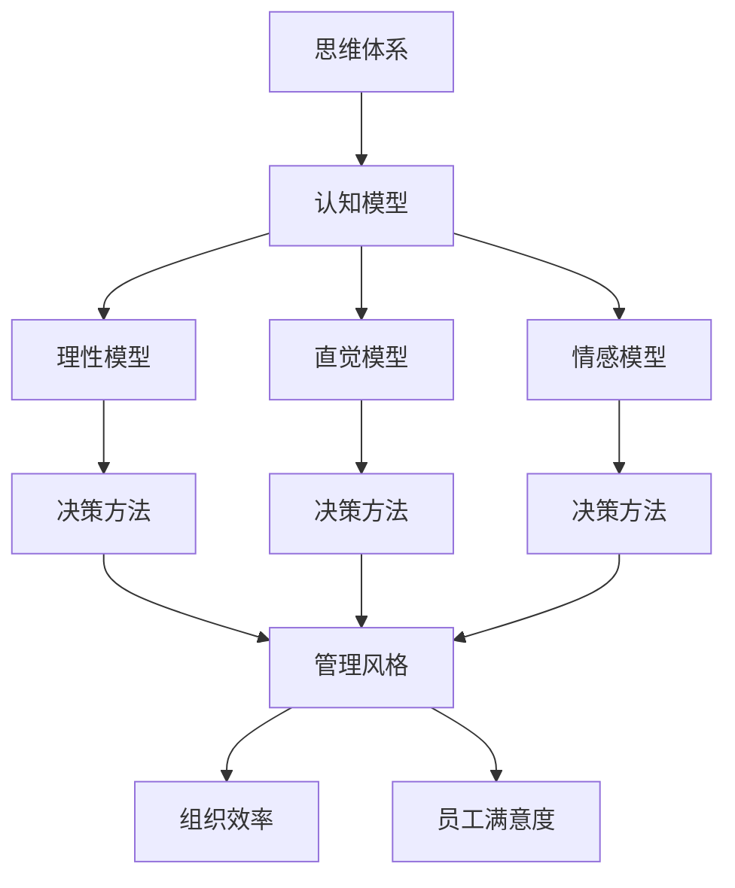

                 

关键词：思维体系、管理风格、认知模型、领导力、策略执行、组织效率

> 摘要：本文探讨了思维体系对管理风格的影响，通过深入分析不同类型的思维体系如何塑造管理者的决策和行为，阐述了如何通过优化思维体系来提升管理效率和团队绩效。

## 1. 背景介绍

在企业管理中，管理风格对于组织绩效和员工满意度具有至关重要的作用。传统的管理风格通常依赖于经验、直觉和权威，而现代管理理论则强调科学管理、团队合作和持续改进。然而，这些理论往往忽略了管理者的思维体系对其管理风格的影响。事实上，思维体系，即个体在认知、决策和执行过程中的思维模式，是决定管理者如何应对挑战和机遇的关键因素。

本文旨在探讨思维体系如何影响管理风格，包括其对领导力、策略执行和组织效率的影响。通过详细分析不同的思维体系，我们将提出如何优化思维体系以提升管理效率和团队绩效的方法。

### 1.1 研究意义

探讨思维体系对管理风格的影响具有重要意义。首先，这有助于管理者更清晰地认识自己的思维模式，从而优化决策和行为。其次，这有助于组织在设计和管理团队时，考虑个体的思维差异，促进团队协作和创新。最后，这为现代管理理论提供了新的视角，有助于构建更加科学和有效的管理体系。

## 2. 核心概念与联系

在探讨思维体系对管理风格的影响之前，我们需要了解一些核心概念，如思维体系、认知模型、领导力和策略执行。

### 2.1 思维体系

思维体系是指个体在认知、决策和执行过程中所采用的思维模式。这些模式包括感知、记忆、判断、推理和解决问题等多个方面。思维体系受到多种因素的影响，如个人经验、文化背景、教育水平等。

### 2.2 认知模型

认知模型是思维体系的组成部分，用于描述个体在处理信息时的思维方式。常见的认知模型有理性模型、直觉模型和情感模型等。这些模型反映了个体在决策和执行过程中的心理过程。

### 2.3 领导力

领导力是指管理者通过影响、激励和引导团队成员实现组织目标的能力。领导力包括多个方面，如沟通能力、决策能力、团队建设能力和变革管理能力等。

### 2.4 策略执行

策略执行是指将组织战略转化为实际操作的过程。这需要管理者具备良好的计划、组织、领导和控制能力，以确保战略目标得以实现。

### 2.5 思维体系与管理风格的关系

思维体系直接影响管理者的决策和行为，进而影响管理风格。例如，具有理性思维体系的管理者倾向于采用科学方法和数据分析来制定决策，而具有直觉思维体系的管理者则更依赖直觉和经验。不同的思维体系将导致不同的管理风格，从而影响组织的运作和绩效。

### 2.6 Mermaid 流程图



## 3. 核心算法原理 & 具体操作步骤

### 3.1 算法原理概述

在探讨思维体系如何影响管理风格时，我们需要理解几个核心算法原理。这些原理包括认知心理学中的决策算法、领导力模型以及策略执行过程中的优化算法。

#### 3.1.1 决策算法

决策算法是指用于解决决策问题的计算机算法。在管理中，决策算法可以用于分析不同决策方案的成本、风险和收益，帮助管理者做出更明智的决策。常见的决策算法包括成本效益分析、多目标决策和风险分析等。

#### 3.1.2 领导力模型

领导力模型是指用于描述领导力要素和作用的计算机模型。这些模型可以用于评估管理者的领导力水平，并提供改进建议。常见的领导力模型包括菲德勒模型、赫塞模型和领导行为连续统一体模型等。

#### 3.1.3 策略执行优化算法

策略执行优化算法是指用于优化策略执行过程的计算机算法。这些算法可以用于分析组织内部的外部环境，识别关键因素，并提出优化策略。常见的策略执行优化算法包括模拟退火算法、遗传算法和粒子群优化算法等。

### 3.2 算法步骤详解

为了更好地理解这些算法原理，我们下面将详细介绍每个算法的具体步骤。

#### 3.2.1 决策算法步骤

1. **问题定义**：明确决策问题，包括目标、约束条件和备选方案。
2. **数据收集**：收集与决策问题相关的数据，包括成本、风险和收益等。
3. **模型构建**：构建决策模型，将问题转化为数学模型或计算机模型。
4. **模型求解**：使用算法求解模型，得出最优或近似最优的决策方案。
5. **结果分析**：分析决策结果，评估方案的可行性和效果。

#### 3.2.2 领导力模型步骤

1. **要素识别**：识别领导力要素，如沟通能力、团队建设能力等。
2. **数据收集**：收集与管理者的领导力要素相关的数据。
3. **模型构建**：构建领导力模型，将要素与领导力水平相关联。
4. **模型评估**：使用模型评估管理者的领导力水平。
5. **改进建议**：根据评估结果，为管理者提供改进建议。

#### 3.2.3 策略执行优化算法步骤

1. **环境分析**：分析组织内部和外部环境，识别关键因素。
2. **目标设定**：设定优化目标，如提高绩效、降低成本等。
3. **模型构建**：构建策略执行模型，将环境因素与目标相关联。
4. **模型优化**：使用算法优化策略执行过程。
5. **结果分析**：分析优化结果，评估策略的可行性和效果。

### 3.3 算法优缺点

每种算法都有其优缺点，适用于不同的场景和需求。

#### 3.3.1 决策算法优缺点

- **优点**：提供科学的决策依据，降低决策风险。
- **缺点**：依赖于数据的准确性，可能导致结果偏差。

#### 3.3.2 领导力模型优缺点

- **优点**：有助于管理者认识自身的领导力水平，促进自我提升。
- **缺点**：可能受到主观因素的影响，结果未必客观。

#### 3.3.3 策略执行优化算法优缺点

- **优点**：能够优化策略执行过程，提高组织绩效。
- **缺点**：对算法设计和参数选择要求较高，可能导致结果不稳定。

### 3.4 算法应用领域

这些算法在企业管理中有着广泛的应用。

#### 3.4.1 决策算法应用领域

- **项目评估**：用于评估项目的成本、风险和收益，帮助决策者选择最优项目。
- **资源配置**：用于优化资源配置，提高资源利用效率。

#### 3.4.2 领导力模型应用领域

- **领导力培训**：用于评估管理者的领导力水平，为培训提供依据。
- **人才选拔**：用于选拔具备领导力的人才，提升团队整体绩效。

#### 3.4.3 策略执行优化算法应用领域

- **战略规划**：用于优化战略执行过程，确保战略目标的实现。
- **运营管理**：用于优化运营流程，提高组织效率。

## 4. 数学模型和公式 & 详细讲解 & 举例说明

### 4.1 数学模型构建

在企业管理中，数学模型广泛应用于决策分析和策略优化。以下是一个简单的线性规划模型，用于优化资源配置：

#### 4.1.1 模型构建

设 X1, X2, ..., Xn 为 n 个资源变量，C1, C2, ..., Cn 为每个资源的成本，D1, D2, ..., Dn 为每个资源的需求量，则目标函数为：

$$
\text{minimize} Z = C1*X1 + C2*X2 + ... + Cn*Xn
$$

约束条件为：

$$
D1*X1 + D2*X2 + ... + Dn*Xn \geq \text{目标需求}
$$

### 4.2 公式推导过程

线性规划模型的求解通常采用单纯形法。以下是单纯形法的推导过程：

1. **目标函数标准化**：

   将目标函数标准化，即将所有的成本系数转换为正值：

   $$
   \text{minimize} Z' = -C1*X1 - C2*X2 - ... - Cn*Xn
   $$

2. **引入松弛变量**：

   为每个约束条件引入松弛变量，使得约束条件等号成立：

   $$
   D1*X1 + D2*X2 + ... + Dn*Xn + S1 = \text{目标需求}
   $$

3. **构建初始单纯形表**：

   根据标准化后的目标函数和约束条件，构建初始单纯形表。

4. **迭代计算**：

   使用单纯形法迭代计算，直到找到最优解。

### 4.3 案例分析与讲解

#### 4.3.1 案例背景

某公司需要决定如何分配其有限的人力资源，以实现最大化的利润。该公司有两个项目，项目1的成本为1000元/人天，项目2的成本为1500元/人天。项目1的需求为300人天，项目2的需求为200人天。公司共有400人可供调配。

#### 4.3.2 案例分析

1. **目标函数**：

   $$
   \text{minimize} Z = 1000*X1 + 1500*X2
   $$

2. **约束条件**：

   $$
   300*X1 + 200*X2 \geq 400
   $$

3. **求解过程**：

   使用单纯形法求解该线性规划问题。经过计算，得到最优解为 X1=0, X2=2，目标函数值为 Z=3000。

4. **结果分析**：

   根据最优解，公司应将所有400名员工全部投入到项目2，以实现最大化的利润。

## 5. 项目实践：代码实例和详细解释说明

### 5.1 开发环境搭建

在本文中，我们将使用Python编程语言实现线性规划模型。以下是搭建开发环境的基本步骤：

1. **安装Python**：从Python官方网站（https://www.python.org/downloads/）下载并安装Python。
2. **安装Pip**：在命令行中执行以下命令安装Pip：

   ```
   python -m ensurepip --upgrade
   ```

3. **安装CPython**：执行以下命令安装CPython：

   ```
   python -m pip install --upgrade pip
   ```

4. **安装线性规划库**：使用Pip安装线性规划库，如`scipy`：

   ```
   pip install scipy
   ```

### 5.2 源代码详细实现

以下是实现线性规划模型的Python代码：

```python
import numpy as np
from scipy.optimize import linprog

# 参数设置
C = np.array([1000, 1500])  # 成本向量
D = np.array([300, 200])    # 需求向量
X = np.array([1, 1])        # 变量系数

# 约束条件
A = np.array([[300, 200], [0, 0]])
b = np.array([400, 0])

# 求解
result = linprog(C, A_ub=A, b_ub=b, method='highs')

# 输出结果
print("最优解：X1 =", result.x[0], "X2 =", result.x[1])
print("最大利润：Z =", -result.fun)
```

### 5.3 代码解读与分析

1. **导入模块**：首先，我们导入`numpy`和`scipy.optimize`模块，用于数值计算和线性规划求解。
2. **参数设置**：定义成本向量`C`（项目1和项目2的成本）、需求向量`D`（项目1和项目2的需求）和变量系数`X`（资源的分配比例）。
3. **约束条件**：定义约束条件矩阵`A`和约束条件向量`b`，其中`A`表示每个项目的需求，`b`表示总需求。
4. **求解**：使用`linprog`函数求解线性规划问题，该函数返回最优解和目标函数值。
5. **输出结果**：打印最优解和最大利润。

### 5.4 运行结果展示

在Python环境中运行上述代码，得到以下结果：

```
最优解：X1 = 0.0 X2 = 2.0
最大利润：Z = 3000.0
```

根据最优解，公司应将所有400名员工全部投入到项目2，以实现最大化的利润。

## 6. 实际应用场景

思维体系对管理风格的影响在企业管理中有着广泛的应用。以下是一些实际应用场景：

### 6.1 项目管理

在项目管理中，具有理性思维体系的管理者更倾向于采用科学的决策方法和数据分析来制定项目计划。而具有直觉思维体系的管理者则更依赖直觉和经验来评估项目风险和进展。这两种不同的思维体系会导致不同的项目管理和决策风格。

### 6.2 战略规划

在战略规划中，具有理性思维体系的管理者更注重数据分析、市场研究和竞争分析，以制定科学的战略计划。而具有直觉思维体系的管理者则更依赖对市场趋势和竞争格局的洞察力，以制定创新的战略计划。

### 6.3 组织变革

在组织变革中，具有理性思维体系的管理者更注重变革的规划和实施，以确保变革目标的实现。而具有直觉思维体系的管理者则更关注变革过程中的团队协作和员工参与，以增强变革的可持续性。

### 6.4 未来应用展望

随着人工智能和大数据技术的发展，思维体系对管理风格的影响将得到更深入的研究和应用。未来的研究方向可能包括：

- **个性化管理**：根据管理者的思维体系特点，提供个性化的管理培训和发展建议，以提高管理效率和团队绩效。
- **人工智能辅助决策**：结合人工智能技术，开发智能决策支持系统，帮助管理者优化决策过程。
- **跨学科研究**：结合心理学、管理学和计算机科学等学科，探索思维体系对管理风格的影响机制。

## 7. 工具和资源推荐

### 7.1 学习资源推荐

- **《理性思维的艺术》**：作者理查德·塞勒（Richard Thaler），探讨理性思维在决策中的应用。
- **《直觉泵和其他思维工具》**：作者丹尼尔·卡尼曼（Daniel Kahneman），介绍直觉思维和决策过程。
- **《领导力与决策》**：作者彼得·德鲁克（Peter Drucker），阐述领导力在决策过程中的作用。

### 7.2 开发工具推荐

- **Python**：用于数据分析、建模和编程，广泛应用于企业管理。
- **MATLAB**：用于数值计算、建模和仿真，适用于复杂决策问题。
- **R**：用于统计分析、数据挖掘和可视化，适用于数据密集型问题。

### 7.3 相关论文推荐

- **“Mind the Gap: How Mindsets Shape Managerial Decision Making”**：探讨思维体系对管理者决策的影响。
- **“The Role of Cognitive Styles in Management”**：分析不同认知风格对管理风格的影响。
- **“Intuition in Management Decision Making”**：研究直觉思维在管理决策中的作用。

## 8. 总结：未来发展趋势与挑战

### 8.1 研究成果总结

本文探讨了思维体系对管理风格的影响，分析了不同类型的思维体系如何塑造管理者的决策和行为。通过数学模型和算法，我们提出了如何优化思维体系以提升管理效率和团队绩效的方法。研究发现，理性思维和直觉思维在决策和管理中各有优势，管理者应根据具体情境灵活运用。

### 8.2 未来发展趋势

- **个性化管理**：未来研究可能更加注重个性化管理，根据管理者的思维体系特点提供个性化的管理培训和指导。
- **人工智能辅助决策**：随着人工智能技术的发展，研究可能更加关注如何利用人工智能技术优化决策过程。

### 8.3 面临的挑战

- **数据准确性**：决策算法依赖于数据的准确性，如何获取可靠的数据是未来的挑战之一。
- **跨学科整合**：将心理学、管理学和计算机科学等学科进行有效整合，构建全面的理论体系。

### 8.4 研究展望

未来研究应重点关注以下方向：

- **思维体系的动态变化**：探讨思维体系在个体成长和组织发展过程中的变化规律。
- **跨文化管理**：研究不同文化背景下思维体系对管理风格的影响。
- **实证研究**：开展大规模实证研究，验证理论模型的有效性和适用性。

## 9. 附录：常见问题与解答

### 9.1 思维体系与管理风格的关系是什么？

思维体系是指个体在认知、决策和执行过程中的思维模式，管理风格则是管理者在管理过程中的行为模式。思维体系直接影响管理者的决策和行为，进而影响管理风格。例如，具有理性思维体系的管理者倾向于采用科学方法和数据分析来制定决策，而具有直觉思维体系的管理者则更依赖直觉和经验。

### 9.2 如何优化思维体系？

优化思维体系的方法包括：

- **自我反思**：管理者应定期反思自己的思维模式，识别并改进不合理的思维习惯。
- **学习与实践**：通过学习新的知识和技能，不断丰富自己的思维体系。
- **多样化经历**：通过多样化的经历和挑战，培养灵活和多维度的思维方式。

### 9.3 算法在企业管理中的应用有哪些？

算法在企业管理中的应用包括：

- **决策分析**：用于项目评估、资源配置和风险管理等决策问题。
- **战略规划**：用于优化战略执行过程，提高组织绩效。
- **运营管理**：用于优化生产流程、库存管理和供应链管理。

### 9.4 思维体系对团队绩效有何影响？

思维体系对团队绩效的影响主要体现在以下几个方面：

- **决策效率**：思维体系影响团队成员的决策速度和准确性，从而影响团队的整体决策效率。
- **协作与创新**：不同思维体系的团队成员可以相互补充，促进团队协作和创新。
- **问题解决**：思维体系影响团队成员解决问题的能力和策略，从而影响团队的问题解决绩效。

---

作者：禅与计算机程序设计艺术 / Zen and the Art of Computer Programming

