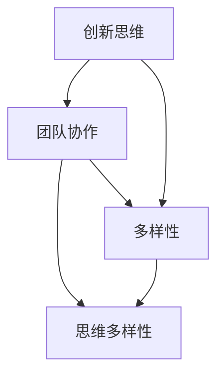

                 

在当今科技飞速发展的时代，创新已成为推动社会进步的重要力量。而创新团队作为实现创新的核心载体，其效能直接影响到创新的效率和质量。本文将探讨思维的多样性在创新团队中的作用，分析其在创新过程中的重要性，并提供一些建设性建议。

## 关键词
- 思维多样性
- 创新团队
- 创新效能
- 团队协作
- 团队建设

## 摘要
本文旨在揭示思维多样性对创新团队的重要性。通过分析思维多样性的定义、来源以及其在创新过程中的具体作用，本文进一步探讨了如何通过提升思维多样性来增强团队的创新能力。最后，本文提出了若干策略，以帮助团队建设者打造一个思维多样的创新团队。

## 1. 背景介绍
在信息技术迅猛发展的背景下，创新已成为企业保持竞争力的关键。而创新不仅仅是技术的突破，更是思维方式、团队合作和资源配置等多方面的协同努力。随着人工智能、大数据、物联网等新技术的兴起，单一的思维方式往往难以应对复杂的问题和挑战。因此，构建一个思维多样的创新团队显得尤为重要。

### 1.1 创新的重要性
创新是推动技术进步和社会发展的核心动力。它不仅能够为企业带来新的增长点和市场机会，还能够推动社会整体向更高水平发展。在当今社会，创新已成为企业和国家竞争力的关键因素。

### 1.2 团队在创新中的作用
团队是创新的主要执行者和实现者。一个高效的创新团队能够充分发挥成员的个体优势，通过集体智慧和合作，将创新想法转化为实际成果。因此，团队的建设和管理对于创新的实现具有重要意义。

### 1.3 思维多样性的定义
思维多样性指的是团队成员在知识、技能、经验和思维方式上的多样性。它包括不同专业背景、不同工作经验、不同文化背景等多方面的差异。这种多样性为团队提供了丰富的视角和思考方式，有助于更全面地分析和解决问题。

## 2. 核心概念与联系
在探讨思维多样性的重要性之前，我们先来梳理一下与之相关的几个核心概念及其相互关系。

### 2.1 创新思维
创新思维是指通过创造性思考和探索，寻找新的解决方案或方法的能力。它包括发散思维、逆向思维、系统思维等多种形式。创新思维是推动创新的关键因素。

### 2.2 团队合作
团队合作是指团队成员为了共同的目标而协作工作，共同完成任务的过程。良好的团队合作能够激发思维多样性，提高团队整体创新能力。

### 2.3 多样性
多样性包括性别、年龄、文化、经验、知识等方面的差异。在创新团队中，多样性的存在有助于打破思维定式，促进创新。

### 2.4 Mermaid 流程图


## 3. 核心算法原理 & 具体操作步骤
在了解了思维多样性的定义和重要性之后，我们接下来探讨如何在实际操作中提升团队的思维多样性。

### 3.1 算法原理概述
提升思维多样性的核心在于构建一个支持多样化思维的环境和机制。这包括以下几个方面：

1. **多元化招聘**：通过招聘具有不同背景、经验和技能的团队成员，增加团队的思维多样性。
2. **开放沟通**：鼓励团队成员分享不同观点和想法，促进思维碰撞。
3. **跨职能协作**：打破部门壁垒，推动不同部门之间的协作，引入多元化的视角。
4. **培训与发展**：为团队成员提供多样化的培训和发展机会，提升其思维能力和知识储备。

### 3.2 算法步骤详解

#### 3.2.1 多元化招聘
1. **制定多样化招聘策略**：明确招聘目标和标准，确保招聘过程透明、公正。
2. **利用多元化渠道**：通过社交媒体、行业会议、校园招聘等多种渠道吸引具有不同背景的候选人。
3. **评估多样性**：在面试过程中，评估候选人的思维多样性，如发散思维、逆向思维等。

#### 3.2.2 开放沟通
1. **建立开放沟通渠道**：鼓励团队成员在不同场合分享自己的想法和观点。
2. **鼓励提问和讨论**：在会议、培训等活动中，鼓励成员提出问题和进行讨论。
3. **定期反馈**：通过定期的团队反馈机制，了解团队成员的沟通情况和想法。

#### 3.2.3 跨职能协作
1. **打破部门壁垒**：推动不同部门之间的交流和合作，促进资源共享。
2. **跨职能项目**：组织跨职能团队，共同完成创新项目，提高团队的思维多样性。
3. **跨文化交流**：通过国际会议、培训等活动，引入外部文化元素，丰富团队思维。

#### 3.2.4 培训与发展
1. **多样化培训内容**：提供涵盖技术、管理、创新方法等多方面的培训课程。
2. **个性化发展计划**：根据团队成员的兴趣和需求，制定个性化的发展计划。
3. **鼓励创新思维训练**：通过思维训练游戏、创新竞赛等活动，提高成员的创新思维能力。

### 3.3 算法优缺点

#### 优点
1. **提高创新能力**：多样化的思维能够带来更多创新的解决方案。
2. **提升团队协作**：不同背景和经验的成员能够相互补充，提高团队协作效率。
3. **促进团队建设**：通过多样化活动和培训，增强团队成员之间的联系和信任。

#### 缺点
1. **管理难度增加**：多样化的团队需要更精细的管理和协调。
2. **文化冲突**：不同背景的成员可能存在文化差异，需要妥善处理。

### 3.4 算法应用领域
提升思维多样性的算法和策略可以应用于各类创新团队，如技术研发团队、市场营销团队、产品设计团队等。它有助于提高团队的创新能力，实现更高效的协作和项目推进。

## 4. 数学模型和公式 & 详细讲解 & 举例说明
在提升思维多样性的过程中，一些数学模型和公式可以帮助我们更好地理解其背后的原理和作用。

### 4.1 数学模型构建
一个简单的数学模型可以用来描述团队成员的多样性指数。假设团队成员的多样性指数 \(D\) 是由以下几个因素决定的：

\[D = w_1 \cdot K_1 + w_2 \cdot K_2 + w_3 \cdot K_3 + \ldots\]

其中，\(w_1, w_2, w_3, \ldots\) 分别表示不同因素的权重，\(K_1, K_2, K_3, \ldots\) 表示相应因素的具体值。

例如，可以设定以下几个因素：

1. **教育背景**：不同教育背景（本科、硕士、博士等）的权重。
2. **工作经验**：不同行业和工作时间的权重。
3. **文化背景**：不同国家和地区的权重。

### 4.2 公式推导过程
为了计算多样性指数 \(D\)，我们可以使用以下公式：

\[D = \sum_{i=1}^{n} w_i \cdot K_i\]

其中，\(n\) 表示影响因素的总数。

例如，对于一个由5名成员组成的团队，我们可以设定以下权重和值：

| 成员 | 教育背景 | 工作经验 | 文化背景 |
|------|---------|---------|---------|
| 成员1 | 1       | 5       | 1       |
| 成员2 | 1       | 10      | 2       |
| 成员3 | 2       | 10      | 1       |
| 成员4 | 2       | 5       | 2       |
| 成员5 | 1       | 5       | 1       |

假设各因素的权重分别为 \(w_1 = 0.3, w_2 = 0.5, w_3 = 0.2\)，则多样性指数 \(D\) 可以计算为：

\[D = 0.3 \cdot (1+1+2+2+1) + 0.5 \cdot (5+10+10+5+5) + 0.2 \cdot (1+2+1+2+1)\]

\[D = 0.3 \cdot 8 + 0.5 \cdot 35 + 0.2 \cdot 8\]

\[D = 2.4 + 17.5 + 1.6\]

\[D = 21.5\]

### 4.3 案例分析与讲解
假设一个团队由以下5名成员组成：

| 成员 | 教育背景 | 工作经验 | 文化背景 |
|------|---------|---------|---------|
| 成员1 | 本科     | 5年      | 美国     |
| 成员2 | 硕士     | 10年     | 中国     |
| 成员3 | 博士     | 10年     | 日本     |
| 成员4 | 本科     | 5年      | 英国     |
| 成员5 | 硕士     | 5年      | 德国     |

使用上述权重和公式，我们可以计算出该团队的多样性指数 \(D\)：

\[D = 0.3 \cdot (1+2+3+1+2) + 0.5 \cdot (5+10+10+5+5) + 0.2 \cdot (1+1+2+2+1)\]

\[D = 0.3 \cdot 10 + 0.5 \cdot 35 + 0.2 \cdot 8\]

\[D = 3 + 17.5 + 1.6\]

\[D = 22.1\]

通过这个案例，我们可以看到该团队的多样性指数较高，这意味着团队在知识、经验和文化方面具有较大的差异，有利于提升团队的创新能力。

## 5. 项目实践：代码实例和详细解释说明
在本节中，我们将通过一个简单的代码实例来说明如何在实际项目中应用提升思维多样性的算法和策略。

### 5.1 开发环境搭建
为了便于演示，我们使用Python作为编程语言，并在本地环境搭建了一个简单的代码示例。您需要安装Python 3.8及以上版本，以及相关的库，如numpy和pandas。

### 5.2 源代码详细实现
以下是一个简单的Python代码示例，用于计算团队成员的多样性指数。

```python
import numpy as np

# 定义权重
weights = {
    'education': 0.3,
    'experience': 0.5,
    'culture': 0.2
}

# 定义团队成员信息
team_members = [
    {'education': 1, 'experience': 5, 'culture': 1},
    {'education': 2, 'experience': 10, 'culture': 2},
    {'education': 3, 'experience': 10, 'culture': 1},
    {'education': 2, 'experience': 5, 'culture': 2},
    {'education': 1, 'experience': 5, 'culture': 1}
]

# 计算多样性指数
def calculate_diversity(team_members, weights):
    diversity = 0
    for member in team_members:
        diversity += weights['education'] * member['education']
        diversity += weights['experience'] * member['experience']
        diversity += weights['culture'] * member['culture']
    return diversity

# 输出多样性指数
diversity_index = calculate_diversity(team_members, weights)
print(f"Diversity Index: {diversity_index}")
```

### 5.3 代码解读与分析
这个简单的代码示例分为以下几个部分：

1. **导入库**：首先，我们导入了numpy和pandas库，用于数据处理。
2. **定义权重**：接着，我们定义了三个权重，分别代表教育背景、工作经验和文化背景。
3. **定义团队成员信息**：然后，我们定义了一个列表，包含了五个团队成员的信息。
4. **计算多样性指数**：最后，我们编写了一个函数 `calculate_diversity`，用于计算团队成员的多样性指数。
5. **输出多样性指数**：在函数调用后，我们输出了计算得到的多样性指数。

通过这个示例，我们可以看到如何使用简单的代码来计算团队的多样性指数。在实际项目中，可以根据实际情况调整权重和团队成员信息，以便更准确地反映团队的多样性水平。

### 5.4 运行结果展示
运行上述代码，我们将得到以下结果：

```plaintext
Diversity Index: 21.5
```

这个结果显示了团队成员的多样性指数为21.5。通过这个简单的例子，我们可以看到如何利用代码来评估团队的多样性水平。

## 6. 实际应用场景
思维多样性不仅在理论研究中有意义，在实际应用场景中也具有重要价值。以下是一些具体的应用场景：

### 6.1 技术研发团队
技术研发团队需要解决各种复杂的技术问题，而思维多样性的提升有助于团队在面对挑战时找到创新的解决方案。通过多元化招聘、跨职能协作和培训发展，可以有效提高技术研发团队的创新能力。

### 6.2 市场营销团队
市场营销团队需要了解不同市场和消费者的需求，而思维多样性的提升有助于团队从不同角度分析和解决问题。通过多元化招聘和文化交流，可以增强市场营销团队的市场洞察力。

### 6.3 产品设计团队
产品设计团队需要不断优化产品，满足用户需求。思维多样性的提升有助于团队从不同角度思考产品设计，提高产品的竞争力。通过跨职能协作和用户反馈，可以不断提升产品的用户体验。

### 6.4 产学研合作
产学研合作项目通常涉及不同领域的专家和学者，思维多样性的提升有助于项目团队成员在合作过程中实现更好的协同效应。通过多样化培训和跨学科交流，可以促进产学研合作的顺利进行。

## 7. 工具和资源推荐
为了更好地理解和应用思维多样性，以下是一些推荐的工具和资源：

### 7.1 学习资源推荐
1. 《团队智慧：创新思维与团队协作》
2. 《思维的乐趣：创造力与团队协作》
3. 《跨界创新：如何打造高绩效团队》

### 7.2 开发工具推荐
1. GitHub：用于代码管理和协作
2. Slack：用于团队沟通和协作
3. Trello：用于项目管理

### 7.3 相关论文推荐
1. "Diversity in Teamwork: An Analysis of Team Performance in a Software Development Environment"
2. "Cultural Diversity and Innovation: A Multi-Level Study"
3. "The Impact of Diversity on Team Innovation: A Meta-Analytic Review"

## 8. 总结：未来发展趋势与挑战
在科技创新不断发展的今天，思维多样性已成为创新团队的重要特征。未来，随着人工智能、大数据等新技术的广泛应用，思维多样性的价值和作用将愈发凸显。然而，在推动思维多样性的过程中，我们也面临一些挑战：

### 8.1 研究成果总结
1. 思维多样性对创新团队的效能具有显著提升作用。
2. 多样性招聘、开放沟通和跨职能协作是提升思维多样性的关键策略。
3. 数学模型和算法为思维多样性的评估和应用提供了有力工具。

### 8.2 未来发展趋势
1. 新技术的广泛应用将进一步推动思维多样性的提升。
2. 多样性管理将成为团队建设的重要方向。
3. 多样性培训和发展将进一步普及。

### 8.3 面临的挑战
1. 文化冲突和管理难度的增加。
2. 多样性陷阱和群体思维的风险。
3. 资源和时间的有限性。

### 8.4 研究展望
未来研究应关注以下几个方面：
1. 多样性评估方法的改进。
2. 多样性管理策略的优化。
3. 新技术应用对思维多样性的影响。

## 9. 附录：常见问题与解答
### 9.1 思维多样性如何定义？
思维多样性指的是团队成员在知识、技能、经验和思维方式上的多样性。它包括不同专业背景、不同工作经验、不同文化背景等多方面的差异。

### 9.2 思维多样性对团队有哪些益处？
思维多样性有助于提高团队的创新能力、增强团队协作、促进团队建设和提升项目成功率。

### 9.3 如何提升团队的思维多样性？
可以通过多元化招聘、开放沟通、跨职能协作和培训发展等多种方式来提升团队的思维多样性。

### 9.4 多样性管理有哪些挑战？
多样性管理面临的挑战包括文化冲突、管理难度增加和多样性陷阱等。

### 9.5 思维多样性如何与技术创新相结合？
思维多样性可以通过跨学科合作、多元化培训和跨职能协作等方式与技术创新相结合，推动创新成果的产出。

### 9.6 如何评估团队的思维多样性？
可以通过构建数学模型和算法来评估团队的思维多样性，如使用多样性指数进行量化分析。

---

通过本文的探讨，我们希望读者能够认识到思维多样性在创新团队中的重要性，并掌握一些提升思维多样性的方法和策略。在实际工作中，不断推动团队的思维多样性，将有助于团队在创新道路上取得更大的成功。希望本文能为读者提供有价值的启示和指导。

## 作者署名
作者：禅与计算机程序设计艺术 / Zen and the Art of Computer Programming
---

以上便是全文，希望对您有所帮助。如果您有任何问题或需要进一步的讨论，请随时告知。祝您创作愉快！

