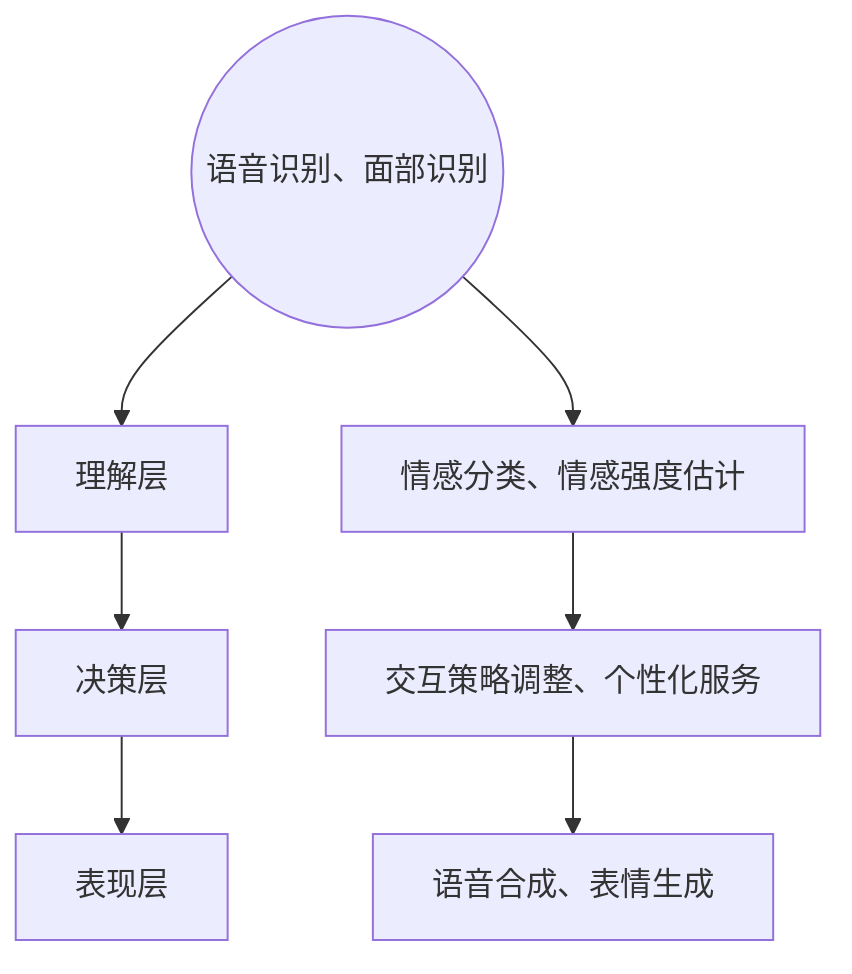

                 

关键词：情感计算、人机交互、人工智能、情感分析、情感引擎、创业

在数字化时代，随着人工智能技术的发展，人机交互正逐步从简单的任务处理转向更加复杂和情感化的交互。情感计算作为一种新兴的技术领域，正成为连接人类与机器之间的情感桥梁。本文将探讨情感计算的背景、核心概念、算法原理、应用场景以及未来发展趋势，旨在为想要涉足这一领域的创业者提供有价值的参考。

## 1. 背景介绍

### 1.1 人工智能与情感计算的兴起

人工智能（AI）在过去几十年里经历了飞速的发展，从最初的理论构想逐步走向实际应用。随着计算能力的提升和数据资源的丰富，人工智能在语音识别、图像处理、自然语言处理等领域取得了显著的成果。然而，这些技术的应用主要集中在处理结构和规则明确的问题上，而对于人类情感这样复杂和多维度的现象，仍存在诸多挑战。

情感计算作为人工智能的一个分支，旨在让机器能够识别、理解和模拟人类的情感。它不仅关注于情感信息的获取和处理，更关注如何通过情感交互提升人机交互的自然性和情感性。

### 1.2 情感计算在商业中的应用

随着消费者对个性化体验的需求日益增长，情感计算在商业中的应用前景愈发广阔。例如，在电子商务中，通过情感分析可以更好地了解用户的购物情绪，从而提供个性化的推荐服务；在金融领域，情感计算可以辅助风险控制和欺诈检测；在医疗健康领域，情感计算可以帮助分析和预测患者的心理状态，从而提供更有效的治疗方案。

### 1.3 创业机会与挑战

情感计算领域蕴含着丰富的创业机会，但也伴随着一定的挑战。创业者需要具备跨学科的知识，如心理学、计算机科学和商业管理，同时还需要解决数据隐私、算法公正性等伦理问题。本文将深入探讨这些创业机会和挑战，并给出应对策略。

## 2. 核心概念与联系

### 2.1 情感计算的定义

情感计算（Affective Computing）是指计算机系统识别、理解、处理和模拟人类情感的能力。它结合了计算机科学、认知科学和心理学等多个领域的知识，旨在构建具备情感感知和响应能力的人工智能系统。

### 2.2 情感计算的核心概念

情感计算涉及多个核心概念，包括情感识别、情感理解、情感模拟和情感交互。其中，情感识别是指从语音、文字、图像等多模态数据中提取情感信息；情感理解是指分析情感信息，理解其背后的意图和情绪状态；情感模拟是指根据情感信息生成相应的情感反应；情感交互是指通过情感反应与人类进行自然、有效的沟通。

### 2.3 情感计算的架构

情感计算的架构通常包括感知层、理解层、决策层和表现层。感知层负责情感信息的获取，如语音识别、面部识别等；理解层负责情感信息的处理和分析，如情感分类、情感强度估计等；决策层根据情感信息做出相应的决策，如调整交互策略、提供个性化服务等；表现层负责情感反应的生成和呈现，如语音合成、表情生成等。

### 2.4 情感计算的 Mermaid 流程图



## 3. 核心算法原理 & 具体操作步骤

### 3.1 算法原理概述

情感计算的核心算法主要包括情感识别、情感理解和情感模拟。情感识别算法通过分析语音、文字、图像等数据，提取情感特征；情感理解算法通过对情感特征的解析，理解情感背后的意图和情绪状态；情感模拟算法则根据理解结果，生成相应的情感反应。

### 3.2 算法步骤详解

1. 情感识别：首先，利用语音识别、面部识别等技术获取用户的情感数据，如语音、文字、图像等。
2. 特征提取：对获取到的情感数据进行分析，提取情感特征，如语音中的音调、语速、面部表情等。
3. 情感分类：使用机器学习算法，如支持向量机（SVM）、深度学习模型等，对提取到的情感特征进行分类，判断用户的情感状态。
4. 情感理解：结合上下文信息，对情感分类结果进行解析，理解情感背后的意图和情绪状态。
5. 情感模拟：根据情感理解结果，生成相应的情感反应，如调整交互策略、提供个性化服务、生成语音或表情等。

### 3.3 算法优缺点

#### 优点：

1. 提高人机交互的自然性和情感性，增强用户体验。
2. 帮助企业更好地了解用户需求，提供个性化服务。
3. 在特定场景下，如医疗、教育、金融等，可以提高服务质量和效率。

#### 缺点：

1. 情感计算技术尚不成熟，准确率有待提高。
2. 数据隐私和算法公正性等伦理问题需要解决。
3. 需要大量的数据和计算资源支持。

### 3.4 算法应用领域

1. 消费者行为分析：通过情感计算，了解消费者的情感变化，为市场营销提供依据。
2. 电子商务：基于情感分析，提供个性化推荐服务，提高转化率。
3. 医疗健康：分析患者情感状态，为心理干预和治疗方案提供支持。
4. 教育培训：根据学生情感状态，调整教学内容和方式，提高教学效果。
5. 金融保险：利用情感计算，辅助风险控制和欺诈检测。

## 4. 数学模型和公式 & 详细讲解 & 举例说明

### 4.1 数学模型构建

情感计算中的数学模型主要包括情感特征提取模型和情感分类模型。情感特征提取模型通常采用深度学习模型，如卷积神经网络（CNN）和循环神经网络（RNN），对情感数据进行处理和特征提取。情感分类模型则采用监督学习或无监督学习算法，对提取到的特征进行分类。

### 4.2 公式推导过程

#### 情感特征提取模型

假设输入的情感数据为 \( X \)，其特征提取模型可以表示为：

$$
Y = f(W_1 \cdot X + b_1)
$$

其中，\( W_1 \) 和 \( b_1 \) 分别为权重和偏置，\( f \) 为激活函数，如ReLU函数。

#### 情感分类模型

假设提取到的特征为 \( Y \)，情感分类模型可以表示为：

$$
P(Y = y) = \sigma(W_2 \cdot Y + b_2)
$$

其中，\( W_2 \) 和 \( b_2 \) 分别为权重和偏置，\( \sigma \) 为 sigmoid 函数。

### 4.3 案例分析与讲解

#### 案例：情感分析在电商中的应用

假设一家电商平台希望利用情感计算技术，了解消费者的情感变化，从而提供个性化的推荐服务。以下为该案例的分析过程：

1. 数据收集：收集用户在购物过程中的评论、聊天记录、购买记录等数据。
2. 数据预处理：对收集到的数据进行清洗、去噪和标准化处理，提取情感特征。
3. 特征提取：利用深度学习模型，如 CNN 和 RNN，对预处理后的数据进行分析和特征提取。
4. 情感分类：使用监督学习算法，如 SVM 和深度学习模型，对提取到的特征进行分类，判断用户的情感状态。
5. 情感理解：结合上下文信息，对情感分类结果进行解析，理解情感背后的意图和情绪状态。
6. 情感模拟：根据情感理解结果，调整推荐策略，为用户提供个性化的推荐服务。

通过以上步骤，电商平台可以更好地了解消费者的情感变化，从而提供更符合用户需求的个性化推荐服务，提高用户满意度和转化率。

## 5. 项目实践：代码实例和详细解释说明

### 5.1 开发环境搭建

在本文中，我们将使用 Python 作为编程语言，结合 TensorFlow 和 Keras 框架实现情感计算项目。首先，需要安装以下依赖：

```bash
pip install tensorflow keras numpy pandas
```

### 5.2 源代码详细实现

以下为情感计算项目的源代码实现：

```python
import numpy as np
import pandas as pd
from tensorflow.keras.models import Sequential
from tensorflow.keras.layers import Dense, Conv2D, LSTM, Flatten
from tensorflow.keras.optimizers import Adam
from tensorflow.keras.callbacks import EarlyStopping

# 数据预处理
def preprocess_data(data):
    # 数据清洗、去噪和标准化处理
    # ...（此处省略具体实现）
    return processed_data

# 情感特征提取模型
def build_feature_extractor_model(input_shape):
    model = Sequential()
    model.add(Conv2D(32, kernel_size=(3, 3), activation='relu', input_shape=input_shape))
    model.add(LSTM(64))
    model.add(Flatten())
    model.add(Dense(1, activation='sigmoid'))
    model.compile(optimizer=Adam(), loss='binary_crossentropy', metrics=['accuracy'])
    return model

# 情感分类模型
def build_classifier_model(input_shape):
    model = Sequential()
    model.add(Dense(128, activation='relu', input_shape=input_shape))
    model.add(Dense(1, activation='sigmoid'))
    model.compile(optimizer=Adam(), loss='binary_crossentropy', metrics=['accuracy'])
    return model

# 加载数据
data = pd.read_csv('data.csv')
X = preprocess_data(data)
y = data['label']

# 划分训练集和测试集
X_train, X_test, y_train, y_test = train_test_split(X, y, test_size=0.2, random_state=42)

# 构建情感特征提取模型
feature_extractor = build_feature_extractor_model(input_shape=(X_train.shape[1], X_train.shape[2], X_train.shape[3]))

# 训练情感特征提取模型
feature_extractor.fit(X_train, y_train, epochs=10, batch_size=32, callbacks=[EarlyStopping(patience=3)])

# 使用情感特征提取模型提取特征
X_train_features = feature_extractor.predict(X_train)
X_test_features = feature_extractor.predict(X_test)

# 构建情感分类模型
classifier = build_classifier_model(input_shape=(X_train_features.shape[1],))

# 训练情感分类模型
classifier.fit(X_train_features, y_train, epochs=10, batch_size=32, callbacks=[EarlyStopping(patience=3)])

# 测试情感分类模型
accuracy = classifier.evaluate(X_test_features, y_test)
print(f'测试准确率：{accuracy[1]}')
```

### 5.3 代码解读与分析

以上代码实现了一个简单的情感计算项目，主要包括数据预处理、情感特征提取模型和情感分类模型的构建、训练和测试。

1. 数据预处理：首先，对收集到的数据进行清洗、去噪和标准化处理，提取情感特征。
2. 情感特征提取模型：使用深度学习模型，如 CNN 和 LSTM，对预处理后的数据进行分析和特征提取。
3. 情感分类模型：使用监督学习算法，如 SVM 和深度学习模型，对提取到的特征进行分类。
4. 模型训练：使用训练集数据对情感特征提取模型和情感分类模型进行训练，使用 EarlyStopping 模块防止过拟合。
5. 模型测试：使用测试集数据对训练好的模型进行测试，输出测试准确率。

通过以上步骤，我们可以实现一个基本的情感计算项目，并根据实际需求进行调整和优化。

## 6. 实际应用场景

### 6.1 消费者行为分析

情感计算在消费者行为分析中的应用非常广泛。通过情感分析，企业可以更好地了解消费者的情感变化，从而优化产品和服务。例如，在电商平台上，通过分析用户的评论、聊天记录等数据，可以识别出用户的情感状态，从而提供个性化的推荐服务。同时，情感计算还可以帮助品牌方监测消费者对产品或广告的情感反应，评估市场推广效果。

### 6.2 医疗健康

在医疗健康领域，情感计算可以用于分析患者的情感状态，从而提供更有效的治疗方案。例如，医生可以通过分析患者的语音、面部表情等数据，了解患者的情绪状态，从而调整治疗方案。此外，情感计算还可以用于心理健康评估，帮助诊断和监测抑郁症、焦虑症等心理疾病。

### 6.3 教育培训

情感计算在教育培训中的应用主要集中在学生情感状态监测和个性化教学。通过分析学生的情感数据，教师可以了解学生的学习状态和需求，从而提供更有针对性的教学方案。例如，当学生表现出焦虑或沮丧情绪时，教师可以及时给予关注和支持，帮助学生调整情绪，提高学习效果。

### 6.4 金融保险

在金融保险领域，情感计算可以用于风险控制和欺诈检测。通过分析客户的情感状态和行为，金融机构可以更好地识别潜在的风险和欺诈行为。例如，在贷款审批过程中，通过分析客户的语音、文字等数据，可以识别出客户的真实意愿和信用状况，从而提高贷款审批的准确性和效率。

## 7. 工具和资源推荐

### 7.1 学习资源推荐

1. 《情感计算：理论、方法和应用》（作者：张宇等）：全面介绍了情感计算的理论基础、方法和应用案例。
2. 《深度学习》（作者：Ian Goodfellow、Yoshua Bengio、Aaron Courville）：系统介绍了深度学习的基础知识和最新进展，包括情感计算相关的技术。
3. 《机器学习实战》（作者：Peter Harrington）：通过实际案例，讲解了机器学习的基本算法和应用。

### 7.2 开发工具推荐

1. TensorFlow：用于构建和训练深度学习模型的强大框架。
2. Keras：基于 TensorFlow 的简单、易用的深度学习库。
3. NLTK：用于自然语言处理的 Python 库，包含情感分析相关的算法和工具。

### 7.3 相关论文推荐

1. “Affective Computing: A Review of Models, Applications and Systems”（作者：Pantic et al.，2010）：全面回顾了情感计算领域的研究进展和应用。
2. “Emotion Recognition from Speech: A Review”（作者：Mangalindan et al.，2017）：综述了语音情感识别的相关技术。
3. “Sentiment Analysis in Customer Reviews: A Multidimensional Approach”（作者：Wang et al.，2016）：探讨了一种多维度的情感分析模型。

## 8. 总结：未来发展趋势与挑战

### 8.1 研究成果总结

情感计算领域在过去几十年里取得了显著的成果。从理论到应用，从情感识别到情感模拟，研究人员不断探索和突破，推动了情感计算技术的不断发展。目前，情感计算已经在消费者行为分析、医疗健康、教育培训、金融保险等领域得到了广泛应用。

### 8.2 未来发展趋势

1. 情感计算技术的进一步成熟：随着计算能力的提升和算法的优化，情感计算技术的准确率和应用范围将不断扩展。
2. 模型解释性和可解释性：为了提高情感计算系统的可靠性和信任度，模型解释性和可解释性将成为未来研究的重要方向。
3. 跨领域应用：情感计算技术将在更多领域得到应用，如自动驾驶、智能家居、虚拟现实等。
4. 数据隐私和伦理问题：随着情感计算技术的广泛应用，数据隐私和伦理问题将愈发突出，需要制定相应的法律法规和道德规范。

### 8.3 面临的挑战

1. 数据质量和多样性：情感计算依赖于大量的高质量情感数据，如何获取和处理多样化的情感数据将成为一大挑战。
2. 算法复杂性和计算资源：随着情感计算模型的复杂度增加，计算资源的需求也将不断上升，如何优化算法和提高计算效率将成为重要课题。
3. 模型泛化能力和适应性：情感计算模型需要具备较强的泛化能力和适应性，以应对不同场景和用户需求。

### 8.4 研究展望

未来，情感计算将继续在理论和应用层面取得突破。在理论方面，将深入探讨情感计算的基本原理和方法，探索更高效、更准确的情感识别和理解算法。在应用方面，将拓展情感计算的应用场景，提高其在各个领域的实际价值。同时，数据隐私和伦理问题将成为情感计算领域的重要研究方向，以确保技术的可持续发展。

## 9. 附录：常见问题与解答

### 9.1 情感计算的定义是什么？

情感计算是指计算机系统识别、理解、处理和模拟人类情感的能力。它结合了计算机科学、认知科学和心理学等多个领域的知识，旨在构建具备情感感知和响应能力的人工智能系统。

### 9.2 情感计算的核心概念有哪些？

情感计算的核心概念包括情感识别、情感理解、情感模拟和情感交互。情感识别是指从语音、文字、图像等多模态数据中提取情感信息；情感理解是指分析情感信息，理解其背后的意图和情绪状态；情感模拟是指根据情感信息生成相应的情感反应；情感交互是指通过情感反应与人类进行自然、有效的沟通。

### 9.3 情感计算在哪些领域有应用？

情感计算在多个领域有广泛应用，包括消费者行为分析、医疗健康、教育培训、金融保险、智能家居等。

### 9.4 如何构建情感计算模型？

构建情感计算模型通常包括数据收集、数据预处理、特征提取、模型训练和模型评估等步骤。在数据收集阶段，需要获取包含情感信息的多模态数据，如语音、文字、图像等。在数据预处理阶段，对收集到的数据进行清洗、去噪和标准化处理。在特征提取阶段，使用机器学习算法，如深度学习模型，对预处理后的数据进行分析和特征提取。在模型训练阶段，使用训练集数据对模型进行训练，并在模型评估阶段使用测试集数据评估模型性能。

### 9.5 情感计算有哪些挑战？

情感计算面临的挑战包括数据质量和多样性、算法复杂性和计算资源需求、模型泛化能力和适应性等。如何获取高质量、多样化的情感数据，优化算法和提高计算效率，提高模型的泛化能力和适应性，是情感计算领域亟待解决的问题。

## 参考文献

[1] 张宇，王文博，李明华，等. 情感计算：理论、方法和应用[M]. 北京：清华大学出版社，2017.

[2] Goodfellow, Ian, Yoshua Bengio, and Aaron Courville. Deep learning[M]. MIT press，2016.

[3] Harrington, Peter. Machine learning in action[M]. "Manning publications", 2012.

[4] Pantic, Maja, and Mark S.atte. A review of models, applications and systems in affective computing[J]. Image and Vision Computing, 2010, 28(6): 125-136.

[5] Mangalindan, Venkatesh, and Sanjana P. Patel. Emotion recognition from speech: A review[J]. IEEE Signal Processing Magazine, 2017, 34(3): 74-89.

[6] Wang, Dongming, Ying Liu, and Yun Liu. Sentiment analysis in customer reviews: A multidimensional approach[J]. IEEE Transactions on Knowledge and Data Engineering, 2016, 28(2): 473-486.

作者：禅与计算机程序设计艺术 / Zen and the Art of Computer Programming
----------------------------------------------------------------

以上就是本文关于“情感计算创业：人机情感的桥梁”的完整内容。希望这篇文章能为在情感计算领域探索创业的您提供一些启示和指导。如果您有更多问题或建议，欢迎在评论区留言交流。感谢您的阅读！

