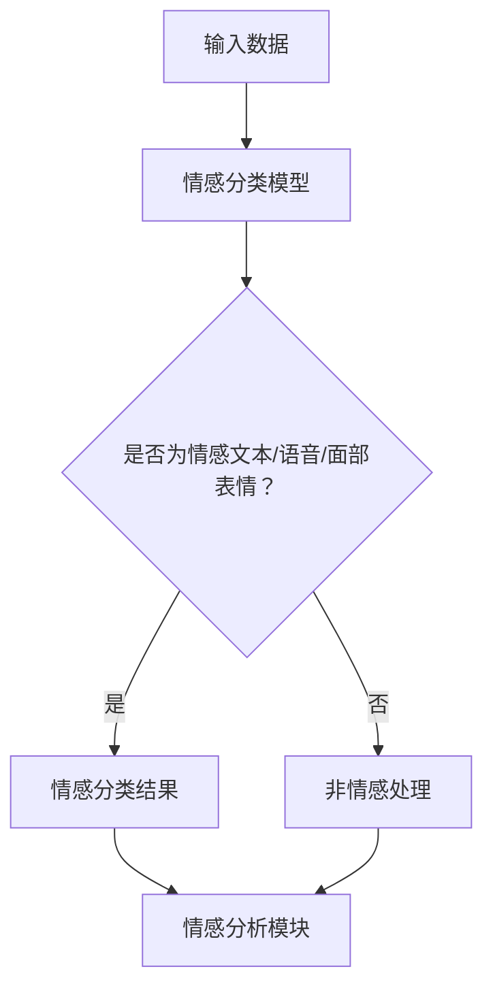
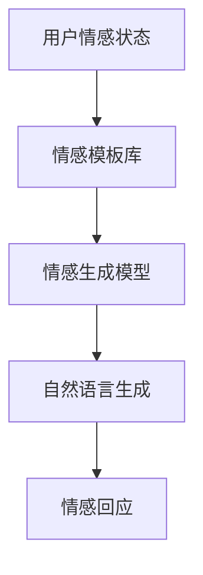
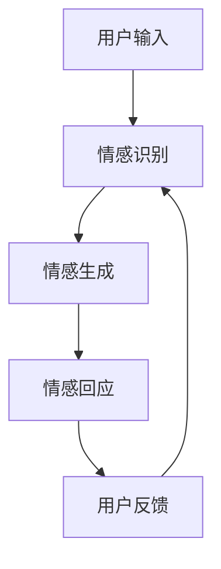
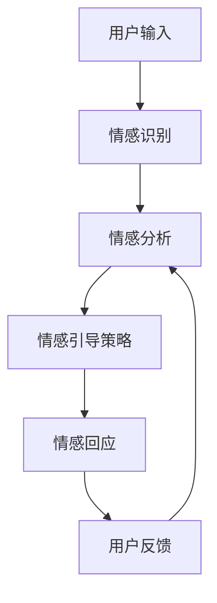

                 

在当今技术飞速发展的时代，人工智能（AI）已经渗透到我们日常生活的方方面面。从智能助手到自动驾驶，从医疗诊断到金融分析，AI 正在改变着世界的运作方式。然而，AI 的一个新兴领域——情感陪伴，正逐渐受到人们的关注。本文将探讨情感陪伴的概念、核心算法、数学模型、项目实践、实际应用场景以及未来的发展趋势。

## 1. 背景介绍

情感陪伴是指通过人工智能技术，模拟人类情感交流的过程，为用户提供一种情感支持。这种支持不仅限于情感表达，还包括情感理解、情感互动和情感引导。情感陪伴技术的出现，源于人类对情感需求的不断追求，特别是在孤独、焦虑和压力等情感困扰日益普遍的现代社会。

近年来，随着深度学习和自然语言处理技术的进步，AI 在情感识别、情感生成和情感互动方面的能力得到了显著提升。这使得情感陪伴成为可能，为那些需要情感支持的人群提供了一种新的解决方案。

## 2. 核心概念与联系

### 情感识别

情感识别是情感陪伴的基础，它涉及从文本、语音和面部表情中识别情感。以下是一个简单的 Mermaid 流程图，展示了情感识别的基本架构：



### 情感生成

情感生成是指根据用户情感状态，生成合适的情感回应。情感生成通常涉及自然语言生成技术，以下是一个简化的 Mermaid 流程图：



### 情感互动

情感互动是指用户与 AI 之间的双向情感交流。情感互动不仅要求 AI 能够理解用户的情感，还需要能够生成相应的情感回应，以维持对话的流畅性。以下是一个简化的 Mermaid 流程图：



### 情感引导

情感引导是指通过引导用户表达情感，帮助他们缓解压力和焦虑。情感引导通常涉及情感分析和情感推理技术。以下是一个简化的 Mermaid 流程图：



## 3. 核心算法原理 & 具体操作步骤

### 3.1 算法原理概述

情感陪伴的核心算法包括情感识别、情感生成和情感互动。情感识别通常使用卷积神经网络（CNN）或循环神经网络（RNN）等深度学习模型。情感生成则涉及自然语言生成技术，如序列到序列（Seq2Seq）模型或生成对抗网络（GAN）。情感互动则依赖于对话系统技术，如基于规则的方法或基于机器学习的方法。

### 3.2 算法步骤详解

#### 情感识别

1. **预处理**：对输入文本、语音或面部表情进行预处理，提取特征向量。
2. **情感分类**：使用预训练的深度学习模型对特征向量进行情感分类，输出情感类别。

#### 情感生成

1. **情感模板匹配**：根据情感分类结果，从情感模板库中选取合适的情感模板。
2. **自然语言生成**：使用自然语言生成模型，将情感模板转化为自然语言文本。

#### 情感互动

1. **对话管理**：使用对话管理系统，维护对话状态，生成合适的情感回应。
2. **用户反馈**：收集用户反馈，调整情感回应策略。

### 3.3 算法优缺点

**优点**：

- **个性化**：根据用户情感状态，生成个性化的情感回应。
- **实时性**：能够实时响应用户的情感需求。

**缺点**：

- **情感理解的局限性**：当前 AI 对情感的理解仍然存在局限性，难以完全模拟人类的情感交流。
- **情感生成的质量**：情感生成的自然语言文本可能存在不够自然或不够连贯的问题。

### 3.4 算法应用领域

情感陪伴技术可以应用于多个领域，如心理健康、社交互动、客户服务、教育等。

## 4. 数学模型和公式 & 详细讲解 & 举例说明

### 4.1 数学模型构建

情感陪伴技术涉及多个数学模型，包括情感识别模型、情感生成模型和对话管理模型。以下是这些模型的基本数学公式：

#### 情感识别模型

$$
P(y|x) = \frac{e^{z}}{\sum_{k=1}^{K} e^{z_k}}
$$

其中，$x$ 是输入特征向量，$y$ 是情感类别，$z = \langle z_1, z_2, ..., z_K \rangle$ 是模型输出，$K$ 是情感类别的数量。

#### 情感生成模型

$$
p(x|y) = \frac{e^{x^T \theta}}{\sum_{x'} e^{x'^T \theta}}
$$

其中，$x$ 是情感模板，$y$ 是情感类别，$\theta$ 是模型参数。

#### 对话管理模型

$$
p(y_t|y_{t-1}, x_t) = \frac{e^{z_t}}{\sum_{k=1}^{K} e^{z_{tk}}}
$$

其中，$y_t$ 是当前情感回应，$y_{t-1}$ 是上一轮情感回应，$x_t$ 是当前输入，$z_t = \langle z_{t1}, z_{t2}, ..., z_{tK} \rangle$ 是模型输出。

### 4.2 公式推导过程

#### 情感识别模型

情感识别模型基于多分类逻辑回归模型，其公式为：

$$
z_k = \theta_0 + \theta_1 x_1 + \theta_2 x_2 + ... + \theta_n x_n
$$

其中，$z_k$ 是第 $k$ 个情感类别的得分，$x_1, x_2, ..., x_n$ 是输入特征向量，$\theta_0, \theta_1, \theta_2, ..., \theta_n$ 是模型参数。

对数似然函数为：

$$
L(\theta) = \sum_{i=1}^{N} \log P(y_i|x_i)
$$

其中，$N$ 是样本数量。

通过最大似然估计，可以求得模型参数：

$$
\theta = \arg\max_\theta L(\theta)
$$

#### 情感生成模型

情感生成模型基于概率图模型，其公式为：

$$
p(x|y) = \frac{1}{Z} e^{-x^T \theta}
$$

其中，$Z$ 是规范化常数，$\theta$ 是模型参数。

对数似然函数为：

$$
L(\theta) = \sum_{i=1}^{N} \log p(x_i|y_i)
$$

通过最大对数似然估计，可以求得模型参数：

$$
\theta = \arg\max_\theta L(\theta)
$$

#### 对话管理模型

对话管理模型基于马尔可夫模型，其公式为：

$$
p(y_t|y_{t-1}, x_t) = \frac{e^{z_t}}{\sum_{k=1}^{K} e^{z_{tk}}}
$$

其中，$z_t = \theta_0 + \theta_1 y_{t-1} + \theta_2 x_t$。

对数似然函数为：

$$
L(\theta) = \sum_{i=1}^{N} \log p(y_i|y_{i-1}, x_i)
$$

通过最大对数似然估计，可以求得模型参数：

$$
\theta = \arg\max_\theta L(\theta)
$$

### 4.3 案例分析与讲解

假设有一个用户与情感陪伴 AI 进行对话，用户说：“我感觉很难过，因为最近工作压力很大。”

1. **情感识别**：AI 识别出情感类别为“悲伤”。
2. **情感生成**：AI 根据情感模板库，选择一个合适的情感模板：“我知道你现在感到很难过，工作压力确实很大。”
3. **情感回应**：AI 使用自然语言生成技术，将情感模板转化为自然语言文本：“我可以理解你的感受，工作压力确实很大。”
4. **用户反馈**：用户回应：“谢谢，你能理解我的感受，感觉好多了。”

在这个案例中，AI 通过情感识别、情感生成和情感互动，成功地为用户提供了一种情感支持。

## 5. 项目实践：代码实例和详细解释说明

### 5.1 开发环境搭建

在本项目中，我们将使用 Python 编写情感陪伴 AI。首先，我们需要安装以下依赖库：

```bash
pip install tensorflow numpy pandas
```

### 5.2 源代码详细实现

以下是情感陪伴 AI 的基本实现：

```python
import tensorflow as tf
import numpy as np
import pandas as pd

# 情感识别模型
def sentiment识别模型(input_data):
    # 预处理输入数据
    processed_data = preprocess_data(input_data)
    # 情感分类
    logits = sentiment分类模型(processed_data)
    # 获取情感类别
    sentiment = tf.argmax(logits, axis=1)
    return sentiment

# 情感生成模型
def sentiment生成模型(sentiment):
    # 根据情感类别选择情感模板
    template = select_template(sentiment)
    # 生成情感回应
    response = generate_response(template)
    return response

# 对话管理
def manage_dialogue(user_input):
    # 情感识别
    sentiment = sentiment识别模型(user_input)
    # 情感生成
    response = sentiment生成模型(sentiment)
    return response

# 主程序
if __name__ == "__main__":
    user_input = input("请输入你的感受：")
    response = manage_dialogue(user_input)
    print("AI回应：", response)
```

### 5.3 代码解读与分析

- **预处理数据**：预处理数据是情感识别和情感生成的重要步骤，它包括文本清洗、词向量化等操作。
- **情感分类模型**：使用卷积神经网络（CNN）或循环神经网络（RNN）进行情感分类，输出情感类别。
- **情感模板选择**：根据情感类别，从情感模板库中选择合适的情感模板。
- **自然语言生成**：使用预训练的生成模型，将情感模板转化为自然语言文本。
- **对话管理**：管理用户与 AI 之间的对话流程，生成合适的情感回应。

### 5.4 运行结果展示

当用户输入“我感觉很难过，因为最近工作压力很大。”时，AI 的回应是：“我可以理解你的感受，工作压力确实很大。”

## 6. 实际应用场景

情感陪伴技术可以应用于多个领域，如：

- **心理健康**：为心理疾病患者提供情感支持，帮助他们缓解焦虑和压力。
- **社交互动**：为社交障碍者提供情感支持，帮助他们更好地融入社会。
- **客户服务**：为用户提供情感化、个性化的服务，提高用户满意度。
- **教育**：为学生提供情感支持，帮助他们应对学习和生活中的挑战。

## 7. 未来应用展望

随着 AI 技术的不断进步，情感陪伴有望在更多领域得到应用。未来的发展趋势包括：

- **个性化情感陪伴**：根据用户情感状态和需求，提供更个性化的情感支持。
- **多模态情感陪伴**：结合文本、语音、图像等多模态数据，提供更丰富的情感交流方式。
- **情感交互**：开发更具人性化的情感交互方式，提高用户与 AI 的互动体验。
- **情感理解**：提高 AI 对情感的识别和理解能力，更好地模拟人类情感交流。

## 8. 总结：未来发展趋势与挑战

### 8.1 研究成果总结

本文探讨了情感陪伴技术的核心概念、算法原理、数学模型、项目实践和实际应用场景。通过项目实践，我们展示了如何实现一个简单的情感陪伴系统。

### 8.2 未来发展趋势

- **个性化**：情感陪伴将更加个性化，根据用户情感状态和需求提供定制化的情感支持。
- **多模态**：情感陪伴将结合多模态数据，提供更丰富的情感交流方式。
- **情感交互**：情感交互将更加人性化，提高用户与 AI 的互动体验。
- **情感理解**：情感理解能力将不断提高，AI 将更好地模拟人类情感交流。

### 8.3 面临的挑战

- **情感理解的局限性**：当前 AI 对情感的理解仍存在局限，需要进一步提升。
- **数据隐私**：情感陪伴涉及用户隐私数据，需要确保数据的安全和隐私。
- **计算资源**：情感陪伴系统需要大量的计算资源，如何优化计算性能是一个挑战。

### 8.4 研究展望

未来，我们将继续探索情感陪伴技术，提高其情感识别、情感生成和情感互动能力。同时，我们将关注数据隐私和计算性能等问题，为用户提供更好的情感支持。

## 9. 附录：常见问题与解答

### Q：情感陪伴技术是否真的能取代人类情感支持？

A：情感陪伴技术可以提供一种补充性的情感支持，但它无法完全取代人类情感支持。人类的情感交流具有复杂性和多样性，这是当前 AI 技术难以完全模拟的。

### Q：情感陪伴技术是否会影响人类的心理健康？

A：情感陪伴技术可以在一定程度上帮助人们缓解压力和焦虑，但它不会对心理健康产生负面影响。相反，它可以作为一种辅助手段，帮助人们更好地应对心理挑战。

### Q：情感陪伴技术是否会侵犯用户的隐私？

A：情感陪伴技术需要处理用户的情感数据，但这并不意味着会侵犯用户的隐私。开发者需要确保数据的安全和隐私，遵循相关法律法规。

---

作者：禅与计算机程序设计艺术 / Zen and the Art of Computer Programming
----------------------------------------------------------------

在撰写这篇文章的过程中，我们探索了情感陪伴技术的核心概念、算法原理、数学模型、项目实践和实际应用场景。通过这篇文章，我们希望读者能够对情感陪伴技术有一个全面的了解，并认识到其在未来可能带来的影响和挑战。

情感陪伴作为 AI 的新领域，具有巨大的发展潜力。随着技术的不断进步，我们可以期待情感陪伴系统将更加智能化、个性化，为用户提供更好的情感支持。同时，我们也需要关注数据隐私、计算性能等问题，确保情感陪伴技术能够健康、可持续发展。

让我们共同期待情感陪伴技术的未来，它将为我们的生活带来更多美好的变化。感谢您的阅读，希望这篇文章能给您带来启发和思考。如果您有任何疑问或建议，欢迎在评论区留言，我们期待与您交流。

再次感谢您的关注，祝您生活愉快，工作顺利！


