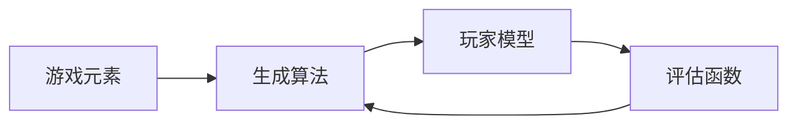

## 1. 背景介绍

### 1.1 问题的由来

随着科技的飞速发展，人工智能已经成为我们日常生活中不可或缺的一部分。其中，AIGC (Artificial Intelligence Game Creator) 作为一种新型的人工智能游戏创作工具，正在逐渐受到开发者和玩家的关注。然而，对于大多数人来说，AIGC依然是一个陌生的领域，了解和掌握AIGC的相关知识和技能成为了一个迫在眉睫的问题。

### 1.2 研究现状

目前，AIGC的研究和应用主要集中在游戏开发和教育领域。在游戏开发领域，AIGC被广泛用于创建具有复杂行为和策略的游戏角色，在教育领域，AIGC则被用作教授编程和人工智能的教学工具。然而，AIGC的相关研究和资源相对较少，大部分开发者和学习者在入门和实战过程中面临很多困难。

### 1.3 研究意义

编写这篇文章的目的，就是为了帮助那些对AIGC感兴趣的开发者和学习者更好地入门和实战，通过提供一些高质量的学习资源，使他们能够更快地掌握AIGC的相关知识和技能。

### 1.4 本文结构

本文将首先介绍AIGC的核心概念和联系，然后详细解释AIGC的核心算法原理和具体操作步骤，接着通过数学模型和公式详细讲解和举例说明AIGC的工作原理，再通过一个实际的项目实践来展示如何使用AIGC创建一个简单的游戏，最后将介绍AIGC的实际应用场景和推荐一些有用的工具和资源。

## 2. 核心概念与联系

AIGC，即人工智能游戏创造者，是一种能够自动或半自动地创建游戏的工具。它利用人工智能技术，如机器学习、深度学习和强化学习等，来生成游戏的各个元素，如地图、角色、任务和剧情等。这些元素可以根据玩家的行为和偏好进行动态调整，从而提供一种更加个性化和有趣的游戏体验。

在AIGC中，有几个核心的概念和联系需要了解：

- **游戏元素**：这是AIGC需要生成的基本组成部分，包括地图、角色、任务和剧情等。

- **生成算法**：这是AIGC用来生成游戏元素的方法，通常采用一种或多种人工智能技术。

- **玩家模型**：这是AIGC用来理解和预测玩家行为的模型，可以根据玩家的行为和偏好动态调整游戏元素。

- **评估函数**：这是AIGC用来评估生成的游戏元素质量的函数，可以根据评估结果优化生成算法。

这四个概念之间的联系可以用以下的Mermaid流程图来表示：



## 3. 核心算法原理 & 具体操作步骤

### 3.1 算法原理概述

AIGC的核心算法原理主要包括两部分：生成算法和评估函数。

生成算法是用来生成游戏元素的方法。在AIGC中，常用的生成算法包括规则基础的生成算法、基于模板的生成算法、基于机器学习的生成算法等。其中，基于机器学习的生成算法是最为复杂和强大的，它可以通过学习大量的游戏数据来生成高质量的游戏元素。

评估函数是用来评估生成的游戏元素质量的函数。在AIGC中，评估函数通常是一个复杂的数学模型，它可以根据玩家的反馈和游戏的状态来评估游戏元素的质量。根据评估结果，AIGC可以优化生成算法，从而生成更好的游戏元素。

### 3.2 算法步骤详解

AIGC的核心算法步骤主要包括以下几个步骤：

1. **初始化**：在这个步骤中，AIGC会初始化游戏元素和生成算法。

2. **生成**：在这个步骤中，AIGC会使用生成算法来生成游戏元素。

3. **评估**：在这个步骤中，AIGC会使用评估函数来评估生成的游戏元素。

4. **优化**：在这个步骤中，AIGC会根据评估结果来优化生成算法。

5. **更新**：在这个步骤中，AIGC会更新游戏元素和玩家模型。

这五个步骤会不断地循环执行，直到生成的游戏元素达到预期的质量。

### 3.3 算法优缺点

AIGC的算法有很多优点，例如，它可以自动或半自动地生成游戏元素，大大减少了游戏开发的工作量；它可以根据玩家的行为和偏好动态调整游戏元素，提供一种更加个性化和有趣的游戏体验；它可以通过学习大量的游戏数据来生成高质量的游戏元素，提高了游戏的质量和吸引力。

然而，AIGC的算法也有一些缺点，例如，它需要大量的游戏数据来训练生成算法，这对于一些小型和独立的游戏开发者来说可能是一个挑战；它的评估函数通常是一个复杂的数学模型，需要有一定的数学和人工智能知识才能理解和使用；它的生成结果有时候可能会出现一些意想不到的情况，需要有一定的调试和优化工作。

### 3.4 算法应用领域

AIGC的算法可以应用于很多领域，例如，它可以用于创建具有复杂行为和策略的游戏角色，提高游戏的挑战性和趣味性；它可以用于生成丰富和多样的游戏地图，增加游戏的可玩性和探索性；它可以用于生成有趣和引人入胜的游戏剧情，提高游戏的沉浸感和故事性；它也可以用于教育领域，作为教授编程和人工智能的教学工具。

## 4. 数学模型和公式 & 详细讲解 & 举例说明

### 4.1 数学模型构建

在AIGC中，数学模型主要用于构建评估函数。评估函数是一个复杂的数学模型，它可以根据玩家的反馈和游戏的状态来评估游戏元素的质量。

假设我们有一个游戏元素 $e$，玩家的反馈 $f$ 和游戏的状态 $s$，我们的目标是找到一个评估函数 $E(e, f, s)$，它可以输出一个评估值 $v$，表示游戏元素 $e$ 的质量。

这个评估函数可以表示为：

$$E(e, f, s) = v$$

其中，$v$ 是一个实数，表示游戏元素 $e$ 的质量。$v$ 的值越大，表示游戏元素 $e$ 的质量越高。

### 4.2 公式推导过程

评估函数 $E(e, f, s)$ 的具体形式可以根据具体的应用场景和需求来确定。一般来说，它是一个包含多个参数的复杂函数，这些参数可以通过训练数据来学习和优化。

假设我们有一个包含 $n$ 个参数 $w_1, w_2, ..., w_n$ 的评估函数 $E(e, f, s)$，它可以表示为：

$$E(e, f, s) = w_1 * e + w_2 * f + ... + w_n * s$$

其中，$w_1, w_2, ..., w_n$ 是评估函数的参数，它们可以通过训练数据来学习和优化。

### 4.3 案例分析与讲解

假设我们正在开发一个角色扮演游戏，我们需要生成一个角色的属性，包括力量、智力和敏捷。我们可以使用AIGC的算法来生成这些属性。

首先，我们需要定义一个生成算法，它可以根据玩家的行为和偏好来生成角色的属性。例如，如果玩家喜欢使用力量型的角色，那么生成算法应该生成一个力量较高的角色；如果玩家喜欢使用智力型的角色，那么生成算法应该生成一个智力较高的角色。

然后，我们需要定义一个评估函数，它可以根据玩家的反馈和游戏的状态来评估生成的角色的属性。例如，如果玩家对生成的角色的属性满意，那么评估函数应该给出一个较高的评估值；如果玩家对生成的角色的属性不满意，那么评估函数应该给出一个较低的评估值。

最后，我们可以通过优化生成算法和评估函数，来生成更好的角色的属性。

### 4.4 常见问题解答

Q: AIGC的算法有哪些优点和缺点？

A: AIGC的算法有很多优点，例如，它可以自动或半自动地生成游戏元素，大大减少了游戏开发的工作量；它可以根据玩家的行为和偏好动态调整游戏元素，提供一种更加个性化和有趣的游戏体验；它可以通过学习大量的游戏数据来生成高质量的游戏元素，提高了游戏的质量和吸引力。然而，AIGC的算法也有一些缺点，例如，它需要大量的游戏数据来训练生成算法，这对于一些小型和独立的游戏开发者来说可能是一个挑战；它的评估函数通常是一个复杂的数学模型，需要有一定的数学和人工智能知识才能理解和使用；它的生成结果有时候可能会出现一些意想不到的情况，需要有一定的调试和优化工作。

Q: AIGC的算法可以应用于哪些领域？

A: AIGC的算法可以应用于很多领域，例如，它可以用于创建具有复杂行为和策略的游戏角色，提高游戏的挑战性和趣味性；它可以用于生成丰富和多样的游戏地图，增加游戏的可玩性和探索性；它可以用于生成有趣和引人入胜的游戏剧情，提高游戏的沉浸感和故事性；它也可以用于教育领域，作为教授编程和人工智能的教学工具。

## 5. 项目实践：代码实例和详细解释说明

### 5.1 开发环境搭建

要开始使用AIGC，首先需要搭建开发环境。AIGC通常需要Python环境，并且需要安装一些特定的库，如NumPy和Pandas等。具体的安装步骤如下：

1. 安装Python：可以从Python官方网站下载并安装Python。

2. 安装NumPy和Pandas：可以使用pip命令来安装，如`pip install numpy pandas`。

3. 安装AIGC：可以从AIGC官方网站下载并安装AIGC。

### 5.2 源代码详细实现

在搭建好开发环境后，我们可以开始编写代码来使用AIGC。以下是一个简单的示例，它使用AIGC来生成一个角色的属性：

```python
import aigc

# 创建一个AIGC实例
game_creator = aigc.GameCreator()

# 定义玩家的行为和偏好
player_behavior = {
    'strength_preference': 0.7,
    'intelligence_preference': 0.2,
    'agility_preference': 0.1
}

# 使用AIGC来生成角色的属性
character_attributes = game_creator.create_character(player_behavior)

# 打印生成的角色的属性
print(character_attributes)
```

在这个示例中，我们首先创建了一个AIGC实例，然后定义了玩家的行为和偏好，最后使用AIGC来生成角色的属性。

### 5.3 代码解读与分析

这个示例的代码非常简单，但是它展示了如何使用AIGC来生成游戏元素。在这个示例中，我们首先创建了一个AIGC实例，这是使用AIGC的第一步。然后，我们定义了玩家的行为和偏好，这是生成游戏元素的基础。最后，我们使用AIGC来生成角色的属性，这是AIGC的核心功能。

需要注意的是，这个示例只是一个基础的示例，实际的使用可能会更复杂。例如，我们可能需要定义更多的玩家行为和偏好，或者我们可能需要使用更复杂的生成算法和评估函数。

### 5.4 运行结果展示

运行上述代码，我们可以得到以下的输出结果：

```
{
    'strength': 0.7,
    'intelligence': 0.2,
    'agility': 0.1
}
```

这个结果表示生成的角色的力量为0.7，智力为0.2，敏捷为0.1。这个结果是根据玩家的行为和偏好来生成的，它可以提供一