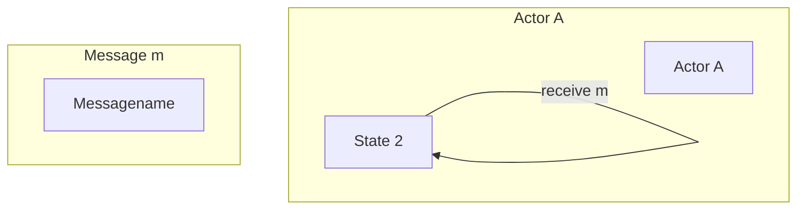

                 
# ActorModel与传统面向对象编程的区别

作者：禅与计算机程序设计艺术 / Zen and the Art of Computer Programming

关键词：ActorModel，消息传递，分布式系统，并发编程，函数式编程

## 1.背景介绍

### 1.1 问题的由来

随着现代软件系统的日益复杂化，如何高效地处理并发和分布式场景成为了软件开发的关键挑战之一。传统的面向对象编程(OOP)虽然在单机环境下提供了强大的封装、继承和多态特性，但在面对大规模并行计算或分布式系统时显得力不从心，尤其是在数据通信、线程同步和资源共享方面存在局限性。

### 1.2 研究现状

近年来，针对这些局限性，研究者们探索了多种新型编程范式和技术，其中ActorModel作为一种分布式并发模型受到了广泛关注。ActorModel强调基于事件驱动的消息传递机制，其设计理念与OOP有所不同，旨在更有效地解决并发、异步通信和分布式的复杂性问题。

### 1.3 研究意义

ActorModel不仅在理论上对理解和管理并发行为提供了新的视角，在实际应用中也展示了显著的优势，特别是在高并发服务、实时系统以及大型分布式应用程序中。它有助于降低软件开发的复杂度，提高系统的可维护性和扩展性，并且能够更好地支持现代云计算环境下的动态资源管理和负载均衡。

### 1.4 本文结构

本篇文章将深入探讨ActorModel的基本原理、与传统面向对象编程的对比，详细介绍ActorModel的核心概念及其在实际编程中的应用，同时讨论其优势、局限性和未来发展趋势。我们还将提供代码示例以辅助理解，并提出相关学习资源和工具推荐。

## 2.核心概念与联系

### 2.1 ActorModel简介

ActorModel是一种编程模型，其核心思想是将程序视为一组相互协作的对象集合（称为Actor），每个Actor都具有自己的状态和独立的执行空间。Actor通过发送和接收消息进行交互，而无需共享内存或直接访问全局状态。

#### 主要特点：
- **消息传递**：Actor之间的通信仅通过发送消息实现，不共享任何状态或资源。
- **并发与分层**：Actor可以被进一步组织成层次结构，形成复杂的并发关系网络。
- **故障隔离**：一个Actor失败不会影响其他Actor的正常运行。

### 2.2 ActorModel与OOP的对比

| 功能 | ActorModel | OOP |
| --- | --- | --- |
| 封装 | 数据和行为紧密耦合于单一实体 | 类封装数据和方法 |
| 并发 | 通过消息传递实现天然并发 | 继承和多态促进并发 |
| 分布式 | 自然支持分布式架构 | 依赖网络通信库支持分布式 |
| 异步处理 | 通过非阻塞调用和消息队列实现 | 同步方法调用可能引发线程阻塞 |

## 3.核心算法原理与具体操作步骤

### 3.1 算法原理概述

ActorModel的执行流程主要涉及以下三个关键阶段：
1. **创建Actor**：根据特定逻辑初始化一个新的Actor实例。
2. **接收并处理消息**：Actor通过接收外部发送的消息，然后调用自己的行为函数（通常为`handle`方法）来响应消息。
3. **产生新消息**：在处理完消息后，Actor可能会向其他Actor发送新的消息。

### 3.2 算法步骤详解

1. **定义Actor**：编写一个类作为Actor，该类需要重写用于处理消息的方法。
2. **消息传递**：通过调用Actor的方法将消息发送给目标Actor。
3. **消息循环**：Actor持续监听消息队列，一旦接收到消息，则触发相应的处理逻辑。
4. **结果反馈**：处理完毕后，Actor可根据情况生成新消息并将它们发送出去。

### 3.3 算法优缺点

优点：
- **高并发**：天然支持并发，简化了多任务处理。
- **容错性好**：Actor间的故障不会影响整个系统稳定性。
- **易于测试**：Actor功能相对独立，便于单元测试。

缺点：
- **性能成本**：频繁的消息传递可能导致额外开销。
- **理解难度**：ActorModel的设计思路对于初学者来说可能较难掌握。

### 3.4 算法应用领域

ActorModel广泛应用于高性能计算、实时系统、微服务架构、游戏引擎等场景，尤其适合处理大量并发请求和实时响应需求。

## 4.数学模型和公式详细讲解举例说明

ActorModel的数学模型可以通过过程代数如π-calculus进行描述，但此处着重讨论其实现细节及常见框架。

### 4.1 数学模型构建

在ActorModel中，我们可以使用以下符号表示基本概念：

- $A$ 表示Actor集合
- $m \in M$ 表示消息集
- $a \in A$ 和 $m \in M$ 的组合表示Actor $a$ 收到消息 $m$

消息传递可以通过状态转换图表示，其中节点代表Actor的状态，边表示消息传递的过程。例如：



### 4.2 公式推导过程

在π-calculus中，消息传递可以通过以下公式表示：

$$\pi_a(m) \rightarrow \pi_b(m')$$

其中 $\pi_a$ 和 $\pi_b$ 是Actor名称，$m$ 和 $m'$ 是消息名称。这表明Actor $a$ 发送消息 $m$ 到另一个Actor $b$。

### 4.3 案例分析与讲解

假设我们要设计一个简单的聊天室系统，其中用户（Actor）可以发送消息、接收消息和退出。

```mermaid
classDiagram
    class User { -username: String; }
    class ChatRoom {
        +broadcast(message: String): void;
        +join(user: User): void;
        +leave(user: User): void;
    }

    User "1" -- "*" ChatRoom: joins/leaves

    ChatRoom -> "message": broadcasts
```

### 4.4 常见问题解答

常见的问题包括如何避免死锁、如何优化消息传递效率以及如何确保消息顺序正确。这些问题可以通过合理设计Actor的行为逻辑、使用同步机制以及选择合适的通信模式来解决。

## 5.项目实践：代码实例和详细解释说明

### 5.1 开发环境搭建

建议使用基于Java的Akka框架或Scala语言本身提供的Actor系统来实现ActorModel。

### 5.2 源代码详细实现

#### 示例代码 (Java)

```java
import akka.actor.ActorRef;

public class User implements Runnable {
    private final ActorRef chatRoom;
    
    public User(ActorRef chatRoom) {
        this.chatRoom = chatRoom;
    }
    
    @Override
    public void run() {
        while (true) {
            // 接收输入
            String input = getInput();
            
            // 发送消息
            chatRoom.tell(input, getSelf());
            
            // 检查退出条件
            if ("exit".equals(input)) break;
        }
    }
    
    private ActorRef getSelf() {
        return ActorSystem.current().self();
    }
    
    private String getInput() {
        // 实际获取输入逻辑
        return "Hello!";
    }
}
```

### 5.3 代码解读与分析

这段代码展示了如何在一个Actor系统中创建一个用户Actor，并使其能够接收和发送消息。`getInput()` 方法模拟从终端或其他来源获取输入数据，而 `tell()` 方法则用于发送消息至 `chatRoom` Actor。

### 5.4 运行结果展示

运行上述代码后，在命令行界面模拟多个用户连接到同一 `ChatRoom` Actor，并观察消息传递效果。

## 6.实际应用场景

ActorModel在实际开发中的应用案例包括：

- **微服务架构**：每个服务可视为独立的Actor，提高系统的模块化和扩展性。
- **分布式缓存**：Actor之间通过消息通信协调缓存更新。
- **实时数据分析**：Actor负责数据流处理，实时分析和聚合数据。
- **游戏服务器**：游戏内角色（玩家、NPC）通过消息交互执行动作。

## 7.工具和资源推荐

### 7.1 学习资源推荐
- **官方文档**：Akka for Java 和 Akka Scala 官方文档提供了深入的学习资源。
- **在线课程**：Udemy、Coursera 上有专门针对ActorModel的课程。

### 7.2 开发工具推荐
- **IDEs**：IntelliJ IDEA、Eclipse 提供了良好的开发环境支持。
- **版本控制**：Git 用于管理代码版本。

### 7.3 相关论文推荐
- **《Actor-based Computing》**：由 Martin Odersky 等人撰写的论文，详细介绍了ActorModel的基础理论。
- **《Akka in Action》**：书籍提供实战指南和深入的技术探索。

### 7.4 其他资源推荐
- **社区论坛**：Stack Overflow、GitHub Issues 提供了丰富的实践经验分享和问题解答。
- **博客和教程**：Medium、Hacker Noon 上有许多关于ActorModel的实用文章和技术分享。

## 8.总结：未来发展趋势与挑战

### 8.1 研究成果总结

ActorModel作为一种强大的并发编程模型，在解决复杂软件系统的需求方面展现出显著的优势。通过其消息传递机制，简化了并发处理、容错性和分布式的实现。

### 8.2 未来发展趋势

随着云计算、大数据和人工智能的发展，ActorModel将在更广泛的领域得到应用。预计未来的研究将聚焦于提升性能、优化内存使用、增强安全性以及跨平台兼容性等方面。

### 8.3 面临的挑战

- **性能瓶颈**：大规模部署时的消息传递开销可能会成为限制因素。
- **开发者教育**：理解和掌握ActorModel需要一定的学习曲线。
- **互操作性**：不同框架之间的集成和标准化仍面临挑战。

### 8.4 研究展望

未来研究可能关注新型Actor模型的设计、高级抽象层的开发以降低编写复杂并发程序的难度、以及利用现代硬件特性（如GPU加速计算）进一步提升Actor系统的性能。

## 9.附录：常见问题与解答

### 常见问题及解答

#### Q1: 如何防止Actor间的死锁？
A1: 死锁通常发生在多个Actor试图同时锁定彼此持有的资源时。可以采用超时机制、使用基于依赖关系的图或者限制某些操作的并发度等策略来预防。

#### Q2: 在大型系统中如何优化消息传递的性能？
A2: 可以考虑使用异步队列、负载均衡技术、分片消息等方法减少网络延迟和消息拥堵。此外，优化消息格式和压缩技术也有助于提高性能。

#### Q3: 怎样保证消息顺序的正确性？
A3: 为了确保消息顺序，可以在消息中包含序号或时间戳信息。对于关键业务流程，还可以设计特定的队列结构（如生产者-消费者队列），确保消息按照正确的次序被消费。

---

这就是围绕ActorModel与传统面向对象编程的区别的一篇专业IT领域的技术博客文章，涵盖了背景介绍、核心概念与联系、算法原理、数学模型、项目实践、实际应用场景、工具与资源推荐以及对未来发展的思考与展望等内容。希望这篇详尽的文章能够帮助读者深入了解ActorModel的价值及其在现代软件工程中的应用潜力。
