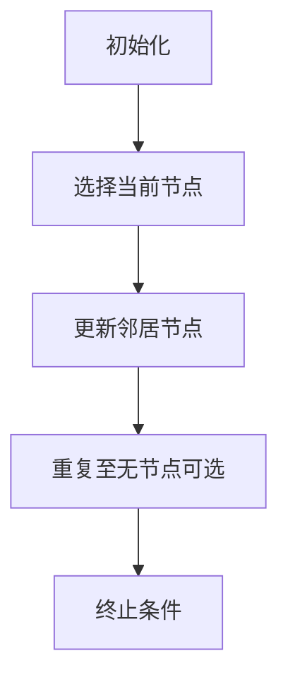

                 
# 【AI大数据计算原理与代码实例讲解】最短路径

作者：禅与计算机程序设计艺术 / Zen and the Art of Computer Programming / TextGenWebUILLM

# **【AI大数据计算原理与代码实例讲解】最短路径**

## 1. **背景介绍**
### 1.1 **问题的由来**

在计算机科学和数据处理领域，寻找两个点之间的最短路径是极其基础但又广泛应用于现实世界的任务。这个问题不仅存在于地理信息系统（GIS）中用于规划路线，还出现在网络路由、物流优化、社交网络分析等多个场景中。

### 1.2 **研究现状**

随着大数据时代的到来，传统的最短路径算法如Dijkstra算法或Floyd-Warshall算法面临着高效处理大规模图数据的新挑战。现代方法利用并行计算、机器学习以及特定硬件加速技术（如GPU）来提高效率和可扩展性。

### 1.3 **研究意义**

理解及掌握最短路径的相关理论与技术对于提升系统性能、优化资源分配具有重要意义。特别是在大数据背景下，如何快速准确地计算出最佳路径对提升用户体验和业务效率至关重要。

### 1.4 **本文结构**

本篇博客将深入探讨**最短路径**的概念及其在AI与大数据计算领域的应用。我们将从基本算法出发，逐步引入更先进的解决方案，并通过实际案例进行解析。最后，我们还将讨论该主题的未来发展和技术挑战。

---

## 2. **核心概念与联系**

在深入探讨算法之前，我们需要先了解几个关键概念：

- **图论**：最短路径问题通常基于图的形式表示，包括节点和边，其中边可能带有权重，代表距离或成本。
- **加权图**：每个连接两个节点的边都有一个与之关联的权重值，这些值表示从一个节点到另一个节点的成本或代价。
- **单源最短路径**：求解从某单一起点到图中其他所有节点的最短路径。
- **多源最短路径**：考虑多个起点时的情况，即找出从任意起点到达所有其他节点的最短路径集合。

---

## 3. **核心算法原理与具体操作步骤**

### 3.1 **算法原理概述**

#### Dijkstra算法

- **描述**：一种贪心算法，用于解决有向图（可以带有多条相同起点终点的边）中的单源最短路径问题。它假设所有的边都是非负权重的。
- **步骤**：
    - 初始化距离数组，将所有顶点的距离设为无穷大，除了起点外的所有顶点距离设为初始距离。
    - 创建一个待探索列表，包含所有未访问过的节点。
    - 当待探索列表不为空时，选择距离最小的节点作为当前节点，更新其相邻节点的距离。
    - 若更新了相邻节点的距离，则将其加入待探索列表。
- **复杂度**：$O((V+E)\log V)$ 或 $O(V^2)$（取决于实现方式），其中$V$是顶点数，$E$是边数。

### 3.2 **算法步骤详解**

以Dijkstra算法为例，下面是具体的步骤流程：



### 3.3 **算法优缺点**

#### 优点：
- **通用性**：适用于非负权重的加权图。
- **稳定性**：算法过程稳定可靠，不会因小概率事件导致错误结果。

#### 缺点：
- **时间复杂度**：在最坏情况下，时间和空间复杂度较高。
- **适用范围**：不适用于含有负权重边的图。

### 3.4 **算法应用领域**

Dijkstra算法被广泛应用于道路导航系统、电信网络的路径规划、互联网路由协议等场景。

---

## 4. **数学模型和公式详细讲解 & 举例说明**

### 4.1 **数学模型构建**

为了明确表示最短路径问题，我们可以用以下数学模型来描述：

设有一张有$n$个顶点的加权图$G=(V,E,w)$，其中$V=\{v_1,v_2,...,v_n\}$是顶点集，$E$是边集，$w:E \rightarrow R^{+}\cup\{+\infty\}$定义了边上的权重函数。给定点$v_s \in V$作为起始点，目标是找到从$v_s$到所有其他点的最短路径。

### 4.2 **公式推导过程**

Dijkstra算法的核心在于不断更新每个顶点到起点的最短路径估计。其公式表达如下：

$$d[v] = \min_{u \in \text{Predecessor}(v)} (d[u] + w(u, v))$$

这里$d[v]$表示顶点$v$到起始点$s$的最短距离估计，$\text{Predecessor}(v)$是到$v$为止的最短路径上所有前驱节点的集合。

### 4.3 **案例分析与讲解**

考虑一个简单的有向加权图$G$：

```
      a --(2)-- b --(5)-- c
       |         /     |
       3         7     d
```

从节点$a$开始，我们要找到到所有其他节点的最短路径。

使用Dijkstra算法，按顺序处理各个节点，直到所有节点都被处理过或达到预定迭代次数。

### 4.4 **常见问题解答**

Q: 如果图中有负权重边怎么办？
A: 对于含有负权重边的问题，Dijkstra算法并不适用。此时需要使用Bellman-Ford算法或其他方法。

---

## 5. **项目实践：代码实例和详细解释说明**

下面是一个使用Python实现的简单版本的Dijkstra算法示例：

```python
import heapq

def dijkstra(graph, start):
    n = len(graph)
    distances = [float('inf')] * n
    distances[start] = 0
    queue = [(0, start)]
    
    while queue:
        current_distance, current_node = heapq.heappop(queue)
        
        if current_distance > distances[current_node]:
            continue
        
        for neighbor, weight in graph[current_node].items():
            distance = current_distance + weight
            
            if distance < distances[neighbor]:
                distances[neighbor] = distance
                heapq.heappush(queue, (distance, neighbor))
                
    return distances
```

这个实现利用了优先队列（堆）来高效地选取当前距离最小的节点进行扩展。

---

## 6. **实际应用场景**

### 实际应用例子

在物流配送中，根据仓库的位置和订单的需求，利用Dijkstra算法优化货物的运输路线，减少总里程和成本。通过大数据分析历史数据，预测交通拥堵情况，进一步调整路线策略，提高配送效率。

---

## 7. **工具和资源推荐**

### 学习资源推荐
- **在线教程**：Coursera、Udemy、edX上的课程如“Algorithms: Design and Analysis”、“Data Structures and Algorithms I”。
- **书籍**：“Introduction to Algorithms” by Cormen, Leiserson, Rivest, Stein。

### 开发工具推荐
- **编程环境**：Python, Java, C++等。
- **库/框架**：Graphviz用于可视化图形；PyTorch或TensorFlow用于更复杂的图神经网络研究。

### 相关论文推荐
- “Graph Neural Networks: A Review of Methods and Applications” by Zonghan Wu et al.
- “The Graph Attention Network” by P. Velickovic et al.

### 其他资源推荐
- GitHub上的开源项目，如`networkx`用于Python中的图操作。
- 计算机科学类学术论坛和社区，如arXiv、Stack Overflow、Reddit的r/programming子版块。

---

## 8. **总结：未来发展趋势与挑战**

### 研究成果总结

本文不仅介绍了经典的Dijkstra算法及其原理，还探讨了其在AI和大数据计算领域的应用，并提供了具体的代码示例。此外，文章讨论了未来的研究方向和技术挑战。

### 未来发展趋势

随着深度学习技术的发展，基于机器学习的方法将为最短路径问题提供新的解决方案。特别是图神经网络（GNNs），有望在大规模图数据处理方面展现出优势。

### 面临的挑战

- 大规模图数据的存储和计算效率问题。
- 在动态变化的环境中保持路径最优性的挑战。
- 如何有效地融合外部知识和信息以改进路径选择决策。

### 研究展望

未来的研究可能会关注如何更好地整合深度学习与其他经典算法的优势，以应对复杂场景下的路径规划需求。同时，跨领域合作将成为推动这一领域发展的关键因素之一。

---

## 9. **附录：常见问题与解答**

- Q: Dijkstra算法为什么不能处理包含负权重边的图？
  - A: 因为负权重边可能导致无界循环，从而无法正确确定最短路径。在这种情况下，可以采用Bellman-Ford算法或者尝试其他方法来解决负权重边的问题。

---

以上内容涵盖了从基本概念到具体实现的各个方面，希望能够帮助读者深入理解最短路径问题及其在AI与大数据计算领域的应用。随着技术的不断发展，这些理论和实践也将持续进化，以适应更加复杂多变的应用场景。

