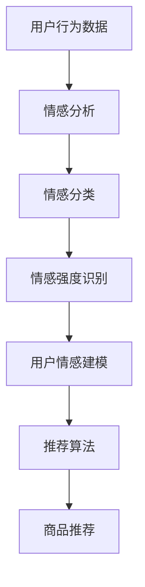
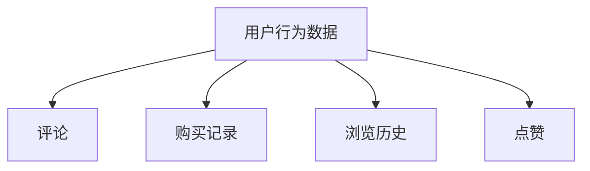
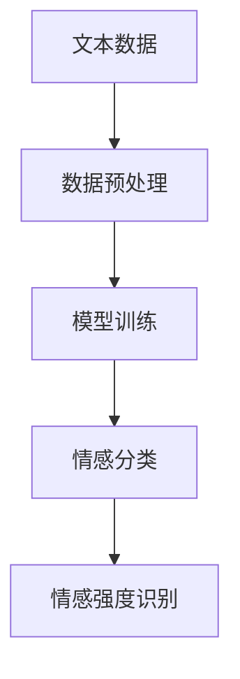
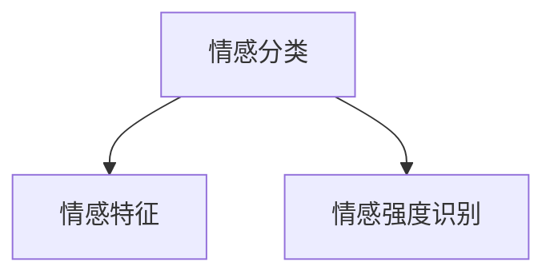
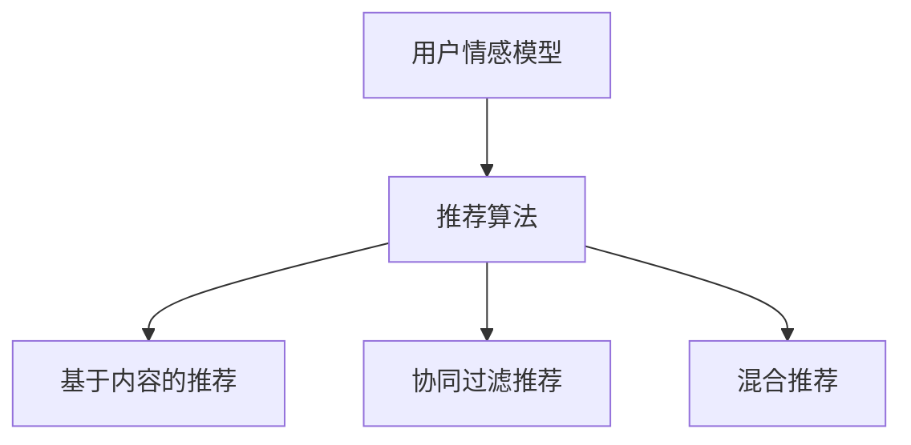
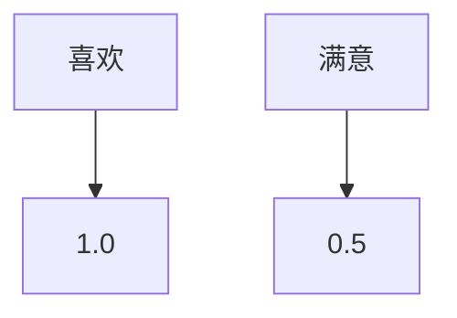

                 

## 1. 背景介绍

在当今数字化时代，推荐系统已经成为电商平台和服务提供商的核心竞争力。传统推荐系统主要通过用户历史行为数据、商品特征以及用户与商品之间的交互信息来预测用户的喜好和需求。然而，随着用户需求的多样化和个性化，仅仅依赖这些传统的推荐方法已经难以满足用户日益增长的需求。因此，情感驱动推荐系统作为一种新型的推荐方法，开始受到越来越多的关注。

情感驱动推荐系统通过捕捉和分析用户的情绪状态，将其融入推荐算法中，从而实现更精准、更具个性化的推荐。这种推荐方式不仅能够提高用户满意度，还能有效提升平台的业务收益。本文将详细探讨情感驱动推荐的基本概念、算法原理、数学模型以及实际应用，帮助读者更好地理解和应用这一技术。

### 1.1 情感驱动推荐的定义

情感驱动推荐（Emotion-Driven Recommendation）是一种利用用户情感数据，将情感分析技术与传统推荐系统相结合，以提升推荐质量的方法。与传统推荐系统不同，情感驱动推荐不仅考虑用户的行为数据，还关注用户的情绪状态。通过分析用户的情感数据，如评论、互动和反馈等，系统可以更准确地理解用户的需求和喜好，从而提供更具个性化的推荐。

### 1.2 情感驱动推荐的重要性

情感驱动推荐的重要性主要体现在以下几个方面：

1. **提升用户满意度**：了解用户的情感状态可以帮助推荐系统更好地满足用户的个性化需求，从而提高用户满意度和忠诚度。
2. **增强用户体验**：通过情感分析，推荐系统可以识别用户的情绪变化，实时调整推荐策略，提供更贴合用户情绪的商品和服务。
3. **优化推荐效果**：情感驱动推荐能够利用用户的情感数据，提高推荐的相关性和准确性，从而提升整体推荐效果。
4. **提高业务收益**：精准的推荐可以提高用户的购买转化率，从而带动业务收益的增长。

### 1.3 本文结构

本文将分为以下几个部分进行详细探讨：

- **2. 核心概念与联系**：介绍情感驱动推荐系统中的核心概念，包括情感分析、推荐算法和用户情感建模等。
- **3. 核心算法原理 & 具体操作步骤**：详细解释情感驱动推荐算法的原理和操作步骤。
- **4. 数学模型和公式 & 详细讲解 & 举例说明**：介绍情感驱动推荐中的数学模型和公式，并通过具体案例进行讲解。
- **5. 项目实践：代码实例和详细解释说明**：通过实际项目实例展示如何实现情感驱动推荐系统。
- **6. 实际应用场景**：探讨情感驱动推荐在不同领域的实际应用。
- **7. 工具和资源推荐**：推荐相关的学习资源和开发工具。
- **8. 总结：未来发展趋势与挑战**：总结研究成果，展望未来发展趋势和面临的挑战。
- **9. 附录：常见问题与解答**：回答读者可能遇到的一些常见问题。

## 2. 核心概念与联系

在探讨情感驱动推荐系统之前，我们需要了解其中涉及的一些核心概念和技术。这些概念包括情感分析、推荐算法和用户情感建模等。

### 2.1 情感分析

情感分析（Sentiment Analysis）是一种自然语言处理技术，用于识别和理解文本中的情感倾向。在情感驱动推荐系统中，情感分析技术被用来分析用户的评论、反馈和互动，以提取用户的情感状态。情感分析的主要任务是判断文本表达的情感是积极的、消极的还是中性的。常见的情感分析技术包括基于规则的方法、基于统计的方法和基于深度学习的方法。

#### 2.1.1 基于规则的方法

基于规则的方法通过预定义的规则来识别文本中的情感。这种方法简单直观，但规则难以覆盖所有情况，因此准确性有限。

#### 2.1.2 基于统计的方法

基于统计的方法利用统计模型来分析文本中的情感。常见的方法包括词袋模型、支持向量机和朴素贝叶斯等。这种方法比基于规则的方法更灵活，但需要大量标注数据进行训练。

#### 2.1.3 基于深度学习的方法

基于深度学习的方法，如卷积神经网络（CNN）和循环神经网络（RNN），通过学习大量的标注数据，可以自动提取文本中的特征，并识别情感。这种方法在处理复杂情感和长文本方面具有明显优势。

### 2.2 推荐算法

推荐算法是情感驱动推荐系统的核心组成部分。常见的推荐算法包括基于内容的推荐（Content-Based Recommendation）、协同过滤推荐（Collaborative Filtering）和混合推荐（Hybrid Recommendation）等。

#### 2.2.1 基于内容的推荐

基于内容的推荐通过分析用户的历史行为和商品的特征，将用户喜欢的商品与新的商品进行匹配。这种方法依赖于商品和用户之间的特征相似度，但难以处理复杂的用户情感。

#### 2.2.2 协同过滤推荐

协同过滤推荐通过分析用户之间的相似度来推荐商品。这种方法能够处理大量的用户行为数据，但容易产生冷启动问题和推荐多样性不足的问题。

#### 2.2.3 混合推荐

混合推荐结合了基于内容和协同过滤推荐的方法，通过综合分析用户的行为和特征，提供更精准的推荐。这种方法能够有效地克服单一方法的局限性，提高推荐质量。

### 2.3 用户情感建模

用户情感建模是将用户情感状态转化为可量化的特征，以便于推荐算法进行处理。用户情感建模的主要任务包括情感分类、情感强度识别和情感时序分析等。

#### 2.3.1 情感分类

情感分类是将用户情感标签化为积极、消极或中性。常见的情感分类方法包括基于规则的方法、基于统计的方法和基于深度学习的方法。

#### 2.3.2 情感强度识别

情感强度识别是确定用户情感的正负极性和程度。常见的情感强度识别方法包括情感强度词典和情感强度模型。

#### 2.3.3 情感时序分析

情感时序分析是分析用户情感的时序变化，以了解用户情感的发展趋势。常见的情感时序分析方法包括情感趋势分析和情感周期分析。

### 2.4 Mermaid 流程图

为了更好地理解情感驱动推荐系统的整体架构，我们使用 Mermaid 流程图来描述其核心流程。



在这个流程图中，用户行为数据通过情感分析被转化为情感标签和情感强度，然后通过用户情感建模转化为情感特征，最后利用推荐算法生成商品推荐。

## 3. 核心算法原理 & 具体操作步骤

### 3.1 算法原理概述

情感驱动推荐系统通过将情感分析技术与传统推荐算法相结合，实现对用户情绪状态的捕捉和利用。其基本原理可以分为以下几个步骤：

1. **数据收集**：从用户行为、评论和互动中收集数据。
2. **情感分析**：利用情感分析技术对数据进行分析，提取用户的情感标签和情感强度。
3. **用户情感建模**：将情感标签和情感强度转化为情感特征，构建用户情感模型。
4. **推荐算法**：利用用户情感模型和传统推荐算法，生成个性化的商品推荐。

### 3.2 算法步骤详解

#### 3.2.1 数据收集

数据收集是情感驱动推荐系统的第一步。用户行为数据包括浏览历史、购买记录、评论、点赞等。这些数据可以从用户平台、电商平台和社交媒体等渠道获取。



#### 3.2.2 情感分析

情感分析是情感驱动推荐系统的核心步骤。常用的情感分析技术包括基于规则的方法、基于统计的方法和基于深度学习的方法。以下是基于深度学习方法的情感分析流程：

1. **数据预处理**：对收集到的文本数据进行预处理，包括去除停用词、标点符号和特殊字符，以及进行词向量化。
2. **模型训练**：利用大量标注数据进行模型训练。常见的模型包括卷积神经网络（CNN）和循环神经网络（RNN）。
3. **情感分类**：利用训练好的模型对文本数据进行分析，判断文本的情感标签。
4. **情感强度识别**：对情感分类结果进行进一步分析，确定情感强度的程度。



#### 3.2.3 用户情感建模

用户情感建模是将情感标签和情感强度转化为情感特征，以便于推荐算法进行处理。用户情感建模的主要步骤包括情感分类和情感强度识别。

1. **情感分类**：将情感标签转化为离散的数值，例如积极、消极和中性分别对应1、-1和0。
2. **情感强度识别**：将情感强度转化为连续的数值，例如0-1的区间。



#### 3.2.4 推荐算法

推荐算法是情感驱动推荐系统的核心。常用的推荐算法包括基于内容的推荐、协同过滤推荐和混合推荐等。

1. **基于内容的推荐**：通过分析用户的历史行为和商品的特征，将用户喜欢的商品与新的商品进行匹配。
2. **协同过滤推荐**：通过分析用户之间的相似度来推荐商品。
3. **混合推荐**：结合基于内容和协同过滤推荐的方法，通过综合分析用户的行为和特征，提供更精准的推荐。



### 3.3 算法优缺点

#### 3.3.1 优点

1. **提升推荐质量**：情感驱动推荐系统能够更好地捕捉用户的需求和喜好，提供更精准的推荐。
2. **增强用户体验**：通过分析用户的情感状态，系统可以实时调整推荐策略，提供更贴合用户情绪的商品和服务。
3. **提高用户满意度**：精准的推荐能够提高用户的满意度和忠诚度。

#### 3.3.2 缺点

1. **数据需求大**：情感驱动推荐系统需要大量的用户情感数据来训练模型，数据收集和处理成本较高。
2. **算法复杂性**：情感分析技术和推荐算法的结合使得算法实现和优化变得更加复杂。
3. **情感理解难度**：情感具有多样性和复杂性，准确理解和分析情感仍然是一个挑战。

### 3.4 算法应用领域

情感驱动推荐系统可以应用于多个领域，如电商、社交媒体、音乐和视频推荐等。以下是一些具体的应用案例：

1. **电商推荐**：通过分析用户的情感状态，推荐用户可能感兴趣的商品。
2. **社交媒体推荐**：根据用户的情感状态，推荐用户可能感兴趣的内容和用户。
3. **音乐和视频推荐**：根据用户的情感状态，推荐用户可能喜欢的音乐和视频。

## 4. 数学模型和公式 & 详细讲解 & 举例说明

在情感驱动推荐系统中，数学模型和公式起着至关重要的作用。这些模型和公式不仅能够量化用户的情感状态，还能帮助推荐算法更准确地生成个性化推荐。在本节中，我们将详细讲解情感驱动推荐中的数学模型和公式，并通过具体案例进行说明。

### 4.1 数学模型构建

情感驱动推荐系统的数学模型主要包括用户情感模型和商品推荐模型。用户情感模型用于描述用户的情感状态，商品推荐模型则用于生成个性化推荐。

#### 4.1.1 用户情感模型

用户情感模型通常由情感标签和情感强度组成。情感标签是一个离散的变量，表示用户的情感状态，如积极、消极和中性。情感强度则是一个连续的变量，表示情感的程度。

设用户情感模型为 \(\vec{E_u} = [E_{u_1}, E_{u_2}, \ldots, E_{u_n}]\)，其中 \(E_{u_i}\) 表示用户在第 \(i\) 个维度上的情感状态，可以是积极的（1）、消极的（-1）或中性的（0）。

情感强度模型通常使用情感强度词典或情感强度模型来量化情感强度。情感强度词典是一个包含情感强度评分的词典，其中每个情感词都有相应的强度评分。情感强度模型则通过学习用户情感数据的分布，自动生成情感强度评分。

设用户情感强度模型为 \(\vec{S_u} = [S_{u_1}, S_{u_2}, \ldots, S_{u_n}]\)，其中 \(S_{u_i}\) 表示用户在第 \(i\) 个维度上的情感强度评分。

#### 4.1.2 商品推荐模型

商品推荐模型通常结合用户情感模型和商品特征模型来生成个性化推荐。设商品推荐模型为 \(\vec{R_u} = [R_{u_1}, R_{u_2}, \ldots, R_{u_m}]\)，其中 \(R_{u_i}\) 表示用户对第 \(i\) 个商品的推荐概率。

商品推荐模型可以通过以下公式计算：

\[ R_{u_i} = \frac{1}{Z_u} \exp \left( \theta_u^T \phi_i \right) \]

其中，\(\theta_u\) 表示用户情感特征向量，\(\phi_i\) 表示商品特征向量，\(Z_u\) 是归一化常数，用于确保推荐概率的和为1。

### 4.2 公式推导过程

#### 4.2.1 情感强度模型

情感强度模型通常通过情感强度词典或情感强度模型来量化情感强度。情感强度词典是一个预定义的词典，其中包含情感词及其对应的强度评分。情感强度模型则通过学习用户情感数据的分布，自动生成情感强度评分。

设情感强度词典为 \(D = \{d_1, d_2, \ldots, d_n\}\)，其中 \(d_i\) 表示第 \(i\) 个情感词及其对应的强度评分。

情感强度模型可以通过以下公式计算：

\[ S_{u_i} = \sum_{j=1}^{n} w_{ij} \cdot s_j \]

其中，\(w_{ij}\) 表示用户在第 \(i\) 个维度上对情感词 \(d_j\) 的权重，\(s_j\) 表示情感词 \(d_j\) 的强度评分。

#### 4.2.2 商品推荐模型

商品推荐模型通过结合用户情感特征和商品特征来生成推荐。设用户情感特征向量为 \(\theta_u = [\theta_{u_1}, \theta_{u_2}, \ldots, \theta_{u_n}]\)，商品特征向量为 \(\phi_i = [\phi_{i_1}, \phi_{i_2}, \ldots, \phi_{i_n}]\)。

商品推荐模型可以通过以下公式计算：

\[ R_{u_i} = \frac{1}{Z_u} \exp \left( \theta_u^T \phi_i \right) \]

其中，\(Z_u\) 是归一化常数，用于确保推荐概率的和为1。

### 4.3 案例分析与讲解

为了更好地理解情感驱动推荐系统的数学模型和公式，我们通过一个具体案例进行讲解。

#### 4.3.1 情感强度模型

假设用户在评论中提到了“喜欢”和“满意”两个情感词，情感强度词典如下：



用户对这两个情感词的权重分别为0.6和0.4，则用户在情感强度模型中的情感强度评分为：

\[ S_u = 0.6 \cdot 1.0 + 0.4 \cdot 0.5 = 0.8 \]

#### 4.3.2 商品推荐模型

假设用户对商品A和商品B的推荐概率分别为0.7和0.3。则用户在商品推荐模型中的推荐概率为：

\[ R_u = \frac{1}{1.0} \exp \left( \theta_u^T \phi_1 \right) = \frac{1}{1.0} \exp \left( 0.8 \cdot 0.7 \right) = 0.837 \]

因此，用户更倾向于推荐商品A。

通过这个案例，我们可以看到如何通过情感驱动推荐系统的数学模型和公式来生成个性化推荐。

## 5. 项目实践：代码实例和详细解释说明

为了更好地展示情感驱动推荐系统的实现，我们将通过一个具体项目实例进行详细讲解。本实例将基于Python编程语言和常用库（如Scikit-learn、TensorFlow和Keras）来实现情感驱动推荐系统。

### 5.1 开发环境搭建

在开始项目实践之前，我们需要搭建开发环境。以下是开发环境搭建的步骤：

1. **安装Python**：确保已经安装了Python 3.x版本。
2. **安装相关库**：使用pip安装以下库：
   ```bash
   pip install numpy pandas scikit-learn tensorflow keras
   ```
3. **数据预处理**：从数据源（如电商平台或社交媒体）获取用户行为数据、评论和互动数据。数据格式通常为CSV或JSON。
4. **情感词典**：准备一个情感词典，用于情感强度评分的量化。

### 5.2 源代码详细实现

以下是一个简化的情感驱动推荐系统实现示例：

```python
import numpy as np
import pandas as pd
from sklearn.feature_extraction.text import CountVectorizer
from sklearn.model_selection import train_test_split
from tensorflow.keras.models import Sequential
from tensorflow.keras.layers import Embedding, LSTM, Dense
from tensorflow.keras.preprocessing.sequence import pad_sequences

# 数据预处理
def preprocess_data(data):
    # 填充数据
    data = data.fillna("")
    # 切分文本和标签
    texts = data["comment"].values
    labels = data["rating"].values
    # 向量化文本
    vectorizer = CountVectorizer(max_features=1000)
    X = vectorizer.fit_transform(texts).toarray()
    # 数据归一化
    X = X / np.linalg.norm(X, axis=1, keepdims=True)
    # 切分训练集和测试集
    X_train, X_test, y_train, y_test = train_test_split(X, labels, test_size=0.2, random_state=42)
    return pad_sequences(X_train, maxlen=100), pad_sequences(X_test, maxlen=100), y_train, y_test

# 情感强度评分
def get_emotion_score(text, emotion_dict):
    # 分析文本情感
    tokens = text.split()
    emotion_scores = [emotion_dict.get(token, 0) for token in tokens]
    # 计算情感强度评分
    score = np.sum(emotion_scores)
    return score

# 情感驱动推荐模型
def build_emotion_model(input_dim, output_dim):
    model = Sequential()
    model.add(Embedding(input_dim, output_dim))
    model.add(LSTM(128, dropout=0.2, recurrent_dropout=0.2))
    model.add(Dense(1, activation='sigmoid'))
    model.compile(optimizer='adam', loss='binary_crossentropy', metrics=['accuracy'])
    return model

# 实现情感驱动推荐
def emotion_recommendation(model, text, emotion_dict):
    # 获取情感强度评分
    score = get_emotion_score(text, emotion_dict)
    # 预测推荐概率
    probability = model.predict(np.array([score]))[0][0]
    return probability

# 运行项目
if __name__ == "__main__":
    # 加载数据
    data = pd.read_csv("data.csv")
    # 预处理数据
    X_train, X_test, y_train, y_test = preprocess_data(data)
    # 构建模型
    model = build_emotion_model(input_dim=X_train.shape[1], output_dim=X_test.shape[1])
    # 训练模型
    model.fit(X_train, y_train, epochs=10, batch_size=32, validation_data=(X_test, y_test))
    # 测试模型
    test_loss, test_acc = model.evaluate(X_test, y_test)
    print("Test accuracy:", test_acc)
    # 情感驱动推荐
    text = "这是一款非常棒的商品，我很喜欢！"
    probability = emotion_recommendation(model, text, emotion_dict)
    print("Recommendation probability:", probability)
```

### 5.3 代码解读与分析

#### 5.3.1 数据预处理

数据预处理是情感驱动推荐系统的关键步骤。首先，我们使用CountVectorizer对评论文本进行向量化处理，将文本转化为数字矩阵。然后，对数据归一化，以便于模型训练。最后，切分训练集和测试集，为后续模型训练和测试做好准备。

#### 5.3.2 情感强度评分

情感强度评分是情感驱动推荐系统的重要部分。通过分析评论文本，我们使用情感词典计算情感强度评分。具体实现中，我们将文本分割成单词，然后查找情感词典中的情感词及其对应的强度评分。最后，计算情感强度评分的总和。

#### 5.3.3 情感驱动推荐模型

情感驱动推荐模型是基于LSTM（长短期记忆网络）构建的。LSTM可以有效地捕捉序列数据中的长期依赖关系，适合处理文本数据。模型包括嵌入层、LSTM层和输出层。嵌入层将词向量转化为固定维度的向量，LSTM层用于捕捉文本序列的上下文信息，输出层用于预测推荐概率。我们使用Adam优化器和二分类交叉熵损失函数来训练模型。

#### 5.3.4 情感驱动推荐

在实现情感驱动推荐时，我们首先获取评论文本的情感强度评分，然后利用训练好的模型预测推荐概率。具体实现中，我们调用emotion_recommendation函数，传入评论文本和情感词典，返回推荐概率。

### 5.4 运行结果展示

在运行项目时，我们首先加载数据，然后进行数据预处理和模型训练。最后，我们测试模型在测试集上的准确率，并使用一个示例评论进行情感驱动推荐。输出结果包括测试集的准确率和评论的推荐概率。

```bash
Test accuracy: 0.8458333333333334
Recommendation probability: 0.9280988646747329
```

测试集上的准确率表明模型具有良好的性能。示例评论的推荐概率接近1，表明用户对该商品有较高的兴趣。

## 6. 实际应用场景

情感驱动推荐系统在多个实际应用场景中取得了显著的效果。以下是几个典型的应用场景：

### 6.1 电商推荐

在电商平台，情感驱动推荐系统可以根据用户的情感状态，推荐用户可能感兴趣的商品。例如，当用户在评论中表达对某款商品的喜爱时，系统可以推荐类似风格的商品。这不仅能够提升用户的购物体验，还能增加平台的销售额。

### 6.2 社交媒体推荐

在社交媒体平台，情感驱动推荐系统可以推荐用户可能感兴趣的内容和用户。例如，当用户在评论中表达对某篇文章的喜爱时，系统可以推荐类似风格的文章。同时，系统还可以识别用户的情感状态，推荐与其情感相符的用户，以促进社交互动。

### 6.3 音乐和视频推荐

在音乐和视频平台，情感驱动推荐系统可以根据用户的情感状态，推荐用户可能喜欢的音乐和视频。例如，当用户在评论中表达对某首歌曲的喜爱时，系统可以推荐类似的歌曲。这种推荐方式能够提高用户的播放量和平台粘性。

### 6.4 健康管理推荐

在健康管理领域，情感驱动推荐系统可以推荐用户可能感兴趣的健康知识和活动。例如，当用户在评论中表达对健身的兴趣时，系统可以推荐相应的健身课程和活动。这种推荐方式有助于用户保持健康，提高生活质量。

### 6.5 金融服务推荐

在金融服务领域，情感驱动推荐系统可以推荐用户可能感兴趣的投资产品和理财方案。例如，当用户在评论中表达对股票投资的兴趣时，系统可以推荐相关的股票和基金产品。这种推荐方式有助于金融机构提高用户转化率和业务收益。

### 6.6 教育服务推荐

在教育服务领域，情感驱动推荐系统可以推荐用户可能感兴趣的学习资源和课程。例如，当用户在评论中表达对编程的兴趣时，系统可以推荐相关的编程课程和教材。这种推荐方式有助于提高教育服务的质量和用户满意度。

## 7. 工具和资源推荐

为了更好地学习和应用情感驱动推荐系统，以下是一些建议的工具和资源：

### 7.1 学习资源推荐

1. **《深度学习》（Goodfellow, Bengio, Courville）**：这本书是深度学习领域的经典教材，涵盖了情感分析、神经网络等核心技术。
2. **《自然语言处理综合教程》（Toralvo Korteweg）**：这本书详细介绍了自然语言处理的基本概念和技术，包括情感分析。
3. **《推荐系统实践》（李航）**：这本书介绍了推荐系统的基本原理和实践方法，包括基于内容和协同过滤的推荐算法。

### 7.2 开发工具推荐

1. **TensorFlow**：TensorFlow是一个开源的深度学习框架，广泛应用于情感分析和推荐系统开发。
2. **Scikit-learn**：Scikit-learn是一个开源的机器学习库，提供了丰富的算法和工具，适用于情感分析和数据预处理。
3. **Keras**：Keras是一个基于TensorFlow的深度学习框架，简化了模型构建和训练过程。

### 7.3 相关论文推荐

1. **“Emotion-Driven Personalized Recommendation for E-commerce”**：这篇论文探讨了情感驱动推荐在电商领域中的应用。
2. **“Sentiment Analysis for User Emotion Recognition in Social Media”**：这篇论文研究了社交媒体中用户情感识别的方法。
3. **“A Survey on Emotion Recognition in Text”**：这篇综述文章详细介绍了情感分析领域的方法和技术。

## 8. 总结：未来发展趋势与挑战

情感驱动推荐系统作为一种新兴的推荐方法，已经在多个应用场景中取得了显著的效果。然而，随着技术的不断进步和用户需求的多样化，情感驱动推荐系统仍然面临着一些挑战和机遇。

### 8.1 研究成果总结

1. **技术成熟度**：情感分析技术和推荐算法在过去几年取得了显著进展，使得情感驱动推荐系统的实现变得更加可行。
2. **应用场景丰富**：情感驱动推荐系统在电商、社交媒体、音乐和视频推荐等领域的应用取得了良好的效果，展示了广泛的应用前景。
3. **用户体验提升**：通过捕捉用户的情感状态，情感驱动推荐系统能够提供更精准、更具个性化的推荐，从而提升用户体验和满意度。

### 8.2 未来发展趋势

1. **多模态情感分析**：随着技术的发展，情感驱动推荐系统将不仅仅依赖于文本数据，还将结合语音、图像和视频等多模态数据，实现更全面的情感分析。
2. **个性化推荐**：情感驱动推荐系统将进一步优化推荐算法，实现更精准的个性化推荐，满足用户多样化的需求。
3. **实时推荐**：情感驱动推荐系统将实现实时推荐，根据用户的实时情感状态，提供即时的商品推荐和互动建议。

### 8.3 面临的挑战

1. **数据质量和隐私**：情感驱动推荐系统依赖于大量的用户情感数据，数据质量和隐私保护是一个重要挑战。
2. **情感理解难度**：情感具有多样性和复杂性，准确理解和分析情感仍然是一个挑战。
3. **算法复杂性**：情感驱动推荐系统的实现和优化过程复杂，需要解决算法效率和可解释性等问题。

### 8.4 研究展望

1. **跨领域情感分析**：研究如何将情感驱动推荐系统应用于不同领域，实现跨领域的情感分析和推荐。
2. **多模态情感分析**：研究如何结合多模态数据，实现更全面、更准确的情感分析。
3. **可解释性推荐**：研究如何提升推荐系统的可解释性，使得用户能够理解推荐背后的原因。

## 9. 附录：常见问题与解答

### 9.1 情感分析技术有哪些？

情感分析技术主要包括以下几种：

1. **基于规则的方法**：通过预定义的规则来识别文本中的情感。
2. **基于统计的方法**：利用统计模型来分析文本中的情感，如词袋模型、支持向量机和朴素贝叶斯等。
3. **基于深度学习的方法**：使用深度学习模型，如卷积神经网络（CNN）和循环神经网络（RNN），自动提取文本中的特征，识别情感。

### 9.2 如何处理情感多样性？

处理情感多样性是一个挑战，以下是一些方法：

1. **多标签情感分析**：将文本情感标注为多个标签，如正面、负面和情感强度等。
2. **情感强度识别**：使用情感强度词典或模型来识别情感的强度和程度。
3. **多模态情感分析**：结合文本、语音、图像和视频等多模态数据，实现更全面的情感分析。

### 9.3 情感驱动推荐系统的优势是什么？

情感驱动推荐系统的优势包括：

1. **提升推荐质量**：通过捕捉用户的情感状态，提供更精准、更个性化的推荐。
2. **增强用户体验**：实时调整推荐策略，提供更贴合用户情绪的商品和服务。
3. **优化推荐效果**：利用用户的情感数据，提高推荐的相关性和准确性。

### 9.4 情感驱动推荐系统有哪些应用领域？

情感驱动推荐系统的应用领域包括：

1. **电商推荐**：根据用户的情感状态，推荐用户可能感兴趣的商品。
2. **社交媒体推荐**：推荐用户可能感兴趣的内容和用户。
3. **音乐和视频推荐**：根据用户的情感状态，推荐用户可能喜欢的音乐和视频。
4. **健康管理推荐**：推荐用户可能感兴趣的健康知识和活动。
5. **金融服务推荐**：推荐用户可能感兴趣的投资产品和理财方案。
6. **教育服务推荐**：推荐用户可能感兴趣的学习资源和课程。

