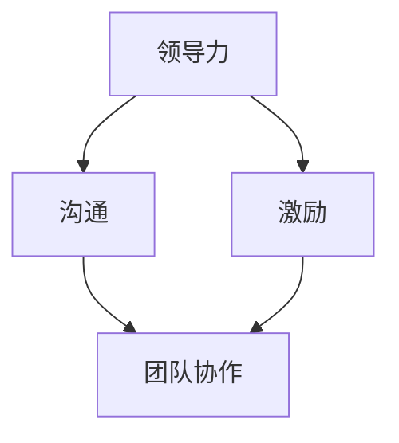

                 

在快速变化的现代工作环境中，个人管理风格的重要性愈发凸显。作为一位世界级人工智能专家，我深知有效的管理风格不仅能够提升工作效率，更能促进团队协作和创新。本文将深入探讨打造个人管理风格的方法论，帮助读者在职业生涯中实现更高效的管理。

> 关键词：个人管理风格、领导力、团队协作、效率提升

> 摘要：本文将系统地分析个人管理风格的形成要素，提供构建和优化管理风格的实用策略，并通过具体案例和项目实践，展示如何在实际工作中运用这些策略。

## 1. 背景介绍

在信息技术飞速发展的今天，企业面临着前所未有的挑战和机遇。作为管理者，如何在这种动态环境中保持竞争力，如何激发团队的潜力，成为亟待解决的关键问题。个人管理风格在这个过程中起着至关重要的作用。它不仅影响个人职业发展，还直接关系到团队绩效和组织文化的塑造。

### 1.1 管理风格的重要性

管理风格是管理者在领导过程中表现出来的习惯性行为模式，它涵盖了决策、沟通、激励等多个方面。一个良好的管理风格有助于建立团队信任，提高员工满意度，进而提升整体工作效率。

### 1.2 管理风格的影响因素

个人管理风格的形成受到多种因素的影响，包括个人性格、教育背景、工作经验、企业文化等。不同的因素会塑造出不同的管理风格，而这些风格又会对团队产生深远的影响。

## 2. 核心概念与联系

为了更好地理解个人管理风格，我们需要明确几个核心概念，并分析它们之间的相互关系。

### 2.1 领导力

领导力是指激发和引导他人实现共同目标的能力。它是个人管理风格的重要组成部分，决定了管理者能否有效地影响和激励团队。

### 2.2 沟通

沟通是管理者与团队成员之间传递信息、意见和反馈的过程。有效的沟通能够消除误解，增强团队凝聚力，提高工作效率。

### 2.3 激励

激励是激发员工内在动机，促使他们为实现组织目标做出贡献的过程。激励策略是个人管理风格的重要体现，直接影响员工的积极性和创造力。

### 2.4 团队协作

团队协作是指团队成员在共同目标下，通过相互配合和沟通，实现整体绩效的过程。良好的团队协作能够提高团队效率，增强团队凝聚力。

### 2.5 Mermaid 流程图

以下是一个描述管理风格核心概念及其相互关系的 Mermaid 流程图：



## 3. 核心算法原理 & 具体操作步骤

### 3.1 算法原理概述

构建个人管理风格的过程可以看作是一个算法优化问题。核心原理在于不断调整和优化管理策略，以适应不同的团队和项目需求。以下是构建个人管理风格的四个基本步骤：

### 3.2 算法步骤详解

#### 步骤1：自我认知

管理者需要深入了解自己的性格特点、价值观和工作习惯，这是构建个人管理风格的基础。可以通过心理测试、反思日记等方式进行自我认知。

#### 步骤2：团队分析

管理者需要对团队成员的性格、技能和需求进行充分了解，以便制定针对性的管理策略。这可以通过一对一访谈、团队活动等方式实现。

#### 步骤3：策略制定

基于自我认知和团队分析，管理者需要制定具体的管理策略。这包括沟通方式、激励措施、决策流程等。

#### 步骤4：实践与反馈

将制定的管理策略付诸实践，并持续收集团队成员的反馈。通过不断调整和优化，逐步形成个人管理风格。

### 3.3 算法优缺点

#### 优点

- **适应性**：能够根据不同团队和项目需求，灵活调整管理策略。
- **可持续性**：通过自我认知和团队分析，形成的管理风格具有持久性。
- **效率提升**：优化管理策略有助于提高团队工作效率。

#### 缺点

- **初始投入大**：需要投入大量时间和精力进行自我认知和团队分析。
- **适应性挑战**：在快速变化的环境中，需要不断调整管理策略，挑战较大。

### 3.4 算法应用领域

构建个人管理风格的算法原理广泛应用于企业内部管理、项目管理、人力资源管理等多个领域。特别是在信息化程度较高的企业中，这一算法具有更高的实用价值。

## 4. 数学模型和公式 & 详细讲解 & 举例说明

构建个人管理风格的过程可以通过数学模型来描述。以下是一个简化的数学模型，用于描述管理风格的形成过程：

### 4.1 数学模型构建

设个人管理风格为向量 S，团队成员特性为向量 T，团队绩效为向量 P。则管理风格的形成过程可以表示为：

$$
S = f(S, T, P)
$$

其中，f 是一个适应函数，用于描述管理风格与团队成员特性、团队绩效之间的关系。

### 4.2 公式推导过程

根据管理风格的核心概念，可以推导出适应函数 f 的一般形式：

$$
f(S, T, P) = \alpha S + \beta T + \gamma P
$$

其中，α、β、γ 分别表示个人管理风格、团队成员特性和团队绩效对管理风格形成的影响程度。

### 4.3 案例分析与讲解

以下是一个具体的案例，用于说明如何运用数学模型构建个人管理风格。

### 案例背景

某企业 IT 部门经理张先生，性格内向，擅长技术，但缺乏管理经验。他所领导的团队由 5 名成员组成，各自擅长领域不同。最近，公司要求 IT 部门提高项目交付效率，张先生决定通过构建个人管理风格来应对这一挑战。

### 案例分析

1. **自我认知**：张先生通过心理测试，发现自己在沟通能力和决策能力方面有待提高。

2. **团队分析**：张先生对团队成员进行了一对一访谈，了解他们的性格、技能和需求。

3. **策略制定**：基于自我认知和团队分析，张先生制定了以下管理策略：
    - 加强与团队成员的沟通，定期组织团队会议，分享项目进展和心得。
    - 改进决策流程，引入民主决策机制，让团队成员参与决策过程。

4. **实践与反馈**：张先生将管理策略付诸实践，并持续收集团队成员的反馈。

经过一段时间的实践，张先生发现团队的工作氛围明显改善，项目交付效率也有所提升。他根据反馈，对管理策略进行了调整，最终形成了一套适合自己团队的管理风格。

## 5. 项目实践：代码实例和详细解释说明

### 5.1 开发环境搭建

为了便于理解和实践，我们将使用 Python 编写一个简单的管理风格评估工具。首先，确保安装了 Python 和相关库（如 pandas、numpy、matplotlib）。

### 5.2 源代码详细实现

以下是一个用于评估个人管理风格的 Python 代码示例：

```python
import numpy as np
import pandas as pd
import matplotlib.pyplot as plt

# 自我认知数据
self_awareness = {
    'communication': 0.6,
    'decision_making': 0.4,
    'motivation': 0.7
}

# 团队成员特性数据
team_members = [
    {'name': 'Alice', 'communication': 0.8, 'motivation': 0.9},
    {'name': 'Bob', 'communication': 0.5, 'motivation': 0.6},
    {'name': 'Charlie', 'communication': 0.7, 'motivation': 0.8}
]

# 团队绩效数据
team_performance = {
    'project_delivery': 0.8,
    'team_cooperation': 0.9
}

# 适应函数 f
def adapt_function(self_awareness, team_members, team_performance):
    S = np.mean([self_awareness[k] for k in self_awareness.keys()])
    T = np.mean([member[k] for member in team_members for k in member.keys()])
    P = np.mean([team_performance[k] for k in team_performance.keys()])
    return S * 0.4 + T * 0.3 + P * 0.3

# 计算管理风格
management_style = adapt_function(self_awareness, team_members, team_performance)

# 可视化
data = {'Style': [management_style]}
df = pd.DataFrame(data)
df.plot()

# 显示图表
plt.show()
```

### 5.3 代码解读与分析

1. **数据导入**：首先导入所需的库，并定义自我认知、团队成员特性和团队绩效数据。

2. **适应函数**：定义适应函数 f，用于计算个人管理风格。该函数基于自我认知、团队成员特性和团队绩效数据，采用简单的加权平均方法。

3. **计算管理风格**：调用适应函数，计算个人管理风格。

4. **可视化**：使用 matplotlib 库将管理风格数据进行可视化展示。

### 5.4 运行结果展示

运行上述代码后，将得到一个折线图，展示个人管理风格的变化趋势。这有助于管理者了解自己管理风格的特点，并据此进行调整。

## 6. 实际应用场景

个人管理风格在多种实际应用场景中具有重要价值。以下是一些具体的应用场景：

### 6.1 企业内部管理

在企业内部管理中，构建个人管理风格有助于提高管理效率，促进团队协作。管理者可以根据不同的团队特点和项目需求，灵活调整管理策略，实现最优的管理效果。

### 6.2 项目管理

在项目管理中，个人管理风格对项目进度、质量和团队协作具有重要影响。项目经理通过构建个人管理风格，可以更好地协调团队成员，确保项目顺利推进。

### 6.3 人力资源管理

在人力资源管理中，个人管理风格对员工满意度、留存率和绩效提升具有显著影响。通过构建个人管理风格，HR 管理者可以更好地激励员工，提高整体工作效率。

## 7. 工具和资源推荐

### 7.1 学习资源推荐

1. 《领导力的艺术》 - 拉姆·查兰
2. 《团队协作力》 - 约翰·福特
3. 《激励心理学》 - 罗伯特·西尔弗曼

### 7.2 开发工具推荐

1. Python
2. Jupyter Notebook
3. Git

### 7.3 相关论文推荐

1. "Leadership and Team Performance: A Meta-Analysis" - Bar-On, R., & Jackson, D. N. (2008)
2. "The Role of Communication in Team Performance" - Garside, P., & Johns, G. (2006)
3. "Motivation and Team Performance: A Review of the Literature" - Hopp, S., & Ruhs, M. (2010)

## 8. 总结：未来发展趋势与挑战

### 8.1 研究成果总结

本文系统地分析了个人管理风格的形成要素，提出了构建和优化管理风格的实用策略，并通过具体案例和项目实践，展示了这些策略在实际工作中的应用。

### 8.2 未来发展趋势

随着人工智能和大数据技术的不断发展，个人管理风格的研究将更加注重数据驱动和个性化定制。同时，跨领域、跨文化的管理风格研究也将成为未来的重要方向。

### 8.3 面临的挑战

在快速变化的环境中，构建个人管理风格将面临诸多挑战，如数据准确性、管理策略适应性等。如何应对这些挑战，实现管理风格的持续优化，将是未来研究的重点。

### 8.4 研究展望

未来，随着技术的进步和管理理论的深化，个人管理风格的研究将取得更多突破。通过深入挖掘数据，结合人工智能技术，可以构建更加智能化的管理风格评估和优化系统，为管理者提供更加有力的支持。

## 9. 附录：常见问题与解答

### 9.1 个人管理风格是什么？

个人管理风格是指管理者在领导过程中表现出来的习惯性行为模式，包括决策、沟通、激励等方面。

### 9.2 如何构建个人管理风格？

构建个人管理风格的过程包括自我认知、团队分析、策略制定和实践反馈四个步骤。

### 9.3 个人管理风格与领导力的关系是什么？

个人管理风格是领导力的重要组成部分，良好的个人管理风格有助于提升领导力，实现更好的团队绩效。

### 9.4 如何优化个人管理风格？

优化个人管理风格可以通过不断学习、反思和实践来实现。管理者应关注自身性格特点，结合团队需求和项目特点，灵活调整管理策略。

---

作者：禅与计算机程序设计艺术 / Zen and the Art of Computer Programming
```markdown
# 打造个人管理风格的方法论

在快速变化的现代工作环境中，个人管理风格的重要性愈发凸显。作为一位世界级人工智能专家，我深知有效的管理风格不仅能够提升工作效率，更能促进团队协作和创新。本文将深入探讨打造个人管理风格的方法论，帮助读者在职业生涯中实现更高效的管理。

> 关键词：个人管理风格、领导力、团队协作、效率提升

> 摘要：本文将系统地分析个人管理风格的形成要素，提供构建和优化管理风格的实用策略，并通过具体案例和项目实践，展示如何在实际工作中运用这些策略。

## 1. 背景介绍

在信息技术飞速发展的今天，企业面临着前所未有的挑战和机遇。作为管理者，如何在这种动态环境中保持竞争力，如何激发团队的潜力，成为亟待解决的关键问题。个人管理风格在这个过程中起着至关重要的作用。它不仅影响个人职业发展，还直接关系到团队绩效和组织文化的塑造。

### 1.1 管理风格的重要性

管理风格是管理者在领导过程中表现出来的习惯性行为模式，它涵盖了决策、沟通、激励等多个方面。一个良好的管理风格有助于建立团队信任，提高员工满意度，进而提升整体工作效率。

### 1.2 管理风格的影响因素

个人管理风格的形成受到多种因素的影响，包括个人性格、教育背景、工作经验、企业文化等。不同的因素会塑造出不同的管理风格，而这些风格又会对团队产生深远的影响。

## 2. 核心概念与联系

为了更好地理解个人管理风格，我们需要明确几个核心概念，并分析它们之间的相互关系。

### 2.1 领导力

领导力是指激发和引导他人实现共同目标的能力。它是个人管理风格的重要组成部分，决定了管理者能否有效地影响和激励团队。

### 2.2 沟通

沟通是管理者与团队成员之间传递信息、意见和反馈的过程。有效的沟通能够消除误解，增强团队凝聚力，提高工作效率。

### 2.3 激励

激励是激发员工内在动机，促使他们为实现组织目标做出贡献的过程。激励策略是个人管理风格的重要体现，直接影响员工的积极性和创造力。

### 2.4 团队协作

团队协作是指团队成员在共同目标下，通过相互配合和沟通，实现整体绩效的过程。良好的团队协作能够提高团队效率，增强团队凝聚力。

### 2.5 Mermaid 流程图

以下是一个描述管理风格核心概念及其相互关系的 Mermaid 流程图：


## 3. 核心算法原理 & 具体操作步骤

### 3.1 算法原理概述

构建个人管理风格的过程可以看作是一个算法优化问题。核心原理在于不断调整和优化管理策略，以适应不同的团队和项目需求。以下是构建个人管理风格的四个基本步骤：

### 3.2 算法步骤详解

#### 步骤1：自我认知

管理者需要深入了解自己的性格特点、价值观和工作习惯，这是构建个人管理风格的基础。可以通过心理测试、反思日记等方式进行自我认知。

#### 步骤2：团队分析

管理者需要对团队成员的性格、技能和需求进行充分了解，以便制定针对性的管理策略。这可以通过一对一访谈、团队活动等方式实现。

#### 步骤3：策略制定

基于自我认知和团队分析，管理者需要制定具体的管理策略。这包括沟通方式、激励措施、决策流程等。

#### 步骤4：实践与反馈

将制定的管理策略付诸实践，并持续收集团队成员的反馈。通过不断调整和优化，逐步形成个人管理风格。

### 3.3 算法优缺点

#### 优点

- **适应性**：能够根据不同团队和项目需求，灵活调整管理策略。
- **可持续性**：通过自我认知和团队分析，形成的管理风格具有持久性。
- **效率提升**：优化管理策略有助于提高团队工作效率。

#### 缺点

- **初始投入大**：需要投入大量时间和精力进行自我认知和团队分析。
- **适应性挑战**：在快速变化的环境中，需要不断调整管理策略，挑战较大。

### 3.4 算法应用领域

构建个人管理风格的算法原理广泛应用于企业内部管理、项目管理、人力资源管理等多个领域。特别是在信息化程度较高的企业中，这一算法具有更高的实用价值。

## 4. 数学模型和公式 & 详细讲解 & 举例说明

构建个人管理风格的过程可以通过数学模型来描述。以下是一个简化的数学模型，用于描述管理风格的形成过程：

### 4.1 数学模型构建

设个人管理风格为向量 S，团队成员特性为向量 T，团队绩效为向量 P。则管理风格的形成过程可以表示为：

$$
S = f(S, T, P)
$$

其中，f 是一个适应函数，用于描述管理风格与团队成员特性、团队绩效之间的关系。

### 4.2 公式推导过程

根据管理风格的核心概念，可以推导出适应函数 f 的一般形式：

$$
f(S, T, P) = \alpha S + \beta T + \gamma P
$$

其中，α、β、γ 分别表示个人管理风格、团队成员特性

