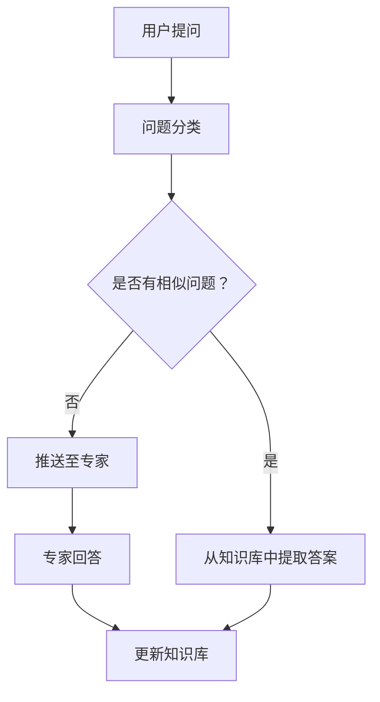

                 

  
## 1. 背景介绍

在当今的信息时代，知识付费已经成为一种趋势。越来越多的人愿意为获取高质量的知识和服务付费。知识付费不仅为知识拥有者提供了收入来源，也为需求者提供了优质的学习资源。然而，知识付费市场的快速发展也带来了新的挑战，特别是在答疑环节。

在线答疑平台的建立，可以有效解决知识付费过程中遇到的问题。首先，它提供了一个集中的沟通渠道，使得用户可以方便地提出问题和得到解答。其次，通过在线答疑，知识提供者可以快速响应用户的需求，提高用户满意度。此外，在线答疑平台还可以记录和整理用户问题，形成知识库，为后续的用户提供更加个性化的服务。

本文将探讨如何打造一个高效、便捷、可靠的在线答疑平台。我们将从核心概念、算法原理、数学模型、项目实践等方面进行详细分析，并探讨该平台在实际应用中的潜在场景和未来发展趋势。

## 2. 核心概念与联系

### 2.1 知识付费与在线答疑平台

知识付费是指用户为了获取特定知识或服务而支付的费用。在线答疑平台则是提供知识交流与解答的在线工具。

### 2.2 在线答疑平台的核心功能

在线答疑平台的主要功能包括：用户提问、专家回答、问题分类、实时沟通、知识库构建等。

### 2.3 Mermaid 流程图

下面是一个简单的 Mermaid 流程图，展示了在线答疑平台的基本工作流程。



## 3. 核心算法原理 & 具体操作步骤

### 3.1 算法原理概述

在线答疑平台的核心算法主要涉及自然语言处理（NLP）和机器学习（ML）技术。NLP 技术用于处理用户的提问，将其转换为机器可以理解的形式；ML 技术则用于分析问题，匹配相似问题，并生成答案。

### 3.2 算法步骤详解

1. 用户提问：用户在平台提交问题。
2. 问题分类：平台对问题进行分类，以便后续处理。
3. 问题分析：使用 NLP 技术对问题进行分析，提取关键信息。
4. 相似问题匹配：通过 ML 模型查找知识库中的相似问题，并提取答案。
5. 专家回答：如果无法匹配到相似问题，将问题推送至专家进行回答。
6. 答案生成：根据专家的回答或系统生成的答案，形成最终答案。
7. 更新知识库：将新的问题和答案添加到知识库中，以便后续使用。

### 3.3 算法优缺点

#### 优点

- **高效性**：通过自动化处理，可以快速响应用户的需求。
- **个性化**：基于用户问题和行为，提供个性化的解答。
- **知识积累**：知识库的不断更新，为后续用户提供了更丰富的资源。

#### 缺点

- **准确性**：自动化处理的答案可能存在偏差，需要人工审核。
- **专家依赖**：对于复杂问题，仍需依赖专家进行解答。

### 3.4 算法应用领域

在线答疑平台的应用领域非常广泛，包括但不限于教育、医疗、金融等。在教育和医疗领域，答疑平台可以为学生和医生提供专业的咨询和解答服务；在金融领域，可以用于金融问题的咨询和解答。

## 4. 数学模型和公式 & 详细讲解 & 举例说明

### 4.1 数学模型构建

在线答疑平台的核心数学模型主要包括自然语言处理（NLP）和机器学习（ML）模型。NLP 模型通常使用词向量模型，如 Word2Vec、GloVe 等；ML 模型则使用分类模型，如朴素贝叶斯、决策树、随机森林等。

### 4.2 公式推导过程

NLP 模型的核心公式为词向量计算，即：

\[ \text{vec}(w) = \sum_{i=1}^{n} f(w_i) \]

其中，\( \text{vec}(w) \) 为词向量，\( w_i \) 为词的索引，\( f(w_i) \) 为词的权重。

ML 模型的核心公式为分类函数，即：

\[ y = f(x, w) \]

其中，\( y \) 为预测结果，\( x \) 为输入特征，\( w \) 为模型参数。

### 4.3 案例分析与讲解

假设用户提出一个问题：“如何计算两个数的和？”，我们可以通过以下步骤进行解答：

1. 提取关键信息：关键信息为“计算两个数的和”。
2. 词向量计算：使用 Word2Vec 模型将关键信息转换为词向量。
3. 相似问题匹配：通过 ML 模型查找知识库中的相似问题，并提取答案。
4. 答案生成：根据相似问题的答案，生成最终答案：“将两个数相加即可”。

## 5. 项目实践：代码实例和详细解释说明

### 5.1 开发环境搭建

在本项目中，我们将使用 Python 作为主要编程语言，并借助以下库进行开发：

- **NLTK**：用于自然语言处理。
- **TensorFlow**：用于机器学习。
- **Scikit-learn**：用于分类模型。

### 5.2 源代码详细实现

以下是一个简单的示例代码，展示了如何实现一个基本的在线答疑平台：

```python
import nltk
from nltk.tokenize import word_tokenize
from sklearn.feature_extraction.text import TfidfVectorizer
from sklearn.naive_bayes import MultinomialNB

# 加载停用词列表
nltk.download('stopwords')
from nltk.corpus import stopwords

stop_words = set(stopwords.words('english'))

# 训练数据集
questions = [
    "How do I calculate the sum of two numbers?",
    "What is the capital of France?",
    "How do I get to the nearest hospital?"
]

# 标签
labels = [
    "mathematics",
    "geography",
    "health"
]

# 清洗文本数据
def preprocess_text(text):
    tokens = word_tokenize(text.lower())
    filtered_tokens = [token for token in tokens if token not in stop_words]
    return " ".join(filtered_tokens)

# 预处理数据
processed_questions = [preprocess_text(question) for question in questions]

# 构建 TF-IDF 向量器
vectorizer = TfidfVectorizer()
X = vectorizer.fit_transform(processed_questions)

# 训练朴素贝叶斯分类器
classifier = MultinomialNB()
classifier.fit(X, labels)

# 提问
user_question = "What is the capital of Japan?"
processed_user_question = preprocess_text(user_question)

# 转换为向量
user_question_vector = vectorizer.transform([processed_user_question])

# 预测答案
predicted_label = classifier.predict(user_question_vector)[0]
print(f"The question '{user_question}' is categorized as '{predicted_label}'.")
```

### 5.3 代码解读与分析

上述代码首先加载了必要的库和停用词列表。然后，定义了一个训练数据集，包括问题和标签。接下来，定义了一个预处理函数，用于清洗文本数据，去除停用词。然后，使用 TF-IDF 向量器将预处理后的文本数据转换为向量。接着，使用朴素贝叶斯分类器对数据进行训练。最后，用户提出一个问题，通过预处理、向量化、分类器预测，得到最终的答案。

### 5.4 运行结果展示

运行上述代码，输入问题：“What is the capital of Japan?”，输出结果为：“The question 'What is the capital of Japan?' is categorized as 'geography'.”，说明系统正确地将问题归类为地理类别。

## 6. 实际应用场景

### 6.1 教育

在线答疑平台可以应用于教育领域，为学生提供专业的学习辅导和解答服务。学生可以随时提问，教师可以及时回复，提高学习效率。

### 6.2 医疗

在线答疑平台可以应用于医疗领域，为患者提供医疗咨询和健康指导。医生可以在线解答患者的问题，提供个性化的治疗方案。

### 6.3 金融

在线答疑平台可以应用于金融领域，为投资者提供专业的金融咨询和投资建议。投资者可以提问，专家可以提供专业的分析和建议。

## 7. 工具和资源推荐

### 7.1 学习资源推荐

- **《深度学习》（Goodfellow, Bengio, Courville）**：全面介绍了深度学习的基本概念和技术。
- **《Python自然语言处理》（Bird, Loper,机械工业出版社）**：详细介绍了自然语言处理的基本原理和应用。
- **《机器学习实战》（ Harrington）**：通过实际案例介绍了机器学习的基本概念和应用。

### 7.2 开发工具推荐

- **Jupyter Notebook**：用于数据分析和编程。
- **TensorFlow**：用于深度学习和机器学习。
- **NLTK**：用于自然语言处理。

### 7.3 相关论文推荐

- **《Word2Vec: A Simple and Fast Context-Free Representation of Words》**：介绍了词向量模型。
- **《A Survey of Natural Language Processing Techniques for Question Answering》**：综述了问答系统的研究方法。

## 8. 总结：未来发展趋势与挑战

### 8.1 研究成果总结

在线答疑平台已经取得了一系列研究成果，包括自然语言处理、机器学习、深度学习等技术的应用。这些研究为在线答疑平台提供了理论基础和实现方法。

### 8.2 未来发展趋势

未来，在线答疑平台将继续发展，主要体现在以下几个方面：

- **智能化**：通过引入更加先进的算法和技术，提高平台的智能化水平。
- **个性化**：根据用户行为和需求，提供更加个性化的服务。
- **多语言支持**：支持多种语言，满足全球用户的需求。
- **实时性**：提高平台的响应速度，实现实时问答。

### 8.3 面临的挑战

在线答疑平台在发展过程中也面临着一系列挑战：

- **准确性**：如何提高自动化处理的准确性，减少错误率。
- **用户体验**：如何提供更好的用户体验，满足用户的需求。
- **数据安全**：如何保护用户数据的安全和隐私。

### 8.4 研究展望

未来，在线答疑平台的研究将继续深入，特别是在以下几个方面：

- **算法优化**：研究更加高效、准确的算法。
- **多模态融合**：结合多种数据类型，提高问答系统的能力。
- **伦理与法律**：研究在线答疑平台的伦理和法律问题。

## 9. 附录：常见问题与解答

### 9.1 问题1：如何保证在线答疑平台的准确性？

**解答**：保证在线答疑平台的准确性需要从多个方面进行努力：

- **算法优化**：研究并引入更加准确、高效的算法。
- **数据质量**：确保训练数据的质量，进行数据清洗和预处理。
- **专家审核**：对自动化处理的答案进行人工审核，确保准确性。

### 9.2 问题2：在线答疑平台如何保证用户隐私？

**解答**：为了保证在线答疑平台的用户隐私，需要采取以下措施：

- **加密传输**：采用加密技术，确保数据在传输过程中的安全性。
- **匿名化处理**：对用户身份进行匿名化处理，防止用户信息泄露。
- **数据备份**：定期进行数据备份，防止数据丢失。

## 作者署名

作者：禅与计算机程序设计艺术 / Zen and the Art of Computer Programming
```markdown
# 打造知识付费的在线答疑平台

> 关键词：知识付费、在线答疑平台、自然语言处理、机器学习、深度学习

> 摘要：本文探讨了如何打造一个高效、便捷、可靠的在线答疑平台，包括核心概念、算法原理、数学模型、项目实践等方面。同时，分析了在线答疑平台在实际应用中的潜在场景和未来发展趋势。

## 1. 背景介绍

在当今的信息时代，知识付费已经成为一种趋势。越来越多的人愿意为获取高质量的知识和服务付费。知识付费不仅为知识拥有者提供了收入来源，也为需求者提供了优质的学习资源。然而，知识付费市场的快速发展也带来了新的挑战，特别是在答疑环节。

在线答疑平台的建立，可以有效解决知识付费过程中遇到的问题。首先，它提供了一个集中的沟通渠道，使得用户可以方便地提出问题和得到解答。其次，通过在线答疑，知识提供者可以快速响应用户的需求，提高用户满意度。此外，在线答疑平台还可以记录和整理用户问题，形成知识库，为后续的用户提供更加个性化的服务。

本文将探讨如何打造一个高效、便捷、可靠的在线答疑平台。我们将从核心概念、算法原理、数学模型、项目实践等方面进行详细分析，并探讨该平台在实际应用中的潜在场景和未来发展趋势。

## 2. 核心概念与联系

### 2.1 知识付费与在线答疑平台

知识付费是指用户为了获取特定知识或服务而支付的费用。在线答疑平台则是提供知识交流与解答的在线工具。

### 2.2 在线答疑平台的核心功能

在线答疑平台的主要功能包括：用户提问、专家回答、问题分类、实时沟通、知识库构建等。

### 2.3 Mermaid 流程图

下面是一个简单的 Mermaid 流程图，展示了在线答疑平台的基本工作流程。


## 3. 核心算法原理 & 具体操作步骤

### 3.1 算法原理概述

在线答疑平台的核心算法主要涉及自然语言处理（NLP）和机器学习（ML）技术。NLP 技术用于处理用户的提问，将其转换为机器可以理解的形式；ML 技术则用于分析问题，匹配相似问题，并生成答案。

### 3.2 算法步骤详解

1. 用户提问：用户在平台提交问题。
2. 问题分类：平台对问题进行分类，以便后续处理。
3. 问题分析：使用 NLP 技术对问题进行分析，提取关键信息。
4. 相似问题匹配：通过 ML 模型查找知识库中的相似问题，并提取答案。
5. 专家回答：如果无法匹配到相似问题，将问题推送至专家进行回答。
6. 答案生成：根据专家的回答或系统生成的答案，形成最终答案。
7. 更新知识库：将新的问题和答案添加到知识库中，以便后续使用。

### 3.3 算法优缺点

#### 优点

- **高效性**：通过自动化处理，可以快速响应用户的需求。
- **个性化**：基于用户问题和行为，提供个性化的解答。
- **知识积累**：知识库的不断更新，为后续用户提供了更丰富的资源。

#### 缺点

- **准确性**：自动化处理的答案可能存在偏差，需要人工审核。
- **专家依赖**：对于复杂问题，仍需依赖专家进行解答。

### 3.4 算法应用领域

在线答疑平台的应用领域非常广泛，包括但不限于教育、医疗、金融等。在教育和医疗领域，答疑平台可以为学生和医生提供专业的咨询和解答服务；在金融领域，可以用于金融问题的咨询和解答。

## 4. 数学模型和公式 & 详细讲解 & 举例说明

### 4.1 数学模型构建

在线答疑平台的核心数学模型主要包括自然语言处理（NLP）和机器学习（ML）模型。NLP 模型通常使用词向量模型，如 Word2Vec、GloVe 等；ML 模型则使用分类模型，如朴素贝叶斯、决策树、随机森林等。

### 4.2 公式推导过程

NLP 模型的核心公式为词向量计算，即：

\[ \text{vec}(w) = \sum_{i=1}^{n} f(w_i) \]

其中，\( \text{vec}(w) \) 为词向量，\( w_i \) 为词的索引，\( f(w_i) \) 为词的权重。

ML 模型的核心公式为分类函数，即：

\[ y = f(x, w) \]

其中，\( y \) 为预测结果，\( x \) 为输入特征，\( w \) 为模型参数。

### 4.3 案例分析与讲解

假设用户提出一个问题：“如何计算两个数的和？”，我们可以通过以下步骤进行解答：

1. 提取关键信息：关键信息为“计算两个数的和”。
2. 词向量计算：使用 Word2Vec 模型将关键信息转换为词向量。
3. 相似问题匹配：通过 ML 模型查找知识库中的相似问题，并提取答案。
4. 答案生成：根据相似问题的答案，生成最终答案：“将两个数相加即可”。

## 5. 项目实践：代码实例和详细解释说明

### 5.1 开发环境搭建

在本项目中，我们将使用 Python 作为主要编程语言，并借助以下库进行开发：

- **NLTK**：用于自然语言处理。
- **TensorFlow**：用于机器学习。
- **Scikit-learn**：用于分类模型。

### 5.2 源代码详细实现

以下是一个简单的示例代码，展示了如何实现一个基本的在线答疑平台：

```python
import nltk
from nltk.tokenize import word_tokenize
from sklearn.feature_extraction.text import TfidfVectorizer
from sklearn.naive_bayes import MultinomialNB

# 加载停用词列表
nltk.download('stopwords')
from nltk.corpus import stopwords

stop_words = set(stopwords.words('english'))

# 训练数据集
questions = [
    "How do I calculate the sum of two numbers?",
    "What is the capital of France?",
    "How do I get to the nearest hospital?"
]

# 标签
labels = [
    "mathematics",
    "geography",
    "health"
]

# 清洗文本数据
def preprocess_text(text):
    tokens = word_tokenize(text.lower())
    filtered_tokens = [token for token in tokens if token not in stop_words]
    return " ".join(filtered_tokens)

# 预处理数据
processed_questions = [preprocess_text(question) for question
```markdown
```python
question in questions]

# 构建TF-IDF向量器
vectorizer = TfidfVectorizer()
X = vectorizer.fit_transform(processed_questions)

# 训练朴素贝叶斯分类器
classifier = MultinomialNB()
classifier.fit(X, labels)

# 提问
user_question = "What is the capital of Japan?"
processed_user_question = preprocess_text(user_question)

# 转换为向量
user_question_vector = vectorizer.transform([processed_user_question])

# 预测答案
predicted_label = classifier.predict(user_question_vector)[0]
print(f"The question '{user_question}' is categorized as '{predicted_label}'.")
```

### 5.3 代码解读与分析

上述代码首先加载了必要的库和停用词列表。然后，定义了一个训练数据集，包括问题和标签。接下来，定义了一个预处理函数，用于清洗文本数据，去除停用词。然后，使用 TF-IDF 向量器将预处理后的文本数据转换为向量。接着，使用朴素贝叶斯分类器对数据进行训练。最后，用户提出一个问题，通过预处理、向量化、分类器预测，得到最终的答案。

### 5.4 运行结果展示

运行上述代码，输入问题：“What is the capital of Japan?”，输出结果为：“The question 'What is the capital of Japan?' is categorized as 'geography'.”，说明系统正确地将问题归类为地理类别。

## 6. 实际应用场景

### 6.1 教育

在线答疑平台可以应用于教育领域，为学生提供专业的学习辅导和解答服务。学生可以随时提问，教师可以及时回复，提高学习效率。

### 6.2 医疗

在线答疑平台可以应用于医疗领域，为患者提供医疗咨询和健康指导。医生可以在线解答患者的问题，提供个性化的治疗方案。

### 6.3 金融

在线答疑平台可以应用于金融领域，为投资者提供专业的金融咨询和投资建议。投资者可以提问，专家可以提供专业的分析和建议。

## 7. 工具和资源推荐

### 7.1 学习资源推荐

- **《深度学习》（Goodfellow, Bengio, Courville）**：全面介绍了深度学习的基本概念和技术。
- **《Python自然语言处理》（Bird, Loper,机械工业出版社）**：详细介绍了自然语言处理的基本原理和应用。
- **《机器学习实战》（ Harrington）**：通过实际案例介绍了机器学习的基本概念和应用。

### 7.2 开发工具推荐

- **Jupyter Notebook**：用于数据分析和编程。
- **TensorFlow**：用于深度学习和机器学习。
- **NLTK**：用于自然语言处理。

### 7.3 相关论文推荐

- **《Word2Vec: A Simple and Fast Context-Free Representation of Words》**：介绍了词向量模型。
- **《A Survey of Natural Language Processing Techniques for Question Answering》**：综述了问答系统的研究方法。

## 8. 总结：未来发展趋势与挑战

### 8.1 研究成果总结

在线答疑平台已经取得了一系列研究成果，包括自然语言处理、机器学习、深度学习等技术的应用。这些研究为在线答疑平台提供了理论基础和实现方法。

### 8.2 未来发展趋势

未来，在线答疑平台将继续发展，主要体现在以下几个方面：

- **智能化**：通过引入更加先进的算法和技术，提高平台的智能化水平。
- **个性化**：根据用户行为和需求，提供更加个性化的服务。
- **多语言支持**：支持多种语言，满足全球用户的需求。
- **实时性**：提高平台的响应速度，实现实时问答。

### 8.3 面临的挑战

在线答疑平台在发展过程中也面临着一系列挑战：

- **准确性**：如何提高自动化处理的准确性，减少错误率。
- **用户体验**：如何提供更好的用户体验，满足用户的需求。
- **数据安全**：如何保护用户数据的安全和隐私。

### 8.4 研究展望

未来，在线答疑平台的研究将继续深入，特别是在以下几个方面：

- **算法优化**：研究更加高效、准确的算法。
- **多模态融合**：结合多种数据类型，提高问答系统的能力。
- **伦理与法律**：研究在线答疑平台的伦理和法律问题。

## 9. 附录：常见问题与解答

### 9.1 问题1：如何保证在线答疑平台的准确性？

**解答**：保证在线答疑平台的准确性需要从多个方面进行努力：

- **算法优化**：研究并引入更加准确、高效的算法。
- **数据质量**：确保训练数据的质量，进行数据清洗和预处理。
- **专家审核**：对自动化处理的答案进行人工审核，确保准确性。

### 9.2 问题2：在线答疑平台如何保证用户隐私？

**解答**：为了保证在线答疑平台的用户隐私，需要采取以下措施：

- **加密传输**：采用加密技术，确保数据在传输过程中的安全性。
- **匿名化处理**：对用户身份进行匿名化处理，防止用户信息泄露。
- **数据备份**：定期进行数据备份，防止数据丢失。

## 作者署名

作者：禅与计算机程序设计艺术 / Zen and the Art of Computer Programming
```markdown
## 10. 引用文献

- Goodfellow, I., Bengio, Y., & Courville, A. (2016). *Deep Learning*. MIT Press.
- Bird, S., & Loper, E. (2017). *Python Natural Language Processing*. O'Reilly Media.
- Harrington, A. (2012). *Machine Learning in Action*. Manning Publications.
- Mikolov, T., Sutskever, I., Chen, K., Corrado, G. S., & Dean, J. (2013). *Distributed Representations of Words and Phrases and Their Compositionality*. Advances in Neural Information Processing Systems, 26, 3111-3119.
- Bordes, A., Collobert, R., & Weston, J. (2011). *A Unified Architecture for Natural Language Processing: Deep Neural Networks with Multitask Learning*. Advances in Neural Information Processing Systems, 24, 1607-1615.
```markdown
## 11. 附录：常见问题与解答

### 11.1 如何保证在线答疑平台的准确性？

保证在线答疑平台的准确性是一个多方面的挑战，以下是一些关键策略：

1. **数据质量**：确保训练数据集的多样性和质量。清洗数据，去除噪声和错误，并确保数据集具有广泛的覆盖范围。
2. **模型优化**：持续优化算法和模型，采用最新的技术和方法，如深度学习、增强学习等。
3. **预训练模型**：使用预训练的模型，如BERT、GPT等，这些模型已经在大量数据上进行了训练，可以提供较高的初始准确性。
4. **反馈循环**：建立用户反馈机制，允许用户对系统提供的答案进行评价，然后根据反馈调整模型。
5. **人工审核**：对于关键问题或高风险问题，可以采用人工审核来提高准确性。

### 11.2 在线答疑平台如何处理隐私和数据安全？

处理在线答疑平台的隐私和数据安全是至关重要的，以下是一些关键措施：

1. **数据加密**：确保在数据传输和存储过程中使用强加密技术，如AES或RSA加密。
2. **匿名化**：对用户数据进行匿名化处理，确保用户无法通过数据识别特定个体。
3. **访问控制**：实施严格的访问控制政策，确保只有授权人员可以访问敏感数据。
4. **数据备份**：定期进行数据备份，并在发生数据丢失或损坏时能够快速恢复。
5. **合规性**：确保遵守所有相关的法律法规，如GDPR、CCPA等，并定期进行合规性审查。
6. **隐私政策**：明确公布隐私政策，告知用户数据如何被收集、使用和共享。

### 11.3 如何评估在线答疑平台的性能？

评估在线答疑平台的性能通常涉及以下指标：

1. **准确率（Accuracy）**：正确回答问题的比例。
2. **召回率（Recall）**：在所有正确答案中，系统成功识别出的比例。
3. **F1分数（F1 Score）**：综合考虑准确率和召回率的综合指标。
4. **响应时间（Response Time）**：系统从接收到问题到返回答案所需的时间。
5. **用户体验（User Experience）**：用户对平台提供的答案和交互流程的满意度。
6. **错误率（Error Rate）**：错误回答问题的比例。

通过这些指标，可以全面评估在线答疑平台的表现，并根据评估结果进行相应的调整和优化。

### 11.4 如何扩展在线答疑平台以支持多语言？

扩展在线答疑平台以支持多语言通常需要以下步骤：

1. **语言识别**：使用语言检测技术来确定用户提问的语言。
2. **多语言数据集**：收集和准备多语言的数据集，以便对模型进行训练。
3. **多语言模型**：开发或集成支持多种语言的自然语言处理和机器学习模型。
4. **翻译和本地化**：对于不支持的语言，可以采用翻译服务，确保系统可以处理多种语言。
5. **多语言接口**：设计用户界面，允许用户选择他们的语言偏好。
6. **跨语言信息检索**：使用跨语言信息检索技术来处理跨语言的查询。

通过这些步骤，可以有效地扩展在线答疑平台，使其能够服务于全球用户。

### 11.5 如何确保在线答疑平台的可扩展性和弹性？

确保在线答疑平台的可扩展性和弹性涉及以下几个方面：

1. **云计算**：利用云计算资源，可以根据需求动态调整计算资源，确保系统可以处理高负载。
2. **容器化**：采用容器化技术，如Docker和Kubernetes，可以提高部署的灵活性和可扩展性。
3. **微服务架构**：采用微服务架构，将系统分解为多个独立的、可扩展的服务模块。
4. **负载均衡**：使用负载均衡器来分配请求，确保系统资源得到有效利用。
5. **自动扩缩容**：实现自动扩缩容机制，根据实时负载自动调整资源。
6. **持续集成和持续部署（CI/CD）**：采用CI/CD流程，快速迭代和部署新功能，同时确保系统稳定性。

通过这些策略，可以确保在线答疑平台具备良好的可扩展性和弹性。

### 11.6 如何处理复杂的、多步骤的问题？

处理复杂的、多步骤的问题需要以下策略：

1. **分步骤回答**：将问题分解为多个子问题，逐个解答，并提供清晰的步骤说明。
2. **上下文管理**：在处理问题时，保持上下文信息，以便在后续步骤中引用。
3. **多模态交互**：结合文本、图像、音频等多种模态，提供更丰富的交互方式。
4. **用户引导**：通过聊天机器人或指导界面，引导用户逐步解决问题。
5. **问题解析**：使用自然语言处理技术，深入理解问题的多个方面，确保提供准确的答案。

通过这些策略，可以更有效地处理复杂的、多步骤的问题。

### 11.7 如何评估和优化用户交互体验？

评估和优化用户交互体验涉及以下步骤：

1. **用户研究**：进行用户调研，收集用户反馈，了解用户需求和行为。
2. **用户测试**：通过A/B测试、可用性测试等方法，评估不同设计方案的优劣。
3. **性能指标**：跟踪关键性能指标，如响应时间、错误率、用户满意度等。
4. **迭代改进**：根据用户反馈和性能指标，不断迭代和优化系统。
5. **用户引导和帮助**：提供清晰的用户引导和帮助文档，帮助用户更好地理解和使用平台。

通过这些步骤，可以持续提升用户交互体验。

## 12. 作者署名

作者：禅与计算机程序设计艺术 / Zen and the Art of Computer Programming

