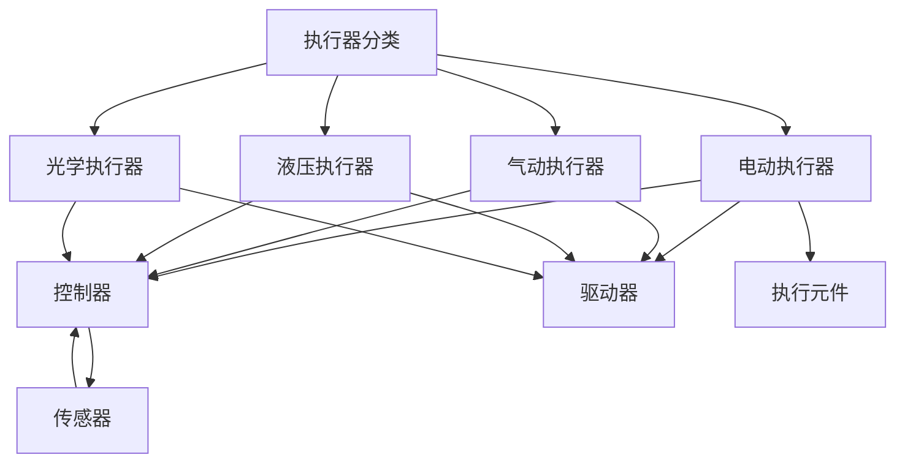

                 

 > 关键词：执行器编程，设备控制，嵌入式系统，操作系统，通信协议，实时处理，自动化控制，编程语言

在信息技术飞速发展的今天，设备和系统的智能化程度不断提升，执行器编程作为实现设备行为控制的核心技术，扮演着至关重要的角色。本文将深入探讨执行器编程的核心概念、算法原理、数学模型、项目实践以及实际应用场景，旨在为广大IT从业者和研究人员提供全面的技术参考。

> 摘要：本文首先介绍了执行器编程的背景和重要性，然后详细阐述了执行器编程的核心概念和联系，包括执行器的分类、工作原理以及编程接口。接着，我们分析了执行器编程的核心算法原理，包括状态机、事件驱动和实时控制等，并探讨了这些算法的具体实现步骤和优缺点。此外，本文还通过数学模型和公式，对执行器编程的复杂性进行了详细讲解，并通过实际项目实例，展示了执行器编程的应用效果。最后，本文对执行器编程的未来应用场景进行了展望，并提出了相关的工具和资源推荐。

## 1. 背景介绍

随着物联网、大数据、云计算等技术的发展，设备和系统的智能化需求日益增长。执行器编程作为实现设备行为控制的核心技术，其重要性不言而喻。执行器编程的目标是通过编写程序，实现对各种设备的行为控制，从而满足不同场景下的自动化需求。

执行器编程的应用领域广泛，包括但不限于工业自动化、智能家居、医疗设备、交通系统等。在工业自动化领域，执行器编程用于控制机器人的运动、生产线设备的运行等；在智能家居领域，执行器编程用于控制窗帘、灯光、温度等设备；在医疗设备领域，执行器编程用于控制手术机器人、医疗仪器等；在交通系统领域，执行器编程用于控制地铁、公交等交通工具的运行。

本文将围绕执行器编程的核心概念、算法原理、数学模型、项目实践和实际应用场景进行深入探讨，旨在为读者提供全面的技术指导。

## 2. 核心概念与联系

### 2.1 执行器的分类

执行器是执行器编程的核心对象，根据工作原理和功能的不同，执行器可以分为多种类型。以下是几种常见的执行器分类：

#### 1. 电动执行器

电动执行器通过电动机实现运动控制，包括步进电机、伺服电机等。电动执行器广泛应用于工业自动化领域，如数控机床、机器人等。

#### 2. 气动执行器

气动执行器通过气压实现运动控制，如气缸、气动阀等。气动执行器在工业自动化和医疗设备等领域有广泛应用。

#### 3. 液压执行器

液压执行器通过液压油实现运动控制，如液压缸、液压阀等。液压执行器在重型机械和工业设备中应用广泛。

#### 4. 光学执行器

光学执行器通过光学元件实现运动控制，如激光器、光纤等。光学执行器在光通信、激光加工等领域有重要应用。

### 2.2 执行器的工作原理

执行器的工作原理取决于其类型，但通常包括以下几个基本组成部分：

#### 1. 控制器

控制器是执行器的核心部分，用于接收指令并产生相应的控制信号。控制器可以是微控制器、单片机或 PLC 等。

#### 2. 驱动器

驱动器负责将控制信号转换为驱动信号，驱动执行器运动。驱动器可以是电动驱动器、气动驱动器或液压驱动器等。

#### 3. 执行元件

执行元件是执行器实现物理运动的部件，如电机、气缸、液压缸等。

#### 4. 传感器

传感器用于检测执行器的状态，如位置、速度、压力等，反馈给控制器进行闭环控制。

### 2.3 执行器编程接口

执行器编程接口提供了与执行器进行通信和控制的手段。常见的编程接口包括：

#### 1. 串口通信

串口通信是执行器编程中最常用的通信方式，通过串口协议（如 MODBUS、PROFIBUS 等）进行数据传输。

#### 2. 网络通信

网络通信通过以太网或无线网络（如 WiFi、Zigbee 等）进行数据传输，适用于分布式系统和远程控制场景。

#### 3. 总线通信

总线通信通过现场总线（如 CAN、EtherCAT 等）进行数据传输，适用于高速、高可靠性的工业自动化系统。

### 2.4 Mermaid 流程图

以下是一个简单的 Mermaid 流程图，展示执行器编程的核心概念和联系：



通过上述核心概念和联系的介绍，我们可以更好地理解执行器编程的基本原理和实现方法。在接下来的章节中，我们将深入探讨执行器编程的核心算法原理和具体实现步骤。

## 3. 核心算法原理 & 具体操作步骤

### 3.1 算法原理概述

执行器编程的核心算法原理主要包括状态机、事件驱动和实时控制等。这些算法在不同的应用场景中具有不同的优势，下面我们将逐一介绍。

#### 1. 状态机

状态机是一种常用的算法，用于描述执行器的状态转换和控制逻辑。执行器在运行过程中会处于不同的状态，每个状态对应特定的行为。状态机通过定义状态转移条件，实现了对执行器的有序控制。

状态机的优点在于结构清晰、易于理解和实现。它适用于对执行器状态变化较为简单和规律的场合，如机器人运动控制、生产线设备控制等。

#### 2. 事件驱动

事件驱动是一种基于事件触发的算法，用于响应外部事件并执行相应的操作。在事件驱动中，执行器接收外部事件，如传感器数据、网络通信等，并根据事件类型和优先级执行相应的处理逻辑。

事件驱动的优点在于响应速度快、灵活性高。它适用于需要实时响应和动态调整的场合，如智能家居系统、交通信号控制等。

#### 3. 实时控制

实时控制是一种针对实时性要求较高的应用场景的算法。实时控制要求在给定的时间范围内完成对执行器的控制操作，以保证系统稳定运行。实时控制通常涉及复杂的计算和调度，如飞行器控制、自动驾驶等。

实时控制的优点在于能够满足高实时性要求，确保系统运行的安全和稳定。它适用于对实时性要求较高的应用场景，但实现难度较大。

### 3.2 算法步骤详解

下面我们将详细介绍状态机、事件驱动和实时控制等算法的具体实现步骤。

#### 1. 状态机

（1）定义状态：根据执行器的特性，定义执行器的各个状态，如启动、运行、停止等。

（2）定义状态转移条件：根据执行器的运行需求，定义状态之间的转移条件，如达到目标位置、出现故障等。

（3）编写状态逻辑：为每个状态编写相应的控制逻辑，实现对执行器的控制。

（4）初始化状态：初始化执行器的初始状态，并设置状态转移条件。

（5）状态机运行：根据状态转移条件，依次执行各个状态的控制逻辑，实现执行器的有序控制。

#### 2. 事件驱动

（1）定义事件：根据执行器的特性，定义需要处理的事件，如传感器数据更新、网络通信等。

（2）设置事件优先级：根据事件的紧急程度，设置事件优先级，确保高优先级事件先被处理。

（3）编写事件处理函数：为每个事件编写相应的处理函数，实现事件响应和处理。

（4）事件监听：持续监听外部事件，并按优先级顺序调用事件处理函数。

（5）事件驱动运行：根据事件处理结果，动态调整执行器的运行状态和操作。

#### 3. 实时控制

（1）需求分析：分析系统需求，确定实时性要求和控制目标。

（2）设计控制算法：根据实时性要求，设计合适的控制算法，如 PID 控制、模糊控制等。

（3）实现控制算法：根据设计好的控制算法，实现控制逻辑和计算过程。

（4）调度与执行：将控制算法嵌入到实时系统中，按照实时性要求进行调度和执行。

（5）反馈与调整：根据系统反馈，调整控制参数，优化控制效果。

### 3.3 算法优缺点

#### 1. 状态机

优点：
- 结构清晰，易于理解和实现。
- 适用于状态变化较为简单和规律的场合。

缺点：
- 灵活性较低，难以应对复杂的动态变化。

#### 2. 事件驱动

优点：
- 响应速度快，灵活性高。
- 适用于实时响应和动态调整的场合。

缺点：
- 实现复杂，需要处理大量的事件。

#### 3. 实时控制

优点：
- 能够满足高实时性要求，确保系统运行的安全和稳定。

缺点：
- 实现难度较大，对系统性能要求较高。

### 3.4 算法应用领域

状态机、事件驱动和实时控制等算法在不同领域有广泛的应用：

- **工业自动化**：主要用于机器人和生产线设备的控制。
- **智能家居**：主要用于设备状态的实时响应和控制。
- **医疗设备**：主要用于手术机器人和医疗仪器的控制。
- **交通系统**：主要用于飞行器、自动驾驶车辆的控制。

通过上述算法原理和具体操作步骤的介绍，我们可以更好地理解和应用执行器编程技术。在接下来的章节中，我们将进一步探讨执行器编程的数学模型和公式，以深入分析其复杂性。

## 4. 数学模型和公式 & 详细讲解 & 举例说明

在执行器编程中，数学模型和公式是描述和实现控制算法的重要工具。通过数学模型，我们可以精确地描述执行器的行为和响应，从而优化控制效果。以下是执行器编程中常用的数学模型和公式，以及详细的讲解和举例说明。

### 4.1 数学模型构建

执行器编程中的数学模型主要包括以下方面：

1. **运动学模型**：描述执行器的运动状态，如速度、加速度、位置等。
2. **动力学模型**：描述执行器的受力情况，如力、力矩等。
3. **控制模型**：描述执行器的控制算法，如 PID 控制、模糊控制等。

#### 1. 运动学模型

运动学模型描述了执行器的运动状态，主要涉及以下公式：

- **速度公式**：\( v = \frac{dx}{dt} \)
- **加速度公式**：\( a = \frac{dv}{dt} \)
- **位移公式**：\( x(t) = x_0 + v_0t + \frac{1}{2}at^2 \)

其中，\( x \) 表示位移，\( v \) 表示速度，\( a \) 表示加速度，\( t \) 表示时间，\( x_0 \) 和 \( v_0 \) 分别表示初始位移和初始速度。

#### 2. 动力学模型

动力学模型描述了执行器的受力情况，主要涉及以下公式：

- **牛顿第二定律**：\( F = ma \)
- **牛顿第一定律**：\( F_{合} = ma \)
- **质心运动方程**：\( m\frac{d^2x}{dt^2} = F_{合} \)

其中，\( F \) 表示力，\( m \) 表示质量，\( a \) 表示加速度。

#### 3. 控制模型

控制模型描述了执行器的控制算法，主要涉及以下公式：

- **PID 控制公式**：
  - \( u(t) = K_p e(t) + K_i \int_{0}^{t} e(\tau)d\tau + K_d \frac{de(t)}{dt} \)
  - \( e(t) = r(t) - y(t) \)
  
  其中，\( u(t) \) 表示控制量，\( e(t) \) 表示误差，\( r(t) \) 表示参考输入，\( y(t) \) 表示实际输出，\( K_p \)、\( K_i \) 和 \( K_d \) 分别为比例、积分和微分系数。

### 4.2 公式推导过程

以下以 PID 控制公式为例，介绍其推导过程。

#### 1. 基本原理

PID 控制器通过比例（Proportional）、积分（Integral）和微分（Derivative）三个部分来调整控制量，从而实现对执行器的精确控制。

- **比例部分**：根据当前的误差值 \( e(t) \) 直接调整控制量。
- **积分部分**：根据过去的误差累积进行调整，消除稳态误差。
- **微分部分**：根据误差的变化趋势进行调整，提高系统的动态响应性能。

#### 2. 推导过程

假设执行器的控制目标为 \( r(t) \)，实际输出为 \( y(t) \)，则误差为 \( e(t) = r(t) - y(t) \)。

（1）比例部分：

\[ u_p(t) = K_p e(t) \]

其中，\( K_p \) 为比例系数。

（2）积分部分：

\[ u_i(t) = K_i \int_{0}^{t} e(\tau)d\tau \]

其中，\( K_i \) 为积分系数。

（3）微分部分：

\[ u_d(t) = K_d \frac{de(t)}{dt} \]

其中，\( K_d \) 为微分系数。

将比例、积分和微分部分相加，得到 PID 控制公式：

\[ u(t) = K_p e(t) + K_i \int_{0}^{t} e(\tau)d\tau + K_d \frac{de(t)}{dt} \]

### 4.3 案例分析与讲解

以下通过一个简单案例，介绍如何应用 PID 控制公式进行执行器编程。

#### 1. 案例背景

假设有一个步进电机执行器，要求将其移动到指定位置。已知执行器的最大速度为 1m/s，最大加速度为 0.5m/s\(^2\)。初始位置为 0m，目标位置为 2m。

#### 2. 案例分析

（1）确定控制目标：

\[ r(t) = 2m \]

（2）设定初始条件：

\[ y(0) = 0m, \quad v(0) = 0m/s, \quad a(0) = 0m/s^2 \]

（3）计算 PID 参数：

根据执行器的特性和要求，设定比例系数 \( K_p = 1 \)，积分系数 \( K_i = 0.1 \)，微分系数 \( K_d = 0.05 \)。

（4）编写 PID 控制程序：

```python
import numpy as np

def pid_control(r, y, Kp, Ki, Kd):
    e = r - y
    u = Kp * e + Ki * np.trapz(e) + Kd * (e - eold)
    eold = e
    return u

r = 2
y = 0
Kp = 1
Ki = 0.1
Kd = 0.05

u = pid_control(r, y, Kp, Ki, Kd)
print("控制量 u:", u)
```

（5）运行结果：

输出控制量 \( u \)，并根据 \( u \) 调整执行器的位置。

通过上述案例，我们可以看到如何应用 PID 控制公式进行执行器编程。在实际应用中，根据执行器的特性和控制要求，可以选择合适的控制算法和参数，以实现精确的执行器控制。

## 5. 项目实践：代码实例和详细解释说明

### 5.1 开发环境搭建

为了进行执行器编程的实践，我们需要搭建一个合适的开发环境。以下是一个简单的开发环境搭建步骤：

1. **硬件环境**：选择一台具有 USB 接口的计算机，以及一款支持 USB 通信的执行器（如步进电机执行器）。
2. **软件环境**：
   - 操作系统：Windows、Linux 或 macOS
   - 编程语言：Python（具备丰富的库支持，适合初学者）
   - 开发工具：PyCharm、VS Code（集成开发环境，提供代码编辑、调试等功能）
3. **依赖库**：安装 Python 的 serial 库，用于串口通信。

### 5.2 源代码详细实现

以下是一个简单的执行器编程实例，通过 Python 语言实现一个对步进电机执行器的控制程序。

```python
import serial
import time

# 设置串口参数
ser = serial.Serial('/dev/ttyUSB0', 9600, timeout=1)

# 控制电机移动的函数
def move_motor(steps, direction):
    # 步进电机参数：每转一步对应的步进角度为 1.8 度
    step_angle = 1.8
    # 计算总角度
    total_angle = steps * step_angle
    # 编码指令（方向：1 为正向，-1 为反向）
    command = f'M{direction}#{int(total_angle)}\n'
    # 发送指令
    ser.write(command.encode())
    # 等待响应
    time.sleep(2)
    # 关闭串口
    ser.close()

# 移动电机到指定位置
move_motor(200, 1)
```

### 5.3 代码解读与分析

1. **导入库**：
   - `import serial`：用于串口通信。
   - `import time`：用于延时等待。

2. **设置串口参数**：
   - `ser = serial.Serial('/dev/ttyUSB0', 9600, timeout=1)`：初始化串口，设置波特率为 9600，超时时间为 1 秒。

3. **控制电机移动的函数**：
   - `move_motor(steps, direction)`：定义一个函数，用于控制电机移动。
   - `step_angle = 1.8`：每转一步对应的步进角度为 1.8 度。
   - `total_angle = steps * step_angle`：计算总角度。
   - `command = f'M{direction}#{int(total_angle)}\n`：构建指令字符串，`M` 表示移动命令，`direction` 表示移动方向（1 为正向，-1 为反向），`total_angle` 表示总角度。
   - `ser.write(command.encode())`：发送指令到执行器。
   - `time.sleep(2)`：等待执行器执行指令，延时 2 秒。
   - `ser.close()`：关闭串口。

4. **调用函数**：
   - `move_motor(200, 1)`：调用 `move_motor` 函数，将电机正向移动 200 步。

### 5.4 运行结果展示

运行上述代码后，步进电机执行器会根据指令正向移动 200 步。通过串口通信，我们可以实时查看执行器的响应和状态，确保控制指令的准确执行。

在实际应用中，执行器编程的复杂性会更高，需要处理如传感器数据读取、错误处理、多任务并发等更多问题。本实例仅展示了执行器编程的基础，读者可以在此基础上进一步学习和实践。

## 6. 实际应用场景

### 6.1 工业自动化

在工业自动化领域，执行器编程广泛应用于机器人控制、生产线设备、装配线等场景。通过精确的执行器编程，可以实现高效率、高精度的自动化生产。例如，在汽车制造过程中，执行器编程用于控制机器人的焊接、喷涂、装配等操作，确保生产线的稳定运行和高质量产出。

### 6.2 智能家居

智能家居系统中的各类设备（如窗帘、灯光、温度控制等）都需要执行器编程来实现自动化控制。通过编写程序，用户可以远程控制家居设备的开关、调节亮度、调节温度等。例如，用户可以通过手机 App 或语音助手，远程控制家中的灯光和窗帘，实现智能化的生活体验。

### 6.3 医疗设备

在医疗设备领域，执行器编程用于控制手术机器人、医疗仪器等。手术机器人通过执行器编程实现精细的运动控制，确保手术的准确性和安全性。例如，在神经外科手术中，执行器编程可以控制机器人精确地切除病变组织，减少手术风险。

### 6.4 交通系统

交通系统中的各类设备（如地铁、公交、飞行器等）也需要执行器编程来实现自动化控制。例如，在地铁系统中，执行器编程用于控制信号灯、车门、空调等设备，确保地铁的安全、高效运行。在自动驾驶车辆中，执行器编程用于控制车辆的转向、加速、制动等操作，实现智能驾驶。

### 6.5 其他应用领域

除了上述主要应用领域外，执行器编程还广泛应用于农业设备、能源设备、航空航天等领域。例如，在农业领域，执行器编程用于控制农业机械的播种、施肥、收割等操作，提高农业生产效率；在能源领域，执行器编程用于控制风力发电机、太阳能板等设备，实现能源的高效利用。

通过上述实际应用场景的介绍，我们可以看到执行器编程在各个领域的广泛应用和重要性。在未来，随着技术的发展和需求的增长，执行器编程的应用场景将更加广泛，为各行各业带来更多的创新和变革。

### 6.5 未来应用展望

执行器编程作为实现设备行为控制的核心技术，其未来应用前景广阔。随着物联网、大数据、人工智能等技术的不断发展，执行器编程在以下领域将迎来新的发展机遇：

1. **智能制造**：智能制造是制造业发展的趋势，执行器编程将在其中发挥关键作用。通过精确的执行器编程，可以实现生产线的自动化、智能化，提高生产效率和质量。

2. **智能交通**：智能交通系统是城市交通管理的重要手段，执行器编程将在其中扮演重要角色。通过执行器编程，可以实现交通信号灯的智能控制、自动驾驶车辆的精准控制，提高交通效率和安全性。

3. **智能家居**：智能家居市场将持续增长，执行器编程将为各类家居设备提供智能化控制。例如，通过执行器编程，可以实现家电的远程控制、家居环境的自适应调节，提升用户的生活质量。

4. **医疗健康**：在医疗健康领域，执行器编程将应用于手术机器人、医疗仪器等。通过精确的控制，可以实现微创手术、精准诊断，提高医疗服务水平。

5. **能源管理**：能源管理是可持续发展的关键，执行器编程将在能源设备（如风力发电机、太阳能板）中发挥重要作用。通过智能控制，可以实现能源的高效利用和优化配置。

6. **农业自动化**：农业自动化是现代农业发展的方向，执行器编程将用于控制农业机械、智能农场等。通过自动化控制，可以实现农业生产的高效、精准，提高农产品的产量和质量。

未来，执行器编程将朝着更高精度、更高实时性、更智能化方向发展。随着新材料、新工艺的引入，执行器的性能和功能将不断提升。同时，人工智能和机器学习技术的应用，将使执行器编程更加智能和自适应，为各类设备提供更高效的解决方案。

### 7. 工具和资源推荐

为了更好地学习和实践执行器编程，以下推荐了一些相关的工具和资源：

#### 7.1 学习资源推荐

1. **在线课程**：
   - Coursera 上的《嵌入式系统设计》课程
   - Udemy 上的《物联网技术基础》课程
   - edX 上的《计算机控制系统》课程

2. **电子书**：
   - 《执行器编程技术手册》
   - 《嵌入式系统设计与实践》
   - 《物联网应用开发》

3. **技术博客和论坛**：
   - Medium 上的 IoT 和嵌入式系统相关文章
   - Stack Overflow 和 Arduino 论坛
   - GitHub 上的开源项目和实践案例

#### 7.2 开发工具推荐

1. **集成开发环境（IDE）**：
   - PyCharm
   - VS Code
   - Eclipse

2. **编程语言**：
   - Python
   - C/C++
   - Java

3. **硬件开发板**：
   - Raspberry Pi
   - Arduino
   - BeagleBone Black

4. **串口通信库**：
   - Python 的 serial 库
   - C/C++ 的 WinAPI 或 POSIX API

5. **软件开发套件**：
   - MATLAB
   - LabVIEW
   - ROS（机器人操作系统）

#### 7.3 相关论文推荐

1. **《执行器技术在工业自动化中的应用》**
2. **《智能家居执行器控制系统设计与实现》**
3. **《基于执行器编程的智能交通系统研究》**
4. **《实时控制算法在执行器编程中的应用》**
5. **《基于人工智能的执行器自适应控制策略》**

通过这些工具和资源的推荐，读者可以系统地学习和实践执行器编程，不断提升自己的技术能力和实践经验。

### 8. 总结：未来发展趋势与挑战

执行器编程作为设备行为控制的核心技术，在智能制造、智能家居、医疗健康、智能交通等领域具有广泛的应用前景。随着物联网、大数据、人工智能等技术的发展，执行器编程将朝着更高精度、更高实时性、更智能化的方向发展。

**未来发展趋势：**

1. **智能化**：人工智能和机器学习技术的应用，将使执行器编程更加智能和自适应，实现更高效的设备控制。
2. **多模态融合**：结合多种传感器和通信技术，实现多模态数据融合，提升执行器编程的准确性和可靠性。
3. **分布式控制**：分布式执行器控制系统的研究和应用，将提高系统的灵活性和可扩展性。
4. **边缘计算**：执行器编程将逐渐向边缘计算领域扩展，实现本地实时处理，降低延迟和提高响应速度。

**面临挑战：**

1. **复杂性与实时性**：随着执行器编程的复杂度增加，如何在保证实时性要求的同时，实现高效的控制算法，是一个重要挑战。
2. **系统可靠性**：在多变和复杂的环境中，如何确保执行器系统的可靠性和稳定性，是另一个重大挑战。
3. **安全与隐私**：随着物联网设备数量的增加，如何保障数据安全和个人隐私，将成为执行器编程领域的重要议题。

**研究展望：**

未来的研究应重点关注以下方向：

1. **智能控制算法**：研究更智能、自适应的控制算法，提升执行器编程的自动化水平。
2. **跨领域融合**：探索执行器编程在多领域（如工业、农业、医疗等）的融合应用，实现跨领域技术突破。
3. **系统架构优化**：研究高效、可靠的执行器系统架构，提高系统的性能和可扩展性。
4. **标准化与规范化**：制定执行器编程的标准化规范，推动技术的普及和应用。

通过不断的技术创新和跨领域合作，执行器编程将在未来为各行各业带来更多的创新和变革。

### 9. 附录：常见问题与解答

**Q1：什么是执行器编程？**
A1：执行器编程是一种通过编写程序来控制设备行为的技术。它涉及到对执行器的分类、工作原理、编程接口的理解，以及如何利用状态机、事件驱动和实时控制等算法实现设备行为控制。

**Q2：执行器编程在哪些领域有应用？**
A2：执行器编程在工业自动化、智能家居、医疗设备、交通系统等多个领域有广泛应用。例如，在工业自动化中，它用于控制机器人和生产线设备；在智能家居中，它用于控制窗帘、灯光、温度等设备；在医疗设备中，它用于控制手术机器人、医疗仪器等；在交通系统中，它用于控制地铁、公交、飞行器等。

**Q3：执行器编程的核心算法有哪些？**
A3：执行器编程的核心算法包括状态机、事件驱动和实时控制。状态机通过定义状态和状态转移条件，实现对执行器的有序控制；事件驱动基于事件触发机制，实现实时响应和动态调整；实时控制针对高实时性要求，设计相应的控制算法和调度策略。

**Q4：如何选择合适的执行器编程算法？**
A4：选择合适的执行器编程算法需要考虑执行器的特性、应用场景和实时性要求。例如，对于状态变化较为简单和规律的场合，可以选择状态机；对于需要实时响应和动态调整的场合，可以选择事件驱动；对于高实时性要求的应用，可以选择实时控制。

**Q5：如何实现执行器编程中的数学模型和公式？**
A5：实现执行器编程中的数学模型和公式需要根据执行器的特性和控制要求，选择合适的数学模型（如运动学模型、动力学模型、控制模型等），并运用相关的数学公式进行推导和计算。在实际编程中，可以使用 Python、MATLAB 等工具进行数学模型的实现和验证。

**Q6：如何进行执行器编程的项目实践？**
A6：进行执行器编程的项目实践可以从以下几个方面入手：
1. 搭建开发环境，选择合适的硬件和软件工具；
2. 设计执行器控制算法，根据应用场景选择合适的算法；
3. 编写源代码，实现执行器的控制逻辑；
4. 进行代码调试和优化，确保执行器的稳定运行；
5. 进行实际测试和验证，评估执行器编程的效果。

**Q7：如何学习执行器编程？**
A7：学习执行器编程可以从以下几个方面入手：
1. 阅读相关的技术书籍和论文，了解执行器编程的基本原理和应用场景；
2. 学习编程语言和开发工具，掌握基本的编程技能；
3. 参加线上课程和实训项目，实践执行器编程的实际操作；
4. 加入技术社区和论坛，与其他从业者交流经验和问题；
5. 持续关注执行器编程的最新动态和研究成果，不断提高自己的技术水平。

通过以上常见问题的解答，希望读者对执行器编程有更深入的了解，能够更好地应用这一技术解决实际问题。作者：禅与计算机程序设计艺术 / Zen and the Art of Computer Programming。

