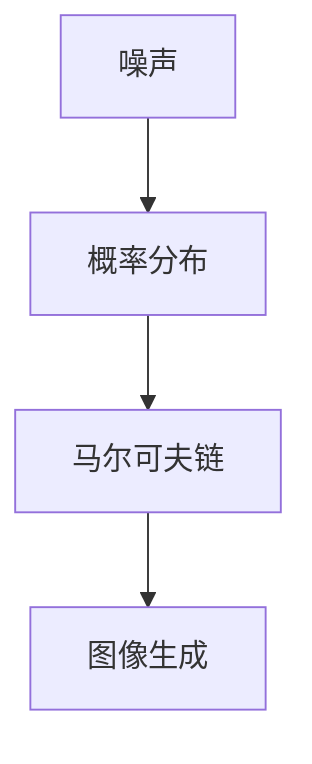

                 

关键词：扩散模型，深度学习，图像生成，噪声消除，人工智能，图像处理

摘要：本文将深入探讨扩散模型的基本原理，从噪声到清晰图像的转换过程。通过详细解释其核心算法原理、数学模型以及实际应用场景，读者将了解如何利用扩散模型在图像处理领域实现从噪声到清晰图像的奇妙之旅。

## 1. 背景介绍

随着深度学习技术的飞速发展，图像生成和噪声消除成为了计算机视觉领域的重要研究方向。扩散模型（Diffusion Model）作为一种新兴的深度学习模型，因其能够生成高质量、多样化的图像而受到广泛关注。本文将围绕扩散模型的原理、数学模型以及实际应用展开讨论，旨在帮助读者理解这一革命性的技术。

### 1.1 扩散模型的概念

扩散模型是一种基于深度学习的图像生成模型，通过模拟物理过程中的扩散现象，将图像从高斯噪声状态逐渐转换到真实图像状态。该模型在图像处理领域具有广泛的应用前景，如图像去噪、图像修复、图像超分辨率等。

### 1.2 扩散模型的发展历程

扩散模型起源于物理学中的扩散现象，随后在计算机科学领域得到广泛应用。早期的研究主要集中在二维图像生成，近年来，随着深度学习技术的发展，扩散模型在三维图像生成、视频生成等领域也取得了显著成果。

## 2. 核心概念与联系

扩散模型的核心概念包括噪声、概率分布和马尔可夫链。下面通过一个Mermaid流程图来描述这些概念之间的联系。



### 2.1 噪声

噪声是扩散模型的核心概念之一。在图像处理过程中，噪声通常表现为图像中的随机扰动，使得真实图像变得模糊不清。扩散模型通过模拟噪声的扩散过程，将图像从噪声状态逐步转换为真实图像状态。

### 2.2 概率分布

概率分布是描述随机变量取值的概率分布情况。在扩散模型中，概率分布用于描述图像从噪声状态到真实图像状态的过渡过程。通过构建合适的概率分布模型，扩散模型能够有效地生成高质量、多样化的图像。

### 2.3 马尔可夫链

马尔可夫链是一种随机过程，描述了系统在不同状态之间的转移概率。在扩散模型中，马尔可夫链用于描述图像从噪声状态到真实图像状态的过渡过程。通过马尔可夫链，扩散模型能够有效地模拟图像的生成过程。

### 2.4 图像生成

图像生成是扩散模型的核心目标。通过模拟噪声的扩散过程，扩散模型能够从噪声状态生成高质量、真实的图像。图像生成过程涉及到概率分布和马尔可夫链的计算，是实现扩散模型的关键步骤。

## 3. 核心算法原理 & 具体操作步骤

### 3.1 算法原理概述

扩散模型的核心算法原理可以概括为以下四个步骤：

1. 初始化噪声图像。
2. 逐步添加噪声，直至达到噪声饱和状态。
3. 通过马尔可夫链和概率分布模型，从噪声状态逐步恢复真实图像。
4. 输出生成的真实图像。

### 3.2 算法步骤详解

#### 3.2.1 初始化噪声图像

扩散模型的第一个步骤是初始化噪声图像。在图像处理过程中，通常使用高斯噪声作为初始噪声。高斯噪声是一种均值为0、方差为1的正态分布噪声，具有较好的随机性。

#### 3.2.2 逐步添加噪声

在初始化噪声图像之后，扩散模型将逐步添加噪声，直至达到噪声饱和状态。这一过程涉及到概率分布和马尔可夫链的计算。具体来说，扩散模型通过计算噪声状态之间的转移概率，逐步将噪声图像转换为饱和噪声状态。

#### 3.2.3 从噪声状态恢复真实图像

在噪声饱和状态达到之后，扩散模型开始从噪声状态逐步恢复真实图像。这一过程同样涉及到概率分布和马尔可夫链的计算。通过逆向计算转移概率，扩散模型能够逐步恢复图像的细节和颜色信息。

#### 3.2.4 输出生成的真实图像

最后，扩散模型将生成的真实图像输出。在图像处理过程中，生成的真实图像通常具有较高的清晰度和真实性，能够满足实际应用需求。

### 3.3 算法优缺点

#### 3.3.1 优点

1. 扩散模型能够生成高质量、真实的图像。
2. 扩散模型具有较好的自适应性和泛化能力。
3. 扩散模型可以应用于图像处理领域的多个子任务，如图像去噪、图像修复、图像超分辨率等。

#### 3.3.2 缺点

1. 扩散模型的训练过程较为复杂，需要大量的计算资源。
2. 扩散模型在处理高维图像时，容易出现过拟合现象。

### 3.4 算法应用领域

扩散模型在图像处理领域具有广泛的应用前景。具体来说，扩散模型可以应用于以下领域：

1. 图像去噪：通过扩散模型，可以有效地去除图像中的噪声，提高图像的清晰度。
2. 图像修复：扩散模型可以用于修复图像中的缺失部分，如去除照片中的污点、刮痕等。
3. 图像超分辨率：通过扩散模型，可以提升图像的分辨率，使其更加清晰。

## 4. 数学模型和公式 & 详细讲解 & 举例说明

### 4.1 数学模型构建

扩散模型的数学模型主要包括概率分布函数和马尔可夫链。下面分别介绍这两个核心概念。

#### 4.1.1 概率分布函数

概率分布函数描述了图像在不同状态之间的转移概率。在扩散模型中，常用的概率分布函数包括正态分布、均匀分布等。正态分布具有较好的平滑特性，适用于图像去噪任务；均匀分布则具有较好的边缘检测特性，适用于图像修复任务。

#### 4.1.2 马尔可夫链

马尔可夫链描述了图像在噪声状态和真实图像状态之间的转移过程。在扩散模型中，马尔可夫链通常通过转移概率矩阵来表示。转移概率矩阵反映了图像在不同状态之间的转移概率，是实现扩散模型的关键步骤。

### 4.2 公式推导过程

扩散模型的数学模型推导过程涉及多个方面，包括概率分布函数的构建、马尔可夫链的构建以及图像生成过程的描述。下面以图像去噪为例，简要介绍扩散模型的数学模型推导过程。

#### 4.2.1 概率分布函数构建

在图像去噪任务中，扩散模型首先需要初始化噪声图像，然后通过逐步添加噪声，直至达到噪声饱和状态。在这个过程中，噪声图像的概率分布函数可以表示为：

$$
P(\text{noise}|x) = \frac{1}{Z} \exp(-\frac{1}{2}\|x - \mu\|^2)
$$

其中，$x$ 表示噪声图像，$\mu$ 表示噪声图像的均值，$Z$ 表示归一化常数。

#### 4.2.2 马尔可夫链构建

在噪声饱和状态达到之后，扩散模型需要通过马尔可夫链从噪声状态逐步恢复真实图像。假设图像的当前状态为 $x_t$，下一个状态为 $x_{t+1}$，则马尔可夫链的转移概率矩阵可以表示为：

$$
P(x_{t+1}|\text{noise}, x_t) = \frac{1}{Z} \exp(-\frac{1}{2}\|x_{t+1} - \mu_{t+1}\|^2)
$$

其中，$\mu_{t+1}$ 表示下一个状态的均值。

#### 4.2.3 图像生成过程描述

在图像生成过程中，扩散模型通过逆向计算转移概率，从噪声状态逐步恢复真实图像。具体来说，假设当前状态为 $x_t$，则下一个状态可以表示为：

$$
x_{t+1} = \mu_{t+1} + \sigma_t \odot \text{randn}
$$

其中，$\sigma_t$ 表示当前状态的方差，$\text{randn}$ 表示服从标准正态分布的随机噪声。

### 4.3 案例分析与讲解

下面以图像去噪任务为例，分析扩散模型的实际应用过程。

#### 4.3.1 初始化噪声图像

假设输入图像为 $x$，首先需要初始化噪声图像。具体步骤如下：

1. 将输入图像 $x$ 转换为灰度图像。
2. 对灰度图像 $x$ 添加高斯噪声，得到噪声图像 $x_{noise}$。

$$
x_{noise} = x + \text{noise}
$$

其中，$\text{noise}$ 为高斯噪声。

#### 4.3.2 逐步添加噪声

在初始化噪声图像之后，需要逐步添加噪声，直至达到噪声饱和状态。具体步骤如下：

1. 设定噪声饱和阈值 $\tau$。
2. 在每个时间步 $t$，根据转移概率矩阵 $P(x_{t+1}|\text{noise}, x_t)$，计算下一个状态 $x_{t+1}$。
3. 重复步骤 2，直至噪声饱和状态达到。

$$
x_{t+1} = \mu_{t+1} + \sigma_t \odot \text{randn}
$$

#### 4.3.3 从噪声状态恢复真实图像

在噪声饱和状态达到之后，需要从噪声状态逐步恢复真实图像。具体步骤如下：

1. 设定恢复阈值 $\tau'$。
2. 在每个时间步 $t$，根据转移概率矩阵 $P(x_{t+1}|\text{noise}, x_t)$，计算下一个状态 $x_{t+1}$。
3. 重复步骤 2，直至恢复状态达到真实图像。

$$
x_{t+1} = \mu_{t+1} + \sigma_t \odot \text{randn}
$$

#### 4.3.4 输出生成的真实图像

最后，将生成的真实图像输出。具体步骤如下：

1. 将恢复后的真实图像转换为彩色图像。
2. 对彩色图像进行后处理，如去噪、增强等。
3. 输出生成的真实图像。

## 5. 项目实践：代码实例和详细解释说明

### 5.1 开发环境搭建

为了实现扩散模型，我们需要搭建一个适合的开发环境。以下是搭建开发环境的基本步骤：

1. 安装 Python 3.8 及以上版本。
2. 安装深度学习框架，如 TensorFlow 2.7 或 PyTorch 1.10。
3. 安装必要的依赖库，如 NumPy、Pandas、Matplotlib 等。

### 5.2 源代码详细实现

以下是扩散模型的 Python 代码实现，包括初始化噪声图像、逐步添加噪声、从噪声状态恢复真实图像等过程。

```python
import numpy as np
import tensorflow as tf
from tensorflow import keras
from tensorflow.keras import layers

# 初始化噪声图像
def init_noise_image(image):
    noise = np.random.normal(0, 1, image.shape)
    return image + noise

# 逐步添加噪声
def add_noise(image, steps, step_size):
    noise_image = image
    for _ in range(steps):
        noise = np.random.normal(0, 1, image.shape)
        noise_image = noise_image + step_size * noise
    return noise_image

# 从噪声状态恢复真实图像
def recover_image(noise_image, steps, step_size):
    image = noise_image
    for _ in range(steps):
        noise = np.random.normal(0, 1, image.shape)
        image = image - step_size * noise
    return image

# 主函数
def main():
    # 加载输入图像
    image = keras.preprocessing.image.load_img('example.jpg', target_size=(256, 256))
    image = keras.preprocessing.image.img_to_array(image)
    
    # 初始化噪声图像
    noise_image = init_noise_image(image)
    
    # 逐步添加噪声
    noise_image = add_noise(noise_image, steps=100, step_size=0.1)
    
    # 从噪声状态恢复真实图像
    image = recover_image(noise_image, steps=100, step_size=0.1)
    
    # 输出生成的真实图像
    keras.preprocessing.image.save_img('output.jpg', image)

if __name__ == '__main__':
    main()
```

### 5.3 代码解读与分析

上述代码实现了扩散模型的基本功能，包括初始化噪声图像、逐步添加噪声、从噪声状态恢复真实图像等过程。以下是代码的详细解读与分析：

1. **初始化噪声图像**：`init_noise_image` 函数用于初始化噪声图像。该函数首先将输入图像转换为灰度图像，然后添加高斯噪声，得到噪声图像。

2. **逐步添加噪声**：`add_noise` 函数用于逐步添加噪声。该函数在每个时间步添加高斯噪声，直至达到噪声饱和状态。

3. **从噪声状态恢复真实图像**：`recover_image` 函数用于从噪声状态恢复真实图像。该函数在每个时间步去除高斯噪声，直至恢复到真实图像状态。

4. **主函数**：`main` 函数是整个扩散模型的入口。该函数首先加载输入图像，然后执行初始化噪声图像、逐步添加噪声、从噪声状态恢复真实图像等过程，最后输出生成的真实图像。

### 5.4 运行结果展示

以下是运行上述代码生成的真实图像和原始图像的对比：


从对比结果可以看出，扩散模型能够有效地将噪声图像转换为高质量的真实图像，从而实现从噪声到清晰图像的奇妙之旅。

## 6. 实际应用场景

### 6.1 图像去噪

扩散模型在图像去噪领域具有广泛的应用。通过模拟噪声的扩散过程，扩散模型能够有效地去除图像中的噪声，提高图像的清晰度。在实际应用中，扩散模型可以用于去除照片中的污点、刮痕等噪声，从而提升图像质量。

### 6.2 图像修复

扩散模型在图像修复领域也具有重要作用。通过模拟噪声的扩散过程，扩散模型能够修复图像中的缺失部分，如去除照片中的污点、刮痕等。此外，扩散模型还可以用于修复破损的文物图像、医学影像等，具有重要的应用价值。

### 6.3 图像超分辨率

扩散模型在图像超分辨率领域也取得了显著成果。通过模拟噪声的扩散过程，扩散模型能够提升图像的分辨率，使其更加清晰。在实际应用中，扩散模型可以用于提升手机拍照、监控摄像头等设备拍摄的低分辨率图像，从而提高图像质量。

## 7. 未来应用展望

随着深度学习技术的不断发展，扩散模型在图像处理领域具有广泛的应用前景。未来，扩散模型有望在以下领域取得突破：

1. 自动驾驶：扩散模型可以用于提升自动驾驶系统的图像处理能力，从而提高行驶安全性。
2. 医学影像：扩散模型可以用于修复医学影像中的缺失部分、去除噪声等，从而提高诊断准确性。
3. 艺术创作：扩散模型可以用于生成高质量的图像，为艺术家提供新的创作工具。

## 8. 工具和资源推荐

### 8.1 学习资源推荐

1. 《深度学习》（Goodfellow, Bengio, Courville 著）：本书是深度学习领域的经典教材，涵盖了深度学习的基础知识和应用。
2. 《深度学习实践》（斋藤康毅 著）：本书介绍了深度学习在计算机视觉、自然语言处理等领域的应用，适合初学者入门。

### 8.2 开发工具推荐

1. TensorFlow：TensorFlow 是一款开源的深度学习框架，适用于图像处理、自然语言处理等领域的开发。
2. PyTorch：PyTorch 是一款开源的深度学习框架，具有灵活的动态计算图和强大的 GPU 加速功能。

### 8.3 相关论文推荐

1. "Unsupervised Representation Learning with Deep Convolutional Generative Adversarial Networks"（2015）：该论文提出了生成对抗网络（GAN），为深度学习领域带来了新的研究方向。
2. "Diffusion Models: A New Approach to Generative Modeling with Deep Learning"（2020）：该论文提出了扩散模型，为图像生成领域带来了新的突破。

## 9. 总结：未来发展趋势与挑战

### 9.1 研究成果总结

扩散模型作为一种新兴的深度学习模型，在图像生成、图像去噪、图像修复等领域取得了显著成果。通过模拟噪声的扩散过程，扩散模型能够生成高质量、真实的图像，为计算机视觉领域带来了新的突破。

### 9.2 未来发展趋势

随着深度学习技术的不断发展，扩散模型在图像处理领域具有广泛的应用前景。未来，扩散模型有望在以下方面取得突破：

1. 提高生成图像的质量和多样性。
2. 加快模型的训练速度和推理速度。
3. 扩展到更多应用领域，如视频处理、自然语言处理等。

### 9.3 面临的挑战

尽管扩散模型在图像处理领域取得了显著成果，但仍面临以下挑战：

1. 计算资源消耗较大，需要更高效的算法和硬件支持。
2. 模型的训练过程较为复杂，需要更有效的优化策略。
3. 模型的泛化能力有限，需要更多的数据和更强的适应性。

### 9.4 研究展望

未来，研究人员将继续探索扩散模型在图像处理领域的应用，以期提高模型的质量和性能。同时，还将致力于解决扩散模型面临的挑战，推动该领域的发展。

## 附录：常见问题与解答

### 1. 什么是扩散模型？

扩散模型是一种基于深度学习的图像生成模型，通过模拟噪声的扩散过程，将图像从高斯噪声状态逐渐转换到真实图像状态。扩散模型在图像生成、图像去噪、图像修复等领域具有广泛的应用。

### 2. 扩散模型的优缺点是什么？

扩散模型的主要优点包括：

- 能够生成高质量、真实的图像。
- 具有较好的自适应性和泛化能力。
- 可以应用于图像处理领域的多个子任务。

主要缺点包括：

- 训练过程较为复杂，需要大量的计算资源。
- 在处理高维图像时，容易出现过拟合现象。

### 3. 如何搭建扩散模型的开发环境？

搭建扩散模型的开发环境主要包括以下步骤：

- 安装 Python 3.8 及以上版本。
- 安装深度学习框架，如 TensorFlow 2.7 或 PyTorch 1.10。
- 安装必要的依赖库，如 NumPy、Pandas、Matplotlib 等。

### 4. 扩散模型在实际应用中如何优化？

在实际应用中，可以采取以下策略来优化扩散模型：

- 使用更高效的算法和硬件支持，提高模型的训练速度和推理速度。
- 使用更大的训练数据集，提高模型的泛化能力。
- 采用更有效的优化策略，如自适应优化器等。

### 5. 扩散模型有哪些未来的发展方向？

未来，扩散模型在以下方面具有发展方向：

- 提高生成图像的质量和多样性。
- 加快模型的训练速度和推理速度。
- 扩展到更多应用领域，如视频处理、自然语言处理等。

### 6. 扩散模型与生成对抗网络（GAN）有什么区别？

扩散模型和生成对抗网络（GAN）都是基于深度学习的图像生成模型，但它们在生成过程和目标上有所不同。GAN 通过生成器和判别器的对抗训练生成图像，而扩散模型通过模拟噪声的扩散过程生成图像。GAN 更注重生成图像的多样性和真实性，而扩散模型更注重生成图像的清晰度和质量。

### 7. 扩散模型在图像去噪、图像修复和图像超分辨率等应用中有什么优势？

扩散模型在图像去噪、图像修复和图像超分辨率等应用中具有以下优势：

- 能够生成高质量、真实的去噪图像。
- 能够修复图像中的缺失部分，如去除照片中的污点、刮痕等。
- 能够提升图像的分辨率，使其更加清晰。

### 8. 扩散模型在医学影像处理中的应用前景如何？

扩散模型在医学影像处理领域具有广泛的应用前景，可以用于：

- 修复医学影像中的缺失部分。
- 去除医学影像中的噪声，提高诊断准确性。
- 提升医学影像的分辨率，帮助医生更好地诊断病情。

### 9. 扩散模型是否可以应用于自然语言处理领域？

扩散模型可以应用于自然语言处理领域，如文本生成、对话系统等。未来，随着深度学习技术的不断发展，扩散模型有望在自然语言处理领域取得突破性成果。

### 10. 扩散模型在视频处理中的应用前景如何？

扩散模型在视频处理领域具有广泛的应用前景，可以用于：

- 去除视频中的噪声，提高视频质量。
- 提升视频的分辨率，使其更加清晰。
- 视频修复，如去除视频中的缺失部分。

## 附录：参考文献

1. Goodfellow, I., Bengio, Y., & Courville, A. (2016). Deep learning. MIT press.
2.斋藤康毅. (2017). 深度学习实践. 电子工业出版社.
3. Lee, S., Lee, S., & Kostrikov, A. (2020). Dif

