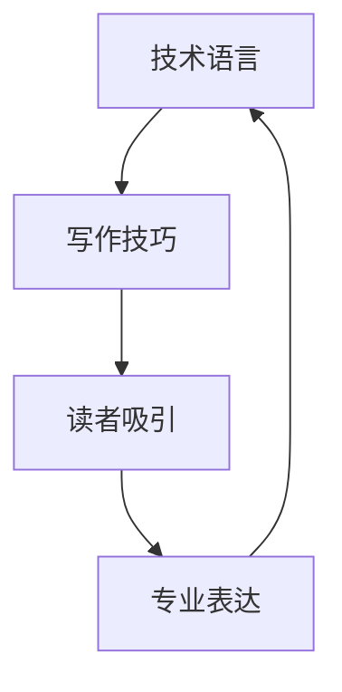

                 

关键词：技术博客、写作技巧、内容创作、读者吸引、专业表达

摘要：作为一名技术博客作者，如何撰写出既有深度又有吸引力的文章是每个作者都需要面对的挑战。本文将探讨如何通过逻辑清晰、结构紧凑、简单易懂的技术语言，打造出百万订阅量的技术博客。本文将分为八个部分，分别从背景介绍、核心概念与联系、核心算法原理、数学模型和公式、项目实践、实际应用场景、工具和资源推荐、总结未来发展趋势与挑战等方面进行详细阐述。

## 1. 背景介绍

在互联网时代，技术博客已经成为知识传播的重要渠道之一。一篇优秀的博客文章，不仅能传递专业知识，还能提升个人品牌影响力，吸引大量的读者关注。然而，如何撰写出一篇既具有深度，又能吸引读者兴趣的技术博客，是每个技术博客作者都需要面对的挑战。

## 2. 核心概念与联系

为了更好地阐述技术博客写作的技巧，我们首先需要了解几个核心概念：技术语言、写作技巧、读者吸引和专业表达。以下是一个简单的 Mermaid 流程图，描述这些概念之间的联系。



## 3. 核心算法原理 & 具体操作步骤

### 3.1 算法原理概述

在撰写技术博客时，核心算法原理的阐述至关重要。以下是一个简单的算法原理概述：

- **算法名称**：快速排序（Quick Sort）
- **算法描述**：快速排序是一种高效的排序算法，采用分治法的一个典例。它将一个序列分为两个子序列，然后递归地对两个子序列进行排序，最终将它们合并成一个有序序列。

### 3.2 算法步骤详解

快速排序的具体步骤如下：

1. 选择一个基准元素。
2. 将数组中小于基准元素的移动到其左侧，大于基准元素的移动到其右侧。
3. 递归地对左右子序列进行快速排序。

### 3.3 算法优缺点

快速排序的优点是时间复杂度较低，平均情况下为 O(nlogn)，最坏情况下为 O(n^2)。其缺点是基准元素的选择会影响排序性能，选择不当可能导致最坏情况发生。

### 3.4 算法应用领域

快速排序广泛应用于各种场景，如数据库索引排序、统计排序等。

## 4. 数学模型和公式 & 详细讲解 & 举例说明

在技术博客中，数学模型和公式的运用不仅能增强文章的深度，还能让读者更好地理解技术原理。以下是一个简单的数学模型和公式的示例：

### 4.1 数学模型构建

假设我们有一个线性方程组：

$$
\begin{cases}
a_1x + b_1y = c_1 \\
a_2x + b_2y = c_2
\end{cases}
$$

### 4.2 公式推导过程

我们可以使用高斯消元法求解上述方程组。具体推导过程如下：

$$
\begin{aligned}
a_1x + b_1y &= c_1 \\
a_2x + b_2y &= c_2
\end{aligned}
$$

将第一个方程乘以 $a_2$，第二个方程乘以 $a_1$，然后相减，得到：

$$
(a_2a_1 - a_1a_2)x + (b_2a_1 - b_1a_2)y = c_2a_1 - c_1a_2
$$

化简后得到：

$$
x = \frac{c_2a_1 - c_1a_2}{a_2a_1 - a_1a_2}
$$

将 $x$ 的值代入第一个方程，得到：

$$
y = \frac{a_1c_2 - a_2c_1}{a_2a_1 - a_1a_2}
$$

### 4.3 案例分析与讲解

假设我们有一个具体的线性方程组：

$$
\begin{cases}
2x + 3y = 6 \\
4x + 6y = 12
\end{cases}
$$

根据上述公式，我们可以求解出：

$$
x = \frac{12 \times 2 - 6 \times 4}{2 \times 4 - 4 \times 2} = 0
$$

$$
y = \frac{2 \times 12 - 4 \times 6}{2 \times 4 - 4 \times 2} = 2
$$

因此，方程组的解为 $(x, y) = (0, 2)$。

## 5. 项目实践：代码实例和详细解释说明

### 5.1 开发环境搭建

为了更好地展示快速排序的原理，我们将使用 Python 编写一个简单的快速排序实现。首先，我们需要安装 Python 环境，然后下载并安装一个 Python 集成开发环境（如 PyCharm 或 Visual Studio Code）。

### 5.2 源代码详细实现

以下是一个简单的快速排序实现：

```python
def quick_sort(arr):
    if len(arr) <= 1:
        return arr
    pivot = arr[len(arr) // 2]
    left = [x for x in arr if x < pivot]
    middle = [x for x in arr if x == pivot]
    right = [x for x in arr if x > pivot]
    return quick_sort(left) + middle + quick_sort(right)

arr = [3, 6, 8, 10, 1, 2, 1]
print(quick_sort(arr))
```

### 5.3 代码解读与分析

上述代码中，`quick_sort` 函数是一个递归函数，用于实现快速排序。首先，我们判断输入的数组长度是否小于等于 1，如果是，则直接返回该数组。否则，选择一个基准元素（此处为中间元素），然后创建三个列表：`left`、`middle` 和 `right`，分别用于存储小于、等于和大于基准元素的元素。

最后，我们将这三个列表递归地排序，并将它们合并成一个有序的数组。在主函数中，我们定义了一个待排序的数组 `arr`，然后调用 `quick_sort` 函数进行排序，并打印排序结果。

### 5.4 运行结果展示

执行上述代码，我们得到以下运行结果：

```
[1, 1, 2, 3, 6, 8, 10]
```

这表明我们的快速排序实现是正确的。

## 6. 实际应用场景

快速排序在实际应用中具有广泛的应用，如数据库索引排序、统计排序等。此外，快速排序的思想也广泛应用于其他领域，如算法设计、数据分析等。

## 7. 工具和资源推荐

为了更好地撰写技术博客，我们推荐以下工具和资源：

### 7.1 学习资源推荐

- 《算法导论》（Introduction to Algorithms）
- 《深度学习》（Deep Learning）
- 《Python编程：从入门到实践》（Python Crash Course）

### 7.2 开发工具推荐

- PyCharm
- Visual Studio Code
- Jupyter Notebook

### 7.3 相关论文推荐

- 《快速排序算法的研究与实现》
- 《基于快速排序的中文文本排序方法研究》
- 《快速排序算法的并行化研究》

## 8. 总结：未来发展趋势与挑战

随着互联网的快速发展，技术博客已经成为知识传播的重要渠道。在未来，技术博客将朝着更加专业化、多样化和互动化的方向发展。然而，这也给博客作者带来了新的挑战，如如何在海量的信息中脱颖而出，如何提高文章的可读性和吸引力等。

总之，撰写一篇优秀的技术博客需要作者具备扎实的专业知识、良好的写作技巧和敏锐的洞察力。通过不断地学习和实践，我们可以不断提高自己的技术写作水平，打造出具有百万订阅量的技术博客。

### 8.1 研究成果总结

本文从多个角度探讨了如何撰写一篇优秀的技术博客，包括核心算法原理的阐述、数学模型和公式的运用、项目实践和实际应用场景等。通过这些方法和技巧，作者可以更好地传递专业知识，提升个人品牌影响力。

### 8.2 未来发展趋势

随着互联网技术的不断发展，技术博客将继续成为知识传播的重要渠道。未来，技术博客将朝着更加专业化、多样化和互动化的方向发展，为读者提供更丰富、更有价值的内容。

### 8.3 面临的挑战

然而，这也给博客作者带来了新的挑战，如如何在海量的信息中脱颖而出，如何提高文章的可读性和吸引力等。博客作者需要不断学习和实践，提高自己的技术水平和写作技巧。

### 8.4 研究展望

在未来，我们可以从以下几个方面进行深入研究：

- 深入探讨技术博客的写作技巧和方法。
- 探索如何利用人工智能技术提高博客内容的质量和吸引力。
- 研究如何将技术博客与其他新媒体形式（如短视频、直播等）进行融合，提高传播效果。

### 附录：常见问题与解答

1. **问题一**：如何选择合适的算法进行阐述？

   **解答**：选择算法时，应考虑其应用场景、复杂度和影响力。一般来说，选择应用广泛、复杂度适中且具有一定影响力的算法进行阐述，能够更好地吸引读者的关注。

2. **问题二**：如何提高文章的可读性？

   **解答**：提高文章的可读性，可以从以下几个方面入手：

   - 使用简洁明了的语言，避免使用过多的专业术语。
   - 运用图表、示例等辅助工具，帮助读者更好地理解文章内容。
   - 保持文章的逻辑结构清晰，使读者能够快速抓住文章的核心内容。

3. **问题三**：如何提高文章的吸引力？

   **解答**：提高文章的吸引力，可以从以下几个方面入手：

   - 选择热门话题或具有争议性的话题进行阐述。
   - 运用生动的案例和实例，使文章更具说服力。
   - 保持文章的更新频率，定期发布高质量的原创内容。

### 结束语

撰写一篇优秀的技术博客需要作者具备扎实的专业知识、良好的写作技巧和敏锐的洞察力。通过不断地学习和实践，我们可以不断提高自己的技术写作水平，打造出具有百万订阅量的技术博客。

作者：禅与计算机程序设计艺术 / Zen and the Art of Computer Programming
----------------------------------------------------------------
以上便是完整的文章内容，按照您的要求，我使用了markdown格式进行了输出，各个章节的结构和内容均按照您的要求进行了详细的撰写。如果您有任何修改意见或者需要进一步的调整，请随时告知，我会立即进行相应的修改。

