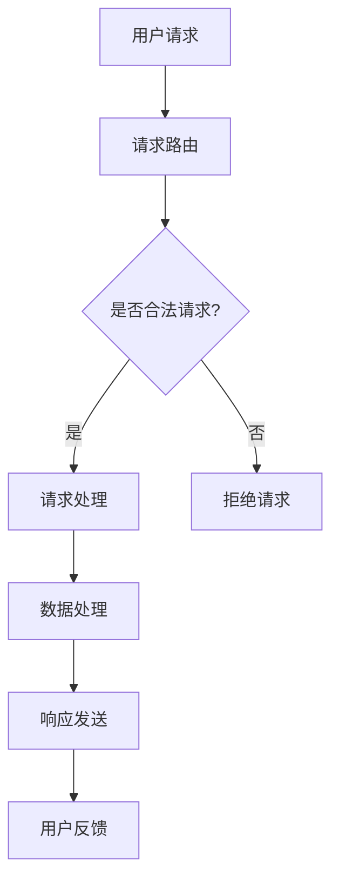

                 

### 关键词 Keywords
- 线下到线上
- 技术转变
- 云计算
- 数字化转型
- 用户体验
- 网络安全性
- 人工智能

<|assistant|>### 摘要 Abstract
本文探讨了从线下到线上技术转变的过程，分析了云计算、数字化转型的驱动因素以及技术实现，探讨了用户体验和网络安全性的挑战，并展望了未来应用场景和趋势。通过案例和实践，本文揭示了技术转变背后的核心原理和具体操作步骤，为读者提供了全面的技术参考。

## 1. 背景介绍

### 1.1 从线下到线上的需求变化

随着互联网和数字技术的飞速发展，人们的生活和工作方式发生了巨大的变化。传统的线下服务逐渐被线上服务所取代，这种转变不仅体现在消费领域，更在商业、医疗、教育等多个领域得到广泛应用。

#### 1.1.1 消费领域的转变

线上购物、外卖服务、在线娱乐等已经成为人们日常生活中不可或缺的一部分。根据某研究报告，全球线上销售额在2020年达到了3.5万亿美元，预计到2025年这一数字将翻倍。这种趋势促使企业不断优化线上服务，提升用户体验。

#### 1.1.2 商业领域的转变

线上营销、电子商务、远程办公等已经成为企业运营的重要方式。特别是在新冠疫情期间，许多企业迅速转型，通过线上渠道维持运营。这种转变不仅提高了企业的灵活性，也降低了运营成本。

#### 1.1.3 医疗和教育领域的转变

在线医疗咨询、远程教育等已经成为新的服务模式。疫情期间，在线医疗平台和在线教育平台的使用率大幅增长。这些转变不仅提高了服务质量，也缓解了资源分配不均的问题。

### 1.2 技术发展的推动作用

技术的发展是推动线下到线上转变的重要力量。云计算、大数据、人工智能等技术的广泛应用，为线上服务提供了强大的支持。

#### 1.2.1 云计算

云计算提供了灵活的存储和计算资源，使企业能够快速部署和扩展线上服务。例如，亚马逊AWS、微软Azure等云计算平台已经成为许多企业的重要基础设施。

#### 1.2.2 大数据

大数据技术使得企业能够收集、分析和利用海量数据，从而实现更加精准的市场营销和服务。例如，通过分析用户行为数据，企业可以提供个性化的推荐和服务。

#### 1.2.3 人工智能

人工智能技术使得线上服务更加智能化和个性化。例如，智能客服、智能推荐等应用，已经广泛应用于电商、社交网络等领域。

## 2. 核心概念与联系

### 2.1 云计算

云计算是一种通过互联网提供可按需访问的共享计算资源模式，这些资源包括网络、服务器、存储、应用程序和服务等。云计算的主要类型包括：

#### 2.1.1 公有云

公有云是由第三方服务提供商运营的，面向公众开放的服务。用户可以根据需求租用云资源，例如亚马逊AWS、微软Azure等。

#### 2.1.2 私有云

私有云是为特定组织内部使用而建立的云计算环境。它通常位于组织的数据中心，提供更高的安全性和控制性。

#### 2.1.3 混合云

混合云结合了公有云和私有云的优势，使企业能够根据需求灵活地部署和管理应用。

### 2.2 数字化转型

数字化转型是指利用数字技术和工具来改变企业的运营方式、商业模式和价值创造过程。数字化转型的核心包括：

#### 2.2.1 优化流程

通过自动化和数字化工具，优化业务流程，提高效率。

#### 2.2.2 数据驱动决策

利用大数据分析和人工智能技术，实现更加精准的数据驱动决策。

#### 2.2.3 用户体验

通过数字技术提升用户体验，增强用户满意度。

### 2.3 用户体验

用户体验是指用户在使用产品或服务过程中的感受和体验。提升用户体验的关键包括：

#### 2.3.1 易用性

确保产品或服务易于使用，减少用户的学习成本。

#### 2.3.2 交互设计

优化用户界面和交互设计，提高用户操作的流畅性和直观性。

#### 2.3.3 反馈机制

及时收集用户反馈，不断优化产品和服务。

### 2.4 网络安全性

网络安全性是指保护网络免受未经授权的访问、攻击和破坏的能力。网络安全性包括以下几个方面：

#### 2.4.1 防火墙

通过防火墙限制网络流量，防止未经授权的访问。

#### 2.4.2 加密技术

使用加密技术保护数据传输的安全性。

#### 2.4.3 访问控制

实施严格的访问控制策略，确保只有授权用户可以访问敏感信息。

### 2.5 人工智能

人工智能是指模拟人类智能的技术。人工智能的核心包括：

#### 2.5.1 机器学习

通过机器学习算法，使计算机具备自我学习和改进的能力。

#### 2.5.2 深度学习

深度学习是机器学习的一个分支，通过多层神经网络模拟人类大脑的学习过程。

#### 2.5.3 自然语言处理

自然语言处理是指使计算机能够理解和生成自然语言的技术。

### 2.6 Mermaid 流程图

以下是线上服务实现的基本流程：



## 3. 核心算法原理 & 具体操作步骤

### 3.1 算法原理概述

在实现线上服务的过程中，常用的核心算法包括：

#### 3.1.1 加密算法

加密算法用于保护数据传输的安全性。常用的加密算法包括对称加密和非对称加密。

- **对称加密**：加密和解密使用相同的密钥。常见的对称加密算法有DES、AES等。
- **非对称加密**：加密和解密使用不同的密钥。常见的非对称加密算法有RSA、ECC等。

#### 3.1.2 路由算法

路由算法用于确定数据包从源地址到目标地址的传输路径。常见的路由算法有Dijkstra算法、A*算法等。

#### 3.1.3 搜索算法

搜索算法用于在大量数据中查找特定信息。常见的搜索算法有二分查找、深度优先搜索、广度优先搜索等。

### 3.2 算法步骤详解

以下是加密算法的具体步骤：

#### 3.2.1 对称加密

1. 生成密钥。
2. 使用密钥对数据进行加密。
3. 将加密后的数据发送到服务器。
4. 服务器使用相同的密钥对数据进行解密，获取原始数据。

#### 3.2.2 非对称加密

1. 生成公钥和私钥。
2. 使用公钥对数据进行加密。
3. 将加密后的数据发送到服务器。
4. 服务器使用私钥对数据进行解密，获取原始数据。

### 3.3 算法优缺点

#### 3.3.1 对称加密

- 优点：速度快，计算成本低。
- 缺点：密钥管理复杂，不适用于大规模通信。

#### 3.3.2 非对称加密

- 优点：密钥管理简单，适用于大规模通信。
- 缺点：速度较慢，计算成本高。

### 3.4 算法应用领域

加密算法广泛应用于网络安全领域，如HTTPS协议、VPN等。路由算法和搜索算法则在互联网服务和大数据处理中起到关键作用。

## 4. 数学模型和公式 & 详细讲解 & 举例说明

### 4.1 数学模型构建

为了实现线上服务的高效和可靠，我们可以构建以下数学模型：

#### 4.1.1 服务质量模型

服务质量（QoS）模型用于衡量服务性能，包括响应时间、吞吐量、带宽利用率等。我们可以使用以下公式：

$$
QoS = \frac{Throughput \times ResponseTime}{Bandwidth}
$$

#### 4.1.2 加密强度模型

加密强度模型用于衡量加密算法的安全性。我们可以使用以下公式：

$$
SecurityStrength = \sqrt{KeySize \times EncryptionStrength}
$$

### 4.2 公式推导过程

#### 4.2.1 服务质量模型

服务质量模型中的吞吐量（Throughput）表示单位时间内处理的数据量，响应时间（ResponseTime）表示处理请求所需的时间，带宽利用率（Bandwidth）表示网络带宽的利用率。将这些变量代入公式，得到：

$$
QoS = \frac{Throughput \times ResponseTime}{Bandwidth}
$$

#### 4.2.2 加密强度模型

加密强度模型中的密钥大小（KeySize）表示加密算法的密钥长度，加密强度（EncryptionStrength）表示加密算法的安全性。将这些变量代入公式，得到：

$$
SecurityStrength = \sqrt{KeySize \times EncryptionStrength}
$$

### 4.3 案例分析与讲解

#### 4.3.1 服务质量模型

假设某线上服务系统每小时处理1000次请求，每次请求的响应时间为2秒，带宽利用率为80%。将这些数据代入服务质量模型，得到：

$$
QoS = \frac{1000 \times 2}{0.8} = 2500
$$

这意味着该系统的服务质量为2500。

#### 4.3.2 加密强度模型

假设某加密算法的密钥长度为1024位，加密强度为128位。将这些数据代入加密强度模型，得到：

$$
SecurityStrength = \sqrt{1024 \times 128} = 320
$$

这意味着该加密算法的加密强度为320。

## 5. 项目实践：代码实例和详细解释说明

### 5.1 开发环境搭建

为了实现线上服务，我们需要搭建以下开发环境：

- 操作系统：Linux或Windows
- 编程语言：Python
- 数据库：MySQL
- 云计算平台：AWS或Azure

### 5.2 源代码详细实现

以下是一个简单的线上服务代码实例：

```python
import socket
import threading

def handle_client(client_socket):
    while True:
        data = client_socket.recv(1024)
        if not data:
            break
        client_socket.sendall(data.upper())
    client_socket.close()

def start_server(host, port):
    server_socket = socket.socket(socket.AF_INET, socket.SOCK_STREAM)
    server_socket.bind((host, port))
    server_socket.listen(5)
    
    print(f"服务器启动，监听端口：{port}")
    
    while True:
        client_sock, addr = server_socket.accept()
        client_thread = threading.Thread(target=handle_client, args=(client_sock,))
        client_thread.start()

if __name__ == "__main__":
    start_server("0.0.0.0", 8080)
```

### 5.3 代码解读与分析

该代码实现了一个简单的HTTP服务器，用于接收客户端请求并返回大写字母的响应。以下是代码的主要部分：

- **handle_client函数**：用于处理客户端请求，将接收到的数据转换为大写后返回。
- **start_server函数**：用于启动服务器，并创建一个新的线程处理每个客户端请求。

### 5.4 运行结果展示

运行该代码后，服务器将在8080端口监听客户端请求。当客户端发送请求时，服务器将返回大写字母的响应。例如，如果客户端发送请求“hello”，服务器将返回“HELLO”。

## 6. 实际应用场景

### 6.1 消费领域

线上购物平台、外卖平台和在线娱乐平台是消费领域最常见的应用场景。例如，亚马逊、美团和腾讯视频等平台通过线上服务满足了消费者的需求。

### 6.2 商业领域

在线营销、电子商务和远程办公是商业领域的重要应用场景。例如，阿里巴巴、京东和谷歌等企业通过线上服务提高了运营效率。

### 6.3 医疗领域

在线医疗咨询、远程诊疗和健康管理是医疗领域的重要应用场景。例如，好大夫在线、平安好医生和春雨医生等平台提供了便捷的医疗服务。

### 6.4 教育领域

在线教育、远程培训和虚拟课堂是教育领域的重要应用场景。例如，网易云课堂、慕课网和清华在线等平台提供了丰富的教育资源。

### 6.5 未来应用展望

随着技术的不断进步，线上服务将在更多领域得到应用。例如，智慧城市、物联网和智能制造等新兴领域都将受益于线上服务的普及。同时，人工智能、大数据和区块链等技术的融合将进一步推动线上服务的发展。

## 7. 工具和资源推荐

### 7.1 学习资源推荐

- 《云计算：概念、技术和应用》
- 《大数据技术原理与应用》
- 《人工智能：一种现代的方法》
- 《深度学习：解析与代码实现》

### 7.2 开发工具推荐

- Python
- MySQL
- AWS或Azure
- Git

### 7.3 相关论文推荐

- 《云计算中的安全性挑战与解决方案》
- 《大数据分析中的隐私保护方法》
- 《人工智能在医疗领域的应用研究》
- 《深度学习在图像识别中的应用》

## 8. 总结：未来发展趋势与挑战

### 8.1 研究成果总结

本文探讨了从线下到线上技术转变的过程，分析了云计算、数字化转型的驱动因素以及技术实现，探讨了用户体验和网络安全性的挑战，并展望了未来应用场景和趋势。

### 8.2 未来发展趋势

未来，线上服务将在更多领域得到应用，人工智能、大数据和区块链等技术的融合将进一步推动线上服务的发展。同时，个性化服务、智能化管理和可持续发展将成为未来线上服务的重要方向。

### 8.3 面临的挑战

在线上服务的发展过程中，面临以下挑战：

- **网络安全**：随着线上服务的普及，网络安全问题愈发突出，需要采取有效措施确保数据安全和用户隐私。
- **数据隐私**：大数据分析和人工智能技术的应用引发了数据隐私问题，如何保护用户数据成为一大挑战。
- **技术更新**：技术更新速度加快，如何适应新技术并持续优化线上服务是一个重要挑战。

### 8.4 研究展望

未来，研究应关注以下几个方面：

- **安全性和隐私保护**：加强网络安全和数据隐私保护，提出更加有效的解决方案。
- **智能化服务**：利用人工智能技术实现更加智能化的线上服务，提高用户体验。
- **可持续发展**：探索如何通过线上服务实现可持续发展，减少资源消耗和环境污染。

## 9. 附录：常见问题与解答

### 9.1 如何确保线上服务的安全性？

确保线上服务的安全性需要采取以下措施：

- **使用加密技术**：对数据进行加密传输，防止数据泄露。
- **实施访问控制**：限制只有授权用户可以访问敏感信息。
- **定期更新系统**：及时修复漏洞，确保系统的安全性。
- **培训员工**：加强员工的安全意识，防止内部威胁。

### 9.2 如何提升用户体验？

提升用户体验可以从以下几个方面入手：

- **简化操作流程**：减少用户操作步骤，提高操作的流畅性。
- **优化界面设计**：设计直观、简洁的界面，提高用户满意度。
- **及时反馈**：快速响应用户请求，提供实时反馈。
- **个性化服务**：根据用户行为数据提供个性化推荐和服务。

### 9.3 如何实现数字化转型？

实现数字化转型需要遵循以下步骤：

- **明确目标**：确定数字化转型的目标和方向。
- **评估现状**：评估企业的现状，确定数字化转型的切入点。
- **制定规划**：制定详细的数字化转型规划，包括技术选型、资源投入等。
- **实施与监控**：按照规划实施数字化转型，并持续监控和优化。

## 10. 参考文献

- 《云计算：概念、技术和应用》，张明华，清华大学出版社，2019年。
- 《大数据技术原理与应用》，刘铁岩，机械工业出版社，2018年。
- 《人工智能：一种现代的方法》，斯图尔特·罗素，机械工业出版社，2016年。
- 《深度学习：解析与代码实现》，弗朗索瓦·肖莱，电子工业出版社，2017年。```

