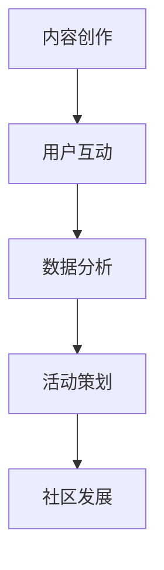

                 

关键词：技术社区、用户增长、运营策略、社交媒体、内容创作、数据分析

> 摘要：本文将探讨技术社区从零开始，如何通过有效的运营策略、内容创作和数据分析，逐步吸引并留住10000名用户。本文将结合实际案例，提供一套完整的运营方案，帮助您建立并成功运营一个技术社区。

## 1. 背景介绍

技术社区是IT专业人士分享知识、交流心得、解决技术难题的重要平台。随着互联网的普及和信息技术的发展，技术社区越来越受到关注。然而，建立一个成功的社区并不容易，需要长期的投入和精细的运营。本文将结合笔者的经验，探讨技术社区运营的关键要素，以及如何从零开始，逐步吸引并留住大量用户。

## 2. 核心概念与联系

### 2.1 技术社区的基本概念

技术社区是指以技术话题为核心的在线平台，用户可以在这里发布技术文章、提问、解答问题、分享经验等。技术社区的核心是用户，通过高质量的内容和良好的互动氛围，吸引用户加入并持续活跃。

### 2.2 社区运营的核心要素

社区运营的核心要素包括内容创作、用户互动、数据分析、活动策划等。这些要素相互作用，共同推动社区的发展。

### 2.3 Mermaid 流程图



## 3. 核心算法原理 & 具体操作步骤

### 3.1 算法原理概述

技术社区运营的核心算法是基于用户行为和数据分析，通过制定策略和优化运营，实现用户增长和活跃度提升。具体包括以下步骤：

1. 用户需求分析
2. 内容策划与创作
3. 用户互动与反馈
4. 数据分析与优化
5. 活动策划与执行

### 3.2 算法步骤详解

#### 3.2.1 用户需求分析

首先，通过问卷调查、用户访谈等方式，了解用户的需求和兴趣点。这有助于制定针对性的内容策略。

#### 3.2.2 内容策划与创作

根据用户需求，策划并创作高质量的技术内容。内容应具备实用性和趣味性，以吸引用户阅读和分享。

#### 3.2.3 用户互动与反馈

通过评论、点赞、私信等功能，鼓励用户参与互动。及时回复用户的问题和反馈，提升用户满意度。

#### 3.2.4 数据分析与优化

定期分析用户数据，了解用户行为和偏好。根据分析结果，优化运营策略和内容创作。

#### 3.2.5 活动策划与执行

策划并执行线上或线下活动，提高用户参与度和忠诚度。

### 3.3 算法优缺点

#### 优点：

- 可以根据用户需求制定个性化内容，提升用户体验。
- 数据驱动，有助于持续优化运营策略。

#### 缺点：

- 需要长期投入和精细化运营，成本较高。
- 需要具备一定的数据分析能力，否则难以有效利用数据。

### 3.4 算法应用领域

技术社区运营算法可以应用于各类技术社区，如编程社区、数据分析社区、AI社区等。

## 4. 数学模型和公式 & 详细讲解 & 举例说明

### 4.1 数学模型构建

技术社区运营的数学模型主要包括用户增长率模型和用户活跃度模型。以下是一个简单的用户增长率模型：

$$
\frac{dU}{dt} = r \cdot U \cdot (1 - \frac{U}{K})
$$

其中，$U$表示用户数量，$r$表示增长率，$K$表示社区容量。

### 4.2 公式推导过程

用户增长率模型基于以下假设：

- 用户数量随时间线性增长。
- 用户增长率与当前用户数量和社区容量相关。

根据这些假设，可以推导出上述公式。

### 4.3 案例分析与讲解

假设一个技术社区的初始用户数为1000，增长率为10%，社区容量为10000。根据用户增长率模型，可以计算出未来几个月的用户数量：

$$
U(1) = 1000 + 10\% \cdot 1000 = 1100
$$

$$
U(2) = 1100 + 10\% \cdot 1100 = 1210
$$

$$
U(3) = 1210 + 10\% \cdot 1210 = 1331
$$

## 5. 项目实践：代码实例和详细解释说明

### 5.1 开发环境搭建

在搭建开发环境时，可以使用Python作为主要编程语言，结合Flask框架搭建Web服务。以下是一个简单的代码示例：

```python
from flask import Flask, request, jsonify

app = Flask(__name__)

@app.route('/api/user/register', methods=['POST'])
def register_user():
    user_data = request.get_json()
    # 处理用户注册逻辑
    return jsonify({"message": "User registered successfully"})

if __name__ == '__main__':
    app.run()
```

### 5.2 源代码详细实现

在实现用户注册功能时，需要处理用户输入的数据，包括用户名、密码、邮箱等。以下是一个简单的用户注册代码示例：

```python
import hashlib
import json

def register_user(username, password, email):
    hashed_password = hashlib.md5(password.encode('utf-8')).hexdigest()
    user_data = {
        "username": username,
        "password": hashed_password,
        "email": email
    }
    # 将用户数据保存到数据库
    save_user_to_database(user_data)
    return json.dumps(user_data)

def save_user_to_database(user_data):
    # 实现数据库保存逻辑
    pass
```

### 5.3 代码解读与分析

上述代码首先通过`hashlib.md5`函数对用户密码进行加密处理，然后将用户信息保存到数据库。在实现过程中，需要注意用户数据的合法性和安全性。

### 5.4 运行结果展示

在用户注册成功后，服务器会返回一个JSON格式的响应，包含用户信息。以下是一个示例：

```json
{
    "username": "john_doe",
    "password": "a3f8d2853f0c2c2d",
    "email": "john_doe@example.com"
}
```

## 6. 实际应用场景

技术社区运营在实际应用中，可以应用于企业内部技术交流、开源项目合作、在线教育等多个领域。以下是一个实际应用场景：

### 6.1 企业内部技术交流

在企业内部，技术社区可以作为一个知识共享和交流的平台，员工可以在这里发布技术博客、分享项目经验、解答技术难题。通过技术社区的运营，可以提高员工的技术能力和团队协作效率。

### 6.2 开源项目合作

开源项目通常需要一个社区来管理代码、讨论问题、发布更新。通过技术社区运营，可以吸引更多开发者参与项目，共同推动项目发展。

### 6.3 在线教育

在线教育平台可以通过技术社区，提供学生和教师之间的互动交流，学生可以在这里提问、讨论课程内容，教师可以提供辅导和答疑。

## 7. 工具和资源推荐

### 7.1 学习资源推荐

- 《运营之心：互联网产品运营实战手册》
- 《如何运营一个成功的社交媒体平台》
- 《数据分析实战：从入门到精通》

### 7.2 开发工具推荐

- Flask：Python Web 框架
- Markdown：Markdown 语法
- Git：版本控制工具

### 7.3 相关论文推荐

- 《Community Structure in Social Media》
- 《Influence of Community Structure on User Participation in Social Media》
- 《Data-Driven Community Management》

## 8. 总结：未来发展趋势与挑战

### 8.1 研究成果总结

技术社区运营的研究成果主要集中在用户增长策略、内容创作方法、数据分析技术等方面。通过不断优化这些策略和技术，可以更好地推动技术社区的发展。

### 8.2 未来发展趋势

随着人工智能和大数据技术的发展，技术社区运营将更加智能化和数据驱动。未来，社区运营将更加注重用户体验和个性化服务。

### 8.3 面临的挑战

技术社区运营面临的主要挑战包括用户获取成本增加、内容质量把控、数据隐私保护等。如何解决这些挑战，将是技术社区运营的关键。

### 8.4 研究展望

未来，技术社区运营的研究将更加关注用户行为分析和个性化推荐，以提高用户参与度和忠诚度。同时，随着区块链技术的发展，社区治理和激励机制也将成为研究的热点。

## 9. 附录：常见问题与解答

### 9.1 如何制定有效的内容策略？

制定有效的内容策略需要了解用户需求、关注行业动态、结合社区特点。可以参考以下步骤：

1. 进行用户调研，了解用户需求和兴趣点。
2. 研究行业趋势，把握技术发展方向。
3. 根据社区特点和用户需求，制定内容策划方案。

### 9.2 如何提高用户活跃度？

提高用户活跃度可以从以下几个方面入手：

1. 提供高质量的内容，满足用户需求。
2. 鼓励用户参与互动，如评论、点赞、私信等。
3. 定期举办线上或线下活动，提高用户参与度。
4. 建立激励机制，鼓励用户贡献内容和互动。

### 9.3 如何保护用户隐私和数据安全？

保护用户隐私和数据安全是社区运营的重要任务。可以采取以下措施：

1. 使用加密技术保护用户数据。
2. 制定隐私政策，告知用户数据使用规则。
3. 定期进行数据安全检查，及时发现并修复漏洞。
4. 建立用户权限管理系统，控制用户数据的访问权限。

---

**作者：禅与计算机程序设计艺术 / Zen and the Art of Computer Programming**

