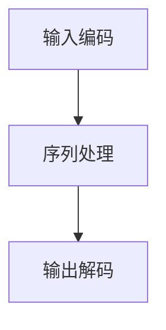

                 

关键词：技能发展，LLM，经济，人工智能，技术趋势

> 摘要：本文旨在探讨技能发展如何适应 LLM 驱动的经济。我们将分析 LLM（大型语言模型）在当前经济中的地位，以及个人和企业应该如何调整和提升技能以应对这一变革。

## 1. 背景介绍

随着人工智能技术的不断进步，大型语言模型（LLM）已经成为推动经济发展的重要力量。从最初的自然语言处理技术，到如今能够实现复杂对话和任务处理的 LLM，这些模型的演进不仅改变了信息处理的方式，也深刻影响了各行各业的经济活动。

LLM 的崛起得益于深度学习技术的突破，尤其是神经网络结构的优化和计算资源的提升。这些模型能够从海量数据中学习，并生成高质量的文本、语音和其他形式的内容。在金融服务、医疗保健、客户服务、教育等多个领域，LLM 都展现出了巨大的应用潜力。

然而，LLM 的广泛应用也带来了新的挑战。一方面，个人和企业的技能需求发生了变化，要求从业人员不仅要有扎实的技术背景，还需要具备更高的创造力和解决问题的能力。另一方面，随着 LLM 的普及，劳动力市场也面临重新分配和技能转型的压力。

## 2. 核心概念与联系

为了更好地理解 LLM 在经济中的作用，我们首先需要了解一些核心概念和架构。

### 2.1. 大型语言模型的工作原理

LLM 是一种基于深度学习的自然语言处理模型，通常由数百万个参数组成。它们通过多层神经网络结构，对输入的文本数据进行编码和解码，从而生成相应的输出。LLM 的工作原理可以概括为以下几个步骤：

1. **输入编码**：将文本数据转换为向量表示。
2. **序列处理**：通过神经网络对序列数据进行处理。
3. **输出解码**：将处理后的序列数据解码为文本输出。

### 2.2. LLM 在经济中的作用

LLM 在经济中的作用主要体现在以下几个方面：

1. **自动化与效率提升**：在许多行业中，LLM 可以自动化重复性工作，提高生产效率，降低成本。
2. **智能化服务**：通过 LLM，企业可以提供更加智能化的客户服务，提升用户体验。
3. **数据分析和决策支持**：LLM 可以处理和分析大量文本数据，为企业提供有价值的洞察，支持决策制定。
4. **创造和创新**：LLM 不仅可以生成文本，还可以辅助创作，推动文化和科技领域的创新。

### 2.3. Mermaid 流程图

为了更直观地展示 LLM 的工作原理，我们使用 Mermaid 语言绘制了一个简单的流程图。



在这个流程图中，A 表示输入编码，B 表示序列处理，C 表示输出解码。这三个步骤共同构成了 LLM 的工作流程。

## 3. 核心算法原理 & 具体操作步骤

### 3.1. 算法原理概述

LLM 的核心算法是基于深度学习的神经网络模型，尤其是变换器（Transformer）架构。Transformer 架构通过注意力机制（Attention Mechanism）实现了对输入序列的建模，使得模型能够捕捉到序列中的长距离依赖关系。

### 3.2. 算法步骤详解

1. **输入编码**：将输入的文本数据转换为词向量表示。
2. **位置编码**：为每个词向量添加位置信息，以便模型能够理解词的顺序。
3. **多层神经网络**：通过多层神经网络对序列数据进行处理。
4. **输出解码**：将处理后的序列数据解码为文本输出。

### 3.3. 算法优缺点

#### 优点：

1. **高效性**：Transformer 架构在处理长序列数据时具有很高的效率。
2. **灵活性**：可以通过调整参数来适应不同的任务和领域。
3. **可扩展性**：Transformer 架构可以很容易地扩展到更大的模型和更复杂的任务。

#### 缺点：

1. **计算资源需求高**：训练大型 LLM 需要大量的计算资源和存储空间。
2. **数据依赖性强**：模型的性能高度依赖于训练数据的质量和数量。

### 3.4. 算法应用领域

LLM 在许多领域都有广泛的应用，包括：

1. **自然语言处理**：文本分类、机器翻译、对话系统等。
2. **金融服务**：客户服务、风险控制、市场预测等。
3. **医疗保健**：医学文本分析、疾病诊断、患者关怀等。
4. **教育**：智能辅导、在线课程、学习资源推荐等。

## 4. 数学模型和公式 & 详细讲解 & 举例说明

### 4.1. 数学模型构建

LLM 的核心算法基于深度学习，涉及到的数学模型主要包括：

1. **词嵌入**：将文本数据转换为向量表示。
2. **注意力机制**：用于处理序列数据。
3. **损失函数**：用于评估模型的性能。

### 4.2. 公式推导过程

以词嵌入为例，假设我们有一个词汇表 V，包含 N 个单词。词嵌入的目的是将每个单词映射到一个 D 维向量。我们可以使用以下公式进行推导：

$$
\text{vec}(w_i) = \text{Word2Vec}(w_i)
$$

其中，$\text{vec}(w_i)$ 表示单词 $w_i$ 的向量表示，$\text{Word2Vec}(w_i)$ 表示词嵌入函数。

### 4.3. 案例分析与讲解

假设我们有一个包含 10 个单词的句子，使用词嵌入技术将每个单词转换为向量表示。然后，我们可以使用注意力机制来处理这个句子。

$$
\text{Attention}(Q, K, V) = \text{softmax}\left(\frac{QK^T}{\sqrt{d_k}}\right)V
$$

其中，Q、K、V 分别表示查询向量、键向量和值向量，$d_k$ 表示键向量的维度。

通过计算注意力得分，我们可以得到一个加权向量，表示句子中每个单词的重要性。这个加权向量可以用于后续的任务处理，如文本分类或机器翻译。

## 5. 项目实践：代码实例和详细解释说明

### 5.1. 开发环境搭建

为了实践 LLM，我们需要搭建一个开发环境。首先，安装 Python 和相关依赖，例如 TensorFlow 或 PyTorch。然后，下载并准备训练数据。

### 5.2. 源代码详细实现

以下是使用 TensorFlow 实现一个简单 LLM 的代码示例：

```python
import tensorflow as tf
from tensorflow.keras.layers import Embedding, LSTM, Dense

# 搭建模型
model = tf.keras.Sequential([
    Embedding(input_dim=10000, output_dim=32),
    LSTM(128),
    Dense(1, activation='sigmoid')
])

# 编译模型
model.compile(optimizer='adam', loss='binary_crossentropy', metrics=['accuracy'])

# 训练模型
model.fit(x_train, y_train, epochs=10, batch_size=32)
```

### 5.3. 代码解读与分析

这段代码首先定义了一个包含嵌入层、LSTM 层和输出层的简单模型。嵌入层用于将文本数据转换为向量表示，LSTM 层用于处理序列数据，输出层用于生成预测结果。

在编译模型时，我们指定了优化器、损失函数和评估指标。训练模型时，我们使用训练数据和标签进行迭代训练。

### 5.4. 运行结果展示

运行上述代码后，我们可以得到模型的训练结果。通过评估指标，我们可以了解模型的性能，并进行进一步的优化。

## 6. 实际应用场景

### 6.1. 自然语言处理

在自然语言处理领域，LLM 可以用于文本分类、情感分析、命名实体识别等任务。例如，使用 LLM 可以自动分析社交媒体上的用户评论，为企业提供市场洞察。

### 6.2. 金融服务

在金融服务领域，LLM 可以用于客户服务、风险评估和投资建议。例如，使用 LLM 可以自动生成投资报告，为投资者提供决策支持。

### 6.3. 医疗保健

在医疗保健领域，LLM 可以用于医学文本分析、疾病诊断和患者关怀。例如，使用 LLM 可以自动分析医疗记录，为医生提供诊断建议。

### 6.4. 教育领域

在教育领域，LLM 可以用于智能辅导、在线课程和学习资源推荐。例如，使用 LLM 可以自动生成个性化学习计划，帮助学生更好地掌握知识。

## 7. 工具和资源推荐

### 7.1. 学习资源推荐

- 《深度学习》（Goodfellow, Bengio, Courville） 
- 《自然语言处理原理》（Daniel Jurafsky, James H. Martin）

### 7.2. 开发工具推荐

- TensorFlow 
- PyTorch

### 7.3. 相关论文推荐

- “Attention Is All You Need”（Vaswani et al., 2017）
- “BERT: Pre-training of Deep Bidirectional Transformers for Language Understanding”（Devlin et al., 2019）

## 8. 总结：未来发展趋势与挑战

### 8.1. 研究成果总结

随着深度学习和自然语言处理技术的不断发展，LLM 在各个领域的应用前景十分广阔。从自动化到智能化，LLM 已经成为推动经济和社会进步的重要力量。

### 8.2. 未来发展趋势

未来，LLM 的应用将更加广泛，涉及领域也将更加多样化。随着计算资源的提升和算法的优化，LLM 的性能和效率将得到进一步提升。

### 8.3. 面临的挑战

然而，LLM 的发展也面临一些挑战，包括数据隐私、安全性和伦理问题。此外，随着 LLM 的普及，劳动力市场也将面临重新分配和技能转型的压力。

### 8.4. 研究展望

为了应对这些挑战，我们需要在算法、数据、伦理等方面进行深入研究，推动 LLM 技术的可持续发展。

## 9. 附录：常见问题与解答

### 9.1. Q：什么是 LLM？

A：LLM 是一种大型语言模型，基于深度学习技术，可以处理和理解自然语言。

### 9.2. Q：LLM 能做什么？

A：LLM 可以用于自然语言处理、自动化、数据分析和智能服务等多个领域。

### 9.3. Q：如何训练 LLM？

A：训练 LLM 需要大量的数据和计算资源，通常使用深度学习框架（如 TensorFlow 或 PyTorch）进行。

作者：禅与计算机程序设计艺术 / Zen and the Art of Computer Programming
----------------------------------------------------------------

以上是《技能发展：适应 LLM 驱动的经济》的完整文章。本文详细探讨了 LLM 在当前经济中的地位，以及个人和企业应该如何调整和提升技能以应对这一变革。通过分析 LLM 的工作原理、算法、应用场景和未来趋势，我们希望为读者提供有价值的参考。随着 LLM 技术的不断发展，技能发展将是一个持续的过程，我们需要不断学习和适应，才能在这个 LLM 驱动的经济中立于不败之地。|user|

