                 

关键词：技能提升、计算时代、新需求、技术发展、人工智能、计算机编程

> 摘要：随着科技的高速发展，人类计算时代的需求也在不断变化。本文将探讨在新时代背景下，如何提升个人技能以适应新需求，特别是在人工智能、计算机编程等领域的重要性和具体实践方法。

## 1. 背景介绍

在过去的几十年里，计算机技术的发展带来了人类生活和工作方式的深刻变革。从最初的电子计算器到今天的大规模数据处理和人工智能应用，计算机技术不断推动着社会的进步。然而，随着技术的快速发展，传统的技能和知识体系已经难以满足新时代的需求。

### 1.1 人工智能时代的来临

人工智能（AI）的崛起标志着人类计算时代进入了一个全新的阶段。AI技术的广泛应用，如机器学习、深度学习、自然语言处理等，正在改变着各行各业的运作方式。无论是医疗、金融、教育还是制造业，人工智能都在发挥着越来越重要的作用。

### 1.2 编程技术的变革

计算机编程作为人工智能技术的基础，其重要性不言而喻。然而，编程语言和开发工具也在不断更新换代。传统的编程技能已经不足以应对复杂的应用场景和高效的开发需求。

### 1.3 软件架构的演进

随着应用规模的扩大和复杂性的增加，软件架构的设计和实现变得越来越重要。微服务架构、云计算、大数据等技术，为开发者提供了更灵活和高效的设计选择。

## 2. 核心概念与联系

在探讨如何提升技能以适应新时代的需求之前，我们需要了解一些核心概念和它们之间的联系。以下是一个Mermaid流程图，展示了人工智能、编程技术和软件架构之间的关系：

```mermaid
graph TB
    A(人工智能) --> B(机器学习)
    A --> C(自然语言处理)
    A --> D(计算机视觉)
    B --> E(深度学习)
    B --> F(强化学习)
    C --> G(语音识别)
    C --> H(机器翻译)
    D --> I(图像识别)
    D --> J(目标检测)
    E --> K(神经网络)
    F --> L(策略网络)
    B --> M(数据预处理)
    B --> N(特征提取)
    E --> O(卷积神经网络)
    E --> P(循环神经网络)
    K --> Q(激活函数)
    K --> R(优化算法)
    M --> S(数据清洗)
    M --> T(数据归一化)
    N --> U(特征选择)
    N --> V(特征组合)
    O --> W(卷积层)
    O --> X(池化层)
    P --> Y(隐藏层)
    P --> Z(输出层)
    G --> AA(声学模型)
    G --> AB(语言模型)
    H --> AC(翻译模型)
    I --> AD(特征提取模型)
    J --> AE(目标检测模型)
    AA --> AF(语音识别系统)
    AB --> AG(机器翻译系统)
    AC --> AH(语音识别系统)
    AD --> AI(图像识别系统)
    AE --> AJ(目标检测系统)
    K --> AL(神经架构搜索)
    M --> AM(数据增强)
    N --> AN(数据压缩)
    O --> AO(残差连接)
    P --> AP(注意力机制)
    R --> AQ(自适应学习率)
    S --> AR(异常检测)
    T --> AS(时间序列分析)
    U --> AT(主成分分析)
    V --> AU(支持向量机)
    W --> AV(卷积神经网络应用)
    X --> AW(卷积神经网络应用)
    Y --> AX(循环神经网络应用)
    Z --> AZ(输出层应用)
    L --> BB(强化学习应用)
    M --> BC(数据预处理应用)
    N --> BD(特征提取应用)
    O --> BE(计算机视觉应用)
    P --> BF(自然语言处理应用)
    Q --> BG(神经网络应用)
    R --> BH(优化算法应用)
    S --> BI(数据清洗应用)
    T --> BJ(时间序列分析应用)
    U --> BK(特征选择应用)
    V --> BL(特征组合应用)
    W --> BM(卷积神经网络应用)
    X --> BN(池化层应用)
    Y --> BO(循环神经网络应用)
    Z --> BP(输出层应用)
    AL --> BA(神经网络架构设计)
    AM --> BB(数据增强技术)
    AN --> BC(数据压缩技术)
    AO --> BD(卷积神经网络技术)
    AP --> BE(注意力机制技术)
    AQ --> BF(自适应学习率技术)
    AR --> BG(异常检测技术)
    AS --> BH(时间序列分析技术)
    AT --> BK(主成分分析技术)
    AU --> BL(支持向量机技术)
    AV --> BM(卷积神经网络应用领域)
    AW --> BN(池化层应用领域)
    AX --> BO(循环神经网络应用领域)
    AZ --> BP(输出层应用领域)
    AJ --> BD(目标检测应用领域)
    AI --> BH(图像识别应用领域)
    AF --> BI(语音识别应用领域)
    AG --> BK(机器翻译应用领域)
    AH --> BL(自然语言处理应用领域)
```



## 3. 核心算法原理 & 具体操作步骤

### 3.1 算法原理概述

核心算法是推动人工智能和计算机技术发展的重要力量。本节将介绍几个关键算法的原理，并讨论它们的操作步骤。

### 3.2 算法步骤详解

#### 3.2.1 卷积神经网络（CNN）

卷积神经网络是一种在图像识别和计算机视觉中广泛应用的深度学习模型。其基本操作步骤如下：

1. **输入层**：接受图像数据。
2. **卷积层**：通过卷积操作提取图像的特征。
3. **池化层**：降低特征图的维度，提高计算效率。
4. **全连接层**：将特征映射到具体的类别。
5. **输出层**：输出分类结果。

#### 3.2.2 递归神经网络（RNN）

递归神经网络适用于序列数据的建模，如时间序列分析、自然语言处理等。其主要操作步骤包括：

1. **输入层**：接受序列数据。
2. **隐藏层**：通过递归操作处理序列中的每个数据点。
3. **输出层**：根据隐藏层的状态输出预测结果。

#### 3.2.3 强化学习

强化学习是一种通过试错进行决策优化的算法，广泛应用于游戏、自动驾驶等领域。其基本操作步骤包括：

1. **环境建模**：定义环境和状态。
2. **策略选择**：根据当前状态选择动作。
3. **状态转移**：执行动作并观察状态转移。
4. **奖励评估**：根据动作结果评估奖励。
5. **策略更新**：根据奖励更新策略。

### 3.3 算法优缺点

每种算法都有其独特的优点和局限性。例如，卷积神经网络在图像识别任务上表现优异，但在处理文本数据时效果较差；递归神经网络适合处理序列数据，但训练过程中容易产生梯度消失问题；强化学习在决策优化方面具有优势，但需要大量数据和时间进行训练。

### 3.4 算法应用领域

核心算法在人工智能和计算机技术中的广泛应用，为各个领域带来了巨大的变革。例如，卷积神经网络在计算机视觉领域取得了显著的成果，应用于图像识别、目标检测和图像生成等任务；递归神经网络在自然语言处理领域表现出色，应用于机器翻译、文本生成和情感分析等任务；强化学习在游戏、自动驾驶和机器人控制等领域取得了突破性进展。

## 4. 数学模型和公式 & 详细讲解 & 举例说明

在人工智能和计算机技术中，数学模型和公式是理解和实现核心算法的重要工具。以下将介绍几个关键数学模型和公式的构建、推导过程，并通过具体例子进行说明。

### 4.1 数学模型构建

#### 4.1.1 卷积神经网络（CNN）的卷积操作

卷积神经网络中的卷积操作可以通过以下数学模型表示：

$$
\text{output} = \sigma(\text{input} \odot \text{filter} + \text{bias})
$$

其中，$\odot$ 表示元素乘积，$\sigma$ 表示激活函数，$input$ 为输入特征图，$filter$ 为卷积核，$bias$ 为偏置。

#### 4.1.2 递归神经网络（RNN）的递归操作

递归神经网络中的递归操作可以通过以下数学模型表示：

$$
h_t = \sigma(W_h \cdot [h_{t-1}, x_t] + b_h)
$$

其中，$h_t$ 为当前隐藏状态，$x_t$ 为输入数据，$W_h$ 为权重矩阵，$b_h$ 为偏置，$\sigma$ 为激活函数。

#### 4.1.3 强化学习中的奖励评估

强化学习中的奖励评估可以通过以下数学模型表示：

$$
Q(s, a) = r(s, a) + \gamma \max_{a'} Q(s', a')
$$

其中，$Q(s, a)$ 为当前状态 $s$ 下执行动作 $a$ 的价值函数，$r(s, a)$ 为即时奖励，$s'$ 为状态转移，$a'$ 为后续动作，$\gamma$ 为折扣因子。

### 4.2 公式推导过程

以下是对上述数学模型和公式推导过程的详细讲解。

#### 4.2.1 卷积神经网络（CNN）的卷积操作

卷积操作的推导过程如下：

1. **输入特征图 $input$ 与卷积核 $filter$ 的元素乘积**：

   $$
   \text{output}_{ij} = \sum_{k=1}^{K} \text{input}_{i+k, j} \cdot \text{filter}_{k}
   $$

   其中，$i$ 和 $j$ 为输出特征图的位置，$K$ 为卷积核的大小。

2. **添加偏置**：

   $$
   \text{output}_{ij} = \sum_{k=1}^{K} \text{input}_{i+k, j} \cdot \text{filter}_{k} + \text{bias}
   $$

3. **应用激活函数**：

   $$
   \text{output}_{ij} = \sigma(\sum_{k=1}^{K} \text{input}_{i+k, j} \cdot \text{filter}_{k} + \text{bias})
   $$

#### 4.2.2 递归神经网络（RNN）的递归操作

递归操作的推导过程如下：

1. **前向传播**：

   $$
   h_t = \sigma(W_h \cdot [h_{t-1}, x_t] + b_h)
   $$

2. **反向传播**：

   $$
   \Delta h_t = \frac{\partial L}{\partial h_t}
   $$

   其中，$L$ 为损失函数。

3. **更新权重**：

   $$
   W_h \leftarrow W_h - \alpha \frac{\partial L}{\partial W_h}
   $$

   其中，$\alpha$ 为学习率。

#### 4.2.3 强化学习中的奖励评估

奖励评估的推导过程如下：

1. **预期奖励**：

   $$
   \text{expected\_reward} = \sum_{s', a'} p(s', a'|s, a) \cdot Q(s', a')
   $$

   其中，$p(s', a'|s, a)$ 为状态转移概率。

2. **贝尔曼方程**：

   $$
   Q(s, a) = r(s, a) + \gamma \max_{a'} Q(s', a')
   $$

   其中，$r(s, a)$ 为即时奖励，$\gamma$ 为折扣因子。

### 4.3 案例分析与讲解

以下通过具体案例对上述数学模型和公式进行讲解。

#### 4.3.1 卷积神经网络（CNN）在图像识别中的应用

假设我们有一个 32x32 像素的图像，需要对其进行分类。我们可以使用一个 3x3 的卷积核对其进行卷积操作。首先，我们将卷积核与图像进行卷积操作，得到一个 28x28 的特征图。然后，对该特征图应用 ReLU 激活函数。最后，将该特征图与一个 128x28x28 的全连接层连接，进行分类。

具体操作如下：

1. **输入层**：

   $$
   input = \text{image\_data}_{32x32}
   $$

2. **卷积层**：

   $$
   output = \sigma(\sum_{k=1}^{3} \text{input}_{i+k, j} \cdot \text{filter}_{k} + \text{bias})
   $$

3. **池化层**：

   $$
   \text{output}_{ij} = \max_{k} \text{output}_{i+k, j}
   $$

4. **全连接层**：

   $$
   output = \sigma(W \cdot \text{output}_{28x28} + b)
   $$

5. **输出层**：

   $$
   \text{classification} = \text{softmax}(output)
   $$

#### 4.3.2 递归神经网络（RNN）在时间序列分析中的应用

假设我们有一个时间序列数据集，包含每天的气温。我们需要对未来的气温进行预测。我们可以使用一个 2-层 RNN 模型对其进行建模。首先，我们将时间序列数据输入到 RNN 模型中，通过递归操作处理每个时间点的数据。然后，将隐藏层状态输出到全连接层进行预测。

具体操作如下：

1. **输入层**：

   $$
   input = \text{temperature}_{t}
   $$

2. **隐藏层**：

   $$
   h_t = \sigma(W_h \cdot [h_{t-1}, x_t] + b_h)
   $$

3. **全连接层**：

   $$
   output = W_f \cdot h_t + b_f
   $$

4. **输出层**：

   $$
   \text{prediction} = \text{softmax}(output)
   $$

#### 4.3.3 强化学习在自动驾驶中的应用

假设我们有一个自动驾驶系统，需要在复杂的交通环境中做出最优的驾驶决策。我们可以使用一个 Q-学习算法对其进行建模。首先，定义环境和状态，然后选择动作，观察状态转移和奖励。通过不断更新 Q-值，优化驾驶策略。

具体操作如下：

1. **环境建模**：

   $$
   \text{state} = \text{current\_state}
   $$

2. **策略选择**：

   $$
   \text{action} = \arg\max_{a} Q(s, a)
   $$

3. **状态转移**：

   $$
   \text{next\_state} = \text{env}.step(\text{action})
   $$

4. **奖励评估**：

   $$
   \text{reward} = \text{env}.reward(\text{action}, \text{next\_state})
   $$

5. **策略更新**：

   $$
   Q(s, a) \leftarrow Q(s, a) + \alpha [r(s, a) + \gamma \max_{a'} Q(s', a') - Q(s, a)]
   $$

## 5. 项目实践：代码实例和详细解释说明

### 5.1 开发环境搭建

在进行项目实践之前，我们需要搭建一个合适的开发环境。以下是 Python 和 TensorFlow 的安装步骤：

1. **安装 Python**：

   $$
   \text{python} \text{ -majversion} \text{ -minversion} \text{ -platform} \text{ -architecture} \text{ -install}
   $$

2. **安装 TensorFlow**：

   $$
   \text{pip} \text{ install} \text{ tensorflow}
   $$

### 5.2 源代码详细实现

以下是一个简单的卷积神经网络（CNN）在图像识别中的应用实例。该实例使用 TensorFlow 和 Keras 库实现。

```python
import numpy as np
import tensorflow as tf
from tensorflow.keras import layers, models

# 数据预处理
def preprocess_images(images):
    return images / 255.0

# 构建模型
model = models.Sequential([
    layers.Conv2D(32, (3, 3), activation='relu', input_shape=(32, 32, 3)),
    layers.MaxPooling2D((2, 2)),
    layers.Conv2D(64, (3, 3), activation='relu'),
    layers.MaxPooling2D((2, 2)),
    layers.Conv2D(64, (3, 3), activation='relu'),
    layers.Flatten(),
    layers.Dense(64, activation='relu'),
    layers.Dense(10, activation='softmax')
])

# 编译模型
model.compile(optimizer='adam', loss='categorical_crossentropy', metrics=['accuracy'])

# 训练模型
model.fit(preprocess_images(train_images), train_labels, epochs=10, batch_size=32, validation_split=0.2)

# 评估模型
test_loss, test_accuracy = model.evaluate(preprocess_images(test_images), test_labels)
print(f"Test accuracy: {test_accuracy}")
```

### 5.3 代码解读与分析

该代码实现了一个简单的卷积神经网络，用于图像识别任务。以下是代码的详细解读：

1. **数据预处理**：

   ```python
   def preprocess_images(images):
       return images / 255.0
   ```

   该函数将输入的图像数据归一化到 [0, 1] 范围内，以提高模型的训练效果。

2. **构建模型**：

   ```python
   model = models.Sequential([
       layers.Conv2D(32, (3, 3), activation='relu', input_shape=(32, 32, 3)),
       layers.MaxPooling2D((2, 2)),
       layers.Conv2D(64, (3, 3), activation='relu'),
       layers.MaxPooling2D((2, 2)),
       layers.Conv2D(64, (3, 3), activation='relu'),
       layers.Flatten(),
       layers.Dense(64, activation='relu'),
       layers.Dense(10, activation='softmax')
   ])
   ```

   该模型由卷积层、池化层和全连接层组成。卷积层用于提取图像的特征，池化层用于降低特征图的维度，全连接层用于分类。

3. **编译模型**：

   ```python
   model.compile(optimizer='adam', loss='categorical_crossentropy', metrics=['accuracy'])
   ```

   该步骤编译模型，设置优化器、损失函数和评估指标。

4. **训练模型**：

   ```python
   model.fit(preprocess_images(train_images), train_labels, epochs=10, batch_size=32, validation_split=0.2)
   ```

   该步骤训练模型，使用预处理后的训练数据。

5. **评估模型**：

   ```python
   test_loss, test_accuracy = model.evaluate(preprocess_images(test_images), test_labels)
   print(f"Test accuracy: {test_accuracy}")
   ```

   该步骤评估模型在测试数据上的性能。

## 6. 实际应用场景

在人工智能和计算机技术的实际应用中，核心算法和数学模型发挥着至关重要的作用。以下列举几个实际应用场景：

### 6.1 医疗领域

人工智能在医疗领域的应用日益广泛，如疾病诊断、药物研发和医疗影像分析。卷积神经网络（CNN）在医疗影像分析中取得了显著成果，如肺癌检测、乳腺癌检测和脑部病变检测等。递归神经网络（RNN）在临床文本分析中表现出色，如电子健康记录（EHR）分析和医疗问答系统。

### 6.2 金融领域

人工智能在金融领域的应用包括风险管理、量化交易和信用评分等。强化学习在量化交易中发挥着重要作用，如自动交易策略和风险控制。深度学习在信用评分中取得了一定的成果，通过分析客户的交易记录、消费行为等数据，预测客户的信用风险。

### 6.3 教育领域

人工智能在教育领域的应用包括智能辅导、自适应学习和在线教育平台等。递归神经网络（RNN）在智能辅导中表现出色，如自然语言处理和个性化推荐。卷积神经网络（CNN）在在线教育平台中用于图像识别和视频分析，提高学习效果和互动性。

### 6.4 制造业

人工智能在制造业中的应用包括生产优化、设备故障预测和质量检测等。强化学习在生产优化中发挥着重要作用，如自动化生产线调度和能源管理。卷积神经网络（CNN）在质量检测中用于图像识别和缺陷检测，提高生产效率和产品质量。

## 7. 工具和资源推荐

为了更好地学习和实践人工智能和计算机技术，以下推荐一些实用的工具和资源：

### 7.1 学习资源推荐

- **书籍**：《深度学习》（Ian Goodfellow、Yoshua Bengio、Aaron Courville 著）、《Python深度学习》（François Chollet 著）
- **在线课程**：Coursera 上的《深度学习特辑》、edX 上的《机器学习科学》
- **博客**：Towards Data Science、AI 小天地、机器学习博客

### 7.2 开发工具推荐

- **编程语言**：Python、R、Java
- **深度学习框架**：TensorFlow、PyTorch、Keras
- **数据分析工具**：Pandas、NumPy、SciPy
- **可视化工具**：Matplotlib、Seaborn、Plotly

### 7.3 相关论文推荐

- **深度学习**：《A Neural Algorithm of Artistic Style》（Gatys 等人，2015）、《Unsupervised Representation Learning with Deep Convolutional Generative Adversarial Networks》（Radford 等人，2015）
- **强化学习**：《Deep Q-Network》（Mnih 等人，2015）、《Unsupervised Learning, Transfer Learning, and Meta Learning in Reinforcement Learning》（Lillicrap 等人，2015）
- **计算机视觉**：《Faster R-CNN：Towards Real-Time Object Detection with Region Proposal Networks》（Ren 等人，2015）、《You Only Look Once: Unified, Real-Time Object Detection》（Redmon 等人，2016）

## 8. 总结：未来发展趋势与挑战

随着人工智能和计算机技术的不断进步，人类计算时代的需求也在不断演变。未来，人工智能和计算机技术将在更多领域发挥重要作用，如智慧城市、智能家居、生物科技和自动驾驶等。以下是对未来发展趋势和面临的挑战的总结：

### 8.1 研究成果总结

- 深度学习在计算机视觉、自然语言处理和强化学习等领域取得了显著成果。
- 强化学习在决策优化和自动化控制中表现出色。
- 计算机视觉在医疗影像分析、安防监控和自动驾驶等领域取得重要突破。

### 8.2 未来发展趋势

- 多模态学习：结合不同类型的数据（如图像、文本和音频），实现更全面和智能的模型。
- 强化学习与深度学习的融合：将深度学习的特征提取能力和强化学习的决策优化能力相结合。
- 量子计算：利用量子计算的优势，提高计算效率和解决复杂问题。

### 8.3 面临的挑战

- 数据隐私和安全：如何保护用户数据和隐私，避免数据泄露和滥用。
- 算法可解释性：如何提高算法的可解释性，使其更透明和可信。
- 能源消耗：如何降低算法和模型的能源消耗，实现绿色计算。

### 8.4 研究展望

未来，人工智能和计算机技术将在更多领域发挥关键作用，为人类社会带来更多便利和变革。同时，研究者需要不断探索新的算法和模型，解决当前的挑战，推动技术的持续发展。

## 9. 附录：常见问题与解答

### 9.1 人工智能是什么？

人工智能（AI）是指计算机系统通过学习、推理和决策，模拟人类智能的行为。它包括多个领域，如机器学习、深度学习、自然语言处理和计算机视觉等。

### 9.2 深度学习如何工作？

深度学习是一种基于多层神经网络的学习方法，通过训练大量数据，提取特征并建模复杂任务。它包括卷积神经网络（CNN）、递归神经网络（RNN）和生成对抗网络（GAN）等。

### 9.3 强化学习有哪些应用？

强化学习在决策优化和自动化控制中具有广泛应用，如自动驾驶、游戏智能和智能制造等。

### 9.4 计算机视觉如何实现？

计算机视觉通过处理和分析图像或视频数据，实现目标检测、图像识别和图像生成等功能。它主要基于卷积神经网络（CNN）和其他深度学习模型。

### 9.5 自然语言处理如何实现？

自然语言处理通过分析文本数据，实现文本分类、情感分析和机器翻译等功能。它主要基于递归神经网络（RNN）、长短期记忆网络（LSTM）和变换器（Transformer）等深度学习模型。

### 9.6 如何学习人工智能和计算机技术？

学习人工智能和计算机技术可以通过以下途径：

- 阅读相关书籍和论文。
- 参加在线课程和研讨会。
- 实践项目，如构建自己的深度学习模型。
- 参与社区讨论和交流。

---

本文由禅与计算机程序设计艺术 / Zen and the Art of Computer Programming 撰写。希望本文能帮助您更好地理解和掌握人工智能和计算机技术，并在实际应用中取得成功。

---

请注意，本文仅作为示例，其中的代码和算法仅供参考。实际应用中，请根据具体需求进行调整和优化。同时，本文中的内容可能涉及最新的研究进展和技术动态，但技术领域不断发展，相关内容可能发生变化。请持续关注相关领域的发展动态，以获取最新信息。

