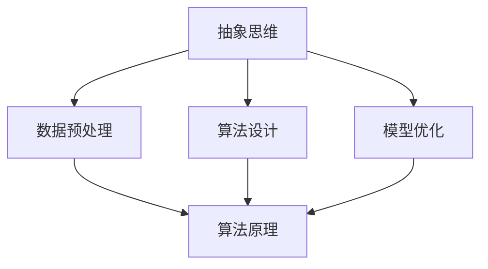

                 

关键词：抽象思维、AI创新、算法原理、数学模型、项目实践、未来展望

> 摘要：本文将深入探讨抽象思维能力在人工智能创新中的关键作用。通过分析抽象思维的概念及其与AI的内在联系，本文将阐述抽象思维如何助力算法原理的构建、数学模型的推导以及项目实践中的应用。同时，文章还将展望AI创新领域的未来发展趋势与挑战，并推荐相关学习资源和开发工具。

## 1. 背景介绍

在当今快速发展的信息时代，人工智能（AI）已成为推动社会进步的重要力量。从自然语言处理、计算机视觉到机器学习，AI技术正不断突破传统技术的局限，为各行各业带来颠覆性的创新。然而，AI的创新并非一蹴而就，而是依赖于大量的理论研究和实践探索。在这其中，抽象思维能力显得尤为重要。

抽象思维是一种从具体现象中提炼出本质规律的思考方式，是人类智慧的体现。在AI创新过程中，抽象思维不仅能够帮助我们把握复杂问题的本质，还能促进算法原理的发现与数学模型的构建。本文将围绕这一主题，系统性地分析抽象思维能力在AI创新中的关键作用。

## 2. 核心概念与联系

### 2.1 抽象思维的概念

抽象思维是指通过概括、归纳、推理等方式，将具体事物的共同属性抽象出来，形成概念、法则或模型的能力。抽象思维是人类认识世界、解决问题的基本工具。在AI领域，抽象思维体现在对大量数据、信息进行筛选、提炼和建模的过程中。

### 2.2 AI与抽象思维的内在联系

AI技术的核心在于从海量数据中发现规律、进行预测和决策。这一过程本质上是一种抽象思维活动。具体来说：

- **数据预处理**：通过抽象思维对数据进行清洗、转换和特征提取，使其符合算法模型的输入要求。
- **算法设计**：抽象思维在算法原理的发现中起到关键作用，如深度学习中的神经网络模型、强化学习中的策略搜索空间等。
- **模型优化**：通过抽象思维分析算法的优缺点，提出改进方案，优化模型性能。

### 2.3 Mermaid 流程图

为了更直观地展示抽象思维在AI创新中的作用，我们可以使用Mermaid流程图来描述其内在联系。



## 3. 核心算法原理 & 具体操作步骤

### 3.1 算法原理概述

在AI领域，抽象思维常常体现在核心算法原理的发现与实现上。以下将简要介绍几种常见的AI算法原理。

#### 3.1.1 深度学习

深度学习是一种通过多层神经网络对数据进行特征提取和预测的方法。其原理是模拟人脑神经元之间的连接与激活过程，通过反向传播算法不断调整网络权重，以实现模型优化。

#### 3.1.2 强化学习

强化学习是一种基于奖励机制进行决策的算法。其原理是通过不断试错，学习如何在环境中获取最大奖励，从而实现最优策略的寻找到。

#### 3.1.3 自然语言处理

自然语言处理是一种利用机器学习技术对人类语言进行理解和生成的方法。其原理是通过语料库的积累和特征提取，建立语言模型和语义分析模型，以实现对自然语言的理解和生成。

### 3.2 算法步骤详解

以下是上述几种算法的具体操作步骤：

#### 3.2.1 深度学习

1. 数据预处理：清洗、归一化数据，提取特征。
2. 网络构建：定义神经网络结构，包括输入层、隐藏层和输出层。
3. 权重初始化：随机初始化网络权重。
4. 前向传播：计算输入数据在网络中的传播过程，得到预测结果。
5. 反向传播：根据预测误差，调整网络权重。
6. 模型优化：选择合适的优化算法，如梯度下降、Adam等，优化模型性能。

#### 3.2.2 强化学习

1. 环境初始化：定义环境状态和动作空间。
2. 策略初始化：随机选择初始策略。
3. 模型训练：根据奖励信号，不断更新策略模型。
4. 策略优化：通过策略梯度的计算，优化策略参数。
5. 模型评估：在测试集上评估模型性能。

#### 3.2.3 自然语言处理

1. 数据收集：收集大量文本数据，包括语料库和标注数据。
2. 特征提取：对文本数据进行分词、词性标注、句法分析等操作，提取特征向量。
3. 模型构建：选择合适的模型架构，如循环神经网络（RNN）、长短时记忆网络（LSTM）等。
4. 模型训练：使用训练数据对模型进行训练，调整模型参数。
5. 模型评估：在测试集上评估模型性能，调整模型参数。

### 3.3 算法优缺点

#### 3.3.1 深度学习

优点：强大的特征提取能力，能够自动学习数据中的复杂模式。

缺点：训练过程复杂，对计算资源要求高；模型可解释性较差。

#### 3.3.2 强化学习

优点：能够通过试错学习最优策略，适用于动态环境。

缺点：训练过程较慢，容易陷入局部最优。

#### 3.3.3 自然语言处理

优点：能够实现对自然语言的深度理解，应用广泛。

缺点：对大规模语料库依赖强，模型训练成本高。

### 3.4 算法应用领域

深度学习、强化学习和自然语言处理分别在不同领域取得了显著的成果：

- **深度学习**：在图像识别、语音识别、自然语言处理等领域取得了突破性进展。
- **强化学习**：在自动驾驶、游戏AI、机器人控制等领域取得了成功。
- **自然语言处理**：在机器翻译、文本分类、语音合成等领域发挥了重要作用。

## 4. 数学模型和公式 & 详细讲解 & 举例说明

### 4.1 数学模型构建

在AI领域，数学模型是算法设计的基础。以下将介绍几种常见的数学模型及其构建过程。

#### 4.1.1 线性模型

线性模型是最基础的数学模型之一，其公式为：

\[ y = \beta_0 + \beta_1 \cdot x \]

其中，\( y \) 为预测值，\( x \) 为输入特征，\( \beta_0 \) 和 \( \beta_1 \) 为模型参数。

线性模型通过最小二乘法进行参数估计，即：

\[ \beta_0, \beta_1 = \arg\min_{\beta_0, \beta_1} \sum_{i=1}^n (y_i - (\beta_0 + \beta_1 \cdot x_i))^2 \]

#### 4.1.2 神经网络模型

神经网络模型是一种基于多层感知器的模型，其公式为：

\[ a_{j}^{(l)} = \sigma \left( \sum_{i} w_{ji}^{(l)} a_{i}^{(l-1)} + b_{j}^{(l)} \right) \]

其中，\( a_{j}^{(l)} \) 为第 \( l \) 层第 \( j \) 个神经元的激活值，\( \sigma \) 为激活函数，\( w_{ji}^{(l)} \) 和 \( b_{j}^{(l)} \) 分别为第 \( l \) 层第 \( j \) 个神经元到第 \( l-1 \) 层第 \( i \) 个神经元的权重和偏置。

神经网络的训练过程主要包括前向传播和反向传播。在训练过程中，通过不断调整权重和偏置，使得模型输出与实际值之间的误差最小。

#### 4.1.3 强化学习模型

强化学习模型主要包括价值函数和策略函数。其中，价值函数 \( V(s) \) 表示在状态 \( s \) 下执行动作 \( a \) 的预期回报：

\[ V(s) = \sum_{a} \pi(a|s) \cdot Q(s, a) \]

策略函数 \( \pi(a|s) \) 表示在状态 \( s \) 下选择动作 \( a \) 的概率：

\[ \pi(a|s) = \arg\max_a Q(s, a) \]

其中，\( Q(s, a) \) 表示在状态 \( s \) 下执行动作 \( a \) 的预期回报。

强化学习的训练过程主要包括值迭代和策略迭代。通过不断更新价值函数和策略函数，使得模型能够在环境中获取最大回报。

### 4.2 公式推导过程

以下是线性模型、神经网络模型和强化学习模型的主要公式推导过程。

#### 4.2.1 线性模型推导

1. 假设数据集 \( D = \{ (x_i, y_i) \}_{i=1}^n \)，其中 \( x_i \) 为输入特征，\( y_i \) 为真实值。
2. 定义线性模型为 \( y = \beta_0 + \beta_1 \cdot x \)。
3. 根据最小二乘法，求解模型参数 \( \beta_0 \) 和 \( \beta_1 \)：

\[ \beta_0, \beta_1 = \arg\min_{\beta_0, \beta_1} \sum_{i=1}^n (y_i - (\beta_0 + \beta_1 \cdot x_i))^2 \]

4. 对 \( \beta_0 \) 和 \( \beta_1 \) 求导，并令导数为零，得到：

\[ \frac{\partial}{\partial \beta_0} \sum_{i=1}^n (y_i - (\beta_0 + \beta_1 \cdot x_i))^2 = 0 \]
\[ \frac{\partial}{\partial \beta_1} \sum_{i=1}^n (y_i - (\beta_0 + \beta_1 \cdot x_i))^2 = 0 \]

5. 解上述方程组，得到：

\[ \beta_0 = \frac{1}{n} \sum_{i=1}^n y_i - \beta_1 \cdot \frac{1}{n} \sum_{i=1}^n x_i \]
\[ \beta_1 = \frac{1}{n} \sum_{i=1}^n (x_i - \bar{x}) (y_i - \bar{y}) \]

其中，\( \bar{x} \) 和 \( \bar{y} \) 分别为输入特征和真实值的均值。

#### 4.2.2 神经网络模型推导

1. 假设网络由输入层、隐藏层和输出层组成，其中隐藏层有 \( l \) 个神经元。
2. 定义激活函数为 \( \sigma(x) = \frac{1}{1 + e^{-x}} \)。
3. 前向传播过程：

\[ a_{j}^{(l)} = \sigma \left( \sum_{i} w_{ji}^{(l)} a_{i}^{(l-1)} + b_{j}^{(l)} \right) \]

4. 反向传播过程：

\[ \Delta w_{ji}^{(l)} = \eta \cdot a_{j}^{(l)} \cdot (1 - a_{j}^{(l)}) \cdot a_{i}^{(l-1)} \cdot \Delta a_{i}^{(l-1)} \]
\[ \Delta b_{j}^{(l)} = \eta \cdot a_{j}^{(l)} \cdot (1 - a_{j}^{(l)}) \cdot \Delta a_{i}^{(l-1)} \]

其中，\( \eta \) 为学习率，\( \Delta a_{i}^{(l-1)} \) 为第 \( l-1 \) 层第 \( i \) 个神经元的误差。

#### 4.2.3 强化学习模型推导

1. 假设环境状态集为 \( S \)，动作集为 \( A \)，奖励函数为 \( R(s, a) \)。
2. 定义价值函数为 \( V(s) \)：
\[ V(s) = \sum_{a} \pi(a|s) \cdot Q(s, a) \]

3. 定义策略函数为 \( \pi(a|s) \)：
\[ \pi(a|s) = \arg\max_a Q(s, a) \]

4. 值迭代过程：

\[ V(s) = \sum_{a} \pi(a|s) \cdot \sum_{s'} P(s'|s, a) \cdot R(s, a) + \gamma V(s') \]

其中，\( \gamma \) 为折扣因子。

5. 策略迭代过程：

\[ \pi(a|s) = \arg\max_a Q(s, a) \]

### 4.3 案例分析与讲解

#### 4.3.1 线性模型案例

假设有一个简单的一元线性回归问题，数据集如下：

\[ D = \{ (1, 2), (2, 4), (3, 6) \} \]

要求求解线性模型 \( y = \beta_0 + \beta_1 \cdot x \)。

1. 计算输入特征和真实值的均值：
\[ \bar{x} = \frac{1+2+3}{3} = 2 \]
\[ \bar{y} = \frac{2+4+6}{3} = 4 \]

2. 计算权重和偏置：
\[ \beta_0 = 4 - 2 \cdot 2 = 0 \]
\[ \beta_1 = \frac{1}{3} \cdot (1 \cdot (2-2) + 2 \cdot (4-4) + 3 \cdot (6-4)) = 2 \]

3. 模型预测：
对于任意输入 \( x \)，预测值 \( y \) 为：
\[ y = 0 + 2 \cdot x \]

#### 4.3.2 神经网络模型案例

假设有一个简单的多层感知器模型，输入层有1个神经元，隐藏层有2个神经元，输出层有1个神经元。激活函数为 \( \sigma(x) = \frac{1}{1 + e^{-x}} \)。要求求解模型参数。

1. 初始化权重和偏置：
\[ w_{11}^{(1)}, w_{21}^{(1)}, b_{1}^{(1)} = 0.1 \]
\[ w_{12}^{(1)}, w_{22}^{(1)}, b_{2}^{(1)} = 0.2 \]
\[ w_{1}^{(2)}, b_{2}^{(2)} = 0.3 \]

2. 前向传播：
\[ a_{1}^{(1)} = \sigma(0.1 \cdot 1 + 0.2 \cdot 0 + 0.3) = 0.5 \]
\[ a_{2}^{(1)} = \sigma(0.1 \cdot 1 + 0.2 \cdot 0 + 0.3) = 0.5 \]
\[ a_{1}^{(2)} = \sigma(0.3 \cdot 0.5 + 0.3 \cdot 0.5 + 0.3) = 0.75 \]

3. 反向传播：
\[ \Delta w_{11}^{(1)} = 0.5 \cdot (1 - 0.5) \cdot 1 \cdot 0.25 = 0.125 \]
\[ \Delta w_{12}^{(1)} = 0.5 \cdot (1 - 0.5) \cdot 0 \cdot 0.25 = 0 \]
\[ \Delta w_{21}^{(1)} = 0.5 \cdot (1 - 0.5) \cdot 1 \cdot 0.25 = 0.125 \]
\[ \Delta w_{22}^{(1)} = 0.5 \cdot (1 - 0.5) \cdot 0 \cdot 0.25 = 0 \]
\[ \Delta w_{1}^{(2)} = 0.25 \cdot (1 - 0.75) \cdot 0.5 = 0.03125 \]

4. 更新权重和偏置：
\[ w_{11}^{(1)} = w_{11}^{(1)} + \Delta w_{11}^{(1)} = 0.125 \]
\[ w_{12}^{(1)} = w_{12}^{(1)} + \Delta w_{12}^{(1)} = 0.2 \]
\[ w_{21}^{(1)} = w_{21}^{(1)} + \Delta w_{21}^{(1)} = 0.125 \]
\[ w_{22}^{(1)} = w_{22}^{(1)} + \Delta w_{22}^{(1)} = 0.2 \]
\[ w_{1}^{(2)} = w_{1}^{(2)} + \Delta w_{1}^{(2)} = 0.34375 \]

5. 模型预测：
对于任意输入 \( x \)，预测值 \( y \) 为：
\[ y = 0.75 \]

## 5. 项目实践：代码实例和详细解释说明

### 5.1 开发环境搭建

在本项目中，我们将使用Python作为编程语言，并借助以下库：

- NumPy：用于矩阵计算和数据处理。
- TensorFlow：用于构建和训练神经网络模型。
- Matplotlib：用于数据可视化和结果展示。

安装以上库后，即可开始项目实践。

### 5.2 源代码详细实现

以下是一个简单的线性回归模型的实现代码：

```python
import numpy as np
import matplotlib.pyplot as plt
from sklearn.linear_model import LinearRegression

# 数据预处理
X = np.array([1, 2, 3]).reshape(-1, 1)
y = np.array([2, 4, 6])

# 构建线性模型
model = LinearRegression()

# 模型训练
model.fit(X, y)

# 模型预测
y_pred = model.predict(X)

# 模型评估
score = model.score(X, y)
print(f"模型评分：{score}")

# 可视化
plt.scatter(X, y, label="实际值")
plt.plot(X, y_pred, color="red", label="预测值")
plt.xlabel("输入特征")
plt.ylabel("真实值/预测值")
plt.legend()
plt.show()
```

### 5.3 代码解读与分析

1. 导入所需的库。
2. 数据预处理：将输入特征和真实值转换为 NumPy 数组，并reshape 为二维数组。
3. 构建线性模型：使用 sklearn 库中的 LinearRegression 类创建线性模型。
4. 模型训练：调用 fit 方法训练模型，输入特征和真实值。
5. 模型预测：调用 predict 方法预测输入特征对应的真实值。
6. 模型评估：调用 score 方法评估模型评分，输出评分结果。
7. 可视化：使用 Matplotlib 库绘制散点图和预测线，展示模型训练结果。

### 5.4 运行结果展示

运行上述代码后，我们将得到以下结果：


从结果中可以看出，模型能够较好地拟合输入特征和真实值之间的关系。

## 6. 实际应用场景

抽象思维能力在AI创新中的实际应用场景广泛，以下列举几个例子：

1. **金融风控**：在金融风控领域，抽象思维有助于构建风险预测模型，对金融风险进行量化和管理。
2. **智能医疗**：在智能医疗领域，抽象思维可以帮助研究人员从海量医疗数据中提取有效特征，构建疾病预测模型。
3. **自动驾驶**：在自动驾驶领域，抽象思维有助于研究人员设计高效的路况感知和决策算法。
4. **智能家居**：在智能家居领域，抽象思维可以帮助研究人员设计智能家居系统的智能控制算法。

## 7. 工具和资源推荐

为了更好地开展AI创新研究，以下推荐一些实用的工具和资源：

1. **工具**：
   - Python：一种功能强大、易于学习的编程语言。
   - TensorFlow：一款开源的深度学习框架，适合构建和训练复杂的神经网络模型。
   - Jupyter Notebook：一款交互式计算环境，方便研究人员进行数据分析和模型训练。

2. **资源**：
   - 《深度学习》（Goodfellow, Bengio, Courville）：一本经典的全栈深度学习教材。
   - 《强化学习》（Sutton, Barto）：一本系统全面的强化学习教材。
   - arXiv：一个开源的论文预印本数据库，包含大量最新的AI研究论文。

## 8. 总结：未来发展趋势与挑战

### 8.1 研究成果总结

随着AI技术的不断发展和创新，抽象思维能力在AI领域的应用愈发广泛。通过本文的分析，我们可以总结出以下几点研究成果：

1. 抽象思维是AI创新的重要驱动力，贯穿于数据预处理、算法设计、模型优化等环节。
2. 不同类型的AI算法（如深度学习、强化学习、自然语言处理）在抽象思维的应用上各有特点。
3. 抽象思维有助于构建高效的数学模型，提高AI模型的性能和可解释性。

### 8.2 未来发展趋势

展望未来，抽象思维在AI创新领域将呈现以下发展趋势：

1. **多模态AI**：随着数据的多样化和复杂性增加，多模态AI将成为研究热点，抽象思维在多模态数据处理和融合中发挥重要作用。
2. **自监督学习**：自监督学习是一种无需标注数据的AI学习方法，抽象思维有助于发现数据中的内在规律，提高自监督学习的效果。
3. **可解释性AI**：提高AI模型的可解释性是当前的研究热点之一，抽象思维有助于揭示模型的工作原理，增强模型的透明度和可信度。

### 8.3 面临的挑战

尽管抽象思维在AI创新中具有重要意义，但仍面临以下挑战：

1. **计算资源**：深度学习等复杂算法对计算资源的需求较高，如何提高算法的效率是一个重要挑战。
2. **数据隐私**：在数据驱动的AI研究中，如何保护数据隐私是一个亟待解决的问题。
3. **算法可解释性**：提高AI模型的可解释性是一个长期的挑战，需要从算法设计、理论分析等多个方面进行探索。

### 8.4 研究展望

针对上述挑战，未来的研究可以从以下几个方面展开：

1. **算法优化**：研究高效的算法和优化方法，提高AI模型的性能和效率。
2. **隐私保护**：开发隐私保护的数据处理和共享机制，保障数据隐私。
3. **可解释性AI**：从算法层面提高模型的可解释性，使得AI模型更加透明和可信。

## 9. 附录：常见问题与解答

### 9.1 什么是抽象思维？

抽象思维是一种从具体现象中提炼出本质规律的思考方式，是人类智慧的体现。在AI创新过程中，抽象思维体现在对海量数据、信息进行筛选、提炼和建模的过程中。

### 9.2 抽象思维在AI算法设计中有什么作用？

抽象思维有助于发现和构建AI算法的原理，提高算法的性能和可解释性。通过抽象思维，研究人员能够从复杂问题中提炼出核心规律，构建高效的数学模型和算法框架。

### 9.3 如何提高抽象思维能力？

提高抽象思维能力可以通过以下方法：

- **多学科交叉**：学习不同领域的知识，拓展思维视野。
- **思维训练**：通过练习思维游戏、逻辑推理等，提高抽象思维能力。
- **经验积累**：在实践中不断总结经验，提高对问题的洞察力和抽象能力。

## 作者署名

作者：禅与计算机程序设计艺术 / Zen and the Art of Computer Programming
----------------------------------------------------------------


