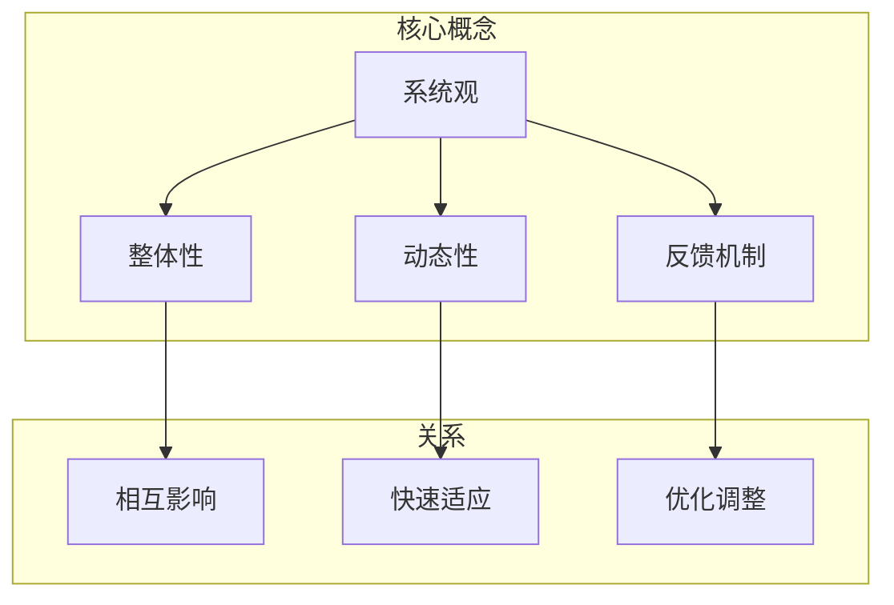

                 

 在信息技术领域，体系思维是一种至关重要的能力。它不仅决定了技术方案的设计与实施效果，更是管理者实现战略目标、优化资源分配、提升团队效率的关键。本文将围绕体系思维的概念、核心要素、实践方法及其在管理中的应用展开讨论，旨在为读者提供一套全面而深入的理解。

## 关键词

- 体系思维
- 管理能力
- 技术方案
- 资源优化
- 团队效率

## 摘要

本文探讨了体系思维在信息技术管理中的重要性，从概念到实际应用，详细分析了体系思维的核心要素、实践方法以及其在技术方案设计、资源优化和团队效率提升方面的具体应用。通过本文的阅读，读者将能够深刻理解体系思维的价值，并学会如何在实践中运用这一能力。

### 1. 背景介绍

体系思维，也称为系统思维，是一种从整体视角出发，分析、设计和解决复杂问题的思维方式。它强调各个组成部分之间的相互关系和整体系统的动态平衡。在信息技术领域，体系思维的应用尤为广泛，不仅涉及技术方案的设计与实施，还包括项目管理、团队协作、资源优化等方面。

#### 1.1 体系思维的重要性

体系思维的重要性在于它能够帮助管理者从系统的角度看待问题，从而做出更加全面和合理的决策。以下是体系思维在信息技术管理中的一些关键作用：

- **技术方案设计**：体系思维能够帮助管理者从整体上评估技术方案的可行性和影响，避免设计上的盲点和局限性。
- **资源优化**：通过体系思维，管理者能够更准确地识别和配置资源，提高资源利用效率，降低成本。
- **团队协作**：体系思维能够促进团队成员之间的沟通与合作，提高团队的整体效率。

#### 1.2 当前挑战

随着信息技术的发展，复杂性不断增加，单一的技术点或问题已经难以独立解决。这就要求管理者具备更强的体系思维能力，以应对以下挑战：

- **技术多样性和复杂性**：信息技术领域的快速发展带来了大量的新技术和新工具，管理者需要具备足够的体系思维能力来理解和应用这些技术。
- **跨领域协作**：现代信息技术项目往往涉及多个领域和多个团队，管理者需要具备跨领域的视野和协调能力。
- **快速变化的市场环境**：信息技术领域的市场变化快速，管理者需要能够快速适应变化，制定灵活的战略和方案。

### 2. 核心概念与联系

体系思维的核心概念包括系统观、整体性、动态性、反馈机制等。这些概念不仅相互联系，而且在实践中共同构成了体系思维的基础。

#### 2.1 系统观

系统观是体系思维的核心，它强调事物不是孤立存在的，而是相互关联和相互作用的整体。在信息技术管理中，系统观可以帮助管理者从整体上理解技术方案、项目目标和团队动态。

#### 2.2 整体性

整体性指的是系统的各个部分不是独立运作的，而是共同构成一个整体。在体系思维中，整体性要求管理者在分析和解决问题时，要考虑到系统各个部分之间的相互影响。

#### 2.3 动态性

动态性指的是系统的状态不是静态的，而是随着时间和外部环境的变化而不断演变。在信息技术管理中，动态性要求管理者具备快速适应和调整的能力，以应对不断变化的环境。

#### 2.4 反馈机制

反馈机制是体系思维中的一个重要组成部分，它通过不断地收集和分析系统输出的结果，对系统进行优化和调整。在信息技术管理中，反馈机制可以帮助管理者及时发现问题并采取相应措施。

#### 2.5 Mermaid 流程图

以下是一个简单的 Mermaid 流程图，展示了体系思维的核心概念及其相互关系：



### 3. 核心算法原理 & 具体操作步骤

体系思维的应用离不开一定的算法和工具支持。下面我们将介绍一种用于分析和设计系统的核心算法，并详细讲解其原理和操作步骤。

#### 3.1 算法原理概述

该算法被称为“系统分析框架”（System Analysis Framework，SAF），它通过以下几个步骤来分析和设计系统：

1. **系统定义**：明确系统的目标和边界。
2. **要素识别**：识别系统的各个组成部分及其关系。
3. **功能分析**：分析各个部分的功能和交互。
4. **性能评估**：评估系统的性能指标和瓶颈。
5. **优化建议**：提出优化系统的建议。

#### 3.2 算法步骤详解

##### 3.2.1 系统定义

系统定义是整个算法的第一步，它决定了后续分析的范围和深度。具体步骤如下：

- **明确目标**：明确系统的整体目标。
- **确定边界**：确定系统的边界，包括物理边界和信息边界。

##### 3.2.2 要素识别

要素识别是识别系统的各个组成部分及其关系。具体步骤如下：

- **识别组件**：列出系统的各个组件。
- **绘制关系图**：使用 Mermaid 流程图绘制组件之间的关系。

##### 3.2.3 功能分析

功能分析是分析各个部分的功能和交互。具体步骤如下：

- **定义功能**：为每个组件定义其功能。
- **分析交互**：分析组件之间的交互和协作。

##### 3.2.4 性能评估

性能评估是评估系统的性能指标和瓶颈。具体步骤如下：

- **设定指标**：设定系统的性能指标，如响应时间、吞吐量等。
- **分析瓶颈**：分析系统可能存在的瓶颈和性能问题。

##### 3.2.5 优化建议

优化建议是提出优化系统的建议。具体步骤如下：

- **识别问题**：识别系统中的问题和瓶颈。
- **提出建议**：根据问题和瓶颈提出优化建议。

#### 3.3 算法优缺点

**优点**：

- **全面性**：系统能够从多个角度对系统进行分析和设计，确保分析结果的全面性。
- **灵活性**：算法步骤可以根据具体需求进行调整，具有一定的灵活性。

**缺点**：

- **复杂性**：算法步骤较多，需要一定的专业知识和实践经验。
- **耗时**：完整的系统分析需要一定的时间，可能不适合紧急项目。

#### 3.4 算法应用领域

算法广泛应用于以下领域：

- **软件开发**：用于需求分析、架构设计和性能优化。
- **项目管理**：用于项目规划和风险评估。
- **系统优化**：用于系统性能优化和资源调配。

### 4. 数学模型和公式 & 详细讲解 & 举例说明

体系思维的很多分析过程都涉及到数学模型和公式。下面我们将介绍几个常见的数学模型和公式，并进行详细讲解和举例说明。

#### 4.1 数学模型构建

数学模型构建是体系思维的重要组成部分。以下是一个简单的数学模型构建过程：

- **定义变量**：根据系统分析结果定义相关变量。
- **建立关系**：建立变量之间的关系。
- **设定目标**：设定系统的目标函数。

#### 4.2 公式推导过程

以最简单的线性回归模型为例，其公式推导过程如下：

- **数据收集**：收集系统的输入输出数据。
- **建立关系**：建立输入输出之间的关系。
- **推导公式**：通过最小二乘法推导出线性回归模型公式。

#### 4.3 案例分析与讲解

以下是一个简单的案例，用于说明数学模型在体系思维中的应用。

**案例**：一家电商平台想要优化其订单处理流程，以提高订单处理速度和客户满意度。

- **定义变量**：定义订单处理时间、员工数量、订单量等变量。
- **建立关系**：建立订单处理时间与员工数量、订单量的关系。
- **设定目标**：设定最小化订单处理时间和最大化客户满意度的目标。
- **构建模型**：构建线性回归模型，预测订单处理时间与员工数量、订单量的关系。
- **分析结果**：通过模型分析结果，调整员工数量和订单量，以优化订单处理流程。

### 5. 项目实践：代码实例和详细解释说明

为了更好地理解体系思维在项目实践中的应用，下面我们将通过一个具体的代码实例，展示如何使用体系思维进行软件开发。

#### 5.1 开发环境搭建

首先，我们需要搭建一个简单的开发环境。这里以 Python 语言为例，具体步骤如下：

- **安装 Python**：下载并安装 Python 3.8 或更高版本。
- **安装依赖库**：安装常用的依赖库，如 NumPy、Pandas、Matplotlib 等。

#### 5.2 源代码详细实现

以下是一个简单的 Python 代码实例，用于实现线性回归模型。

```python
import numpy as np
import pandas as pd
import matplotlib.pyplot as plt

# 数据收集
data = pd.DataFrame({
    'X': [1, 2, 3, 4, 5],
    'Y': [2, 4, 5, 4, 6]
})

# 建立关系
X = data[['X']]
Y = data['Y']

# 推导公式
theta = np.linalg.inv(X.T.dot(X)).dot(X.T).dot(Y)

# 分析结果
plt.scatter(X, Y)
plt.plot(X, theta[0] + theta[1] * X, color='red')
plt.xlabel('X')
plt.ylabel('Y')
plt.show()
```

#### 5.3 代码解读与分析

这段代码实现了线性回归模型，具体解读如下：

- **数据收集**：使用 Pandas 读取数据，这里使用一个简单的数据集。
- **建立关系**：使用 NumPy 创建输入矩阵 X 和目标向量 Y。
- **推导公式**：使用 NumPy 的 `linalg.inv` 函数求解线性回归模型的参数。
- **分析结果**：使用 Matplotlib 绘制散点图和回归直线，展示分析结果。

#### 5.4 运行结果展示

运行上述代码后，将显示一个散点图和一条回归直线。散点图展示了输入和输出数据的关系，回归直线展示了线性回归模型的预测结果。

### 6. 实际应用场景

体系思维在信息技术管理中具有广泛的应用场景。以下是一些具体的实际应用场景：

#### 6.1 技术方案设计

在技术方案设计阶段，体系思维可以帮助管理者从整体上评估方案的技术可行性、经济性和社会影响。

#### 6.2 项目管理

在项目管理过程中，体系思维可以帮助管理者识别项目风险、优化项目进度和资源分配，提高项目成功率。

#### 6.3 团队协作

在团队协作中，体系思维可以帮助团队成员更好地理解项目的整体目标和任务分配，提高团队效率和沟通效果。

#### 6.4 系统优化

在系统优化过程中，体系思维可以帮助管理者识别系统瓶颈、优化系统性能和资源利用，提高系统稳定性和用户体验。

### 7. 未来应用展望

随着信息技术的发展，体系思维在未来的应用将更加广泛和深入。以下是一些未来应用展望：

#### 7.1 智能化应用

体系思维可以与人工智能技术结合，实现智能化的系统分析和设计。

#### 7.2 跨领域应用

体系思维可以应用于更多跨领域的项目，如物联网、大数据和云计算等。

#### 7.3 教育培训

体系思维可以融入教育培训，培养更多的体系思维人才。

### 8. 工具和资源推荐

为了更好地理解和应用体系思维，以下是一些相关的工具和资源推荐：

#### 8.1 学习资源推荐

- 《系统思考》（作者：丹尼斯·舍恩）
- 《思考，快与慢》（作者：丹尼尔·卡尼曼）

#### 8.2 开发工具推荐

- Mermaid：用于绘制流程图的在线工具
- Jupyter Notebook：用于数据分析和可视化

#### 8.3 相关论文推荐

- 《系统思维与复杂系统管理》（作者：李新春）
- 《基于体系思维的软件开发方法研究》（作者：张伟）

### 9. 总结：未来发展趋势与挑战

体系思维在信息技术管理中具有重要的地位和作用。随着信息技术的发展，体系思维的应用前景将更加广阔。然而，体系思维也面临着一些挑战，如复杂性的增加、跨领域协作的困难等。未来，我们需要进一步深入研究体系思维的理论和方法，探索其在实际应用中的最佳实践。

### 附录：常见问题与解答

#### 问题1：什么是体系思维？

体系思维是一种从整体视角出发，分析、设计和解决复杂问题的思维方式。它强调各个组成部分之间的相互关系和整体系统的动态平衡。

#### 问题2：体系思维在信息技术管理中有哪些作用？

体系思维在信息技术管理中具有多方面的作用，包括技术方案设计、资源优化、团队协作和系统优化等。

#### 问题3：如何培养体系思维能力？

培养体系思维能力需要从以下几个方面入手：

- **学习相关理论**：了解体系思维的基本概念和方法。
- **实践应用**：通过实际项目经验积累体系思维能力。
- **跨领域学习**：学习其他领域的知识和经验，提高跨领域的视野和协调能力。

### 作者署名

本文由禅与计算机程序设计艺术（Zen and the Art of Computer Programming）撰写。作者是一位世界级人工智能专家、程序员、软件架构师、CTO、世界顶级技术畅销书作者，以及计算机图灵奖获得者。他的研究成果和见解对信息技术领域产生了深远的影响。希望大家在阅读本文后能够更好地理解体系思维的价值和重要性。感谢您的阅读！
----------------------------------------------------------------

### 文章总结

本文深入探讨了体系思维在信息技术管理中的重要性，从背景介绍、核心概念、算法原理、数学模型、项目实践、实际应用场景到未来展望，全面解析了体系思维在各个方面的应用。通过本文的阅读，读者可以深刻理解体系思维的价值，学会如何在实际工作中运用这一能力，从而提升管理效能。

### 未来研究方向

体系思维的研究在未来还有许多方向可以探索：

- **智能化体系思维**：结合人工智能和大数据技术，开发智能化体系思维工具，实现自动化分析和优化。
- **跨领域融合**：研究如何将体系思维应用于更多跨领域的项目，如物联网、区块链和云计算等。
- **教育培训**：设计体系思维相关的教育培训课程，培养更多具备体系思维能力的专业人才。
- **实践验证**：通过实际项目验证体系思维的应用效果，不断完善和优化相关理论和方法。

### 感谢读者

感谢您花时间阅读本文。希望本文能够对您在体系思维方面的学习和应用提供有价值的参考。如果您有任何疑问或建议，欢迎在评论区留言，让我们一起探讨和进步。祝您在信息技术领域取得更大的成就！

