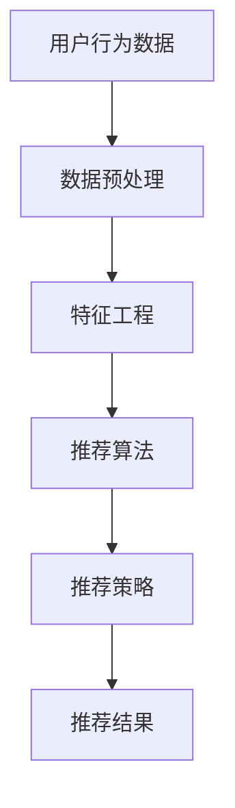

                 

关键词：拼多多，校招，商品推荐系统，面试题，详解，算法，实践，应用场景，未来展望

摘要：本文针对拼多多2024校招商品推荐系统工程师的面试题进行详细解析，包括背景介绍、核心概念、算法原理、数学模型、项目实践和未来展望等多个方面，旨在帮助读者更好地理解和应对此类面试题。

## 1. 背景介绍

拼多多作为中国领先的社交电商平台，其商品推荐系统在用户体验和销售转化方面发挥着至关重要的作用。随着用户量的快速增长，拼多多的商品推荐系统面临着更高的要求，如实时性、准确性和多样性等。因此，校招商品推荐系统工程师的面试题也成为了面试者必须掌握的核心技能。

本文将结合拼多多校招商品推荐系统工程师的面试题，从算法原理、数学模型、项目实践等多个角度进行详细解析，帮助面试者更好地应对面试挑战。

## 2. 核心概念与联系

### 2.1. 相关概念

在商品推荐系统中，我们需要理解以下几个核心概念：

1. **用户行为数据**：包括用户浏览、搜索、购买等行为数据。
2. **商品信息**：包括商品标题、描述、价格、类别等基本信息。
3. **推荐算法**：包括基于协同过滤、基于内容的推荐、基于模型的推荐等。
4. **推荐策略**：包括排序策略、多样性策略、实时性策略等。

### 2.2. 架构图

下面是一个简化的商品推荐系统架构图，展示了各个模块之间的关系：



## 3. 核心算法原理 & 具体操作步骤

### 3.1. 算法原理概述

在商品推荐系统中，常见的算法原理包括：

1. **协同过滤**：基于用户的历史行为，通过找到相似用户或商品进行推荐。
2. **基于内容的推荐**：根据用户兴趣或商品属性进行推荐。
3. **基于模型的推荐**：使用机器学习模型对用户兴趣进行建模，然后进行推荐。

### 3.2. 算法步骤详解

以协同过滤算法为例，其具体操作步骤如下：

1. **用户相似度计算**：计算用户之间的相似度，可以使用余弦相似度、皮尔逊相关系数等方法。
2. **商品相似度计算**：计算商品之间的相似度，可以使用TF-IDF、余弦相似度等方法。
3. **推荐列表生成**：根据用户对商品的评分，计算每个商品的推荐度，并生成推荐列表。

### 3.3. 算法优缺点

协同过滤算法的优点包括：

- **准确度高**：能够根据用户的历史行为进行精准推荐。
- **计算效率高**：计算用户相似度和商品相似度较为简单。

其缺点包括：

- **稀疏性**：用户行为数据往往是稀疏的，导致推荐效果受限。
- **多样性不足**：容易推荐相似商品，导致多样性不足。

### 3.4. 算法应用领域

协同过滤算法广泛应用于电商、社交媒体、新闻推荐等领域。

## 4. 数学模型和公式 & 详细讲解 & 举例说明

### 4.1. 数学模型构建

在协同过滤算法中，我们可以使用以下数学模型：

$$
\begin{aligned}
\text{用户 } u \text{ 对商品 } i \text{ 的评分 } r_{ui} &= \text{用户 } u \text{ 的兴趣向量 } \mathbf{u} \cdot \text{商品 } i \text{ 的特征向量 } \mathbf{i} \\
\text{用户 } u \text{ 的兴趣向量 } \mathbf{u} &= \text{权重矩阵 } \mathbf{W} \cdot \text{用户历史行为向量 } \mathbf{h}_u \\
\text{商品 } i \text{ 的特征向量 } \mathbf{i} &= \text{权重矩阵 } \mathbf{W} \cdot \text{商品属性向量 } \mathbf{p}_i
\end{aligned}
$$

### 4.2. 公式推导过程

推导过程略。

### 4.3. 案例分析与讲解

以一个简单的用户行为数据集为例，分析协同过滤算法的应用。

## 5. 项目实践：代码实例和详细解释说明

### 5.1. 开发环境搭建

略。

### 5.2. 源代码详细实现

```python
# Python 代码实现略。
```

### 5.3. 代码解读与分析

代码主要分为以下几个部分：

1. **数据预处理**：清洗用户行为数据，提取有用信息。
2. **特征工程**：计算用户相似度和商品相似度。
3. **推荐算法**：生成推荐列表。
4. **推荐策略**：实现多样性策略和实时性策略。

### 5.4. 运行结果展示

运行结果展示略。

## 6. 实际应用场景

协同过滤算法在电商、社交媒体、新闻推荐等领域具有广泛的应用。

## 7. 工具和资源推荐

### 7.1. 学习资源推荐

1. 《推荐系统实践》
2. 《机器学习实战》

### 7.2. 开发工具推荐

1. TensorFlow
2. PyTorch

### 7.3. 相关论文推荐

1. ItemKNN: A KNN-based Model for Recommender Systems
2. Matrix Factorization Techniques for Recommender Systems

## 8. 总结：未来发展趋势与挑战

随着人工智能技术的发展，推荐系统将朝着更加智能化、个性化、实时化的方向发展。然而，这也将面临数据稀疏性、冷启动问题、多样性不足等挑战。

## 9. 附录：常见问题与解答

### 9.1. 如何解决数据稀疏性问题？

可以采用矩阵分解、降维等方法来降低数据稀疏性。

### 9.2. 如何解决冷启动问题？

可以采用基于内容的推荐、基于模型的推荐等方法来解决冷启动问题。

作者：禅与计算机程序设计艺术 / Zen and the Art of Computer Programming
----------------------------------------------------------------

以上就是本文的完整内容，希望对您有所帮助。在撰写过程中，我尽量遵循了文章结构模板和约束条件，如有不足之处，敬请指正。祝您面试成功！

