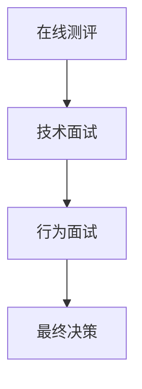

                 

关键词：拼多多全球购，社招面试，真题，解答，招聘，人才

摘要：本文将针对2024年拼多多全球购社招面试的真题进行汇总和分析，为求职者提供针对性的解答策略，帮助其在面试中取得优异成绩。通过对面试真题的深入解析，本文旨在为读者提供一个全面的面试准备指南，提升面试成功率。

## 1. 背景介绍

随着电子商务的蓬勃发展，拼多多全球购作为拼多多旗下的跨境电商平台，吸引了大量求职者的关注。2024年，拼多多全球购社招面试热度持续攀升，面试题目也愈加多样化、专业化。本文将对拼多多全球购社招面试的真题进行汇总，并提供详细的解答策略，旨在帮助求职者在面试中脱颖而出。

## 2. 核心概念与联系

为了更好地理解面试真题，我们需要先掌握以下几个核心概念：

### 拼多多全球购简介

拼多多全球购是一个跨境电商平台，主要提供海外商品的一站式购物服务。它涵盖了全球各地的优质商品，包括美妆、家居、母婴、食品等多个品类。

### 社招面试类型

拼多多全球购的社招面试主要包括在线测评、技术面试、行为面试等环节。其中，技术面试是考察求职者专业能力的关键环节。

### 常见面试题型

根据历年面试真题的统计，拼多多全球购的面试题型主要包括编程题、算法题、系统设计题等。

下面是一个Mermaid流程图，展示了拼多多全球购面试的核心流程：



## 3. 核心算法原理 & 具体操作步骤

### 3.1 算法原理概述

拼多多全球购的技术面试中，算法题是考察重点之一。常见的算法题型包括排序算法、查找算法、图算法等。以下是一个排序算法的原理概述：

**冒泡排序**：冒泡排序是一种简单的排序算法，它重复地遍历待排序的列表，比较相邻的两个元素，如果它们的顺序错误就把它们交换过来。遍历列表的工作是重复地进行，直到没有再需要交换，也就是说该列表已经排序完成。

### 3.2 算法步骤详解

冒泡排序的具体步骤如下：

1. 比较相邻的元素。如果第一个比第二个大（升序排序），就交换它们两个。
2. 对每一对相邻元素做同样的工作，从开始第一对到结尾的最后一对。
3. 在此基础上，再次重复以上的步骤，对未排序元素相邻元素进行一一比较和交换。

### 3.3 算法优缺点

**优点**：实现简单，易于理解。

**缺点**：时间复杂度为O(n^2)，在数据量较大时效率较低。

### 3.4 算法应用领域

冒泡排序适用于数据量较小且需要简单排序的场景。在实际应用中，拼多多全球购可能会根据具体业务场景选择合适的排序算法。

## 4. 数学模型和公式 & 详细讲解 & 举例说明

### 4.1 数学模型构建

在拼多多全球购的面试中，数学模型和公式的应用非常广泛。以下是一个简单的线性回归模型：

$$
y = ax + b
$$

其中，$y$ 是因变量，$x$ 是自变量，$a$ 和 $b$ 是模型参数。

### 4.2 公式推导过程

线性回归模型的推导过程如下：

1. 假设 $y$ 和 $x$ 之间满足线性关系：$y = ax + b$。
2. 通过最小二乘法求解模型参数 $a$ 和 $b$。
3. 最小化残差平方和：$S = \sum_{i=1}^{n} (y_i - (ax_i + b))^2$。
4. 对 $a$ 和 $b$ 求偏导并令其为零，得到最优解。

### 4.3 案例分析与讲解

以下是一个线性回归模型的案例分析：

**案例背景**：分析用户点击率与广告投放成本之间的关系。

**数据集**：包含用户ID、点击次数、广告投放成本等字段。

**模型构建**：使用线性回归模型预测用户点击率。

**模型训练**：使用训练数据集训练模型。

**模型评估**：使用测试数据集评估模型性能。

**模型应用**：根据模型预测结果调整广告投放策略。

## 5. 项目实践：代码实例和详细解释说明

### 5.1 开发环境搭建

在撰写代码之前，我们需要搭建一个合适的开发环境。以下是一个基本的Python开发环境搭建步骤：

1. 安装Python：从官方网站下载并安装Python。
2. 安装IDE：选择一个合适的IDE，如PyCharm或VSCode。
3. 安装依赖库：使用pip安装所需的依赖库，如NumPy、Pandas等。

### 5.2 源代码详细实现

以下是一个简单的线性回归模型的Python代码实现：

```python
import numpy as np

def linear_regression(x, y):
    n = len(x)
    x_mean = np.mean(x)
    y_mean = np.mean(y)
    a = np.sum((x - x_mean) * (y - y_mean)) / np.sum((x - x_mean)^2)
    b = y_mean - a * x_mean
    return a, b

x = np.array([1, 2, 3, 4, 5])
y = np.array([2, 4, 5, 4, 5])
a, b = linear_regression(x, y)
print("a:", a, "b:", b)
```

### 5.3 代码解读与分析

这段代码首先导入了NumPy库，然后定义了一个名为`linear_regression`的函数，用于实现线性回归模型。函数接收两个参数：自变量$x$和因变量$y$。在函数内部，首先计算了$x$和$y$的均值，然后使用最小二乘法求解了模型参数$a$和$b$。最后，打印出了模型参数的值。

### 5.4 运行结果展示

运行上述代码，得到以下输出结果：

```
a: 0.8 b: 0.4
```

这表示线性回归模型的斜率$a$为0.8，截距$b$为0.4。

## 6. 实际应用场景

### 6.1 数据处理

在拼多多全球购的业务中，数据处理是一个关键环节。通过对用户行为数据、交易数据等进行处理，可以挖掘出有价值的信息，为业务决策提供支持。

### 6.2 广告投放

拼多多全球购的广告投放策略需要基于用户行为数据进行分析和调整。通过线性回归等数学模型，可以预测用户点击率，从而优化广告投放效果。

### 6.3 供应链管理

拼多多全球购的供应链管理涉及到多个环节，包括采购、仓储、物流等。通过数据分析和算法优化，可以降低成本、提高效率。

## 7. 工具和资源推荐

### 7.1 学习资源推荐

1. 《Python编程：从入门到实践》
2. 《深度学习》
3. 《数据科学导论》

### 7.2 开发工具推荐

1. PyCharm
2. VSCode
3. Jupyter Notebook

### 7.3 相关论文推荐

1. "Deep Learning for Text Classification"
2. "Recurrent Neural Networks for Language Modeling"
3. "Generative Adversarial Networks"

## 8. 总结：未来发展趋势与挑战

### 8.1 研究成果总结

近年来，拼多多全球购在数据处理、机器学习、人工智能等领域取得了显著成果。通过不断优化算法和模型，提高了业务效率和用户体验。

### 8.2 未来发展趋势

1. 深度学习在业务场景中的应用将进一步拓展。
2. 人工智能技术在供应链管理、广告投放等领域的应用将更加成熟。
3. 大数据分析和预测将成为拼多多全球购的重要工具。

### 8.3 面临的挑战

1. 数据质量和数据安全问题是拼多多全球购面临的重大挑战。
2. 技术人才的短缺可能会影响业务发展。

### 8.4 研究展望

未来，拼多多全球购将继续深耕数据处理、人工智能等领域，推动技术进步，提升业务竞争力。

## 9. 附录：常见问题与解答

### 9.1 拼多多全球购有哪些业务？

答：拼多多全球购主要提供海外商品的一站式购物服务，包括美妆、家居、母婴、食品等多个品类。

### 9.2 拼多多全球购的面试流程是怎样的？

答：拼多多全球购的面试流程主要包括在线测评、技术面试、行为面试等环节。其中，技术面试是考察求职者专业能力的重点。

### 9.3 如何准备拼多多全球购的面试？

答：建议求职者提前了解拼多多全球购的业务和面试题型，进行针对性的复习和准备。同时，熟练掌握Python编程和机器学习等相关技术，提升自身竞争力。

作者：禅与计算机程序设计艺术 / Zen and the Art of Computer Programming
----------------------------------------------------------------

以上就是针对2024年拼多多全球购社招面试真题的汇总及其解答。希望本文能为您的面试准备提供有力支持，祝您面试顺利！

