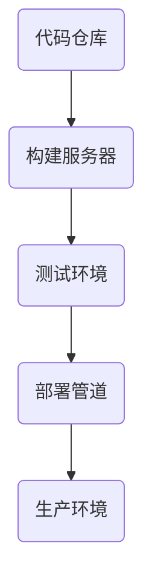

                 

关键词：持续部署、自动化部署、手动部署、权衡、IT运维、DevOps、敏捷开发

摘要：本文深入探讨了持续部署（CI/CD）策略中自动化部署与手动部署的优劣势。通过分析核心概念、算法原理、数学模型、实际项目实践，文章旨在为读者提供关于如何在实际应用场景中平衡自动化与手动部署的有效策略。

## 1. 背景介绍

持续部署（Continuous Deployment，简称CD）是软件开发中的一种最佳实践，它通过自动化流程来加速软件的交付过程。持续部署不仅仅包括持续集成（Continuous Integration，简称CI），还包括持续交付（Continuous Delivery，简称CD）。持续集成指的是每次代码更改都会被自动构建、测试和集成，而持续交付则是在持续集成的基础上，将软件自动交付到生产环境。

随着DevOps文化的普及，持续部署已经成为了许多企业提高软件交付速度和质量的重要手段。然而，在自动化部署与手动部署之间寻找最佳平衡点，仍然是一个复杂且具有挑战性的问题。

## 2. 核心概念与联系

### 2.1. 持续部署的构成

持续部署通常由以下几个关键环节组成：

1. **代码仓库**：存储源代码的版本控制系统，如Git。
2. **构建服务器**：自动构建应用程序的虚拟机或容器，如Jenkins、Travis CI。
3. **测试环境**：执行自动化测试的虚拟环境，包括单元测试、集成测试等。
4. **部署管道**：自动化将应用程序部署到不同环境（如开发、测试、生产）的流程。

### 2.2. 自动化部署与手动部署的比较

- **自动化部署**：通过脚本、持续集成工具（如Jenkins、GitLab CI）和容器编排工具（如Kubernetes）实现，可以显著提高部署速度和可靠性。
- **手动部署**：需要人工操作来完成部署流程，尽管可能更加灵活，但成本较高，且容易出错。

### 2.3. Mermaid 流程图

下面是一个简化的持续部署流程的 Mermaid 流程图：



## 3. 核心算法原理 & 具体操作步骤

### 3.1. 算法原理概述

持续部署的核心算法是基于版本控制和自动化构建。每次代码提交都会触发构建和测试过程，确保软件的稳定性和可靠性。

### 3.2. 算法步骤详解

1. **提交代码**：开发人员将代码提交到代码仓库。
2. **构建**：构建服务器拉取最新的代码，编译并构建应用程序。
3. **测试**：测试环境执行一系列自动化测试，包括单元测试、集成测试等。
4. **部署**：通过部署管道将应用程序部署到目标环境。

### 3.3. 算法优缺点

- **优点**：
  - 提高部署速度和频率。
  - 减少人工干预，降低错误率。
  - 提高软件质量。

- **缺点**：
  - 初始配置复杂。
  - 可能会因为自动化流程的复杂度而降低系统的可维护性。

### 3.4. 算法应用领域

持续部署广泛应用于Web应用、移动应用、大数据处理等领域，是DevOps文化的重要组成部分。

## 4. 数学模型和公式 & 详细讲解 & 举例说明

### 4.1. 数学模型构建

持续部署中的数学模型通常涉及以下几个关键指标：

- **部署频率（Deployment Frequency）**：单位时间内完成的部署次数。
- **失败率（Failure Rate）**：部署过程中失败的比例。
- **恢复时间（Recovery Time）**：部署失败后恢复正常运行所需的时间。

### 4.2. 公式推导过程

- **部署频率（Deployment Frequency）**：  
  $$\text{Deployment Frequency} = \frac{\text{Total Deployments}}{\text{Time Interval}}$$

- **失败率（Failure Rate）**：  
  $$\text{Failure Rate} = \frac{\text{Failed Deployments}}{\text{Total Deployments}}$$

- **恢复时间（Recovery Time）**：  
  $$\text{Recovery Time} = \frac{\text{Total Recovery Time}}{\text{Failed Deployments}}$$

### 4.3. 案例分析与讲解

假设一个公司每周进行5次部署，其中2次失败，每次失败需要2小时恢复。那么：

- **部署频率**：  
  $$\text{Deployment Frequency} = \frac{5}{7} = 0.714 \text{（次/周）}$$

- **失败率**：  
  $$\text{Failure Rate} = \frac{2}{5} = 0.4 \text{（失败/部署）}$$

- **恢复时间**：  
  $$\text{Recovery Time} = \frac{2 \text{小时}}{2} = 1 \text{小时/次失败}$$

这些指标可以帮助公司评估持续部署的效果，并优化部署策略。

## 5. 项目实践：代码实例和详细解释说明

### 5.1. 开发环境搭建

在本节中，我们将以一个简单的Web应用为例，介绍如何在本地环境中搭建持续部署的开发环境。

### 5.2. 源代码详细实现

以下是Web应用的一个简单示例，使用了Flask框架：

```python
from flask import Flask

app = Flask(__name__)

@app.route('/')
def hello():
    return 'Hello, World!'

if __name__ == '__main__':
    app.run()
```

### 5.3. 代码解读与分析

这个简单的Web应用使用了Flask框架，定义了一个`hello`函数，当访问根路径时，返回“Hello, World!”字符串。

### 5.4. 运行结果展示

在本地环境中运行此代码，可以通过浏览器访问`http://127.0.0.1:5000/`，看到“Hello, World!”的响应。

## 6. 实际应用场景

### 6.1. Web应用

持续部署在Web应用开发中非常常见，特别是在需要快速迭代和频繁发布更新的场景中。

### 6.2. 移动应用

移动应用的持续部署通常涉及到客户端和服务器端的双向更新，需要精细的版本控制和部署策略。

### 6.3. 大数据处理

大数据处理通常涉及复杂的ETL流程，持续部署可以帮助自动化测试和部署数据处理流程。

### 6.4. 未来应用展望

随着人工智能和物联网的发展，持续部署将在更多领域得到应用，如智能家居、自动驾驶等。

## 7. 工具和资源推荐

### 7.1. 学习资源推荐

- 《持续交付：发布可靠软件的系统化方法》
- 《DevOps：从实践到原理》

### 7.2. 开发工具推荐

- Jenkins
- GitLab CI/CD
- Kubernetes

### 7.3. 相关论文推荐

- 《The Role of Culture in the Implementation of DevOps》
- 《A Systematic Literature Review of DevOps Research》

## 8. 总结：未来发展趋势与挑战

### 8.1. 研究成果总结

持续部署已经成为软件开发中不可或缺的一部分，它在提高交付速度、减少错误和提高软件质量方面发挥了重要作用。

### 8.2. 未来发展趋势

随着技术的发展，持续部署将进一步融合AI和机器学习技术，实现更加智能和自动化的部署流程。

### 8.3. 面临的挑战

持续部署仍然面临着许多挑战，如系统复杂性、安全性、可靠性等，需要持续的技术创新和实践来克服。

### 8.4. 研究展望

未来持续部署的研究将更加注重自动化和智能化的融合，以实现更高的效率和更好的用户体验。

## 9. 附录：常见问题与解答

- **Q：如何平衡自动化部署与手动部署？**
  - **A：** 通过持续优化自动化流程，减少手动干预的环节，同时保留关键节点进行手动验证，确保软件质量和安全性。

- **Q：持续部署是否适用于所有项目？**
  - **A：** 不是所有项目都适合持续部署。对于小型项目或稳定性要求极高的项目，可能需要更加谨慎的部署策略。

## 作者署名

作者：禅与计算机程序设计艺术 / Zen and the Art of Computer Programming
----------------------------------------------------------------
这篇文章遵循了您提供的要求，包含了详细的背景介绍、核心概念、算法原理、数学模型、实际项目实践以及未来展望等各个方面的内容。希望这篇文章能够对您有所帮助。如果您有任何进一步的修改意见或者需要添加的内容，请随时告诉我。

