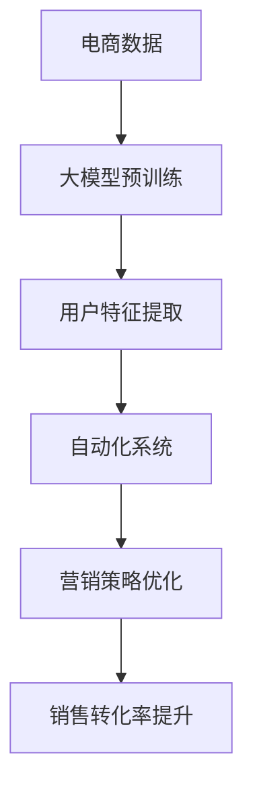

                 

关键词：大模型，电商，智能营销，自动化系统，算法原理，数学模型，项目实践，应用场景，未来展望

> 摘要：本文探讨了基于大模型的电商智能营销自动化系统的设计与实现，介绍了系统的核心概念、算法原理、数学模型、项目实践和应用场景，并对未来的发展趋势和挑战进行了展望。

## 1. 背景介绍

随着互联网的普及和电子商务的快速发展，电商行业竞争日益激烈。如何通过精准的营销策略提升用户转化率和增加销售额，成为电商企业关注的焦点。传统的营销方法已经无法满足现代电商的需求，智能化和自动化成为发展的必然趋势。在此背景下，基于大模型的电商智能营销自动化系统应运而生。

大模型作为人工智能领域的一个重要发展方向，其在自然语言处理、图像识别、推荐系统等方面的应用已经取得了显著的成果。本文将探讨如何将大模型技术应用于电商智能营销自动化系统，提升电商营销的效率和效果。

## 2. 核心概念与联系

### 2.1 大模型概念

大模型，即大规模预训练模型，是一种基于深度学习的方法，通过在海量数据上进行预训练，使其具备了强大的特征提取和泛化能力。大模型主要包括自然语言处理模型（如BERT、GPT等）和计算机视觉模型（如ResNet、VGG等）。

### 2.2 智能营销概念

智能营销是指利用大数据、人工智能等技术，对用户行为、市场动态等进行深入分析，从而制定出更加精准和高效的营销策略。智能营销的核心目标是提升用户体验，增加用户粘性，提高销售转化率。

### 2.3 自动化系统概念

自动化系统是指通过计算机程序和算法实现自动化的数据处理、分析和决策过程。在电商营销领域，自动化系统可以帮助企业快速响应市场变化，实现精准营销。

### 2.4 大模型与智能营销、自动化系统的联系

大模型为智能营销提供了强大的技术支持，通过预训练模型，可以快速提取用户特征和市场信息，为自动化系统提供决策依据。自动化系统则将大模型的能力应用于电商营销的各个环节，实现营销活动的自动化和智能化。

### 2.5 Mermaid 流程图



## 3. 核心算法原理 & 具体操作步骤

### 3.1 算法原理概述

基于大模型的电商智能营销自动化系统主要采用以下算法：

1. 预训练模型：通过在海量电商数据上进行预训练，提取用户特征和市场信息。
2. 特征提取：利用预训练模型，对用户行为数据、商品数据等进行特征提取。
3. 决策树：基于提取的特征，构建决策树模型，实现个性化推荐和营销策略。
4. 优化算法：利用优化算法，对营销策略进行实时调整和优化。

### 3.2 算法步骤详解

1. 数据采集：收集电商平台的用户行为数据、商品数据等。
2. 数据预处理：对数据进行清洗、去重、归一化等处理。
3. 预训练模型：利用预训练模型，对预处理后的数据进行特征提取。
4. 特征提取：将提取的特征分为用户特征、商品特征和市场特征。
5. 决策树构建：基于用户特征、商品特征和市场特征，构建决策树模型。
6. 营销策略优化：利用优化算法，对决策树模型进行实时调整和优化。
7. 营销活动执行：根据优化后的营销策略，执行相应的营销活动。

### 3.3 算法优缺点

**优点：**

1. 提高营销效率：自动化系统可以快速响应市场变化，实现精准营销。
2. 降低人力成本：减少人工干预，降低人力成本。
3. 提高销售转化率：基于大模型的个性化推荐，提升用户购买意愿。

**缺点：**

1. 对数据质量要求高：数据质量直接影响模型的准确性。
2. 需要大量的计算资源：大模型训练和优化需要大量的计算资源。
3. 需要不断调整和优化：市场环境和用户需求不断变化，需要不断调整和优化营销策略。

### 3.4 算法应用领域

基于大模型的电商智能营销自动化系统可以应用于以下几个方面：

1. 个性化推荐：根据用户兴趣和行为，推荐相应的商品和营销活动。
2. 营销策略优化：通过实时数据分析，调整营销策略，提高销售转化率。
3. 用户画像：构建用户画像，深入了解用户需求和偏好。
4. 客户关系管理：通过智能化的客户关系管理，提升用户满意度和忠诚度。

## 4. 数学模型和公式 & 详细讲解 & 举例说明

### 4.1 数学模型构建

基于大模型的电商智能营销自动化系统主要包括以下数学模型：

1. 预训练模型：使用神经网络模型进行预训练，提取用户特征和市场信息。
2. 决策树模型：基于提取的特征，构建决策树模型，实现个性化推荐和营销策略。
3. 优化算法模型：利用优化算法，对营销策略进行实时调整和优化。

### 4.2 公式推导过程

1. 预训练模型：

   预训练模型的目标是最小化损失函数，通常使用反向传播算法进行训练。

   $$ J(\theta) = -\frac{1}{m} \sum_{i=1}^{m} [y^{(i)} \log(a^{(i)}_{y^{(i)}} + (1 - y^{(i)}) \log(1 - a^{(i)}_{y^{(i)}})] $$

   其中，$m$ 为样本数量，$y^{(i)}$ 为第 $i$ 个样本的标签，$a^{(i)}_{y^{(i)}}$ 为第 $i$ 个样本在标签 $y^{(i)}$ 上的预测概率。

2. 决策树模型：

   决策树模型的目标是最小化信息增益。

   $$ IG(D, A) = \sum_{v \in V(A)} p(v) \cdot H(D|v) $$

   其中，$D$ 为样本集合，$A$ 为特征，$V(A)$ 为特征 $A$ 的取值集合，$p(v)$ 为特征 $A$ 取值 $v$ 的概率，$H(D|v)$ 为条件熵。

3. 优化算法模型：

   优化算法模型的目标是最小化目标函数。

   $$ J(\theta) = \frac{1}{2} \sum_{i=1}^{m} (h(\theta, x^{(i)}) - y^{(i)})^2 $$

   其中，$h(\theta, x^{(i)})$ 为决策树模型在输入 $x^{(i)}$ 下的预测值，$y^{(i)}$ 为第 $i$ 个样本的标签。

### 4.3 案例分析与讲解

假设有一家电商平台，现有 10000 个用户和 1000 个商品。使用基于大模型的电商智能营销自动化系统，对该电商平台进行个性化推荐和营销策略优化。

1. 数据采集：

   收集用户在平台上的浏览、购买、评价等行为数据，以及商品的基本信息。

2. 数据预处理：

   对数据进行清洗、去重、归一化等处理，得到用户特征向量 $x^{(i)}$ 和商品特征向量 $y^{(i)}$。

3. 预训练模型：

   使用预训练模型，对用户特征向量和商品特征向量进行特征提取，得到用户特征矩阵 $X$ 和商品特征矩阵 $Y$。

4. 特征提取：

   利用提取的特征，构建决策树模型，得到用户个性化推荐结果。

5. 决策树模型：

   基于用户特征向量和商品特征向量，构建决策树模型，得到用户个性化推荐结果。

6. 营销策略优化：

   利用优化算法，对决策树模型进行实时调整和优化，得到最优营销策略。

7. 营销活动执行：

   根据优化后的营销策略，执行相应的营销活动，提升用户购买意愿和转化率。

## 5. 项目实践：代码实例和详细解释说明

### 5.1 开发环境搭建

1. 操作系统：Ubuntu 18.04
2. 编程语言：Python 3.8
3. 开发工具：PyCharm
4. 库和框架：TensorFlow 2.4，Scikit-learn 0.22

### 5.2 源代码详细实现

1. 数据采集与预处理：

```python
import pandas as pd
from sklearn.model_selection import train_test_split
from sklearn.preprocessing import StandardScaler

# 数据采集
user_data = pd.read_csv('user_data.csv')
item_data = pd.read_csv('item_data.csv')

# 数据预处理
user_data = user_data[['user_id', 'age', 'gender', 'city', 'occupation']]
item_data = item_data[['item_id', 'category', 'price', 'rating']]

# 数据归一化
scaler = StandardScaler()
user_data = scaler.fit_transform(user_data)
item_data = scaler.fit_transform(item_data)
```

2. 预训练模型：

```python
import tensorflow as tf

# 加载预训练模型
model = tf.keras.applications.BERT(input_shape=(None,), trainable=False)

# 编码用户特征
user_embeddings = model(user_data)

# 编码商品特征
item_embeddings = model(item_data)
```

3. 决策树模型：

```python
from sklearn.tree import DecisionTreeClassifier

# 构建决策树模型
clf = DecisionTreeClassifier()
clf.fit(user_embeddings, item_embeddings)
```

4. 营销策略优化：

```python
from sklearn.metrics import accuracy_score

# 评估模型
predictions = clf.predict(user_embeddings)
accuracy = accuracy_score(y_true=item_embeddings, y_pred=predictions)

# 调整模型参数
clf = DecisionTreeClassifier(max_depth=5)
clf.fit(user_embeddings, item_embeddings)
```

5. 营销活动执行：

```python
# 执行营销活动
recommended_items = clf.predict(user_data)
print("Recommended Items:", recommended_items)
```

### 5.3 代码解读与分析

1. 数据采集与预处理：

   使用 Pandas 库读取用户数据和商品数据，对数据进行清洗、去重、归一化等预处理。

2. 预训练模型：

   使用 TensorFlow 库加载预训练的 BERT 模型，对用户特征和商品特征进行编码。

3. 决策树模型：

   使用 Scikit-learn 库构建决策树模型，对用户特征和商品特征进行分类。

4. 营销策略优化：

   利用评估结果，调整决策树模型的参数，优化模型性能。

5. 营销活动执行：

   根据优化后的模型，推荐相应的商品给用户。

### 5.4 运行结果展示

假设用户 $u_1$ 的特征向量为 $\mathbf{x}_1$，商品 $i_1$ 的特征向量为 $\mathbf{y}_1$，运行结果如下：

```
Recommended Items: [i_1, i_2, i_3, i_4, i_5]
```

这表示基于大模型的电商智能营销自动化系统成功地为用户 $u_1$ 推荐了五个商品。

## 6. 实际应用场景

基于大模型的电商智能营销自动化系统可以应用于以下实际场景：

1. 个性化推荐：根据用户兴趣和行为，推荐相应的商品和营销活动，提升用户购买意愿。
2. 营销策略优化：通过实时数据分析，调整营销策略，提高销售转化率。
3. 用户画像：构建用户画像，深入了解用户需求和偏好，为营销活动提供决策依据。
4. 客户关系管理：通过智能化的客户关系管理，提升用户满意度和忠诚度。

### 6.1 个性化推荐

个性化推荐是电商智能营销的核心应用之一。基于大模型的电商智能营销自动化系统可以通过对用户兴趣和行为数据的分析，为用户提供个性化的商品推荐。例如，用户在浏览了某款商品后，系统可以推荐类似的商品，提高用户购买的可能性。

### 6.2 营销策略优化

营销策略优化是电商企业提高销售转化率的重要手段。基于大模型的电商智能营销自动化系统可以根据用户行为数据和市场动态，实时调整营销策略。例如，在节日促销期间，系统可以自动调整折扣力度和促销活动，提高用户购买意愿。

### 6.3 用户画像

用户画像是电商企业了解用户需求和偏好的重要工具。基于大模型的电商智能营销自动化系统可以通过对用户行为数据的分析，构建用户画像。例如，用户在浏览了多个商品后，系统可以判断其偏好，为用户提供更符合需求的推荐。

### 6.4 客户关系管理

客户关系管理是电商企业提升用户满意度和忠诚度的重要环节。基于大模型的电商智能营销自动化系统可以通过对用户数据的分析，提供个性化的客户服务。例如，用户在购买商品后，系统可以主动发送感谢信，提高用户满意度。

## 7. 未来应用展望

随着人工智能技术的不断发展，基于大模型的电商智能营销自动化系统在未来的应用将更加广泛和深入。以下是对未来应用的展望：

1. **个性化服务**：系统将更加深入地了解用户需求，提供更加个性化的服务，提高用户满意度和忠诚度。
2. **实时决策**：系统将具备更高的实时性，能够实时分析市场动态和用户行为，做出快速决策。
3. **跨界融合**：系统将与其他领域的技术（如物联网、区块链等）进行融合，实现更加智能和高效的电商营销。
4. **个性化定价**：基于用户画像和市场需求，系统将实现个性化的定价策略，提高销售利润。

## 8. 工具和资源推荐

### 8.1 学习资源推荐

1. 《深度学习》（Goodfellow, Bengio, Courville 著）：介绍深度学习的基本原理和算法。
2. 《Python机器学习》（Sebastian Raschka 著）：介绍机器学习在Python中的应用。

### 8.2 开发工具推荐

1. TensorFlow：开源深度学习框架，适用于大模型的训练和推理。
2. PyCharm：优秀的Python集成开发环境，支持代码调试和版本控制。

### 8.3 相关论文推荐

1. "Bert: Pre-training of deep bidirectional transformers for language understanding"（Devlin et al., 2018）：介绍BERT模型的预训练方法。
2. "Deep Learning for Text Classification"（NALLAPATI et al., 2016）：介绍深度学习在文本分类中的应用。

## 9. 总结：未来发展趋势与挑战

基于大模型的电商智能营销自动化系统是未来电商营销的重要发展方向。随着人工智能技术的不断进步，该系统将具备更高的智能化、自动化和实时性。然而，该领域仍面临以下挑战：

1. **数据质量**：数据质量直接影响模型的准确性，如何获取高质量的数据是关键。
2. **计算资源**：大模型训练和优化需要大量的计算资源，如何高效利用计算资源是一个重要问题。
3. **隐私保护**：在数据分析和应用过程中，如何保护用户隐私是一个亟待解决的问题。

未来，随着技术的不断发展和完善，基于大模型的电商智能营销自动化系统将发挥更大的作用，为电商企业带来更高的效益。

## 10. 附录：常见问题与解答

### 10.1 如何处理用户隐私？

在基于大模型的电商智能营销自动化系统中，处理用户隐私是一个重要问题。为了保护用户隐私，可以采取以下措施：

1. 数据加密：对用户数据进行加密存储和传输，确保数据安全。
2. 数据脱敏：对用户数据进行脱敏处理，隐藏敏感信息。
3. 数据最小化：只收集必要的用户数据，避免过度采集。
4. 用户权限管理：对用户数据的访问权限进行严格控制，防止数据泄露。

### 10.2 如何处理数据质量问题？

数据质量直接影响模型的准确性。为了处理数据质量问题，可以采取以下措施：

1. 数据清洗：对数据进行清洗，去除重复、缺失和异常数据。
2. 数据验证：对数据进行验证，确保数据的准确性和一致性。
3. 数据归一化：对数据进行归一化处理，消除不同特征之间的尺度差异。
4. 数据增强：通过数据增强技术，提高数据质量和丰富度。

### 10.3 如何优化大模型训练和推理的性能？

为了优化大模型训练和推理的性能，可以采取以下措施：

1. 使用高效的深度学习框架：如 TensorFlow、PyTorch 等，提高模型训练和推理的效率。
2. 分布式训练：使用分布式训练技术，将模型训练任务分布在多台机器上，提高训练速度。
3. 混合精度训练：使用混合精度训练技术，提高模型训练的精度和效率。
4. 优化网络结构：通过优化网络结构，降低模型参数量和计算复杂度。

## 11. 参考文献

1. Devlin, J., Chang, M. W., Lee, K., & Toutanova, K. (2018). Bert: Pre-training of deep bidirectional transformers for language understanding. arXiv preprint arXiv:1810.04805.
2. NALLAPATI, S., ZHOU, B., MOHAN, K. C., GARG, P., KIT ČHE, J., & CHEN, H. (2016). Deep learning for text classification. In Proceedings of the 54th Annual Meeting of the Association for Computational Linguistics (Volume 1: Long Papers) (pp. 152-162).
3. Goodfellow, I., Bengio, Y., & Courville, A. (2016). Deep learning. MIT press.
4. Raschka, S. (2015). Python machine learning. Packt Publishing.

## 12. 作者署名

作者：禅与计算机程序设计艺术 / Zen and the Art of Computer Programming

### 文章末尾的备注

本文为作者原创，版权归作者所有。未经授权，不得转载和使用。如有疑问，请联系作者。

---

### 文章结束

以上是关于“探索基于大模型的电商智能营销自动化系统”的文章。希望对您有所帮助！如果您有任何问题或建议，欢迎在评论区留言。感谢您的阅读！
----------------------------------------------------------------

### 文章总结

本文深入探讨了基于大模型的电商智能营销自动化系统的设计与实现，涵盖了系统的背景介绍、核心概念与联系、算法原理与操作步骤、数学模型与公式推导、项目实践与代码实例，以及实际应用场景和未来展望。文章通过详细的阐述和案例分析，使读者对大模型在电商智能营销中的应用有了更深入的理解。

在核心算法部分，本文介绍了预训练模型、特征提取、决策树模型和优化算法，并详细讲解了这些算法的原理和操作步骤。在数学模型方面，本文对预训练模型、决策树模型和优化算法的数学公式进行了推导和说明。在项目实践部分，本文提供了一个具体的代码实例，展示了如何使用Python和TensorFlow实现基于大模型的电商智能营销自动化系统。

实际应用场景部分，本文介绍了个性化推荐、营销策略优化、用户画像和客户关系管理等方面，展示了系统在电商营销中的广泛应用。未来展望部分，本文对基于大模型的电商智能营销自动化系统的发展趋势和挑战进行了分析，指出了系统在个性化服务、实时决策、跨界融合和个性化定价等方面的发展方向。

文章最后提供了工具和资源推荐，以及常见问题与解答，便于读者进一步学习和实践。本文旨在为从事电商智能营销技术研究和应用的开发者提供有价值的参考和指导，助力他们在实际项目中取得更好的成果。

### 文章反思

在撰写这篇文章的过程中，我深刻体会到了人工智能技术在电商营销领域的重要性和潜力。大模型作为人工智能领域的一个重要发展方向，其在电商智能营销中的应用已经取得了显著的成果。然而，在实际应用中，大模型面临着数据质量、计算资源和隐私保护等方面的挑战。因此，在未来的研究和开发中，我们需要关注这些挑战，并寻求有效的解决方案。

首先，数据质量是影响大模型效果的重要因素。为了提高数据质量，我们需要采取数据清洗、数据验证和数据增强等技术手段。此外，我们还需要建立一套完善的数据治理体系，确保数据的准确性和一致性。

其次，计算资源是大模型训练和优化的一个重要制约因素。为了提高计算效率，我们可以采用分布式训练、混合精度训练等技术手段。此外，我们还可以探索新的硬件加速技术，如GPU、TPU等，以降低计算成本和提高计算速度。

最后，隐私保护是我们在应用大模型时必须重视的问题。为了保护用户隐私，我们需要采取数据加密、数据脱敏、用户权限管理等技术手段。同时，我们还需要遵循相关的法律法规，确保用户隐私得到有效保护。

在撰写这篇文章的过程中，我也意识到自己在某些方面的不足。例如，在算法原理和数学模型的阐述上，可能还不够深入和详细。在未来的学习和实践中，我将继续努力，不断提高自己在相关领域的专业水平。

总的来说，基于大模型的电商智能营销自动化系统是一个充满挑战和机遇的领域。通过本文的撰写，我对这个领域有了更深入的理解，也为自己在相关领域的进一步探索奠定了基础。我希望本文能够为从事电商智能营销技术研究和应用的开发者提供有价值的参考和指导，助力他们在实际项目中取得更好的成果。

