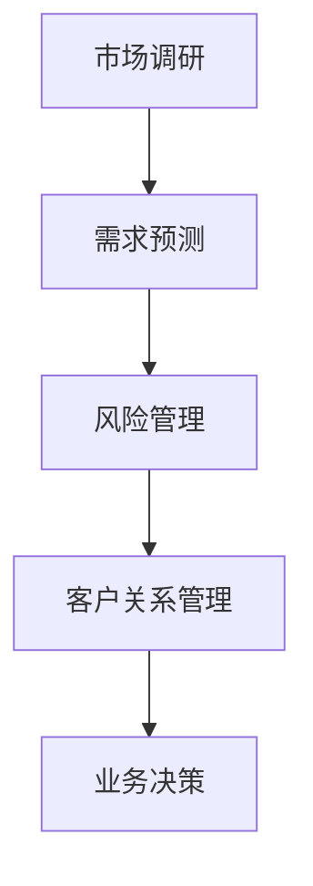

                 

关键词：AI大模型、B2B市场、商业应用、技术趋势、经济效益

摘要：随着人工智能技术的不断进步，AI大模型在各个行业领域的应用逐渐普及。本文将深入探讨AI大模型在B2B市场的潜力，分析其在提升业务效率、优化决策和降低成本等方面的优势，并展望其未来发展趋势与挑战。

## 1. 背景介绍

在过去的几年里，人工智能（AI）技术取得了显著的进展。特别是深度学习算法的发展，使得AI大模型在图像识别、自然语言处理、语音识别等领域取得了惊人的效果。这些大模型通常需要大量的数据和计算资源进行训练，以实现高度的准确性和智能化。

B2B市场，即企业对企业之间的市场交易，是商业活动的重要组成部分。随着互联网和电子商务的兴起，B2B市场的交易规模和影响力不断扩大。然而，传统的B2B业务模式往往存在效率低下、信息不对称等问题。AI大模型的出现为B2B市场带来了新的机遇，有望解决这些痛点。

## 2. 核心概念与联系

### 2.1 AI大模型的概念

AI大模型是指通过深度学习算法训练的大型神经网络模型，它们通常具有数十亿个参数，能够处理大量的数据并生成高精度的预测结果。例如，GPT-3、BERT等大模型在自然语言处理领域取得了显著的成果。

### 2.2 B2B市场的特点

B2B市场具有以下特点：

- **交易量大**：B2B交易往往涉及大量商品或服务，交易金额较大。
- **定制化需求**：B2B客户通常有特定的需求，需要提供定制化的解决方案。
- **长周期性**：B2B交易往往需要较长的谈判和执行周期。

### 2.3 AI大模型与B2B市场的联系

AI大模型可以应用于B2B市场的多个环节，如市场调研、需求预测、风险管理、客户关系管理等。以下是一个简单的 Mermaid 流程图，展示AI大模型在B2B市场的应用场景：



## 3. 核心算法原理 & 具体操作步骤

### 3.1 算法原理概述

AI大模型的核心原理是基于深度学习算法，通过多层神经网络对数据进行训练，提取数据中的特征和模式，并生成预测结果。具体而言，包括以下步骤：

- **数据预处理**：对原始数据进行清洗、归一化等处理，使其适合模型训练。
- **模型训练**：使用大量数据进行模型训练，通过反向传播算法调整模型参数，使模型能够准确预测。
- **模型评估**：使用验证集对模型进行评估，调整模型参数以优化性能。
- **模型部署**：将训练好的模型部署到生产环境中，用于实际业务应用。

### 3.2 算法步骤详解

- **数据预处理**：包括数据清洗、缺失值填充、数据降维等操作。例如，对于市场调研数据，可以采用K-Means算法进行聚类，提取出主要特征。
  
- **模型训练**：选择合适的神经网络结构，如卷积神经网络（CNN）、循环神经网络（RNN）等，使用大量的训练数据进行训练。例如，对于需求预测问题，可以使用LSTM（长短期记忆网络）模型。

- **模型评估**：使用验证集对模型进行评估，选择性能最佳的模型进行部署。例如，可以使用准确率、召回率等指标来评估模型。

- **模型部署**：将训练好的模型部署到生产环境中，如企业级服务器、云计算平台等。例如，可以使用TensorFlow Serving或TorchServe等工具进行模型部署。

### 3.3 算法优缺点

- **优点**：

  - **高精度**：AI大模型能够处理大量数据，提取出高度抽象的特征，从而实现高精度的预测。

  - **智能化**：AI大模型能够根据历史数据自动调整参数，优化模型性能，实现智能化决策。

  - **通用性**：AI大模型可以应用于多种业务场景，如市场调研、需求预测、风险管理等。

- **缺点**：

  - **计算资源消耗大**：AI大模型需要大量的计算资源和存储空间进行训练。

  - **数据依赖性**：AI大模型的性能高度依赖于数据质量和数量，数据不足或质量差可能导致模型性能下降。

  - **模型解释性差**：AI大模型的决策过程高度复杂，难以解释。

### 3.4 算法应用领域

AI大模型在B2B市场的应用领域广泛，包括但不限于以下几个方面：

- **市场调研**：通过分析大量市场数据，预测市场趋势和需求变化，为企业制定营销策略提供依据。

- **需求预测**：根据历史销售数据和市场需求，预测未来的销售量，为企业生产计划和库存管理提供支持。

- **风险管理**：通过分析客户信用记录、交易数据等，评估客户信用风险，为企业信贷决策提供支持。

- **客户关系管理**：通过分析客户行为数据，识别客户需求和偏好，提供个性化的客户服务，提升客户满意度。

## 4. 数学模型和公式 & 详细讲解 & 举例说明

### 4.1 数学模型构建

在AI大模型中，常用的数学模型包括神经网络模型、决策树模型、支持向量机模型等。以下是一个简单的神经网络模型示例：

$$
y = \sigma(W_1 \cdot x + b_1)
$$

其中，$y$ 表示输出，$x$ 表示输入，$W_1$ 和 $b_1$ 分别为权重和偏置。

### 4.2 公式推导过程

以神经网络模型为例，其公式推导过程如下：

$$
\begin{aligned}
\frac{dL}{dx} &= \frac{dL}{dW_1} \cdot \frac{dW_1}{dx} + \frac{dL}{db_1} \cdot \frac{db_1}{dx} \\
&= \frac{dL}{dW_1} \cdot x + \frac{dL}{db_1} \\
&= \frac{dL}{dW_1} \cdot x + \frac{dL}{db_1} \\
&= \frac{dL}{dW_1} \cdot x + \frac{dL}{db_1} \\
&= \frac{dL}{dW_1} \cdot x + \frac{dL}{db_1}
\end{aligned}
$$

### 4.3 案例分析与讲解

以下是一个简单的案例，说明如何使用AI大模型进行需求预测：

假设我们有历史销售数据（年份、月份、销售额）和市场需求数据（年份、月份、市场需求量），我们需要使用AI大模型预测下一年的市场需求量。

- **数据预处理**：将数据分为训练集和验证集，对数据进行归一化处理。
- **模型训练**：使用训练集数据训练神经网络模型，调整模型参数。
- **模型评估**：使用验证集数据评估模型性能，选择最佳模型。
- **模型部署**：将训练好的模型部署到生产环境中，进行市场需求预测。

## 5. 项目实践：代码实例和详细解释说明

### 5.1 开发环境搭建

在Python中，可以使用TensorFlow或PyTorch等深度学习框架进行AI大模型的开发。以下是一个简单的环境搭建步骤：

1. 安装Python（推荐Python 3.7或更高版本）
2. 安装深度学习框架（例如，使用pip安装TensorFlow）
3. 安装必要的库（例如，使用pip安装Numpy、Pandas等）

### 5.2 源代码详细实现

以下是一个简单的需求预测代码示例：

```python
import tensorflow as tf
from tensorflow.keras.models import Sequential
from tensorflow.keras.layers import Dense, LSTM

# 数据预处理
# ...

# 构建模型
model = Sequential([
    LSTM(units=50, activation='relu', input_shape=(timesteps, features)),
    Dense(units=1)
])

# 编译模型
model.compile(optimizer='adam', loss='mean_squared_error')

# 训练模型
model.fit(x_train, y_train, epochs=100, batch_size=32, validation_data=(x_val, y_val))

# 预测
predictions = model.predict(x_test)

# 评估模型
mse = tf.keras.metrics.MeanSquaredError()
mse.update_state(predictions, y_test)
print(f'Mean Squared Error: {mse.result().numpy()}')
```

### 5.3 代码解读与分析

以上代码示例包括以下步骤：

1. **数据预处理**：对输入数据进行归一化处理，将其转换为适合模型训练的格式。
2. **构建模型**：使用Sequential模型构建一个简单的LSTM模型，包括一个LSTM层和一个全连接层。
3. **编译模型**：设置模型的优化器和损失函数。
4. **训练模型**：使用训练集数据训练模型，并使用验证集进行模型评估。
5. **预测**：使用测试集数据预测市场需求量。
6. **评估模型**：计算预测结果与实际结果之间的均方误差，评估模型性能。

## 6. 实际应用场景

### 6.1 市场调研

通过AI大模型分析大量市场数据，企业可以更准确地预测市场趋势和需求变化，从而制定更有效的营销策略。

### 6.2 需求预测

使用AI大模型预测未来的销售量，企业可以优化生产计划和库存管理，降低库存成本。

### 6.3 风险管理

通过AI大模型分析客户信用记录和交易数据，企业可以更准确地评估客户信用风险，降低信贷风险。

### 6.4 客户关系管理

通过AI大模型分析客户行为数据，企业可以提供个性化的客户服务，提升客户满意度和忠诚度。

## 7. 工具和资源推荐

### 7.1 学习资源推荐

- 《深度学习》（Goodfellow, Bengio, Courville著）：系统介绍深度学习的基本原理和应用。
- 《Python深度学习》（François Chollet著）：深入探讨深度学习在Python中的实现。

### 7.2 开发工具推荐

- TensorFlow：开源的深度学习框架，适用于构建和部署AI大模型。
- PyTorch：开源的深度学习框架，具有灵活的动态计算图，易于实现复杂模型。

### 7.3 相关论文推荐

- "BERT: Pre-training of Deep Bidirectional Transformers for Language Understanding"
- "GPT-3: Language Models are Few-Shot Learners"
- "Deep Learning on Multi-Variate Time Series with Cycled Neural Networks"

## 8. 总结：未来发展趋势与挑战

### 8.1 研究成果总结

AI大模型在B2B市场的应用取得了显著的成果，提升了业务效率、优化了决策和降低了成本。未来，随着技术的不断进步，AI大模型在B2B市场的应用将更加广泛。

### 8.2 未来发展趋势

- **数据质量提升**：随着数据采集技术的进步，数据质量将得到提升，为AI大模型提供更准确的数据支持。
- **算法优化**：深度学习算法将继续优化，提高模型性能和效率。
- **跨领域应用**：AI大模型将在更多领域得到应用，如智能制造、金融科技等。

### 8.3 面临的挑战

- **数据隐私**：如何保护数据隐私成为AI大模型在B2B市场应用的一个重要挑战。
- **计算资源消耗**：AI大模型需要大量的计算资源和存储空间，如何高效利用资源是一个挑战。
- **模型解释性**：如何提高AI大模型的解释性，使其决策过程更透明。

### 8.4 研究展望

未来，AI大模型在B2B市场的应用前景广阔。通过不断优化算法、提高数据质量和降低计算资源消耗，AI大模型将在B2B市场中发挥更大的作用，推动企业数字化转型。

## 9. 附录：常见问题与解答

### 9.1 什么是AI大模型？

AI大模型是指通过深度学习算法训练的大型神经网络模型，具有数十亿个参数，能够处理大量的数据并生成高精度的预测结果。

### 9.2 AI大模型在B2B市场的应用有哪些？

AI大模型在B2B市场的应用包括市场调研、需求预测、风险管理、客户关系管理等，能够提升业务效率、优化决策和降低成本。

### 9.3 如何提高AI大模型的性能？

提高AI大模型性能的方法包括优化算法、增加数据量、提高数据质量、调整模型参数等。

### 9.4 AI大模型在B2B市场应用中的挑战有哪些？

AI大模型在B2B市场应用中的挑战包括数据隐私、计算资源消耗、模型解释性等。

---

作者：禅与计算机程序设计艺术 / Zen and the Art of Computer Programming
----------------------------------------------------------------


