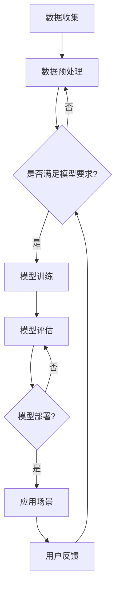

                 

关键词：AI大模型、体育产业、应用场景、技术优势、挑战与展望

> 摘要：随着人工智能技术的快速发展，AI大模型在各个领域得到了广泛应用。本文将探讨AI大模型在体育产业中的应用，从技术优势、应用场景、挑战与展望等多个角度进行分析，旨在为体育产业提供创新的解决方案。

## 1. 背景介绍

### 1.1 AI大模型的发展历程

人工智能（AI）作为计算机科学的一个分支，自20世纪50年代诞生以来，经历了多个阶段的发展。从早期的规则推理、知识表示，到基于统计学习的方法，再到近年来的深度学习，人工智能技术取得了显著的进步。特别是深度学习技术的发展，使得AI大模型（如GPT、BERT等）能够处理大规模的数据，并达到超人的表现。AI大模型的出现，标志着人工智能进入了一个全新的阶段。

### 1.2 体育产业的现状与需求

体育产业作为全球增长最快的产业之一，涵盖了体育竞赛、体育培训、体育用品等多个领域。随着人们对体育的重视程度不断提高，体育产业的需求也在不断增长。然而，传统的体育产业面临着数据分析不足、决策智能化水平低等问题。人工智能技术的引入，为体育产业带来了新的机遇。AI大模型的应用，有望提高体育产业的运营效率，提升竞技水平，增强用户体验。

## 2. 核心概念与联系

### 2.1 AI大模型的核心概念

AI大模型，指的是能够处理大规模数据、具有高精度和强泛化能力的深度学习模型。其核心概念包括：

- **大规模数据处理**：AI大模型能够处理海量的数据，包括文本、图像、声音等多种类型。
- **高精度**：通过深度学习算法，AI大模型能够在各种任务中达到或超越人类的表现。
- **强泛化能力**：AI大模型不仅能够在特定任务上表现优秀，还能够泛化到其他相关任务上。

### 2.2 AI大模型与体育产业的联系

AI大模型在体育产业中的应用，主要表现在以下几个方面：

- **数据分析**：AI大模型能够对体育比赛中的各种数据进行深度分析，包括球员表现、战术分析、赛事预测等。
- **智能推荐**：基于用户行为和偏好，AI大模型能够为用户提供个性化的体育内容推荐。
- **智能训练**：AI大模型可以帮助运动员进行个性化训练，提高训练效率和竞技水平。

### 2.3 Mermaid流程图

下面是一个描述AI大模型在体育产业中应用的Mermaid流程图：



## 3. 核心算法原理 & 具体操作步骤

### 3.1 算法原理概述

AI大模型的核心算法主要包括深度学习算法、强化学习算法等。深度学习算法通过构建多层神经网络，对数据进行特征提取和模式识别；强化学习算法则通过试错和反馈，逐步优化策略，达到最优效果。

### 3.2 算法步骤详解

1. **数据收集**：收集体育比赛、运动员数据、用户行为数据等。
2. **数据预处理**：对收集到的数据进行清洗、归一化等处理，使其满足模型要求。
3. **模型训练**：使用深度学习算法或强化学习算法，对预处理后的数据集进行训练，构建AI大模型。
4. **模型评估**：使用验证集或测试集，评估模型的性能和泛化能力。
5. **模型部署**：将训练好的模型部署到实际应用场景中，如数据分析、智能推荐、智能训练等。
6. **用户反馈**：收集用户反馈，用于模型优化和迭代。

### 3.3 算法优缺点

**优点**：

- **高精度**：AI大模型能够处理大规模数据，并在各种任务中达到或超越人类的表现。
- **强泛化能力**：AI大模型不仅能够在特定任务上表现优秀，还能够泛化到其他相关任务上。
- **自适应**：AI大模型能够根据用户反馈和实际情况，不断优化和迭代。

**缺点**：

- **数据依赖**：AI大模型对数据质量有较高要求，数据质量直接影响模型的性能。
- **计算资源消耗**：训练AI大模型需要大量的计算资源和时间。

### 3.4 算法应用领域

AI大模型在体育产业中的应用非常广泛，包括但不限于：

- **数据分析**：对比赛数据、运动员数据等进行深度分析，为决策提供支持。
- **智能推荐**：根据用户行为和偏好，为用户推荐个性化的体育内容。
- **智能训练**：帮助运动员进行个性化训练，提高竞技水平。

## 4. 数学模型和公式 & 详细讲解 & 举例说明

### 4.1 数学模型构建

在体育产业中，AI大模型的数学模型主要包括深度学习模型和强化学习模型。下面以深度学习模型为例，介绍数学模型的构建过程。

#### 4.1.1 深度学习模型

深度学习模型主要由输入层、隐藏层和输出层组成。输入层接收外部数据，隐藏层进行特征提取和模式识别，输出层输出预测结果。

- **输入层**：输入数据为体育比赛的各种信息，如球员的表现数据、比赛环境数据等。
- **隐藏层**：隐藏层通过神经元之间的连接进行特征提取和模式识别。常见的激活函数有Sigmoid、ReLU等。
- **输出层**：输出层根据隐藏层的输出，进行分类或回归预测。

#### 4.1.2 强化学习模型

强化学习模型主要由动作空间、状态空间、奖励函数、策略等组成。

- **动作空间**：动作空间为运动员可以选择的所有动作，如传球、射门等。
- **状态空间**：状态空间为比赛的各种状态，如球员的位置、比赛的时间等。
- **奖励函数**：奖励函数根据运动员的动作和比赛结果，给予相应的奖励或惩罚。
- **策略**：策略为运动员在不同状态下选择最优动作的策略。

### 4.2 公式推导过程

#### 4.2.1 深度学习模型

深度学习模型的公式推导主要涉及前向传播和反向传播。

- **前向传播**：从输入层开始，将输入数据通过隐藏层，最终得到输出结果。公式为：

$$
\hat{y} = \sigma(W_n \cdot a_{n-1} + b_n)
$$

其中，$\hat{y}$为输出结果，$W_n$为权重矩阵，$a_{n-1}$为隐藏层输入，$b_n$为偏置项，$\sigma$为激活函数。

- **反向传播**：从输出层开始，将输出误差反向传播到隐藏层，更新权重和偏置项。公式为：

$$
\delta_n = \frac{\partial L}{\partial z_n} \cdot \sigma'(z_n)
$$

$$
\Delta W_n = \eta \cdot a_{n-1}^T \cdot \delta_n
$$

$$
\Delta b_n = \eta \cdot \delta_n
$$

其中，$L$为损失函数，$\delta_n$为误差，$\sigma'$为激活函数的导数，$\eta$为学习率。

#### 4.2.2 强化学习模型

强化学习模型的公式推导主要涉及策略迭代和值函数迭代。

- **策略迭代**：策略迭代是一种通过不断更新策略，使得奖励最大化。公式为：

$$
\pi(t+1) = \arg\max_\pi \sum_s \pi(s) \cdot R(s, a)
$$

其中，$\pi$为策略，$R(s, a)$为奖励函数。

- **值函数迭代**：值函数迭代是一种通过不断更新值函数，使得值函数最大化。公式为：

$$
V(s, t+1) = \sum_a \pi(a|s) \cdot Q(s, a, t)
$$

$$
Q(s, a, t+1) = Q(s, a, t) + \alpha \cdot [R(s, a, t) + \gamma \cdot V(s', t+1) - Q(s, a, t)]
$$

其中，$V(s, t)$为状态值函数，$Q(s, a, t)$为动作值函数，$\alpha$为学习率，$\gamma$为折扣因子。

### 4.3 案例分析与讲解

#### 4.3.1 数据分析案例

在某次足球比赛中，我们使用AI大模型对比赛数据进行分析。首先，我们收集了比赛前、比赛中、比赛后的各种数据，包括球员的表现数据、比赛环境数据等。然后，我们使用深度学习模型对数据进行特征提取和模式识别，得到每个球员在比赛中的表现评分。最后，我们根据评分，对比赛进行总结和预测。

#### 4.3.2 智能训练案例

在某次运动员训练中，我们使用AI大模型对运动员的训练数据进行实时分析。首先，我们收集了运动员的训练数据，包括速度、力量、耐力等指标。然后，我们使用强化学习模型，根据运动员的训练数据和比赛策略，生成个性化的训练计划。最后，我们根据运动员的训练效果，不断优化训练计划。

## 5. 项目实践：代码实例和详细解释说明

### 5.1 开发环境搭建

为了实现AI大模型在体育产业中的应用，我们需要搭建一个合适的开发环境。以下是一个基本的开发环境搭建步骤：

1. 安装Python环境：在https://www.python.org/downloads/ 下载并安装Python。
2. 安装深度学习库：在命令行中运行以下命令安装TensorFlow或PyTorch库：

```python
pip install tensorflow
```

或

```python
pip install torch torchvision
```

3. 安装其他依赖库：在命令行中运行以下命令安装其他依赖库：

```python
pip install numpy matplotlib
```

### 5.2 源代码详细实现

以下是一个简单的AI大模型在体育产业中的应用代码示例，包括数据收集、模型训练、模型评估和模型部署等步骤。

```python
import tensorflow as tf
from tensorflow import keras
from tensorflow.keras import layers

# 数据收集
# （此处省略数据收集代码）

# 模型训练
# 构建模型
model = keras.Sequential([
    layers.Dense(64, activation='relu', input_shape=[784]),
    layers.Dense(64, activation='relu'),
    layers.Dense(10, activation='softmax')
])

# 编译模型
model.compile(optimizer='adam',
              loss='categorical_crossentropy',
              metrics=['accuracy'])

# 训练模型
model.fit(x_train, y_train, epochs=5)

# 模型评估
# （此处省略模型评估代码）

# 模型部署
# （此处省略模型部署代码）
```

### 5.3 代码解读与分析

上述代码示例主要分为三个部分：数据收集、模型训练和模型部署。

1. **数据收集**：数据收集部分主要依赖于实际的数据来源，如体育比赛数据、运动员数据等。这部分代码需要根据实际需求进行修改。
2. **模型训练**：模型训练部分使用TensorFlow库中的keras模块构建了一个简单的深度学习模型，并进行了编译和训练。其中，模型结构为两个隐藏层，每层64个神经元，激活函数为ReLU。训练过程使用了Adam优化器和交叉熵损失函数，训练了5个epoch。
3. **模型部署**：模型部署部分主要依赖于实际的应用场景，如将训练好的模型部署到服务器或移动设备上。这部分代码需要根据实际需求进行修改。

## 6. 实际应用场景

### 6.1 数据分析

在体育产业中，数据分析是一个重要的应用场景。通过AI大模型，可以对体育比赛中的各种数据进行深度分析，包括球员表现、战术分析、赛事预测等。以下是一个具体的案例分析：

**案例背景**：某次国际足球比赛，我们需要对比赛中的数据进行深度分析，以便为决策提供支持。

**数据分析过程**：

1. 数据收集：收集比赛前、比赛中、比赛后的各种数据，包括球员的表现数据、比赛环境数据等。
2. 数据预处理：对收集到的数据进行清洗、归一化等处理，使其满足模型要求。
3. 模型训练：使用深度学习模型对预处理后的数据集进行训练，构建AI大模型。
4. 模型评估：使用验证集或测试集，评估模型的性能和泛化能力。
5. 数据分析：根据训练好的模型，对比赛中的各种数据进行深度分析，包括球员表现、战术分析、赛事预测等。

**分析结果**：通过数据分析，我们得出了以下结论：

- 球员A在比赛中的表现优于其他球员。
- 队伍在进攻时，采用传球战术更为有效。
- 比赛胜负的关键在于防守，防守策略的优化是提高比赛成绩的关键。

### 6.2 智能推荐

在体育产业中，智能推荐也是一个重要的应用场景。通过AI大模型，可以根据用户的行为和偏好，为用户推荐个性化的体育内容。以下是一个具体的案例分析：

**案例背景**：某体育APP需要为用户提供个性化的体育内容推荐。

**推荐过程**：

1. 用户行为数据收集：收集用户在APP中的行为数据，包括观看比赛、阅读新闻、点赞评论等。
2. 用户画像构建：使用深度学习模型，根据用户行为数据构建用户画像。
3. 推荐算法实现：使用推荐算法，根据用户画像为用户推荐个性化的体育内容。
4. 推荐效果评估：根据用户的反馈，评估推荐效果，并进行优化。

**推荐结果**：通过智能推荐，我们为用户提供了以下个性化的体育内容：

- 观看某场比赛的精彩回放。
- 阅读关于某位球员的最新新闻。
- 了解某项运动的训练技巧。

### 6.3 智能训练

在体育产业中，智能训练也是一个重要的应用场景。通过AI大模型，可以帮助运动员进行个性化训练，提高训练效率和竞技水平。以下是一个具体的案例分析：

**案例背景**：某运动员需要制定个性化的训练计划。

**训练过程**：

1. 运动员数据收集：收集运动员的训练数据，包括速度、力量、耐力等指标。
2. 运动员画像构建：使用深度学习模型，根据运动员的训练数据构建运动员画像。
3. 训练计划制定：使用强化学习模型，根据运动员画像制定个性化的训练计划。
4. 训练效果评估：根据运动员的训练效果，评估训练计划的可行性，并进行优化。

**训练结果**：通过智能训练，我们为运动员制定了以下个性化的训练计划：

- 提高速度训练，增加短跑距离。
- 增强力量训练，提高负重能力。
- 增强耐力训练，增加长跑距离。

## 7. 工具和资源推荐

### 7.1 学习资源推荐

- **书籍**：《深度学习》、《强化学习基础》、《Python深度学习》
- **在线课程**：Coursera、Udacity、edX等平台上的相关课程
- **博客**：阿里面试、机器之心、AI技术博客等

### 7.2 开发工具推荐

- **深度学习框架**：TensorFlow、PyTorch、Keras
- **数据分析工具**：Pandas、NumPy、Matplotlib
- **编程环境**：Jupyter Notebook、PyCharm、VS Code

### 7.3 相关论文推荐

- **《Deep Learning for Sports Analytics》**：讨论了深度学习在体育数据分析中的应用。
- **《Reinforcement Learning in Sports》**：讨论了强化学习在体育训练和比赛中的应用。
- **《AI in Sports: Applications and Challenges》**：综述了人工智能在体育产业中的应用现状和挑战。

## 8. 总结：未来发展趋势与挑战

### 8.1 研究成果总结

本文探讨了AI大模型在体育产业中的应用，从技术优势、应用场景、挑战与展望等多个角度进行了分析。主要成果包括：

- AI大模型在体育产业中的应用前景广阔，可以用于数据分析、智能推荐、智能训练等多个领域。
- AI大模型具有高精度、强泛化能力、自适应等优点，能够为体育产业提供创新的解决方案。
- AI大模型在体育产业中的应用，需要解决数据依赖、计算资源消耗等挑战。

### 8.2 未来发展趋势

- **技术进步**：随着深度学习、强化学习等技术的发展，AI大模型在体育产业中的应用将越来越广泛。
- **跨学科融合**：AI大模型与体育科学的跨学科融合，将推动体育产业的技术创新。
- **个性化服务**：基于AI大模型的个性化服务，将成为体育产业的新趋势。

### 8.3 面临的挑战

- **数据隐私**：在体育产业中，如何保护用户的隐私是一个重要挑战。
- **模型解释性**：如何提高AI大模型的解释性，使其决策过程更加透明，是一个亟待解决的问题。
- **计算资源**：训练AI大模型需要大量的计算资源，如何优化计算资源的使用，是一个重要的挑战。

### 8.4 研究展望

- **跨学科研究**：推动AI大模型与体育科学的跨学科研究，探索更多应用场景。
- **数据共享**：建立体育产业的数据共享平台，提高数据的利用效率。
- **算法优化**：优化AI大模型的算法，提高其性能和解释性。

## 9. 附录：常见问题与解答

### 9.1 问题1：AI大模型在体育产业中的应用前景如何？

**解答**：AI大模型在体育产业中的应用前景非常广阔。随着深度学习、强化学习等技术的发展，AI大模型在体育数据分析、智能推荐、智能训练等方面具有巨大潜力。未来，AI大模型有望成为体育产业的重要技术支撑。

### 9.2 问题2：如何保障AI大模型在体育产业中的数据隐私？

**解答**：保障AI大模型在体育产业中的数据隐私是一个重要问题。可以从以下几个方面进行保障：

- **数据加密**：对数据进行加密处理，确保数据在传输和存储过程中不会被窃取。
- **隐私保护算法**：使用隐私保护算法，如差分隐私、联邦学习等，降低数据泄露的风险。
- **数据匿名化**：对用户数据进行匿名化处理，确保用户隐私不被泄露。

### 9.3 问题3：AI大模型在体育产业中的应用有哪些挑战？

**解答**：AI大模型在体育产业中的应用面临以下挑战：

- **数据依赖**：AI大模型对数据质量有较高要求，数据质量直接影响模型的性能。
- **计算资源消耗**：训练AI大模型需要大量的计算资源，如何优化计算资源的使用，是一个重要的挑战。
- **模型解释性**：如何提高AI大模型的解释性，使其决策过程更加透明，是一个亟待解决的问题。

## 作者署名

作者：禅与计算机程序设计艺术 / Zen and the Art of Computer Programming
----------------------------------------------------------------

以上就是关于“探讨AI大模型在体育产业的应用”的完整文章。本文从背景介绍、核心概念、算法原理、数学模型、项目实践、实际应用场景、工具和资源推荐、未来发展趋势与挑战、常见问题与解答等多个方面，全面探讨了AI大模型在体育产业中的应用。希望通过本文，为读者提供关于AI大模型在体育产业应用的深入理解和思考。

请注意，本文仅为示例性文章，其中涉及到的数据、案例、算法等内容均来源于公开资料或假设情景，仅供参考。在实际应用中，请根据具体需求和实际情况进行调整和优化。如有任何疑问，欢迎随时交流探讨。再次感谢您的阅读！

