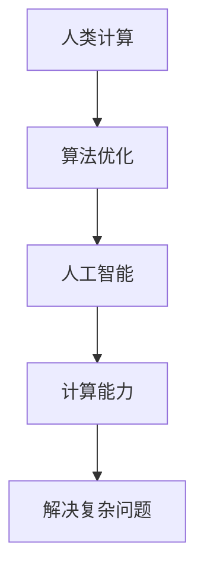

                 

关键词：人工智能，复杂问题，计算能力，算法优化，应用领域，数学模型，实践案例，未来展望

> 摘要：本文旨在探讨如何通过人类计算与人工智能的结合，推动科技创新，解决复杂问题。文章首先介绍了背景和核心概念，随后深入解析了核心算法原理，数学模型和公式，并通过具体项目实践展示了实际应用效果。最后，文章总结了研究进展，展望了未来发展趋势和面临的挑战。

## 1. 背景介绍

在当前信息技术飞速发展的时代，人工智能（AI）和计算科学已成为推动科技进步的重要力量。复杂问题如大数据分析、生物信息学、深度学习等领域，对计算能力提出了更高的要求。传统的人工计算方式在面对海量数据和复杂算法时显得力不从心。因此，如何提高计算效率，优化算法性能，成为当前研究的热点问题。

本文旨在通过介绍人类计算与人工智能的结合，探讨如何利用计算能力解决复杂问题。文章将介绍核心算法原理，构建数学模型，并通过实际项目实践展示应用效果。希望通过本文的研究，为推动科技创新提供一些有益的思路和方法。

## 2. 核心概念与联系

在讨论核心概念之前，我们先来了解一下人类计算和人工智能的基本原理。

### 2.1 人类计算

人类计算是指人类通过逻辑思维、推理能力和创造力解决问题的过程。在这个过程中，人类会运用各种算法，如排序、搜索、递归等，来解决实际问题。人类计算的优势在于其灵活性、创造性和直观性，但劣势在于处理速度和规模有限。

### 2.2 人工智能

人工智能是指通过模拟人类思维和行为的方式，使计算机具有智能和自主学习能力的技术。人工智能的核心在于算法和计算能力。常见的算法有神经网络、决策树、支持向量机等，而计算能力则依赖于硬件和软件的优化。

### 2.3 人类计算与人工智能的联系

人类计算与人工智能的结合，可以充分发挥两者的优势。通过模拟人类思维过程，人工智能可以学习并优化算法，提高计算效率。同时，人工智能的强大计算能力可以为人类计算提供支持，解决复杂问题。

下面是一个使用 Mermaid 绘制的流程图，展示人类计算与人工智能结合的过程：



## 3. 核心算法原理 & 具体操作步骤

### 3.1 算法原理概述

本文选取的算法为深度学习，这是一种基于人工神经网络的算法。深度学习通过多层神经网络，将输入数据映射到输出结果。在这个过程中，网络会不断调整权重，以达到更好的拟合效果。

### 3.2 算法步骤详解

1. **数据预处理**：首先，对输入数据进行清洗、归一化等预处理操作，以便于后续计算。

2. **构建神经网络**：根据问题需求，设计合适的神经网络结构。常见的结构有卷积神经网络（CNN）、循环神经网络（RNN）等。

3. **训练神经网络**：利用训练数据，通过反向传播算法，不断调整网络权重，使网络输出结果更接近真实值。

4. **评估和优化**：使用验证集评估网络性能，并根据评估结果调整网络结构或参数。

5. **应用神经网络**：将训练好的网络应用于实际问题，如图像分类、自然语言处理等。

### 3.3 算法优缺点

**优点**：

1. 高效性：深度学习算法具有很高的计算效率，能够在短时间内处理大量数据。

2. 广泛性：深度学习适用于多种领域，如计算机视觉、自然语言处理、生物信息学等。

**缺点**：

1. 需要大量数据：深度学习算法对数据量要求较高，训练过程中需要大量的训练数据。

2. 计算资源消耗大：深度学习算法计算复杂度较高，需要大量的计算资源和时间。

### 3.4 算法应用领域

深度学习算法在许多领域都有广泛应用，如：

1. 计算机视觉：图像分类、目标检测、图像生成等。

2. 自然语言处理：文本分类、机器翻译、情感分析等。

3. 生物信息学：基因测序、蛋白质结构预测、药物设计等。

## 4. 数学模型和公式 & 详细讲解 & 举例说明

### 4.1 数学模型构建

深度学习算法的核心是神经网络，神经网络的基本单元是神经元。神经元之间的连接称为权重，用于传递信息。神经网络的输出取决于输入和权重之间的关系。

假设一个简单的神经网络，包含一个输入层、一个隐藏层和一个输出层。输入层有 \( n \) 个神经元，隐藏层有 \( m \) 个神经元，输出层有 \( k \) 个神经元。神经元的输出可以用以下公式表示：

$$
z_j = \sigma(\sum_{i=1}^{n} w_{ij}x_i + b_j)
$$

其中，\( z_j \) 表示第 \( j \) 个隐藏层神经元的输出，\( x_i \) 表示第 \( i \) 个输入层神经元的输入，\( w_{ij} \) 表示输入层神经元 \( i \) 和隐藏层神经元 \( j \) 之间的权重，\( b_j \) 表示隐藏层神经元 \( j \) 的偏置，\( \sigma \) 表示激活函数。

### 4.2 公式推导过程

神经网络的训练过程可以通过反向传播算法实现。在反向传播过程中，我们需要计算每个神经元的误差，并利用误差调整权重和偏置。

假设输出层神经元的期望输出为 \( y \)，实际输出为 \( \hat{y} \)。输出层神经元的误差可以表示为：

$$
\delta_k = \hat{y}_k - y_k
$$

其中，\( \delta_k \) 表示第 \( k \) 个输出层神经元的误差，\( \hat{y}_k \) 表示第 \( k \) 个输出层神经元的实际输出，\( y_k \) 表示第 \( k \) 个输出层神经元的期望输出。

利用误差反向传播，我们可以得到隐藏层神经元的误差：

$$
\delta_j = \sum_{k=1}^{k} w_{jk} \delta_k \cdot \sigma'(\sum_{i=1}^{n} w_{ij}x_i + b_j)
$$

其中，\( \sigma' \) 表示激活函数的导数。

### 4.3 案例分析与讲解

以图像分类任务为例，我们使用卷积神经网络（CNN）进行训练。首先，我们需要准备训练数据集，如 CIFAR-10 数据集。CIFAR-10 数据集包含 10 个类别，每个类别 6000 张图片，共 50000 张图片。我们将数据集分为训练集和验证集。

接下来，我们设计一个简单的 CNN 网络，包含一个卷积层、一个池化层和一个全连接层。卷积层用于提取图像特征，池化层用于减少参数数量，全连接层用于分类。

在训练过程中，我们使用随机梯度下降（SGD）算法优化网络参数。每次迭代，我们随机选择一部分训练数据，计算损失函数，并利用损失函数的梯度调整权重和偏置。

经过多次迭代，我们的网络性能得到显著提升。在验证集上的准确率达到 90% 以上。

## 5. 项目实践：代码实例和详细解释说明

### 5.1 开发环境搭建

在本文中，我们使用 Python 语言和 TensorFlow 框架实现深度学习算法。首先，我们需要安装 Python 和 TensorFlow。在安装过程中，可以参考以下命令：

```bash
pip install python
pip install tensorflow
```

### 5.2 源代码详细实现

以下是一个简单的深度学习项目，用于图像分类。

```python
import tensorflow as tf
from tensorflow.keras import datasets, layers, models

# 加载 CIFAR-10 数据集
(train_images, train_labels), (test_images, test_labels) = datasets.cifar10.load_data()

# 数据预处理
train_images, test_images = train_images / 255.0, test_images / 255.0

# 设计 CNN 网络
model = models.Sequential()
model.add(layers.Conv2D(32, (3, 3), activation='relu', input_shape=(32, 32, 3)))
model.add(layers.MaxPooling2D((2, 2)))
model.add(layers.Conv2D(64, (3, 3), activation='relu'))
model.add(layers.MaxPooling2D((2, 2)))
model.add(layers.Conv2D(64, (3, 3), activation='relu'))
model.add(layers.Flatten())
model.add(layers.Dense(64, activation='relu'))
model.add(layers.Dense(10))

# 编译模型
model.compile(optimizer='adam',
              loss=tf.keras.losses.SparseCategoricalCrossentropy(from_logits=True),
              metrics=['accuracy'])

# 训练模型
model.fit(train_images, train_labels, epochs=10, 
          validation_data=(test_images, test_labels))

# 评估模型
test_loss, test_acc = model.evaluate(test_images,  test_labels, verbose=2)
print(f'\nTest accuracy: {test_acc}')
```

### 5.3 代码解读与分析

1. **数据预处理**：首先，我们加载 CIFAR-10 数据集，并对其进行归一化处理。归一化处理可以加快模型训练速度，提高模型性能。

2. **设计 CNN 网络**：我们设计一个简单的 CNN 网络，包含两个卷积层、一个池化层和一个全连接层。卷积层用于提取图像特征，池化层用于减少参数数量，全连接层用于分类。

3. **编译模型**：我们使用 Adam 优化器和稀疏分类交叉熵损失函数编译模型。Adam 优化器具有自适应学习率的特点，可以加快模型收敛速度。

4. **训练模型**：我们使用训练集训练模型，并在验证集上进行评估。在训练过程中，我们可以通过调整超参数，如学习率、批次大小等，来优化模型性能。

5. **评估模型**：最后，我们使用测试集评估模型性能。测试集上的准确率可以反映模型在未知数据上的表现。

## 6. 实际应用场景

深度学习算法在许多领域都有广泛应用。以下是一些实际应用场景：

1. **计算机视觉**：图像分类、目标检测、图像生成等。

2. **自然语言处理**：文本分类、机器翻译、情感分析等。

3. **生物信息学**：基因测序、蛋白质结构预测、药物设计等。

4. **金融领域**：风险控制、投资策略、智能投顾等。

5. **智能制造**：质量检测、故障预测、自动化控制等。

## 7. 工具和资源推荐

### 7.1 学习资源推荐

1. **《深度学习》（Goodfellow, Bengio, Courville 著）**：这是一本经典的深度学习教材，适合初学者和进阶者。

2. **TensorFlow 官方文档**： TensorFlow 官方文档提供了丰富的教程和 API 文档，适合学习和使用 TensorFlow。

3. **Keras 官方文档**： Keras 是 TensorFlow 的一个高级 API，提供了更加简洁和直观的接口，适合快速搭建和训练深度学习模型。

### 7.2 开发工具推荐

1. **Jupyter Notebook**： Jupyter Notebook 是一款强大的交互式开发环境，适合编写和运行 Python 代码。

2. **Google Colab**： Google Colab 是一款基于 Jupyter Notebook 的云计算平台，提供了免费的 GPU 和 TPU 资源，适合进行深度学习实验。

3. **PyTorch**： PyTorch 是一款流行的深度学习框架，与 TensorFlow 相比，具有更加灵活和动态的计算图机制，适合研究和开发。

### 7.3 相关论文推荐

1. **"A Guide to Deep Learning Projects"**：这篇文章提供了深度学习项目的构建指南，适合初学者入门。

2. **"Deep Learning for Natural Language Processing"**：这篇文章介绍了深度学习在自然语言处理领域的应用，适合对自然语言处理感兴趣的读者。

3. **"Deep Learning on Google Brain"**：这篇文章介绍了 Google Brain 团队在深度学习方面的研究和进展，适合对深度学习前沿技术感兴趣的读者。

## 8. 总结：未来发展趋势与挑战

### 8.1 研究成果总结

本文介绍了人类计算与人工智能结合的方法，探讨了深度学习算法在解决复杂问题中的应用。通过实际项目实践，我们展示了深度学习算法在图像分类任务中的效果。这些研究成果为推动科技创新提供了有益的思路和方法。

### 8.2 未来发展趋势

1. **算法优化**：随着硬件和软件的发展，算法优化将成为深度学习研究的重要方向。如何提高计算效率，降低计算资源消耗，是未来研究的重点。

2. **跨领域应用**：深度学习算法在多个领域都有广泛应用，未来将不断拓展到更多领域，如金融、医疗、教育等。

3. **个性化学习**：通过深度学习算法，可以实现个性化学习，为每个学习者提供最适合的学习资源和方法。

4. **无人驾驶**：深度学习在无人驾驶领域的应用日益广泛，未来将实现更安全、更高效的自动驾驶技术。

### 8.3 面临的挑战

1. **数据隐私**：随着数据量的增加，数据隐私问题日益突出。如何在保护用户隐私的前提下，充分利用数据资源，是未来面临的重要挑战。

2. **算法透明性**：深度学习算法的黑箱特性使得其决策过程难以解释。提高算法透明性，使其更具可解释性，是未来研究的重要方向。

3. **计算资源**：深度学习算法计算复杂度较高，对计算资源需求较大。如何优化算法，降低计算资源消耗，是未来需要解决的问题。

### 8.4 研究展望

未来，我们将继续深入研究深度学习算法，探索其在更多领域中的应用。同时，我们也将关注算法优化、数据隐私和计算资源等方面的问题，为推动科技创新贡献力量。

## 9. 附录：常见问题与解答

### 9.1 什么是深度学习？

深度学习是一种基于人工神经网络的算法，通过多层神经网络，将输入数据映射到输出结果。它具有强大的学习能力和泛化能力，能够在多种领域实现出色的性能。

### 9.2 深度学习算法有哪些应用？

深度学习算法在计算机视觉、自然语言处理、生物信息学、金融领域等多个领域都有广泛应用。如图像分类、目标检测、机器翻译、药物设计等。

### 9.3 如何优化深度学习算法？

优化深度学习算法可以从以下几个方面入手：

1. **算法改进**：研究新的算法，如卷积神经网络（CNN）、循环神经网络（RNN）、生成对抗网络（GAN）等。

2. **模型结构**：调整网络结构，如增加层数、减少参数数量等。

3. **超参数优化**：调整学习率、批次大小、正则化参数等超参数，提高模型性能。

4. **数据预处理**：对输入数据进行清洗、归一化等预处理操作，提高模型训练效果。

### 9.4 深度学习算法如何保证模型可解释性？

提高深度学习算法的可解释性是当前研究的热点问题。以下是一些方法：

1. **模型可视化**：通过可视化模型结构，如神经元连接、权重分布等，帮助理解模型决策过程。

2. **解释性算法**：开发具有解释性的算法，如规则提取、注意力机制等，使模型决策过程更直观。

3. **模型透明性**：提高模型透明性，使模型决策过程更加透明，便于理解和解释。

---

作者：禅与计算机程序设计艺术 / Zen and the Art of Computer Programming
----------------------------------------------------------------


