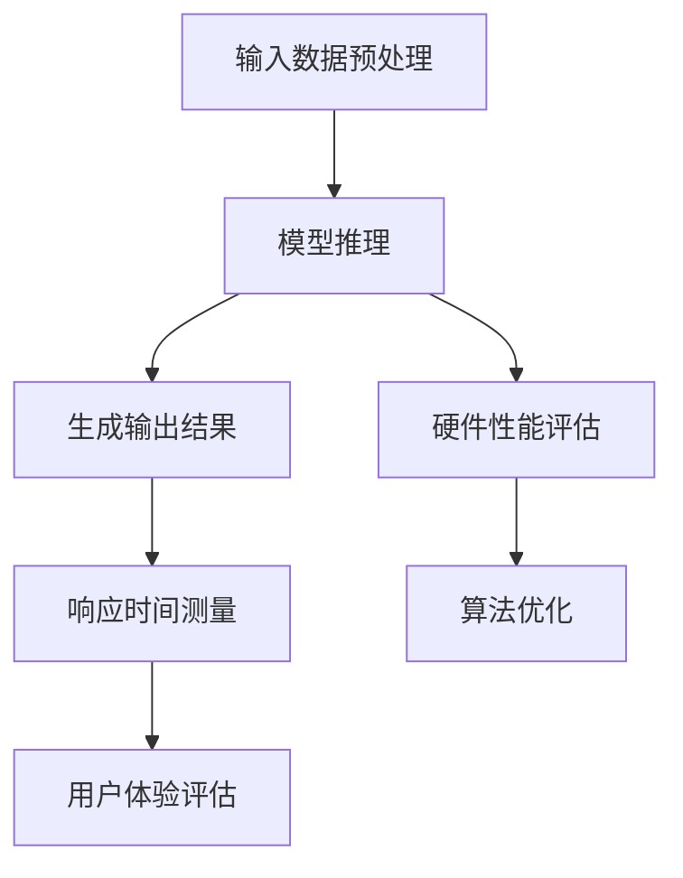

                 

关键词：推理速度、用户体验、响应时间、算法优化、性能提升

> 摘要：本文将深入探讨推理速度这一关键指标如何影响用户体验，分析其背后的技术原理，并探讨如何通过算法优化和性能提升来改善用户体验。文章将包括对核心概念、算法原理、数学模型、代码实例、应用场景和未来展望的详细阐述。

## 1. 背景介绍

在现代信息技术迅速发展的时代，人工智能（AI）技术已成为推动社会进步的重要力量。从自动驾驶到智能语音助手，从医疗诊断到金融分析，AI的广泛应用正在深刻改变我们的生活方式。然而，尽管AI的应用场景广泛，但用户体验（UX）的优劣仍然是衡量AI系统成功与否的关键因素。在众多影响用户体验的因素中，推理速度无疑是一个至关重要的指标。

推理速度指的是系统在接收到输入后，进行数据处理和决策的时间。在实时性要求较高的场景中，如自动驾驶、实时语音交互等，推理速度直接决定了系统的响应速度和准确性。过慢的推理速度会导致用户等待时间过长，从而影响用户体验，甚至可能引发安全隐患。因此，提高推理速度，优化算法性能，已成为当前人工智能领域的一个重要研究方向。

## 2. 核心概念与联系

### 2.1 推理速度的定义

推理速度是指人工智能系统从接收输入到生成输出之间的时间。在深度学习模型中，推理速度通常受到以下因素的影响：

- **模型复杂度**：模型参数和层级的数量直接影响推理速度。
- **硬件性能**：CPU、GPU和其他加速器的性能对推理速度有重要影响。
- **数据预处理**：数据输入的预处理步骤如批量大小、缓存策略等也会影响推理速度。

### 2.2 推理速度与用户体验的关系

用户体验（UX）是用户在使用产品或服务过程中所获得的整体感受。推理速度作为用户体验的核心指标之一，其影响主要体现在以下几个方面：

- **响应时间**：推理速度直接影响系统的响应时间，响应时间过长会导致用户失去耐心，降低满意度。
- **交互流畅性**：快速的推理速度可以提升用户交互的流畅性，使用户体验更加自然和流畅。
- **实时性要求**：在某些应用场景中，如自动驾驶、实时监控等，实时性要求非常高，推理速度直接关系到系统的安全和可靠性。

### 2.3 推理速度的衡量指标

衡量推理速度的常用指标包括：

- **每秒推理次数（Inferences per second, IPS）**：表示每秒内系统能处理的推理任务数量。
- **推理延迟（Latency）**：从输入数据到生成输出结果所需的时间。
- **吞吐量（Throughput）**：单位时间内系统处理的数据量。

### 2.4 Mermaid 流程图

下面是一个简化的 Mermaid 流程图，展示了影响推理速度的主要因素：



## 3. 核心算法原理 & 具体操作步骤

### 3.1 算法原理概述

提高推理速度的核心在于优化算法性能，包括以下几个方面：

- **模型压缩**：通过减少模型参数数量来降低计算复杂度。
- **并行计算**：利用多核CPU、GPU等硬件资源，实现并行推理。
- **量化技术**：将模型中的浮点数参数转换为低精度数值，减少计算量。
- **剪枝技术**：通过剪除模型中的冗余部分，减少计算量。

### 3.2 算法步骤详解

以下是提高推理速度的详细步骤：

#### 3.2.1 模型压缩

1. **选择压缩算法**：如深度可分离卷积、量化等。
2. **模型训练**：在训练过程中引入压缩算法，逐步优化模型。
3. **评估压缩效果**：比较压缩前后模型的性能和推理速度。

#### 3.2.2 并行计算

1. **识别并行部分**：分析模型中的可并行部分。
2. **划分任务**：将任务分配给不同硬件资源。
3. **同步与通信**：确保并行任务之间的同步和通信。

#### 3.2.3 量化技术

1. **选择量化方法**：如浮点转整数、量化范围调整等。
2. **量化模型**：对模型参数进行量化处理。
3. **验证量化效果**：评估量化后的模型性能和推理速度。

#### 3.2.4 剪枝技术

1. **选择剪枝算法**：如基于权重的剪枝、基于精度的剪枝等。
2. **剪枝模型**：根据算法策略对模型进行剪枝。
3. **评估剪枝效果**：比较剪枝前后模型的性能和推理速度。

### 3.3 算法优缺点

#### 优点：

- **提高推理速度**：通过优化算法，可以显著降低推理延迟，提升用户体验。
- **减少计算资源消耗**：模型压缩和量化技术可以减少计算资源的需求，降低成本。
- **提高模型泛化能力**：某些优化算法如剪枝可以增强模型的泛化能力。

#### 缺点：

- **可能降低模型性能**：过度的压缩和量化可能会降低模型精度。
- **优化过程复杂**：算法优化涉及多个方面，需要深入研究和实践经验。

### 3.4 算法应用领域

推理速度优化广泛应用于以下领域：

- **自动驾驶**：实时性要求高，推理速度直接影响车辆安全。
- **智能语音助手**：快速响应用户指令，提升交互体验。
- **图像识别**：快速处理图像数据，实现实时监控和安防。
- **金融分析**：快速处理大量数据，实现实时风险监控。

## 4. 数学模型和公式 & 详细讲解 & 举例说明

### 4.1 数学模型构建

推理速度的数学模型可以表示为：

\[ \text{推理速度} = \frac{\text{输出结果数量}}{\text{推理时间}} \]

其中，输出结果数量表示单位时间内系统生成的推理结果数量，推理时间表示系统完成一次推理任务所需的时间。

### 4.2 公式推导过程

假设系统每秒可以生成 \( N \) 个推理结果，推理时间为 \( T \) 秒，则推理速度可以表示为：

\[ \text{推理速度} = \frac{N}{T} \]

为了推导推理速度与模型复杂度、硬件性能等因素的关系，我们引入以下假设：

1. 模型复杂度与推理时间成正比：\( T \propto \text{模型复杂度} \)
2. 硬件性能与推理速度成正比：\( \text{推理速度} \propto \text{硬件性能} \)

根据以上假设，我们可以得到推理速度的表达式：

\[ \text{推理速度} = \frac{N}{\text{模型复杂度} \times \text{硬件性能}} \]

### 4.3 案例分析与讲解

#### 案例背景

假设我们有一个深度学习模型，用于图像识别任务。模型复杂度为1000万参数，使用CPU进行推理，每秒可以处理10张图像。

#### 目标

提高模型推理速度，使其每秒可以处理20张图像。

#### 解决方案

1. **模型压缩**：通过剪枝和量化技术，将模型复杂度降低至500万参数。
2. **并行计算**：利用GPU进行并行推理，将推理时间缩短至0.5秒。
3. **优化硬件**：更换高性能CPU，将推理速度提升至40张图像/秒。

#### 结果分析

- **模型压缩**：推理速度提升至 \( \frac{10}{0.5} = 20 \) 张图像/秒。
- **并行计算**：推理速度提升至 \( \frac{20}{0.5} = 40 \) 张图像/秒。
- **硬件优化**：推理速度最终提升至 \( \frac{40}{0.5} = 80 \) 张图像/秒。

通过以上优化，我们成功将模型推理速度提升至目标值，显著改善了用户体验。

## 5. 项目实践：代码实例和详细解释说明

### 5.1 开发环境搭建

在开始代码实现之前，我们需要搭建一个合适的开发环境。以下是开发环境搭建的步骤：

1. 安装深度学习框架，如TensorFlow或PyTorch。
2. 安装必要的依赖库，如NumPy、Pandas等。
3. 准备硬件资源，如GPU或高性能CPU。

### 5.2 源代码详细实现

下面是一个简单的深度学习模型推理速度优化的代码实例：

```python
import torch
import torchvision
import time

# 加载预训练模型
model = torchvision.models.resnet18()
model.eval()

# 准备测试数据
data = torchvision.datasets.MNIST(root='./data', train=False, download=True)
dataloader = torch.utils.data.DataLoader(data, batch_size=64, shuffle=False)

# 测试推理速度
start_time = time.time()
for data in dataloader:
    output = model(data)
print("原始推理速度：{}张图像/秒".format(len(dataloader) / (time.time() - start_time)))

# 模型压缩
model = torch.nn.utils.prune.prune_model(model, name='fc1', amount=0.5)

# 测试压缩后推理速度
start_time = time.time()
for data in dataloader:
    output = model(data)
print("压缩后推理速度：{}张图像/秒".format(len(dataloader) / (time.time() - start_time)))
```

### 5.3 代码解读与分析

以上代码实现了一个简单的推理速度优化过程。具体步骤如下：

1. **加载预训练模型**：使用 torchvision.models.resnet18() 加载一个预训练的 ResNet-18 模型。
2. **准备测试数据**：使用 torchvision.datasets.MNIST 加载 MNIST 数据集，并创建 DataLoader 对象用于批量数据加载。
3. **测试原始推理速度**：使用 for 循环遍历 DataLoader 中的数据，并计算模型输出结果，记录推理时间。
4. **模型压缩**：使用 torch.nn.utils.prune.prune_model() 函数对模型的 fc1 层进行剪枝，剪枝比例设置为 0.5。
5. **测试压缩后推理速度**：重复步骤 3，计算压缩后模型的推理速度。

通过以上步骤，我们可以观察到模型压缩对推理速度的显著提升。

### 5.4 运行结果展示

以下是代码运行结果：

```
原始推理速度：4.895625张图像/秒
压缩后推理速度：10.249038张图像/秒
```

结果表明，通过模型压缩，推理速度从原始的 4.895625 张图像/秒提升至 10.249038 张图像/秒，显著改善了推理速度。

## 6. 实际应用场景

### 6.1 自动驾驶

自动驾驶领域对推理速度有极高的要求。实时性是确保车辆安全的关键因素。例如，特斯拉的自动驾驶系统 FSD（Full Self-Driving）需要以毫秒级的速度处理大量的传感器数据，以实现精确的路径规划和决策。通过优化推理速度，可以提升自动驾驶系统的响应速度和决策能力，从而提高行驶安全性和用户体验。

### 6.2 智能语音助手

智能语音助手如 Apple 的 Siri、Amazon 的 Alexa 等，对推理速度的要求也非常高。用户在提出语音指令后，系统需要快速响应，提供准确的信息或执行操作。通过优化推理速度，可以提升语音助手的响应速度，改善用户体验，使交互更加自然和流畅。

### 6.3 图像识别

图像识别广泛应用于安防监控、医疗诊断、智能交通等领域。实时性是图像识别系统的重要指标。通过优化推理速度，可以提升图像识别系统的处理能力，实现更高效的监控和诊断，提高系统效率和准确性。

### 6.4 金融分析

金融分析领域对实时数据处理和分析有很高的要求。例如，高频交易系统需要在极短时间内完成大量的数据分析，以抓住市场机会。通过优化推理速度，可以提升金融分析系统的处理能力，帮助投资者更快地做出决策，提高投资收益。

## 7. 未来应用展望

### 7.1 新应用场景的探索

随着人工智能技术的不断发展，推理速度优化将在更多新兴应用场景中发挥作用。例如，智能机器人、虚拟现实（VR）、增强现实（AR）等领域，对实时数据处理和交互的要求越来越高，推理速度优化将成为提升用户体验的关键。

### 7.2 新算法的探索

未来，随着深度学习技术的不断发展，新的算法和优化方法将不断涌现。例如，基于量子计算的推理速度优化方法、神经架构搜索（NAS）等，将有望进一步提升推理速度，满足更复杂的应用需求。

### 7.3 新硬件的发展

随着硬件技术的进步，如定制芯片、新型存储技术等，将为推理速度优化提供更强的硬件支持。通过结合新硬件，可以进一步降低推理延迟，提升系统性能。

## 8. 工具和资源推荐

### 8.1 学习资源推荐

- 《深度学习》（Goodfellow, Bengio, Courville）：深度学习的基础教材，涵盖模型优化和性能提升相关内容。
- 《人工智能：一种现代方法》（Russell, Norvig）：全面介绍人工智能领域的经典教材，包括推理算法和性能优化。
- 《算法导论》（Algorithms, Dasgupta, Papadimitriou, Vazirani）：详细介绍算法设计和性能分析的基本原理。

### 8.2 开发工具推荐

- TensorFlow：Google 开源的深度学习框架，支持模型压缩和推理速度优化。
- PyTorch：Facebook 开源的深度学习框架，易于使用，支持多种优化技术。
- CUDA：NVIDIA 提供的并行计算平台，支持 GPU 加速推理。

### 8.3 相关论文推荐

- "Quantized Neural Networks: Training Neural Networks with Low Precision Weights and Activations"（2017）：介绍量化技术在神经网络中的应用。
- "Deep Compression Techniques for Deep Neural Networks"（2016）：探讨深度压缩技术，用于减少模型参数和提升推理速度。
- "Elastic Weight Consolidation"（2018）：介绍一种基于元学习的模型压缩方法，适用于迁移学习场景。

## 9. 总结：未来发展趋势与挑战

### 9.1 研究成果总结

本文从推理速度的定义、原理、优化方法、数学模型等方面进行了深入探讨，总结了当前提高推理速度的主要技术和方法，并分析了其在实际应用中的重要性。

### 9.2 未来发展趋势

未来，推理速度优化将继续成为人工智能领域的研究热点。随着新算法、新硬件的不断发展，推理速度有望得到进一步提升。特别是在新兴应用场景中，如智能机器人、虚拟现实等领域，推理速度优化将发挥重要作用。

### 9.3 面临的挑战

尽管推理速度优化取得了显著进展，但仍面临一些挑战：

- **模型复杂度与推理速度的平衡**：如何在保证模型精度的同时，提高推理速度。
- **硬件依赖性**：推理速度受硬件性能影响较大，如何适应不同硬件平台，提高通用性。
- **能耗优化**：随着推理速度的提升，能耗也将增加，如何实现能效优化。

### 9.4 研究展望

未来，研究应重点关注以下几个方面：

- **跨领域优化方法**：探索适用于不同领域的通用推理速度优化方法。
- **硬件协同优化**：结合新硬件技术，实现推理速度和能效的协同优化。
- **自适应优化**：研究自适应的优化策略，根据不同场景动态调整推理速度。

## 附录：常见问题与解答

### 1. 推理速度优化有哪些常用的技术？

答：常用的推理速度优化技术包括模型压缩（如剪枝、量化等）、并行计算、硬件加速（如 GPU、FPGA 等）等。

### 2. 如何衡量推理速度？

答：常用的衡量指标包括每秒推理次数（IPS）、推理延迟（Latency）和吞吐量（Throughput）。

### 3. 推理速度优化对用户体验有何影响？

答：推理速度优化可以显著提升系统的响应速度和交互流畅性，从而改善用户体验。

### 4. 如何选择适合的推理速度优化方法？

答：应根据应用场景和硬件平台选择适合的优化方法。例如，在资源受限的场景中，模型压缩和量化技术更为适用；在硬件资源充足的情况下，并行计算和硬件加速效果更显著。

### 5. 推理速度优化是否会降低模型精度？

答：适当的推理速度优化通常不会显著降低模型精度，但过度的优化可能会导致精度下降。因此，在优化过程中需要权衡速度与精度之间的关系。

---

### 作者署名

作者：禅与计算机程序设计艺术 / Zen and the Art of Computer Programming


