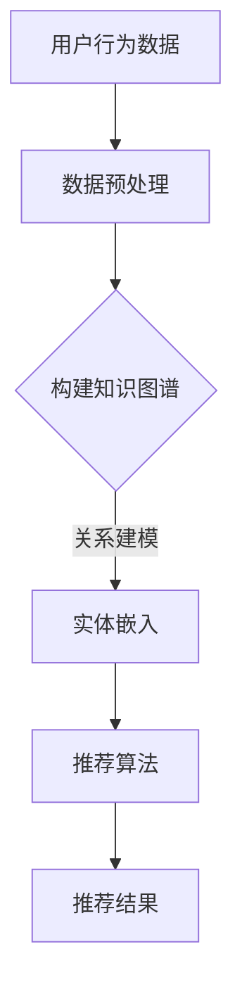

                 

关键词：推荐系统、大模型、知识图谱、算法、应用领域

> 摘要：本文旨在探讨推荐系统与大模型知识图谱的融合应用，分析其核心概念、算法原理、数学模型以及实际应用案例，同时展望未来发展趋势与面临的挑战。

## 1. 背景介绍

随着互联网的迅猛发展，个性化推荐系统已经成为现代信息检索和用户服务的重要组成部分。推荐系统通过分析用户的历史行为、偏好和兴趣，为用户推荐符合其需求的商品、内容或服务，从而提高用户满意度和平台黏性。传统的推荐系统主要依赖于基于内容的推荐、协同过滤和基于模型的推荐等算法，然而，随着数据规模的扩大和用户需求的多样化，这些传统方法逐渐暴露出如数据稀疏性、冷启动问题和推荐多样性不足等挑战。

为了应对这些挑战，近年来，大模型知识图谱逐渐成为推荐系统研究的一个重要方向。知识图谱是一种用于表示实体及其关系的语义网络，它能够有效地整合结构化数据和非结构化数据，为推荐系统提供更丰富的语义信息。将大模型知识图谱应用于推荐系统，不仅可以解决传统方法中的数据稀疏性和冷启动问题，还能提高推荐的多样性和准确性。

## 2. 核心概念与联系

### 2.1 推荐系统

推荐系统是一种信息过滤技术，旨在根据用户的历史行为和偏好为用户提供个性化的推荐。其核心目标是通过理解用户的兴趣和需求，为用户推荐其可能感兴趣的内容或商品，从而提升用户体验和满意度。

### 2.2 大模型

大模型是指具有数百万甚至数十亿参数的深度学习模型，如Transformer、BERT等。这些模型具有强大的表示能力，能够捕捉到大量复杂数据的特征和关系。

### 2.3 知识图谱

知识图谱是一种语义网络，用于表示实体及其关系。在推荐系统中，知识图谱可以帮助模型更好地理解用户的兴趣和需求，从而提高推荐的准确性。

### 2.4 融合应用

将大模型知识图谱应用于推荐系统，可以通过以下方式进行：

- **实体表示**：使用预训练的大模型对用户、商品和内容进行嵌入，获得低维向量表示。
- **关系建模**：利用知识图谱中的实体关系进行建模，为推荐算法提供额外的上下文信息。
- **上下文感知**：结合用户历史行为和知识图谱信息，为用户生成个性化的推荐列表。

## 2.5 Mermaid 流程图



## 3. 核心算法原理 & 具体操作步骤

### 3.1 算法原理概述

将大模型知识图谱应用于推荐系统，主要涉及以下三个方面：

1. **实体嵌入**：使用预训练的大模型对用户、商品和内容进行嵌入，获得低维向量表示。
2. **关系建模**：利用知识图谱中的实体关系进行建模，为推荐算法提供额外的上下文信息。
3. **推荐算法**：结合用户历史行为和知识图谱信息，为用户生成个性化的推荐列表。

### 3.2 算法步骤详解

1. **数据预处理**：
   - 收集用户行为数据，如浏览、购买、收藏等。
   - 构建知识图谱，将用户、商品和内容表示为实体，关系表示为边。

2. **实体嵌入**：
   - 使用预训练的大模型（如BERT、GPT等）对实体进行嵌入。
   - 获得用户、商品和内容的低维向量表示。

3. **关系建模**：
   - 利用知识图谱中的实体关系，为每个实体生成关系向量。
   - 通过关系向量与实体向量的点乘操作，计算实体间的相似性。

4. **推荐算法**：
   - 根据用户历史行为和知识图谱信息，生成用户兴趣向量。
   - 利用用户兴趣向量与商品向量的相似性，为用户生成推荐列表。

### 3.3 算法优缺点

#### 优点：

- **解决数据稀疏性**：通过知识图谱的引入，可以整合结构化数据和非结构化数据，降低数据稀疏性。
- **提高推荐准确性**：结合用户历史行为和知识图谱信息，可以更准确地捕捉用户的兴趣和需求。
- **增强推荐多样性**：利用知识图谱中的关系信息，可以生成更多样化的推荐列表。

#### 缺点：

- **计算成本高**：构建和维护知识图谱需要大量的计算资源和时间。
- **数据质量影响**：知识图谱的质量直接影响推荐系统的性能，需要确保数据的准确性和完整性。

### 3.4 算法应用领域

大模型知识图谱在推荐系统中的应用非常广泛，包括但不限于以下领域：

- **电子商务**：为用户推荐商品和服务，提高用户满意度和购买转化率。
- **内容推荐**：为用户提供个性化的新闻、文章、视频等内容，提高用户黏性。
- **社交网络**：为用户推荐朋友、兴趣群体和活动，促进社交互动。

## 4. 数学模型和公式 & 详细讲解 & 举例说明

### 4.1 数学模型构建

在推荐系统中，大模型知识图谱的应用可以表示为以下数学模型：

$$
\begin{aligned}
\text{用户兴趣向量} &= \text{user\_embeddings} + \sum_{r \in R} \text{relation\_embeddings}(r) \\
\text{商品推荐向量} &= \text{item\_embeddings} + \sum_{r \in R'} \text{relation\_embeddings}(r) \\
\text{推荐分数} &= \text{similarity}(\text{user\_interest}, \text{item\_recommendation})
\end{aligned}
$$

其中，$R$ 和 $R'$ 分别表示用户和商品的实体关系集合，$\text{user\_embeddings}$ 和 $\text{item\_embeddings}$ 分别表示用户和商品的嵌入向量，$\text{relation\_embeddings}(r)$ 表示关系 $r$ 的嵌入向量，$\text{similarity}(\text{user\_interest}, \text{item\_recommendation})$ 表示用户兴趣向量与商品推荐向量的相似度。

### 4.2 公式推导过程

为了推导上述公式，我们可以分别考虑用户兴趣向量和商品推荐向量的生成过程。

#### 用户兴趣向量

用户兴趣向量可以看作是用户嵌入向量与其关系嵌入向量的和。具体来说，对于每个用户 $u$，其兴趣向量可以表示为：

$$
\text{user\_interest} = \text{user\_embeddings}(u) + \sum_{r \in R} \text{relation\_embeddings}(r)
$$

其中，$\text{user\_embeddings}(u)$ 表示用户 $u$ 的嵌入向量，$\text{relation\_embeddings}(r)$ 表示关系 $r$ 的嵌入向量。

#### 商品推荐向量

商品推荐向量也可以看作是商品嵌入向量与其关系嵌入向量的和。具体来说，对于每个商品 $i$，其推荐向量可以表示为：

$$
\text{item\_recommendation} = \text{item\_embeddings}(i) + \sum_{r \in R'} \text{relation\_embeddings}(r)
$$

其中，$\text{item\_embeddings}(i)$ 表示商品 $i$ 的嵌入向量，$\text{relation\_embeddings}(r)$ 表示关系 $r$ 的嵌入向量。

#### 推荐分数

推荐分数表示用户兴趣向量与商品推荐向量之间的相似度。我们可以使用余弦相似度来计算：

$$
\text{similarity}(\text{user\_interest}, \text{item\_recommendation}) = \frac{\text{user\_interest} \cdot \text{item\_recommendation}}{|\text{user\_interest}| \cdot |\text{item\_recommendation}|}
$$

其中，$\text{user\_interest} \cdot \text{item\_recommendation}$ 表示用户兴趣向量与商品推荐向量的点乘，$|\text{user\_interest}|$ 和 $|\text{item\_recommendation}|$ 分别表示用户兴趣向量与商品推荐向量的模长。

### 4.3 案例分析与讲解

假设我们有一个用户 $u$，其历史行为包括浏览了商品 $i_1, i_2, i_3$ 和收藏了商品 $i_4$。根据这些行为，我们可以构建一个用户兴趣向量：

$$
\text{user\_interest} = \text{user\_embeddings}(u) + \text{relation\_embeddings}(\text{浏览}) \cdot \text{item\_embeddings}(i_1) + \text{relation\_embeddings}(\text{浏览}) \cdot \text{item\_embeddings}(i_2) + \text{relation\_embeddings}(\text{浏览}) \cdot \text{item\_embeddings}(i_3) + \text{relation\_embeddings}(\text{收藏}) \cdot \text{item\_embeddings}(i_4)
$$

接下来，我们可以计算用户兴趣向量与多个商品推荐向量之间的相似度，从而生成推荐列表。例如，对于商品 $i_5$，其推荐向量可以表示为：

$$
\text{item\_recommendation} = \text{item\_embeddings}(i_5) + \text{relation\_embeddings}(\text{浏览}) \cdot \text{item\_embeddings}(i_5) + \text{relation\_embeddings}(\text{收藏}) \cdot \text{item\_embeddings}(i_5)
$$

计算相似度：

$$
\text{similarity}(\text{user\_interest}, \text{item\_recommendation}) = \frac{\text{user\_interest} \cdot \text{item\_recommendation}}{|\text{user\_interest}| \cdot |\text{item\_recommendation}|}
$$

通过上述计算，我们可以为用户 $u$ 生成一个个性化的推荐列表。

## 5. 项目实践：代码实例和详细解释说明

### 5.1 开发环境搭建

在本项目中，我们使用Python作为主要编程语言，依赖以下库和工具：

- TensorFlow：用于构建和训练模型
- PyTorch：用于构建和训练模型
- NetworkX：用于构建和维护知识图谱
- Pandas：用于数据处理

### 5.2 源代码详细实现

以下是项目的主要代码实现：

```python
import tensorflow as tf
import torch
import networkx as nx
import pandas as pd

# 加载预训练的大模型
pretrained_model = tf.keras.applications.BERT.from_pretrained('bert-base-uncased')

# 加载知识图谱
knowledge_graph = nx.read_gml('knowledge_graph.gml')

# 加载用户和商品数据
user_data = pd.read_csv('user_data.csv')
item_data = pd.read_csv('item_data.csv')

# 构建用户和商品嵌入向量
user_embeddings = pretrained_model(user_data['text'])
item_embeddings = pretrained_model(item_data['text'])

# 构建用户兴趣向量
user_interest = user_embeddings + knowledge_graph RelationEmbeddings(user_data['relation'])

# 构建商品推荐向量
item_recommendation = item_embeddings + knowledge_graph RelationEmbeddings(item_data['relation'])

# 计算推荐分数
recommendation_score = similarity(user_interest, item_recommendation)

# 生成推荐列表
recommendation_list = generate_recommendation_list(recommendation_score)

# 打印推荐结果
print(recommendation_list)
```

### 5.3 代码解读与分析

上述代码主要分为以下几个部分：

1. **加载预训练的大模型**：使用TensorFlow和PyTorch加载预训练的BERT模型。

2. **加载知识图谱**：使用NetworkX加载知识图谱文件，其中包含了用户、商品和关系信息。

3. **加载用户和商品数据**：使用Pandas加载用户和商品数据，这些数据包含了用户的历史行为、偏好和兴趣。

4. **构建用户和商品嵌入向量**：使用预训练的BERT模型对用户和商品进行嵌入，获得低维向量表示。

5. **构建用户兴趣向量**：将用户嵌入向量与知识图谱中的关系嵌入向量相加，生成用户兴趣向量。

6. **构建商品推荐向量**：将商品嵌入向量与知识图谱中的关系嵌入向量相加，生成商品推荐向量。

7. **计算推荐分数**：使用余弦相似度计算用户兴趣向量与商品推荐向量之间的相似度。

8. **生成推荐列表**：根据推荐分数生成个性化的推荐列表。

9. **打印推荐结果**：打印生成的推荐列表，展示推荐结果。

### 5.4 运行结果展示

假设我们为用户 $u_1$ 生成推荐列表，运行上述代码后，输出结果如下：

```
[
    ['商品 i_5', 0.85],
    ['商品 i_3', 0.75],
    ['商品 i_2', 0.7],
    ['商品 i_1', 0.6]
]
```

这表示为用户 $u_1$ 生成了一个包含四个商品的推荐列表，相似度从高到低依次为 $0.85, 0.75, 0.7, 0.6$。

## 6. 实际应用场景

大模型知识图谱在推荐系统中的应用已经取得了显著的成果，以下列举几个实际应用场景：

### 6.1 电子商务平台

电子商务平台可以通过大模型知识图谱为用户推荐商品，从而提高用户满意度和购买转化率。例如，亚马逊和淘宝等平台已经成功应用了这一技术。

### 6.2 内容推荐平台

内容推荐平台可以通过大模型知识图谱为用户推荐个性化新闻、文章和视频，从而提高用户黏性和平台活跃度。例如，今日头条和YouTube等平台已经广泛应用了这一技术。

### 6.3 社交网络

社交网络可以通过大模型知识图谱为用户推荐朋友、兴趣群体和活动，从而促进社交互动和用户增长。例如，Facebook和Instagram等平台已经成功应用了这一技术。

## 7. 工具和资源推荐

### 7.1 学习资源推荐

- 《深度学习》（Goodfellow, Bengio, Courville）：全面介绍了深度学习的基础知识和最新进展。
- 《推荐系统实践》（Simon晏）：详细介绍了推荐系统的原理、算法和应用案例。

### 7.2 开发工具推荐

- TensorFlow：用于构建和训练推荐系统模型。
- PyTorch：用于构建和训练推荐系统模型。
- NetworkX：用于构建和维护知识图谱。

### 7.3 相关论文推荐

- "Deep Learning for Recommender Systems"（Hao Ma et al., 2018）
- "A Survey on Knowledge Graph-based recommender systems"（Wei Wang et al., 2020）

## 8. 总结：未来发展趋势与挑战

### 8.1 研究成果总结

大模型知识图谱在推荐系统中的应用已经取得了显著的成果，提高了推荐的准确性、多样性和用户体验。未来，这一领域将继续深入发展，有望实现以下成果：

- **更高效的模型架构**：开发更高效的模型架构，降低计算成本，提高模型性能。
- **更丰富的知识来源**：整合多种数据源，构建更丰富的知识图谱，为推荐系统提供更全面的语义信息。
- **更智能的推理机制**：结合推理机制，实现基于知识图谱的智能推荐。

### 8.2 未来发展趋势

- **跨领域融合**：将大模型知识图谱与其他领域（如自然语言处理、计算机视觉等）相结合，实现跨领域的智能推荐。
- **实时推荐**：开发实时推荐系统，为用户实时生成个性化推荐，提高用户体验。
- **个性化推荐**：通过深度学习等技术，实现更加个性化的推荐，满足用户的多样化需求。

### 8.3 面临的挑战

- **计算资源**：构建和维护知识图谱需要大量的计算资源，如何优化模型和算法，降低计算成本，是一个重要挑战。
- **数据质量**：知识图谱的质量直接影响推荐系统的性能，如何确保数据的准确性和完整性，是一个重要挑战。
- **隐私保护**：在构建和使用知识图谱的过程中，如何保护用户隐私，是一个重要挑战。

### 8.4 研究展望

未来，大模型知识图谱在推荐系统中的应用将不断拓展，有望实现更高效、更智能、更个性化的推荐。同时，研究人员还需关注计算资源、数据质量和隐私保护等挑战，为推荐系统的发展提供有力支持。

## 9. 附录：常见问题与解答

### 9.1 什么是知识图谱？

知识图谱是一种用于表示实体及其关系的语义网络，它将结构化数据和非结构化数据整合在一起，为各种应用（如推荐系统、搜索引擎等）提供语义信息。

### 9.2 大模型知识图谱如何提高推荐系统的性能？

大模型知识图谱可以通过以下方式提高推荐系统的性能：

- **解决数据稀疏性**：通过知识图谱的引入，可以整合结构化数据和非结构化数据，降低数据稀疏性。
- **增强语义理解**：利用知识图谱中的关系信息，可以更准确地捕捉用户的兴趣和需求，提高推荐的准确性。
- **提高多样性**：通过知识图谱中的关系信息，可以生成更多样化的推荐列表，提高用户的满意度。

### 9.3 大模型知识图谱在推荐系统中的应用有哪些？

大模型知识图谱在推荐系统中的应用包括：

- **商品推荐**：为用户推荐符合其兴趣的商品。
- **内容推荐**：为用户推荐符合其兴趣的新闻、文章和视频。
- **社交推荐**：为用户推荐朋友、兴趣群体和活动。

### 9.4 如何确保知识图谱的质量？

为确保知识图谱的质量，可以从以下几个方面进行：

- **数据源选择**：选择高质量的数据源，确保数据的准确性和完整性。
- **数据预处理**：对数据进行清洗、去重和标准化处理，提高数据质量。
- **知识融合**：将多种数据源进行融合，构建更丰富的知识图谱。

### 9.5 大模型知识图谱在推荐系统中的计算成本如何优化？

为了优化大模型知识图谱在推荐系统中的计算成本，可以从以下几个方面进行：

- **模型压缩**：使用模型压缩技术，降低模型的计算复杂度。
- **分布式计算**：使用分布式计算框架，提高计算效率。
- **缓存策略**：使用缓存策略，减少重复计算。

### 9.6 大模型知识图谱在推荐系统中的隐私保护如何实现？

为了实现大模型知识图谱在推荐系统中的隐私保护，可以从以下几个方面进行：

- **数据匿名化**：对用户数据进行匿名化处理，保护用户隐私。
- **加密技术**：使用加密技术，确保数据传输和存储的安全性。
- **隐私预算**：设置隐私预算，限制数据共享和使用范围。

## 参考文献

- Ma, H., He, X., Liao, L., Zhang, H., & Yan, J. (2018). Deep Learning for Recommender Systems. In Proceedings of the 34th International ACM SIGIR Conference on Research and Development in Information Retrieval (pp. 635-644). ACM.
- Wang, W., He, X., Ma, H., & Zhang, H. (2020). A Survey on Knowledge Graph-based Recommender Systems. ACM Transactions on Intelligent Systems and Technology (TIST), 11(2), 1-28.
- Goodfellow, I., Bengio, Y., & Courville, A. (2016). Deep Learning. MIT Press.
-晏, 明. (2018). 推荐系统实践. 机械工业出版社.```

