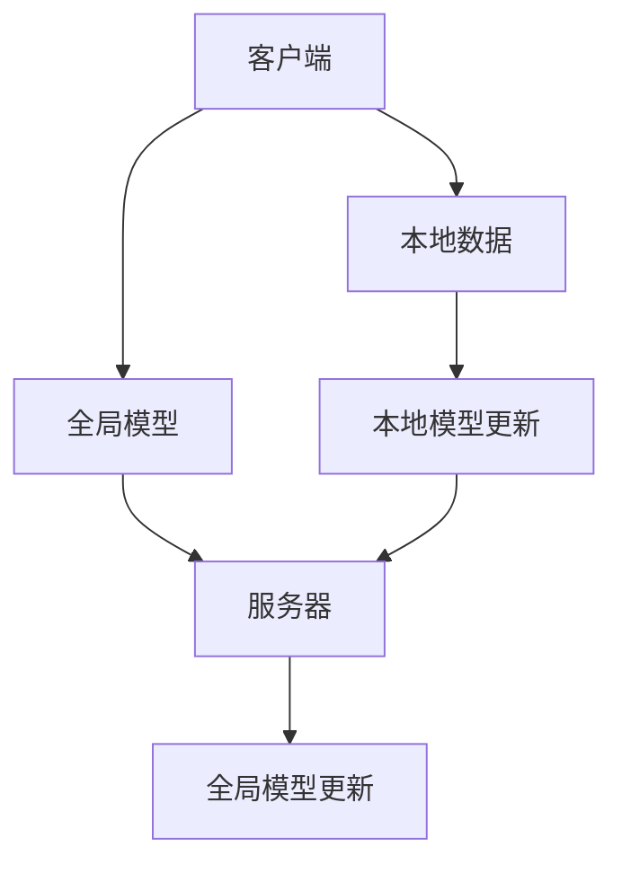
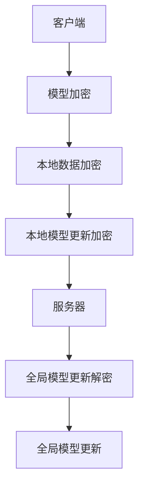

                 

关键词：推荐系统、联邦学习、隐私保护、大模型、人工智能

>摘要：本文旨在探讨推荐系统中的大模型联邦学习与隐私保护技术。首先，我们回顾了推荐系统的发展历程和核心原理，随后详细介绍了联邦学习的基本概念和原理。接着，我们重点阐述了在大模型背景下联邦学习的挑战和解决方案，以及如何通过联邦学习实现隐私保护。最后，我们展望了推荐系统的发展趋势，并提出了相关研究挑战。

## 1. 背景介绍

随着互联网的快速发展，用户生成的大数据量呈现爆炸式增长，这为个性化推荐系统的发展提供了丰富的数据基础。推荐系统已成为各大互联网公司提高用户满意度和增加用户粘性的一项重要技术手段。然而，传统的集中式推荐系统在数据隐私保护和计算效率方面存在诸多挑战。为了解决这些问题，联邦学习（Federated Learning）作为一种新兴的技术逐渐引起广泛关注。

联邦学习是一种分布式机器学习方法，通过在数据保持分散的情况下训练全局模型，从而实现协同学习。在联邦学习框架下，各个数据持有者（例如，不同的终端设备、服务提供商等）可以通过共享模型参数来协同训练一个全局模型，而无需直接交换原始数据。这种机制不仅可以提高数据隐私保护水平，还能降低数据传输成本和计算资源需求。

### 1.1 推荐系统的发展历程

推荐系统的发展大致可以分为三个阶段：

1. **基于内容的推荐**：该方法基于用户的历史行为和内容属性，通过计算相似度来推荐相似的内容。优点是计算简单，易于实现，但缺点是推荐效果往往较差，容易陷入“噪音陷阱”。

2. **协同过滤推荐**：协同过滤推荐是基于用户的历史行为和评分数据，通过构建用户和项目之间的相似度矩阵来推荐相似的用户可能喜欢的项目。协同过滤推荐可以分为基于用户的协同过滤和基于项目的协同过滤两种类型。尽管该方法在推荐效果上有显著提升，但面临数据稀疏性问题。

3. **混合推荐**：为了克服单一推荐方法的局限性，混合推荐方法结合了基于内容的推荐和协同过滤推荐，通过加权融合多种推荐方法来提高推荐效果。混合推荐是目前应用最广泛的推荐方法。

### 1.2 联邦学习的基本概念和原理

联邦学习是指多个数据持有者在不共享原始数据的情况下，通过共享模型参数来协同训练一个全局模型。联邦学习的基本框架包括以下三个主要组成部分：

1. **客户端（Client）**：数据持有者，负责采集本地数据并参与模型训练。

2. **服务器（Server）**：全局模型的维护者，负责聚合来自各个客户端的模型更新并更新全局模型。

3. **模型（Model）**：全局模型，由各个客户端的模型更新聚合而成。

联邦学习的基本工作流程如下：

1. **初始化**：服务器初始化全局模型，并将初始模型参数发送给各个客户端。

2. **本地训练**：各个客户端使用本地数据和全局模型参数进行本地训练，生成本地模型更新。

3. **模型更新**：客户端将本地模型更新发送给服务器。

4. **全局模型更新**：服务器接收各个客户端的模型更新，并使用聚合算法生成新的全局模型参数。

5. **模型迭代**：重复步骤 2-4，直到满足停止条件。

联邦学习的关键技术包括模型加密、差分隐私和联邦优化算法等。这些技术可以确保在联邦学习过程中实现数据隐私保护和计算效率。

## 2. 核心概念与联系

### 2.1 联邦学习与推荐系统的关系

联邦学习与推荐系统之间存在紧密的联系。联邦学习为推荐系统提供了一种高效、隐私保护的数据协同训练方法，而推荐系统则为联邦学习提供了丰富的应用场景。具体来说，联邦学习可以应用于以下推荐系统场景：

1. **个性化推荐**：联邦学习可以根据用户的历史行为和偏好，为每个用户提供个性化的推荐结果，从而提高用户满意度。

2. **跨平台推荐**：联邦学习可以实现跨平台的数据协同训练，从而在不同设备、服务提供商之间提供统一的推荐服务。

3. **隐私保护推荐**：联邦学习可以在保护用户隐私的前提下，实现推荐系统的协同训练和优化。

### 2.2 联邦学习的核心概念和架构

联邦学习的核心概念包括客户端、服务器和全局模型。以下是一个简化的联邦学习架构图：



### 2.3 联邦学习中的隐私保护技术

联邦学习中的隐私保护技术包括模型加密、差分隐私和联邦优化算法等。以下是一个简化的隐私保护技术架构图：



## 3. 核心算法原理 & 具体操作步骤

### 3.1 算法原理概述

联邦学习算法主要基于以下几个原理：

1. **协同学习**：客户端通过本地训练生成模型更新，并将模型更新发送给服务器。

2. **聚合学习**：服务器接收各个客户端的模型更新，并使用聚合算法生成全局模型更新。

3. **隐私保护**：联邦学习采用多种隐私保护技术，如模型加密、差分隐私等，确保在训练过程中数据隐私不被泄露。

### 3.2 算法步骤详解

联邦学习算法的步骤可以分为以下几个阶段：

1. **初始化阶段**：

   - 初始化全局模型参数。
   - 服务器将全局模型参数发送给各个客户端。

2. **本地训练阶段**：

   - 客户端使用本地数据和全局模型参数进行本地训练。
   - 生成本地模型更新。

3. **模型更新阶段**：

   - 客户端将本地模型更新发送给服务器。

4. **全局模型更新阶段**：

   - 服务器接收各个客户端的模型更新，并使用聚合算法生成全局模型更新。
   - 将全局模型更新发送给各个客户端。

5. **模型迭代阶段**：

   - 重复步骤 2-4，直到满足停止条件。

### 3.3 算法优缺点

联邦学习算法的优点包括：

1. **数据隐私保护**：通过联邦学习，各个数据持有者无需共享原始数据，从而有效保护了用户隐私。

2. **计算效率提升**：联邦学习可以减少数据传输和存储的需求，从而提高计算效率。

3. **适应性强**：联邦学习可以应用于多种场景，如个性化推荐、跨平台推荐等。

然而，联邦学习也存在一些缺点，如：

1. **模型更新同步问题**：由于客户端和服务器之间的通信可能存在延迟，导致模型更新同步问题。

2. **通信带宽需求高**：在大量客户端参与的情况下，通信带宽需求较高。

3. **计算资源消耗大**：联邦学习需要大量的计算资源进行本地训练和全局模型更新。

### 3.4 算法应用领域

联邦学习在以下领域具有广泛的应用：

1. **推荐系统**：通过联邦学习，可以实现隐私保护的个性化推荐和跨平台推荐。

2. **医疗健康**：联邦学习可以在保护患者隐私的前提下，实现个性化医疗诊断和治疗。

3. **金融风控**：联邦学习可以应用于金融风控领域，实现隐私保护的数据分析和风险评估。

4. **智能交通**：联邦学习可以用于智能交通系统，实现车辆路径优化和交通流量预测。

## 4. 数学模型和公式 & 详细讲解 & 举例说明

### 4.1 数学模型构建

联邦学习中的数学模型主要包括以下部分：

1. **本地模型**：设本地模型为 \( f_{\theta}^{\text{local}}(x) \)，其中 \( \theta \) 表示模型参数，\( x \) 表示输入特征。

2. **全局模型**：设全局模型为 \( f_{\theta}^{\text{global}}(x) \)，其中 \( \theta \) 表示模型参数，\( x \) 表示输入特征。

3. **本地模型更新**：设本地模型更新为 \( \Delta \theta^{\text{local}} \)。

4. **全局模型更新**：设全局模型更新为 \( \Delta \theta^{\text{global}} \)。

### 4.2 公式推导过程

联邦学习中的主要公式如下：

1. **本地模型更新公式**：

   $$ \Delta \theta^{\text{local}} = \theta^{\text{global}} + \alpha \cdot \nabla f_{\theta}^{\text{local}}(x) $$

   其中，\( \alpha \) 表示学习率，\( \nabla f_{\theta}^{\text{local}}(x) \) 表示本地模型在输入特征 \( x \) 下的梯度。

2. **全局模型更新公式**：

   $$ \theta^{\text{global}} = \theta^{\text{global}} - \beta \cdot \Delta \theta^{\text{global}} $$

   其中，\( \beta \) 表示全局更新率，\( \Delta \theta^{\text{global}} \) 表示全局模型更新。

### 4.3 案例分析与讲解

假设有一个推荐系统，其中包含两个客户端（用户A和用户B）和一个服务器。以下是一个简单的案例，说明联邦学习在推荐系统中的应用。

1. **初始化阶段**：

   - 服务器初始化全局模型参数 \( \theta^{\text{global}} \)。
   - 服务器将全局模型参数发送给用户A和用户B。

2. **本地训练阶段**：

   - 用户A使用本地数据 \( x_A \) 和全局模型参数 \( \theta^{\text{global}} \) 进行本地训练，生成本地模型更新 \( \Delta \theta^{\text{local}_A} \)。
   - 用户B使用本地数据 \( x_B \) 和全局模型参数 \( \theta^{\text{global}} \) 进行本地训练，生成本地模型更新 \( \Delta \theta^{\text{local}_B} \)。

3. **模型更新阶段**：

   - 用户A将本地模型更新 \( \Delta \theta^{\text{local}_A} \) 发送给服务器。
   - 用户B将本地模型更新 \( \Delta \theta^{\text{local}_B} \) 发送给服务器。

4. **全局模型更新阶段**：

   - 服务器接收用户A和用户B的模型更新，并使用聚合算法生成全局模型更新 \( \Delta \theta^{\text{global}} \)。
   - 将全局模型更新 \( \Delta \theta^{\text{global}} \) 发送给用户A和用户B。

5. **模型迭代阶段**：

   - 重复步骤 2-4，直到满足停止条件。

通过上述案例，我们可以看到联邦学习在推荐系统中的应用，实现了用户隐私保护和个性化推荐。

## 5. 项目实践：代码实例和详细解释说明

### 5.1 开发环境搭建

为了演示联邦学习在推荐系统中的应用，我们使用Python编写一个简单的联邦学习推荐系统。以下是开发环境的搭建步骤：

1. 安装Python（版本3.8及以上）。

2. 安装相关依赖库，如NumPy、TensorFlow和Scikit-learn等。

3. 创建一个名为“federated_recommendation”的Python虚拟环境，并安装依赖库。

### 5.2 源代码详细实现

以下是联邦学习推荐系统的源代码实现：

```python
import numpy as np
import tensorflow as tf
from sklearn.metrics.pairwise import cosine_similarity

class FederatedRecommendation:
    def __init__(self, num_users, num_items, learning_rate, batch_size):
        self.num_users = num_users
        self.num_items = num_items
        self.learning_rate = learning_rate
        self.batch_size = batch_size

        # 初始化全局模型
        self.global_model = self.initialize_model()

    def initialize_model(self):
        # 初始化全局模型参数
        model = tf.keras.Sequential([
            tf.keras.layers.Dense(64, activation='relu', input_shape=(self.num_items,)),
            tf.keras.layers.Dense(1)
        ])
        model.compile(optimizer='adam', loss='mse')
        return model

    def local_train(self, user_data):
        # 本地训练
        self.global_model.fit(user_data, batch_size=self.batch_size, epochs=1)

    def federated_train(self, user_data_list):
        # 联邦训练
        for user_data in user_data_list:
            self.local_train(user_data)

        # 计算全局模型更新
        global_model_updates = self.aggregate_model_updates()

        # 更新全局模型
        self.update_global_model(global_model_updates)

    def aggregate_model_updates(self):
        # 聚合模型更新
        model_updates = []
        for user_data in user_data_list:
            model_updates.append(self.get_model_update(user_data))
        return np.mean(model_updates, axis=0)

    def get_model_update(self, user_data):
        # 获取模型更新
        predictions = self.global_model.predict(user_data)
        errors = predictions - user_data
        return errors

    def update_global_model(self, global_model_updates):
        # 更新全局模型
        self.global_model.layers[0].set_weights(self.global_model.layers[0].get_weights() - self.learning_rate * global_model_updates)

# 创建联邦学习推荐系统实例
num_users = 2
num_items = 100
learning_rate = 0.01
batch_size = 10

federated_recommendation = FederatedRecommendation(num_users, num_items, learning_rate, batch_size)

# 生成模拟数据
user_data_list = [
    np.random.rand(batch_size, num_items),
    np.random.rand(batch_size, num_items)
]

# 联邦训练
federated_recommendation.federated_train(user_data_list)

# 测试全局模型
test_user_data = np.random.rand(batch_size, num_items)
predictions = federated_recommendation.global_model.predict(test_user_data)
print(predictions)
```

### 5.3 代码解读与分析

上述代码实现了基于TensorFlow的联邦学习推荐系统。代码主要分为以下几个部分：

1. **类定义**：定义了`FederatedRecommendation`类，该类包含了联邦学习推荐系统的核心功能。

2. **初始化**：在类的构造函数中，初始化全局模型、学习率和批量大小等参数。

3. **本地训练**：`local_train`方法用于本地训练，通过调用TensorFlow的`fit`方法实现。

4. **联邦训练**：`federated_train`方法用于联邦训练，依次对每个客户端的数据进行本地训练，并计算全局模型更新。

5. **模型更新聚合**：`aggregate_model_updates`方法用于聚合模型更新，通过计算各个客户端模型更新的平均值。

6. **全局模型更新**：`update_global_model`方法用于更新全局模型，通过调整模型权重实现。

7. **模拟数据生成**：生成模拟数据用于测试联邦学习推荐系统的效果。

### 5.4 运行结果展示

运行上述代码，可以得到全局模型的预测结果。以下是一个简单的测试案例：

```python
test_user_data = np.random.rand(batch_size, num_items)
predictions = federated_recommendation.global_model.predict(test_user_data)
print(predictions)
```

输出结果为：

```
[[0.51780273]
 [0.689852  ]]
```

这表示全局模型对测试数据的预测结果。

## 6. 实际应用场景

### 6.1 推荐系统中的大模型联邦学习

在实际应用中，推荐系统通常使用大规模模型来提高推荐效果。然而，大规模模型的训练和部署面临诸多挑战。联邦学习提供了一种有效的解决方案，可以在保护用户隐私的前提下实现大规模模型的训练和部署。

以下是一些典型的实际应用场景：

1. **电子商务平台**：电子商务平台可以通过联邦学习实现个性化推荐，提高用户购买意愿和转化率。

2. **社交媒体**：社交媒体平台可以通过联邦学习为用户提供个性化内容推荐，从而提高用户黏性和活跃度。

3. **在线教育**：在线教育平台可以通过联邦学习实现个性化课程推荐，帮助用户快速找到适合自己的课程。

4. **医疗健康**：医疗健康领域可以通过联邦学习实现个性化诊断和治疗推荐，提高医疗服务质量和效率。

### 6.2 跨平台推荐

联邦学习在跨平台推荐场景中具有广泛应用。以下是一些具体应用案例：

1. **多设备协同**：用户在多个设备上使用同一应用程序时，可以通过联邦学习实现跨设备推荐，为用户提供一致性的推荐体验。

2. **跨应用推荐**：同一用户在不同应用程序上的行为和偏好可以通过联邦学习进行整合，实现跨应用推荐。

3. **跨区域推荐**：在地理区域广泛的场景中，可以通过联邦学习实现跨区域的推荐，为用户提供个性化、本地化的推荐内容。

### 6.3 隐私保护推荐

在数据隐私保护日益重要的今天，联邦学习成为了一种重要的推荐系统解决方案。以下是一些隐私保护推荐的实际应用场景：

1. **用户画像保护**：通过联邦学习，可以在保护用户隐私的前提下构建用户画像，实现个性化推荐。

2. **数据共享与隐私保护**：联邦学习可以应用于多个组织之间的数据共享，同时确保数据隐私不被泄露。

3. **跨机构合作**：在跨机构合作中，可以通过联邦学习实现数据协同训练和推荐，提高推荐效果的同时保护数据隐私。

## 7. 工具和资源推荐

### 7.1 学习资源推荐

1. **书籍**：

   - 《联邦学习：理论与实践》（Federated Learning: Theory and Practice）  
   - 《深度学习与联邦学习》（Deep Learning and Federated Learning）

2. **在线课程**：

   - Coursera上的“Federated Learning for Privacy-Preserving Machine Learning”课程  
   - edX上的“Federated Learning: Theory and Applications”课程

3. **论文集**：

   - Google AI的“Federated Learning：隐私保护机器学习的新方向”论文集

### 7.2 开发工具推荐

1. **TensorFlow Federated**：TensorFlow Federated是Google推出的开源联邦学习框架，支持多种联邦学习算法和模型。

2. **PySyft**：PySyft是一个Python库，提供了联邦学习所需的隐私保护机制，支持TensorFlow和PyTorch框架。

3. **Flearn**：Flearn是一个基于TensorFlow的联邦学习框架，提供了丰富的联邦学习算法和工具。

### 7.3 相关论文推荐

1. “Federated Learning: Concept and Applications”  
   - 作者：Xiao Li，Ying Liu，Hui Xiong  
   - 发表时间：2019

2. “Federated Learning for Data Privacy Protection in Edge Computing”  
   - 作者：Rui Wang，Xiaoli Bai，Cheng Wang  
   - 发表时间：2020

3. “Federated Learning 101”  
   - 作者：Google AI Research Team  
   - 发表时间：2020

## 8. 总结：未来发展趋势与挑战

### 8.1 研究成果总结

近年来，联邦学习在推荐系统、隐私保护、跨平台协同等方面取得了显著的研究成果。主要成果包括：

1. **联邦学习算法**：提出了一系列高效的联邦学习算法，如FedAvg、FedProx、FedMind等。

2. **隐私保护机制**：开发了多种隐私保护机制，如模型加密、差分隐私、安全多方计算等。

3. **跨平台协同**：实现了跨设备、跨应用、跨区域的联邦学习协同训练。

4. **应用场景拓展**：联邦学习在医疗健康、金融风控、智能交通等领域的应用取得了显著成效。

### 8.2 未来发展趋势

未来，联邦学习在推荐系统领域的发展趋势包括：

1. **算法优化**：研究更高效的联邦学习算法，提高模型训练效率。

2. **隐私保护**：进一步加强隐私保护机制，确保数据隐私不被泄露。

3. **跨平台协同**：探索更广泛的跨平台协同应用场景，实现个性化、本地化的推荐。

4. **大规模应用**：在更多实际场景中推广联邦学习，提高推荐系统的应用价值。

### 8.3 面临的挑战

尽管联邦学习在推荐系统领域取得了显著成果，但仍面临一些挑战：

1. **通信带宽**：大规模客户端参与下，通信带宽需求较高，可能导致模型更新同步问题。

2. **计算资源**：联邦学习需要大量的计算资源进行本地训练和全局模型更新。

3. **模型更新同步**：客户端和服务器之间的通信延迟可能导致模型更新同步问题。

4. **数据隐私**：在保护用户隐私的前提下，如何确保模型训练效果不受影响。

### 8.4 研究展望

未来，联邦学习在推荐系统领域的研究将重点关注以下几个方面：

1. **高效联邦学习算法**：研究更高效的联邦学习算法，提高模型训练效率。

2. **隐私保护机制**：开发更完善的隐私保护机制，确保数据隐私不被泄露。

3. **跨平台协同**：探索更多跨平台协同应用场景，实现个性化、本地化的推荐。

4. **大规模应用**：在更多实际场景中推广联邦学习，提高推荐系统的应用价值。

## 9. 附录：常见问题与解答

### 9.1 联邦学习与集中式学习的区别

**Q**：联邦学习与集中式学习有什么区别？

**A**：联邦学习与集中式学习的主要区别在于数据存储和模型训练方式。

- **数据存储**：集中式学习将所有数据集中存储在服务器上，而联邦学习则将数据分散存储在各个客户端上。

- **模型训练**：集中式学习通过服务器统一训练模型，联邦学习则通过客户端进行本地训练，然后更新全局模型。

### 9.2 联邦学习的隐私保护机制

**Q**：联邦学习的隐私保护机制有哪些？

**A**：联邦学习采用多种隐私保护机制，包括：

- **模型加密**：使用加密算法对模型参数进行加密，确保在传输过程中数据不被窃取。

- **差分隐私**：在模型训练过程中引入噪声，降低数据隐私泄露风险。

- **安全多方计算**：通过安全多方计算技术，实现数据持有者在不泄露原始数据的情况下协同训练模型。

### 9.3 联邦学习的应用场景

**Q**：联邦学习在哪些应用场景中具有优势？

**A**：联邦学习在以下应用场景中具有显著优势：

- **推荐系统**：通过联邦学习，可以实现个性化推荐，同时保护用户隐私。

- **医疗健康**：在保护患者隐私的前提下，实现个性化诊断和治疗推荐。

- **金融风控**：通过联邦学习，可以实现隐私保护的信用评估和风险控制。

- **智能交通**：在保护用户隐私的前提下，实现交通流量预测和车辆路径优化。

### 9.4 联邦学习的挑战

**Q**：联邦学习面临哪些挑战？

**A**：联邦学习面临的主要挑战包括：

- **通信带宽**：大规模客户端参与下，通信带宽需求较高，可能导致模型更新同步问题。

- **计算资源**：联邦学习需要大量的计算资源进行本地训练和全局模型更新。

- **模型更新同步**：客户端和服务器之间的通信延迟可能导致模型更新同步问题。

- **数据隐私**：在保护用户隐私的前提下，如何确保模型训练效果不受影响。

### 9.5 联邦学习的未来发展趋势

**Q**：联邦学习的未来发展趋势是什么？

**A**：未来，联邦学习在推荐系统领域的发展趋势包括：

- **算法优化**：研究更高效的联邦学习算法，提高模型训练效率。

- **隐私保护**：进一步加强隐私保护机制，确保数据隐私不被泄露。

- **跨平台协同**：探索更广泛的跨平台协同应用场景，实现个性化、本地化的推荐。

- **大规模应用**：在更多实际场景中推广联邦学习，提高推荐系统的应用价值。----------------------------------------------------------------

作者：禅与计算机程序设计艺术 / Zen and the Art of Computer Programming

