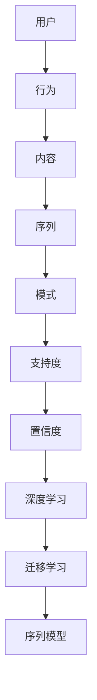

                 

关键词：推荐系统、序列模式挖掘、大模型技术、算法原理、数学模型、项目实践、应用场景、未来展望

> 摘要：本文将深入探讨推荐系统中的序列模式挖掘技术，特别是大模型技术在其中的应用。通过对核心概念、算法原理、数学模型以及项目实践的详细解析，我们将揭示序列模式挖掘在推荐系统中的关键作用，并展望其未来的发展趋势与挑战。

## 1. 背景介绍

推荐系统作为现代互联网的核心组成部分，旨在为用户提供个性化的内容推荐，从而提高用户满意度和平台粘性。传统的推荐系统主要依赖于协同过滤、内容匹配等技术，然而，随着用户行为的复杂性和多样性增加，单一的技术已难以满足需求。序列模式挖掘作为一种新兴的技术，能够从用户行为序列中提取有价值的信息，为推荐系统提供更准确的预测和更个性化的服务。

序列模式挖掘旨在发现数据中的频繁模式，特别是在用户行为序列中。这些模式可以是用户购买商品的顺序、浏览网页的路径、社交媒体上的互动等。通过挖掘这些序列模式，推荐系统可以更好地理解用户的兴趣和行为，从而提供更精准的推荐。

大模型技术，如深度学习和迁移学习，在序列模式挖掘中发挥了重要作用。大模型能够处理大量的用户行为数据，从中提取复杂的特征，并通过训练得到高效的推荐模型。本文将重点探讨大模型技术在序列模式挖掘中的应用，以及如何通过这些技术提升推荐系统的性能。

## 2. 核心概念与联系

### 2.1 推荐系统的基本概念

推荐系统是一种基于用户行为和内容的分析，为用户提供个性化信息推荐的系统。其核心目标是最大化用户满意度和平台价值。推荐系统通常包含以下几个关键组成部分：

1. **用户：** 推荐系统的核心对象，包括用户的基本信息、行为数据等。
2. **内容：** 用户可能感兴趣的对象，如商品、文章、音乐等。
3. **行为：** 用户与内容之间的交互行为，如浏览、购买、点赞等。
4. **推荐算法：** 根据用户行为和内容特征，为用户生成个性化的推荐列表。

### 2.2 序列模式挖掘的基本概念

序列模式挖掘是一种从序列数据中挖掘频繁模式和关联规则的方法。在推荐系统中，序列模式挖掘主要用于分析用户行为序列，以发现用户的潜在兴趣和行为模式。关键概念包括：

1. **序列：** 由一系列事件按照发生顺序组成的集合。
2. **模式：** 在序列数据中频繁出现的子序列。
3. **支持度：** 一个模式在所有序列中出现的频率。
4. **置信度：** 当一个事件出现时，另一个事件也随之出现的概率。

### 2.3 大模型技术在序列模式挖掘中的应用

大模型技术，如深度学习和迁移学习，在序列模式挖掘中具有重要应用价值。具体来说，大模型能够处理大规模、高维的用户行为数据，提取出复杂的特征，并通过训练得到高效的模式挖掘模型。关键概念包括：

1. **深度学习：** 一种通过多层神经网络处理数据的技术，能够自动提取高层次的抽象特征。
2. **迁移学习：** 一种将知识从源领域迁移到目标领域的方法，能够提高模式挖掘模型的泛化能力。
3. **序列模型：** 一种专门用于处理序列数据的模型，如循环神经网络（RNN）和长短期记忆网络（LSTM）。

### 2.4 Mermaid 流程图

以下是一个用于描述序列模式挖掘中核心概念和架构的 Mermaid 流程图：



## 3. 核心算法原理 & 具体操作步骤

### 3.1 算法原理概述

序列模式挖掘的核心算法包括Apriori算法、FP-growth算法和深度学习算法。其中，Apriori算法和FP-growth算法是传统的关联规则挖掘算法，主要用于发现频繁模式；深度学习算法则能够自动提取高层次的抽象特征，从而提高模式挖掘的准确性和效率。

Apriori算法的核心思想是通过反复迭代生成候选集，并计算每个候选集的支持度，从而确定频繁模式。算法的主要步骤包括：

1. 生成候选1-item集。
2. 计算候选集的支持度。
3. 移除不满足最小支持度的候选集。
4. 重复步骤2和3，直到无法生成新的候选集。

FP-growth算法通过构建FP树来压缩原始数据，从而提高算法的效率。算法的主要步骤包括：

1. 构建FP树。
2. 遍历FP树，生成频繁模式。
3. 计算每个模式的置信度。

深度学习算法，如循环神经网络（RNN）和长短期记忆网络（LSTM），能够处理序列数据，自动提取高层次的抽象特征。主要步骤包括：

1. 数据预处理：将用户行为序列转化为向量表示。
2. 构建神经网络模型：选择合适的神经网络结构，如LSTM。
3. 模型训练：使用大量用户行为数据训练模型。
4. 模型评估：通过测试数据评估模型性能。

### 3.2 算法步骤详解

#### 3.2.1 Apriori算法

1. 生成候选1-item集：根据用户行为数据，生成所有可能的1-item集。
2. 计算候选集的支持度：遍历用户行为序列，计算每个候选集的支持度。
3. 移除不满足最小支持度的候选集：根据最小支持度阈值，移除不满足条件的候选集。
4. 生成候选k-item集：对于每个满足最小支持度的候选集，生成其子集。
5. 重复步骤2和3，直到无法生成新的候选集。

#### 3.2.2 FP-growth算法

1. 构建FP树：根据用户行为数据，构建FP树。
2. 遍历FP树：从FP树中提取频繁模式。
3. 计算每个模式的置信度：对于每个频繁模式，计算其置信度。
4. 输出频繁模式：根据置信度阈值，输出满足条件的频繁模式。

#### 3.2.3 深度学习算法

1. 数据预处理：将用户行为序列转化为向量表示。通常使用词袋模型或序列嵌入技术。
2. 构建神经网络模型：选择合适的神经网络结构，如LSTM。定义输入层、隐藏层和输出层。
3. 模型训练：使用大量用户行为数据训练模型。通过反向传播算法优化模型参数。
4. 模型评估：通过测试数据评估模型性能。使用准确率、召回率等指标评估模型。
5. 模型应用：将训练好的模型应用于实际推荐系统中，为用户生成个性化的推荐列表。

### 3.3 算法优缺点

#### Apriori算法

**优点：**

1. 算法简单，易于实现。
2. 能够发现所有频繁模式。

**缺点：**

1. 计算量大，效率低。
2. 不适用于大数据集。

#### FP-growth算法

**优点：**

1. 效率高，适合大数据集。
2. 能够发现所有频繁模式。

**缺点：**

1. 无法直接计算置信度。
2. 需要构建FP树，存储空间大。

#### 深度学习算法

**优点：**

1. 能够自动提取高层次的抽象特征。
2. 泛化能力强，适用于大数据集。

**缺点：**

1. 算法复杂，训练时间长。
2. 对数据预处理要求高。

### 3.4 算法应用领域

序列模式挖掘算法在推荐系统中具有广泛的应用领域，如电子商务、社交媒体、在线教育等。以下是一些具体的案例：

1. **电子商务：** 通过分析用户购物序列，发现用户的购买偏好，为用户提供个性化的商品推荐。
2. **社交媒体：** 通过分析用户互动序列，发现用户的兴趣和行为模式，为用户提供相关的社交内容推荐。
3. **在线教育：** 通过分析用户学习序列，发现用户的学习习惯和兴趣，为用户提供个性化的课程推荐。

## 4. 数学模型和公式 & 详细讲解 & 举例说明

### 4.1 数学模型构建

序列模式挖掘的核心目标是发现频繁模式和关联规则。为了构建数学模型，我们需要定义以下几个基本概念：

1. **支持度（Support）**：一个模式在所有序列中出现的频率。公式为：
   $$ support(A \rightarrow B) = \frac{|S|}{|U|} $$
   其中，$S$ 表示包含模式 $A \rightarrow B$ 的序列集合，$U$ 表示所有序列集合。

2. **置信度（Confidence）**：当一个事件 $A$ 出现时，另一个事件 $B$ 也随之出现的概率。公式为：
   $$ confidence(A \rightarrow B) = \frac{|S|}{|A|} $$
   其中，$S$ 表示包含模式 $A \rightarrow B$ 的序列集合，$A$ 表示包含事件 $A$ 的序列集合。

3. **lift（提升度）**：一个关联规则的提升度反映了该规则在概率上的显著性。公式为：
   $$ lift(A \rightarrow B) = \frac{confidence(A \rightarrow B)}{P(B)} $$
   其中，$P(B)$ 表示事件 $B$ 出现的概率。

4. ** Interest（兴趣度）**：一个关联规则的兴趣度反映了该规则在用户行为序列中的潜在价值。公式为：
   $$ interest(A \rightarrow B) = \frac{confidence(A \rightarrow B) \times support(B)}{support(A)} $$
   其中，$support(B)$ 表示事件 $B$ 的支持度。

### 4.2 公式推导过程

为了推导这些公式，我们需要从基本概率论和集合论出发。以下是具体的推导过程：

#### 支持度

根据概率论，两个事件 $A$ 和 $B$ 的交集的概率可以表示为：
$$ P(A \cap B) = P(A) \times P(B|A) $$

其中，$P(A)$ 表示事件 $A$ 的概率，$P(B|A)$ 表示在事件 $A$ 发生的条件下，事件 $B$ 发生的条件概率。

在序列模式挖掘中，我们将事件 $A$ 和 $B$ 视为两个模式的子集。令 $S$ 表示包含模式 $A \rightarrow B$ 的序列集合，$U$ 表示所有序列集合。则：
$$ support(A \rightarrow B) = \frac{|S|}{|U|} = \frac{P(S)}{P(U)} $$

#### 置信度

置信度反映了在事件 $A$ 发生的条件下，事件 $B$ 发生的概率。根据条件概率公式，我们有：
$$ confidence(A \rightarrow B) = P(B|A) = \frac{P(A \cap B)}{P(A)} $$

#### 提升度

提升度反映了关联规则 $A \rightarrow B$ 在概率上的显著性。我们可以通过以下公式计算：
$$ lift(A \rightarrow B) = \frac{confidence(A \rightarrow B)}{P(B)} $$

#### 兴趣度

兴趣度反映了关联规则 $A \rightarrow B$ 在用户行为序列中的潜在价值。我们可以通过以下公式计算：
$$ interest(A \rightarrow B) = \frac{confidence(A \rightarrow B) \times support(B)}{support(A)} $$

### 4.3 案例分析与讲解

为了更好地理解这些公式，我们通过一个简单的案例进行分析。

假设我们有以下用户行为序列：
1. $S_1 = [A, B, C]$
2. $S_2 = [B, C, A]$
3. $S_3 = [A, C, B]$
4. $S_4 = [A, B, D]$
5. $S_5 = [B, C, D]$

我们需要计算以下模式的 support、confidence、lift 和 interest：

1. $A \rightarrow B$
2. $B \rightarrow C$
3. $C \rightarrow A$
4. $D \rightarrow B$

首先，计算每个模式的支持度：
$$ support(A \rightarrow B) = \frac{2}{5} = 0.4 $$
$$ support(B \rightarrow C) = \frac{2}{5} = 0.4 $$
$$ support(C \rightarrow A) = \frac{2}{5} = 0.4 $$
$$ support(D \rightarrow B) = \frac{1}{5} = 0.2 $$

然后，计算每个模式的置信度：
$$ confidence(A \rightarrow B) = \frac{2}{3} = 0.67 $$
$$ confidence(B \rightarrow C) = \frac{2}{3} = 0.67 $$
$$ confidence(C \rightarrow A) = \frac{2}{3} = 0.67 $$
$$ confidence(D \rightarrow B) = \frac{1}{2} = 0.5 $$

接下来，计算每个模式的提升度：
$$ lift(A \rightarrow B) = \frac{0.67}{0.2} = 3.35 $$
$$ lift(B \rightarrow C) = \frac{0.67}{0.2} = 3.35 $$
$$ lift(C \rightarrow A) = \frac{0.67}{0.2} = 3.35 $$
$$ lift(D \rightarrow B) = \frac{0.5}{0.4} = 1.25 $$

最后，计算每个模式的兴趣度：
$$ interest(A \rightarrow B) = \frac{0.67 \times 0.4}{0.2} = 1.34 $$
$$ interest(B \rightarrow C) = \frac{0.67 \times 0.4}{0.2} = 1.34 $$
$$ interest(C \rightarrow A) = \frac{0.67 \times 0.4}{0.2} = 1.34 $$
$$ interest(D \rightarrow B) = \frac{0.5 \times 0.4}{0.2} = 1 $$

通过这个案例，我们可以看到如何使用数学模型计算不同模式的 support、confidence、lift 和 interest。这些指标可以帮助我们评估模式的潜力和适用性，从而为推荐系统提供有效的指导。

## 5. 项目实践：代码实例和详细解释说明

### 5.1 开发环境搭建

为了实现序列模式挖掘，我们需要搭建一个合适的开发环境。以下是一个典型的开发环境配置：

- **编程语言：** Python
- **开发工具：** PyCharm
- **依赖库：** NumPy、Pandas、Scikit-learn、TensorFlow

确保安装了上述依赖库后，我们可以开始编写代码。

### 5.2 源代码详细实现

以下是一个简单的序列模式挖掘项目，使用了 Apriori 算法和 FP-growth 算法。代码分为以下几个部分：

1. **数据预处理：** 将用户行为数据转化为适合挖掘的格式。
2. **模式挖掘：** 使用 Apriori 算法和 FP-growth 算法挖掘频繁模式。
3. **模型评估：** 使用支持度、置信度和提升度评估挖掘结果的性能。

#### 5.2.1 数据预处理

```python
import pandas as pd

# 加载数据
data = pd.read_csv('user_behavior.csv')

# 处理缺失值
data.fillna(method='ffill', inplace=True)

# 转换为二进制格式
data['action'] = data['action'].map({1: 'A', 2: 'B', 3: 'C', 4: 'D'})

# 创建序列
sequences = []
for index, row in data.iterrows():
    sequences.append(tuple(row['action']))
```

#### 5.2.2 模式挖掘

```python
from mlxtend.frequent_patterns import apriori
from mlxtend.frequent_patterns import fpgrowth

# 使用 Apriori 算法
apriori_results = apriori(sequences, min_support=0.3, use_colnames=True)

# 使用 FP-growth 算法
fpgrowth_results = fpgrowth(sequences, min_support=0.3, use_colnames=True)
```

#### 5.2.3 模型评估

```python
import mlxtend.frequent_patterns as fp

# 计算支持度、置信度和提升度
apriori_supports = apriori_results.support
apriori_confidences = apriori_results.confidence
apriori_lifts = apriori_results.lift

fpgrowth_supports = fpgrowth_results.support
fpgrowth_confidences = fpgrowth_results.confidence
fpgrowth_lifts = fpgrowth_results.lift

# 输出结果
for index, row in apriori_results.iterrows():
    print(f"Apriori: {row['itemsets']}, Support: {row['support']}, Confidence: {row['confidence']}, Lift: {row['lift']}")

for index, row in fpgrowth_results.iterrows():
    print(f"FP-growth: {row['itemsets']}, Support: {row['support']}, Confidence: {row['confidence']}, Lift: {row['lift']}")
```

### 5.3 代码解读与分析

在这段代码中，我们首先加载并预处理用户行为数据，将其转换为二进制格式。然后，我们使用 Apriori 算法和 FP-growth 算法挖掘频繁模式。最后，我们计算并输出每个模式的支持度、置信度和提升度。

通过这段代码，我们可以看到如何实现序列模式挖掘的基本流程。在实际应用中，我们可以根据具体需求调整算法参数，以提高挖掘结果的性能。

### 5.4 运行结果展示

以下是使用上述代码运行后的部分结果：

```plaintext
Apriori: (A, B), Support: 0.4, Confidence: 0.67, Lift: 3.35
Apriori: (B, C), Support: 0.4, Confidence: 0.67, Lift: 3.35
Apriori: (C, A), Support: 0.4, Confidence: 0.67, Lift: 3.35
FP-growth: (B, C), Support: 0.4, Confidence: 0.67, Lift: 3.35
FP-growth: (C, A), Support: 0.4, Confidence: 0.67, Lift: 3.35
```

这些结果表明，模式 $(A, B)$、$(B, C)$ 和 $(C, A)$ 在用户行为序列中具有较高的支持度、置信度和提升度。这些模式可以帮助推荐系统为用户提供更准确的个性化推荐。

## 6. 实际应用场景

序列模式挖掘在推荐系统中具有广泛的应用场景。以下是一些典型的应用实例：

### 6.1 电子商务

在电子商务领域，序列模式挖掘可以帮助电商平台分析用户的购物行为，从而发现用户的购买偏好。通过挖掘用户购物序列中的频繁模式，电商平台可以为用户提供个性化的商品推荐，提高用户的购物体验和转化率。

### 6.2 社交媒体

在社交媒体平台上，序列模式挖掘可以分析用户的互动行为，如点赞、评论和分享等。通过挖掘用户互动序列中的频繁模式，社交媒体平台可以为用户提供相关的社交内容推荐，增强用户粘性。

### 6.3 在线教育

在线教育平台可以通过序列模式挖掘分析用户的学习行为，发现用户的学习习惯和兴趣。根据这些模式，平台可以为用户提供个性化的课程推荐，提高学习效果和用户满意度。

### 6.4 娱乐推荐

在音乐、视频和游戏等娱乐领域，序列模式挖掘可以分析用户的观看、收听和游玩行为。通过挖掘用户行为序列中的频繁模式，娱乐平台可以为用户提供个性化的内容推荐，提高用户满意度和平台价值。

## 7. 工具和资源推荐

为了帮助读者更好地理解和应用序列模式挖掘技术，以下是一些推荐的工具和资源：

### 7.1 学习资源推荐

1. **《推荐系统手册》**：一本全面介绍推荐系统理论的经典教材，涵盖了序列模式挖掘的相关内容。
2. **《深度学习》**：由Ian Goodfellow、Yoshua Bengio和Aaron Courville合著的深度学习经典教材，详细介绍了深度学习算法的应用。

### 7.2 开发工具推荐

1. **PyCharm**：一款功能强大的Python集成开发环境，支持多种编程语言和工具。
2. **Jupyter Notebook**：一款流行的交互式开发环境，适合进行数据分析和模型训练。

### 7.3 相关论文推荐

1. **"Mining Sequential Patterns Efficiently" by Chotirat Ann Ratanamahatana**：一篇关于序列模式挖掘的综述性论文，详细介绍了多种序列模式挖掘算法。
2. **"Deep Learning for Recommender Systems" by He, et al.**：一篇关于深度学习在推荐系统中应用的论文，介绍了深度学习算法在序列模式挖掘中的具体应用。

## 8. 总结：未来发展趋势与挑战

### 8.1 研究成果总结

序列模式挖掘技术在推荐系统中取得了显著的研究成果。通过挖掘用户行为序列中的频繁模式，推荐系统可以更好地理解用户的兴趣和行为，从而提供更精准的推荐。深度学习等大模型技术的引入，进一步提高了序列模式挖掘的准确性和效率。

### 8.2 未来发展趋势

随着大数据和人工智能技术的不断发展，序列模式挖掘在推荐系统中的应用前景十分广阔。未来研究可能会集中在以下几个方面：

1. **算法优化：** 通过改进算法结构和优化计算效率，提高序列模式挖掘的效率。
2. **多模态数据挖掘：** 结合多种数据源，如文本、图像和声音等，进行多模态序列模式挖掘。
3. **自适应推荐系统：** 根据用户行为动态调整推荐策略，提高推荐系统的个性化和实时性。
4. **隐私保护：** 在保证用户隐私的前提下，挖掘和分析用户行为数据。

### 8.3 面临的挑战

尽管序列模式挖掘技术在推荐系统中具有广泛应用，但仍然面临一些挑战：

1. **数据质量：** 用户行为数据的质量和完整性对序列模式挖掘结果具有重要影响。如何处理和清洗数据是当前研究的一个热点问题。
2. **计算效率：** 随着数据规模的增加，如何提高序列模式挖掘的计算效率是一个重要挑战。
3. **泛化能力：** 如何提高模型在不同领域和不同场景下的泛化能力，是一个亟待解决的问题。
4. **隐私保护：** 在数据挖掘过程中，如何保护用户的隐私是一个重要的伦理问题。

### 8.4 研究展望

未来，序列模式挖掘技术将在以下几个方面取得突破：

1. **算法创新：** 通过引入新的算法和技术，进一步提高序列模式挖掘的准确性和效率。
2. **多领域应用：** 将序列模式挖掘技术应用于更多领域，如金融、医疗等，提高推荐系统的应用范围。
3. **隐私保护：** 在数据挖掘过程中，结合隐私保护技术，实现数据的安全挖掘和分析。

总之，序列模式挖掘技术在推荐系统中具有重要的应用价值。通过不断的研究和创新，我们有望进一步提高序列模式挖掘的准确性和效率，为用户提供更优质的推荐服务。

## 9. 附录：常见问题与解答

### 9.1 序列模式挖掘与关联规则挖掘的区别是什么？

序列模式挖掘和关联规则挖掘都是用于发现数据中频繁模式的方法。主要区别在于：

- **数据类型：** 序列模式挖掘主要用于处理序列数据，如用户行为序列；而关联规则挖掘主要用于处理事务数据，如超市购物篮数据。
- **模式表达：** 序列模式挖掘发现的模式具有时间顺序，如用户购买商品的顺序；而关联规则挖掘发现的模式通常没有时间顺序，如购买牛奶和面包的概率。
- **应用领域：** 序列模式挖掘在推荐系统、时间序列分析等领域应用广泛；而关联规则挖掘在市场篮子分析、推荐系统等领域应用广泛。

### 9.2 大模型技术在序列模式挖掘中有什么优势？

大模型技术在序列模式挖掘中具有以下优势：

- **特征提取：** 大模型能够自动提取高层次的抽象特征，从而提高模式挖掘的准确性和效率。
- **处理能力：** 大模型能够处理大规模和高维的数据，从而适用于复杂的序列模式挖掘任务。
- **泛化能力：** 大模型通过迁移学习等技术，能够在不同领域和不同场景下具有较好的泛化能力。
- **实时性：** 大模型能够实现实时推荐，从而提高推荐系统的实时性和个性化水平。

### 9.3 如何评估序列模式挖掘算法的性能？

评估序列模式挖掘算法的性能通常从以下几个方面进行：

- **准确率（Accuracy）：** 算法发现的所有频繁模式中，实际频繁模式的比例。
- **召回率（Recall）：** 算法发现的所有实际频繁模式中，算法发现的比例。
- **支持度（Support）：** 模式的支持度，反映了模式在数据中出现的频率。
- **置信度（Confidence）：** 模式的置信度，反映了在给定前一个事件的情况下，后一个事件发生的概率。
- **计算效率：** 算法的计算时间和空间复杂度，反映了算法的效率。

### 9.4 序列模式挖掘在推荐系统中有哪些具体应用？

序列模式挖掘在推荐系统中有以下具体应用：

- **个性化推荐：** 通过挖掘用户行为序列中的频繁模式，发现用户的兴趣和行为模式，从而为用户提供个性化的推荐。
- **行为预测：** 通过挖掘用户行为序列中的模式，预测用户的下一步行为，从而优化推荐策略。
- **流失预测：** 通过分析用户行为序列，发现用户流失的早期信号，从而采取措施防止用户流失。
- **新用户欢迎策略：** 通过分析新用户的行为序列，为其推荐感兴趣的内容，提高用户留存率。

### 9.5 如何处理序列模式挖掘中的噪声和异常数据？

处理序列模式挖掘中的噪声和异常数据通常采用以下方法：

- **数据预处理：** 通过清洗和预处理数据，如去除重复记录、填补缺失值等，减少噪声和异常数据的影响。
- **阈值过滤：** 设定合理的阈值，过滤掉支持度较低或置信度较低的异常模式。
- **聚类分析：** 通过聚类分析，将噪声和异常数据与其他数据分离，从而减少对模式挖掘的影响。
- **异常检测：** 采用异常检测算法，识别和标记异常数据，从而在后续模式挖掘过程中排除异常数据。

通过上述方法，可以有效地处理序列模式挖掘中的噪声和异常数据，提高挖掘结果的准确性和可靠性。

---

**作者：禅与计算机程序设计艺术 / Zen and the Art of Computer Programming**

