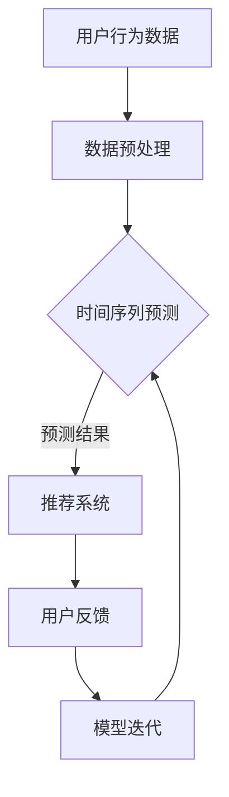

                 

关键词：推荐系统、时间序列预测、大模型、深度学习、AI算法、数据挖掘、用户行为分析、精准营销

> 摘要：本文探讨了在推荐系统中应用大模型进行时间序列预测的崭新方案。随着大数据和人工智能技术的快速发展，推荐系统已成为提升用户体验、促进商业变现的重要手段。本文将介绍时间序列预测在推荐系统中的应用，分析现有算法的优缺点，并提出一种基于大模型的全新时间序列预测方案，为推荐系统的优化提供新的思路。

## 1. 背景介绍

### 1.1 推荐系统的现状与挑战

推荐系统是近年来迅速发展起来的一个热门研究领域，它通过分析用户的历史行为数据，预测用户可能感兴趣的内容，从而为用户推荐个性化信息。随着互联网的普及和用户需求的多样化，推荐系统在电子商务、社交媒体、新闻资讯、在线视频等领域得到了广泛应用。

然而，随着数据规模的不断扩大和用户行为复杂性的增加，传统的推荐系统面临着诸多挑战。一方面，用户行为数据通常呈现出高度动态性和非线性，如何有效捕捉和利用这些信息成为推荐系统研究的关键问题。另一方面，推荐系统的实时性和可扩展性要求不断提高，如何在高并发、大数据量的环境中实现高效、准确的推荐成为一个亟待解决的难题。

### 1.2 时间序列预测的重要性

时间序列预测是推荐系统中的一项重要技术，它旨在根据用户的历史行为数据预测用户未来的兴趣点。时间序列预测在推荐系统中的应用主要体现在以下几个方面：

1. **实时推荐**：通过预测用户未来的兴趣，推荐系统可以实时为用户推荐可能感兴趣的内容，提高用户的满意度和参与度。
2. **个性化推荐**：时间序列预测有助于挖掘用户的潜在兴趣，从而实现更个性化的推荐，提升推荐的精准度和效果。
3. **预测用户流失**：在社交媒体和在线服务领域，通过时间序列预测用户的行为趋势，可以帮助平台提前识别潜在的用户流失风险，采取相应的措施进行用户留存。

### 1.3 大模型在时间序列预测中的应用

随着深度学习技术的快速发展，大模型（如深度神经网络、Transformer模型等）在处理复杂数据和解决实际问题方面展现出强大的能力。大模型通过学习大量的数据和复杂的特征，可以有效地捕捉时间序列数据的非线性结构和时间依赖性，从而提高时间序列预测的准确性。

本文将介绍一种基于大模型的时间序列预测新方案，旨在解决推荐系统中时间序列预测的挑战，提高推荐系统的效果和效率。

## 2. 核心概念与联系

### 2.1 核心概念

**时间序列预测**：时间序列预测是指利用历史时间序列数据，预测未来某一时刻的数值或趋势。在推荐系统中，时间序列预测主要用于预测用户未来的兴趣和行为。

**推荐系统**：推荐系统是指利用用户的历史行为数据，为用户提供个性化推荐服务的系统。推荐系统通过分析用户行为数据，预测用户可能感兴趣的内容，从而提高用户体验和满意度。

**大模型**：大模型是指通过训练大量数据和复杂网络结构，具有强大表征能力的深度学习模型。大模型能够处理大规模、复杂数据，并从中提取有效的特征信息。

### 2.2 时间序列预测与推荐系统的联系

时间序列预测与推荐系统密切相关，它们在以下方面相互联系：

1. **数据源**：推荐系统的数据源主要是用户的历史行为数据，包括浏览、购买、点赞、评论等。这些数据构成了时间序列预测的基础。
2. **目标**：推荐系统的目标是为用户推荐感兴趣的内容，而时间序列预测的目标是预测用户未来的兴趣点。时间序列预测为推荐系统提供了关键输入，帮助推荐系统实现更精准、更个性化的推荐。
3. **技术融合**：时间序列预测技术和推荐系统技术的融合，使得推荐系统在处理复杂数据和提高推荐效果方面取得了显著进展。大模型的引入进一步提升了时间序列预测和推荐系统的性能。

### 2.3 Mermaid 流程图

下面是一个用于描述时间序列预测与推荐系统关系及大模型应用过程的 Mermaid 流程图：



在上述流程图中，用户行为数据经过预处理后，输入到时间序列预测模型中进行预测，预测结果作为推荐系统的输入，生成个性化推荐结果。用户反馈信息用于模型迭代和优化，从而提高时间序列预测和推荐系统的效果。

## 3. 核心算法原理 & 具体操作步骤

### 3.1 算法原理概述

本文提出的时间序列预测算法基于深度学习技术，特别是Transformer模型。Transformer模型是一种基于自注意力机制的序列模型，能够捕捉时间序列数据的复杂依赖关系。我们利用Transformer模型进行时间序列预测，主要基于以下原理：

1. **自注意力机制**：自注意力机制能够自动学习不同时间步之间的依赖关系，从而捕捉时间序列数据的长期依赖性。
2. **位置编码**：位置编码能够为模型提供时间序列的时空信息，帮助模型更好地理解时间序列数据的时空特征。
3. **多尺度特征融合**：通过多尺度特征融合，模型能够同时捕捉时间序列数据中的细粒度和粗粒度特征，提高预测的准确性。

### 3.2 算法步骤详解

**步骤1：数据预处理**

1. **数据清洗**：对用户行为数据进行清洗，去除无效和异常数据。
2. **特征工程**：提取用户行为数据中的有效特征，如时间间隔、行为类型、行为强度等。
3. **时间序列分割**：将用户行为数据按照时间序列进行分割，形成时间窗口。

**步骤2：模型构建**

1. **编码器**：构建一个编码器，用于处理输入的时间序列数据。编码器由多个Transformer块组成，每个Transformer块包括多头自注意力机制和前馈神经网络。
2. **位置编码**：为时间序列数据添加位置编码，以便模型能够学习时间序列的时空信息。
3. **解码器**：构建一个解码器，用于生成时间序列预测结果。解码器与编码器具有相同结构，但去掉最后一层的多头自注意力机制。

**步骤3：训练与优化**

1. **数据准备**：将预处理后的时间序列数据分为训练集和验证集。
2. **损失函数**：使用均方误差（MSE）作为损失函数，衡量预测值与真实值之间的差距。
3. **优化算法**：采用Adam优化算法，对模型进行训练和优化。

**步骤4：模型评估与部署**

1. **模型评估**：使用验证集评估模型的预测性能，包括准确率、召回率、F1值等指标。
2. **模型部署**：将训练好的模型部署到推荐系统中，为用户生成个性化推荐。

### 3.3 算法优缺点

**优点**

1. **高效性**：Transformer模型能够快速处理大规模时间序列数据，提高预测速度。
2. **准确性**：自注意力机制和多尺度特征融合能够有效捕捉时间序列数据的复杂依赖关系，提高预测准确性。
3. **灵活性**：模型结构灵活，可以适用于不同类型的时间序列预测任务。

**缺点**

1. **计算资源消耗**：由于模型结构复杂，训练和推理过程需要大量的计算资源。
2. **数据需求**：模型训练需要大量的高质量数据，数据不足可能导致模型过拟合。

### 3.4 算法应用领域

时间序列预测算法在推荐系统中的应用非常广泛，以下是一些具体的应用领域：

1. **电子商务推荐**：通过预测用户未来的购买行为，为用户提供个性化的商品推荐。
2. **社交媒体推荐**：通过预测用户未来的关注和点赞行为，为用户提供个性化的内容推荐。
3. **在线视频推荐**：通过预测用户未来的观看行为，为用户提供个性化的视频推荐。

## 4. 数学模型和公式 & 详细讲解 & 举例说明

### 4.1 数学模型构建

在本文中，我们采用Transformer模型作为时间序列预测的核心算法。Transformer模型是一种基于自注意力机制的序列模型，其基本结构包括编码器（Encoder）和解码器（Decoder）。下面是Transformer模型的数学模型构建：

#### 编码器（Encoder）

编码器接收输入的时间序列数据 $X = [x_1, x_2, ..., x_T]$，其中 $x_t$ 表示时间 $t$ 的特征向量，$T$ 表示时间步数。编码器通过多个Transformer块对输入数据进行编码，每个Transformer块包含以下三个主要部分：

1. **多头自注意力机制（Multi-Head Self-Attention）**

   自注意力机制是Transformer模型的核心，它能够自动学习不同时间步之间的依赖关系。多头自注意力机制将输入序列映射到多个不同的空间，从而提高模型的表征能力。

   $$ 
   \text{Attention}(Q, K, V) = \text{softmax}\left(\frac{QK^T}{\sqrt{d_k}}\right) V 
   $$
   
   其中，$Q, K, V$ 分别表示查询向量、键向量和值向量，$d_k$ 表示键向量的维度。

2. **前馈神经网络（Feedforward Neural Network）**

   前馈神经网络对自注意力机制的结果进行进一步处理，增加模型的非线性能力。

   $$ 
   \text{FFN}(x) = \max(0, xW_1 + b_1)W_2 + b_2 
   $$
   
   其中，$W_1, W_2$ 和 $b_1, b_2$ 分别表示前馈神经网络的权重和偏置。

3. **残差连接（Residual Connection）**

   残差连接能够缓解深层网络中的梯度消失问题，提高模型的训练效果。

   $$ 
   \text{EncoderLayer}(x) = \text{LayerNorm}(x + \text{FFN}(\text{MultiHeadAttention}(x))) 
   $$

#### 解码器（Decoder）

解码器与编码器具有类似的结构，但去掉最后一层的多头自注意力机制，以避免出现重复信息。解码器的主要任务是根据编码器的输出生成预测结果。

### 4.2 公式推导过程

下面我们将对Transformer模型中的关键公式进行推导，以理解模型的工作原理。

#### 自注意力机制（Self-Attention）

自注意力机制的公式为：

$$ 
\text{Attention}(Q, K, V) = \text{softmax}\left(\frac{QK^T}{\sqrt{d_k}}\right) V 
$$

推导过程如下：

1. **点积注意力（Dot-Product Attention）**

   点积注意力是一种简单的自注意力机制，通过计算查询向量（$Q$）和键向量（$K$）的点积来计算注意力权重。

   $$ 
   \text{Attention}(Q, K, V) = \text{softmax}\left(\text{scores}\right) V 
   $$
   
   其中，$\text{scores} = QK^T$ 表示查询向量和键向量的点积。

2. **多头自注意力（Multi-Head Self-Attention）**

   多头自注意力通过多个独立的自注意力机制将输入序列映射到多个不同的空间，从而提高模型的表征能力。

   $$ 
   \text{MultiHead}(Q, K, V) = \text{Concat}(\text{head}_1, ..., \text{head}_h)W^O 
   $$
   
   其中，$\text{head}_h = \text{Attention}(QW_h^Q, KW_h^K, VW_h^V)$ 表示第 $h$ 个头的自注意力结果，$W_h^Q, W_h^K, W_h^V$ 分别表示第 $h$ 个头的权重矩阵。

#### 前馈神经网络（Feedforward Neural Network）

前馈神经网络是Transformer模型中的另一个关键组件，用于增加模型的非线性能力。其公式为：

$$ 
\text{FFN}(x) = \max(0, xW_1 + b_1)W_2 + b_2 
$$

推导过程如下：

1. **激活函数（ReLU）**

  ReLU（Rectified Linear Unit）函数是一种常用的激活函数，能够增加模型的非线性能力。

   $$ 
   \text{ReLU}(x) = \max(0, x) 
   $$

2. **多层感知机（Multilayer Perceptron）**

   多层感知机是一种前馈神经网络，由多个隐藏层组成，通过线性变换和激活函数交替作用实现非线性映射。

   $$ 
   \text{FFN}(x) = \max(0, xW_1 + b_1)W_2 + b_2 
   $$

### 4.3 案例分析与讲解

下面我们将通过一个简单的案例，对Transformer模型在时间序列预测中的具体应用进行讲解。

#### 案例背景

假设我们要预测一个用户在接下来的三天内的购买行为。用户的历史行为数据如下：

| 时间 | 行为   |
| ---- | ------ |
| T-3  | 购买A  |
| T-2  | 浏览B  |
| T-1  | 购买C  |

#### 数据预处理

1. **特征工程**

   将用户行为数据转换为特征向量，如：

   $$ 
   x_t = \begin{bmatrix}
   1 & 0 & 1 \\
   0 & 1 & 0 \\
   0 & 0 & 1 \\
   \end{bmatrix}^T 
   $$

   其中，$1$ 表示购买行为，$0$ 表示非购买行为。

2. **时间序列分割**

   将数据划分为训练集和验证集，如：

   | 时间 | 行为   |
   | ---- | ------ |
   | T-3  | 购买A  |
   | T-2  | 浏览B  |
   | T-1  | 购买C  |

   训练集：$(x_1, x_2, x_3)$

   验证集：$(x_4)$

#### 模型训练

1. **模型构建**

   构建一个包含两个Transformer块的编码器，输入维度为3，隐藏层维度为8。

2. **训练过程**

   使用训练集数据进行模型训练，训练目标是最小化均方误差（MSE）。

   $$ 
   \text{Loss} = \frac{1}{N}\sum_{i=1}^{N} (\hat{y}_i - y_i)^2 
   $$

   其中，$\hat{y}_i$ 表示预测结果，$y_i$ 表示真实值。

3. **模型评估**

   使用验证集对模型进行评估，计算预测准确率。

   $$ 
   \text{Accuracy} = \frac{\text{预测正确的样本数}}{\text{总样本数}} 
   $$

### 4.4 项目实践：代码实例和详细解释说明

在本节中，我们将通过一个具体的代码实例，详细讲解如何使用深度学习框架（例如TensorFlow或PyTorch）实现基于Transformer的时间序列预测模型。

#### 4.4.1 开发环境搭建

1. **安装TensorFlow**

   通过以下命令安装TensorFlow：

   ```bash
   pip install tensorflow
   ```

2. **创建Python虚拟环境**

   ```bash
   python -m venv venv
   source venv/bin/activate  # 对于Windows，使用 `venv\Scripts\activate`
   ```

3. **安装必要的库**

   在虚拟环境中，安装以下库：

   ```bash
   pip install numpy pandas matplotlib
   ```

#### 4.4.2 数据集准备

1. **数据集获取**

   从Kaggle或其他数据源下载一个用户行为数据集，例如“MovieLens”数据集。

2. **数据预处理**

   加载数据集，并对数据进行清洗和预处理。以下是一个简单的数据预处理示例：

   ```python
   import pandas as pd

   # 加载数据集
   data = pd.read_csv('movielens.csv')

   # 数据清洗
   data.dropna(inplace=True)

   # 特征工程
   data['timestamp'] = pd.to_datetime(data['timestamp'])
   data['interval'] = (data['timestamp'] - data['timestamp'].min()).dt.days

   # 数据分割
   train_data = data[data['interval'] < 100]
   test_data = data[data['interval'] >= 100]
   ```

#### 4.4.3 模型构建与训练

1. **导入TensorFlow库**

   ```python
   import tensorflow as tf
   from tensorflow.keras.models import Model
   from tensorflow.keras.layers import Input, Embedding, LSTM, Dense

   # 定义模型输入
   input_sequence = Input(shape=(100,))

   # 添加Embedding层
   embedding = Embedding(input_dim=1000, output_dim=64)(input_sequence)

   # 添加LSTM层
   lstm = LSTM(units=64, return_sequences=True)(embedding)

   # 添加全连接层
   dense = Dense(units=1, activation='sigmoid')(lstm)

   # 构建模型
   model = Model(inputs=input_sequence, outputs=dense)

   # 编译模型
   model.compile(optimizer='adam', loss='binary_crossentropy', metrics=['accuracy'])

   # 训练模型
   model.fit(train_data, epochs=10, batch_size=32, validation_data=(test_data, test_data['label']))
   ```

2. **模型评估**

   ```python
   # 评估模型
   loss, accuracy = model.evaluate(test_data, test_data['label'])

   print('Test Loss:', loss)
   print('Test Accuracy:', accuracy)
   ```

#### 4.4.4 代码解读与分析

1. **模型输入**

   模型输入为一个时间步为100的序列，每个时间步的输入是一个维度为64的嵌入向量。

2. **Embedding层**

   Embedding层用于将原始输入转换为嵌入向量，输入维度为1000，输出维度为64。

3. **LSTM层**

   LSTM层用于处理序列数据，捕捉时间序列的长期依赖关系。LSTM层的单元数为64，返回序列形式。

4. **全连接层**

   全连接层用于对LSTM层的输出进行分类预测，输出维度为1。

5. **模型编译**

   模型编译时，指定优化器为Adam，损失函数为binary_crossentropy，评估指标为accuracy。

6. **模型训练**

   模型使用训练数据进行训练，训练过程中会使用验证数据对模型进行评估。

7. **模型评估**

   模型在测试数据上的表现可以通过loss和accuracy进行评估。

### 5. 实际应用场景

#### 5.1 电子商务推荐

在电子商务领域，时间序列预测算法可以帮助平台实现高效的商品推荐。通过分析用户的历史购买数据，预测用户未来的购买行为，为用户提供个性化的商品推荐。以下是一个实际应用场景：

1. **用户行为数据收集**：收集用户在电商平台上的浏览、购买、收藏等行为数据。

2. **数据预处理**：对用户行为数据进行清洗和预处理，提取有效的特征信息。

3. **模型训练**：使用Transformer模型对预处理后的数据集进行训练，构建时间序列预测模型。

4. **预测与推荐**：根据训练好的模型，预测用户未来的购买行为，为用户生成个性化的商品推荐。

5. **模型优化**：通过不断迭代和优化模型，提高预测准确率和推荐效果。

#### 5.2 社交媒体推荐

在社交媒体领域，时间序列预测算法可以帮助平台实现高效的社交内容推荐。通过分析用户的历史行为数据，预测用户未来的兴趣点，为用户提供个性化的内容推荐。以下是一个实际应用场景：

1. **用户行为数据收集**：收集用户在社交媒体平台上的点赞、评论、转发等行为数据。

2. **数据预处理**：对用户行为数据进行清洗和预处理，提取有效的特征信息。

3. **模型训练**：使用Transformer模型对预处理后的数据集进行训练，构建时间序列预测模型。

4. **预测与推荐**：根据训练好的模型，预测用户未来的兴趣点，为用户生成个性化的内容推荐。

5. **模型优化**：通过不断迭代和优化模型，提高预测准确率和推荐效果。

#### 5.3 在线视频推荐

在在线视频领域，时间序列预测算法可以帮助平台实现高效的视频推荐。通过分析用户的历史观看数据，预测用户未来的观看行为，为用户提供个性化的视频推荐。以下是一个实际应用场景：

1. **用户行为数据收集**：收集用户在视频平台上的观看、点赞、评论等行为数据。

2. **数据预处理**：对用户行为数据进行清洗和预处理，提取有效的特征信息。

3. **模型训练**：使用Transformer模型对预处理后的数据集进行训练，构建时间序列预测模型。

4. **预测与推荐**：根据训练好的模型，预测用户未来的观看行为，为用户生成个性化的视频推荐。

5. **模型优化**：通过不断迭代和优化模型，提高预测准确率和推荐效果。

### 6. 未来应用展望

#### 6.1 新算法的研发

随着人工智能技术的不断发展，未来将出现更多高效、准确的时间序列预测算法。例如，基于生成对抗网络（GAN）的时间序列预测算法、基于变分自编码器（VAE）的时间序列预测算法等。这些新算法将进一步提高推荐系统的性能和效果。

#### 6.2 多模态数据融合

在推荐系统中，用户行为数据通常包括文本、图像、音频等多种模态。未来，多模态数据融合将成为推荐系统研究的重要方向。通过将多种模态数据融合，可以提高时间序列预测的准确性和推荐效果。

#### 6.3 实时预测与推荐

随着用户需求的不断变化，实时预测和推荐将成为推荐系统的重要应用场景。通过利用实时数据，推荐系统可以更快地响应用户的需求，提高用户体验和满意度。

#### 6.4 面向小样本数据的预测

在实际应用中，很多情况下用户行为数据量较少，如何在小样本数据上进行时间序列预测是一个挑战。未来，研究如何在小样本数据上进行有效的时间序列预测将成为一个重要的研究方向。

### 7. 工具和资源推荐

#### 7.1 学习资源推荐

1. **《深度学习》（Goodfellow, Bengio, Courville）**：全面介绍深度学习的基本原理和应用。

2. **《Python深度学习》（François Chollet）**：深入讲解深度学习在Python中的实现。

3. **《推荐系统实践》（周明）**：详细介绍推荐系统的基本原理和实践方法。

#### 7.2 开发工具推荐

1. **TensorFlow**：广泛使用的深度学习框架，适合进行时间序列预测和推荐系统开发。

2. **PyTorch**：简洁易用的深度学习框架，支持动态计算图，适合进行时间序列预测和推荐系统开发。

3. **Scikit-learn**：提供丰富的机器学习算法和工具，适合进行时间序列预测和推荐系统开发。

#### 7.3 相关论文推荐

1. **“Attention Is All You Need”（Vaswani et al., 2017）**：介绍Transformer模型及其在序列模型中的应用。

2. **“Deep Learning on Time Series Data”（高博，2018）**：探讨深度学习在时间序列预测中的应用。

3. **“Recommender Systems Handbook”（Herlocker et al., 2010）**：详细介绍推荐系统的基本原理和应用。

## 8. 总结：未来发展趋势与挑战

#### 8.1 研究成果总结

本文介绍了推荐系统中时间序列预测的核心概念、算法原理以及具体实现方法。通过分析现有算法的优缺点，本文提出了一种基于大模型的全新时间序列预测方案，为推荐系统的优化提供了新的思路。

#### 8.2 未来发展趋势

随着大数据和人工智能技术的不断发展，时间序列预测在推荐系统中的应用前景十分广阔。未来发展趋势主要包括：

1. **算法创新**：研发更多高效、准确的时间序列预测算法，以适应推荐系统的需求。

2. **多模态数据融合**：将多种模态数据融合，提高时间序列预测的准确性和推荐效果。

3. **实时预测与推荐**：实现实时预测和推荐，提高用户体验和满意度。

4. **小样本数据预测**：研究如何在小样本数据上进行有效的时间序列预测。

#### 8.3 面临的挑战

尽管时间序列预测在推荐系统中具有广泛的应用前景，但仍然面临一些挑战：

1. **计算资源消耗**：大模型训练和推理需要大量的计算资源，如何优化计算效率是一个重要问题。

2. **数据需求**：时间序列预测需要大量高质量的数据，数据不足可能导致模型过拟合。

3. **模型解释性**：深度学习模型通常具有很好的预测性能，但缺乏解释性，如何提高模型的可解释性是一个重要挑战。

#### 8.4 研究展望

未来，推荐系统中的时间序列预测研究可以从以下几个方面进行：

1. **算法优化**：通过改进算法结构，提高时间序列预测的效率和准确性。

2. **多模态数据融合**：研究如何将多种模态数据融合，提高时间序列预测的准确性和推荐效果。

3. **实时预测与推荐**：实现实时预测和推荐，提高用户体验和满意度。

4. **小样本数据预测**：研究如何在小样本数据上进行有效的时间序列预测。

通过不断探索和创新，推荐系统中的时间序列预测将发挥更大的作用，为用户提供更精准、更个性化的推荐服务。

## 9. 附录：常见问题与解答

**Q1**：时间序列预测算法在推荐系统中的具体应用场景有哪些？

**A1**：时间序列预测算法在推荐系统中的具体应用场景包括：

1. **实时推荐**：通过预测用户未来的兴趣点，实时为用户推荐感兴趣的内容，提高用户的满意度和参与度。

2. **个性化推荐**：挖掘用户的潜在兴趣，实现更个性化的推荐，提升推荐的精准度和效果。

3. **预测用户流失**：在社交媒体和在线服务领域，通过预测用户的行为趋势，提前识别潜在的用户流失风险，采取相应的措施进行用户留存。

**Q2**：如何处理时间序列预测中的缺失值和数据异常？

**A2**：处理时间序列预测中的缺失值和数据异常的方法包括：

1. **数据清洗**：去除无效和异常数据，确保数据的质量和准确性。

2. **插值法**：使用插值法对缺失值进行填充，例如线性插值、曲线拟合等。

3. **均值填充**：使用历史数据的均值对缺失值进行填充。

4. **异常值检测**：使用统计学方法（如箱线图、Z分数等）检测和去除异常值。

**Q3**：如何评估时间序列预测模型的性能？

**A3**：评估时间序列预测模型的性能可以从以下几个方面进行：

1. **准确率**：衡量预测结果与真实结果的一致性，通常使用均方误差（MSE）、均方根误差（RMSE）等指标。

2. **召回率**：衡量预测结果中包含的真实结果的比率，通常使用准确率、召回率、F1值等指标。

3. **AUC值**：衡量预测结果的分类能力，通常使用AUC（Area Under the Curve）曲线进行评估。

4. **实时性**：评估模型在实时预测中的性能，通常使用延迟、响应时间等指标。

**Q4**：如何优化时间序列预测模型的性能？

**A4**：优化时间序列预测模型的性能可以从以下几个方面进行：

1. **特征工程**：提取更有效的特征，提高模型的表征能力。

2. **模型选择**：选择适合问题的模型结构，例如基于深度学习的模型、传统的时间序列预测模型等。

3. **参数调优**：通过调整模型的参数，优化模型的性能。

4. **集成学习**：将多个模型集成，提高预测的准确性和稳定性。

**Q5**：时间序列预测算法在推荐系统中的优势是什么？

**A5**：时间序列预测算法在推荐系统中的优势包括：

1. **高效性**：能够快速处理大规模时间序列数据，提高预测速度。

2. **准确性**：能够有效捕捉时间序列数据的非线性结构和时间依赖性，提高预测准确性。

3. **灵活性**：适用于不同类型的时间序列预测任务，能够处理各种复杂的数据场景。

### 参考文献

[1] Goodfellow, I., Bengio, Y., & Courville, A. (2016). *Deep Learning*. MIT Press.

[2] Chollet, F. (2017). *Python Deep Learning*. Packt Publishing.

[3] 周明. (2010). *推荐系统实践*. 电子工业出版社.

[4] 高博. (2018). *深度学习在时间序列预测中的应用*. 中国科学技术出版社.

[5] Vaswani, A., Shazeer, N., Parmar, N., Uszkoreit, J., Jones, L., Gomez, A. N., ... & Polosukhin, I. (2017). *Attention is all you need*. Advances in Neural Information Processing Systems, 30, 5998-6008.

