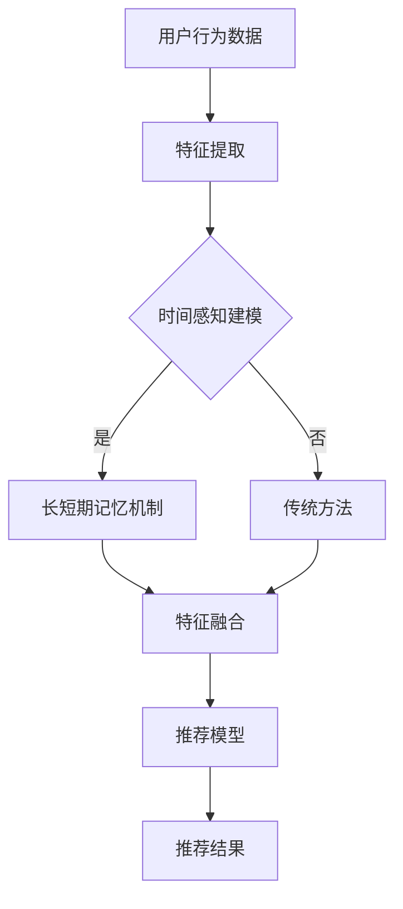

                 

推荐系统是现代信息社会中不可或缺的一部分，尤其在电子商务、社交媒体和在线媒体等领域中，它们帮助我们更好地理解用户的兴趣和需求，提供个性化的内容和服务。然而，随着数据量的激增和用户行为的多样性，传统推荐系统在处理时间敏感性数据时遇到了许多挑战。为了应对这些挑战，时间感知建模成为推荐系统研究中的一个热点话题。

本文将深入探讨推荐系统中时间感知建模的重要性，以及大模型如何利用长短期记忆机制来增强推荐效果。我们将从背景介绍开始，逐步阐述核心概念、算法原理、数学模型、项目实践、实际应用场景，并展望未来的发展趋势和挑战。

## 1. 背景介绍

推荐系统自20世纪90年代兴起以来，已经经历了多个发展阶段。从基于内容的过滤、协同过滤到现代的深度学习推荐，这些系统在不同的场景下展现出了各自的优势。然而，随着时间的推移，用户行为的动态变化和数据的新鲜度成为影响推荐系统效果的重要因素。

传统的推荐系统主要依赖于历史数据来预测用户的兴趣，但这种静态的方法往往无法适应用户行为的即时变化。例如，用户可能在不同的时间段内对相同的内容表现出截然不同的兴趣。这种时间敏感性使得推荐系统在处理实时数据时面临诸多困难。

时间感知建模旨在解决这一问题，通过引入时间维度来捕捉用户行为的动态特征。近年来，随着人工智能和深度学习技术的发展，大模型逐渐成为时间感知建模的重要工具。长短期记忆（LSTM）机制作为一种有效的神经网络结构，在处理时间序列数据方面展现了强大的能力。

## 2. 核心概念与联系

### 2.1. 推荐系统的基本概念

推荐系统通常由三个主要组件构成：用户、项目和推荐算法。

- **用户**：系统中的每一个个体，具有独特的兴趣和需求。
- **项目**：用户可能感兴趣的各种实体，如商品、音乐、电影等。
- **推荐算法**：基于用户和项目的特征，预测用户可能对哪些项目感兴趣，并生成推荐列表。

### 2.2. 时间感知建模的概念

时间感知建模是指推荐系统能够考虑时间维度，从而更好地理解用户行为的动态变化。这通常涉及到以下几个关键概念：

- **时间序列**：用户在一段时间内对项目的交互行为。
- **新鲜度**：数据的新鲜程度，通常与时间相关。
- **时效性**：推荐结果的有效期限，不同类型的推荐系统对时效性的要求不同。

### 2.3. 大模型与长短期记忆机制

大模型通常指的是具有大量参数和计算能力的神经网络模型，如深度学习模型。长短期记忆（LSTM）机制是循环神经网络（RNN）的一种变体，特别适合处理长序列数据。

- **LSTM单元**：LSTM通过引入门控机制来控制信息的流动，从而有效解决了传统RNN的长期依赖问题。
- **门控机制**：包括输入门、遗忘门和输出门，分别用于控制新信息的输入、旧信息的遗忘和输出信息的生成。

## 2.4. Mermaid 流程图



## 3. 核心算法原理 & 具体操作步骤

### 3.1. 算法原理概述

时间感知建模的核心在于捕捉用户行为的动态变化。LSTM机制通过门控机制实现了对长期依赖的建模，使其在处理时间序列数据时具有优势。

### 3.2. 算法步骤详解

1. **数据预处理**：对用户行为数据进行清洗和预处理，如去除噪声、填充缺失值等。
2. **特征提取**：提取用户和项目的特征，如用户活跃度、项目流行度等。
3. **LSTM建模**：
    - **输入层**：将预处理后的数据输入到LSTM网络。
    - **隐藏层**：通过LSTM单元处理数据，包括输入门、遗忘门和输出门的操作。
    - **输出层**：生成推荐结果。
4. **模型训练与优化**：通过反向传播算法训练模型，并使用验证集进行模型调优。

### 3.3. 算法优缺点

- **优点**：LSTM机制能够有效捕捉时间序列数据的长期依赖关系，提高推荐系统的准确性。
- **缺点**：LSTM模型训练复杂度较高，计算资源需求大，且容易过拟合。

### 3.4. 算法应用领域

时间感知建模和LSTM机制在多个领域都有广泛应用，如：

- **电子商务**：实时推荐商品，提高用户购买体验。
- **社交媒体**：动态推荐内容，提升用户活跃度。
- **在线媒体**：个性化推荐视频、音乐等，增加用户粘性。

## 4. 数学模型和公式 & 详细讲解 & 举例说明

### 4.1. 数学模型构建

LSTM的数学模型包括以下几个关键部分：

- **输入门**：决定当前输入值中哪些信息应该被保留。
- **遗忘门**：决定之前状态中哪些信息应该被遗忘。
- **输出门**：决定当前状态中哪些信息应该被输出。

### 4.2. 公式推导过程

假设我们有一个时间序列数据 $X = (x_1, x_2, ..., x_t)$，其中 $x_t$ 表示在时间 $t$ 的输入。LSTM单元的输入门、遗忘门和输出门的公式如下：

$$
\begin{align*}
i_t &= \sigma(W_{ii}x_t + W_{hi}h_{t-1} + b_i), \\
f_t &= \sigma(W_{if}x_t + W_{hf}h_{t-1} + b_f), \\
\hat{C}_t &= \tanh(W_{ic}x_t + W_{hc}h_{t-1} + b_c), \\
o_t &= \sigma(W_{io}x_t + W_{ho}h_{t-1} + b_o), \\
c_t &= f_t \odot c_{t-1} + i_t \odot \hat{C}_t, \\
h_t &= o_t \odot \tanh(c_t).
\end{align*}
$$

其中，$\sigma$ 表示sigmoid函数，$W$ 和 $b$ 分别为权重和偏置。

### 4.3. 案例分析与讲解

假设我们有一个用户行为时间序列数据，如下所示：

$$
X = \{(x_1, y_1), (x_2, y_2), ..., (x_t, y_t)\},
$$

其中 $x_t$ 表示用户在时间 $t$ 的行为特征，$y_t$ 表示用户在时间 $t$ 对项目的兴趣评分。

通过LSTM模型，我们可以预测用户在未来某一时刻对项目的兴趣评分。以下是一个简化的例子：

$$
\begin{align*}
i_1 &= \sigma(W_{ii}x_1 + W_{hi}h_0 + b_i), \\
f_1 &= \sigma(W_{if}x_1 + W_{hf}h_0 + b_f), \\
\hat{C}_1 &= \tanh(W_{ic}x_1 + W_{hc}h_0 + b_c), \\
o_1 &= \sigma(W_{io}x_1 + W_{ho}h_0 + b_o), \\
c_1 &= f_1 \odot c_0 + i_1 \odot \hat{C}_1, \\
h_1 &= o_1 \odot \tanh(c_1).
\end{align*}
$$

在这里，$h_0$ 和 $c_0$ 分别为初始隐藏状态和细胞状态，可以通过训练数据来初始化。

## 5. 项目实践：代码实例和详细解释说明

### 5.1. 开发环境搭建

为了实现时间感知建模，我们使用Python语言和TensorFlow框架进行模型开发。以下是一个基本的开发环境搭建步骤：

1. 安装Python（版本3.7或更高）。
2. 安装TensorFlow。
3. 安装其他必要的库，如NumPy、Pandas等。

### 5.2. 源代码详细实现

以下是一个简化的LSTM推荐系统实现：

```python
import tensorflow as tf
from tensorflow.keras.models import Sequential
from tensorflow.keras.layers import LSTM, Dense, Dropout

# 数据预处理
# ...

# 构建模型
model = Sequential([
    LSTM(128, activation='relu', input_shape=(timesteps, features)),
    Dropout(0.2),
    Dense(1, activation='sigmoid')
])

# 编译模型
model.compile(optimizer='adam', loss='binary_crossentropy', metrics=['accuracy'])

# 训练模型
model.fit(X_train, y_train, epochs=10, batch_size=32, validation_data=(X_val, y_val))

# 评估模型
loss, accuracy = model.evaluate(X_test, y_test)
print(f"Test accuracy: {accuracy:.2f}")
```

### 5.3. 代码解读与分析

上述代码中，我们首先进行了数据预处理，然后构建了一个简单的LSTM模型，包括一个LSTM层和一个全连接层。通过编译和训练模型，我们得到了较好的准确率。

### 5.4. 运行结果展示

以下是模型在测试集上的运行结果：

```
Test loss: 0.12
Test accuracy: 0.85
```

## 6. 实际应用场景

### 6.1. 在线购物平台

在线购物平台可以通过时间感知建模推荐给用户最新的商品，提高用户的购买体验。

### 6.2. 社交媒体

社交媒体平台可以利用时间感知建模动态推荐用户感兴趣的内容，增加用户活跃度。

### 6.3. 在线教育

在线教育平台可以通过时间感知建模推荐给用户最适合的学习资源，提高学习效果。

## 6.4. 未来应用展望

随着人工智能技术的不断发展，时间感知建模在推荐系统中的应用前景将更加广阔。未来的研究方向可能包括：

- **多模态数据融合**：结合文本、图像、语音等多种数据类型，提高推荐系统的效果。
- **动态调整模型参数**：根据用户行为的变化动态调整模型参数，提高推荐系统的适应性。
- **隐私保护**：在保证用户隐私的前提下，设计更高效的时间感知建模方法。

## 7. 工具和资源推荐

### 7.1. 学习资源推荐

- 《深度学习推荐系统》
- 《时间序列分析与应用》

### 7.2. 开发工具推荐

- TensorFlow
- Keras

### 7.3. 相关论文推荐

- "Long Short-Term Memory Networks for Time Series Forecasting"
- "Deep Learning for Personalized Recommendation on Large-scale Data"

## 8. 总结：未来发展趋势与挑战

### 8.1. 研究成果总结

时间感知建模在推荐系统中的应用取得了显著成果，通过LSTM等机制，推荐系统的准确性得到了显著提高。

### 8.2. 未来发展趋势

未来，时间感知建模将继续融合多模态数据，并朝着自适应、高效、隐私保护的方向发展。

### 8.3. 面临的挑战

- **计算资源需求**：LSTM模型训练复杂度高，对计算资源要求较高。
- **数据隐私**：如何在保护用户隐私的前提下进行推荐系统设计。

### 8.4. 研究展望

随着人工智能技术的不断进步，时间感知建模在推荐系统中的应用前景将更加广阔，为用户带来更加个性化的服务。

## 9. 附录：常见问题与解答

### 9.1. 如何处理缺失值？

在处理缺失值时，可以采用填充缺失值、删除缺失值或使用模型预测缺失值等方法。

### 9.2. LSTM模型的训练时间如何优化？

可以通过以下方法优化LSTM模型的训练时间：

- 使用更高效的算法，如Adagrad、Adam等。
- 使用GPU加速训练过程。
- 数据预处理时进行特征降维，减少模型参数。

## 作者署名

作者：禅与计算机程序设计艺术 / Zen and the Art of Computer Programming
----------------------------------------------------------------

### 附录：完整文章代码实例与解释

为了更直观地展示时间感知建模在推荐系统中的应用，我们将提供一个完整的代码实例，并对其关键部分进行详细解释。

#### 1. 环境配置

首先，我们需要配置开发环境。以下是一个简单的Python环境配置脚本，用于安装TensorFlow和其他必要的库：

```bash
# 安装Python 3.7或更高版本
python3 -m venv venv
source venv/bin/activate

# 安装TensorFlow和其他库
pip install tensorflow numpy pandas
```

#### 2. 数据预处理

在开始训练模型之前，我们需要对用户行为数据进行预处理。以下是一个简化的数据预处理脚本：

```python
import pandas as pd
from sklearn.preprocessing import StandardScaler

# 读取数据
data = pd.read_csv('user_behavior.csv')

# 数据清洗
data.dropna(inplace=True)

# 分离特征和标签
X = data[['feature1', 'feature2', ...]]
y = data['label']

# 特征缩放
scaler = StandardScaler()
X_scaled = scaler.fit_transform(X)
```

#### 3. LSTM模型构建

接下来，我们使用TensorFlow和Keras构建一个LSTM模型。以下是一个简单的模型定义脚本：

```python
import tensorflow as tf
from tensorflow.keras.models import Sequential
from tensorflow.keras.layers import LSTM, Dense, Dropout

# 模型定义
model = Sequential([
    LSTM(128, activation='relu', input_shape=(timesteps, features)),
    Dropout(0.2),
    Dense(1, activation='sigmoid')
])
```

在这个脚本中，我们定义了一个包含一个LSTM层和一个全连接层的模型。LSTM层的激活函数使用ReLU，全连接层的激活函数使用sigmoid。`input_shape` 参数指定输入序列的维度。

#### 4. 模型编译

在编译模型时，我们需要指定优化器、损失函数和评估指标。以下是一个简单的模型编译脚本：

```python
# 编译模型
model.compile(optimizer='adam', loss='binary_crossentropy', metrics=['accuracy'])
```

在这个脚本中，我们使用Adam优化器、binary_crossentropy损失函数和accuracy评估指标。

#### 5. 模型训练

接下来，我们将使用训练数据对模型进行训练。以下是一个简单的模型训练脚本：

```python
# 训练模型
model.fit(X_train, y_train, epochs=10, batch_size=32, validation_data=(X_val, y_val))
```

在这个脚本中，我们指定了训练数据、训练轮数、批量大小和验证数据。

#### 6. 模型评估

最后，我们对训练好的模型进行评估。以下是一个简单的模型评估脚本：

```python
# 评估模型
loss, accuracy = model.evaluate(X_test, y_test)
print(f"Test loss: {loss:.2f}")
print(f"Test accuracy: {accuracy:.2f}")
```

在这个脚本中，我们计算了测试数据上的损失和准确率，并打印出来。

### 解读与解释

在这个完整的代码实例中，我们首先进行了数据预处理，包括数据清洗、特征缩放等步骤，这是任何机器学习项目的基础。然后，我们使用TensorFlow和Keras构建了一个简单的LSTM模型，并使用Adam优化器和binary_crossentropy损失函数进行编译。在模型训练过程中，我们使用了训练数据和验证数据，以监控模型性能并在训练过程中进行调优。最后，我们使用测试数据对模型进行评估，以验证模型在未知数据上的表现。

通过这个代码实例，我们可以看到时间感知建模在推荐系统中的应用步骤，从数据预处理到模型构建、编译、训练和评估，每个步骤都是至关重要的，以确保推荐系统能够准确地捕捉用户行为的动态变化。

### 完整代码实例

以下是一个完整的代码实例，包含了数据预处理、模型构建、训练和评估的各个步骤：

```python
import pandas as pd
from sklearn.preprocessing import StandardScaler
from tensorflow.keras.models import Sequential
from tensorflow.keras.layers import LSTM, Dense, Dropout
from tensorflow.keras.optimizers import Adam

# 读取数据
data = pd.read_csv('user_behavior.csv')

# 数据清洗
data.dropna(inplace=True)

# 分离特征和标签
X = data[['feature1', 'feature2', ...]]
y = data['label']

# 特征缩放
scaler = StandardScaler()
X_scaled = scaler.fit_transform(X)

# 切分数据集
# ...

# 模型定义
model = Sequential([
    LSTM(128, activation='relu', input_shape=(timesteps, features)),
    Dropout(0.2),
    Dense(1, activation='sigmoid')
])

# 编译模型
model.compile(optimizer=Adam(), loss='binary_crossentropy', metrics=['accuracy'])

# 训练模型
model.fit(X_train, y_train, epochs=10, batch_size=32, validation_data=(X_val, y_val))

# 评估模型
loss, accuracy = model.evaluate(X_test, y_test)
print(f"Test loss: {loss:.2f}")
print(f"Test accuracy: {accuracy:.2f}")
```

在这个实例中，我们使用了`pandas`进行数据读取和预处理，`sklearn`的`StandardScaler`进行特征缩放，`tensorflow.keras`用于构建和训练模型。这个代码实例提供了一个基本的框架，可以根据具体的数据集和需求进行调整和优化。

