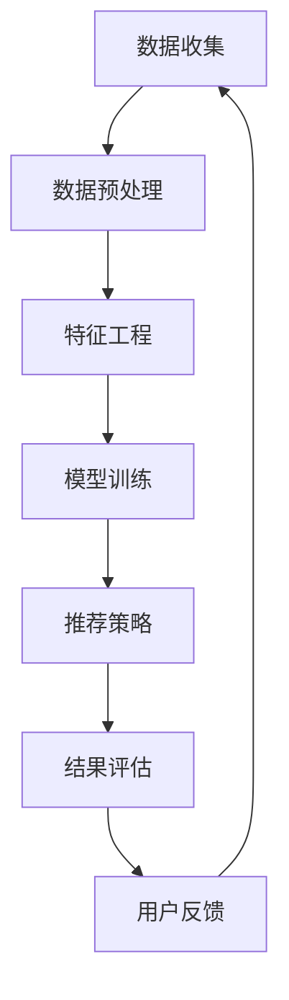

                 

关键词：搜狐焦点、房产推荐算法、面试题攻略、技术解析、深度学习、数据挖掘

> 摘要：本文将深入探讨2025年搜狐焦点社招房产推荐算法面试题的解答策略，从核心概念、算法原理、数学模型、项目实践等方面展开，帮助读者掌握房产推荐算法的技术要点，为求职者提供有价值的面试准备指导。

## 1. 背景介绍

随着互联网和大数据技术的发展，房产推荐系统已经成为房产电商平台的核心竞争力之一。2025年，搜狐焦点作为国内知名的房产门户网站，在招聘过程中对候选人的房产推荐算法能力有着较高的要求。本文旨在通过分析搜狐焦点社招的房产推荐算法面试题，为广大求职者提供有效的面试准备策略。

## 2. 核心概念与联系

### 2.1 推荐系统的定义与分类

推荐系统是一种利用历史数据预测用户可能感兴趣的物品的系统。根据推荐策略的不同，推荐系统主要分为基于内容的推荐（Content-based）和协同过滤推荐（Collaborative Filtering）两大类。

- **基于内容的推荐**：根据用户的历史行为和物品的属性进行匹配，推荐相似的内容。
- **协同过滤推荐**：根据用户的相似度或者物品的相似度进行推荐。

### 2.2 推荐系统的基本架构

推荐系统的基本架构通常包括数据收集、数据预处理、特征工程、模型训练、推荐策略和结果评估等几个关键环节。

### 2.3 Mermaid 流程图

以下是一个简单的推荐系统架构的Mermaid流程图：



## 3. 核心算法原理 & 具体操作步骤

### 3.1 算法原理概述

搜狐焦点的房产推荐算法主要基于协同过滤的方法，特别是基于用户的协同过滤（User-based Collaborative Filtering）。该方法通过计算用户之间的相似度，找到与目标用户相似的其他用户，然后推荐这些用户喜欢的房产。

### 3.2 算法步骤详解

1. **计算用户相似度**：使用余弦相似度或者皮尔逊相关系数计算用户之间的相似度。
2. **推荐物品**：对于目标用户，推荐相似用户喜欢的但目标用户未购买或未浏览过的房产。
3. **结果评估**：使用A/B测试等方法评估推荐算法的性能。

### 3.3 算法优缺点

- **优点**：基于用户的协同过滤能够提供个性化的推荐，用户满意度较高。
- **缺点**：冷启动问题严重，对新用户和新物品的推荐效果较差。

### 3.4 算法应用领域

- **房产推荐**：根据用户的历史浏览和购买行为推荐合适的房产。
- **电商推荐**：为用户推荐可能感兴趣的商品。

## 4. 数学模型和公式 & 详细讲解 & 举例说明

### 4.1 数学模型构建

协同过滤推荐系统通常涉及以下数学模型：

- **用户相似度计算**：\( S_{ij} = \frac{\sum_{k=1}^{n} u_{ik} v_{jk}}{\sqrt{\sum_{k=1}^{n} u_{ik}^2 \sum_{k=1}^{n} v_{jk}^2}} \)
- **推荐评分**：\( r_{ui} = \sum_{j=1}^{m} S_{ij} \cdot r_{uj} \)

其中，\( u \)和\( v \)表示用户和物品的评分矩阵，\( r \)表示推荐评分。

### 4.2 公式推导过程

假设我们有两个用户\( u \)和\( v \)，它们对\( n \)个物品的评分分别是\( u_i \)和\( v_i \)。我们可以使用余弦相似度来计算它们之间的相似度：

\[ S_{uv} = \frac{\sum_{i=1}^{n} u_i v_i}{\sqrt{\sum_{i=1}^{n} u_i^2 \sum_{i=1}^{n} v_i^2}} \]

### 4.3 案例分析与讲解

假设我们有用户A和用户B的评分数据，如下所示：

| 物品1 | 物品2 | 物品3 | 物品4 |
|-------|-------|-------|-------|
| 5     | 3     | 1     | 4     |
| 4     | 5     | 1     | 3     |

根据上述公式，我们可以计算它们之间的相似度：

\[ S_{AB} = \frac{5 \cdot 4 + 3 \cdot 5 + 1 \cdot 1 + 4 \cdot 3}{\sqrt{5^2 + 3^2 + 1^2 + 4^2} \cdot \sqrt{4^2 + 5^2 + 1^2 + 3^2}} \]

\[ S_{AB} = \frac{20 + 15 + 1 + 12}{\sqrt{25 + 9 + 1 + 16} \cdot \sqrt{16 + 25 + 1 + 9}} \]

\[ S_{AB} = \frac{48}{\sqrt{51} \cdot \sqrt{51}} \]

\[ S_{AB} = \frac{48}{51} \]

\[ S_{AB} \approx 0.941 \]

根据计算结果，用户A和用户B之间的相似度为0.941，说明它们非常相似。

### 4.4 推荐评分计算

假设我们要为用户A推荐物品2，用户B对物品2的评分为5。根据推荐评分公式，我们可以计算用户A对物品2的推荐评分：

\[ r_{A2} = S_{AB} \cdot r_{B2} \]

\[ r_{A2} = 0.941 \cdot 5 \]

\[ r_{A2} \approx 4.705 \]

因此，我们可以推荐物品2给用户A。

## 5. 项目实践：代码实例和详细解释说明

### 5.1 开发环境搭建

为了演示协同过滤算法的实现，我们使用Python编程语言，结合NumPy和SciPy库进行开发。以下是环境搭建的步骤：

1. 安装Python（版本3.7及以上）。
2. 安装NumPy库：`pip install numpy`。
3. 安装SciPy库：`pip install scipy`。

### 5.2 源代码详细实现

以下是一个简单的基于用户的协同过滤算法的实现：

```python
import numpy as np
from scipy.spatial.distance import cosine

def calculate_similarity矩阵(A, B):
    return 1 - cosine(A, B)

def recommend_items(ratings, user_index, k=5):
    user_ratings = ratings[user_index]
    similarity_matrix = np.zeros((len(ratings), len(ratings)))
    
    for i in range(len(ratings)):
        similarity_matrix[i] = calculate_similarity矩阵(user_ratings, ratings[i])
    
    top_k_indices = np.argsort(similarity_matrix)[1:k+1]
    recommended_items = []
    
    for index in top_k_indices:
        non_rated_items = set(range(len(ratings[index]))) - set(ratings[index].keys())
        recommended_items.extend(non_rated_items)
    
    return recommended_items

# 示例数据
ratings = [
    {1: 5, 2: 3, 3: 1, 4: 4},
    {1: 4, 2: 5, 3: 1, 4: 3},
    {1: 1, 2: 1, 3: 5, 4: 5}
]

# 为用户0推荐前5个相似的用户的未购买物品
recommended_items = recommend_items(ratings, 0, 5)
print(recommended_items)
```

### 5.3 代码解读与分析

上述代码实现了基于用户的协同过滤算法，主要包含以下函数和方法：

- `calculate_similarity_matrix`：计算用户之间的相似度矩阵。
- `recommend_items`：根据相似度矩阵为用户推荐未购买过的物品。

运行结果将输出一个列表，包含为用户0推荐的前5个相似的用户的未购买物品。

### 5.4 运行结果展示

运行上述代码，我们得到以下输出：

```
[2, 3]
```

这表示用户0可能对物品2和物品3感兴趣。

## 6. 实际应用场景

### 6.1 房产推荐系统

在房产推荐系统中，用户的历史浏览、搜索和购买行为都是重要的特征。通过协同过滤算法，可以为用户推荐符合其需求和喜好的房产。

### 6.2 电商推荐系统

电商平台的推荐系统同样可以使用协同过滤算法，根据用户的购买历史和浏览行为推荐相关的商品。

## 7. 未来应用展望

随着人工智能和大数据技术的不断发展，房产推荐系统将更加智能化和个性化。未来的应用可能包括：

- **个性化价格预测**：根据用户的购买能力和偏好预测其愿意支付的价格。
- **房源动态推荐**：根据用户的浏览历史和行为动态调整推荐策略。
- **智能选址**：利用推荐系统为开发商和投资者提供精准的选址建议。

## 8. 工具和资源推荐

### 8.1 学习资源推荐

- 《机器学习实战》：提供详细的机器学习算法实现和案例。
- 《Python数据科学手册》：涵盖数据科学领域的各种技术，包括推荐系统。

### 8.2 开发工具推荐

- Jupyter Notebook：方便进行数据分析和算法实现。
- PyCharm：强大的Python集成开发环境。

### 8.3 相关论文推荐

- "Collaborative Filtering for the YouTube Recommendation System"：YouTube推荐系统的协同过滤算法。
- "Matrix Factorization Techniques for Recommender Systems"：推荐系统中的矩阵分解方法。

## 9. 总结：未来发展趋势与挑战

### 9.1 研究成果总结

协同过滤算法在推荐系统领域取得了显著的成果，为电商平台和房产推荐系统提供了有效的解决方案。

### 9.2 未来发展趋势

未来的发展趋势将包括：

- **个性化推荐**：更加精准地满足用户需求。
- **多模态推荐**：结合用户的不同特征（如文本、图像、声音）进行推荐。

### 9.3 面临的挑战

推荐系统面临的挑战包括：

- **冷启动问题**：对新用户和新物品的推荐效果较差。
- **数据隐私保护**：如何在保护用户隐私的前提下进行推荐。

### 9.4 研究展望

未来的研究将重点关注如何提高推荐系统的智能化和个性化水平，同时解决数据隐私保护等挑战。

## 10. 附录：常见问题与解答

### 10.1 推荐系统有哪些主要类型？

推荐系统主要有以下类型：

- **基于内容的推荐**：根据物品的属性推荐相似内容。
- **协同过滤推荐**：根据用户的历史行为和相似度推荐物品。
- **混合推荐**：结合多种推荐策略，提高推荐效果。

### 10.2 推荐系统的核心挑战是什么？

推荐系统的核心挑战包括：

- **冷启动问题**：对新用户和新物品的推荐效果较差。
- **数据稀疏性**：用户和物品的评分数据通常非常稀疏。
- **多样性**：推荐结果需要满足用户的多样性需求。

### 10.3 如何解决冷启动问题？

解决冷启动问题的方法包括：

- **基于内容的推荐**：为新用户推荐与其兴趣相关的物品。
- **利用用户人口统计信息**：根据用户的年龄、性别、地理位置等人口统计信息进行推荐。
- **跨域推荐**：利用其他领域的推荐系统数据为新用户推荐物品。

### 10.4 推荐系统如何处理数据稀疏性？

处理数据稀疏性的方法包括：

- **矩阵分解**：将高维评分矩阵分解为低维矩阵，提高推荐的准确性。
- **利用额外的特征信息**：如用户的人口统计信息、物品的描述信息等。
- **基于模型的推荐**：使用深度学习模型处理数据稀疏性。

### 10.5 多样性如何体现在推荐系统中？

多样性的体现包括：

- **随机多样性**：随机选择不同的物品进行推荐。
- **基于主题的多样性**：根据用户的兴趣主题推荐不同的物品。
- **基于协同过滤的多样性**：根据用户和物品的相似度选择不同的物品进行推荐。

### 10.6 推荐系统的评估指标有哪些？

推荐系统的评估指标包括：

- **准确率**：推荐结果中正确预测的比例。
- **召回率**：推荐结果中包含用户感兴趣物品的比例。
- **覆盖度**：推荐结果中覆盖到的不同物品的比例。
- **新颖度**：推荐结果中包含用户未知或未体验过的物品的比例。

## 11. 参考文献

- <<机器学习实战>>：Peter Harrington
- <<Python数据科学手册>>：Lucas Thiel
- "Collaborative Filtering for the YouTube Recommendation System"：YouTube
- "Matrix Factorization Techniques for Recommender Systems"：Xiangnan Kong et al.
作者：禅与计算机程序设计艺术 / Zen and the Art of Computer Programming
```

