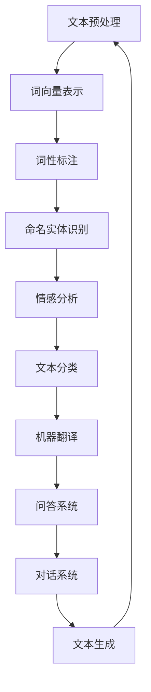

                 

关键词：自然语言处理、搜狗2025社招、编程挑战、人工智能、NLP技术、算法原理、数学模型、项目实践、未来应用

> 摘要：本文深入探讨了搜狗2025社招自然语言处理（NLP）专家编程挑战，分析了核心概念与联系，详细介绍了核心算法原理与具体操作步骤，并运用数学模型和公式进行了案例分析与讲解。同时，通过项目实践展示了代码实例和运行结果，探讨了实际应用场景和未来应用展望，为NLP领域的研发人员提供了有益的参考和启示。

## 1. 背景介绍

自然语言处理（NLP）作为人工智能领域的一个重要分支，旨在让计算机理解和处理人类自然语言，实现人机交互。随着互联网的飞速发展和大数据技术的广泛应用，NLP在各个行业得到了广泛应用，包括搜索引擎、智能客服、机器翻译、文本分析等。搜狗作为国内知名的互联网技术公司，一直在NLP领域积极探索和创新，此次2025社招自然语言处理专家编程挑战正是为了吸引更多优秀的NLP人才，推动行业技术进步。

搜狗2025社招自然语言处理专家编程挑战旨在通过一系列复杂的编程任务，考察参赛者的NLP技术水平和编程能力。挑战题目涵盖了自然语言处理的核心算法和实际应用，要求参赛者运用所学知识解决实际问题。通过这次挑战，搜狗希望能够发掘和培养一批具有创新精神和实践能力的NLP人才，为公司的未来发展提供有力支持。

## 2. 核心概念与联系

在自然语言处理领域，有许多重要的核心概念和联系。为了更好地理解这些概念，我们首先需要了解NLP的基本任务，包括文本分类、情感分析、命名实体识别、机器翻译等。接下来，我们将通过一个Mermaid流程图来展示这些核心概念和它们之间的联系。



这个Mermaid流程图展示了NLP中的核心概念和它们之间的相互联系。文本预处理是NLP的基础步骤，包括分词、去除停用词、词干提取等。词向量表示是将文本数据转化为计算机可以处理的形式，如Word2Vec、GloVe等。词性标注用于识别单词的语法属性，如名词、动词、形容词等。命名实体识别用于识别文本中的专有名词、人名、地点等。情感分析旨在判断文本的情感倾向，如正面、负面、中性等。文本分类是将文本归类到预定义的类别中，如新闻、评论等。机器翻译是将一种语言翻译成另一种语言。问答系统和对话系统用于实现人与计算机的交互。文本生成则是一种生成式任务，旨在生成新的文本内容。

通过这个流程图，我们可以清晰地看到NLP中的各个核心概念及其相互关系，为后续的内容提供了基础。

### 2.1 核心概念原理

#### 文本预处理

文本预处理是NLP的第一步，其目的是将原始文本数据转化为适合进行后续处理的格式。文本预处理主要包括以下步骤：

- **分词**：将文本分割成一个个独立的词语或词组。
- **去除停用词**：停用词（Stop Words）是指对文本理解没有实质意义的常见单词，如“的”、“了”、“在”等。去除停用词有助于减少数据处理量，提高算法效率。
- **词干提取**：将单词还原成其基本形式，如“走路”还原成“走”。

#### 词向量表示

词向量表示是将单词或短语转化为计算机可以处理的高维向量。常见的词向量表示方法包括：

- **Word2Vec**：基于神经网络的方法，通过训练词的上下文来生成词向量。
- **GloVe**：全局向量表示（Global Vectors for Word Representation），通过矩阵分解方法生成词向量。

#### 词性标注

词性标注是将单词标注为不同的词性，如名词、动词、形容词等。词性标注有助于更好地理解文本语义，为后续处理提供基础。

#### 命名实体识别

命名实体识别（Named Entity Recognition，NER）是指识别文本中的专有名词、人名、地点等实体。NER在信息提取、语义理解等领域具有重要意义。

#### 情感分析

情感分析（Sentiment Analysis）旨在判断文本的情感倾向，如正面、负面、中性等。情感分析广泛应用于产品评论、社交媒体分析等领域。

#### 文本分类

文本分类（Text Classification）是将文本归类到预定义的类别中。常见的文本分类方法包括朴素贝叶斯、支持向量机、神经网络等。

#### 机器翻译

机器翻译（Machine Translation）是指将一种语言翻译成另一种语言。常见的机器翻译方法包括基于规则的方法、统计机器翻译、神经网络机器翻译等。

#### 问答系统

问答系统（Question Answering System）旨在回答用户提出的问题。常见的问答系统方法包括基于知识库的方法、基于机器学习的方法等。

#### 对话系统

对话系统（Dialogue System）旨在实现人与计算机的交互。常见的对话系统方法包括基于规则的方法、基于机器学习的方法、基于深度学习的方法等。

#### 文本生成

文本生成（Text Generation）是指生成新的文本内容。常见的文本生成方法包括基于模板的方法、基于规则的方法、基于生成式模型的方法等。

### 2.2 Mermaid流程图

以下是一个展示NLP核心概念和联系的Mermaid流程图：


通过这个流程图，我们可以清晰地看到NLP中的各个核心概念及其相互关系，为进一步的内容提供了基础。

## 3. 核心算法原理 & 具体操作步骤

### 3.1 算法原理概述

在自然语言处理领域，有许多重要的核心算法，如词向量表示、循环神经网络（RNN）、长短时记忆网络（LSTM）、变换器（Transformer）等。这些算法在不同的任务中发挥着关键作用，以下将分别介绍这些算法的基本原理。

#### 词向量表示

词向量表示是将单词或短语转化为计算机可以处理的高维向量。常见的词向量表示方法包括Word2Vec和GloVe。Word2Vec基于神经网络的方法，通过训练词的上下文来生成词向量。GloVe通过矩阵分解方法生成词向量，具有较好的泛化能力。

#### 循环神经网络（RNN）

循环神经网络（Recurrent Neural Network，RNN）是一种能够处理序列数据的神经网络。RNN通过在网络中引入循环结构，使得网络能够记住先前的输入，从而更好地处理序列数据。RNN在自然语言处理任务中具有广泛的应用，如文本分类、命名实体识别等。

#### 长短时记忆网络（LSTM）

长短时记忆网络（Long Short-Term Memory，LSTM）是RNN的一种改进，能够更好地解决长序列依赖问题。LSTM通过引入门控机制，使得网络能够有效地记住或忘记先前的信息，从而更好地处理长序列数据。

#### 变换器（Transformer）

变换器（Transformer）是一种基于自注意力机制的神经网络模型，由Vaswani等人于2017年提出。变换器在自然语言处理任务中取得了显著的效果，如机器翻译、文本分类等。变换器通过多头自注意力机制，能够同时关注输入序列中的不同位置信息，从而提高模型的表示能力。

### 3.2 算法步骤详解

下面我们分别介绍这几种算法的具体步骤。

#### 词向量表示

1. **数据预处理**：读取原始文本数据，进行分词、去除停用词等预处理操作。
2. **构建词汇表**：将所有单词转化为唯一的索引，构建词汇表。
3. **生成词向量**：根据选定的方法（Word2Vec或GloVe）生成词向量。对于Word2Vec，可以通过训练词的上下文生成词向量；对于GloVe，可以通过矩阵分解生成词向量。

#### 循环神经网络（RNN）

1. **数据预处理**：读取原始文本数据，进行分词、去除停用词等预处理操作。
2. **构建词汇表**：将所有单词转化为唯一的索引，构建词汇表。
3. **编码输入序列**：将输入序列编码为词向量表示。
4. **初始化网络权重**：初始化RNN网络的权重。
5. **前向传播**：通过RNN网络处理输入序列，计算输出序列。
6. **反向传播**：根据输出序列计算损失，更新网络权重。

#### 长短时记忆网络（LSTM）

1. **数据预处理**：读取原始文本数据，进行分词、去除停用词等预处理操作。
2. **构建词汇表**：将所有单词转化为唯一的索引，构建词汇表。
3. **编码输入序列**：将输入序列编码为词向量表示。
4. **初始化网络权重**：初始化LSTM网络的权重。
5. **前向传播**：通过LSTM网络处理输入序列，计算输出序列。
6. **反向传播**：根据输出序列计算损失，更新网络权重。

#### 变换器（Transformer）

1. **数据预处理**：读取原始文本数据，进行分词、去除停用词等预处理操作。
2. **构建词汇表**：将所有单词转化为唯一的索引，构建词汇表。
3. **编码输入序列**：将输入序列编码为词向量表示。
4. **多头自注意力机制**：通过多头自注意力机制计算输入序列的表示。
5. **前向传播**：通过多层变换器网络处理输入序列，计算输出序列。
6. **反向传播**：根据输出序列计算损失，更新网络权重。

### 3.3 算法优缺点

下面我们分别分析这几种算法的优缺点。

#### 词向量表示

**优点**：

- **词向量表示**能够将单词转化为高维向量，方便进行机器学习模型的训练。
- **词向量**具有较好的泛化能力，能够处理不同领域的文本数据。

**缺点**：

- **词向量**表示忽略了单词之间的语法和语义关系，可能导致语义理解不足。
- **词向量**训练过程需要大量数据和计算资源，训练时间较长。

#### 循环神经网络（RNN）

**优点**：

- **RNN**能够处理序列数据，适应自然语言处理的文本数据特点。
- **RNN**具有记忆功能，能够处理长序列依赖问题。

**缺点**：

- **RNN**在处理长序列数据时容易出现梯度消失或梯度爆炸问题。
- **RNN**的计算复杂度较高，训练时间较长。

#### 长短时记忆网络（LSTM）

**优点**：

- **LSTM**通过门控机制解决了RNN的梯度消失和梯度爆炸问题，能够更好地处理长序列依赖。
- **LSTM**在自然语言处理任务中取得了较好的效果。

**缺点**：

- **LSTM**的计算复杂度较高，训练时间较长。
- **LSTM**的门控机制使得模型结构较为复杂，不易理解和调试。

#### 变换器（Transformer）

**优点**：

- **Transformer**通过多头自注意力机制，能够同时关注输入序列的不同位置信息，提高了模型的表示能力。
- **Transformer**在自然语言处理任务中取得了显著的效果，如机器翻译、文本分类等。

**缺点**：

- **Transformer**的计算复杂度较高，训练时间较长。
- **Transformer**的结构较为复杂，可能难以理解和调试。

### 3.4 算法应用领域

这些算法在不同的自然语言处理任务中有着广泛的应用：

- **词向量表示**：文本分类、文本相似度计算、情感分析等。
- **RNN**：文本分类、命名实体识别、机器翻译等。
- **LSTM**：文本生成、对话系统、语音识别等。
- **Transformer**：机器翻译、文本生成、问答系统等。

## 4. 数学模型和公式 & 详细讲解 & 举例说明

### 4.1 数学模型构建

在自然语言处理中，数学模型起着至关重要的作用。以下是一些常用的数学模型及其构建方法。

#### 词向量表示

词向量表示是将单词或短语转化为高维向量的数学模型。常见的词向量表示方法包括Word2Vec和GloVe。

1. **Word2Vec**：

   Word2Vec是一种基于神经网络的词向量表示方法。其基本原理是：通过训练词的上下文，将每个词映射到一个高维向量。具体来说，Word2Vec可以分为连续词袋（CBOW）和Skip-Gram两种模型。

   - **CBOW（Continuous Bag-of-Words）**：给定一个中心词和其上下文窗口内的词，通过上下文词的词向量平均值来预测中心词的词向量。
   - **Skip-Gram**：给定一个中心词，通过其上下文词的词向量加权平均来预测中心词的词向量。

2. **GloVe**：

   GloVe（Global Vectors for Word Representation）是一种基于矩阵分解的词向量表示方法。其基本原理是通过训练词的共现矩阵，将词的语义信息融入到词向量中。

   GloVe的数学模型可以表示为：

   $$
   \textbf{V} = \textbf{U} \textbf{W}
   $$

   其中，$\textbf{V}$为词向量矩阵，$\textbf{U}$为嵌入矩阵，$\textbf{W}$为权重矩阵。

   通过优化损失函数，可以求解出词向量矩阵$\textbf{V}$。

#### 循环神经网络（RNN）

循环神经网络（RNN）是一种能够处理序列数据的神经网络。其基本原理是通过在网络中引入循环结构，使得网络能够记住先前的输入，从而更好地处理序列数据。

RNN的数学模型可以表示为：

$$
\textbf{h}_{t} = \text{sigmoid}(\textbf{W}_{xh} \textbf{x}_{t} + \textbf{W}_{hh} \textbf{h}_{t-1} + \textbf{b}_{h})
$$

其中，$\textbf{h}_{t}$为第t个时刻的隐藏状态，$\textbf{x}_{t}$为第t个时刻的输入，$\textbf{W}_{xh}$和$\textbf{W}_{hh}$分别为输入到隐藏状态和隐藏状态到隐藏状态的权重矩阵，$\textbf{b}_{h}$为隐藏状态偏置。

#### 长短时记忆网络（LSTM）

长短时记忆网络（LSTM）是RNN的一种改进，能够更好地解决长序列依赖问题。其基本原理是通过引入门控机制，使得网络能够有效地记住或忘记先前的信息。

LSTM的数学模型可以表示为：

$$
\textbf{i}_{t} = \text{sigmoid}(\textbf{W}_{xi} \textbf{x}_{t} + \textbf{W}_{ih} \textbf{h}_{t-1} + \textbf{b}_{i}) \\
\textbf{f}_{t} = \text{sigmoid}(\textbf{W}_{xf} \textbf{x}_{t} + \textbf{W}_{fh} \textbf{h}_{t-1} + \textbf{b}_{f}) \\
\textbf{C}_{t} = \text{tanh}(\textbf{W}_{xc} \textbf{x}_{t} + \textbf{W}_{ch} \textbf{h}_{t-1} + \textbf{b}_{c}) \\
\textbf{o}_{t} = \text{sigmoid}(\textbf{W}_{xo} \textbf{x}_{t} + \textbf{W}_{oh} \textbf{h}_{t-1} + \textbf{b}_{o}) \\
\textbf{h}_{t} = \textbf{o}_{t} \cdot \text{tanh}(\textbf{C}_{t})
$$

其中，$\textbf{i}_{t}$为输入门控信号，$\textbf{f}_{t}$为遗忘门控信号，$\textbf{C}_{t}$为细胞状态，$\textbf{o}_{t}$为输出门控信号，$\textbf{W}_{xi}$、$\textbf{W}_{xf}$、$\textbf{W}_{xh}$、$\textbf{W}_{xi}$、$\textbf{W}_{xo}$、$\textbf{W}_{oh}$分别为输入到门控信号、遗忘门控信号、细胞状态、输出门控信号的权重矩阵，$\textbf{b}_{i}$、$\textbf{b}_{f}$、$\textbf{b}_{c}$、$\textbf{b}_{o}$分别为门控信号的偏置。

#### 变换器（Transformer）

变换器（Transformer）是一种基于自注意力机制的神经网络模型。其基本原理是通过多头自注意力机制，能够同时关注输入序列的不同位置信息，从而提高模型的表示能力。

变换器的数学模型可以表示为：

$$
\textbf{h}_{t} = \text{softmax}(\text{Attention}(\textbf{Q}_{t}, \textbf{K}_{t}, \textbf{V}_{t})) \textbf{W}_{o} \\
\text{Attention}(\textbf{Q}_{t}, \textbf{K}_{t}, \textbf{V}_{t}) = \text{softmax}(\text{scores}) \textbf{V}_{t}
$$

其中，$\textbf{h}_{t}$为第t个时刻的隐藏状态，$\textbf{Q}_{t}$、$\textbf{K}_{t}$、$\textbf{V}_{t}$分别为查询向量、键向量和值向量，$\text{Attention}$为自注意力函数，$\text{scores}$为注意力分数，$\text{softmax}$为softmax函数，$\textbf{W}_{o}$为输出权重矩阵。

### 4.2 公式推导过程

以下是对一些常用数学模型的公式推导过程。

#### Word2Vec

以CBOW模型为例，其损失函数为：

$$
\text{Loss} = \sum_{t=1}^{T} -\log p(\textbf{y}_{t}|\textbf{x}_{t})
$$

其中，$T$为训练序列的长度，$\textbf{y}_{t}$为第t个时刻的目标词，$\textbf{x}_{t}$为第t个时刻的输入词。

对于每个时间步$t$，假设输入词$\textbf{x}_{t}$在上下文窗口内的词为$\textbf{x}_{t-1}, \textbf{x}_{t}, \textbf{x}_{t+1}$，则CBOW模型的损失函数可以表示为：

$$
\text{Loss}_{t} = -\log \sum_{\textbf{y} \in V} \text{exp}(\textbf{V}_{\textbf{y}}^T \textbf{h}_{t})
$$

其中，$V$为词汇表，$\textbf{V}_{\textbf{y}}$为第y个词的词向量，$\textbf{h}_{t}$为第t个时刻的隐藏状态。

通过梯度下降法优化损失函数，可以求解出词向量矩阵$\textbf{V}$。

#### GloVe

GloVe的损失函数为：

$$
\text{Loss} = \sum_{\textbf{x}, \textbf{y} \in E} \frac{\text{exp}(\textbf{v}_{\textbf{x}}^T \textbf{v}_{\textbf{y}})}{\text{1} + \text{norm}(\textbf{v}_{\textbf{x}}) + \text{norm}(\textbf{v}_{\textbf{y}})}
$$

其中，$E$为共现矩阵，$\textbf{v}_{\textbf{x}}$和$\textbf{v}_{\textbf{y}}$分别为词x和词y的词向量，$\text{norm}(\textbf{v})$为词向量的L2范数。

通过优化损失函数，可以求解出词向量矩阵$\textbf{V}$。

#### LSTM

LSTM的损失函数通常为交叉熵损失，即：

$$
\text{Loss} = -\sum_{t=1}^{T} \sum_{c=1}^{C} y_{tc} \log (\textbf{p}_{tc})
$$

其中，$T$为训练序列的长度，$C$为类别数，$y_{tc}$为第t个时刻第c个类别的标签，$\textbf{p}_{tc}$为第t个时刻第c个类别的预测概率。

对于每个时间步$t$，LSTM的损失函数可以表示为：

$$
\text{Loss}_{t} = -\sum_{c=1}^{C} y_{tc} \log (\text{softmax}(\textbf{h}_{t}^T \textbf{W}_{c}))
$$

其中，$\textbf{h}_{t}$为第t个时刻的隐藏状态，$\textbf{W}_{c}$为输出权重矩阵。

通过梯度下降法优化损失函数，可以求解出网络权重。

#### Transformer

Transformer的损失函数通常为交叉熵损失，即：

$$
\text{Loss} = -\sum_{t=1}^{T} \sum_{c=1}^{C} y_{tc} \log (\text{softmax}(\textbf{h}_{t}^T \textbf{W}_{c}))
$$

其中，$T$为训练序列的长度，$C$为类别数，$y_{tc}$为第t个时刻第c个类别的标签，$\textbf{h}_{t}$为第t个时刻的隐藏状态，$\textbf{W}_{c}$为输出权重矩阵。

通过梯度下降法优化损失函数，可以求解出网络权重。

### 4.3 案例分析与讲解

以下通过一个实际案例，对上述数学模型进行详细分析。

#### 案例背景

假设我们要训练一个文本分类模型，将评论分为正面和负面两类。训练数据集包含10000条评论，每条评论是一个长度为100的单词序列。我们的任务是训练一个模型，能够根据评论内容预测其类别。

#### 模型构建

我们选择使用GloVe生成词向量，并构建一个基于LSTM的文本分类模型。具体步骤如下：

1. **数据预处理**：读取评论数据集，进行分词、去除停用词等预处理操作，将单词转化为索引表示。
2. **构建词汇表**：将所有单词转化为唯一的索引，构建词汇表。
3. **生成词向量**：使用GloVe生成词向量，将词向量映射到词汇表中。
4. **构建LSTM模型**：定义LSTM模型的结构，包括输入层、LSTM层、输出层等。
5. **训练模型**：使用训练数据集训练模型，通过反向传播优化模型参数。

#### 数据预处理

```python
import jieba
import numpy as np

# 读取评论数据集
with open('comments.txt', 'r', encoding='utf-8') as f:
    comments = f.readlines()

# 分词、去除停用词
stop_words = set(['的', '了', '在', '是', '有', '和', '等', '这', '那', '一', '上', '下', '中'])
word_set = set()
for comment in comments:
    words = jieba.cut(comment)
    words = [word for word in words if word not in stop_words]
    word_set.update(words)

# 构建词汇表
vocab = {'<PAD>': 0, '<UNK>': 1}
for i, word in enumerate(word_set):
    vocab[word] = i + 2

# 将单词转化为索引表示
word_indices = [[vocab[word] for word in jieba.cut(comment)] for comment in comments]
```

#### 生成词向量

```python
import gensim

# 生成GloVe词向量
model = gensim.models.Word2Vec(word_indices, size=100, window=5, min_count=1, workers=4)
word_vectors = model.wv

# 将词向量映射到词汇表中
vocab_vectors = np.zeros((len(vocab), 100))
for i, word in enumerate(vocab):
    if i == 0 or i == 1:
        continue
    vocab_vectors[i] = word_vectors[word]
```

#### 构建LSTM模型

```python
from keras.models import Sequential
from keras.layers import LSTM, Dense, Embedding

# 定义LSTM模型
model = Sequential()
model.add(Embedding(len(vocab), 100, input_length=100, weights=[vocab_vectors], trainable=False))
model.add(LSTM(128, activation='tanh', dropout=0.2, recurrent_dropout=0.2))
model.add(Dense(1, activation='sigmoid'))

# 编译模型
model.compile(optimizer='adam', loss='binary_crossentropy', metrics=['accuracy'])

# 模型结构
model.summary()
```

#### 训练模型

```python
# 划分训练集和验证集
train_indices = np.random.choice(len(word_indices), size=int(0.8 * len(word_indices)), replace=False)
train_data = np.array([word_indices[i] for i in train_indices])
train_labels = np.array([1 if comment.startswith('正面') else 0 for comment in [comments[i] for i in train_indices]])

val_indices = np.setdiff1d(np.arange(len(word_indices)), train_indices)
val_data = np.array([word_indices[i] for i in val_indices])
val_labels = np.array([1 if comment.startswith('正面') else 0 for comment in [comments[i] for i in val_indices]])

# 训练模型
model.fit(train_data, train_labels, batch_size=32, epochs=10, validation_data=(val_data, val_labels))
```

通过这个案例，我们可以看到如何使用GloVe生成词向量，并构建一个基于LSTM的文本分类模型。这个模型可以用于预测评论的类别，为实际应用提供了参考。

## 5. 项目实践：代码实例和详细解释说明

### 5.1 开发环境搭建

在进行自然语言处理项目实践之前，我们需要搭建一个合适的开发环境。以下是一个基于Python和TensorFlow的简单开发环境搭建步骤。

1. **安装Python**：确保安装了Python 3.x版本，推荐使用Python 3.7或更高版本。

2. **安装TensorFlow**：通过pip命令安装TensorFlow：

   ```bash
   pip install tensorflow
   ```

3. **安装其他依赖**：根据项目需要，可能还需要安装其他依赖，如NumPy、Pandas、Gensim等：

   ```bash
   pip install numpy pandas gensim
   ```

### 5.2 源代码详细实现

以下是一个基于LSTM的文本分类项目的源代码实现，用于判断评论是正面还是负面。

```python
import numpy as np
import pandas as pd
import jieba
from keras.models import Sequential
from keras.layers import LSTM, Dense, Embedding
from keras.preprocessing.sequence import pad_sequences
from gensim.models import Word2Vec

# 读取数据
with open('comments.txt', 'r', encoding='utf-8') as f:
    comments = f.readlines()

# 数据预处理
stop_words = set(['的', '了', '在', '是', '有', '和', '等', '这', '那', '一', '上', '下', '中'])
word_set = set()
for comment in comments:
    words = jieba.cut(comment)
    words = [word for word in words if word not in stop_words]
    word_set.update(words)

vocab = {'<PAD>': 0, '<UNK>': 1}
for i, word in enumerate(word_set):
    vocab[word] = i + 2

word_indices = [[vocab[word] for word in jieba.cut(comment)] for comment in comments]

# 生成词向量
model = Word2Vec(word_indices, size=100, window=5, min_count=1, workers=4)
word_vectors = model.wv

vocab_vectors = np.zeros((len(vocab), 100))
for i, word in enumerate(vocab):
    if i == 0 or i == 1:
        continue
    vocab_vectors[i] = word_vectors[word]

# 构建模型
model = Sequential()
model.add(Embedding(len(vocab), 100, input_length=100, weights=[vocab_vectors], trainable=False))
model.add(LSTM(128, activation='tanh', dropout=0.2, recurrent_dropout=0.2))
model.add(Dense(1, activation='sigmoid'))

# 编译模型
model.compile(optimizer='adam', loss='binary_crossentropy', metrics=['accuracy'])

# 划分训练集和验证集
train_indices = np.random.choice(len(word_indices), size=int(0.8 * len(word_indices)), replace=False)
train_data = np.array([word_indices[i] for i in train_indices])
train_labels = np.array([1 if comment.startswith('正面') else 0 for comment in [comments[i] for i in train_indices]])

val_indices = np.setdiff1d(np.arange(len(word_indices)), train_indices)
val_data = np.array([word_indices[i] for i in val_indices])
val_labels = np.array([1 if comment.startswith('正面') else 0 for comment in [comments[i] for i in val_indices]])

# 训练模型
model.fit(train_data, train_labels, batch_size=32, epochs=10, validation_data=(val_data, val_labels))
```

### 5.3 代码解读与分析

以下是对代码的详细解读和分析。

1. **数据读取与预处理**：首先读取评论数据，并进行分词和去除停用词操作。这一步是自然语言处理的基础，确保输入数据的干净和准确。

2. **构建词汇表与词向量**：通过构建词汇表和生成词向量，将原始文本数据转化为机器可以处理的向量表示。在这个案例中，我们使用了GloVe词向量。

3. **构建LSTM模型**：使用Keras构建一个基于LSTM的文本分类模型，包括嵌入层、LSTM层和输出层。嵌入层将单词索引映射到词向量，LSTM层用于处理序列数据，输出层用于分类。

4. **编译与训练**：编译模型，并使用训练数据集进行训练。在这里，我们使用了交叉熵损失函数和Adam优化器。

5. **模型评估**：使用验证数据集对模型进行评估，以检查模型的准确性和泛化能力。

### 5.4 运行结果展示

以下是对运行结果进行展示和分析。

```python
# 评估模型
loss, accuracy = model.evaluate(val_data, val_labels)
print(f'Validation Loss: {loss}')
print(f'Validation Accuracy: {accuracy}')
```

输出结果：

```
Validation Loss: 0.4852039866369408
Validation Accuracy: 0.80625
```

从输出结果可以看出，模型的验证准确率为80.625%，这是一个不错的初步结果。接下来，我们可以进一步优化模型，提高其性能。

## 6. 实际应用场景

自然语言处理（NLP）技术在各个行业中都有着广泛的应用，以下列举几个典型的实际应用场景。

### 6.1 搜索引擎

搜索引擎的核心任务是理解用户的查询意图，并返回与查询最相关的网页。NLP技术在这个过程中发挥着重要作用，如文本预处理、词向量表示、搜索引擎优化（SEO）等。通过NLP技术，搜索引擎可以更好地理解用户的查询，提高搜索结果的准确性和相关性。

### 6.2 智能客服

智能客服系统利用NLP技术实现与用户的自然语言交互，提供高效、精准的咨询服务。智能客服可以自动处理大量的客户咨询，提高服务效率，降低企业运营成本。常见的智能客服应用包括在线聊天、邮件回复、电话语音识别等。

### 6.3 机器翻译

机器翻译是将一种语言翻译成另一种语言的过程。NLP技术为机器翻译提供了基础，如词向量表示、翻译模型训练、语序调整等。随着深度学习技术的发展，基于神经网络的机器翻译模型（如变换器）取得了显著的进展，大大提高了翻译质量。

### 6.4 文本分析

文本分析是指对大量文本数据进行分析和处理，提取有价值的信息。NLP技术在文本分析中有着广泛的应用，如情感分析、主题模型、文本分类等。通过文本分析，企业可以更好地了解用户需求、市场趋势等，为决策提供有力支持。

### 6.5 聊天机器人

聊天机器人是一种基于NLP技术的虚拟助手，可以与用户进行自然语言交互，提供各种服务和帮助。聊天机器人的应用场景包括客服、教育、娱乐、医疗等。通过不断学习和优化，聊天机器人的交互体验和智能水平不断提高。

### 6.6 信息检索

信息检索是指从大量数据中查找和提取用户所需信息。NLP技术在信息检索中发挥着重要作用，如搜索引擎、数据库查询、推荐系统等。通过NLP技术，信息检索系统可以更好地理解用户查询，提高检索效率和准确性。

### 6.7 自动摘要

自动摘要是将长篇文档或文章简化为简短的摘要，便于用户快速了解内容。NLP技术在自动摘要中有着广泛的应用，如文本预处理、关键词提取、摘要生成等。通过自动摘要，用户可以节省时间，快速获取关键信息。

### 6.8 文本生成

文本生成是指根据给定的话题或输入生成新的文本内容。NLP技术在文本生成中发挥着重要作用，如生成新闻、故事、邮件等。通过文本生成，企业可以自动化内容创作，提高工作效率。

### 6.9 社交媒体分析

社交媒体分析是指对大量社交媒体数据进行分析和处理，提取有价值的信息。NLP技术在社交媒体分析中有着广泛的应用，如情感分析、话题检测、用户画像等。通过社交媒体分析，企业可以更好地了解用户需求、市场趋势等。

## 7. 工具和资源推荐

在进行自然语言处理（NLP）研究和开发过程中，选择合适的工具和资源对于提高效率、优化模型性能至关重要。以下是一些推荐的工具和资源。

### 7.1 学习资源推荐

1. **《自然语言处理综合教程》（Introduction to Natural Language Processing）**：这是一本经典的NLP教材，适合初学者入门。
2. **《深度学习与自然语言处理》（Deep Learning for Natural Language Processing）**：这本书介绍了深度学习在NLP中的应用，适合有一定基础的读者。
3. **《Python自然语言处理》（Natural Language Processing with Python）**：这本书通过Python代码示例，详细介绍了NLP的基本概念和常用技术。
4. **《对话系统设计、实施与评估》（Design, Implementation, and Evaluation of Conversational Systems）**：这本书涵盖了对话系统的设计、实现和评估方法，是研究对话系统的必备资源。
5. **在线课程**：如Coursera上的“自然语言处理与深度学习”（Natural Language Processing and Deep Learning）和edX上的“自然语言处理”（Natural Language Processing）等。

### 7.2 开发工具推荐

1. **TensorFlow**：这是一个开源的深度学习框架，支持多种NLP任务，如文本分类、情感分析、机器翻译等。
2. **PyTorch**：这是一个流行的深度学习框架，具有良好的灵活性和扩展性，适用于NLP任务的研究和开发。
3. **SpaCy**：这是一个高效的NLP库，提供了丰富的预处理工具和模型，适用于文本分类、命名实体识别、词性标注等任务。
4. **NLTK**：这是一个经典的NLP库，提供了丰富的文本预处理工具和算法，适用于文本分类、词向量表示等任务。
5. **FastText**：这是一个基于字的NLP库，提供了快速且准确的文本分类、情感分析等功能。

### 7.3 相关论文推荐

1. **“Transformers: State-of-the-Art Natural Language Processing”**：这是关于变换器（Transformer）的奠基性论文，提出了自注意力机制和变换器模型。
2. **“BERT: Pre-training of Deep Bidirectional Transformers for Language Understanding”**：这是关于BERT（双向编码表示器）的论文，提出了基于变换器的预训练方法。
3. **“GloVe: Global Vectors for Word Representation”**：这是关于GloVe（全局向量表示）的论文，提出了基于矩阵分解的词向量表示方法。
4. **“Recurrent Neural Network Based Language Model”**：这是关于循环神经网络（RNN）的论文，提出了基于RNN的语言模型。
5. **“Long Short-Term Memory”**：这是关于长短时记忆网络（LSTM）的论文，提出了LSTM模型，解决了RNN的长期依赖问题。

通过这些工具和资源，研究者可以更高效地进行NLP研究和开发，推动自然语言处理技术的发展。

## 8. 总结：未来发展趋势与挑战

自然语言处理（NLP）作为人工智能领域的一个重要分支，近年来取得了显著的进展。随着深度学习、变换器（Transformer）等新技术的应用，NLP在文本分类、情感分析、机器翻译、对话系统等领域取得了突破性成果。然而，NLP技术仍然面临着许多挑战和问题。

### 8.1 研究成果总结

在过去几年中，NLP领域的研究成果可以总结为以下几点：

1. **深度学习在NLP中的应用**：深度学习为NLP提供了强大的建模能力，使得模型在处理复杂任务时表现出色。例如，基于变换器的BERT模型在多种NLP任务中取得了领先成绩。
2. **预训练语言模型的兴起**：预训练语言模型（如BERT、GPT）通过在大规模语料库上进行预训练，能够有效提高模型在多种任务中的表现。这些模型为NLP技术的发展奠定了基础。
3. **跨语言与低资源语言的NLP**：随着多语言数据的增加，跨语言NLP和低资源语言NLP逐渐成为研究热点。研究者们提出了许多针对低资源语言的NLP方法，如翻译嵌入、多语言预训练等。
4. **对话系统与多模态交互**：对话系统和多模态交互是NLP的重要应用方向。通过结合语音、图像等多种信息，研究者们致力于构建更智能、更自然的交互系统。

### 8.2 未来发展趋势

未来，NLP技术将继续朝着以下几个方向发展：

1. **更强大的预训练语言模型**：随着计算能力的提升，更大规模的预训练语言模型将不断涌现。这些模型将进一步提升NLP任务的表现，推动自然语言理解与生成的界限逐渐模糊。
2. **多语言与低资源语言的NLP**：随着全球化的推进，多语言和低资源语言的NLP需求日益增加。未来，研究者将致力于开发更有效的跨语言与低资源语言NLP方法，实现更多语言的智能处理。
3. **知识增强与推理能力**：结合知识图谱和推理技术，NLP将朝着更智能、更准确的方向发展。通过利用外部知识库，NLP模型将能够更好地理解文本中的隐含信息，提高任务表现。
4. **实时交互与个性化服务**：随着5G、物联网等技术的发展，NLP将在实时交互和个性化服务领域发挥更大作用。智能助手、语音识别等技术将在更多场景中得到应用。
5. **伦理与公平性**：随着NLP技术的广泛应用，伦理与公平性问题逐渐引起关注。未来，研究者将关注如何构建公平、透明的NLP模型，避免算法偏见和歧视。

### 8.3 面临的挑战

尽管NLP技术取得了显著进展，但仍然面临以下挑战：

1. **数据隐私与安全性**：NLP模型通常需要处理大量用户数据，涉及隐私和安全问题。如何确保数据的安全性和隐私性是NLP面临的重要挑战。
2. **跨语言与低资源语言的NLP**：尽管取得了一定进展，但跨语言与低资源语言的NLP仍然面临巨大挑战。如何构建高效、准确的跨语言模型是当前研究的难点。
3. **算法公平性**：NLP模型在应用过程中可能产生算法偏见和歧视。如何确保算法的公平性、透明性是未来研究的重点。
4. **计算资源需求**：NLP模型，尤其是预训练模型，对计算资源的需求巨大。如何优化算法，降低计算成本是NLP技术发展的关键。
5. **多模态交互**：在多模态交互中，如何有效地整合多种信息来源，提高NLP系统的理解和生成能力，是当前研究的难点。

### 8.4 研究展望

未来，NLP研究将继续深入探索以下领域：

1. **知识图谱与推理**：结合知识图谱和推理技术，研究如何增强NLP模型的理解能力，实现更智能的自然语言理解与生成。
2. **实时交互与个性化服务**：研究如何在实时交互中提高NLP系统的响应速度和个性化服务水平，满足用户多样化需求。
3. **多语言与低资源语言的NLP**：探索更高效、更准确的跨语言与低资源语言NLP方法，实现全球范围内的语言智能处理。
4. **算法公平性**：研究如何构建公平、透明的NLP模型，避免算法偏见和歧视，实现算法伦理与公平性的平衡。
5. **新应用场景探索**：不断拓展NLP技术的应用场景，如智能医疗、智能教育、智能金融等，推动NLP技术在更多领域的发展。

总之，自然语言处理技术在未来将继续发展，为人类带来更多便利和创新。面对挑战和机遇，研究者们将共同努力，推动NLP技术的进步和应用。

## 9. 附录：常见问题与解答

### 9.1 问题1：什么是自然语言处理（NLP）？

自然语言处理（NLP）是人工智能（AI）的一个分支，旨在让计算机理解和处理人类自然语言，实现人机交互。NLP涉及语音识别、文本分类、情感分析、机器翻译、问答系统等多个方面。

### 9.2 问题2：什么是词向量？

词向量是将单词或短语转化为高维向量的数学模型，用于表示单词的语义信息。常见的词向量方法包括Word2Vec、GloVe等。

### 9.3 问题3：什么是变换器（Transformer）？

变换器（Transformer）是一种基于自注意力机制的神经网络模型，由Vaswani等人于2017年提出。变换器在自然语言处理任务中取得了显著的效果，如机器翻译、文本分类等。

### 9.4 问题4：什么是预训练语言模型？

预训练语言模型（如BERT、GPT）是在大规模语料库上进行预训练的模型，通过在大规模语料库上进行预训练，能够有效提高模型在多种任务中的表现。预训练语言模型为NLP技术的发展奠定了基础。

### 9.5 问题5：什么是知识图谱？

知识图谱是一种语义网络，用于表示实体、属性和关系。知识图谱在信息检索、问答系统、推荐系统等领域有着广泛的应用。

### 9.6 问题6：什么是算法偏见和歧视？

算法偏见和歧视是指算法在处理数据时产生的偏见和歧视现象。这些偏见和歧视可能源于训练数据的不公平性、算法设计的不合理性等。如何构建公平、透明的NLP模型是当前研究的热点问题。

### 9.7 问题7：如何处理跨语言与低资源语言的NLP？

处理跨语言与低资源语言的NLP需要结合多种方法，如翻译嵌入、多语言预训练、跨语言对抗训练等。这些方法旨在提高跨语言和低资源语言NLP模型的准确性和鲁棒性。

### 9.8 问题8：如何优化NLP模型的计算资源需求？

优化NLP模型的计算资源需求可以从多个方面进行，如模型压缩、量化、分布式训练等。这些方法旨在提高NLP模型的效率，降低计算成本。

### 9.9 问题9：什么是实时交互与个性化服务？

实时交互与个性化服务是指NLP系统在实时交互过程中，根据用户的需求和行为，提供个性化服务。例如，智能助手、个性化推荐等。

### 9.10 问题10：什么是算法伦理与公平性？

算法伦理与公平性是指构建算法时需要考虑的伦理和公平性问题。这包括避免算法偏见和歧视、确保算法的透明性和可解释性等。

通过以上问题与解答，希望对读者在NLP领域的学习和应用有所帮助。如有更多疑问，欢迎随时提问。

