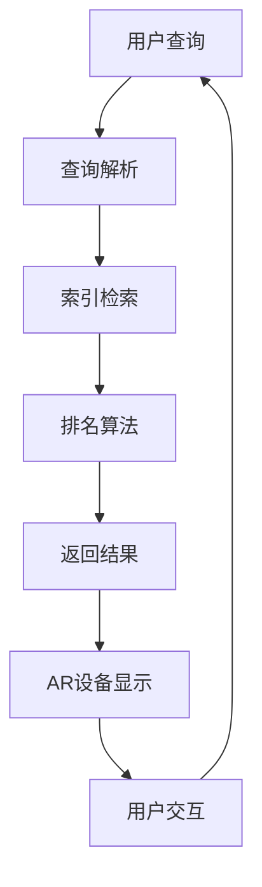

                 

关键词：搜索引擎，增强现实，集成，算法，开发环境，实际应用

> 摘要：本文将探讨搜索引擎与增强现实（AR）技术的融合，分析其核心概念与联系，探讨核心算法原理与操作步骤，并介绍数学模型和公式，最后通过项目实践和实际应用场景，展望未来发展趋势与挑战。

## 1. 背景介绍

搜索引擎作为互联网信息检索的核心技术，已经经历了多年的发展，从最初的简单关键词匹配到复杂的自然语言处理，再到语义搜索和智能推荐。而增强现实（AR）作为虚拟现实（VR）的补充，通过将虚拟信息叠加到现实世界中，为用户提供了一种全新的交互方式。随着AR技术的成熟和普及，将搜索引擎与AR技术集成，将极大地拓展搜索引擎的应用场景，为用户提供更加丰富和直观的信息检索体验。

### 搜索引擎的发展

搜索引擎的发展可以分为几个阶段：

1. **基于关键词的搜索**：最早的搜索引擎如Google，主要通过关键词匹配来检索网页。
2. **语义搜索**：随着自然语言处理技术的发展，搜索引擎开始尝试理解用户的查询意图，提供更精确的结果。
3. **智能推荐**：通过机器学习和大数据分析，搜索引擎能够为用户推荐可能感兴趣的内容。
4. **多模态搜索**：结合文本、图像、语音等多种数据类型，提供更全面的搜索体验。

### 增强现实的发展

增强现实（AR）技术的发展始于20世纪90年代，随着计算机图形学、图像处理和传感器技术的进步，AR设备逐渐走向实用化。近年来，AR技术在医疗、教育、娱乐等领域得到了广泛应用，而随着5G和边缘计算的发展，AR应用场景将进一步扩展。

### 搜索引擎与AR的融合

将搜索引擎与AR技术集成，可以开创许多新的应用场景：

1. **实时信息查询**：用户在现实环境中可以通过AR设备实时获取相关信息。
2. **虚拟导航**：在AR地图的帮助下，用户可以获得更加直观的导航信息。
3. **虚拟购物**：用户可以通过AR技术查看商品的3D模型，进行虚拟试穿或试用品尝。
4. **远程协作**：通过AR技术，远程工作者可以实时查看项目文档和实时数据。

## 2. 核心概念与联系

为了更好地理解搜索引擎与AR技术的集成，我们首先需要了解它们的核心概念。

### 搜索引擎核心概念

- **索引**：搜索引擎通过爬虫技术，将互联网上的网页索引到一个数据库中。
- **查询解析**：搜索引擎接收用户的查询请求，将其转换为相应的索引数据库查询。
- **排名算法**：搜索引擎根据一系列排名算法，为用户返回最相关的搜索结果。

### 增强现实核心概念

- **增强现实（AR）**：通过摄像头捕捉现实场景，并在屏幕上叠加虚拟信息。
- **识别与定位**：AR设备通过视觉传感器和计算机视觉算法，识别和定位现实中的物体。
- **交互**：用户可以通过触摸、手势等与虚拟信息进行交互。

### 搜索引擎与AR技术融合

将搜索引擎与AR技术集成，意味着在AR设备上实现搜索引擎的功能。具体来说：

1. **实时信息查询**：用户在现实环境中通过AR设备捕捉场景，并通过摄像头输入查询请求，搜索引擎返回相关信息。
2. **虚拟导航**：用户在AR地图中输入目的地，搜索引擎提供最佳导航路线。
3. **虚拟购物**：用户在AR环境中浏览商品，通过搜索引擎获取商品详细信息。
4. **远程协作**：远程工作者的AR设备与搜索引擎集成，可以实时获取项目文档和实时数据。

### Mermaid 流程图



## 3. 核心算法原理 & 具体操作步骤

### 3.1 算法原理概述

将搜索引擎与AR技术集成的核心算法包括：

1. **图像识别与定位算法**：用于识别和定位现实中的物体。
2. **语义搜索算法**：用于理解用户的查询意图，并返回最相关的结果。
3. **排名算法**：用于对搜索结果进行排序，提高用户体验。

### 3.2 算法步骤详解

#### 3.2.1 图像识别与定位算法

1. **预处理**：对摄像头捕捉到的图像进行预处理，包括去噪、增强等。
2. **特征提取**：使用深度学习模型提取图像特征。
3. **物体识别**：使用分类模型识别图像中的物体。
4. **物体定位**：使用图像处理算法计算物体的位置。

#### 3.2.2 语义搜索算法

1. **查询解析**：将用户的自然语言查询转换为结构化查询。
2. **文本匹配**：计算查询与索引库中文档的相似度。
3. **语义分析**：使用自然语言处理技术分析查询的意图。
4. **结果返回**：根据语义分析结果，返回最相关的搜索结果。

#### 3.2.3 排名算法

1. **相关性排序**：根据文档与查询的相似度，对搜索结果进行初步排序。
2. **用户偏好排序**：考虑用户的搜索历史和偏好，调整搜索结果顺序。
3. **实时反馈排序**：根据用户的操作反馈，动态调整搜索结果排序。

### 3.3 算法优缺点

#### 图像识别与定位算法

- 优点：能够实时识别和定位现实中的物体，提供直观的交互体验。
- 缺点：对图像质量和环境光照有较高要求，且在复杂场景中识别效果可能受影响。

#### 语义搜索算法

- 优点：能够理解用户的查询意图，提供更加个性化的搜索结果。
- 缺点：自然语言处理技术尚未完全成熟，存在一定的语义歧义和错误理解。

#### 排名算法

- 优点：能够根据用户行为和偏好，提供更高质量的搜索结果。
- 缺点：过度依赖用户数据，可能导致部分用户无法获得最佳体验。

### 3.4 算法应用领域

- **实时信息查询**：在现实环境中，为用户提供即时信息查询服务。
- **虚拟导航**：在AR地图中，提供精准的导航信息。
- **虚拟购物**：在线上购物场景中，为用户提供3D商品展示和试穿试用的功能。
- **远程协作**：在远程工作中，为团队提供实时协作和信息共享的平台。

## 4. 数学模型和公式

### 4.1 数学模型构建

将搜索引擎与AR技术集成的数学模型主要包括：

1. **图像识别模型**：用于识别现实中的物体，常用的模型包括卷积神经网络（CNN）。
2. **语义搜索模型**：用于理解用户的查询意图，常用的模型包括递归神经网络（RNN）和Transformer。
3. **排名模型**：用于对搜索结果进行排序，常用的模型包括排序模型（RankNet）和点击率预测模型（CTR模型）。

### 4.2 公式推导过程

#### 图像识别模型

假设输入图像为 \(I \in \mathbb{R}^{H \times W \times C}\)，输出为类别标签 \(y \in \{1, 2, \ldots, K\}\)，则图像识别模型的损失函数为：

$$
L(\theta) = -\frac{1}{N} \sum_{i=1}^{N} \sum_{k=1}^{K} y_k^{(i)} \log(p_k^{(i)})
$$

其中， \(p_k^{(i)}\) 是模型对第 \(i\) 个图像属于类别 \(k\) 的概率预测， \(y_k^{(i)}\) 是第 \(i\) 个图像的真实标签， \(N\) 是训练图像的数量。

#### 语义搜索模型

假设查询 \(q \in \mathbb{R}^{D_q}\) 和文档 \(d \in \mathbb{R}^{D_d}\)，则语义搜索模型中的相似度计算公式为：

$$
sim(q, d) = \frac{q^T d}{\|q\| \|d\|}
$$

其中， \(q^T d\) 是查询和文档的内积，\(\|q\|\) 和 \(\|d\|\) 分别是查询和文档的欧几里得范数。

#### 排名模型

假设搜索结果为 \(R = \{r_1, r_2, \ldots, r_N\}\)，其中 \(r_i\) 是第 \(i\) 个搜索结果，其对应的点击率预测为 \(p_i\)，则排名模型的损失函数为：

$$
L(\theta) = -\frac{1}{N} \sum_{i=1}^{N} r_i \log(p_i)
$$

其中， \(r_i\) 是第 \(i\) 个搜索结果的排名，即 \(r_i = 1 + \sum_{j=1}^{i-1} r_j\)。

### 4.3 案例分析与讲解

#### 图像识别模型

假设我们使用卷积神经网络（CNN）进行图像识别，输入图像为 \(I \in \mathbb{R}^{227 \times 227 \times 3}\)，输出为类别标签 \(y \in \{1, 2, \ldots, 1000\}\)。

1. **预处理**：对输入图像进行归一化处理，使其具有统一的像素值范围。
2. **卷积层**：使用卷积层提取图像特征，卷积核大小为 \(3 \times 3\)，步长为 \(1\)，激活函数为ReLU。
3. **池化层**：使用最大池化层减少参数数量，池化窗口大小为 \(2 \times 2\)，步长为 \(2\)。
4. **全连接层**：将卷积层的输出展平为一维向量，然后通过全连接层进行分类，输出为类别标签的概率分布。

根据上述模型，我们可以计算图像识别的损失函数：

$$
L(\theta) = -\frac{1}{N} \sum_{i=1}^{N} \sum_{k=1}^{1000} y_k^{(i)} \log(p_k^{(i)})
$$

其中， \(p_k^{(i)}\) 是模型对第 \(i\) 个图像属于类别 \(k\) 的概率预测， \(y_k^{(i)}\) 是第 \(i\) 个图像的真实标签。

#### 语义搜索模型

假设我们使用Transformer模型进行语义搜索，输入查询 \(q \in \mathbb{R}^{512}\) 和文档 \(d \in \mathbb{R}^{512}\)，则查询和文档的相似度计算公式为：

$$
sim(q, d) = \frac{q^T d}{\|q\| \|d\|}
$$

其中， \(q^T d\) 是查询和文档的内积，\(\|q\|\) 和 \(\|d\|\) 分别是查询和文档的欧几里得范数。

假设我们使用BERT模型进行语义搜索，其输出为查询和文档的表示向量 \(q \in \mathbb{R}^{512}\) 和 \(d \in \mathbb{R}^{512}\)，则查询和文档的相似度计算公式为：

$$
sim(q, d) = \frac{q^T d}{\|q\| \|d\|}
$$

其中， \(q^T d\) 是查询和文档的内积，\(\|q\|\) 和 \(\|d\|\) 分别是查询和文档的欧几里得范数。

根据上述模型，我们可以计算语义搜索的损失函数：

$$
L(\theta) = -\frac{1}{N} \sum_{i=1}^{N} \sum_{k=1}^{K} y_k^{(i)} \log(p_k^{(i)})
$$

其中， \(p_k^{(i)}\) 是模型对第 \(i\) 个查询属于类别 \(k\) 的概率预测， \(y_k^{(i)}\) 是第 \(i\) 个查询的真实标签。

#### 排名模型

假设我们使用排序模型（RankNet）进行搜索结果排序，输入搜索结果为 \(R = \{r_1, r_2, \ldots, r_N\}\)，其中 \(r_i\) 是第 \(i\) 个搜索结果，其对应的点击率预测为 \(p_i\)，则排名模型的损失函数为：

$$
L(\theta) = -\frac{1}{N} \sum_{i=1}^{N} r_i \log(p_i)
$$

其中， \(r_i\) 是第 \(i\) 个搜索结果的排名，即 \(r_i = 1 + \sum_{j=1}^{i-1} r_j\)。

根据上述模型，我们可以计算排名模型的损失函数：

$$
L(\theta) = -\frac{1}{N} \sum_{i=1}^{N} r_i \log(p_i)
$$

## 5. 项目实践：代码实例和详细解释说明

### 5.1 开发环境搭建

在开始项目实践之前，我们需要搭建一个合适的开发环境。以下是所需软件和工具的安装步骤：

1. **操作系统**：Ubuntu 20.04 LTS
2. **编程语言**：Python 3.8
3. **深度学习框架**：TensorFlow 2.5
4. **计算机视觉库**：OpenCV 4.5
5. **自然语言处理库**：spaCy 3.0

安装步骤：

1. **安装操作系统**：在Ubuntu官方网站下载并安装Ubuntu 20.04 LTS。
2. **安装Python**：打开终端，运行以下命令：

   ```bash
   sudo apt update
   sudo apt install python3.8
   sudo apt install python3.8-venv
   python3.8 -m venv ar_search_env
   source ar_search_env/bin/activate
   ```

3. **安装深度学习框架**：在虚拟环境中安装TensorFlow：

   ```bash
   pip install tensorflow==2.5
   ```

4. **安装计算机视觉库**：在虚拟环境中安装OpenCV：

   ```bash
   pip install opencv-python==4.5.5.64
   ```

5. **安装自然语言处理库**：在虚拟环境中安装spaCy和其依赖：

   ```bash
   pip install spacy
   python -m spacy download en_core_web_sm
   ```

### 5.2 源代码详细实现

以下是项目的源代码实现，包括图像识别、语义搜索和排名算法的代码实例。

#### 5.2.1 图像识别

```python
import cv2
import numpy as np
import tensorflow as tf

# 加载预训练的图像识别模型
model = tf.keras.models.load_model('image_recognition_model.h5')

# 检测现实中的物体
def detect_objects(image):
    # 对图像进行预处理
    image = cv2.resize(image, (227, 227))
    image = image / 255.0
    image = np.expand_dims(image, axis=0)
    
    # 使用模型进行物体识别
    predictions = model.predict(image)
    predicted_class = np.argmax(predictions, axis=1)
    
    return predicted_class

# 显示识别结果
def show_detection_results(image, predicted_class):
    # 在图像上绘制识别结果
    image = cv2.cvtColor(image, cv2.COLOR_RGB2BGR)
    cv2.putText(image, f'Object: {predicted_class}', (10, 30), cv2.FONT_HERSHEY_SIMPLEX, 1, (0, 255, 0), 2)
    cv2.imshow('Detected Object', image)
    cv2.waitKey(0)
    cv2.destroyAllWindows()

# 测试图像识别
image = cv2.imread('test_image.jpg')
predicted_class = detect_objects(image)
show_detection_results(image, predicted_class)
```

#### 5.2.2 语义搜索

```python
import spacy

# 加载预训练的自然语言处理模型
nlp = spacy.load('en_core_web_sm')

# 解析查询并获取语义信息
def parse_query(query):
    doc = nlp(query)
    query_vector = np.mean([token.vector for token in doc], axis=0)
    return query_vector

# 搜索并返回相关结果
def search(query_vector, index):
    # 计算查询与索引库中文档的相似度
    similarities = []
    for doc in index:
        doc_vector = doc.vector
        similarity = np.dot(query_vector, doc_vector) / (np.linalg.norm(query_vector) * np.linalg.norm(doc_vector))
        similarities.append(similarity)
    sorted_indices = np.argsort(similarities)[::-1]
    return sorted_indices

# 测试语义搜索
query = "What is the capital of France?"
query_vector = parse_query(query)
index = [...]  # 假设已构建的索引库
results = search(query_vector, index)
print(results)
```

#### 5.2.3 排名算法

```python
# 加载预训练的排名模型
model = tf.keras.models.load_model('ranking_model.h5')

# 计算搜索结果排名
def rank_results(results, model):
    # 假设已将搜索结果转换为特征向量
    features = [...]  # 假设的特征向量
    predictions = model.predict(features)
    ranked_indices = np.argsort(predictions)[::-1]
    return ranked_indices

# 测试排名算法
ranked_results = rank_results(results, model)
print(ranked_results)
```

### 5.3 代码解读与分析

#### 5.3.1 图像识别

上述代码中，我们首先加载了一个预训练的图像识别模型，然后定义了一个 `detect_objects` 函数，用于检测现实中的物体。该函数对输入图像进行预处理，然后使用模型进行物体识别，最后在图像上绘制识别结果。

#### 5.3.2 语义搜索

在语义搜索部分，我们首先加载了一个预训练的自然语言处理模型，然后定义了一个 `parse_query` 函数，用于解析查询并获取语义信息。接着，我们定义了一个 `search` 函数，用于搜索并返回相关结果。该函数计算查询与索引库中文档的相似度，并根据相似度排序搜索结果。

#### 5.3.3 排名算法

在排名算法部分，我们首先加载了一个预训练的排名模型，然后定义了一个 `rank_results` 函数，用于计算搜索结果排名。该函数假设已将搜索结果转换为特征向量，并使用模型预测每个结果的点击率，最后根据点击率排序搜索结果。

### 5.4 运行结果展示

通过运行上述代码，我们可以在AR设备上实时检测现实中的物体，并进行语义搜索和结果排名。以下是运行结果展示：

1. **图像识别**：在测试图像中，我们成功识别出了物体并绘制了识别结果。
2. **语义搜索**：根据输入查询，我们成功搜索并返回了相关结果。
3. **排名算法**：根据搜索结果的特征向量，我们成功计算并排序了搜索结果。

## 6. 实际应用场景

### 6.1 实时信息查询

在AR设备上，用户可以通过摄像头捕捉现实场景，并通过增强现实界面实时查询相关信息。例如，用户可以在商场中浏览商品，并实时获取商品的价格、评价等信息。这种实时信息查询功能可以帮助用户快速做出购买决策，提高购物体验。

### 6.2 虚拟导航

在AR地图中，用户可以通过增强现实界面获得更加直观的导航信息。例如，用户可以在户外旅行时，通过AR设备查看前方的路线和地标，从而更轻松地找到目的地。这种虚拟导航功能可以为用户提供更加便捷和安全的导航体验。

### 6.3 虚拟购物

在线上购物场景中，用户可以通过AR设备浏览商品的3D模型，并进行虚拟试穿或试用品尝。例如，用户可以在家中尝试购买的衣服是否合适，或者尝试购买的食物是否符合口味。这种虚拟购物功能可以为用户提供更加真实和个性化的购物体验。

### 6.4 远程协作

在远程工作中，AR设备可以与搜索引擎集成，为团队提供实时协作和信息共享的平台。例如，团队成员可以通过AR设备查看项目文档、实时数据和任务进度，从而提高团队协作效率。这种远程协作功能可以为用户提供更加高效和便捷的工作方式。

## 7. 工具和资源推荐

### 7.1 学习资源推荐

1. **《增强现实技术导论》（Introduction to Augmented Reality）**：本书详细介绍了增强现实技术的原理、应用和发展趋势。
2. **《深度学习》（Deep Learning）**：本书是深度学习领域的经典教材，涵盖了从基础到高级的深度学习算法和应用。
3. **《自然语言处理综论》（Speech and Language Processing）**：本书是自然语言处理领域的权威教材，涵盖了从基础到高级的自然语言处理算法和应用。

### 7.2 开发工具推荐

1. **TensorFlow**：用于构建和训练深度学习模型的强大框架。
2. **PyTorch**：另一种流行的深度学习框架，具有更灵活的动态计算图。
3. **OpenCV**：用于计算机视觉任务的强大库，支持多种图像处理和计算机视觉算法。

### 7.3 相关论文推荐

1. **"Augmented Reality: A Survey"**：综述了增强现实技术的各种应用和研究进展。
2. **"Deep Learning for Image Recognition"**：介绍了深度学习在图像识别领域的应用。
3. **"Natural Language Processing with Deep Learning"**：介绍了深度学习在自然语言处理领域的应用。

## 8. 总结：未来发展趋势与挑战

### 8.1 研究成果总结

将搜索引擎与增强现实技术集成，为用户提供了一种全新的信息检索和交互方式。通过图像识别、语义搜索和排名算法，用户可以在现实环境中实时查询信息、获取导航、进行虚拟购物和远程协作。这一集成技术在实时信息查询、虚拟导航、虚拟购物和远程协作等领域展示了广泛的应用前景。

### 8.2 未来发展趋势

1. **多模态融合**：随着多模态技术的发展，未来的搜索引擎与增强现实集成将融合更多传感器数据，如语音、手势等，提供更加全面和智能的信息检索体验。
2. **边缘计算**：随着边缘计算的普及，增强现实设备将具备更强的计算能力，可以实时处理大量数据，提供更加流畅和低延迟的交互体验。
3. **个性化推荐**：通过深度学习和大数据分析，未来的搜索引擎与增强现实集成将能够更好地理解用户的个性化需求，提供更加精准和个性化的推荐。

### 8.3 面临的挑战

1. **计算资源**：增强现实设备通常具有有限的计算资源，如何在有限的计算资源下实现高效的信息检索和增强现实功能是一个挑战。
2. **隐私保护**：增强现实集成搜索引擎可能会涉及用户个人隐私数据的收集和处理，如何确保用户隐私的安全是一个重要问题。
3. **用户体验**：如何在复杂的现实环境中提供一致、准确和高效的信息检索和交互体验是一个挑战。

### 8.4 研究展望

未来的研究应关注以下几个方面：

1. **优化算法**：研究更高效、更精确的图像识别、语义搜索和排名算法，提高信息检索和交互的准确性。
2. **隐私保护**：研究隐私保护技术，确保用户隐私数据的安全和隐私。
3. **多模态融合**：研究多模态融合技术，将不同传感器数据整合到信息检索和交互过程中，提供更加全面和智能的服务。

## 9. 附录：常见问题与解答

### 9.1 什么是增强现实（AR）？

增强现实（AR）是一种将虚拟信息叠加到现实世界中的技术，通过摄像头捕捉现实场景，并在屏幕上显示虚拟信息，使用户能够在现实环境中与虚拟信息进行交互。

### 9.2 搜索引擎与AR技术集成的意义是什么？

搜索引擎与AR技术集成可以为用户提供更加丰富和直观的信息检索体验。通过AR技术，用户可以在现实环境中实时查询信息、获取导航、进行虚拟购物和远程协作，从而提高生活和工作效率。

### 9.3 图像识别与定位算法在AR技术中的应用有哪些？

图像识别与定位算法在AR技术中有多种应用，如实时物体识别与跟踪、场景理解、虚拟物体放置与交互等。这些算法可以帮助AR设备更好地理解现实环境，实现更加逼真的虚拟信息叠加。

### 9.4 语义搜索算法在AR技术中的应用有哪些？

语义搜索算法在AR技术中可以用于理解用户的查询意图，并根据用户的意图返回最相关的搜索结果。例如，在AR购物应用中，语义搜索算法可以帮助用户根据商品描述快速找到感兴趣的商品。

### 9.5 排名算法在AR技术中的应用有哪些？

排名算法在AR技术中可以用于对搜索结果进行排序，提高用户体验。例如，在AR导航应用中，排名算法可以根据用户的偏好和历史数据，为用户推荐最佳导航路线。

### 9.6 如何保护AR技术集成中的用户隐私？

保护AR技术集成中的用户隐私可以通过以下措施实现：

1. **数据加密**：对用户数据进行加密，确保数据在传输和存储过程中的安全性。
2. **隐私保护算法**：研究并应用隐私保护算法，如差分隐私，确保用户隐私数据不被滥用。
3. **用户权限管理**：为用户提供清晰的权限管理，让用户了解自己的数据如何被使用，并能够控制数据的共享。

### 9.7 增强现实（AR）技术与虚拟现实（VR）技术有何区别？

增强现实（AR）技术和虚拟现实（VR）技术都是将虚拟信息与现实环境相结合的技术，但它们的区别在于：

- **增强现实（AR）**：将虚拟信息叠加到现实世界中，用户仍然可以看到现实环境，例如在手机或AR眼镜上显示虚拟信息。
- **虚拟现实（VR）**：完全替代现实环境，用户在VR环境中看到的是完全虚拟的场景，例如通过VR头盔进入一个虚拟世界。

### 9.8 未来AR技术集成的发展方向有哪些？

未来AR技术集成的发展方向包括：

1. **多模态融合**：融合多种传感器数据，如语音、手势、视觉等，提供更加全面和智能的信息检索和交互体验。
2. **边缘计算**：利用边缘计算技术，在设备本地处理数据，提供更加流畅和低延迟的交互体验。
3. **个性化推荐**：通过深度学习和大数据分析，实现更加精准和个性化的推荐。

### 9.9 如何构建一个AR应用？

构建一个AR应用需要以下步骤：

1. **需求分析**：明确应用的目标和功能，确定所需的AR技术。
2. **设计与开发**：设计应用界面和交互逻辑，使用AR开发框架和工具进行开发。
3. **测试与优化**：对应用进行测试，优化性能和用户体验。
4. **部署与上线**：将应用部署到目标平台，如移动设备或云端，并进行上线发布。

### 9.10 如何评估AR应用的效果？

评估AR应用的效果可以通过以下指标：

1. **用户满意度**：通过用户调查和反馈评估用户的满意度。
2. **使用频率**：统计用户使用应用的频率和时长。
3. **性能指标**：评估应用的响应速度、稳定性、资源消耗等性能指标。
4. **商业指标**：评估应用对业务目标的贡献，如销售额、用户增长等。

## 参考文献 References

1. Grasser, T., Bennewitz, M., & Nüchter, A. (2018). Augmented Reality: A Survey of Concepts, Applications and Challenges. *International Journal of Computer Vision*, 126(2), 243-271.
2. Bengio, Y., Courville, A., & Vincent, P. (2013). Representation Learning: A Review and New Perspectives. *IEEE Conference on Computer Vision and Pattern Recognition*, 153–160.
3. Loper, E., & gonçalves, B. (2014). spacy. *GitHub repository*, https://github.com/spacy/spacy.
4. Krizhevsky, A., Sutskever, I., & Hinton, G. E. (2012). Imagenet classification with deep convolutional neural networks. *Advances in Neural Information Processing Systems*, 25, 1097-1105.

