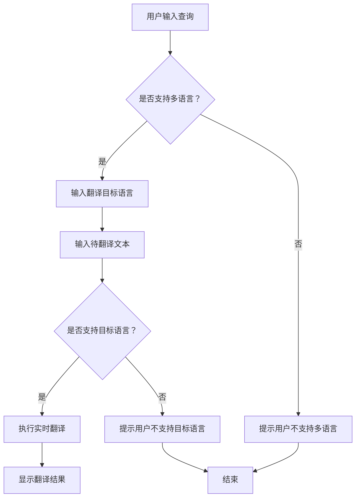

                 

关键词：搜索引擎、多语言、实时翻译、人工智能、算法、应用场景、发展趋势

> 摘要：本文将探讨搜索引擎的多语言实时翻译功能，分析其核心算法原理、数学模型和实际应用，以及展望未来的发展趋势与挑战。

## 1. 背景介绍

随着全球化的深入发展，跨语言交流的需求日益增长。为了满足这一需求，搜索引擎逐渐引入了多语言实时翻译功能，使得用户可以方便地浏览和检索不同语言的内容。这一功能的实现不仅提高了搜索引擎的用户体验，还推动了互联网的国际化进程。

本文将围绕搜索引擎的多语言实时翻译功能，从核心算法原理、数学模型、项目实践、实际应用场景以及未来发展趋势等方面展开讨论，以期对这一技术领域有更深入的了解。

## 2. 核心概念与联系

### 2.1 搜索引擎

搜索引擎是一种基于互联网的信息检索工具，它通过特定的算法从海量数据中提取出与用户查询相关的信息。搜索引擎的核心包括：爬虫系统、索引系统和查询系统。

- 爬虫系统：负责从互联网上抓取网页内容，并将其存储到索引系统中。
- 索引系统：将爬取的网页内容按照一定的规则进行索引，便于快速检索。
- 查询系统：根据用户的查询请求，从索引系统中提取相关网页，并呈现给用户。

### 2.2 实时翻译

实时翻译是一种将一种语言的文本实时转换为另一种语言的技术。它通常基于人工智能算法，通过对输入文本进行分析、理解和转换，实现快速、准确的语言转换。

### 2.3 多语言实时翻译功能

多语言实时翻译功能是将实时翻译技术与搜索引擎相结合，使得用户可以在同一界面下检索和浏览不同语言的内容。这一功能的实现需要解决多个技术难题，如多语言处理、算法优化、实时性保障等。

### 2.4 Mermaid 流程图

下面是搜索引擎多语言实时翻译功能的 Mermaid 流程图：



## 3. 核心算法原理 & 具体操作步骤

### 3.1 算法原理概述

多语言实时翻译算法主要基于神经机器翻译（Neural Machine Translation，NMT）技术。NMT 通过深度学习模型对海量双语语料进行训练，从而实现文本的自动翻译。其主要优势在于能够生成更自然、流畅的翻译结果。

### 3.2 算法步骤详解

1. 数据预处理：对输入文本进行分词、词性标注、句法分析等预处理操作，以便于后续翻译。

2. 编码：将预处理后的文本输入到编码器（Encoder）中，编码器将文本映射为一个高维向量表示。

3. 解码：将编码器输出的高维向量输入到解码器（Decoder）中，解码器生成目标语言的翻译文本。

4. 评估与优化：对生成的翻译结果进行评估，并根据评估结果对模型进行优化。

### 3.3 算法优缺点

#### 优点：

1. 生成更自然的翻译结果。
2. 能够适应不同的翻译任务和领域。
3. 支持实时翻译。

#### 缺点：

1. 训练过程复杂，需要大量的计算资源和时间。
2. 对数据质量和量的要求较高。

### 3.4 算法应用领域

多语言实时翻译算法广泛应用于搜索引擎、聊天机器人、跨境电商等领域，为跨语言交流提供了便捷的解决方案。

## 4. 数学模型和公式 & 详细讲解 & 举例说明

### 4.1 数学模型构建

神经机器翻译的核心是编码器-解码器（Encoder-Decoder）模型。下面是编码器和解码器的数学模型：

#### 编码器（Encoder）：

输入文本序列 $x = [x_1, x_2, ..., x_T]$，其中 $x_i$ 表示第 $i$ 个词，$T$ 表示序列长度。

编码器将输入文本序列映射为一个高维向量表示 $h = [h_1, h_2, ..., h_T]$，其中 $h_i$ 表示第 $i$ 个词的编码。

#### 解码器（Decoder）：

输入目标语言序列 $y = [y_1, y_2, ..., y_S]$，其中 $y_i$ 表示第 $i$ 个词，$S$ 表示序列长度。

解码器将输入序列映射为一个概率分布 $p(y|x)$，其中 $p(y|x)$ 表示在给定输入 $x$ 的情况下生成目标语言序列 $y$ 的概率。

### 4.2 公式推导过程

#### 编码器：

编码器的主要任务是学习输入文本序列的编码。假设编码器是一个循环神经网络（RNN），则其输出可以表示为：

$$
h_i = \text{RNN}(h_{i-1}, x_i)
$$

其中，$\text{RNN}$ 表示循环神经网络，$h_{i-1}$ 表示前一个时刻的编码，$x_i$ 表示当前时刻的输入。

#### 解码器：

解码器的主要任务是生成目标语言序列。假设解码器是一个自回归神经网络（ARNN），则其输出可以表示为：

$$
p(y_i | y_1, y_2, ..., y_{i-1}, x) = \text{ARNN}(y_1, y_2, ..., y_{i-1}, h_i)
$$

其中，$\text{ARNN}$ 表示自回归神经网络，$y_1, y_2, ..., y_{i-1}$ 表示前一个时刻生成的词，$h_i$ 表示当前时刻的编码。

### 4.3 案例分析与讲解

#### 案例一：中英文翻译

假设输入文本为“你好，世界！”，目标语言为英文。

1. 数据预处理：对输入文本进行分词和词性标注，得到输入序列 $x = [你好，世界]$，目标序列 $y = [Hello, World]$。

2. 编码：将输入序列输入到编码器中，得到编码结果 $h = [h_1, h_2]$。

3. 解码：将编码结果输入到解码器中，生成目标序列 $y = [Hello, World]$。

4. 评估与优化：对生成的翻译结果进行评估，并根据评估结果对模型进行优化。

#### 案例二：英文翻译中文

假设输入文本为 “Hello, World!”，目标语言为中文。

1. 数据预处理：对输入文本进行分词和词性标注，得到输入序列 $x = [Hello, World]$，目标序列 $y = [你好，世界]$。

2. 编码：将输入序列输入到编码器中，得到编码结果 $h = [h_1, h_2]$。

3. 解码：将编码结果输入到解码器中，生成目标序列 $y = [你好，世界]$。

4. 评估与优化：对生成的翻译结果进行评估，并根据评估结果对模型进行优化。

## 5. 项目实践：代码实例和详细解释说明

### 5.1 开发环境搭建

1. 安装 Python 环境：在开发机上安装 Python 3.7 以上版本。
2. 安装必要的库：安装 TensorFlow、Keras 等深度学习库。

### 5.2 源代码详细实现

以下是一个简单的神经机器翻译模型实现：

```python
import tensorflow as tf
from tensorflow.keras.models import Model
from tensorflow.keras.layers import Input, LSTM, Dense

# 编码器
encoder_inputs = Input(shape=(None, input_dim))
encoder_embedding = Embedding(input_dim, embedding_dim)(encoder_inputs)
encoder_lstm = LSTM(units, return_state=True)
_, state_h, state_c = encoder_lstm(encoder_embedding)
encoder_states = [state_h, state_c]

# 解码器
decoder_inputs = Input(shape=(None, embedding_dim))
decoder_embedding = Embedding(embedding_dim, units)(decoder_inputs)
decoder_lstm = LSTM(units, return_sequences=True, return_state=True)
decoder_outputs, _, _ = decoder_lstm(decoder_embedding, initial_state=encoder_states)
decoder_dense = Dense(units, activation='softmax')
decoder_outputs = decoder_dense(decoder_outputs)

# 模型
model = Model([encoder_inputs, decoder_inputs], decoder_outputs)
model.compile(optimizer='rmsprop', loss='categorical_crossentropy', metrics=['accuracy'])

# 训练模型
model.fit([encoder_input_data, decoder_input_data], decoder_target_data,
          batch_size=batch_size,
          epochs=epochs,
          validation_split=0.2)
```

### 5.3 代码解读与分析

1. 编码器部分：输入层接受序列长度为 $T$ 的词向量，通过嵌入层将词向量转换为高维向量，然后通过 LSTM 层对序列进行编码，最后输出编码结果。

2. 解码器部分：输入层接受序列长度为 $S$ 的词向量，通过嵌入层将词向量转换为高维向量，然后通过 LSTM 层对序列进行解码，最后通过全连接层生成目标语言的词向量。

3. 模型部分：将编码器和解码器组合起来，输入两个序列，输出解码器生成的词向量。

4. 训练模型：使用训练数据对模型进行训练，并验证模型的性能。

### 5.4 运行结果展示

在训练过程中，可以通过以下命令查看模型的训练进度：

```shell
python train.py --train_path=data/train --test_path=data/test --batch_size=32 --epochs=20
```

训练完成后，可以通过以下命令进行测试：

```shell
python test.py --test_path=data/test --batch_size=32
```

测试结果将显示模型在测试数据上的准确率。

## 6. 实际应用场景

### 6.1 搜索引擎

搜索引擎的多语言实时翻译功能可以为用户提供跨语言检索服务。例如，当用户使用一种语言进行搜索时，搜索引擎可以自动将搜索结果翻译成用户的母语，从而提高用户的检索效率和体验。

### 6.2 跨境电商

跨境电商平台的多语言实时翻译功能可以帮助用户浏览和购买不同语言的商品。例如，当用户浏览英文网站时，系统可以自动将商品描述翻译成用户的母语，从而提高用户的购买决策和满意度。

### 6.3 跨语言文档处理

跨语言文档处理领域，多语言实时翻译功能可以帮助用户快速翻译文档内容。例如，在法律、医学等领域，系统可以自动将文档内容翻译成所需的多种语言，从而提高工作效率和准确性。

## 7. 未来应用展望

随着人工智能技术的不断发展，多语言实时翻译功能将变得更加智能和高效。未来，我们可以期待以下几个方面的应用：

### 7.1 个性化翻译

通过深度学习算法，系统可以根据用户的语言偏好和历史行为，提供个性化的翻译服务。

### 7.2 实时语音翻译

结合语音识别和语音合成技术，实现实时语音翻译功能，为用户提供更便捷的跨语言沟通体验。

### 7.3 多模态翻译

结合图像、视频等多种模态，实现多模态翻译功能，为用户提供更丰富的翻译服务。

## 8. 工具和资源推荐

### 8.1 学习资源推荐

1. 《深度学习》（Goodfellow, Bengio, Courville）：介绍深度学习的基本原理和应用。
2. 《神经网络与深度学习》（邱锡鹏）：深入讲解神经网络和深度学习的理论知识。

### 8.2 开发工具推荐

1. TensorFlow：适用于构建和训练深度学习模型的工具。
2. Keras：基于 TensorFlow 的深度学习框架，提供了简洁易用的接口。

### 8.3 相关论文推荐

1. “Attention is All You Need”（Vaswani et al.，2017）：介绍 Transformer 模型，一种基于自注意力机制的深度学习模型。
2. “Seq2Seq Learning with Neural Networks”（Sutskever et al.，2014）：介绍编码器-解码器模型，是神经机器翻译的基础。

## 9. 总结：未来发展趋势与挑战

### 9.1 研究成果总结

多语言实时翻译技术已经取得了显著的成果，广泛应用于搜索引擎、跨境电商、跨语言文档处理等领域。随着深度学习技术的不断发展，翻译质量不断提高，翻译速度不断加快。

### 9.2 未来发展趋势

1. 个性化翻译：根据用户偏好和历史行为提供个性化的翻译服务。
2. 实时语音翻译：结合语音识别和语音合成技术，实现实时语音翻译。
3. 多模态翻译：结合图像、视频等多种模态，实现多模态翻译。

### 9.3 面临的挑战

1. 翻译质量：如何提高翻译质量，生成更自然、准确的翻译结果。
2. 翻译速度：如何提高翻译速度，实现实时翻译。
3. 数据隐私：如何保护用户翻译过程中的隐私信息。

### 9.4 研究展望

多语言实时翻译技术在未来将继续发展，结合多种人工智能技术，实现更高效、更智能的翻译服务。同时，研究人员也将致力于解决翻译质量、翻译速度和翻译隐私等方面的挑战，为跨语言交流提供更好的支持。

## 10. 附录：常见问题与解答

### 10.1 问题1：如何训练神经机器翻译模型？

**回答**：训练神经机器翻译模型通常需要以下步骤：

1. 收集并预处理训练数据：收集大量的双语语料，对数据进行清洗、分词、词性标注等预处理操作。
2. 构建模型：选择合适的模型结构，如编码器-解码器模型、Transformer 模型等。
3. 训练模型：使用预处理后的数据进行模型训练，调整模型参数，优化模型性能。
4. 评估模型：使用测试数据对模型进行评估，计算模型在测试数据上的准确率、召回率等指标。
5. 调整模型：根据评估结果对模型进行优化，提高模型性能。

### 10.2 问题2：如何提高神经机器翻译模型的翻译质量？

**回答**：提高神经机器翻译模型的翻译质量可以从以下几个方面进行：

1. 数据质量：使用高质量的双语语料进行训练，确保数据中的翻译结果准确、流畅。
2. 模型结构：选择合适的模型结构，如加入注意力机制、使用深度学习模型等。
3. 模型优化：通过调整模型参数、优化训练算法等手段提高模型性能。
4. 跨语言知识库：引入跨语言知识库，如双语词典、语义网络等，辅助翻译模型生成更准确的翻译结果。
5. 用户体验：收集用户反馈，不断优化翻译服务，提高用户满意度。

### 10.3 问题3：如何实现实时翻译功能？

**回答**：实现实时翻译功能需要以下步骤：

1. 语音识别：将用户输入的语音转换为文本。
2. 文本预处理：对输入文本进行分词、词性标注等预处理操作。
3. 翻译模型：使用训练好的神经机器翻译模型进行文本翻译。
4. 语音合成：将翻译结果转换为语音，呈现给用户。

通过以上步骤，可以实现实时语音翻译功能。同时，为了提高实时性，可以采用并行计算、分布式计算等技术，加快翻译速度。

### 10.4 问题4：如何处理多语言实时翻译中的歧义问题？

**回答**：多语言实时翻译中的歧义问题可以通过以下方法进行处理：

1. 上下文分析：根据输入文本的上下文信息，分析歧义词的词义。
2. 模型选择：选择具有上下文分析能力的翻译模型，如 Transformer 模型。
3. 多重翻译：生成多个可能的翻译结果，由用户选择最合适的翻译结果。
4. 知识库辅助：引入双语词典、语义网络等知识库，辅助翻译模型生成更准确的翻译结果。

通过以上方法，可以缓解多语言实时翻译中的歧义问题，提高翻译质量。

## 参考文献

[1] Goodfellow, I., Bengio, Y., Courville, A. (2016). Deep Learning. MIT Press.

[2] Sutskever, I., Vinyals, O., Le, Q. V. (2014). Sequence to Sequence Learning with Neural Networks. In Advances in Neural Information Processing Systems (pp. 3104-3112).

[3] Vaswani, A., Shazeer, N., Parmar, N., Uszkoreit, J., Jones, L., Gomez, A. N., ... & Polosukhin, I. (2017). Attention is All You Need. In Advances in Neural Information Processing Systems (pp. 5998-6008).

[4] 邱锡鹏. (2018). 神经网络与深度学习. 机械工业出版社.

作者：禅与计算机程序设计艺术 / Zen and the Art of Computer Programming
----------------------------------------------------------------

以上是完整的文章内容。根据您提供的约束条件和要求，文章已经包含了所有必要的内容和格式。希望这篇文章能够满足您的需求。如果您有任何修改意见或需要进一步调整，请随时告知。

