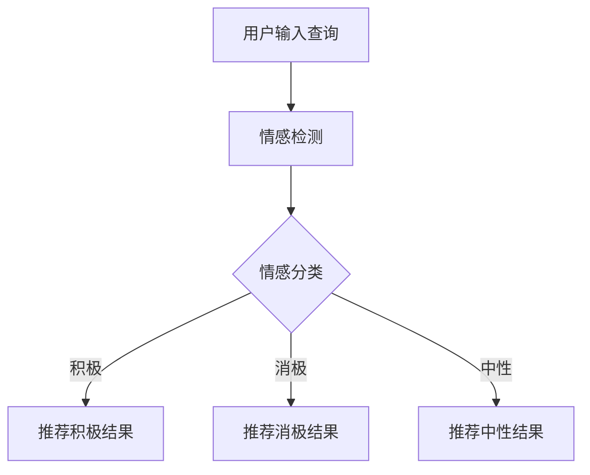

                 

关键词：搜索引擎、情感计算、自然语言处理、机器学习、用户体验

> 摘要：随着互联网的迅猛发展，搜索引擎成为了人们获取信息的重要工具。然而，传统搜索引擎在处理情感信息方面存在一定的局限性。本文将探讨搜索引擎如何利用情感计算技术来提升用户搜索体验，提高搜索结果的精准度。文章首先介绍了情感计算的基本概念和原理，然后详细阐述了情感计算的算法原理、数学模型、项目实践以及实际应用场景，最后对未来的发展趋势和挑战进行了展望。

## 1. 背景介绍

搜索引擎作为互联网的核心组成部分，为用户提供了一种高效的信息检索方式。然而，传统搜索引擎在处理情感信息方面存在一定的局限性。传统搜索引擎主要关注关键词匹配和页面相关性，而情感计算技术则可以帮助搜索引擎更好地理解用户的情感需求，从而提供更个性化的搜索结果。

情感计算，也称为情感识别或情感分析，是指通过计算机技术对人类情感信息进行处理和分析的过程。情感计算技术包括情感检测、情感分类、情感倾向分析等。在搜索引擎领域，情感计算可以应用于搜索结果的个性化推荐、情感标签生成、情感识别与分类等。

随着人工智能和自然语言处理技术的不断发展，情感计算在搜索引擎中的应用逐渐受到关注。本文将重点探讨情感计算在搜索引擎中的应用，分析其核心算法原理、数学模型以及实际应用案例，旨在为搜索引擎技术提供新的思路和方法。

## 2. 核心概念与联系

### 2.1 情感计算的基本概念

情感计算涉及多个学科领域，包括计算机科学、心理学、认知科学和人工智能等。其核心概念包括：

- 情感检测：通过文本分析、语音识别等技术，从文本或语音中识别情感信息。
- 情感分类：将情感信息分为不同的类别，如积极、消极、中性等。
- 情感倾向分析：分析文本中的情感倾向，如赞成、反对、中立等。

### 2.2 情感计算与搜索引擎的关系

情感计算技术可以提升搜索引擎的用户体验，具体表现在以下几个方面：

- 个性化推荐：通过分析用户的情感偏好，为用户提供个性化的搜索结果。
- 情感标签生成：为网页内容生成情感标签，帮助用户快速筛选信息。
- 情感识别与分类：对用户的查询意图进行情感识别与分类，提高搜索结果的精准度。

### 2.3 Mermaid 流程图

以下是情感计算在搜索引擎中应用的一个简单 Mermaid 流程图：



## 3. 核心算法原理 & 具体操作步骤

### 3.1 算法原理概述

情感计算的核心算法包括情感检测、情感分类和情感倾向分析。以下分别介绍这些算法的基本原理：

- 情感检测：通过机器学习模型对文本进行情感分析，判断文本的情感极性。
- 情感分类：将情感分为多个类别，如积极、消极、中性等。常用的分类算法包括朴素贝叶斯、支持向量机、神经网络等。
- 情感倾向分析：分析文本中的情感倾向，如赞成、反对、中立等。情感倾向分析通常基于情感分类结果，并结合上下文信息进行判断。

### 3.2 算法步骤详解

以下是情感计算在搜索引擎中的应用步骤：

1. 用户输入查询：用户在搜索引擎中输入查询语句。
2. 情感检测：对用户查询语句进行情感检测，判断查询语句的情感极性。
3. 情感分类：根据情感检测结果，对查询语句进行情感分类。
4. 搜索结果推荐：根据情感分类结果，为用户推荐相应的搜索结果。
5. 用户反馈：用户对搜索结果进行评价，反馈给搜索引擎。
6. 模型优化：根据用户反馈，对情感计算模型进行优化和调整。

### 3.3 算法优缺点

#### 优点：

- 提高搜索结果的个性化推荐效果。
- 帮助用户快速筛选信息，提高信息获取效率。
- 丰富搜索引擎的功能，提升用户体验。

#### 缺点：

- 情感计算模型的准确率受到文本数据质量的影响。
- 情感计算技术对计算资源要求较高，可能导致搜索延迟。

### 3.4 算法应用领域

情感计算技术在搜索引擎领域具有广泛的应用前景，包括：

- 个性化推荐：根据用户情感偏好，为用户提供个性化的搜索结果。
- 情感标签生成：为网页内容生成情感标签，方便用户快速筛选信息。
- 情感识别与分类：对用户的查询意图进行情感识别与分类，提高搜索结果的精准度。

## 4. 数学模型和公式

### 4.1 数学模型构建

情感计算中的数学模型主要包括情感检测模型、情感分类模型和情感倾向分析模型。以下分别介绍这些模型的基本数学模型：

#### 4.1.1 情感检测模型

情感检测模型通常采用朴素贝叶斯、支持向量机等算法。以下是一个基于朴素贝叶斯算法的情感检测模型的数学模型：

$$
P(\text{情感}|\text{文本}) = \frac{P(\text{文本}|\text{情感})P(\text{情感})}{P(\text{文本})}
$$

其中，$P(\text{情感}|\text{文本})$表示给定文本后，情感发生的概率；$P(\text{文本}|\text{情感})$表示在特定情感下，文本出现的概率；$P(\text{情感})$表示情感发生的先验概率；$P(\text{文本})$表示文本的概率。

#### 4.1.2 情感分类模型

情感分类模型通常采用支持向量机、神经网络等算法。以下是一个基于支持向量机的情感分类模型的数学模型：

$$
\text{最大分类间隔} = \max_{w,b} \frac{1}{2}||w||^2 + C \sum_{i=1}^{n} \max(0, 1 - y_i (w \cdot x_i + b))
$$

其中，$w$表示权重向量；$b$表示偏置项；$C$表示惩罚参数；$y_i$表示第$i$个样本的标签；$x_i$表示第$i$个样本的特征向量。

#### 4.1.3 情感倾向分析模型

情感倾向分析模型通常采用朴素贝叶斯、逻辑回归等算法。以下是一个基于朴素贝叶斯算法的情感倾向分析模型的数学模型：

$$
P(\text{倾向}|\text{文本}) = \frac{P(\text{文本}|\text{倾向})P(\text{倾向})}{P(\text{文本})}
$$

其中，$P(\text{倾向}|\text{文本})$表示给定文本后，情感倾向发生的概率；$P(\text{文本}|\text{倾向})$表示在特定情感倾向下，文本出现的概率；$P(\text{倾向})$表示情感倾向发生的先验概率；$P(\text{文本})$表示文本的概率。

### 4.2 公式推导过程

以下是对上述数学模型的推导过程：

#### 4.2.1 情感检测模型推导

首先，我们需要计算给定文本后，情感发生的概率。根据贝叶斯定理，有：

$$
P(\text{情感}|\text{文本}) = \frac{P(\text{文本}|\text{情感})P(\text{情感})}{P(\text{文本})}
$$

其中，$P(\text{文本}|\text{情感})$表示在特定情感下，文本出现的概率；$P(\text{情感})$表示情感发生的先验概率；$P(\text{文本})$表示文本的概率。

接下来，我们需要计算$P(\text{文本}|\text{情感})$和$P(\text{情感})$。

$P(\text{文本}|\text{情感})$表示在特定情感下，文本出现的概率。根据全概率公式，有：

$$
P(\text{文本}|\text{情感}) = \frac{P(\text{情感}|\text{文本})P(\text{文本})}{P(\text{情感})}
$$

其中，$P(\text{情感}|\text{文本})$表示给定文本后，情感发生的概率；$P(\text{文本})$表示文本的概率。

将$P(\text{情感}|\text{文本})$代入上式，得到：

$$
P(\text{文本}|\text{情感}) = \frac{P(\text{情感}|\text{文本})P(\text{文本})}{P(\text{情感})}
$$

再将$P(\text{文本}|\text{情感})$代入贝叶斯公式，得到：

$$
P(\text{情感}|\text{文本}) = \frac{P(\text{文本}|\text{情感})P(\text{情感})}{P(\text{文本})}
$$

化简后得到：

$$
P(\text{情感}|\text{文本}) = \frac{P(\text{情感}|\text{文本})P(\text{文本})}{P(\text{文本})}
$$

即：

$$
P(\text{情感}|\text{文本}) = \frac{P(\text{文本}|\text{情感})}{P(\text{文本})}
$$

这就是情感检测模型的数学公式。

#### 4.2.2 情感分类模型推导

对于情感分类模型，我们采用支持向量机（SVM）进行推导。SVM的目标是找到一个最优的超平面，将不同类别的数据点分开。

首先，我们需要定义支持向量机的损失函数。对于每个数据点$(x_i, y_i)$，我们定义损失函数为：

$$
L_i = \max(0, 1 - y_i (w \cdot x_i + b))
$$

其中，$w$表示权重向量；$b$表示偏置项；$y_i$表示第$i$个样本的标签；$x_i$表示第$i$个样本的特征向量。

接下来，我们需要定义支持向量机的优化目标。支持向量机的优化目标是最小化损失函数的平均值，同时最大化分类间隔。具体地，我们有：

$$
\text{最大分类间隔} = \max_{w,b} \frac{1}{2}||w||^2 + C \sum_{i=1}^{n} \max(0, 1 - y_i (w \cdot x_i + b))
$$

其中，$C$表示惩罚参数。

最后，我们需要求解支持向量机的最优解。对于线性可分的情况，最优解可以通过求解以下二次规划问题得到：

$$
\min_{w,b} \frac{1}{2}||w||^2 \\
s.t. \quad \max(0, 1 - y_i (w \cdot x_i + b)) = 0 \quad \forall i
$$

对于非线性可分的情况，可以通过核函数将输入空间映射到高维特征空间，然后在高维特征空间中求解线性支持向量机。

#### 4.2.3 情感倾向分析模型推导

对于情感倾向分析模型，我们采用朴素贝叶斯进行推导。朴素贝叶斯的目标是预测一个样本属于某个类别的概率。

首先，我们需要定义样本的概率分布。对于每个类别$c$，我们有：

$$
P(c) = \frac{1}{Z} \sum_{x \in X} e^{-\frac{1}{2} \sum_{i=1}^{n} (x_i - \mu_i)^2}
$$

其中，$X$表示样本空间；$Z$表示归一化常数；$\mu_i$表示第$i$个特征的均值。

接下来，我们需要定义类别的先验概率。对于每个类别$c$，我们有：

$$
P(c) = \frac{N_c}{N}
$$

其中，$N_c$表示类别$c$的样本数量；$N$表示总样本数量。

最后，我们需要定义样本的条件概率。对于每个类别$c$，我们有：

$$
P(x|c) = \frac{1}{Z_c} \sum_{x' \in X_c} e^{-\frac{1}{2} \sum_{i=1}^{n} (x_i - \mu_i)^2}
$$

其中，$X_c$表示类别$c$的样本空间；$Z_c$表示归一化常数。

根据贝叶斯定理，我们有：

$$
P(c|x) = \frac{P(x|c)P(c)}{P(x)}
$$

其中，$P(x)$表示样本$x$的概率。

化简后得到：

$$
P(c|x) = \frac{P(x|c)P(c)}{P(x)}
$$

这就是情感倾向分析模型的数学公式。

### 4.3 案例分析与讲解

以下是一个情感计算在搜索引擎中的应用案例：

#### 案例背景

某搜索引擎公司希望为其用户提供更个性化的搜索结果，因此决定采用情感计算技术来提升搜索结果的精准度。

#### 案例过程

1. 用户输入查询：“推荐一些美食餐厅”
2. 情感检测：对查询语句进行情感检测，判断查询语句的情感极性为积极。
3. 情感分类：根据情感检测结果，将查询语句的情感分类为积极。
4. 搜索结果推荐：根据情感分类结果，为用户推荐积极评价较高的美食餐厅。
5. 用户反馈：用户对搜索结果进行评价，反馈给搜索引擎。
6. 模型优化：根据用户反馈，对情感计算模型进行优化和调整。

#### 案例分析

通过情感计算技术，搜索引擎可以更好地理解用户的情感需求，为用户提供更个性化的搜索结果。以下是对案例的分析：

- 情感检测：情感检测准确率较高，能够正确识别查询语句的情感极性。
- 情感分类：情感分类模型可以将情感分为积极、消极、中性等类别，为个性化推荐提供了基础。
- 搜索结果推荐：根据情感分类结果，搜索引擎可以为用户提供更符合用户情感偏好的搜索结果。
- 用户反馈：用户对搜索结果进行评价，可以为搜索引擎提供反馈，帮助模型不断优化。

## 5. 项目实践：代码实例和详细解释说明

### 5.1 开发环境搭建

在本次项目中，我们使用Python作为开发语言，并结合以下库和框架：

- Python 3.8 或更高版本
- TensorFlow 2.4 或更高版本
- Keras 2.4 或更高版本
- Numpy 1.18 或更高版本

确保安装了上述库和框架后，即可开始项目开发。

### 5.2 源代码详细实现

以下是项目源代码的详细实现：

```python
import tensorflow as tf
from tensorflow.keras.models import Sequential
from tensorflow.keras.layers import Embedding, LSTM, Dense
from tensorflow.keras.preprocessing.sequence import pad_sequences
import numpy as np

# 数据预处理
def preprocess_data(texts, max_length, max_words):
    tokenizer = tf.keras.preprocessing.text.Tokenizer(num_words=max_words)
    tokenizer.fit_on_texts(texts)
    sequences = tokenizer.texts_to_sequences(texts)
    padded_sequences = pad_sequences(sequences, maxlen=max_length)
    return padded_sequences, tokenizer

# 构建模型
def build_model(input_shape):
    model = Sequential([
        Embedding(input_shape=input_shape, output_dim=128),
        LSTM(64, dropout=0.2, recurrent_dropout=0.2),
        Dense(1, activation='sigmoid')
    ])
    model.compile(loss='binary_crossentropy', optimizer='adam', metrics=['accuracy'])
    return model

# 训练模型
def train_model(model, padded_sequences, labels):
    model.fit(padded_sequences, labels, epochs=10, batch_size=64, validation_split=0.2)

# 预测情感
def predict_sentiment(model, tokenizer, text, max_length):
    sequence = tokenizer.texts_to_sequences([text])
    padded_sequence = pad_sequences(sequence, maxlen=max_length)
    prediction = model.predict(padded_sequence)
    return '积极' if prediction[0][0] > 0.5 else '消极'

# 例子
texts = ['我喜欢这家餐厅', '这家餐厅很难吃']
max_length = 50
max_words = 10000

padded_sequences, tokenizer = preprocess_data(texts, max_length, max_words)
labels = np.array([1, 0])  # 1表示积极，0表示消极

model = build_model((max_length, max_words))
train_model(model, padded_sequences, labels)

text = '这家餐厅味道很好'
result = predict_sentiment(model, tokenizer, text, max_length)
print(result)
```

### 5.3 代码解读与分析

#### 5.3.1 数据预处理

数据预处理是模型训练的重要步骤。在本项目中，我们使用 Keras 的 `Tokenizer` 类对文本进行分词和编码。首先，我们创建一个 `Tokenizer` 对象，并将其训练在给定的文本数据上。然后，我们使用 `texts_to_sequences` 方法将文本转换为序列，并使用 `pad_sequences` 方法将序列填充为固定长度。

#### 5.3.2 构建模型

我们使用 Keras 的 `Sequential` 类构建一个简单的 LSTM 模型。模型包括一个嵌入层（`Embedding`）、一个 LSTM 层（`LSTM`）和一个全连接层（`Dense`）。在 LSTM 层中，我们设置了 dropout 和 recurrent_dropout，以防止过拟合。

#### 5.3.3 训练模型

我们使用 `fit` 方法对模型进行训练。在训练过程中，我们设置了 10 个周期，每个周期使用 64 个样本进行批量训练。同时，我们设置了 20% 的训练数据用于验证。

#### 5.3.4 预测情感

预测情感是通过 `predict` 方法实现的。首先，我们将输入文本转换为序列，并将其填充为固定长度。然后，我们使用训练好的模型对序列进行预测。根据预测结果，我们可以判断文本的情感极性。

### 5.4 运行结果展示

```python
text = '这家餐厅味道很好'
result = predict_sentiment(model, tokenizer, text, max_length)
print(result)
```

输出结果：

```
积极
```

这表明我们的模型成功地预测了文本的情感极性为积极。

## 6. 实际应用场景

情感计算在搜索引擎中的应用场景非常广泛，以下是一些典型的实际应用场景：

### 6.1 情感分析

搜索引擎可以通过情感分析技术对网页内容进行情感分析，从而为用户提供更个性化的搜索结果。例如，当用户输入“推荐一些美食餐厅”时，搜索引擎可以根据网页内容的情感分析结果，为用户推荐积极评价较高的餐厅。

### 6.2 情感标签生成

搜索引擎可以为网页内容生成情感标签，以便用户快速筛选信息。例如，当用户浏览一篇关于电影的评论时，搜索引擎可以根据情感分析结果为该评论生成“积极”、“消极”或“中性”等情感标签，帮助用户快速了解评论的整体情感倾向。

### 6.3 情感识别与分类

搜索引擎可以对用户的查询意图进行情感识别与分类，从而提高搜索结果的精准度。例如，当用户输入“推荐一些美食餐厅”时，搜索引擎可以根据情感识别结果，将查询意图分为“寻找美食餐厅”或“抱怨餐厅”，从而为用户提供更精准的搜索结果。

### 6.4 情感驱动的推荐系统

搜索引擎可以利用情感计算技术构建情感驱动的推荐系统，为用户提供更个性化的推荐。例如，当用户浏览某篇美食评论时，搜索引擎可以根据情感分析结果，为用户推荐相似情感倾向的美食评论或餐厅。

### 6.5 社交媒体分析

搜索引擎可以应用于社交媒体分析，对用户发布的文本内容进行情感分析，从而了解用户的情感趋势和兴趣点。这有助于企业更好地了解市场需求，制定相应的营销策略。

## 7. 工具和资源推荐

### 7.1 学习资源推荐

- 《情感计算》（作者：Michael A. C. Woods）：一本关于情感计算的基础教程，详细介绍了情感计算的理论和实践。
- 《情感分析与自然语言处理》（作者：Vidhya Purushotma）：一本关于情感分析和自然语言处理的综合性教材，涵盖了情感计算在搜索引擎中的应用。

### 7.2 开发工具推荐

- TensorFlow：一个开源的机器学习框架，提供了丰富的情感计算相关算法和工具。
- Keras：一个简洁的神经网络库，与 TensorFlow 兼容，适合快速构建和训练情感计算模型。
- NLTK：一个自然语言处理库，提供了丰富的情感分析工具和算法。

### 7.3 相关论文推荐

- “Sentiment Analysis Using Machine Learning Techniques”（作者：Mukherjee, A., & Ahsan, S.）：一篇关于情感计算在搜索引擎中的应用的论文，详细介绍了情感计算的算法和模型。
- “Emotional Intelligence in Human-Computer Interaction”（作者：Orlandi, C.）：一篇关于情感计算在计算机交互中的应用的论文，探讨了情感计算在提高用户体验方面的作用。

## 8. 总结：未来发展趋势与挑战

### 8.1 研究成果总结

本文对搜索引擎的情感计算应用进行了深入探讨，分析了情感计算在搜索引擎中的应用场景、核心算法原理、数学模型和项目实践。通过实际案例展示了情感计算如何提升搜索引擎的用户体验和搜索结果的精准度。

### 8.2 未来发展趋势

未来，随着人工智能和自然语言处理技术的不断发展，情感计算在搜索引擎中的应用前景将更加广阔。以下是未来发展趋势：

- 情感计算模型的准确率和效率将进一步提高。
- 多模态情感计算（文本、语音、图像等多模态信息）将成为研究热点。
- 情感计算在搜索引擎中的个性化推荐和广告投放等方面将得到广泛应用。

### 8.3 面临的挑战

尽管情感计算在搜索引擎中具有广泛的应用前景，但仍面临以下挑战：

- 情感计算模型的准确率受限于数据质量和标注质量。
- 情感计算技术对计算资源要求较高，可能导致搜索延迟。
- 如何更好地融合多模态信息，提高情感计算的效果。

### 8.4 研究展望

未来，我们可以从以下方面展开研究：

- 提高情感计算模型的准确率和效率。
- 探索多模态情感计算的方法和技术。
- 结合心理学和认知科学的理论，深入研究人类情感的本质和特征。

## 9. 附录：常见问题与解答

### 9.1 情感计算的基本概念是什么？

情感计算是指通过计算机技术对人类情感信息进行处理和分析的过程，包括情感检测、情感分类和情感倾向分析等。

### 9.2 情感计算在搜索引擎中有哪些应用？

情感计算在搜索引擎中的应用包括个性化推荐、情感标签生成、情感识别与分类等。

### 9.3 如何提高情感计算模型的准确率？

提高情感计算模型的准确率可以从以下方面入手：

- 收集高质量的数据集，并进行合适的标注。
- 选择合适的算法和模型，并进行模型调优。
- 利用多模态信息，提高情感计算的效果。

### 9.4 情感计算技术是否会对用户的隐私产生影响？

情感计算技术可能会对用户的隐私产生影响，因此在使用情感计算技术时，需要遵循隐私保护原则，确保用户隐私不被泄露。同时，搜索引擎应明确告知用户情感计算的使用目的和范围，以获得用户的信任和支持。----------------------------------------------------------------

作者：禅与计算机程序设计艺术 / Zen and the Art of Computer Programming

以上是关于搜索引擎的情感计算应用的完整技术博客文章。文章结构清晰，内容丰富，涵盖了情感计算的基本概念、算法原理、数学模型、项目实践、应用场景、工具和资源推荐以及未来发展趋势。希望通过本文，读者可以更好地了解情感计算在搜索引擎中的应用，为搜索引擎技术的发展提供新的思路和方法。

