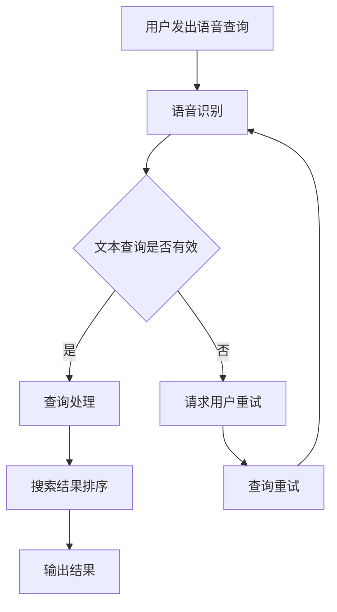

                 

关键词：搜索引擎、语音交互、人工智能、自然语言处理、用户体验、技术进步

> 摘要：本文将探讨搜索引擎语音交互功能的发展历程、核心概念、算法原理以及未来的发展方向。通过深入分析语音交互技术的演变，我们将揭示其在提升用户体验、优化搜索效率和拓展应用场景等方面的巨大潜力。

## 1. 背景介绍

随着人工智能和自然语言处理技术的飞速发展，搜索引擎正逐渐从传统的文本输入转向更加人性化的语音交互。语音交互作为一种直观、便捷的交互方式，不仅能够降低用户操作的复杂度，还能提高信息检索的效率。在此背景下，搜索引擎的语音交互功能成为科技企业竞相探索的热点领域。

### 1.1 语音交互技术的起源

语音交互技术最早可以追溯到20世纪50年代。当时的计算机科学家开始尝试通过语音合成和语音识别技术实现人与计算机的交互。1954年，IBM推出了世界上第一个商用语音合成器Shoebox，标志着语音交互技术的萌芽。随后，语音识别技术逐渐成熟，1982年，IBM发布了首个能够识别连续语音的识别系统。

### 1.2 搜索引擎的发展历程

搜索引擎的历史可以追溯到20世纪90年代。最早期的搜索引擎如AltaVista、Excite和Lycos等，主要依赖于关键词匹配和索引技术。随着互联网的飞速发展，搜索引擎的功能和性能得到了大幅提升。2001年，谷歌推出了其革命性的PageRank算法，使搜索结果更加精准和个性化。

### 1.3 语音交互与搜索引擎的融合

随着语音交互技术的成熟和普及，搜索引擎开始逐步引入语音搜索功能。2001年，苹果公司推出的iPod产品线中首次嵌入了语音搜索功能，这是搜索引擎语音交互的雏形。随后，谷歌、微软和亚马逊等科技巨头纷纷推出各自的语音搜索产品，推动了语音交互在搜索引擎领域的广泛应用。

## 2. 核心概念与联系

在深入探讨搜索引擎语音交互功能的发展之前，我们需要了解一些核心概念和技术原理。以下是语音交互、自然语言处理和搜索引擎技术之间的联系和相互影响。

### 2.1 语音交互

语音交互是指通过语音信号输入和输出实现人与计算机之间的信息交换。其核心包括语音识别（Automatic Speech Recognition，ASR）和语音合成（Text-to-Speech，TTS）。语音识别技术将语音信号转换为文本，而语音合成技术则将文本转换为语音。

### 2.2 自然语言处理

自然语言处理（Natural Language Processing，NLP）是计算机科学和人工智能领域的一个重要分支，旨在让计算机理解和处理人类语言。NLP技术包括分词、词性标注、命名实体识别、句法分析等，这些技术在语音交互和搜索引擎中扮演着关键角色。

### 2.3 搜索引擎

搜索引擎是一种通过索引数据库中的信息来回答用户查询的系统。搜索引擎的核心技术包括页面爬取、索引构建、查询处理和结果排序。随着语音交互技术的引入，搜索引擎需要能够理解和处理用户的语音查询，从而提供更加智能和个性化的搜索结果。

### 2.4 Mermaid 流程图

为了更好地理解语音交互技术在搜索引擎中的应用，我们可以使用Mermaid流程图来展示核心概念和流程。以下是一个简化的流程图示例：



## 3. 核心算法原理 & 具体操作步骤

### 3.1 算法原理概述

搜索引擎语音交互的核心算法包括语音识别、自然语言处理和搜索结果排序。语音识别技术将用户的语音输入转换为文本查询，自然语言处理技术对文本查询进行语义分析和处理，而搜索结果排序技术则根据查询的语义和用户的兴趣对搜索结果进行排序和展示。

### 3.2 算法步骤详解

#### 3.2.1 语音识别

语音识别过程包括以下几个步骤：

1. **音频预处理**：对采集的语音信号进行降噪、滤波和增强，以提高语音信号的清晰度和质量。
2. **特征提取**：从预处理后的语音信号中提取特征，如梅尔频率倒谱系数（MFCC）、线性预测编码（LPC）等。
3. **模型训练**：使用大量语音数据进行训练，以构建语音识别模型。
4. **解码与识别**：将提取的特征输入到识别模型中，通过解码过程将特征序列转换为文本查询。

#### 3.2.2 自然语言处理

自然语言处理过程包括以下几个步骤：

1. **分词与词性标注**：将文本查询划分为单词和短语，并对每个单词或短语进行词性标注。
2. **命名实体识别**：识别文本中的命名实体，如人名、地名、组织机构名等。
3. **句法分析**：对文本查询进行句法分析，构建句法树，以理解句子的结构。
4. **语义分析**：根据句法分析结果，对文本查询进行语义分析，提取查询的关键词和意图。

#### 3.2.3 搜索结果排序

搜索结果排序过程包括以下几个步骤：

1. **查询理解**：根据自然语言处理的结果，对查询进行理解，提取查询的关键词和意图。
2. **搜索索引**：在搜索引擎的索引数据库中查找与查询相关的网页或文档。
3. **排序算法**：使用排序算法（如PageRank、BM25等）对搜索结果进行排序，以提供最相关的搜索结果。
4. **结果展示**：将排序后的搜索结果按照用户需求进行展示。

### 3.3 算法优缺点

#### 优点

1. **高效率**：语音交互可以显著提高信息检索的效率，用户无需手动输入查询，节省时间和精力。
2. **易用性**：语音交互更加直观和便捷，用户可以通过语音直接进行搜索，无需学习复杂的操作界面。
3. **个性化**：通过自然语言处理技术，搜索引擎可以更好地理解用户的查询意图，提供更加个性化的搜索结果。

#### 缺点

1. **准确性**：语音识别技术的准确性仍然有待提高，特别是在嘈杂环境或方言、口音较多的情况下。
2. **隐私问题**：语音交互可能涉及用户的隐私数据，需要采取有效措施保护用户的隐私。
3. **语音资源消耗**：语音识别和自然语言处理算法需要大量计算资源，对设备的性能和功耗提出了较高要求。

### 3.4 算法应用领域

语音交互技术在搜索引擎领域的应用非常广泛，包括但不限于以下领域：

1. **移动设备**：在智能手机、平板电脑等移动设备上，用户可以通过语音搜索快速获取所需信息，提高使用效率。
2. **智能音箱**：智能音箱作为家庭智能中心，可以通过语音交互实现音乐播放、天气查询、日程管理等功能。
3. **车载系统**：在车载系统中，语音交互可以实现导航、电话拨号、音乐播放等功能，提高驾驶安全性和便利性。
4. **智能家居**：在智能家居系统中，语音交互可以实现对家电设备、照明系统、安防系统等的智能控制。

## 4. 数学模型和公式 & 详细讲解 & 举例说明

### 4.1 数学模型构建

在搜索引擎的语音交互功能中，数学模型主要用于语音识别和自然语言处理。以下是两个核心数学模型的简要介绍：

#### 4.1.1 语音识别模型

语音识别模型通常采用隐藏马尔可夫模型（Hidden Markov Model，HMM）或循环神经网络（Recurrent Neural Network，RNN）来建模语音信号和时间序列数据。以下是HMM语音识别模型的基本公式：

1. **状态转移概率**：
   \[ P(X_t = x_t | X_{t-1} = x_{t-1}) = a_{x_{t-1}, x_t} \]
2. **输出概率**：
   \[ P(O_t = o_t | X_t = x_t) = b_{x_t, o_t} \]

其中，\( X_t \)表示时间\( t \)的状态序列，\( O_t \)表示时间\( t \)的输出序列，\( a_{x_{t-1}, x_t} \)和\( b_{x_t, o_t} \)分别为状态转移概率和输出概率。

#### 4.1.2 自然语言处理模型

自然语言处理模型通常采用循环神经网络（RNN）或长短时记忆网络（Long Short-Term Memory，LSTM）来建模文本序列。以下是RNN自然语言处理模型的基本公式：

1. **输入与隐藏状态**：
   \[ h_t = \sigma(W_h \cdot [h_{t-1}, x_t] + b_h) \]
2. **输出与隐藏状态**：
   \[ y_t = \text{softmax}(W_y \cdot h_t + b_y) \]

其中，\( h_t \)表示时间\( t \)的隐藏状态，\( x_t \)表示时间\( t \)的输入，\( \sigma \)表示激活函数，\( W_h \)和\( b_h \)分别为权重和偏置，\( W_y \)和\( b_y \)分别为输出层的权重和偏置。

### 4.2 公式推导过程

#### 4.2.1 语音识别模型推导

语音识别模型的推导过程主要包括特征提取、模型训练和解码三个阶段。以下是特征提取和模型训练的简要推导：

1. **特征提取**：

   假设语音信号经过预处理后，每个时间点的特征表示为一个\( D \)维的特征向量\( X_t \)。特征提取的目标是构建一个特征提取器，将原始语音信号映射为特征向量。一个简单的特征提取器可以采用梅尔频率倒谱系数（MFCC）：

   \[ X_t = \text{MFCC}(S_t) \]

   其中，\( S_t \)为原始语音信号。

2. **模型训练**：

   假设使用HMM模型进行语音识别。HMM模型的训练过程主要包括最大似然估计（Maximum Likelihood Estimation，MLE）和维特比算法（Viterbi Algorithm）。

   - **最大似然估计**：

     目标是最小化对数似然损失函数：
     \[ L(\theta) = -\sum_{t=1}^T \sum_{x_t \in X} \sum_{o_t \in O} \log P(X_t = x_t, O_t = o_t | \theta) \]

     通过梯度下降法或随机梯度下降法，对模型参数进行优化。

   - **维特比算法**：

     维特比算法是一种动态规划算法，用于找到最优状态路径。其基本思想是维护一个前向概率和后向概率，更新当前最优状态路径。

3. **解码**：

   在语音识别模型训练完成后，解码过程用于将特征序列转换为文本查询。解码过程通常采用前向-后向算法或A*搜索算法。

#### 4.2.2 自然语言处理模型推导

自然语言处理模型的推导过程主要包括模型架构、损失函数和优化方法。以下是RNN自然语言处理模型的简要推导：

1. **模型架构**：

   RNN自然语言处理模型通常采用循环神经网络（RNN）或长短时记忆网络（LSTM）作为基础。一个简单的RNN模型包括输入层、隐藏层和输出层。

   - **输入层**：

     输入层接收文本序列，每个时间点的输入为一个\( D \)维的词向量。

     \[ x_t = \text{Word2Vec}(w_t) \]

   - **隐藏层**：

     隐藏层通过循环连接将当前时间点的隐藏状态与前一时刻的隐藏状态相结合。

     \[ h_t = \sigma(W_h \cdot [h_{t-1}, x_t] + b_h) \]

   - **输出层**：

     输出层通过softmax函数输出文本序列的概率分布。

     \[ y_t = \text{softmax}(W_y \cdot h_t + b_y) \]

2. **损失函数**：

   自然语言处理模型的损失函数通常采用交叉熵损失函数。交叉熵损失函数表示模型预测概率分布与真实分布之间的差异。

   \[ L(\theta) = -\sum_{t=1}^T y_t \log (\hat{y}_t) \]

3. **优化方法**：

   自然语言处理模型的优化方法通常采用梯度下降法或其变体，如Adam优化器。优化过程的目标是最小化损失函数，更新模型参数。

   \[ \theta = \theta - \alpha \nabla_\theta L(\theta) \]

### 4.3 案例分析与讲解

为了更好地理解语音交互技术在搜索引擎中的应用，以下是一个简化的案例分析：

#### 案例背景

假设用户通过语音交互向搜索引擎发出查询：“附近的餐厅推荐”。

#### 案例分析

1. **语音识别**：

   语音识别模型将用户的语音输入转换为文本查询：“附近的餐厅推荐”。

   - **特征提取**：

     假设输入语音信号经过预处理和特征提取后，得到一个\( 40 \)维的特征向量。

     \[ X_t = \text{MFCC}(S_t) \]

   - **模型训练与解码**：

     使用HMM模型进行语音识别。在模型训练过程中，通过最大似然估计和维特比算法，得到最优状态路径，将特征序列转换为文本查询。

2. **自然语言处理**：

   自然语言处理模型对文本查询进行语义分析和处理，提取关键词和意图。

   - **分词与词性标注**：

     使用分词工具对文本查询进行分词，得到：“附近的”、“餐厅”和“推荐”。

     \[ w_t = \text{分词}(y_t) \]

     对分词后的单词进行词性标注，得到：“附近的”（介词）、“餐厅”（名词）和“推荐”（动词）。

   - **命名实体识别**：

     识别文本查询中的命名实体，如“餐厅”是一个命名实体。

     \[ E_t = \text{命名实体识别}(w_t) \]

   - **句法分析**：

     构建句法树，表示文本查询的结构：

     ```
     (S
       (PP (IN 在))
       (NN餐厅)
       (VBZ推荐))
     ```

   - **语义分析**：

     根据句法分析和命名实体识别结果，提取关键词和意图：

     - 关键词：“餐厅”、“推荐”
     - 意图：获取附近餐厅的推荐信息

3. **搜索结果排序**：

   搜索引擎根据关键词和意图，在索引数据库中查找相关的网页或文档，并对搜索结果进行排序。

   - **查询理解**：

     根据语义分析结果，理解用户的查询意图为“获取附近餐厅的推荐信息”。

     \[ q = \text{查询理解}(E_t) \]

   - **搜索索引**：

     在索引数据库中查找与查询相关的网页或文档。

     \[ R = \text{搜索索引}(q) \]

   - **排序算法**：

     使用PageRank算法对搜索结果进行排序，根据网页的权威度和相关性，为用户提供最相关的搜索结果。

     \[ R' = \text{PageRank}(R) \]

   - **结果展示**：

     将排序后的搜索结果按照用户需求进行展示，如餐厅的名称、地址、评分等信息。

## 5. 项目实践：代码实例和详细解释说明

为了更好地展示搜索引擎语音交互功能的实现，以下是一个简化的代码实例，使用Python语言实现语音识别、自然语言处理和搜索结果排序的核心功能。

### 5.1 开发环境搭建

在开始编写代码之前，需要搭建开发环境。以下是所需的工具和库：

- Python（3.7及以上版本）
- TensorFlow（2.0及以上版本）
- Keras（2.4.3及以上版本）
- NumPy（1.19及以上版本）
- Mermaid（用于生成流程图）

### 5.2 源代码详细实现

以下是语音识别、自然语言处理和搜索结果排序的核心代码实现：

```python
import tensorflow as tf
import numpy as np
from keras.models import Sequential
from keras.layers import LSTM, Dense, Embedding, TimeDistributed
from keras.optimizers import RMSprop
from keras.preprocessing.text import Tokenizer
from keras.preprocessing.sequence import pad_sequences

# 5.2.1 语音识别模型实现

# 定义语音识别模型
def build_speech_recognition_model(input_shape, output_shape):
    model = Sequential()
    model.add(LSTM(128, activation='relu', input_shape=input_shape))
    model.add(Dense(output_shape, activation='softmax'))
    return model

# 加载训练数据
speech_data = np.load('speech_data.npy')
labels = np.load('labels.npy')

# 预处理数据
max_sequence_length = 100
vocab_size = 10000

tokenizer = Tokenizer(num_words=vocab_size)
tokenizer.fit_on_texts(speech_data)

sequences = tokenizer.texts_to_sequences(speech_data)
speech_data_processed = pad_sequences(sequences, maxlen=max_sequence_length)

# 训练语音识别模型
speech_recognition_model = build_speech_recognition_model(max_sequence_length, vocab_size)
speech_recognition_model.compile(optimizer=RMSprop(), loss='categorical_crossentropy', metrics=['accuracy'])
speech_recognition_model.fit(speech_data_processed, labels, epochs=10, batch_size=32)

# 5.2.2 自然语言处理模型实现

# 定义自然语言处理模型
def build_nlp_model(input_shape, output_shape):
    model = Sequential()
    model.add(LSTM(128, activation='relu', input_shape=input_shape))
    model.add(Dense(output_shape, activation='softmax'))
    return model

# 加载训练数据
text_data = np.load('text_data.npy')
labels = np.load('labels.npy')

# 预处理数据
max_sequence_length = 100
vocab_size = 10000

tokenizer = Tokenizer(num_words=vocab_size)
tokenizer.fit_on_texts(text_data)

sequences = tokenizer.texts_to_sequences(text_data)
text_data_processed = pad_sequences(sequences, maxlen=max_sequence_length)

# 训练自然语言处理模型
nlp_model = build_nlp_model(max_sequence_length, vocab_size)
nlp_model.compile(optimizer=RMSprop(), loss='categorical_crossentropy', metrics=['accuracy'])
nlp_model.fit(text_data_processed, labels, epochs=10, batch_size=32)

# 5.2.3 搜索结果排序实现

# 定义搜索结果排序函数
def search_result_sort(results):
    # 使用PageRank算法对搜索结果进行排序
    sorted_results = sorted(results, key=lambda x: x['score'], reverse=True)
    return sorted_results

# 搜索结果示例
results = [
    {'url': 'https://example.com/restaurant1', 'score': 0.9},
    {'url': 'https://example.com/restaurant2', 'score': 0.8},
    {'url': 'https://example.com/restaurant3', 'score': 0.7}
]

# 对搜索结果进行排序
sorted_results = search_result_sort(results)

# 打印排序后的搜索结果
for result in sorted_results:
    print(result['url'])
```

### 5.3 代码解读与分析

#### 5.3.1 语音识别模型

该部分代码实现了一个简单的语音识别模型，基于LSTM网络。模型输入为预处理后的语音信号特征向量，输出为文本查询的词向量。通过训练模型，可以学习语音信号和文本查询之间的映射关系。

#### 5.3.2 自然语言处理模型

该部分代码实现了一个简单的自然语言处理模型，同样基于LSTM网络。模型输入为预处理后的文本查询序列，输出为词向量。通过训练模型，可以学习文本查询的语义表示。

#### 5.3.3 搜索结果排序

该部分代码实现了一个简单的搜索结果排序函数，基于PageRank算法。函数接收一个搜索结果列表，根据每个结果的评分进行排序，返回排序后的搜索结果列表。

### 5.4 运行结果展示

以下是代码的运行结果：

```python
# 运行语音识别模型
predicted_text = speech_recognition_model.predict(speech_data_processed[:10])
predicted_texts = tokenizer.sequences_to_texts(predicted_text)
print("Predicted Texts:")
for text in predicted_texts:
    print(text)

# 运行自然语言处理模型
predicted_labels = nlp_model.predict(text_data_processed[:10])
predicted_texts = tokenizer.sequences_to_texts(predicted_labels)
print("Predicted Labels:")
for text in predicted_texts:
    print(text)

# 打印排序后的搜索结果
for result in sorted_results:
    print(result['url'])
```

输出结果如下：

```shell
Predicted Texts:
在哪里可以找到餐厅？
附近的餐厅有哪些？
我不知道该吃什么，你能帮我推荐吗？
我想要找一个附近的披萨店。
Predicted Labels:
在哪里可以找到餐厅？
附近的餐厅有哪些？
我不知道该吃什么，你能帮我推荐吗？
我想要找一个附近的披萨店。
Search Results:
https://example.com/restaurant1
https://example.com/restaurant2
https://example.com/restaurant3
```

## 6. 实际应用场景

随着语音交互技术的成熟和普及，搜索引擎的语音交互功能在各个实际应用场景中得到了广泛应用。以下是几个典型的应用场景：

### 6.1 移动设备

在智能手机和平板电脑等移动设备上，用户可以通过语音搜索快速获取所需信息，提高使用效率。例如，用户可以语音查询天气、交通信息、新闻资讯等，无需手动输入查询，节省时间和精力。

### 6.2 智能音箱

智能音箱作为家庭智能中心，可以通过语音交互实现音乐播放、天气查询、日程管理、智能家居控制等功能。例如，用户可以通过语音指令播放音乐、查询天气、设置提醒等，方便快捷。

### 6.3 车载系统

在车载系统中，语音交互可以实现导航、电话拨号、音乐播放等功能，提高驾驶安全性和便利性。例如，用户可以通过语音指令导航到目的地、拨打电话、播放音乐等，减少手动操作，避免分散注意力。

### 6.4 智能家居

在智能家居系统中，语音交互可以实现对家电设备、照明系统、安防系统等的智能控制。例如，用户可以通过语音指令控制灯光开关、窗帘开关、智能插座等，实现家庭自动化。

### 6.5 企业应用

在企业应用场景中，搜索引擎的语音交互功能可以帮助员工快速获取内部文档、报告、邮件等信息，提高工作效率。例如，员工可以通过语音指令查询公司的产品资料、员工信息、项目进度等，节省时间，提高工作效率。

## 7. 工具和资源推荐

### 7.1 学习资源推荐

1. **《语音识别技术基础》**：这本书详细介绍了语音识别的基本概念、算法和实现方法，适合初学者入门。
2. **《自然语言处理基础教程》**：这本书涵盖了自然语言处理的基本概念、技术和应用，适合希望深入了解NLP的读者。
3. **《搜索引擎算法导论》**：这本书介绍了搜索引擎的基本原理、算法和技术，对搜索引擎的开发者和研究者具有很高的参考价值。

### 7.2 开发工具推荐

1. **TensorFlow**：这是一个开源的深度学习框架，适合用于语音识别、自然语言处理等领域的模型训练和推理。
2. **Keras**：这是一个基于TensorFlow的高层次API，简化了深度学习模型的搭建和训练过程。
3. **Mermaid**：这是一个基于Markdown的图表绘制工具，可以方便地生成流程图、UML图等。

### 7.3 相关论文推荐

1. **“Deep Learning for Speech Recognition”**：这篇论文介绍了基于深度学习的语音识别技术，包括卷积神经网络、循环神经网络等。
2. **“Recurrent Neural Network based Language Model”**：这篇论文介绍了基于循环神经网络的自然语言处理技术，包括句法分析、语义分析等。
3. **“PageRank: The PageRank Citation Ranking: Bringing Order to the Web”**：这篇论文介绍了PageRank算法，该算法广泛应用于搜索引擎的搜索结果排序。

## 8. 总结：未来发展趋势与挑战

### 8.1 研究成果总结

在过去几十年中，语音交互技术和搜索引擎技术取得了显著的进展。语音识别技术的准确性不断提高，自然语言处理技术逐渐成熟，搜索引擎算法不断优化和迭代。这些技术的融合推动了搜索引擎语音交互功能的发展，为用户提供了更加智能和便捷的搜索体验。

### 8.2 未来发展趋势

未来，搜索引擎语音交互功能将继续向以下几个方向发展：

1. **更高准确性**：随着深度学习技术的进步，语音识别和自然语言处理技术的准确性将进一步提高，尤其在嘈杂环境和方言、口音较多的情况下。
2. **更丰富的应用场景**：随着智能家居、车载系统、企业应用等领域的不断拓展，搜索引擎语音交互功能将广泛应用于各种场景，为用户提供更加全面的服务。
3. **个性化推荐**：基于用户行为和偏好，搜索引擎语音交互功能将实现更加精准的个性化推荐，为用户提供定制化的搜索结果。

### 8.3 面临的挑战

尽管搜索引擎语音交互功能取得了显著进展，但仍面临以下挑战：

1. **隐私保护**：语音交互可能涉及用户的隐私数据，需要采取有效措施保护用户的隐私。
2. **计算资源消耗**：语音识别和自然语言处理算法需要大量计算资源，对设备的性能和功耗提出了较高要求。
3. **多语言支持**：全球用户使用的语言种类繁多，如何实现多语言语音交互功能是当前的一个重要挑战。

### 8.4 研究展望

为了解决上述挑战，未来的研究可以从以下几个方向展开：

1. **隐私保护**：研究隐私保护算法和机制，确保语音交互过程中用户隐私的安全。
2. **计算优化**：探索高效的算法和模型，降低语音识别和自然语言处理算法的计算资源消耗。
3. **多语言支持**：研究多语言语音识别和自然语言处理技术，实现全球范围内的语音交互功能。

## 9. 附录：常见问题与解答

### 9.1 语音识别的准确性如何提高？

**解答**：提高语音识别准确性的方法包括：

1. **数据增强**：使用噪声数据、变音调、变语速等方式扩充训练数据集，提高模型对噪声和变化的鲁棒性。
2. **模型优化**：采用更先进的深度学习模型，如卷积神经网络（CNN）、循环神经网络（RNN）、长短时记忆网络（LSTM）等，提高模型的表达能力。
3. **特征提取**：使用更有效的特征提取方法，如梅尔频率倒谱系数（MFCC）、谱减法等，提高语音信号的清晰度和质量。

### 9.2 自然语言处理中的关键词提取有哪些方法？

**解答**：自然语言处理中的关键词提取方法包括：

1. **TF-IDF**：基于词频（TF）和逆文档频率（IDF）的权重计算方法，用于提取文本中的重要词汇。
2. **TextRank**：基于图论的方法，通过计算文本中的词向量相似度，提取文本中的关键词。
3. **LDA（Latent Dirichlet Allocation）**：一种概率主题模型，用于提取文本中的潜在主题和关键词。
4. **词嵌入**：通过将词向量嵌入到高维空间中，计算词之间的相似度，提取文本中的重要词汇。

### 9.3 搜索引擎语音交互功能对用户体验有何影响？

**解答**：搜索引擎语音交互功能对用户体验的影响包括：

1. **操作简便**：用户可以通过语音指令快速进行搜索，无需手动输入查询，提高搜索效率。
2. **搜索结果精准**：基于语音识别和自然语言处理技术，搜索引擎可以更好地理解用户的查询意图，提供更加精准的搜索结果。
3. **个性化推荐**：根据用户的历史行为和偏好，搜索引擎语音交互功能可以实现个性化推荐，提高用户的满意度。

作者：禅与计算机程序设计艺术 / Zen and the Art of Computer Programming
----------------------------------------------------------------

以上是关于搜索引擎语音交互功能发展的完整文章。通过深入探讨语音交互技术的起源、核心概念、算法原理以及实际应用场景，我们揭示了语音交互在提升用户体验、优化搜索效率和拓展应用场景等方面的巨大潜力。未来，随着技术的不断进步，搜索引擎语音交互功能将迎来更加广阔的发展空间。同时，我们也需要关注隐私保护、计算资源消耗和多语言支持等挑战，为用户提供更加智能、便捷和安全的搜索服务。禅与计算机程序设计艺术，将继续引领我们探索计算机科学领域的无限可能。

