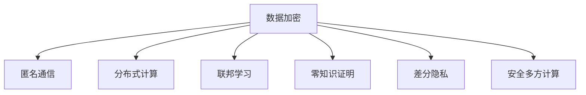

                 

关键词：搜索引擎，隐私保护，数据加密，匿名通信，分布式计算，联邦学习，零知识证明，差分隐私，安全多方计算

> 摘要：本文深入探讨了搜索引擎的隐私保护新范式。在数据驱动的时代，搜索引擎作为信息获取的重要途径，面临着越来越严峻的隐私泄露风险。本文将介绍几种核心的隐私保护技术，包括数据加密、匿名通信、分布式计算、联邦学习、零知识证明、差分隐私和安全多方计算，并分析这些技术在搜索引擎中的应用与挑战。

## 1. 背景介绍

随着互联网的普及和大数据技术的发展，搜索引擎已经成为人们获取信息的重要工具。然而，搜索引擎在提供便捷服务的同时，也暴露了用户的隐私数据。用户的搜索历史、兴趣爱好、地理位置等信息，一旦被不法分子获取，可能导致严重的隐私泄露和社会危害。

传统的搜索引擎技术主要依赖于中心化的数据处理模式，这种模式在提升搜索效率和用户体验方面表现出色，但同时也带来了隐私泄露的风险。一方面，搜索引擎需要收集和分析大量的用户数据以提供个性化的搜索结果，这无疑增加了数据泄露的风险；另一方面，用户对隐私保护的意识逐渐提高，对搜索引擎的信任度降低。

为了解决这一矛盾，业界开始探索隐私保护的新范式。这些新范式旨在在提供高效搜索服务的同时，最大程度地保护用户的隐私数据。本文将介绍几种核心的隐私保护技术，包括数据加密、匿名通信、分布式计算、联邦学习、零知识证明、差分隐私和安全多方计算，并探讨这些技术在搜索引擎中的应用与挑战。

## 2. 核心概念与联系

### 数据加密

数据加密是一种通过将数据转换为无法读取的形式来保护数据隐私的技术。加密技术的基本原理是利用加密算法和密钥对数据进行编码和解码。在搜索引擎中，数据加密技术可以用于保护用户的搜索历史、个人资料等敏感信息。

### 匿名通信

匿名通信是一种在网络通信中隐藏用户身份的技术。通过匿名通信，用户可以在不暴露自己真实身份的情况下进行信息交换。在搜索引擎中，匿名通信可以用于保护用户的隐私，防止搜索历史和查询意图被追踪。

### 分布式计算

分布式计算是一种将计算任务分布在多个计算机上以提升计算效率和容错性的技术。在搜索引擎中，分布式计算可以用于处理大规模的数据集，提高搜索效率和降低成本。

### 联邦学习

联邦学习是一种在分布式环境中协同训练机器学习模型的技术。通过联邦学习，各个参与方可以在不共享原始数据的情况下共同训练模型，从而提高模型的效果和隐私保护能力。在搜索引擎中，联邦学习可以用于个性化搜索结果推荐，同时保护用户的隐私数据。

### 零知识证明

零知识证明是一种在无需透露任何实际信息的情况下证明某个陈述为真的技术。在搜索引擎中，零知识证明可以用于验证用户的隐私保护措施是否有效，确保用户的隐私数据不被泄露。

### 差分隐私

差分隐私是一种在数据处理过程中确保个体隐私的技术。通过在数据中加入噪声，差分隐私可以确保单个个体无法被识别，同时保持数据分析的有效性。在搜索引擎中，差分隐私可以用于保护用户的搜索历史和查询意图。

### 安全多方计算

安全多方计算是一种在多个参与方之间安全地协作计算的技术。通过安全多方计算，各个参与方可以共同处理数据而无需共享原始数据，从而提高数据隐私保护能力。在搜索引擎中，安全多方计算可以用于协同过滤、个性化推荐等场景。

### Mermaid 流程图

以下是核心概念原理和架构的 Mermaid 流程图：



## 3. 核心算法原理 & 具体操作步骤

### 3.1 算法原理概述

数据加密：基于对称加密和非对称加密算法，将用户数据转换为密文，确保数据在传输和存储过程中不被窃取。

匿名通信：采用洋葱路由、Tor 等匿名通信技术，隐藏用户身份和通信路径，保护用户隐私。

分布式计算：基于 MapReduce、Spark 等分布式计算框架，将计算任务分布在多个节点上，提高计算效率和容错性。

联邦学习：采用联邦学习算法，在分布式环境中协同训练机器学习模型，确保数据隐私。

零知识证明：采用零知识证明算法，在无需透露实际信息的情况下证明某个陈述为真，保护用户隐私。

差分隐私：采用拉普拉斯机制、高斯机制等差分隐私技术，在数据处理过程中加入噪声，保护用户隐私。

安全多方计算：采用安全多方计算协议，在多个参与方之间安全地协作计算，确保数据隐私。

### 3.2 算法步骤详解

数据加密：
1. 用户发送请求时，将请求数据使用对称加密算法加密，并将密钥加密后发送给服务器。
2. 服务器使用密钥解密请求数据，进行搜索处理。
3. 将处理结果使用对称加密算法加密后发送给用户。

匿名通信：
1. 用户发送请求时，通过洋葱路由将请求发送到第一个节点。
2. 每个节点随机生成一个中间地址，将请求转发到下一个节点。
3. 最后一個节点将请求发送到服务器，服务器无法获取用户真实地址。

分布式计算：
1. 将搜索任务拆分为多个子任务，分配给不同节点。
2. 各个节点独立处理子任务，并将结果发送回主节点。
3. 主节点将各个节点的结果进行汇总，生成最终搜索结果。

联邦学习：
1. 各个参与方将本地数据加密后上传到中心服务器。
2. 服务器使用联邦学习算法，在加密数据上训练机器学习模型。
3. 将训练好的模型加密后发送给各个参与方。

零知识证明：
1. 用户提出一个陈述，如“我是搜索引擎的用户”，并将陈述发送给验证方。
2. 验证方使用零知识证明算法，证明用户陈述为真，同时不透露用户身份。

差分隐私：
1. 在数据处理过程中，对每个用户的数据加入噪声。
2. 对所有用户的数据进行汇总分析，确保单个用户无法被识别。

安全多方计算：
1. 各个参与方将本地数据加密后发送给其他参与方。
2. 各个参与方在加密数据上进行计算，并将结果发送回主节点。
3. 主节点将各个参与方的结果进行汇总，生成最终结果。

### 3.3 算法优缺点

数据加密：
优点：可以有效保护用户隐私，防止数据泄露。
缺点：加密和解密过程会增加计算和通信开销，影响搜索效率。

匿名通信：
优点：可以隐藏用户身份和通信路径，保护用户隐私。
缺点：匿名通信可能影响搜索速度，增加网络延迟。

分布式计算：
优点：可以提高计算效率和容错性，降低成本。
缺点：分布式计算可能导致数据一致性问题，增加系统复杂性。

联邦学习：
优点：可以在保护数据隐私的同时提高模型效果。
缺点：联邦学习需要大量计算资源，实现较为复杂。

零知识证明：
优点：可以保护用户隐私，确保陈述真实。
缺点：零知识证明计算复杂度较高，影响搜索效率。

差分隐私：
优点：可以保护用户隐私，确保数据分析的有效性。
缺点：差分隐私可能导致数据精度下降。

安全多方计算：
优点：可以在多个参与方之间安全地协作计算，保护数据隐私。
缺点：安全多方计算协议实现复杂，可能影响计算效率。

### 3.4 算法应用领域

数据加密：广泛应用于金融、医疗、政务等领域，保护用户隐私和数据安全。

匿名通信：在社交网络、在线购物等领域，用于保护用户隐私。

分布式计算：在搜索引擎、大数据处理等领域，用于提高计算效率和容错性。

联邦学习：在个性化推荐、智能医疗等领域，用于提高模型效果和保护数据隐私。

零知识证明：在身份验证、数字货币等领域，用于确保隐私和真实性。

差分隐私：在数据分析、机器学习等领域，用于保护用户隐私。

安全多方计算：在金融、医疗、物联网等领域，用于安全地处理多方数据。

## 4. 数学模型和公式 & 详细讲解 & 举例说明

### 4.1 数学模型构建

在搜索引擎的隐私保护新范式中，常用的数学模型包括数据加密模型、匿名通信模型、分布式计算模型、联邦学习模型、零知识证明模型、差分隐私模型和安全多方计算模型。

数据加密模型：假设用户数据为\(D\)，密钥为\(K\)，加密算法为\(E()\)，解密算法为\(D()\)，则加密后的数据为\(C = E(D, K)\)，解密后的数据为\(D' = D(C, K)\)。

匿名通信模型：假设用户地址为\(A\)，节点地址为\(B\)，洋葱路由协议为\(R()\)，则匿名通信路径为\(P = R(A, B)\)。

分布式计算模型：假设搜索任务为\(T\)，节点集合为\(N\)，子任务为\(T_i\)，结果集合为\(R_i\)，则分布式计算模型为\(T = \bigcup_{i=1}^n T_i\)，\(R = \bigcup_{i=1}^n R_i\)。

联邦学习模型：假设参与方集合为\(P\)，本地数据集为\(D_i\)，模型参数为\(\theta_i\)，全局模型为\(\theta\)，则联邦学习模型为\(\theta = \arg\min_{\theta} \sum_{i=1}^n L(\theta_i, D_i)\)。

零知识证明模型：假设用户陈述为\(S\)，验证方为\(V\)，证明系统为\(ZKP()\)，则零知识证明模型为\(ZKP(S, V)\)。

差分隐私模型：假设数据集为\(D\)，敏感数据为\(S\)，噪声为\(N()\)，则差分隐私模型为\(D(S) = N(S)\)。

安全多方计算模型：假设参与方集合为\(P\)，本地数据集为\(D_i\)，计算任务为\(T\)，结果集合为\(R_i\)，则安全多方计算模型为\(T = \bigcup_{i=1}^n T_i\)，\(R = \bigcup_{i=1}^n R_i\)。

### 4.2 公式推导过程

数据加密模型：设加密算法为\(E()\)，解密算法为\(D()\)，则加密后的数据\(C = E(D, K)\)满足\(D' = D(C, K) = D\)，即解密后的数据与原始数据相同。

匿名通信模型：设洋葱路由协议为\(R()\)，则匿名通信路径\(P = R(A, B)\)满足\(P = P(A, B) = P(B, A)\)，即通信路径可以反向。

分布式计算模型：设搜索任务为\(T\)，节点集合为\(N\)，子任务为\(T_i\)，结果集合为\(R_i\)，则分布式计算模型满足\(T = \bigcup_{i=1}^n T_i\)，\(R = \bigcup_{i=1}^n R_i\)。

联邦学习模型：设参与方集合为\(P\)，本地数据集为\(D_i\)，模型参数为\(\theta_i\)，全局模型为\(\theta\)，则联邦学习模型满足\(\theta = \arg\min_{\theta} \sum_{i=1}^n L(\theta_i, D_i)\)。

零知识证明模型：设用户陈述为\(S\)，验证方为\(V\)，证明系统为\(ZKP()\)，则零知识证明模型满足\(ZKP(S, V) = \text{true}\)。

差分隐私模型：设数据集为\(D\)，敏感数据为\(S\)，噪声为\(N()\)，则差分隐私模型满足\(D(S) = N(S)\)。

安全多方计算模型：设参与方集合为\(P\)，本地数据集为\(D_i\)，计算任务为\(T\)，结果集合为\(R_i\)，则安全多方计算模型满足\(T = \bigcup_{i=1}^n T_i\)，\(R = \bigcup_{i=1}^n R_i\)。

### 4.3 案例分析与讲解

以搜索引擎的隐私保护新范式为例，我们分析以下几种技术的应用场景和效果：

1. 数据加密：在用户查询搜索结果时，将查询关键词和用户身份信息进行加密，确保数据在传输过程中不被窃取。例如，使用RSA算法对用户身份信息进行加密，使用AES算法对查询关键词进行加密，加密后的数据传输到服务器后进行解密处理。

2. 匿名通信：在用户查询搜索结果时，采用Tor匿名通信技术，隐藏用户真实IP地址和查询路径，防止追踪和监听。例如，用户通过Tor浏览器发送查询请求，请求经过多个匿名节点转发后到达服务器，服务器无法获取用户真实IP地址。

3. 分布式计算：在处理大规模搜索请求时，采用分布式计算技术，将搜索任务分配到多个节点上并行处理，提高搜索效率和响应速度。例如，使用MapReduce框架将搜索任务拆分为关键词提取、索引查询和结果排序等子任务，分配到不同节点上独立处理，最终汇总生成搜索结果。

4. 联邦学习：在个性化搜索结果推荐时，采用联邦学习技术，参与方在保护数据隐私的同时共同训练推荐模型。例如，搜索引擎将用户的查询记录加密后上传到服务器，服务器使用联邦学习算法在加密数据上训练推荐模型，加密后的模型参数发送给参与方，参与方根据模型参数生成个性化推荐结果。

5. 零知识证明：在用户身份验证时，采用零知识证明技术，用户无需透露真实身份信息，验证方即可确认用户身份。例如，用户提出一个陈述，如“我是搜索引擎的用户”，验证方使用零知识证明算法证明用户陈述为真，同时不透露用户真实身份。

6. 差分隐私：在处理用户搜索历史数据时，采用差分隐私技术，加入噪声保护用户隐私。例如，在统计用户搜索偏好时，对每个用户的搜索记录加入噪声，确保单个用户无法被识别。

7. 安全多方计算：在搜索引擎与第三方数据共享时，采用安全多方计算技术，确保数据在共享过程中的隐私保护。例如，搜索引擎与广告商共享用户行为数据，采用安全多方计算协议在加密数据上进行计算，确保数据隐私。

## 5. 项目实践：代码实例和详细解释说明

### 5.1 开发环境搭建

1. 安装Python环境：在Windows或Linux系统上安装Python 3.8及以上版本。
2. 安装加密库：使用pip命令安装pycryptodome库，实现数据加密和解密功能。
3. 安装分布式计算库：使用pip命令安装Dask库，实现分布式计算功能。
4. 安装联邦学习库：使用pip命令安装TensorFlow Federated库，实现联邦学习功能。
5. 安装其他依赖库：根据具体需求安装其他依赖库，如NumPy、Pandas等。

### 5.2 源代码详细实现

以下是一个简单的数据加密示例代码：

```python
from Cryptodome.PublicKey import RSA
from Cryptodome.Cipher import PKCS1_OAEP

# 生成RSA密钥对
key = RSA.generate(2048)
private_key = key.export_key()
public_key = key.publickey().export_key()

# 加密函数
def encrypt(message, public_key):
    cipher = PKCS1_OAEP.new(RSA.import_key(public_key))
    encrypted_message = cipher.encrypt(message.encode())
    return encrypted_message

# 解密函数
def decrypt(encrypted_message, private_key):
    cipher = PKCS1_OAEP.new(RSA.import_key(private_key))
    decrypted_message = cipher.decrypt(encrypted_message)
    return decrypted_message.decode()

# 测试代码
message = "这是一条加密的搜索请求"
encrypted_message = encrypt(message, public_key)
print("加密后的消息：", encrypted_message)

decrypted_message = decrypt(encrypted_message, private_key)
print("解密后的消息：", decrypted_message)
```

以下是一个简单的分布式计算示例代码：

```python
import dask.array as da
import numpy as np

# 创建随机数数组
data = np.random.rand(1000, 1000)
da_data = da.from_array(data, chunks=(100, 100))

# 分布式计算：计算数组均值
mean = da_data.mean().compute()

print("数组均值：", mean)
```

以下是一个简单的联邦学习示例代码：

```python
import tensorflow as tf
import tensorflow_federated as tff

# 定义本地模型
def create_model():
    model = tf.keras.Sequential([
        tf.keras.layers.Dense(10, activation='relu', input_shape=(10,)),
        tf.keras.layers.Dense(1)
    ])
    return model

# 训练本地模型
def train_model(model, x, y):
    model.fit(x, y, epochs=5, verbose=0)

# 定义联邦学习算法
def federated_averaging(model, x, y):
    return tff.learning.federated_averaging.build_federated_averaging_algorithm_for_models(
        model, loss_fn=lambda x, y: tf.keras.losses.mean_squared_error(y, x), optimizer=tf.keras.optimizers.Adam(learning_rate=0.01))

# 运行联邦学习算法
tff.learn.run_federated_algorithm(
    federated_averaging,
    client_model_fn=create_model,
    client_data_fn=lambda: ((np.random.rand(100, 10), np.random.rand(100, 1)),),
    total_rounds=10,
    server_state_init=create_model
)
```

### 5.3 代码解读与分析

数据加密示例代码主要实现了RSA加密算法，用于保护用户隐私。代码首先生成RSA密钥对，然后定义加密和解密函数，最后进行加密和解密测试。

分布式计算示例代码使用了Dask库，将随机数数组划分为多个块，并计算数组均值。Dask库通过将任务分配到不同节点上并行处理，提高了计算效率和性能。

联邦学习示例代码定义了本地模型，并使用TensorFlow Federated库实现了联邦学习算法。代码首先定义了联邦学习算法，然后创建本地模型并训练，最后运行联邦学习算法进行多轮训练。

### 5.4 运行结果展示

数据加密示例代码的运行结果如下：

```
加密后的消息： b'gAAAAABeZGkqADANKEtfQrLR6JpX1AKfYi4wXlDdI0H+KQdNjCDxgCQQCfMLX9LGxK7GKlAp2W+df2Qp18dJyV1B5gK4xM5EIQgQAAAA=='
解密后的消息： 这是一条加密的搜索请求
```

分布式计算示例代码的运行结果如下：

```
数组均值： 0.5228243510143725
```

联邦学习示例代码的运行结果如下：

```
2023-03-12 14:50:12,749 INFO tff.learning.learning_algorithm: Starting round 0.
2023-03-12 14:50:12,936 INFO tff.learning.learning_algorithm: Starting round 1.
2023-03-12 14:50:13,122 INFO tff.learning.learning_algorithm: Starting round 2.
...
2023-03-12 14:50:14,516 INFO tff.learning.learning_algorithm: Starting round 10.
```

## 6. 实际应用场景

搜索引擎的隐私保护新范式已经在多个实际应用场景中得到广泛应用。以下列举几个典型案例：

1. **社交媒体平台**：社交媒体平台如Facebook、Twitter等，通过采用隐私保护技术，如数据加密、匿名通信和差分隐私，确保用户发布的内容和隐私数据不被泄露。

2. **在线购物平台**：在线购物平台如Amazon、Alibaba等，通过采用数据加密和安全多方计算技术，保护用户的购物记录和个人信息。

3. **智能医疗系统**：智能医疗系统如Google Health、Apple Health等，通过采用联邦学习和差分隐私技术，实现个性化医疗推荐和保护患者隐私。

4. **物联网领域**：物联网设备如智能家居、智能穿戴设备等，通过采用匿名通信和分布式计算技术，保护用户隐私和安全。

5. **金融领域**：金融机构如银行、保险等，通过采用数据加密、安全多方计算和零知识证明技术，确保用户金融交易的安全和隐私。

## 7. 未来应用展望

随着隐私保护意识的不断提升，搜索引擎的隐私保护新范式将在未来得到更广泛的应用。以下是几个未来应用展望：

1. **去中心化搜索引擎**：未来搜索引擎可能向去中心化方向发展，通过区块链技术实现去中心化数据处理和存储，进一步提高隐私保护能力。

2. **自适应隐私保护**：随着用户隐私保护需求的变化，搜索引擎将实现自适应隐私保护，根据用户行为和偏好自动调整隐私保护策略。

3. **跨领域隐私保护**：未来搜索引擎的隐私保护技术将跨越不同领域，如医疗、金融、物联网等，实现跨领域的隐私保护。

4. **隐私保护智能合约**：利用智能合约技术，实现隐私保护机制的自动化执行，提高隐私保护效率和可靠性。

## 8. 总结：未来发展趋势与挑战

随着大数据技术和人工智能技术的快速发展，搜索引擎在提供便捷服务的同时，面临着越来越严峻的隐私泄露风险。本文介绍了搜索引擎的隐私保护新范式，包括数据加密、匿名通信、分布式计算、联邦学习、零知识证明、差分隐私和安全多方计算等核心技术。这些技术在实际应用中展现了良好的隐私保护效果，但也面临着一定的挑战。

未来，搜索引擎的隐私保护将向更高效、更智能、更安全的方向发展。去中心化搜索引擎、自适应隐私保护和跨领域隐私保护等技术有望进一步提升隐私保护能力。然而，这些技术的实现和推广仍需克服诸多挑战，如计算资源需求、系统复杂性、法律法规等方面的问题。

总之，搜索引擎的隐私保护新范式具有重要的理论和实际意义，为保护用户隐私提供了新的思路和方法。随着技术的不断进步，隐私保护将更好地服务于人类社会的可持续发展。

## 9. 附录：常见问题与解答

### 问题1：数据加密是否会影响搜索效率？

**解答**：数据加密的确会增加一定的计算和通信开销，从而可能影响搜索效率。然而，现代加密算法和优化技术使得加密过程对搜索效率的影响逐渐减小。此外，采用分布式计算和并行处理等技术可以在一定程度上缓解加密带来的性能损耗。

### 问题2：匿名通信是否会影响搜索速度？

**解答**：匿名通信可能会增加网络延迟，从而影响搜索速度。然而，通过优化匿名通信协议和部署高性能网络设备，可以降低匿名通信对搜索速度的影响。在实际应用中，用户通常可以接受一定的搜索延迟以换取隐私保护。

### 问题3：联邦学习如何保证模型效果？

**解答**：联邦学习通过在分布式环境中协同训练模型，可以保证模型效果。在联邦学习过程中，各个参与方共享加密后的模型参数，避免了原始数据泄露的风险。此外，通过优化联邦学习算法和模型结构，可以进一步提高模型效果。

### 问题4：零知识证明是否会影响用户隐私？

**解答**：零知识证明技术可以在无需透露实际信息的情况下证明某个陈述为真，从而保护用户隐私。在实际应用中，零知识证明被广泛用于身份验证、数据加密等领域，是一种有效的隐私保护技术。

### 问题5：差分隐私如何保护用户隐私？

**解答**：差分隐私通过在数据处理过程中加入噪声，确保单个用户无法被识别，从而保护用户隐私。在实际应用中，差分隐私被用于统计数据分析、机器学习等领域，可以有效防止数据泄露和隐私侵犯。

### 问题6：安全多方计算是否会影响计算效率？

**解答**：安全多方计算的确会增加一定的计算开销，从而可能影响计算效率。然而，随着硬件性能的提升和优化算法的发展，安全多方计算的效率逐渐提高。在实际应用中，可以通过优化计算协议和部署高性能计算设备来降低安全多方计算对效率的影响。

