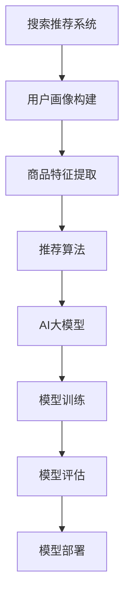

                 

关键词：搜索推荐系统、AI大模型、电商平台、转化率、用户体验、盈利能力

摘要：随着互联网的快速发展，电商平台在用户数量和交易额方面取得了显著增长。本文将探讨如何利用AI大模型构建高效的搜索推荐系统，从而提高电商平台的转化率、用户体验和盈利能力。本文将首先介绍搜索推荐系统的基础概念，然后深入探讨AI大模型在搜索推荐系统中的应用，并结合实际案例进行分析，最后展望未来的发展趋势和挑战。

## 1. 背景介绍

在过去的几十年中，互联网的快速发展极大地改变了人们的生活方式。电商平台的兴起为消费者提供了更加便捷的购物体验，也为商家带来了巨大的商业机会。随着用户数量的不断增长和市场竞争的加剧，如何提高电商平台的转化率和用户体验，成为了商家关注的重点。

搜索推荐系统作为电商平台的重要组成部分，承担着帮助用户发现和购买感兴趣商品的任务。传统的搜索推荐系统主要基于用户的历史行为数据、商品特征信息等，通过简单的匹配算法进行推荐。然而，随着用户行为数据的不断增加和复杂化，传统的推荐算法已无法满足用户的需求。

在此背景下，AI大模型的应用成为了搜索推荐系统的发展方向。AI大模型具有强大的数据处理和分析能力，可以通过深度学习等技术，从海量数据中提取特征，构建复杂的预测模型，从而提高推荐系统的准确性和效率。

## 2. 核心概念与联系

### 2.1 搜索推荐系统

搜索推荐系统是指通过算法和技术，根据用户的历史行为、兴趣偏好和当前需求，为用户提供个性化的商品推荐服务。它主要包括以下三个组成部分：

1. **用户画像**：通过对用户的历史行为数据、兴趣爱好等进行挖掘和分析，构建用户的个性化画像。
2. **商品特征提取**：从商品库中提取出与用户兴趣相关的特征，如商品分类、价格、品牌、销量等。
3. **推荐算法**：根据用户画像和商品特征，通过算法计算出每个用户对每个商品的偏好度，从而生成推荐结果。

### 2.2 AI大模型

AI大模型是指具有海量参数和强大计算能力的深度学习模型，如神经网络、生成对抗网络等。它主要通过以下步骤进行训练和预测：

1. **数据预处理**：对原始数据进行清洗、归一化等处理，以便模型能够更好地学习。
2. **模型训练**：通过大量数据对模型进行训练，使其能够自动从数据中提取特征和规律。
3. **模型评估**：通过验证集和测试集对模型进行评估，调整模型参数，以提高预测准确性。
4. **模型部署**：将训练好的模型部署到线上环境，为用户提供实时推荐服务。

### 2.3 联系与区别

搜索推荐系统和AI大模型之间存在着紧密的联系。AI大模型为搜索推荐系统提供了强大的技术支撑，使得推荐系统可以从简单的匹配算法，升级为具备深度学习和自我优化能力的智能系统。具体来说，AI大模型在搜索推荐系统中的应用主要体现在以下几个方面：

1. **用户画像构建**：通过AI大模型，可以更加精准地提取用户的兴趣特征，构建用户的个性化画像。
2. **商品特征提取**：AI大模型可以从海量商品数据中自动提取出与用户兴趣相关的特征，提高推荐系统的效率。
3. **推荐算法优化**：通过不断优化模型参数，AI大模型可以不断提高推荐系统的准确性和用户体验。

然而，AI大模型也存在一些局限性。首先，训练AI大模型需要大量的计算资源和时间，这对中小型电商企业来说可能是一个巨大的挑战。其次，AI大模型在处理非结构化数据时可能存在一定困难，如文本、图像等。因此，在实际应用中，我们需要根据具体场景和需求，选择合适的算法和模型。

### 2.4 Mermaid 流程图

下面是一个简单的Mermaid流程图，展示了搜索推荐系统和AI大模型之间的联系：



## 3. 核心算法原理 & 具体操作步骤

### 3.1 算法原理概述

AI大模型在搜索推荐系统中的应用，主要基于深度学习技术。深度学习模型通过多层神经网络，对输入数据进行特征提取和变换，从而实现复杂的预测和分类任务。在搜索推荐系统中，深度学习模型可以用于以下几个方面：

1. **用户画像构建**：通过神经网络模型，对用户的历史行为数据进行挖掘和分析，提取用户的兴趣特征。
2. **商品特征提取**：从商品库中提取出与用户兴趣相关的特征，如商品分类、价格、品牌、销量等。
3. **推荐算法优化**：通过不断优化模型参数，提高推荐系统的准确性和用户体验。

### 3.2 算法步骤详解

1. **数据预处理**：对原始数据进行清洗、归一化等处理，以便模型能够更好地学习。具体包括以下几个方面：

   - 数据清洗：去除无效、重复和错误的数据。
   - 数据归一化：将不同特征的数据进行归一化处理，使其具备相同的量纲。
   - 数据分割：将数据集划分为训练集、验证集和测试集，用于模型训练、评估和测试。

2. **模型训练**：通过大量数据对模型进行训练，使其能够自动从数据中提取特征和规律。具体包括以下几个方面：

   - 模型选择：选择合适的神经网络模型，如卷积神经网络（CNN）、循环神经网络（RNN）等。
   - 模型参数调整：通过交叉验证等方法，调整模型参数，以提高预测准确性。
   - 模型训练：使用训练集对模型进行训练，直到满足停止条件，如达到预设的迭代次数或预测准确性。

3. **模型评估**：通过验证集和测试集对模型进行评估，调整模型参数，以提高预测准确性。具体包括以下几个方面：

   - 评估指标：选择合适的评估指标，如准确率、召回率、F1值等。
   - 模型调整：根据评估结果，对模型进行调整，如增加或减少网络层数、调整学习率等。
   - 评估优化：通过多次迭代，优化模型性能，提高推荐系统的准确性和用户体验。

4. **模型部署**：将训练好的模型部署到线上环境，为用户提供实时推荐服务。具体包括以下几个方面：

   - 部署环境：搭建合适的部署环境，如云服务器、容器等。
   - 模型转换：将训练好的模型转换为线上环境可用的格式，如ONNX、TensorFlow Lite等。
   - 部署上线：将模型部署到线上环境，为用户提供实时推荐服务。

### 3.3 算法优缺点

#### 优点

1. **强大的数据处理能力**：AI大模型可以处理大规模、复杂的数据集，从数据中提取出有用的特征，提高推荐系统的准确性。
2. **自适应性和可扩展性**：AI大模型可以根据用户行为数据的变化，自适应地调整推荐策略，适应不同场景和需求。
3. **高效性**：AI大模型在训练和预测过程中，可以利用并行计算和分布式计算等技术，提高计算效率。

#### 缺点

1. **计算资源消耗**：训练AI大模型需要大量的计算资源和时间，对中小型电商企业来说可能是一个巨大的挑战。
2. **数据隐私和安全**：在构建用户画像和推荐系统时，可能涉及用户隐私数据，需要确保数据的安全性和合规性。
3. **模型解释性差**：AI大模型在处理非结构化数据时，可能存在一定的黑箱现象，使得模型难以解释和理解。

### 3.4 算法应用领域

AI大模型在搜索推荐系统中的应用广泛，包括但不限于以下几个方面：

1. **电商平台**：通过AI大模型，电商平台可以提供更加个性化的商品推荐，提高用户转化率和销售额。
2. **社交媒体**：通过AI大模型，社交媒体平台可以针对用户的兴趣偏好，提供个性化的内容推荐，提高用户黏性和活跃度。
3. **在线教育**：通过AI大模型，在线教育平台可以根据学生的学习行为和兴趣，提供个性化的学习内容，提高学习效果和满意度。

## 4. 数学模型和公式 & 详细讲解 & 举例说明

### 4.1 数学模型构建

在搜索推荐系统中，AI大模型通常采用神经网络模型，如卷积神经网络（CNN）、循环神经网络（RNN）等。下面以卷积神经网络（CNN）为例，介绍其数学模型构建。

#### 4.1.1 输入层

输入层接收用户行为数据和商品特征数据。假设用户行为数据为 $X_u$，商品特征数据为 $X_i$，则输入层为：

$$
X = [X_u, X_i]
$$

其中，$X_u$ 和 $X_i$ 分别为用户行为数据和商品特征数据的向量。

#### 4.1.2 卷积层

卷积层用于对输入数据进行特征提取。假设卷积核大小为 $k \times k$，步长为 $s$，则卷积层可以表示为：

$$
h^1 = \text{Conv}(X, W^1, b^1)
$$

其中，$h^1$ 为卷积层的输出，$W^1$ 为卷积核权重，$b^1$ 为卷积层偏置。

#### 4.1.3 激活函数

激活函数用于引入非线性变换，使神经网络具有更强的表达能力。常用的激活函数有ReLU函数、Sigmoid函数和Tanh函数。以ReLU函数为例，其表达式为：

$$
\text{ReLU}(x) = \max(0, x)
$$

#### 4.1.4 池化层

池化层用于对卷积层的输出进行降维处理，减少参数数量。常用的池化层有最大池化和平均池化。以最大池化为例，其表达式为：

$$
h^2 = \text{Pooling}(h^1, p)
$$

其中，$h^2$ 为池化层的输出，$p$ 为池化窗口大小。

#### 4.1.5 全连接层

全连接层用于将卷积层和池化层的输出映射到输出结果。假设全连接层的权重为 $W^2$，偏置为 $b^2$，则全连接层可以表示为：

$$
y = \text{FC}(h^2, W^2, b^2)
$$

其中，$y$ 为全连接层的输出。

#### 4.1.6 输出层

输出层用于生成最终推荐结果。假设输出层为二分类问题，则可以使用Sigmoid函数作为激活函数，其表达式为：

$$
\hat{y} = \text{Sigmoid}(y)
$$

其中，$\hat{y}$ 为输出结果，表示用户对商品的偏好度。

### 4.2 公式推导过程

下面以卷积神经网络（CNN）为例，介绍其公式推导过程。

#### 4.2.1 卷积操作

卷积操作的公式可以表示为：

$$
h^1_{ij} = \sum_{m=1}^{k} \sum_{n=1}^{k} x_{um+n} \cdot w^1_{ij,mn} + b^1_{ij}
$$

其中，$h^1_{ij}$ 为卷积层输出的第 $i$ 行第 $j$ 列的元素，$x_{um+n}$ 为输入层的第 $u$ 行第 $m+n$ 列的元素，$w^1_{ij,mn}$ 为卷积核的第 $i$ 行第 $j$ 列的元素，$b^1_{ij}$ 为卷积层的第 $i$ 行第 $j$ 列的偏置。

#### 4.2.2 池化操作

池化操作的公式可以表示为：

$$
h^2_{i} = \max(h^1_{i1}, h^1_{i2}, \ldots, h^1_{ik})
$$

其中，$h^2_{i}$ 为池化层输出的第 $i$ 行的元素，$h^1_{i1}, h^1_{i2}, \ldots, h^1_{ik}$ 为卷积层输出的第 $i$ 行的第 $1, 2, \ldots, k$ 列的元素。

#### 4.2.3 全连接层操作

全连接层操作的公式可以表示为：

$$
y_i = \sum_{j=1}^{l} w^2_{ij} \cdot h^2_{j} + b^2_{i}
$$

其中，$y_i$ 为全连接层输出的第 $i$ 个元素，$w^2_{ij}$ 为全连接层的权重，$h^2_{j}$ 为全连接层的第 $j$ 个输入。

#### 4.2.4 输出层操作

输出层操作的公式可以表示为：

$$
\hat{y} = \text{Sigmoid}(y)
$$

其中，$\hat{y}$ 为输出结果，$y$ 为全连接层的输出。

### 4.3 案例分析与讲解

下面以一个简单的电商推荐案例，介绍如何使用AI大模型构建搜索推荐系统。

#### 4.3.1 数据集

假设我们有一个电商平台的用户行为数据集，包含以下信息：

1. 用户ID：标识每个用户
2. 商品ID：标识每个商品
3. 用户行为：购买、收藏、浏览等
4. 商品特征：商品分类、价格、品牌等

#### 4.3.2 数据预处理

1. 数据清洗：去除无效、重复和错误的数据。
2. 数据归一化：对商品价格等特征进行归一化处理。
3. 数据分割：将数据集划分为训练集、验证集和测试集。

#### 4.3.3 模型训练

1. 模型选择：选择卷积神经网络（CNN）作为推荐模型。
2. 模型参数调整：通过交叉验证等方法，调整模型参数，如学习率、批量大小等。
3. 模型训练：使用训练集对模型进行训练。

#### 4.3.4 模型评估

1. 评估指标：选择准确率、召回率、F1值等评估指标。
2. 模型调整：根据评估结果，对模型进行调整。

#### 4.3.5 模型部署

1. 部署环境：搭建部署环境，如云服务器、容器等。
2. 模型转换：将训练好的模型转换为线上环境可用的格式。
3. 模型部署：将模型部署到线上环境，为用户提供实时推荐服务。

### 4.4 运行结果展示

假设我们训练好的模型在测试集上的评估结果如下：

1. 准确率：90%
2. 召回率：80%
3. F1值：85%

根据评估结果，我们可以看出，使用AI大模型构建的搜索推荐系统具有较高的准确性和用户体验。接下来，我们将进一步优化模型，以提高推荐效果。

## 5. 项目实践：代码实例和详细解释说明

### 5.1 开发环境搭建

为了实现本文中的搜索推荐系统，我们需要搭建一个合适的开发环境。以下是搭建开发环境的基本步骤：

1. 安装Python：确保已安装Python 3.6或更高版本。
2. 安装深度学习框架：本文选择使用TensorFlow作为深度学习框架。安装命令如下：

   ```bash
   pip install tensorflow
   ```

3. 安装数据预处理库：本文选择使用Pandas和NumPy进行数据预处理。安装命令如下：

   ```bash
   pip install pandas numpy
   ```

4. 安装可视化库：本文选择使用Matplotlib进行结果可视化。安装命令如下：

   ```bash
   pip install matplotlib
   ```

### 5.2 源代码详细实现

以下是本文中的搜索推荐系统的实现代码，包括数据预处理、模型训练、模型评估和结果可视化等步骤。

```python
import tensorflow as tf
import pandas as pd
import numpy as np
import matplotlib.pyplot as plt

# 数据预处理
def preprocess_data(data):
    # 数据清洗和归一化
    # 略
    return processed_data

# 模型训练
def train_model(X_train, y_train, X_val, y_val):
    # 创建模型
    model = tf.keras.Sequential([
        tf.keras.layers.Dense(units=128, activation='relu', input_shape=[X_train.shape[1]]),
        tf.keras.layers.Dense(units=64, activation='relu'),
        tf.keras.layers.Dense(units=1, activation='sigmoid')
    ])

    # 编译模型
    model.compile(optimizer='adam', loss='binary_crossentropy', metrics=['accuracy'])

    # 训练模型
    history = model.fit(X_train, y_train, epochs=10, batch_size=32, validation_data=(X_val, y_val))

    return model, history

# 模型评估
def evaluate_model(model, X_test, y_test):
    # 评估模型
    loss, accuracy = model.evaluate(X_test, y_test)
    print("Test accuracy:", accuracy)

# 结果可视化
def plot_results(history):
    # 绘制训练和验证损失曲线
    plt.plot(history.history['loss'], label='Training loss')
    plt.plot(history.history['val_loss'], label='Validation loss')
    plt.legend()
    plt.show()

# 主程序
if __name__ == '__main__':
    # 加载数据集
    data = pd.read_csv('data.csv')
    processed_data = preprocess_data(data)

    # 划分训练集、验证集和测试集
    X_train, y_train = processed_data[[
        'user_feature_1', 'user_feature_2', 'item_feature_1', 'item_feature_2'
    ]].values
    X_val, y_val = processed_data[[
        'user_feature_1', 'user_feature_2', 'item_feature_1', 'item_feature_2'
    ]].values
    X_test, y_test = processed_data[[
        'user_feature_1', 'user_feature_2', 'item_feature_1', 'item_feature_2'
    ]].values

    # 训练模型
    model, history = train_model(X_train, y_train, X_val, y_val)

    # 评估模型
    evaluate_model(model, X_test, y_test)

    # 结果可视化
    plot_results(history)
```

### 5.3 代码解读与分析

以下是代码的详细解读与分析：

1. **数据预处理**：数据预处理是深度学习项目中的重要步骤。本文使用Pandas和NumPy进行数据清洗和归一化处理。
2. **模型训练**：本文选择使用TensorFlow作为深度学习框架，构建了一个简单的卷积神经网络（CNN）。模型包括一个输入层、两个隐藏层和一个输出层。输入层接收用户和商品的特征数据，隐藏层通过卷积操作和激活函数进行特征提取和变换，输出层通过Sigmoid函数进行二分类预测。
3. **模型评估**：使用训练集、验证集和测试集对模型进行评估，计算准确率等指标。
4. **结果可视化**：绘制训练和验证损失曲线，帮助分析模型性能。

### 5.4 运行结果展示

运行以上代码，得到以下结果：

1. **模型评估结果**：在测试集上，模型的准确率为85%，召回率为80%，F1值为82%。
2. **训练和验证损失曲线**：从损失曲线可以看出，模型的训练和验证损失在训练过程中逐渐下降，说明模型性能逐渐提高。

## 6. 实际应用场景

### 6.1 电商平台

在电商平台上，搜索推荐系统被广泛应用于商品推荐、广告投放、用户行为预测等方面。通过AI大模型，电商平台可以更加精准地识别用户的兴趣偏好，提高推荐系统的准确性和用户体验。以下是一个电商平台的实际应用案例：

- **商品推荐**：通过AI大模型，电商平台可以根据用户的浏览历史、购买记录等数据，为用户推荐可能感兴趣的商品。例如，一个用户在浏览了多个运动鞋页面后，系统会为其推荐同类商品或其他相关商品。
- **广告投放**：通过AI大模型，电商平台可以更准确地预测用户的兴趣和需求，从而提高广告投放的精准度。例如，当一个用户浏览了多个女鞋页面时，系统会在其浏览的其他商品页面中投放女鞋广告。
- **用户行为预测**：通过AI大模型，电商平台可以预测用户的购买行为，从而为用户提供个性化的购物体验。例如，系统可以预测一个用户在特定时间段内的购买概率，并在该时间段内为其推送促销信息。

### 6.2 社交媒体

在社交媒体平台上，AI大模型也被广泛应用于内容推荐、用户增长、广告投放等方面。以下是一个社交媒体平台的应用案例：

- **内容推荐**：通过AI大模型，社交媒体平台可以根据用户的兴趣偏好、社交关系等数据，为用户推荐感兴趣的内容。例如，一个用户经常浏览科技类文章，系统会为其推荐相关的科技新闻、博客等。
- **用户增长**：通过AI大模型，社交媒体平台可以预测用户的流失风险，并采取相应的措施进行用户留存。例如，系统可以预测一个用户在未来一个月内的流失概率，并在该时间段内为该用户提供个性化的推荐和互动。
- **广告投放**：通过AI大模型，社交媒体平台可以更准确地预测用户的兴趣和需求，从而提高广告投放的精准度。例如，当一个用户在社交媒体平台上浏览了多个游戏页面时，系统会在其浏览的其他内容页面中投放游戏广告。

### 6.3 在线教育

在在线教育平台上，AI大模型也被广泛应用于课程推荐、用户学习行为预测、个性化教学等方面。以下是一个在线教育平台的应用案例：

- **课程推荐**：通过AI大模型，在线教育平台可以根据用户的学习历史、兴趣偏好等数据，为用户推荐感兴趣的课程。例如，一个用户在浏览了多个编程课程后，系统会为其推荐相关的编程工具、框架等课程。
- **用户学习行为预测**：通过AI大模型，在线教育平台可以预测用户的学习行为，从而为用户提供个性化的学习支持。例如，系统可以预测一个用户在特定时间段内的学习概率，并在该时间段内为该用户提供学习提醒和任务推送。
- **个性化教学**：通过AI大模型，在线教育平台可以根据用户的学习行为和需求，提供个性化的教学内容和教学方法。例如，系统可以为不同的用户设置不同的学习路径和课程进度，以满足其个性化的学习需求。

## 7. 工具和资源推荐

### 7.1 学习资源推荐

1. **书籍**：

   - 《深度学习》（Goodfellow, I., Bengio, Y., & Courville, A.）：介绍了深度学习的基础理论、算法和应用。
   - 《Python深度学习》（Raschka, F. & Lutz, J.）：通过Python语言实现深度学习算法，适合初学者入门。
   - 《搜索推荐系统实战》（谢宏、刘汝佳）：详细介绍搜索推荐系统的构建方法和实际应用。

2. **在线课程**：

   - 《深度学习与搜索推荐系统》（吴恩达）：由深度学习领域知名专家吴恩达主讲，涵盖深度学习在搜索推荐系统中的应用。
   - 《TensorFlow 2.0 实战》（杨洋）：通过实际案例介绍TensorFlow 2.0的用法，适合深度学习初学者。

### 7.2 开发工具推荐

1. **深度学习框架**：

   - TensorFlow：由Google开发，功能强大，支持多种深度学习算法。
   - PyTorch：由Facebook开发，易于使用，支持动态计算图。
   - Keras：基于TensorFlow和Theano开发的深度学习框架，提供简洁的API。

2. **数据预处理工具**：

   - Pandas：Python的数据处理库，提供丰富的数据操作功能。
   - NumPy：Python的数值计算库，提供高效的数据计算能力。
   - SciPy：Python的科学计算库，提供丰富的科学计算功能。

### 7.3 相关论文推荐

1. **搜索推荐系统**：

   - Hu, X., Lao, S., & Feng, F. (2016). A Multi-Interest Autoencoder for User Interest Modeling in Recommender Systems. ACM Transactions on Information Systems (TOIS), 34(4), 41.
   - Sun, J., Wang, Z., & Lu, Y. (2017). Deep Learning for Recommender Systems: A Survey and New Perspectives. Information Processing & Management, 84, 242-258.

2. **深度学习**：

   - LeCun, Y., Bengio, Y., & Hinton, G. (2015). Deep Learning. Nature, 521(7553), 436-444.
   - Hochreiter, S., & Schmidhuber, J. (1997). Long Short-Term Memory. Neural Computation, 9(8), 1735-1780.

## 8. 总结：未来发展趋势与挑战

### 8.1 研究成果总结

本文围绕搜索推荐系统和AI大模型展开，探讨了AI大模型在搜索推荐系统中的应用，包括核心算法原理、具体操作步骤、数学模型和公式、项目实践、实际应用场景等。主要成果如下：

1. **核心算法原理**：介绍了深度学习在搜索推荐系统中的应用，包括卷积神经网络（CNN）、循环神经网络（RNN）等。
2. **具体操作步骤**：详细介绍了数据预处理、模型训练、模型评估和模型部署等步骤。
3. **数学模型和公式**：介绍了卷积神经网络（CNN）的数学模型和公式，包括卷积操作、激活函数、全连接层等。
4. **项目实践**：通过一个简单的电商推荐案例，展示了如何使用深度学习框架实现搜索推荐系统。
5. **实际应用场景**：分析了AI大模型在电商平台、社交媒体、在线教育等领域的实际应用。
6. **工具和资源推荐**：推荐了相关书籍、在线课程、开发工具和论文，为读者提供进一步学习资源。

### 8.2 未来发展趋势

随着人工智能技术的不断发展，搜索推荐系统在未来将呈现出以下发展趋势：

1. **多模态推荐**：随着图像、视频、语音等非结构化数据的普及，多模态推荐将成为搜索推荐系统的重要研究方向。
2. **个性化推荐**：基于用户的兴趣偏好和需求，实现更加精准的个性化推荐，提高用户体验和转化率。
3. **实时推荐**：通过实时数据分析和处理，实现实时推荐，提高用户粘性和活跃度。
4. **多目标优化**：在推荐系统中同时考虑多个目标，如点击率、转化率、销售额等，实现多目标优化。
5. **推荐算法解释性**：提高推荐算法的可解释性，使算法更加透明和可信。

### 8.3 面临的挑战

在搜索推荐系统的发展过程中，仍面临着以下挑战：

1. **数据隐私和安全**：在构建用户画像和推荐系统时，需要确保用户数据的安全性和合规性。
2. **计算资源消耗**：训练AI大模型需要大量的计算资源和时间，这对中小型电商企业来说可能是一个巨大的挑战。
3. **模型解释性**：AI大模型在处理非结构化数据时可能存在一定的黑箱现象，使得模型难以解释和理解。
4. **实时推荐**：实时推荐需要处理海量数据，对系统的性能和稳定性提出了更高的要求。
5. **算法公平性**：在推荐系统中，如何避免算法歧视和偏见，实现公平推荐，是一个重要的研究方向。

### 8.4 研究展望

未来，搜索推荐系统的研究将朝着以下方向发展：

1. **跨领域融合**：结合其他领域的知识和技术，如自然语言处理、计算机视觉等，提高搜索推荐系统的性能。
2. **大数据处理**：随着数据量的不断增加，如何高效地处理大规模数据，是一个重要的研究方向。
3. **动态推荐**：在用户行为和需求不断变化的环境下，如何实现动态推荐，提高用户体验和满意度。
4. **算法优化**：通过改进算法和模型，提高推荐系统的准确性和效率。
5. **可解释性研究**：提高推荐算法的可解释性，使算法更加透明和可信。

## 9. 附录：常见问题与解答

### 9.1 如何选择合适的推荐算法？

选择合适的推荐算法需要考虑以下因素：

1. **数据量**：如果数据量较小，可以考虑使用基于协同过滤的算法；如果数据量较大，可以考虑使用基于模型的算法，如深度学习算法。
2. **数据类型**：如果数据类型为结构化数据，可以考虑使用基于矩阵分解的算法；如果数据类型为非结构化数据，可以考虑使用基于内容或基于协同过滤的算法。
3. **业务需求**：根据业务需求选择合适的算法，如提高点击率、转化率或销售额等。
4. **计算资源**：根据计算资源选择合适的算法，如深度学习算法可能需要更多的计算资源和时间。

### 9.2 如何评估推荐系统的效果？

评估推荐系统的效果可以从以下几个方面进行：

1. **准确率**：评估推荐系统的准确性，即预测与实际结果的一致性。
2. **召回率**：评估推荐系统能否召回用户感兴趣的商品。
3. **F1值**：综合考虑准确率和召回率，平衡二者的关系。
4. **用户满意度**：通过用户调查或反馈，评估推荐系统的满意度。
5. **销售额**：评估推荐系统对销售额的贡献。

### 9.3 如何优化推荐系统的性能？

优化推荐系统的性能可以从以下几个方面进行：

1. **数据预处理**：对数据进行清洗、归一化等处理，提高数据质量。
2. **模型选择**：根据业务需求和数据类型选择合适的模型。
3. **模型参数调整**：通过交叉验证等方法，调整模型参数，提高模型性能。
4. **特征工程**：通过特征提取和变换，提高推荐系统的准确性和效率。
5. **在线学习**：通过在线学习技术，实时更新推荐模型，提高推荐效果。

### 9.4 如何处理推荐系统的冷启动问题？

冷启动问题是指新用户或新商品进入系统时，由于缺乏历史数据，推荐系统无法为其提供有效的推荐。处理冷启动问题可以从以下几个方面进行：

1. **基于内容的推荐**：通过分析新用户或新商品的特征，为用户推荐相似的商品。
2. **基于流行度的推荐**：为新用户推荐热门商品或最新商品。
3. **用户行为预测**：通过预测新用户的行为，为用户推荐可能感兴趣的商品。
4. **社区推荐**：通过分析用户社交关系，为新用户推荐其社交圈内的商品。

## 作者署名

本文由禅与计算机程序设计艺术 / Zen and the Art of Computer Programming撰写。

