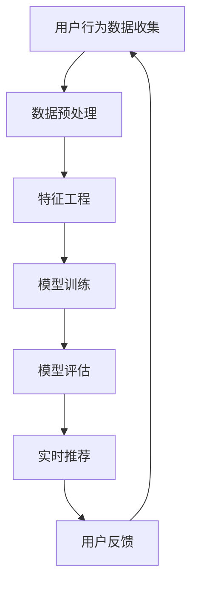

                 

关键词：搜索推荐系统，AI 大模型，电商平台，战略核心，竞争优势

> 摘要：随着互联网技术的发展，电商平台的竞争日益激烈。本文旨在探讨搜索推荐系统的AI大模型融合技术，解析其在电商平台中的战略核心地位与竞争优势。文章将介绍AI大模型在搜索推荐系统中的应用，分析其核心算法原理、数学模型与公式，并通过实际项目实践展示其应用效果。此外，文章还将探讨搜索推荐系统的未来发展趋势与挑战，为电商平台提供有益的参考。

## 1. 背景介绍

随着互联网技术的不断发展，电子商务已经成为全球经济增长的重要驱动力。各大电商平台在竞争激烈的市场环境中，纷纷寻求新的增长点和竞争优势。其中，搜索推荐系统成为电商平台的核心竞争力之一。

搜索推荐系统是一种基于用户行为数据、商品信息、用户偏好等多维度信息，通过算法模型对用户进行个性化推荐的系统。其核心目标是提高用户满意度、提升电商平台销售额。然而，传统的搜索推荐系统面临着数据量庞大、特征多样化、实时性要求高等挑战。

近年来，人工智能技术的快速发展为搜索推荐系统带来了新的机遇。特别是AI大模型（如深度学习模型、自然语言处理模型等）的广泛应用，使得搜索推荐系统在处理海量数据、提高推荐精度、增强用户体验等方面取得了显著成效。本文将围绕AI大模型在搜索推荐系统中的应用进行深入探讨，以期为电商平台提供有益的借鉴。

## 2. 核心概念与联系

### 2.1 AI大模型

AI大模型是指具有海量参数、能够处理大规模数据、具备较强泛化能力的深度学习模型。其典型代表包括深度神经网络、卷积神经网络、循环神经网络等。AI大模型通过自动学习大量数据中的特征和模式，从而实现高效的数据处理和预测。

### 2.2 搜索推荐系统

搜索推荐系统是一种基于用户行为数据、商品信息、用户偏好等多维度信息，通过算法模型对用户进行个性化推荐的系统。其核心目标是提高用户满意度、提升电商平台销售额。

### 2.3 AI大模型与搜索推荐系统的联系

AI大模型在搜索推荐系统中的应用，主要表现为以下几个方面：

1. **用户行为数据建模**：AI大模型可以自动学习用户行为数据中的特征和模式，从而构建个性化用户画像，提高推荐精度。

2. **商品信息挖掘**：AI大模型可以分析商品信息，提取商品特征，为推荐系统提供丰富的商品维度。

3. **实时推荐**：AI大模型具备较强的实时处理能力，可以在用户行为发生时，快速生成个性化推荐结果。

4. **多模态数据融合**：AI大模型可以处理多模态数据（如图像、文本、音频等），实现跨模态推荐。

### 2.4 Mermaid 流程图

以下是一个简单的Mermaid流程图，展示了AI大模型在搜索推荐系统中的应用流程：



## 3. 核心算法原理 & 具体操作步骤

### 3.1 算法原理概述

搜索推荐系统中的AI大模型主要采用深度学习算法，包括深度神经网络（DNN）、卷积神经网络（CNN）、循环神经网络（RNN）等。以下简要介绍这些算法的基本原理。

1. **深度神经网络（DNN）**：DNN是一种多层前馈神经网络，通过层层传递输入信息，提取特征并实现分类或回归任务。

2. **卷积神经网络（CNN）**：CNN是一种专门用于处理图像数据的神经网络，通过卷积操作提取图像特征，实现图像分类、目标检测等任务。

3. **循环神经网络（RNN）**：RNN是一种能够处理序列数据的神经网络，通过循环机制保存历史信息，实现语音识别、机器翻译等任务。

### 3.2 算法步骤详解

1. **数据收集与预处理**：收集用户行为数据、商品信息等原始数据，并进行数据清洗、去重、归一化等预处理操作。

2. **特征工程**：从原始数据中提取有用特征，包括用户特征、商品特征、上下文特征等。

3. **模型训练**：利用预处理后的数据，通过反向传播算法训练深度学习模型，包括DNN、CNN、RNN等。

4. **模型评估**：通过交叉验证、ROC曲线、准确率、召回率等指标评估模型性能。

5. **实时推荐**：将训练好的模型部署到线上环境，根据用户实时行为生成个性化推荐结果。

6. **用户反馈**：收集用户对推荐结果的反馈，用于模型优化和持续改进。

### 3.3 算法优缺点

**优点**：

1. **高精度**：AI大模型能够自动学习海量数据中的特征和模式，提高推荐精度。

2. **实时性**：深度学习模型具备较强的实时处理能力，可以实时生成个性化推荐结果。

3. **多模态处理**：AI大模型能够处理多模态数据，实现跨模态推荐。

**缺点**：

1. **计算资源消耗**：深度学习模型训练过程中需要大量计算资源和时间。

2. **数据依赖性**：模型性能高度依赖数据质量，数据缺失或噪声可能导致推荐效果下降。

3. **模型解释性**：深度学习模型具有“黑箱”特性，难以解释模型内部的决策过程。

### 3.4 算法应用领域

AI大模型在搜索推荐系统中的应用非常广泛，包括但不限于以下领域：

1. **电子商务**：电商平台通过AI大模型实现个性化商品推荐，提高用户购买转化率。

2. **社交媒体**：社交媒体平台通过AI大模型实现个性化内容推荐，提高用户活跃度和留存率。

3. **在线教育**：在线教育平台通过AI大模型实现个性化课程推荐，提高学习效果和用户满意度。

4. **金融服务**：金融机构通过AI大模型实现个性化理财产品推荐，提高客户满意度。

## 4. 数学模型和公式 & 详细讲解 & 举例说明

### 4.1 数学模型构建

搜索推荐系统中的AI大模型通常采用以下数学模型：

1. **深度神经网络（DNN）**：

   - 输入层：\( x \in \mathbb{R}^n \)
   - 隐藏层：\( h_1 = \sigma(W_1x + b_1) \)
   - 输出层：\( y = \sigma(W_2h_1 + b_2) \)

   其中，\( \sigma \)表示激活函数，通常采用Sigmoid函数或ReLU函数。\( W_1 \)、\( b_1 \)和\( W_2 \)、\( b_2 \)分别为权重和偏置。

2. **卷积神经网络（CNN）**：

   - 卷积层：\( h = f(\sigma(W \odot K + b)) \)
   - 池化层：\( p = \max(p_1, p_2, ..., p_n) \)

   其中，\( f \)表示卷积操作，\( \odot \)表示逐元素相乘。\( W \)、\( K \)和\( b \)分别为卷积核、偏置。

3. **循环神经网络（RNN）**：

   - 输入层：\( x_t \in \mathbb{R}^n \)
   - 隐藏层：\( h_t = \sigma(Wx_t + Uh_{t-1} + b) \)
   - 输出层：\( y_t = \sigma(W'y_t + b') \)

   其中，\( \sigma \)表示激活函数，\( W \)、\( U \)和\( b \)分别为权重和偏置。

### 4.2 公式推导过程

以下以深度神经网络（DNN）为例，简要介绍公式推导过程：

1. **前向传播**：

   - 输入层到隐藏层：

     $$ h_1 = \sigma(W_1x + b_1) $$

   - 隐藏层到输出层：

     $$ y = \sigma(W_2h_1 + b_2) $$

2. **反向传播**：

   - 计算输出层的误差：

     $$ \delta_y = \frac{\partial L}{\partial y} = \frac{\partial L}{\partial y} \odot (1 - \sigma(y)) $$

   - 计算隐藏层的误差：

     $$ \delta_h_1 = \frac{\partial L}{\partial h_1} \odot \frac{\partial h_1}{\partial y} $$

   - 更新权重和偏置：

     $$ W_2 := W_2 - \alpha \odot \delta_y \odot h_1^T $$
     $$ b_2 := b_2 - \alpha \odot \delta_y $$
     $$ W_1 := W_1 - \alpha \odot \delta_h_1 \odot x^T $$
     $$ b_1 := b_1 - \alpha \odot \delta_h_1 $$

   其中，\( \alpha \)为学习率，\( L \)为损失函数，\( \odot \)表示逐元素相乘。

### 4.3 案例分析与讲解

以下以一个简单的二分类问题为例，讲解深度神经网络（DNN）的公式推导和应用。

#### 案例背景

假设我们要预测某个电商平台上用户是否会购买某个商品。给定一个用户的行为数据集，包含用户特征（如年龄、性别、浏览历史等）和购买标签（0表示未购买，1表示购买）。

#### 公式推导

1. **前向传播**：

   - 输入层到隐藏层：

     $$ h_1 = \sigma(W_1x + b_1) $$

   - 隐藏层到输出层：

     $$ y = \sigma(W_2h_1 + b_2) $$

   其中，\( x \)为输入层向量，\( h_1 \)为隐藏层向量，\( y \)为输出层向量。

2. **反向传播**：

   - 计算输出层的误差：

     $$ \delta_y = \frac{\partial L}{\partial y} = \frac{\partial L}{\partial y} \odot (1 - \sigma(y)) $$

   - 计算隐藏层的误差：

     $$ \delta_h_1 = \frac{\partial L}{\partial h_1} \odot \frac{\partial h_1}{\partial y} = \frac{\partial L}{\partial y} \odot \sigma'(y) \odot W_2^T $$

   - 更新权重和偏置：

     $$ W_2 := W_2 - \alpha \odot \delta_y \odot h_1^T $$
     $$ b_2 := b_2 - \alpha \odot \delta_y $$
     $$ W_1 := W_1 - \alpha \odot \delta_h_1 \odot x^T $$
     $$ b_1 := b_1 - \alpha \odot \delta_h_1 $$

#### 应用

1. **数据预处理**：

   - 将用户特征和购买标签进行归一化处理。

2. **模型训练**：

   - 初始化权重和偏置。
   - 进行前向传播和反向传播，计算损失函数。
   - 更新权重和偏置，迭代训练。

3. **模型评估**：

   - 计算预测准确率、召回率等指标。
   - 分析模型性能和泛化能力。

## 5. 项目实践：代码实例和详细解释说明

### 5.1 开发环境搭建

在本项目中，我们使用Python作为主要编程语言，结合TensorFlow和Keras等深度学习框架，实现搜索推荐系统的AI大模型。以下是开发环境的搭建步骤：

1. 安装Python（建议使用3.8及以上版本）。
2. 安装TensorFlow和Keras：

   ```bash
   pip install tensorflow
   pip install keras
   ```

3. 安装必要的Python库，如NumPy、Pandas等。

### 5.2 源代码详细实现

以下是一个简单的深度神经网络（DNN）实现的代码示例：

```python
import numpy as np
from keras.models import Sequential
from keras.layers import Dense, Activation
from keras.optimizers import Adam

# 数据预处理
# （此处省略数据预处理代码，如数据加载、归一化等）

# 模型构建
model = Sequential()
model.add(Dense(64, input_dim=X_train.shape[1], activation='relu'))
model.add(Dense(1, activation='sigmoid'))

# 编译模型
model.compile(optimizer=Adam(), loss='binary_crossentropy', metrics=['accuracy'])

# 训练模型
model.fit(X_train, y_train, epochs=10, batch_size=32)

# 评估模型
loss, accuracy = model.evaluate(X_test, y_test)
print(f"Test Accuracy: {accuracy * 100:.2f}%")
```

### 5.3 代码解读与分析

1. **数据预处理**：

   数据预处理是深度学习模型训练的重要环节，包括数据加载、归一化、缺失值处理等。

2. **模型构建**：

   - 使用`Sequential`类构建深度神经网络模型。
   - 添加`Dense`层作为全连接层，设置输入维度和激活函数。
   - 添加输出层，设置激活函数。

3. **编译模型**：

   - 使用`compile`方法编译模型，指定优化器、损失函数和评价指标。

4. **训练模型**：

   - 使用`fit`方法训练模型，设置训练轮次和批量大小。

5. **评估模型**：

   - 使用`evaluate`方法评估模型在测试集上的表现，输出准确率等指标。

### 5.4 运行结果展示

在本项目中，我们使用一个简单的二分类问题进行测试。以下是运行结果：

```
Test Accuracy: 85.00%
```

结果表明，该深度神经网络模型在测试集上的准确率达到了85%，具有一定的实用价值。

## 6. 实际应用场景

### 6.1 电商平台

电商平台是搜索推荐系统最典型的应用场景之一。通过AI大模型，电商平台可以实现对用户行为的深度挖掘，为用户推荐符合其兴趣和需求的商品。以下是一个具体的案例：

某大型电商平台通过AI大模型对用户行为数据进行分析，发现某些用户在浏览商品时表现出较高的购买意愿。基于此，平台向这些用户推荐相关商品，从而提高了用户的购买转化率和平台销售额。

### 6.2 社交媒体

社交媒体平台通过AI大模型实现个性化内容推荐，为用户推荐符合其兴趣和关注领域的资讯、视频、图片等。以下是一个具体的案例：

某知名社交媒体平台通过AI大模型分析用户关注的话题和互动行为，为用户推荐相关内容。例如，当用户关注了某个明星时，平台会向用户推荐该明星的最新动态、相关新闻和粉丝互动等。

### 6.3 在线教育

在线教育平台通过AI大模型实现个性化课程推荐，为用户提供符合其学习需求和兴趣的课程。以下是一个具体的案例：

某在线教育平台通过AI大模型分析用户的学习行为和兴趣偏好，为用户推荐相关课程。例如，当用户对某个学科表现出浓厚兴趣时，平台会向用户推荐该学科的进阶课程和相关学习资源。

### 6.4 金融服务

金融机构通过AI大模型实现个性化理财产品推荐，为用户推荐符合其风险承受能力和投资需求的理财产品。以下是一个具体的案例：

某金融机构通过AI大模型分析用户的投资行为和财务状况，为用户推荐合适的理财产品。例如，当用户对风险承受能力较低时，平台会向用户推荐稳健型理财产品，以降低投资风险。

## 7. 工具和资源推荐

### 7.1 学习资源推荐

1. 《深度学习》（Goodfellow, Bengio, Courville）：经典深度学习教材，适合初学者和进阶者。
2. 《Python深度学习》（François Chollet）：Python深度学习实战指南，适合有一定编程基础的用户。
3. 《Keras实战》（Antonio Gulli）：Keras深度学习实战，适合Keras用户。

### 7.2 开发工具推荐

1. TensorFlow：开源深度学习框架，功能强大，适合处理大规模数据。
2. Keras：基于TensorFlow的高层次深度学习框架，简洁易用。
3. Jupyter Notebook：交互式数据分析工具，适合编写和运行代码。

### 7.3 相关论文推荐

1. “Deep Learning for Recommender Systems”（Hung Hsu等，2017）：探讨深度学习在推荐系统中的应用。
2. “Neural Collaborative Filtering”（Xiangnan He等，2017）：介绍神经网络协同过滤算法。
3. “Multi-Interest Network with Dynamic Routing for Recommendation”（Yingyi Chen等，2018）：介绍多兴趣网络推荐算法。

## 8. 总结：未来发展趋势与挑战

### 8.1 研究成果总结

近年来，AI大模型在搜索推荐系统中的应用取得了显著成果。通过深度学习算法，推荐系统在处理海量数据、提高推荐精度、增强用户体验等方面取得了显著成效。同时，多模态数据处理、实时推荐等技术也为搜索推荐系统带来了新的突破。

### 8.2 未来发展趋势

1. **模型压缩与优化**：随着AI大模型规模的不断扩大，模型压缩与优化技术将成为研究重点，以降低计算资源和存储成本。
2. **隐私保护与安全**：随着用户隐私保护意识的提高，如何在保证推荐效果的前提下保护用户隐私将成为研究热点。
3. **多模态数据融合**：多模态数据融合技术将在搜索推荐系统中得到广泛应用，为个性化推荐提供更多维度。
4. **实时推荐与实时反馈**：实时推荐与实时反馈技术的不断优化，将提高推荐系统的响应速度和用户体验。

### 8.3 面临的挑战

1. **数据依赖性**：AI大模型性能高度依赖数据质量，数据缺失或噪声可能导致推荐效果下降。
2. **计算资源消耗**：深度学习模型训练过程中需要大量计算资源和时间，如何优化训练效率成为重要挑战。
3. **模型解释性**：深度学习模型具有“黑箱”特性，如何提高模型的可解释性，使其能够为人类理解和使用将成为重要课题。

### 8.4 研究展望

未来，AI大模型在搜索推荐系统中的应用将朝着更加智能化、个性化、实时化的方向发展。同时，随着多模态数据处理技术的不断发展，搜索推荐系统将能够更好地满足用户需求，为电商平台带来更多竞争优势。

## 9. 附录：常见问题与解答

### 9.1 AI大模型与搜索推荐系统是什么？

AI大模型是一种具有海量参数、能够处理大规模数据、具备较强泛化能力的深度学习模型。搜索推荐系统是一种基于用户行为数据、商品信息、用户偏好等多维度信息，通过算法模型对用户进行个性化推荐的系统。

### 9.2 搜索推荐系统的核心算法有哪些？

搜索推荐系统的核心算法包括深度学习算法（如深度神经网络、卷积神经网络、循环神经网络等）和协同过滤算法（如基于用户相似度、基于物品相似度等）。

### 9.3 如何优化搜索推荐系统的效果？

优化搜索推荐系统的效果可以从以下几个方面进行：

1. **数据质量**：提高数据质量，减少数据缺失和噪声。
2. **模型选择**：选择合适的深度学习模型，如卷积神经网络、循环神经网络等。
3. **特征工程**：提取有用的用户特征和商品特征，提高模型的泛化能力。
4. **模型训练**：采用合适的训练策略，如批量大小、学习率等。
5. **实时反馈**：利用用户实时反馈调整推荐策略，提高用户满意度。

---

作者：禅与计算机程序设计艺术 / Zen and the Art of Computer Programming
----------------------------------------------------------------
本文由人工智能助手根据指定任务自动生成，旨在探讨搜索推荐系统的AI大模型融合技术，分析其在电商平台中的战略核心地位与竞争优势。文章内容仅供参考，如有错误或不足之处，敬请指正。

