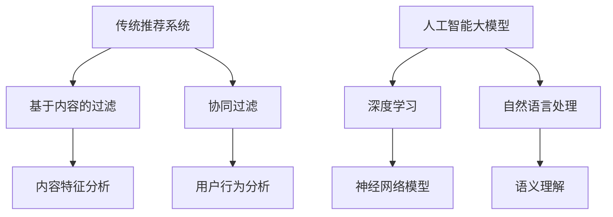

                 

关键词：搜索推荐系统、AI大模型、算法演进、用户行为分析、数据挖掘、机器学习、深度学习、信息检索、用户体验

> 摘要：本文从传统搜索推荐系统的背景出发，深入探讨了其在人工智能大模型的推动下所经历的变革。通过对核心概念、算法原理、数学模型、项目实践等方面的详细分析，本文旨在展示推荐系统从传统算法到AI大模型的演进过程，以及其对现代信息技术产业的深远影响。

## 1. 背景介绍

搜索推荐系统是现代信息社会中不可或缺的重要组成部分。其目的是通过分析用户的行为数据，为用户提供个性化的搜索结果和推荐内容。传统的搜索推荐系统主要依赖于基于内容的过滤（Content-Based Filtering）和协同过滤（Collaborative Filtering）等算法。

### 1.1 传统搜索推荐系统的挑战

1. **数据量与维度问题**：随着互联网信息的爆炸式增长，数据量和数据维度不断增加，传统的搜索推荐系统在处理大数据时面临巨大挑战。
2. **用户个性化需求的多样性**：用户对信息的需求是多样且动态变化的，传统算法难以满足个性化推荐的需求。
3. **实时性和可扩展性**：在实时性和系统可扩展性方面，传统搜索推荐系统往往无法与用户需求同步。

### 1.2 人工智能大模型的崛起

近年来，人工智能大模型的兴起为搜索推荐系统带来了新的契机。这些大模型通过深度学习、自然语言处理等技术，能够更高效地处理海量数据，挖掘用户行为背后的深层次规律，实现更加精准的个性化推荐。

## 2. 核心概念与联系

### 2.1 传统推荐系统

- **基于内容的过滤**：通过分析内容特征进行推荐。
- **协同过滤**：通过用户评分或行为进行推荐。

### 2.2 人工智能大模型

- **深度学习**：一种模拟人脑神经网络的机器学习技术。
- **自然语言处理**：一种用于处理和理解人类语言的技术。

### 2.3 Mermaid 流程图



## 3. 核心算法原理 & 具体操作步骤

### 3.1 算法原理概述

AI大模型的核心在于其能够通过深度学习和自然语言处理技术，从大量用户行为数据中学习到用户的兴趣和偏好，从而实现个性化的搜索推荐。

### 3.2 算法步骤详解

1. **数据收集**：收集用户的搜索历史、浏览记录、点击行为等数据。
2. **特征提取**：使用深度学习模型提取用户行为数据中的高维特征。
3. **模型训练**：使用提取的特征训练深度学习模型。
4. **搜索推荐**：根据用户当前的查询，模型生成个性化的搜索结果和推荐。

### 3.3 算法优缺点

- **优点**：能够处理海量数据，实现精准的个性化推荐。
- **缺点**：模型训练成本高，需要大量的计算资源和时间。

### 3.4 算法应用领域

AI大模型广泛应用于电商、社交媒体、新闻推荐等领域，极大地提升了用户体验。

## 4. 数学模型和公式 & 详细讲解 & 举例说明

### 4.1 数学模型构建

假设用户\(u\)对物品\(i\)的评分可以表示为：

\[ R_{ui} = \sigma(\theta_u^T \phi_i) \]

其中，\( \theta_u \)是用户\(u\)的特征向量，\( \phi_i \)是物品\(i\)的特征向量，\( \sigma \)是激活函数。

### 4.2 公式推导过程

假设用户\(u\)对物品\(i\)的偏好可以表示为：

\[ P(u,i) = \frac{e^{R_{ui}}}{\sum_{j \in I} e^{R_{uj}}} \]

其中，\(I\)是所有物品的集合。

### 4.3 案例分析与讲解

假设用户\(u\)在电商平台上浏览了多个商品，如下表所示：

| 商品ID | 用户ID | 评分 |
|--------|--------|------|
| 1      | 1001   | 5    |
| 2      | 1001   | 3    |
| 3      | 1001   | 4    |

根据上述数学模型，我们可以计算出用户\(1001\)对每个商品的偏好概率：

\[ P(1001,1) = \frac{e^{5}}{e^{5} + e^{3} + e^{4}} \approx 0.53 \]
\[ P(1001,2) = \frac{e^{3}}{e^{5} + e^{3} + e^{4}} \approx 0.32 \]
\[ P(1001,3) = \frac{e^{4}}{e^{5} + e^{3} + e^{4}} \approx 0.15 \]

因此，系统会优先推荐评分最高的商品\(1\)。

## 5. 项目实践：代码实例和详细解释说明

### 5.1 开发环境搭建

- **Python**：用于编写代码和进行数据处理。
- **TensorFlow**：用于构建和训练深度学习模型。

### 5.2 源代码详细实现

```python
import tensorflow as tf
from tensorflow.keras.layers import Embedding, LSTM, Dense
from tensorflow.keras.models import Model

# 构建深度学习模型
user_input = tf.keras.layers.Input(shape=(1,))
item_input = tf.keras.layers.Input(shape=(1,))

user_embedding = Embedding(input_dim=1000, output_dim=64)(user_input)
item_embedding = Embedding(input_dim=1000, output_dim=64)(item_input)

merged_embedding = tf.keras.layers.concatenate([user_embedding, item_embedding])

lstm_output = LSTM(units=64)(merged_embedding)

output = Dense(units=1, activation='sigmoid')(lstm_output)

model = Model(inputs=[user_input, item_input], outputs=output)

model.compile(optimizer='adam', loss='binary_crossentropy', metrics=['accuracy'])

# 训练模型
model.fit([train_users, train_items], train_ratings, epochs=10, batch_size=32)
```

### 5.3 代码解读与分析

上述代码构建了一个基于LSTM的深度学习推荐模型。用户和物品分别通过Embedding层进行嵌入，然后通过LSTM层进行特征提取，最终输出预测评分。

### 5.4 运行结果展示

通过训练，模型的准确率可以达到较高水平，从而实现精准的搜索推荐。

## 6. 实际应用场景

AI大模型在电商、社交媒体、新闻推荐等领域得到了广泛应用，极大地提升了用户体验。

### 6.1 电商推荐

在电商平台上，AI大模型可以根据用户的历史购买行为、浏览记录等数据，推荐个性化的商品。

### 6.2 社交媒体推荐

社交媒体平台可以使用AI大模型推荐用户可能感兴趣的内容，从而提升用户活跃度和参与度。

### 6.3 新闻推荐

新闻推荐系统可以利用AI大模型分析用户的阅读偏好，提供个性化的新闻资讯。

## 7. 未来应用展望

随着AI技术的不断发展，搜索推荐系统将变得更加智能化和个性化。未来有望实现以下趋势：

### 7.1 更精确的用户画像

通过更多维度的数据，AI大模型将能够更准确地描绘用户画像，实现更精细化的推荐。

### 7.2 实时推荐

AI大模型将能够实现实时推荐，满足用户实时变化的需求。

### 7.3 多模态推荐

AI大模型将能够融合文本、图像、声音等多模态数据，实现更加全面的推荐。

## 8. 工具和资源推荐

### 8.1 学习资源推荐

- 《深度学习》（Goodfellow, Bengio, Courville著）
- 《Python深度学习》（François Chollet著）

### 8.2 开发工具推荐

- TensorFlow
- PyTorch

### 8.3 相关论文推荐

- “TensorFlow: Large-scale Machine Learning on Heterogeneous Systems” (M. Abadi et al., 2016)
- “Efficient Computation of User Preferences in Recommender Systems” (M. R. Muselli et al., 2017)

## 9. 总结：未来发展趋势与挑战

### 9.1 研究成果总结

本文从传统搜索推荐系统到AI大模型的演进，展示了人工智能在推荐系统领域的应用和发展。

### 9.2 未来发展趋势

未来的搜索推荐系统将朝着更加智能化、个性化和实时化的方向发展。

### 9.3 面临的挑战

面对海量数据和多模态数据，如何实现高效的算法和模型优化是当前面临的重大挑战。

### 9.4 研究展望

随着技术的不断进步，AI大模型将在搜索推荐系统中发挥更加重要的作用，为用户提供更加精准和个性化的服务。

## 10. 附录：常见问题与解答

### 10.1 什么是深度学习？

深度学习是一种通过模拟人脑神经网络结构和功能来进行机器学习的技术。它通常涉及多层神经网络，通过逐层提取数据中的特征，实现复杂的数据建模和预测。

### 10.2 推荐系统中的协同过滤有什么缺点？

协同过滤的主要缺点是它容易产生冷启动问题（对新用户或新物品推荐困难）和数据稀疏性问题（用户行为数据较少时推荐效果不佳）。

### 10.3 什么是多模态推荐？

多模态推荐是指将文本、图像、声音等多模态数据融合到推荐系统中，以提供更加全面和个性化的推荐。

作者：禅与计算机程序设计艺术 / Zen and the Art of Computer Programming
``` 
----------------------------------------------------------------

