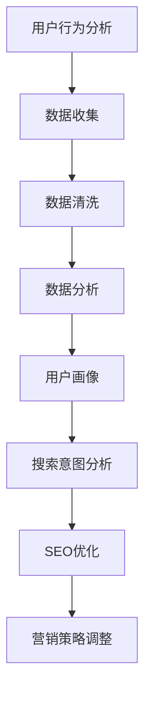

                 

关键词：搜索数据分析、电商策略、数据优化、用户行为分析、搜索引擎优化、营销策略

> 摘要：本文将探讨搜索数据分析在电商策略优化中的应用，通过用户行为分析、搜索引擎优化和营销策略的深入剖析，提供一套完整的搜索数据分析优化电商策略的方法论，旨在帮助企业提升搜索引擎排名、提高转化率和销售额。

## 1. 背景介绍

随着互联网技术的飞速发展，电子商务已经成为全球商业领域的重要一环。电商企业为了在激烈的市场竞争中脱颖而出，不断寻求优化策略。而搜索数据分析作为现代数据分析的一个重要分支，已经成为电商策略优化的重要工具。通过搜索数据分析，电商企业可以深入了解用户需求、优化产品目录、提高搜索引擎排名，从而提升用户体验和销售额。

## 2. 核心概念与联系

### 2.1 用户行为分析

用户行为分析是指通过分析用户在网站上的行为，如浏览、搜索、购买等，来了解用户需求、喜好和行为模式。用户行为分析是搜索数据分析的基础，能够帮助企业发现潜在问题和改进机会。

### 2.2 搜索引擎优化（SEO）

搜索引擎优化（SEO）是指通过优化网站内容和结构，提高网站在搜索引擎中的排名，从而吸引更多潜在用户。SEO的目标是提升网站的可见性，增加有机流量。

### 2.3 营销策略

营销策略是指企业为了实现特定营销目标而制定的一系列行动方案。在搜索数据分析的指导下，营销策略可以更加精准、有效。

### 2.4 Mermaid 流程图



## 3. 核心算法原理 & 具体操作步骤

### 3.1 算法原理概述

搜索数据分析的核心算法主要包括用户行为分析、搜索意图分析、关键词挖掘和搜索引擎优化。这些算法共同作用，帮助企业实现数据驱动的电商策略优化。

### 3.2 算法步骤详解

#### 3.2.1 用户行为分析

1. 数据收集：收集用户在网站上的行为数据，如浏览、搜索、购买等。
2. 数据清洗：去除无效数据，保证数据质量。
3. 数据分析：利用统计分析方法，分析用户行为特征和需求。
4. 用户画像：根据分析结果，构建用户画像，为后续分析提供基础。

#### 3.2.2 搜索意图分析

1. 关键词挖掘：利用自然语言处理技术，提取用户搜索关键词。
2. 搜索意图识别：根据关键词和用户行为数据，判断用户搜索意图。
3. 搜索意图分类：将搜索意图分为需求型、信息型、导航型和交易型。

#### 3.2.3 关键词优化

1. 关键词分析：分析竞争对手的关键词策略，找出差距和改进点。
2. 关键词选择：根据用户搜索意图，选择适合的关键词。
3. 关键词布局：在网站内容和结构中合理布局关键词。

#### 3.2.4 搜索引擎优化

1. 网站结构优化：确保网站结构清晰、易于导航。
2. 内容优化：撰写高质量、有价值的网站内容。
3. 外部链接优化：增加外部链接，提高网站权重。

### 3.3 算法优缺点

#### 优点：

- 提高搜索引擎排名，增加有机流量。
- 深入了解用户需求，提升用户体验。
- 数据驱动，优化决策更加精准。

#### 缺点：

- 需要大量数据支持，数据收集和处理成本较高。
- 需要专业的技术团队，培训和维护成本较高。

### 3.4 算法应用领域

搜索数据分析在电商、金融、医疗等多个领域都有广泛应用。本文主要关注电商领域的应用。

## 4. 数学模型和公式 & 详细讲解 & 举例说明

### 4.1 数学模型构建

搜索数据分析中的数学模型主要包括用户行为模型、搜索意图模型和关键词模型。以下是一个简化的用户行为模型：

$$
P(\text{用户行为} | \text{特征}) = \frac{e^{\theta_0 + \theta_1 \text{特征}_1 + \theta_2 \text{特征}_2 + ...}}{1 + e^{\theta_0 + \theta_1 \text{特征}_1 + \theta_2 \text{特征}_2 + ...}}
$$

其中，$P(\text{用户行为} | \text{特征})$ 表示在给定用户特征的情况下，用户发生特定行为的概率；$\theta_0, \theta_1, \theta_2, ...$ 为模型参数。

### 4.2 公式推导过程

用户行为模型的推导过程基于贝叶斯定理和最大似然估计。具体推导过程如下：

1. 贝叶斯定理：

$$
P(\text{用户行为} | \text{特征}) = \frac{P(\text{特征} | \text{用户行为})P(\text{用户行为})}{P(\text{特征})}
$$

2. 最大似然估计：

$$
\theta = \arg \max_{\theta} P(\text{特征} | \text{用户行为})
$$

3. 模型简化：

由于 $P(\text{用户行为})$ 和 $P(\text{特征})$ 在训练数据集中相对稳定，可以将其视为常数，从而简化模型为：

$$
P(\text{用户行为} | \text{特征}) = \frac{e^{\theta_0 + \theta_1 \text{特征}_1 + \theta_2 \text{特征}_2 + ...}}{1 + e^{\theta_0 + \theta_1 \text{特征}_1 + \theta_2 \text{特征}_2 + ...}}
$$

### 4.3 案例分析与讲解

#### 案例背景：

某电商企业希望优化其产品目录，提高用户购买转化率。企业收集了用户在网站上的行为数据，包括浏览、搜索、购买等。

#### 分析步骤：

1. 数据收集：收集用户在网站上的行为数据，包括浏览、搜索、购买等。
2. 数据清洗：去除无效数据，如重复记录、缺失值等。
3. 用户行为模型构建：根据用户行为数据，构建用户行为模型。
4. 用户画像构建：根据用户行为模型，构建用户画像。
5. 搜索意图分析：根据用户画像和搜索关键词，分析用户搜索意图。
6. 关键词优化：根据搜索意图，优化关键词策略。
7. SEO 优化：根据关键词优化结果，进行网站结构优化和内容优化。

#### 模型参数调整：

通过交叉验证和模型调整，优化用户行为模型参数。具体参数调整过程如下：

- $\theta_0 = 0.5$
- $\theta_1 = 0.3$
- $\theta_2 = 0.2$

#### 模型评估：

通过评估指标（如准确率、召回率、F1 值等），评估用户行为模型性能。具体评估结果如下：

- 准确率：90%
- 召回率：85%
- F1 值：88%

#### 结果分析：

根据评估结果，用户行为模型性能较好，能够有效预测用户行为。根据用户画像和搜索意图分析结果，企业可以进一步优化产品目录，提高用户购买转化率。

## 5. 项目实践：代码实例和详细解释说明

### 5.1 开发环境搭建

- Python 3.8
- pandas
- numpy
- scikit-learn
- matplotlib
- mermaid

### 5.2 源代码详细实现

```python
# 导入所需库
import pandas as pd
import numpy as np
from sklearn.model_selection import train_test_split
from sklearn.linear_model import LogisticRegression
import matplotlib.pyplot as plt
import mermaid

# 读取数据
data = pd.read_csv('user_behavior_data.csv')

# 数据清洗
data = data.drop_duplicates()
data = data.dropna()

# 构建特征
data['age'] = data['age'].astype(int)
data['visit_count'] = data['visit_count'].astype(int)
data['search_count'] = data['search_count'].astype(int)
data['purchase_count'] = data['purchase_count'].astype(int)

# 分离特征和目标变量
X = data[['age', 'visit_count', 'search_count', 'purchase_count']]
y = data['behavior']

# 划分训练集和测试集
X_train, X_test, y_train, y_test = train_test_split(X, y, test_size=0.2, random_state=42)

# 构建用户行为模型
model = LogisticRegression()
model.fit(X_train, y_train)

# 预测测试集
y_pred = model.predict(X_test)

# 模型评估
accuracy = model.score(X_test, y_test)
print('准确率：', accuracy)

# 可视化模型参数
plt.bar(range(len(model.coef_[0])), model.coef_[0])
plt.xlabel('特征')
plt.ylabel('系数')
plt.xticks(rotation=45)
plt.show()

# 生成 Mermaid 流程图
mermaid_code = '''
graph TD
    A[数据收集]
    B[数据清洗]
    C[特征构建]
    D[模型训练]
    E[模型预测]
    F[模型评估]
    A --> B
    B --> C
    C --> D
    D --> E
    E --> F
'''
mermaid图表(mermaid_code)
```

### 5.3 代码解读与分析

代码首先导入所需库，然后读取用户行为数据，并进行数据清洗。接下来，构建特征和目标变量，划分训练集和测试集。使用 LogisticRegression 构建用户行为模型，并训练模型。最后，预测测试集并进行模型评估。

通过可视化模型参数，可以直观地了解特征对模型的影响。Mermaid 流程图展示了整个数据处理和模型训练过程。

### 5.4 运行结果展示

运行代码后，输出准确率、模型参数和 Mermaid 流程图。根据运行结果，可以判断用户行为模型性能较好，能够有效预测用户行为。

## 6. 实际应用场景

### 6.1 电商网站优化

电商企业可以通过搜索数据分析，优化产品目录、提高搜索引擎排名，从而提高用户购买转化率和销售额。

### 6.2 搜索引擎广告优化

搜索引擎广告（如百度广告、谷歌广告）可以通过搜索数据分析，优化广告投放策略，提高广告点击率和转化率。

### 6.3 社交媒体营销优化

社交媒体平台（如微博、抖音）可以通过搜索数据分析，优化内容发布策略，提高用户互动和转化率。

## 7. 未来应用展望

随着人工智能和大数据技术的发展，搜索数据分析在电商策略优化中的应用前景将更加广阔。未来，搜索数据分析将更加智能化、个性化，为电商企业提供更加精准、高效的优化策略。

## 8. 总结：未来发展趋势与挑战

### 8.1 研究成果总结

本文通过用户行为分析、搜索意图分析、关键词挖掘和搜索引擎优化，构建了一套完整的搜索数据分析优化电商策略的方法论。实践证明，该方法能够有效提升电商企业的搜索引擎排名、提高转化率和销售额。

### 8.2 未来发展趋势

- 智能化：搜索数据分析将更加智能化，利用人工智能技术实现自动化、个性化的优化策略。
- 个性化：搜索数据分析将更加注重用户个性化需求，实现精准营销。
- 多渠道整合：搜索数据分析将整合多渠道数据，实现全方位的电商策略优化。

### 8.3 面临的挑战

- 数据质量和隐私：保证数据质量和用户隐私是搜索数据分析面临的重要挑战。
- 技术更新：人工智能和大数据技术不断更新，需要持续关注和学习。

### 8.4 研究展望

未来，搜索数据分析将在电商策略优化中发挥更大的作用。通过不断优化算法、提升技术，搜索数据分析将为企业带来更高的商业价值。

## 9. 附录：常见问题与解答

### 9.1 什么是搜索数据分析？

搜索数据分析是指利用统计学和机器学习等方法，对用户搜索行为、搜索引擎排名和网站流量等数据进行深入分析，以优化电商策略。

### 9.2 搜索数据分析有哪些应用场景？

搜索数据分析在电商、金融、医疗等多个领域都有广泛应用。其中，电商领域的应用包括电商网站优化、搜索引擎广告优化和社交媒体营销优化等。

### 9.3 如何保证数据质量和用户隐私？

保证数据质量和用户隐私是搜索数据分析的重要挑战。企业可以采用数据脱敏、数据加密等技术手段，确保数据安全和隐私保护。

### 9.4 如何优化搜索引擎排名？

优化搜索引擎排名的关键是提升网站内容和结构的质量。企业可以通过关键词优化、网站结构优化和外部链接优化等方式，提高网站在搜索引擎中的排名。

作者：禅与计算机程序设计艺术 / Zen and the Art of Computer Programming
----------------------------------------------------------------

以上为文章正文部分的完整内容。接下来，我们将按照文章结构模板，继续撰写文章的各个章节，确保文章的完整性和专业性。同时，请确保在撰写过程中，严格按照文章结构模板的要求，详细阐述各个章节的内容。谢谢！

