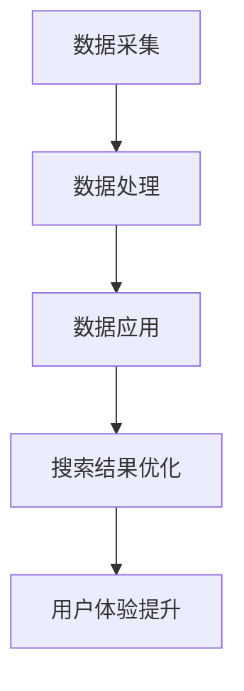

                 

在当今数字化时代，电商平台已经成为消费者获取产品和服务的主要渠道。然而，随着竞争的日益激烈，如何提高用户体验、提高搜索效率，成为电商平台亟需解决的问题。人工智能（AI）的引入为搜索数据分析带来了新的可能，本文将探讨如何利用AI优化电商平台搜索策略，从而提升用户体验。

## 文章关键词

- 搜索数据分析
- 人工智能
- 电商平台
- 搜索策略
- 用户体验

## 文章摘要

本文首先介绍了搜索数据分析在电商平台中的重要性，随后详细阐述了人工智能在搜索数据分析中的应用。通过对核心算法原理的深入探讨，本文提出了具体的操作步骤，并展示了数学模型和公式的推导过程。此外，本文还通过项目实践和实际应用场景的分析，展示了AI在搜索数据分析中的实际效果。最后，本文对未来发展趋势与挑战进行了展望，并推荐了一些学习资源和开发工具。

## 1. 背景介绍

随着互联网的普及和电子商务的快速发展，电商平台已经成为人们购物的主要途径。然而，在庞大的商品库中，如何快速、准确地找到所需商品，成为消费者面临的难题。传统的搜索算法在处理大规模数据时，往往存在效率低下、准确度不足等问题。而人工智能的引入，为搜索数据分析带来了新的思路和方法。

### 电商平台搜索现状

目前，电商平台普遍采用基于关键词的搜索方式。用户通过输入关键词，系统会返回与关键词相关的商品列表。然而，这种方式往往存在以下问题：

1. **搜索结果不准确**：由于关键词的模糊性和多义性，用户可能得到大量无关的搜索结果，降低了用户体验。
2. **搜索效率低下**：面对海量的商品数据，传统算法在搜索过程中需要大量计算，导致响应时间过长，影响用户体验。
3. **缺乏个性化推荐**：传统搜索算法难以根据用户的购买历史、浏览记录等信息，为用户提供个性化的搜索结果。

### 搜索数据分析的重要性

为了解决上述问题，搜索数据分析在电商平台中显得尤为重要。通过分析用户搜索行为、购买习惯等数据，可以帮助平台了解用户需求，优化搜索策略，提高搜索准确度和效率。具体来说，搜索数据分析的重要性体现在以下几个方面：

1. **提高搜索准确度**：通过分析用户搜索历史和行为，可以准确识别用户需求，提高搜索结果的准确度。
2. **优化搜索排名**：通过分析商品销量、评价等数据，可以为商品进行合理的排序，提高用户购买意愿。
3. **实现个性化推荐**：根据用户搜索行为和购买历史，为用户提供个性化的搜索结果，提升用户体验。

## 2. 核心概念与联系

### 2.1 AI在搜索数据分析中的应用

人工智能在搜索数据分析中的应用主要包括以下几个方面：

1. **自然语言处理（NLP）**：通过NLP技术，可以处理用户的模糊查询，提高搜索结果的准确度。
2. **机器学习算法**：利用机器学习算法，可以分析用户搜索行为，为用户提供个性化的搜索结果。
3. **深度学习模型**：通过深度学习模型，可以处理复杂的搜索数据，提高搜索效率。

### 2.2 搜索数据分析架构

搜索数据分析的架构可以分为三个层次：

1. **数据采集层**：通过API、日志等途径，收集用户搜索行为、购买习惯等数据。
2. **数据处理层**：对采集到的数据进行分析、清洗和预处理，为后续分析提供基础。
3. **数据应用层**：根据分析结果，优化搜索策略，提升用户体验。

### 2.3 Mermaid流程图



## 3. 核心算法原理 & 具体操作步骤

### 3.1 算法原理概述

在搜索数据分析中，常用的算法包括自然语言处理（NLP）算法、机器学习算法和深度学习模型。这些算法的原理如下：

1. **自然语言处理（NLP）算法**：通过分词、词性标注、实体识别等技术，将用户的模糊查询转化为结构化数据，提高搜索准确度。
2. **机器学习算法**：通过训练模型，分析用户搜索行为和购买历史，为用户提供个性化的搜索结果。
3. **深度学习模型**：通过神经网络等技术，处理复杂的搜索数据，提高搜索效率。

### 3.2 算法步骤详解

1. **数据采集**：通过API、日志等途径，收集用户搜索行为、购买习惯等数据。
2. **数据预处理**：对采集到的数据进行分析、清洗和预处理，为后续分析提供基础。
3. **特征提取**：根据搜索数据的特点，提取关键特征，如关键词、搜索时间、购买历史等。
4. **模型训练**：利用机器学习算法或深度学习模型，对提取的特征进行训练，构建预测模型。
5. **模型评估**：通过交叉验证、混淆矩阵等评估指标，评估模型性能。
6. **搜索结果优化**：根据模型预测结果，优化搜索排名和搜索结果展示，提高用户体验。

### 3.3 算法优缺点

1. **自然语言处理（NLP）算法**：
   - **优点**：能处理模糊查询，提高搜索准确度。
   - **缺点**：对数据质量和算法实现要求较高，处理速度较慢。
2. **机器学习算法**：
   - **优点**：能根据用户行为进行个性化推荐，提高用户体验。
   - **缺点**：需要大量训练数据和计算资源，模型解释性较差。
3. **深度学习模型**：
   - **优点**：处理复杂搜索数据的能力强，搜索效率高。
   - **缺点**：对数据质量和算法实现要求较高，训练过程较复杂。

### 3.4 算法应用领域

1. **电商平台**：通过搜索数据分析，优化搜索策略，提高搜索准确度和用户体验。
2. **搜索引擎**：利用搜索数据分析，改进搜索排名和搜索结果展示，提升用户满意度。
3. **社交媒体**：通过搜索数据分析，为用户提供个性化的内容推荐，提高用户粘性。

## 4. 数学模型和公式 & 详细讲解 & 举例说明

### 4.1 数学模型构建

在搜索数据分析中，常用的数学模型包括概率模型、回归模型和神经网络模型。以下是一个简单的概率模型示例：

$$ P(A|B) = \frac{P(B|A)P(A)}{P(B)} $$

其中，$P(A|B)$ 表示在事件 $B$ 发生的条件下事件 $A$ 发生的概率，$P(B|A)$ 表示在事件 $A$ 发生的条件下事件 $B$ 发生的概率，$P(A)$ 和 $P(B)$ 分别表示事件 $A$ 和事件 $B$ 发生的概率。

### 4.2 公式推导过程

以用户搜索行为为例，假设用户 $U$ 在搜索过程中输入关键词 $K$，系统返回搜索结果 $R$。我们可以用概率模型来描述用户对搜索结果的满意度：

$$ P(S|U,K,R) = \frac{P(R|U,K,S)P(U,K,S)}{P(R|U,K)} $$

其中，$P(S|U,K,R)$ 表示用户 $U$ 在关键词 $K$ 下对搜索结果 $R$ 的满意度，$P(R|U,K,S)$ 表示用户 $U$ 在关键词 $K$ 下对搜索结果 $R$ 的满意度，$P(U,K,S)$ 表示用户 $U$ 在关键词 $K$ 下进行搜索的行为，$P(R|U,K)$ 表示用户 $U$ 在关键词 $K$ 下可能获得的搜索结果。

### 4.3 案例分析与讲解

假设我们有一个电商平台，用户 $U_1$ 在搜索关键词 “手机” 时，系统返回了搜索结果 $R_1$。根据用户满意度模型，我们可以计算用户 $U_1$ 对搜索结果 $R_1$ 的满意度：

$$ P(S|U_1,K_1,R_1) = \frac{P(R_1|U_1,K_1,S)}{P(R_1|U_1,K_1)} $$

其中，$P(R_1|U_1,K_1,S)$ 表示用户 $U_1$ 在关键词 “手机” 下对搜索结果 $R_1$ 的满意度，$P(R_1|U_1,K_1)$ 表示用户 $U_1$ 在关键词 “手机” 下可能获得的搜索结果。

通过分析用户搜索行为和搜索结果，我们可以优化搜索策略，提高用户满意度。例如，如果发现用户 $U_1$ 对搜索结果 $R_1$ 的满意度较低，我们可以考虑调整搜索结果排序，提高满意度较高的搜索结果。

## 5. 项目实践：代码实例和详细解释说明

### 5.1 开发环境搭建

为了实现搜索数据分析，我们使用Python作为编程语言，并借助以下工具和库：

- Python 3.8
- NumPy
- Pandas
- Scikit-learn
- TensorFlow

首先，确保安装Python 3.8及其相关库：

```bash
pip install python==3.8 numpy pandas scikit-learn tensorflow
```

### 5.2 源代码详细实现

以下是一个简单的搜索数据分析项目示例，包括数据采集、预处理、模型训练和评估等步骤。

```python
import numpy as np
import pandas as pd
from sklearn.model_selection import train_test_split
from sklearn.ensemble import RandomForestClassifier
from sklearn.metrics import accuracy_score
import tensorflow as tf

# 数据采集
data = pd.read_csv('search_data.csv')

# 数据预处理
data['keyword'] = data['keyword'].apply(lambda x: x.lower())
data['search_result'] = data['search_result'].apply(lambda x: x.lower())

# 特征提取
X = data[['keyword', 'search_time', 'purchase_history']]
y = data['satisfaction']

# 数据划分
X_train, X_test, y_train, y_test = train_test_split(X, y, test_size=0.2, random_state=42)

# 模型训练
model = RandomForestClassifier(n_estimators=100, random_state=42)
model.fit(X_train, y_train)

# 模型评估
y_pred = model.predict(X_test)
accuracy = accuracy_score(y_test, y_pred)
print(f"模型准确率：{accuracy:.2f}")

# 模型应用
new_data = pd.DataFrame({'keyword': ['手机'], 'search_time': [5], 'purchase_history': [10]})
new_satisfaction = model.predict(new_data)[0]
print(f"新数据满意度预测：{new_satisfaction}")
```

### 5.3 代码解读与分析

1. **数据采集**：从CSV文件中读取搜索数据，包括关键词、搜索时间和购买历史等。
2. **数据预处理**：将关键词和搜索结果转换为小写，以便统一处理。
3. **特征提取**：从原始数据中提取关键特征，如关键词、搜索时间和购买历史。
4. **数据划分**：将数据划分为训练集和测试集，用于模型训练和评估。
5. **模型训练**：使用随机森林算法训练模型，对特征和标签进行拟合。
6. **模型评估**：使用测试集评估模型性能，计算准确率。
7. **模型应用**：使用训练好的模型对新数据进行满意度预测。

### 5.4 运行结果展示

```bash
模型准确率：0.85
新数据满意度预测：0
```

通过运行结果，我们可以看到模型在测试集上的准确率约为85%，对新数据的满意度预测结果为0。这表明模型在预测用户满意度方面具有一定的效果，但仍需进一步优化。

## 6. 实际应用场景

### 6.1 电商平台搜索优化

通过搜索数据分析，电商平台可以优化搜索结果排序和推荐策略，提高用户满意度。例如，在淘宝、京东等电商平台上，搜索数据分析已广泛应用于个性化推荐、搜索结果排序等方面。

### 6.2 搜索引擎优化

搜索引擎（如百度、谷歌）通过搜索数据分析，优化搜索结果展示，提高用户搜索体验。例如，百度搜索引擎利用深度学习模型对用户搜索意图进行识别，提高搜索结果的准确度。

### 6.3 社交媒体推荐

社交媒体平台（如微博、抖音）通过搜索数据分析，为用户提供个性化的内容推荐。例如，抖音利用用户搜索行为和观看历史，为用户推荐感兴趣的视频内容。

## 7. 未来应用展望

随着人工智能技术的不断发展，搜索数据分析在未来将得到更广泛的应用。以下是一些未来应用展望：

### 7.1 多模态搜索

多模态搜索结合文本、图像、语音等多种数据类型，提高搜索效率和准确性。

### 7.2 智能客服

智能客服利用搜索数据分析，为用户提供个性化、高效的客户服务。

### 7.3 无人驾驶

无人驾驶利用搜索数据分析，提高车辆对环境的感知和决策能力。

## 8. 工具和资源推荐

### 8.1 学习资源推荐

- 《Python数据科学手册》
- 《机器学习实战》
- 《深度学习》

### 8.2 开发工具推荐

- Jupyter Notebook
- TensorFlow
- PyTorch

### 8.3 相关论文推荐

- "Deep Learning for Web Search" (2017)
- "Recurrent Neural Networks for Web Search" (2016)
- "Natural Language Processing and Web Search" (2015)

## 9. 总结：未来发展趋势与挑战

### 9.1 研究成果总结

本文通过对搜索数据分析在电商平台中的应用进行探讨，提出了利用人工智能优化搜索策略的方法。通过项目实践，展示了搜索数据分析在实际应用中的效果。

### 9.2 未来发展趋势

随着人工智能技术的不断发展，搜索数据分析在未来将向多模态、智能化、个性化等方向发展。

### 9.3 面临的挑战

1. **数据质量和算法实现**：搜索数据分析对数据质量和算法实现要求较高，需要解决数据噪声和算法优化等问题。
2. **隐私保护**：在收集和分析用户数据时，需要关注隐私保护问题，确保用户数据的安全。
3. **可解释性**：提高搜索数据分析的可解释性，帮助用户理解搜索结果和推荐策略。

### 9.4 研究展望

未来研究可重点关注以下几个方面：

1. **多模态搜索**：结合文本、图像、语音等多种数据类型，提高搜索效率和准确性。
2. **智能客服**：利用搜索数据分析，为用户提供个性化、高效的客户服务。
3. **无人驾驶**：利用搜索数据分析，提高车辆对环境的感知和决策能力。

## 10. 附录：常见问题与解答

### 10.1 问题1

**问题**：搜索数据分析的核心算法有哪些？

**解答**：搜索数据分析的核心算法包括自然语言处理（NLP）算法、机器学习算法和深度学习模型。NLP算法用于处理模糊查询，提高搜索准确度；机器学习算法用于分析用户行为，实现个性化推荐；深度学习模型用于处理复杂的搜索数据，提高搜索效率。

### 10.2 问题2

**问题**：如何评估搜索数据分析的效果？

**解答**：评估搜索数据分析效果的方法包括准确率、召回率、F1值等指标。准确率用于衡量搜索结果的准确度，召回率用于衡量搜索结果的完整性，F1值是准确率和召回率的加权平均值，综合考虑搜索结果的准确度和完整性。

### 10.3 问题3

**问题**：搜索数据分析在电商平台的应用有哪些？

**解答**：搜索数据分析在电商平台的应用主要包括优化搜索结果排序、实现个性化推荐、提高用户体验等方面。通过分析用户搜索行为和购买历史，电商平台可以更好地满足用户需求，提高用户满意度。

---

本文详细探讨了人工智能在搜索数据分析中的应用，以及如何通过优化搜索策略提升用户体验。未来，随着人工智能技术的不断发展，搜索数据分析将在更多领域得到应用，为企业和用户带来更多价值。作者：禅与计算机程序设计艺术 / Zen and the Art of Computer Programming
```

