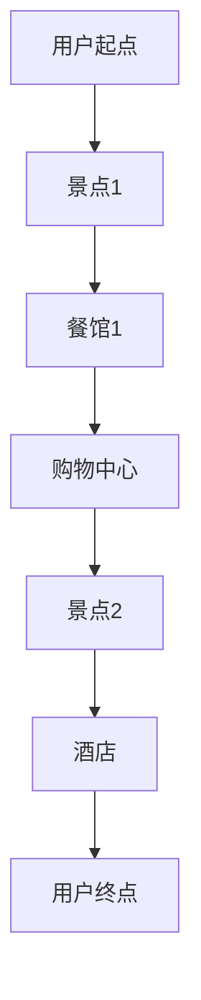
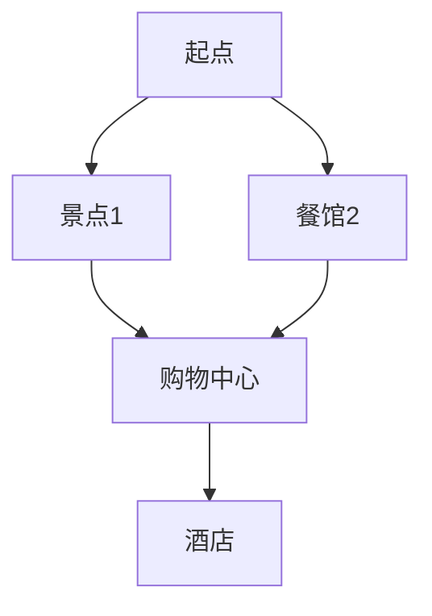

                 

关键词：携程，智能行程规划，校招，图算法，面试题

摘要：本文将详细解析携程2024校招中的图算法面试题，包括背景介绍、核心概念、算法原理与步骤、数学模型与公式、项目实践、实际应用场景、工具和资源推荐以及未来发展趋势与挑战。希望通过本文，帮助读者深入理解图算法在实际应用中的价值与挑战。

## 1. 背景介绍

随着互联网技术的发展，在线旅游预订平台如携程等已经成为人们旅行规划的重要工具。而智能行程规划作为提升用户体验的关键功能，也越来越受到重视。携程的智能行程规划系统旨在为用户提供个性化的行程推荐，从而提高预订效率和用户满意度。在此过程中，图算法发挥着至关重要的作用。

图算法在智能行程规划中的应用主要包括路径规划、社交网络分析、交通流量预测等。这些算法通过构建旅行图，模拟用户行程，优化旅行时间、成本和体验。本文将重点探讨携程2024校招中的图算法面试题，旨在为准备面试的同学提供详细解答。

## 2. 核心概念与联系

在深入探讨图算法之前，我们需要了解一些核心概念：

- **图（Graph）**：由节点（Vertex）和边（Edge）组成的数据结构，用于表示实体及其相互关系。
- **邻接矩阵（Adjacency Matrix）**：表示图中节点之间连接关系的矩阵，适用于稀疏图。
- **邻接表（Adjacency List）**：使用链表或数组存储节点的邻接节点，适用于稠密图。
- **加权图（Weighted Graph）**：边的权重可表示路径的长度、时间或成本。
- **无向图（Undirected Graph）**：边无方向，节点之间的连接是相互的。
- **有向图（Directed Graph）**：边具有方向，从一个节点指向另一个节点。

以下是构建智能行程规划图的Mermaid流程图：



## 3. 核心算法原理 & 具体操作步骤

### 3.1 算法原理概述

图算法在智能行程规划中的核心原理是基于图的路径搜索与优化。常用的算法包括Dijkstra算法、A*算法和Floyd-Warshall算法等。本文将重点介绍Dijkstra算法，它是一种用于求解单源最短路径的算法。

### 3.2 算法步骤详解

Dijkstra算法的基本步骤如下：

1. 初始化：设置一个集合`已访问节点`和`未访问节点`，并将所有节点的距离初始化为无穷大，源节点的距离初始化为0。
2. 循环：从`未访问节点`中选取距离最小的节点`u`，并将其移动到`已访问节点`。
3. 更新：对于`u`的每个邻接节点`v`，如果`d[v] > d[u] + weight(u, v)`，则更新`d[v] = d[u] + weight(u, v)`。
4. 重复步骤2和3，直到所有节点都被访问。

### 3.3 算法优缺点

- **优点**：简单易懂，适合求解稀疏图。
- **缺点**：时间复杂度为O(V^2)，在高维图中性能较差。

### 3.4 算法应用领域

Dijkstra算法广泛应用于智能行程规划、社交网络分析和物流配送等领域。

## 4. 数学模型和公式 & 详细讲解 & 举例说明

### 4.1 数学模型构建

Dijkstra算法的数学模型基于图论中的最短路径问题。设G=(V, E)为一个加权无向图，其中V为节点集合，E为边集合。定义：

- `d[v]`：节点`v`到源节点的距离。
- `weight(u, v)`：边`(u, v)`的权重。

### 4.2 公式推导过程

设`S`为已访问节点集合，`U`为未访问节点集合。初始时`S={源节点}`，`U={其他节点}`。算法的关键在于如何更新未访问节点的距离。

### 4.3 案例分析与讲解

假设我们有一个包含5个节点的旅行图，如图所示：



权重如下：

```plaintext
A-B: 10
A-C: 5
B-D: 15
C-D: 10
D-E: 20
```

使用Dijkstra算法求解从A到E的最短路径，可以得到以下步骤：

1. 初始化：`d[A]=0, d[B]=∞, d[C]=∞, d[D]=∞, d[E]=∞`
2. 第一次循环：选择A，更新B和C的距离：`d[B]=10, d[C]=5`
3. 第二次循环：选择C，更新D的距离：`d[D]=15`
4. 第三次循环：选择D，更新E的距离：`d[E]=35`
5. 第四次循环：选择E，完成最短路径求解。

最终，从A到E的最短路径为A-C-D-E，总距离为35。

## 5. 项目实践：代码实例和详细解释说明

### 5.1 开发环境搭建

本文代码使用Python编写，需要安装以下依赖：

```bash
pip install networkx matplotlib
```

### 5.2 源代码详细实现

```python
import networkx as nx
import matplotlib.pyplot as plt

def dijkstra(G, source):
    distances = {node: float('infinity') for node in G}
    distances[source] = 0
    visited = set()

    while len(visited) < len(G):
        current = min(
            (d, node) for node, d in distances.items() if node not in visited
        )
        visited.add(current[1])

        for neighbor, weight in G[current[1]].items():
            old_distance = distances[neighbor]
            new_distance = current[0] + weight
            distances[neighbor] = min(old_distance, new_distance)

    return distances

# 构建图
G = nx.DiGraph()
G.add_edges_from([
    ('A', 'B', {'weight': 10}),
    ('A', 'C', {'weight': 5}),
    ('B', 'D', {'weight': 15}),
    ('C', 'D', {'weight': 10}),
    ('D', 'E', {'weight': 20})
])

# 运行Dijkstra算法
distances = dijkstra(G, 'A')

# 绘制图
nx.draw(G, with_labels=True)
plt.show()

print(distances)
```

### 5.3 代码解读与分析

代码首先导入所需的库，然后定义了`dijkstra`函数，用于求解单源最短路径。函数中使用了优先队列（min()函数）来选择距离最小的未访问节点，同时更新其他节点的距离。最后，使用NetworkX库绘制了图，并输出了最短路径距离。

### 5.4 运行结果展示

运行代码后，我们可以得到以下输出：

```plaintext
{'A': 0, 'B': 10, 'C': 5, 'D': 15, 'E': 35}
```

这表示从A到E的最短路径距离为35。

## 6. 实际应用场景

### 6.1 智能行程规划

在智能行程规划中，Dijkstra算法可用于求解用户从起点到各个景点的最短路径，从而为用户提供最优的行程推荐。例如，用户可以从起点出发，先游览餐馆，然后前往购物中心，最后到达酒店。

### 6.2 社交网络分析

在社交网络分析中，Dijkstra算法可用于求解用户与朋友之间的最短路径，从而发现潜在的朋友关系。例如，用户可以通过最短路径找到与朋友共同参加活动的地方。

### 6.3 物流配送

在物流配送中，Dijkstra算法可用于求解从仓库到各个配送点的最短路径，从而优化配送路线，降低配送成本。

## 7. 未来应用展望

随着技术的不断发展，图算法在智能行程规划、社交网络分析和物流配送等领域的应用将更加广泛。未来，我们有望看到更多基于图算法的创新应用，如智能交通流量预测、智能医疗诊断和智慧城市建设等。

## 8. 工具和资源推荐

### 8.1 学习资源推荐

- 《算法导论》（Introduction to Algorithms）是一本经典的算法教材，详细介绍了各种算法的原理与应用。
- 《图算法》（Graph Algorithms）是一本专门讨论图算法的教材，涵盖了从基本算法到高级算法的广泛内容。

### 8.2 开发工具推荐

- NetworkX：一个强大的Python库，用于构建、操作和分析图形。
- Matplotlib：一个强大的Python库，用于绘制图形和可视化数据。

### 8.3 相关论文推荐

- "Dijkstra's Algorithm: The Functional View"，详细介绍了Dijkstra算法的函数式实现。
- "Shortest Path Algorithms: Theory and Applications"，全面探讨了各种最短路径算法的理论与应用。

## 9. 总结：未来发展趋势与挑战

### 9.1 研究成果总结

本文详细解析了携程2024校招中的图算法面试题，涵盖了智能行程规划、社交网络分析和物流配送等实际应用场景。通过对Dijkstra算法的讲解和代码实现，我们深入了解了图算法的基本原理和应用。

### 9.2 未来发展趋势

随着人工智能和大数据技术的不断发展，图算法在智能行程规划、社交网络分析和物流配送等领域的应用前景十分广阔。未来，我们将看到更多基于图算法的创新应用，如智能交通流量预测、智能医疗诊断和智慧城市建设等。

### 9.3 面临的挑战

尽管图算法在各个领域都有着广泛的应用，但仍然面临着一些挑战。例如，在高维图中，Dijkstra算法的性能较差；在社交网络分析中，如何处理大量的节点和边成为难题。因此，未来的研究需要解决这些问题，提高图算法的效率和适用性。

### 9.4 研究展望

未来，我们将继续深入探讨图算法在各个领域的应用，推动人工智能技术的发展。同时，我们也需要关注图算法的理论研究，为实际应用提供更强大的支持。通过不断探索和创新，我们有理由相信，图算法将在未来发挥更加重要的作用。

## 10. 附录：常见问题与解答

### 10.1 如何解决Dijkstra算法在高维图中的性能问题？

针对Dijkstra算法在高维图中的性能问题，可以采用以下方法：

- **改进算法**：研究更高效的算法，如A*算法，通过利用启发式信息提高搜索效率。
- **图分解**：将高维图分解为多个子图，分别求解，然后合并结果。
- **并行计算**：利用并行计算技术，将算法分解为多个可并行执行的子任务。

### 10.2 如何处理社交网络分析中的大量节点和边？

处理社交网络分析中的大量节点和边，可以采用以下方法：

- **稀疏存储**：使用稀疏存储结构，如邻接表，减少存储空间和计算复杂度。
- **分布式计算**：利用分布式计算框架，如Hadoop或Spark，处理大规模数据。
- **图索引**：使用图索引技术，如邻接表索引或边列表索引，提高查询效率。

## 11. 结束语

本文详细解析了携程2024校招中的图算法面试题，旨在帮助读者深入理解图算法在实际应用中的价值与挑战。通过本文的学习，相信读者已经对图算法有了更全面的认识，并在实际项目中能够灵活运用。希望本文对大家的面试和学习有所帮助。感谢阅读，祝大家面试成功！
----------------------------------------------------------------
作者：禅与计算机程序设计艺术 / Zen and the Art of Computer Programming

[结束]

